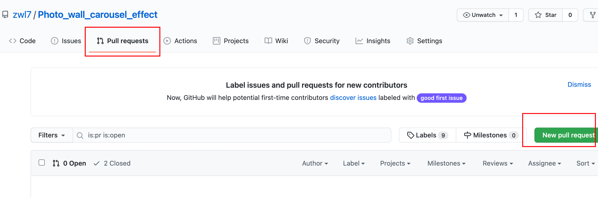
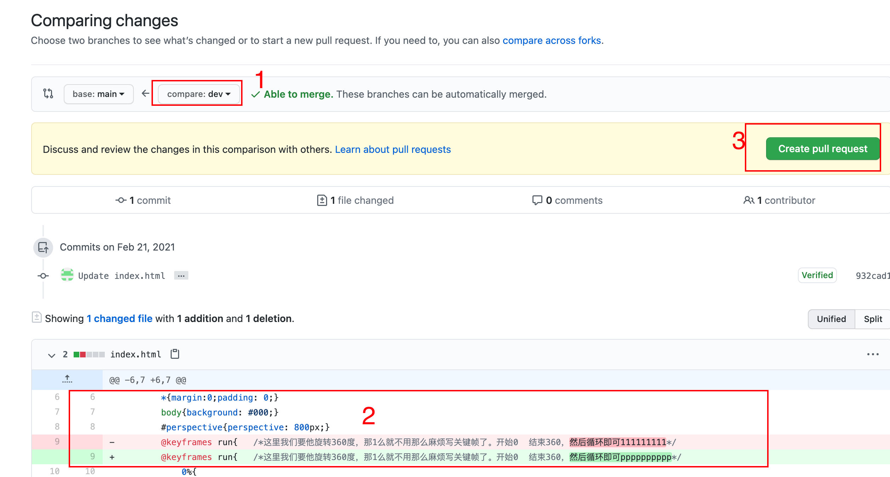
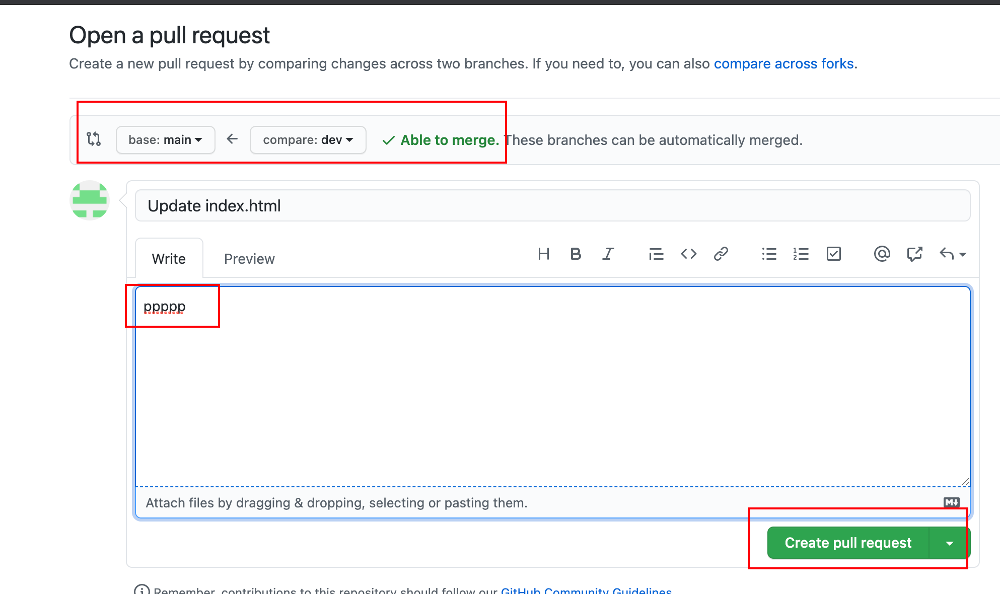
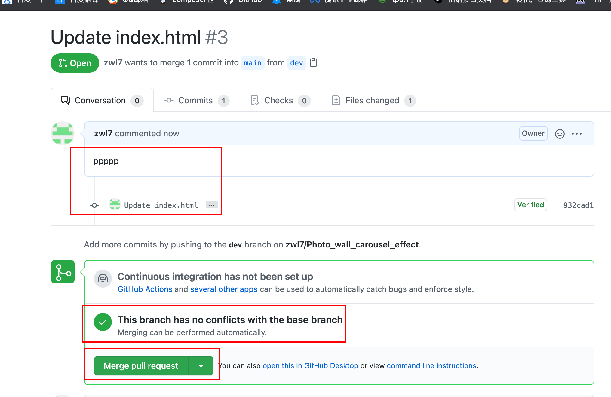
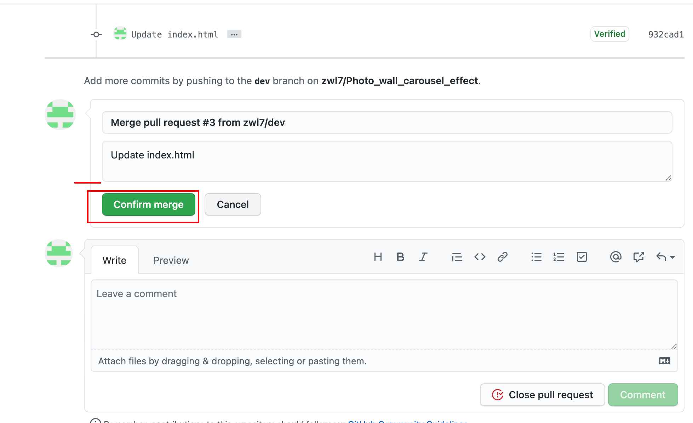
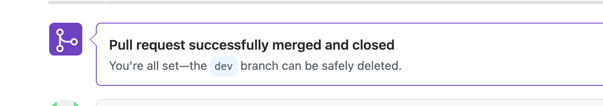
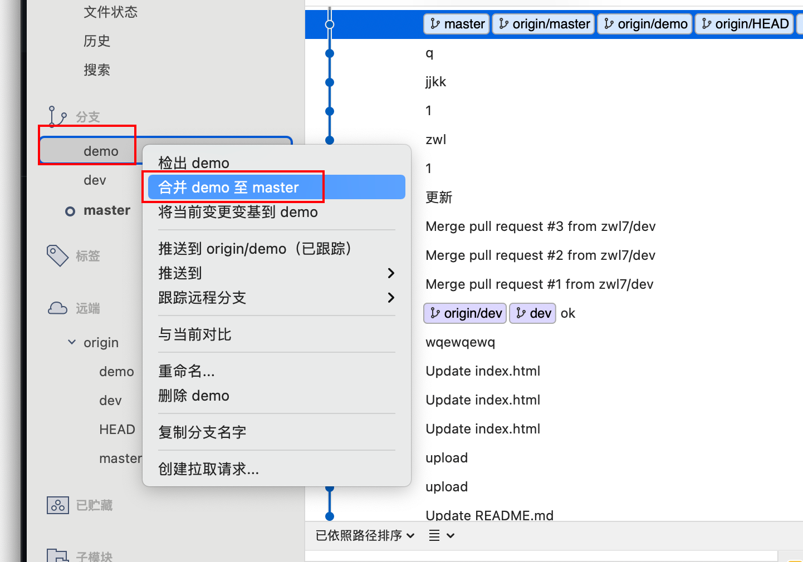
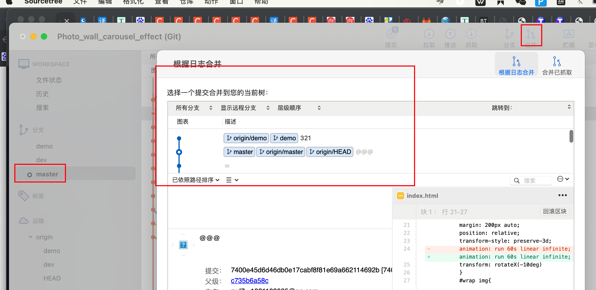

0.git配置用户名和邮箱地址

```
git config --global user.name ""
git config --global user.email ""


```

### 1.git克隆项目1123

```
例子：git clone https://github.com/HeDeHeng/InterestPHP.git
```

### 2.git回退到上一个版本

git reset --hard HEAD^
git reset --hard HEAD^
git reset --hard ac9ecca4ba258f5d97dd223cc48105af6a9b7b33
git reset --hard 279245daf1cf6ddd54f479d78b4099fa202b8354

668453431bd4dc95037af312d94122106437f7b6

git reset --hard 668453431bd4dc95037af312d94122106437f7b6

此命令只能回退。如果回退到指定的版本，拿到对应的代码之后。可以git pull拉取最新的代码。
git reset --hard 25858a9e3cdcf115e352f33675d83d005f044be3
git reset --hard 67b9fb1c2cc6554293c4e481d367bbdb302cc363


5e291e8765019c90103cd1f34c59882d050c5612

//将回退的版本，推上github
git push --force origin testing

**git强制推送本地代码到远程仓库的develop分支**
git push --force origin develop

git push --force origin master

取消当前的commit提交
git reset --soft HEAD^

git reset --soft HEAD^

​           

### 3.还原某个文件

```
git checkout 文件名，可以还原整个文件夹。
```


### 4.vscode使用git


### 5.创建分支

```
git branch 分支名
git branch dev
```

### 6.查看所在的当前分支

```
git branch
```

### 7.切换分支

```
git checkout 分支名
git checkout dev
```

### 8.推送分支到github

 git push --set-upstream origin 分支名

```
 git push --set-upstream origin dev
```

### 9.合并分支,在github上操作。

比如合并dev分支到master分支.

1.点击主分支，对应的pull request页面。然后点击图中标记的new pull request按钮



2.在1中切换对应的分支，查看2中的变化，确认无误后，点击3中的按钮。发起合并。



3.点进去后，检查对应点分支，然后填写注释，然后点击create pull request按钮。



4.检查注释。发现没有冲突，可以合并分支。然后点击merage pull request。



5.确定合并分支



6.确定合并分支。合并成功，回去主分支，发现合并成功



### 10.在sourcetree下面合并分支,还能合并指定的提交






### 11.删除分支

//删除本地分支

git branch -d <BranchName>

//删除远程分支

git push origin --delete <BranchName>


### 12修改分支名

**1. 本地分支重命名(还没有推送到远程)**

```shell
git branch -m oldName newName

git branch -m dev develop
```

**2. 远程分支重命名**

a.重命名远程分支对应的本地分支

```
git branch -m oldName newName
```

b. 删除远程分支

```shell
git push --delete origin oldName
```

c. 上传新命名的本地分支

```shell
git push origin newName
```

d.把修改后的本地分支与远程分支关联

```
git branch --set-upstream-to origin/newName
```


### 13.git保存用户名和密码

git bash进入你的项目目录，输入：

```
git config --global credential.helper store
```

然后你会在你本地生成一个文本，上边记录你的账号和密码。当然这些你可以不用关心。

然后你使用上述的命令配置好之后，再操作一次git pull，然后它会提示你输入账号密码，这一次之后就不需要再次输入密码了。


14.git Tag标签使用

#### 1.列出标签

在 Git 中列出已有的标签非常简单，只需要输入 `git tag`


#### 2.创建标签

Git 支持两种标签：轻量标签（lightweight）与附注标签（annotated）。

轻量标签很像一个不会改变的分支——它只是某个特定提交的引用。

而附注标签是存储在 Git 数据库中的一个完整对象， 它们是可以被校验的，其中包含打标签者的名字、电子邮件地址、日期时间， 此外还有一个标签信息，并且可以使用 GNU Privacy Guard （GPG）签名并验证。 通常会建议创建附注标签，这样你可以拥有以上所有信息。但是如果你只是想用一个临时的标签， 或者因为某些原因不想要保存这些信息，那么也可以用轻量标签。

#### 3.附注标签

在 Git 中创建附注标签十分简单。 最简单的方式是当你在运行 `tag` 命令时指定 `-a` 选项：

```console
$ git tag -a v1.4 -m "my version 1.4"
$ git tag
v0.1
v1.3
v1.4
```

`-m` 选项指定了一条将会存储在标签中的信息。 如果没有为附注标签指定一条信息，Git 会启动编辑器要求你输入信息。

通过使用 `git show` 命令可以看到标签信息和与之对应的提交信息：

```console
$ git show v1.4
tag v1.4
Tagger: Ben Straub <ben@straub.cc>
Date:   Sat May 3 20:19:12 2014 -0700

my version 1.4

commit ca82a6dff817ec66f44342007202690a93763949
Author: Scott Chacon <schacon@gee-mail.com>
Date:   Mon Mar 17 21:52:11 2008 -0700

    changed the version number
```

输出显示了打标签者的信息、打标签的日期时间、附注信息，然后显示具体的提交信息。

#### 4.轻量标签

另一种给提交打标签的方式是使用轻量标签。 轻量标签本质上是将提交校验和存储到一个文件中——没有保存任何其他信息。 创建轻量标签，不需要使用 `-a`、`-s` 或 `-m` 选项，只需要提供标签名字：

```console
$ git tag v1.4-lw
$ git tag
v0.1
v1.3
v1.4
v1.4-lw
v1.5
```

这时，如果在标签上运行 `git show`，你不会看到额外的标签信息。 命令只会显示出提交信息：

```console
$ git show v1.4-lw
commit ca82a6dff817ec66f44342007202690a93763949
Author: Scott Chacon <schacon@gee-mail.com>
Date:   Mon Mar 17 21:52:11 2008 -0700

    changed the version number
```

#### 5.后期打标签

你也可以对过去的提交打标签。 假设提交历史是这样的：

```console
$ git log --pretty=oneline
15027957951b64cf874c3557a0f3547bd83b3ff6 Merge branch 'experiment'
a6b4c97498bd301d84096da251c98a07c7723e65 beginning write support
0d52aaab4479697da7686c15f77a3d64d9165190 one more thing
6d52a271eda8725415634dd79daabbc4d9b6008e Merge branch 'experiment'
0b7434d86859cc7b8c3d5e1dddfed66ff742fcbc added a commit function
4682c3261057305bdd616e23b64b0857d832627b added a todo file
166ae0c4d3f420721acbb115cc33848dfcc2121a started write support
9fceb02d0ae598e95dc970b74767f19372d61af8 updated rakefile
964f16d36dfccde844893cac5b347e7b3d44abbc commit the todo
8a5cbc430f1a9c3d00faaeffd07798508422908a updated readme
```

现在，假设在 v1.2 时你忘记给项目打标签，也就是在 “updated rakefile” 提交。 你可以在之后补上标签。 要在那个提交上打标签，你需要在命令的末尾指定提交的校验和（或部分校验和）：

```console
$ git tag -a v1.2 9fceb02
```

可以看到你已经在那次提交上打上标签了：

```console
$ git tag
v0.1
v1.2
v1.3
v1.4
v1.4-lw
v1.5

$ git show v1.2
tag v1.2
Tagger: Scott Chacon <schacon@gee-mail.com>
Date:   Mon Feb 9 15:32:16 2009 -0800

version 1.2
commit 9fceb02d0ae598e95dc970b74767f19372d61af8
Author: Magnus Chacon <mchacon@gee-mail.com>
Date:   Sun Apr 27 20:43:35 2008 -0700

    updated rakefile
...
```

#### 6.共享标签(推到远程)

默认情况下，`git push` 命令并不会传送标签到远程仓库服务器上。 在创建完标签后你必须显式地推送标签到共享服务器上。 这个过程就像共享远程分支一样——你可以运行 `git push origin <tagname>`。

```console
$ git push origin v1.5
Counting objects: 14, done.
Delta compression using up to 8 threads.
Compressing objects: 100% (12/12), done.
Writing objects: 100% (14/14), 2.05 KiB | 0 bytes/s, done.
Total 14 (delta 3), reused 0 (delta 0)
To git@github.com:schacon/simplegit.git
 * [new tag]         v1.5 -> v1.5
```

如果想要一次性推送很多标签，也可以使用带有 `--tags` 选项的 `git push` 命令。 这将会把所有不在远程仓库服务器上的标签全部传送到那里。

```console
$ git push origin --tags
Counting objects: 1, done.
Writing objects: 100% (1/1), 160 bytes | 0 bytes/s, done.
Total 1 (delta 0), reused 0 (delta 0)
To git@github.com:schacon/simplegit.git
 * [new tag]         v1.4 -> v1.4
 * [new tag]         v1.4-lw -> v1.4-lw
```

现在，当其他人从仓库中克隆或拉取，他们也能得到你的那些标签。

| Note | `git push` 推送两种标签使用 `git push <remote> --tags` 推送标签并不会区分轻量标签和附注标签， 没有简单的选项能够让你只选择推送一种标签。 |
| ---- | ------------------------------------------------------------ |
|      |                                                              |

#### 7.删除标签

要删除掉你本地仓库上的标签，可以使用命令 `git tag -d <tagname>`。 例如，可以使用以下命令删除一个轻量标签：

```console
$ git tag -d v1.4-lw
Deleted tag 'v1.4-lw' (was e7d5add)
```

注意上述命令并不会从任何远程仓库中移除这个标签，你必须用 `git push <remote> :refs/tags/<tagname>` 来更新你的远程仓库：

第一种变体是 `git push <remote> :refs/tags/<tagname>` ：

```console
$ git push origin :refs/tags/v1.4-lw
To /git@github.com:schacon/simplegit.git
 - [deleted]         v1.4-lw
```

上面这种操作的含义是，将冒号前面的空值推送到远程标签名，从而高效地删除它。

第二种更直观的删除远程标签的方式是：

```console
$ git push origin --delete <tagname>
```

#### 8.检出标签

如果你想查看某个标签所指向的文件版本，可以使用 `git checkout` 命令， 虽然这会使你的仓库处于“分离头指针（detached HEAD）”的状态——这个状态有些不好的副作用：

```console
$ git checkout 2.0.0
Note: checking out '2.0.0'.

You are in 'detached HEAD' state. You can look around, make experimental
changes and commit them, and you can discard any commits you make in this
state without impacting any branches by performing another checkout.

If you want to create a new branch to retain commits you create, you may
do so (now or later) by using -b with the checkout command again. Example:

  git checkout -b <new-branch>

HEAD is now at 99ada87... Merge pull request #89 from schacon/appendix-final

$ git checkout 2.0-beta-0.1
Previous HEAD position was 99ada87... Merge pull request #89 from schacon/appendix-final
HEAD is now at df3f601... add atlas.json and cover image
```

在“分离头指针”状态下，如果你做了某些更改然后提交它们，标签不会发生变化， 但你的新提交将不属于任何分支，并且将无法访问，除非通过确切的提交哈希才能访问。 因此，如果你需要进行更改，比如你要修复旧版本中的错误，那么通常需要创建一个新分支：

```console
$ git checkout -b version2 v2.0.0
Switched to a new branch 'version2'
```

如果在这之后又进行了一次提交，`version2` 分支就会因为这个改动向前移动， 此时它就会和 `v2.0.0` 标签稍微有些不同，这时就要当心了。

git tag test

