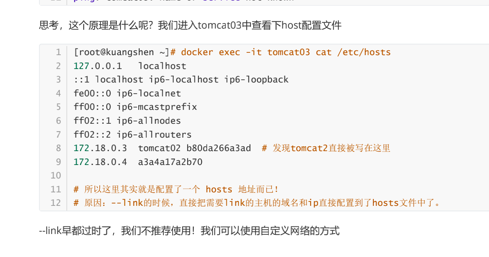

## 1.docker安装

安装链接

windows安装下载地址：https://hub.docker.com/editions/community/docker-ce-desktop-windows

阿里安装docker地址：https://help.aliyun.com/document_detail/60742.html?spm=a2c4g.11186623.6.548.131e6efcC4zVRO


环境要求

docker运行在CentOS 7或者更高的版本上，系统必须是64位，且内核版本为2.6.32-431或者更高


```
# 查看操作系统的版本号
cat /etc/redhat-release
# 查看内核版本和系统位数
uname –r
```

安装软件源和必要的一些系统工具

```shell
卸载旧版本
yum remove docker \docker-client \ docker-client-latest \ docker-common \ docker-latest \ docker-latest-logrotate \ docker-logrotate \ docker-engine
```

```


# step 1: 安装必要的一些系统工具
yum -y install gcc 
yum -y install gcc-c++
yum install -y yum-utils device-mapper-persistent-data lvm2
# Step 2: 添加软件源信息,阿里云镜像
yum-config-manager --add-repo http://mirrors.aliyun.com/docker-ce/linux/centos/docker-ce.repo
# Step 3: 更新yum软件包索引
yum makecache fast

# docker 安装的命令
yum install docker-ce docker-ce-cli containerd.io
查看docker版本信息
docker version
```

安装完毕


```
卸载
systemctl stop docker 
yum -y remove docker-ce docker-ce-cli containerd.io 
rm -rf /var/lib/docker
```


1.2 设置docker整个使用资源的情况

可以设置docker利用资源的情况，比如把cpu核数设置为8个cpu，内存占用 设置为8g


## 2.docker的启动与关闭

```
# 启动
systemctl start docker
# 停止
systemctl stop docker
# 重启
systemctl restart docker

查看是否启动完成

ps -ef | grep docker
```


简单运行一个hello-world容器，检测docker是否正常运行

```
docker run hello-world(镜像名) 
# 参数说明
- docker:  Docker 的二进制执行文件
- run:  与前面的 docker 组合来运行一个容器
- hello-world:  运行的镜像名
##
Docker首先从本地主机上查找镜像是否存在，如果不存在，Docker 就会从镜像仓库 Docker Hub 下载公共镜像
以上命令完整的意思可以解释为：Docker 以 hell-world镜像创建一个新容器，然后在容器里执行 "Hello world"，然后输出结果。

docker仓库网站：https://hub.docker.com/
类似于composer的https://packagist.org/。
```


## 3.docker命令帮助

```
docker version
docker --help   查看帮助
docker info # 显示 Docker 系统信息，包括镜像和容器数
```

菜鸟教程中的docker命令网站：https://www.runoob.com/docker/docker-command-manual.html


## 3.1docker 资源的全局的设置

1.damon.json /etc/docker/daemon.json 根据服务器配置。

```json
{
  "exec-opts": ["native.cgroupdriver=systemd"],
  "log-driver": "json-file",
  "log-opts": {
    "max-size": "100m"
  },
  "storage-driver": "overlay2",
  "storage-opts": [
  "overlay2.override_kernel_check=true"
  ],
  "default-runtime": "nvidia",
  "runtimes": {
    "nvidia": {
      "path": "nvidia-container-runtime",
      "runtimeArgs": []
    }
  },
  "registry-mirrors": ["https://your.docker.registry.mirror"],
  "insecure-registries": ["your.insecure.registry:5000"],
  "debug": true,
  "experimental": false,
  "features": {
    "buildkit": true
  },
  "builder": {
    "gc": {
      "enabled": true,
      "defaultKeepStorage": "20GB",
      "defaultKeepStoragePolicy": {
        "minKeepStorage": "10GB",
        "maxKeepStorage": "20GB"
      }
    }
  },
  "labels": ["com.example.environment=\"production\""],
  "cpu": "2",
  "memory": "2048M"
}

```


#将容器的CPU最大数量设置为8个核，一般不需要设置，不设置则默认为docker可以利用到的cpu核数最大值 默认是docker的resource的cpus配置
    #cpus: '8'
    #防止容器占用的内存过大，可以设置内存限制，最多可以占用多少m内存，一般也不需要设置，默认是docker的resource的memory配置
    #mem_limit: 100M

```
go-gin-skeleton:
    image: ginskeleton:v20240116-1635
    #将容器的CPU最大数量设置为8个核，一般不需要设置，不设置则默认为docker可以利用到的cpu核数最大值 默认是docker的resource的cpus配置
    #cpus: '8'
    #防止容器占用的内存过大，可以设置内存限制，最多可以占用多少m内存，一般也不需要设置，默认是docker的resource的memory配置
    #mem_limit: 100M
    # build:
    #   context: ../go/src/gin-skeleton
    #   dockerfile: Dockerfile
    #通过nginx转发 所以需要注释掉
    ports:
      - "6060:6060"
    #设置了，就不能动态扩展scale --scale php-cluster=2
    #container_name: go-gin-skeleton
    volumes:
      - ../go/src/gin-skeleton/conf:/www/conf/:rw
      - ../go/src/gin-skeleton/storage:/www/storage/:rw
    restart: always
    cap_add:
      - SYS_PTRACE
    depends_on:
      - mysql
      - redis
    networks:
      - default
```


## 4.镜像命令

改变成阿里云镜像源，有加速。https://azrweyoi.mirror.aliyuncs.com


查看本地镜像

```
docker images
# 常用参数
-a 列出本地所有的镜像,不写参数默认-a
-q 只显示镜像ID   只显示镜像ID的作用，主要用于镜像的删除。
```


拉取镜像

```
# 从远程仓库拉取镜像
docker pull 要拉取的镜像名[:TAG]
# 例用nginx为例
docker pull nginx:1.15.5

docker pull nginx:1.17.8
```

删除镜像

```
# 删除镜像
删除单个 docker rmi -f 镜像ID
删除多个 docker rmi –f 镜像1ID   镜像2ID   以空格隔开
删除全部 docker rmi –f `docker images –qa` docker images -qa
# 参数
-f 强制删除 可选
```

搜索镜像

```
# 搜索镜像 [root@kuangshen ~]# docker search mysql 
NAME 				DESCRIPTION 		STARS 		OFFICIAL 
mysql	 			MySQL is a widely used, open-source relation… 	9484 		[OK] 
# docker search 某个镜像的名称 对应DockerHub仓库中的镜像 
# 可选项 --filter=stars=50 ： 列出收藏数不小于指定值的镜像。
```


## 5.容器相关命令

启动容器

```
# 新建并启动容器
docker run [选项] 镜像ID [命令(例：/bin/bash,/bin/ls)] [参数1 2 3/ -a -l -h]
# options说明
--name=”容器新名称”    为容器指定一个名称
-d 后台运行容器，并返回容器ID，也即启动守护式容器,但是如果容器前台没有进程运行，只是纯后台运行，则docker容器运行完毕就关闭
-i 以交互模式运行容器，通常与-t 同时使用
-t 为容器重新分配一个输入伪终端，通常与 –i 同时使用   -it
-P 随机端口映射
-p [ip:]宿主机端口:容器端口 指定端口映射

注：如果系统中防火墙允许指定端口访问，然后还不行，就需要执行操作
echo "1" > /proc/sys/net/ipv4/ip_forward

例：
docker run –it --name myubuntu001 imageID

 docker run -d --name elasticsearch -p 9200:9200 -p 9300:9300 -e 
"discovery.type=single-node" -e ES_JAVA_OPTS="-Xms64m -Xmx512m" 
elasticsearch:7.6.2


docker run -dit --name docker-nrmp_service-fpm_1 docker-nrmp_service-fpm /bin/bash


// 创建一个新的容器并运行一个命令 这样子就可以把命令通过常驻内存的方式运行swoole
docker run -d \
--name php-activity-platform  \
--restart always \
-v /Users/zwl/dnmp/www/papa/activity-platform:/app \
-p 8162:8162 \
-w /app \
hub.wesais.cn/papa/php7.3:v1.3.3 \
/app/start-dev.sh

docker run -it e4472c56d82b /bin/sh
docker run -it 397b931b115d  /bin/sh

当项目服务被kill掉后，会自动重启～。


docker run -it \
--name php7.3-papa \
--restart always \
-v /Users/zwl/dnmp/www/papa:/app \
-p 8162:8162 -p 8160:8160 -p 8161:8161 -p 8163:8163 -p 8164:8164 -p 8165:8165 \
-w /app \
hub.wesais.cn/papa/php7.3:v1.3.3 /bin/sh
```


退出容器

```
exit 命令 容器停止退出  此命令中容器中执行
ctrl+p+q 容器不停止退出   推荐  温柔的退出  先按下ctrl,再按下p后按下q
```


列出容器

```
# 列出正在运行的容器
docker ps [options]
# options说明
不在任何参数，表示正在运行的容器

-a 列出当前所有正在运行的容器 + 历史上运行过的
-q 静默模式，只显示容器编号
```


启动已停止的容器

```
docker start 容器Id/容器名称

可以启动一个被exit停止的容器。
```


\# 重启容器

docker restart 容器Id


\# 停止应用容器  

Stop温柔的停止，如果容器正在运行使用里面服务，不可以停止

docker stop/kill(强制) 容器Id


\# 进入正在运行的容器

```
docker exec –it 容器id或容器名称 <bashShell> 默认后台写 /bin/bash 或者/bin/sh

-i :以交互的模式打开

-t :分配一个伪终端

docker exec –it 容器id /bin/bash

docker exec –it 容器id ls –l /tmp

# 命令2 docker attach 容器id
# 区别 
# exec 是在容器中打开新的终端，并且可以启动新的进程 
# attach 直接进入容器启动命令的终端，不会启动新的进程
```


\# 删除已停止的容器

```
删除单个 docker rm -f 容器ID fae04af2ff8d

删除全部 docker rm –f `docker ps –aq`		docker rm -f `docker ps -aq`
```

```
# 命令 

docker run -d 容器名 

# 例子 

docker run -d centos # 启动centos，使用后台方式启动 

# 问题： 使用docker ps 查看，发现容器已经退出了！ 

# 解释：Docker容器后台运行，就必须有一个前台进程，容器运行的命令如果不是那些一直挂起的命令，就会自动退出。 

# 比如，你运行了nginx服务，但是docker前台没有运行应用，这种情况下，容器启动后，会立即自 

杀，因为他觉得没有程序了，所以最好的情况是，将你的应用使用前台进程的方式运行启动。

docker容器运行必须有一个前台进程， 如果没有前台进程执行，容器认为空闲，就会自行退出
2、容器运行的命令如果不是那些一直挂起的命令（ 运行top，tail、循环等），就是会自动退出
3、这个是 docker 的机制问题

解决方案

方案1：
网上有很多介绍，就是起一个死循环进程，让他不停的循环下去，前台永远有进程执行，那么容器就不会退出了,以centos为例
shell>docker run -d centos /bin/sh -c "while true; do echo hello world; sleep 1; done"
缺点： 命令太冗长了，还占用一个终端

方案2：
shell>docker run -dit centos /bin/bash
添加-it 参数交互运行
添加-d 参数后台运行
这样就能启动一个一直停留在后台运行的Centos了。
```


## 6.查看容器日志

```
# 命令 具体可以用--help查看具体使用方式
docker logs -f --tail 容器id
```


## 7查看容器中的进程

```
docker top 容器id
```


## 8.查看容器的元数据,可以看到容器的全部信息

```
docker inspect 容器id
```


## 9.**从容器内拷贝文件到主机上**

```
# 命令 docker cp 容器id:容器内路径 目的主机路径
# linux复制查看，是否复制成功 
[root@kuangshen ~]# docker cp c8530dbbe3b4:/home/f1 /home 
[root@kuangshen ~]# cd /home 
[root@kuangshen home]# ls
```


## 10常用命令

```shell
 # 当前 shell 下 attach 连接指定运行镜像
1	attach    Attach to a running container 

# 通过 Dockerfile 定制镜像
2  build     Build an image from a Dockerfile 

 # 提交当前容器为新的镜像
3  commit    Create a new image from a container changes  

 #从容器中拷贝指定文件或者目录到宿主机中
4  cp        Copy files/folders from the containers filesystem to the host path 

 但不启动容器		# 创建一个新的容器，同run，但不启动容器
5  create    Create a new container

# 查看 docker 容器变化
6  diff      Inspect changes on a container's filesystem   

# 从 docker 服务获取容器实时事件
7  events    Get real time events from the server 

# 在已存在的容器上运行命令
8  exec      Run a command in an existing container 

# 导出容器的内容流作为一个 tar 归档文件[对应 import ]
9  export    Stream the contents of a container as a tar archive   

 # 展示一个镜像形成历史
10  history   Show the history of an image 

 # 列出系统当前镜像
11  images    List images

# 从tar包中的内容创建一个新的文件系统映像[对应export]
12	import    Create a new filesystem image from the contents of a tarball 

 # 显示系统相关信息
13	info      Display system-wide information 

# 查看容器详细信息
14  inspect   Return low-level information on a container   


15# kill 指定 docker容器
kill      Kill a running container 


# 从一个 tar 包中加载一个镜像[对应 save]
16  load      Load an image from a tar archive 

# 注册或者登陆一个docker 源服务器
17  login     Register or Login to the docker registry server    

# 从当前 Docker registry 退出
18  logout    Log out from a Docker registry server 
 
# 输出当前容器日志信息
19  logs      Fetch the logs of a container 

# 查看映射端口对应的容器内部源端口
20  port      Lookup the public-facing port which is NAT-ed to PRIVATE_PORT  

# 暂停容器
21  pause     Pause all processes within a container 

 # 列出容器列表
22  ps        List containers 

#从docker镜像源服务器拉取指定镜像或者库镜像
23  pull      Pull an image or a repository from the docker registry server   #

#推送指定镜像或者库镜像至docker源服务器
24  push      Push an image or a repository to the docker registry server    # 

# 重启运行的容器
25  restart    Restart a running container 

# 移除一个或者多个容器
26  rm Remove one or more containers 

# 移除一个或多个镜像[无容器使用该镜像才可删除，否则需删除相关容器才可继续或 -f 强制删除]
27  rmi 	 Remove one or more images 
 
# 创建一个新的容器并运行一个命令
28  run 
 Run a command in a new container 

# 保存一个镜像为一个tar 包[对应 load]
29  save      Save an image to a tar archive 

 # 在 docker hub 中搜索镜像
30  search    Search for an image on the Docker Hub 

# 启动容器
31  start     Start a stopped containers 

 # 停止容器
32  stop      Stop a running containers 

# 给源中镜像打标签
33  tag  Tag an image into a repository 

 # 查看容器中运行的进程信息
34  top Lookup the running processes of a container  

# 取消暂停容器
35  unpause   Unpause a paused container 

 # 查看 docker 版本号
36  version   Show the docker version information 

# 截取容器停止时的退出状态值
37  wait      Block until a container stops, then print its exit code   
```


## 11.提交镜像

```shell
docker commit 提交容器副本使之成为一个新的镜像！
# 语法
docker commit -m="提交的描述信息" -a="作者" 容器id 要创建的目标镜像名:[标签名]

# 查看容器的id
docker ps -l  

# 注意：commit的时候，容器的名字不能有大写，否则报错：invalid reference format
 docker commit -a="wenlin" -m="mkdir wenlin" 1e98a2f815b0 nginx55555:1.1
 
 docker images
 
 docker commit -a="testdemo" -m="testdemo" f4d39e9a47b4 testdemo:1.0
 
 docker commit -a="wenlin" -m="php7427" 8727710b0c08 php-7-4-27:2.0
 
```


## 12.数据卷

数据卷是一个可以供一个或多个容器使用的特殊目录(宿主机中的共享目录)。可以保存容器运行过程中产生的数据，达到主机和容器之间的数据共享，同时也可以实现多个容器之间的数据共享和持久化。

作用与特点

作用

1.容器数据的持久化

2.可在容器之间共享数据

特点

 数据卷更改可以直接生效

 数据卷中更改不会包含在镜像的更新中(数据卷只对容器)

 数据卷的生命周期一直持续到没有容器使用它为止


使用

```
docker run 命令中加 -v 选项 [针对于新建的容器]
# 用法 新建一个容器并运行且指定了数据卷

docker run –it –v /宿主机目录:/容器目录[:权限(ro只读)] [–v /宿主机目录:/容器目录[:权限(ro只读)]]  镜像名或镜像ID
# 参数
-v绑定挂载卷
# 说明
指定了权限为ro（readOnly）会，则容器中的目录只能读取，不可以进行删除、修改和创建操作, 但在宿主目录中是可以增删改查操作。
rw是可读可写,不写默认rw。

# 例：
docker run -it -P -v /var/www/html:/var/www/html nginx001
docker run -it --name ngninx07 -v /usr/local/docker:/usr/local/docker 容器id

查看容器的元数据，是否挂载成功
docker inspect cotainterid
```


mysql容器同步数据。总体思路，在run容器时，把容器中mysql 存储数据的目录，挂载出来到宿主机上。

```
mysql run容器时的配置
# 3、启动容器 -e 环境变量！ 
# 注意： mysql的数据应该不丢失！先体验下 -v 挂载卷！ 参考官方文档 
[root@kuangshen home]# docker run -d -p 3310:3306 -v /home/mysql/conf:/etc/mysql/conf.d -v /home/mysql/data:/var/lib/mysql -e MYSQL_ROOT_PASSWORD=123456 --name mysql01 mysql:5.7 

4763fa5c68c4323688102f57938fb10996a0fb902d2812349286529
```

在navicat中链接了容器中的mysql。并在mysql中新键了两个数据库。发现都同步了数据


即使删除了容器，数据还是在宿主机中，不会丢失数据。


通过dockerfile来挂在数据卷

```
# 1、我们在宿主机 /home 目录下新建一个 docker-test-volume文件夹 
[root@kuangshen home]# mkdir docker-test-volume

# 说明：在编写DockerFile文件中使用 VOLUME 指令来给镜像添加一个或多个数据卷 VOLUME["/dataVolumeContainer1","/dataVolumeContainer2","/dataVolumeContainer 3"]

# 出于可移植和分享的考虑，我们之前使用的 -v 主机目录:容器目录 这种方式不能够直接在 DockerFile中实现。 
# 由于宿主机目录是依赖于特定宿主机的，并不能够保证在所有宿主机上都存在这样的特定目录.

# 2、编写DockerFile文件
[root@kuangshen docker-test-volume]# pwd 
/home/docker-test-volume 
#编写dockerfile脚本
[root@kuangshen docker-test-volume]# vim dockerfile1  

#其中使用单引，进入到容器的根目录时没有dataVolumeContainer1和dataVolumeContainer2这两个目录。换成双引
#号才有。单引号按原样输出，双引号，可以解析字符串里面的变量。以后写shell脚本时，习惯使用双引号比较好
# volume test 
FROM centos 
VOLUME ["/dataVolumeContainer1","/dataVolumeContainer2"] 
CMD echo "-------end------" 
CMD /bin/bash

：x

#buile 根据dockerfile打包镜像，注意最后有个.
docker build -f /home/docker-test-volume/dockerfile01 -t wenlin/centos .
```


```
# 问题:通过上述步骤，容器内的卷目录地址就已经知道了，但是对应的主机目录地址在哪里呢？
通过inspect命令即可得知
```


注意：如果访问出现了 cannot open directory: Permission denied

解决办法：在挂载目录后多加一个 --privileged=true参数即可


## 13挂载的方式

1.匿名挂载


-v 容器内路径 ，匿名挂载的缺点，就是不好维护，通常使用命令 docker volume维护

```
docker run -d -P --name nginx01 -v /etc/nginx nginx 
```

2.具名挂载

```
-v 卷名:/容器内路径 
docker run -d -P --name nginx02 -v nginxconfig:/etc/nginx nginx
宿主机路径，默认挂载/var/lib/docker/volumes中
```


\# 怎么判断挂载的是卷名而不是本机目录名？ 

不是/开始就是卷名，是/开始就是目录名 


```
# 改变文件的读写权限 
# ro: readonly 
# rw: readwrite 
# 指定容器对我们挂载出来的内容的读写权限 
docker run -d -P --name nginx02 -v nginxconfig:/etc/nginx:ro nginx 
docker run -d -P --name nginx02 -v nginxconfig:/etc/nginx:rw nginx
```


## 14数据卷容器.

docker 挂载不生效，可能是文件权限的问题，把宿主机的文件权限搞成777就可以了。

命名的容器挂载数据卷，其他容器通过挂载这个（父容器）实现数据共享，挂载数据卷的容器，称之为

数据卷容器。

我们使用上一步的镜像：kuangshen/centos 为模板，运行容器 docker01，docker02，docker03，他

们都会具有容器卷


1、先启动一个父容器docker01，然后在dataVolumeContainer2新增文件。

```

容器之间配置信息的传递，数据卷的生命周期一直持续到没有容器使用它为止。
存储在本机的文件则会一直保留！
```

docker01=>wenlinCentos

2.创建docker02，docker03 让他们继承docker01 --volumes-from 

```
docker run -it --name wenlinCentos02 --volumes-from wenlinCentos wenlin/centos
```

docker02=>wenlinCentos02

分别查看docker01和docker02的数据卷挂载目录，发现都是两个容器的dataVolumeContainer2和dataVolumeContainer1都是挂在宿主机的相同目录下。进行容器间的通信


**得出结论：**

**容器之间配置信息的传递，数据卷的生命周期一直持续到没有容器使用它为止。**

**存储在本机的文件则会一直保留！**


## 15.dockerfile是什么？

大家想想，Nginx，tomcat，mysql 这些镜像都是哪里来的？官方能写，我们不能写吗？

我们要研究自己如何做一个镜像，而且我们写的微服务项目以及springboot打包上云部署，Docker就是

最方便的。

微服务打包成镜像，任何装了Docker的地方，都可以下载使用，极其的方便。

流程：开发应用=>DockerFile=>打包为镜像=>上传到仓库（私有仓库，公有仓库）=> 下载镜像 => 启动

运行。

还可以方便移植！


dockerfifile是用来构建Docker镜像的构建文件，是由一系列命令和参数构成的脚本。

构建步骤：

1、编写DockerFile文件

2、docker build 构建镜像

3、docker run

dockerfifile文件我们刚才已经编写过了一次，这里我们继续使用 centos 来看！

地址：https://hub.docker.com/_/centos


**DockerFile构建过程**

1**基础知识：**

1、每条保留字指令都必须为大写字母且后面要跟随至少一个参数

2、指令按照从上到下，顺序执行

3、# 表示注释

4、每条指令都会创建一个新的镜像层，并对镜像进行提交

**流程：**

1、docker从基础镜像运行一个容器

2、执行一条指令并对容器做出修改

3、执行类似 docker commit 的操作提交一个新的镜像层

4、Docker再基于刚提交的镜像运行一个新容器

5、执行dockerfifile中的下一条指令直到所有指令都执行完成！

**说明：**

从应用软件的角度来看，DockerFile，docker镜像与docker容器分别代表软件的三个不同阶段。

DockerFile 是软件的原材料 （代码）

Docker 镜像则是软件的交付品 （.apk）

Docker 容器则是软件的运行状态 （客户下载安装执行）

DockerFile 面向开发，Docker镜像成为交付标准，Docker容器则涉及部署与运维，三者缺一不可！


DockerFile：需要定义一个DockerFile，DockerFile定义了进程需要的一切东西。DockerFile涉及的内容

包括执行代码或者是文件、环境变量、依赖包、运行时环境、动态链接库、操作系统的发行版、服务进

程和内核进程（当引用进行需要和系统服务和内核进程打交道，这时需要考虑如何设计 namespace的权

限控制）等等。

Docker镜像：在DockerFile 定义了一个文件之后，Docker build 时会产生一个Docker镜像，当运行

Docker 镜像时，会真正开始提供服务；

Docker容器：容器是直接提供服务的。


### 关键字

```shell
FROM # 基础镜像，当前新镜像是基于哪个镜像的 
MAINTAINER # 镜像维护者的姓名混合邮箱地址 
RUN # 容器构建时需要运行的命令 
EXPOSE # 当前容器对外保留出的端口 
WORKDIR # 指定在创建容器后，终端默认登录的进来工作目录，一个落脚点 
ENV # 用来在构建镜像过程中设置环境变量 
ADD # 将宿主机目录下的文件拷贝进镜像且ADD命令会自动处理URL和解压tar压缩包 
COPY # 类似ADD，拷贝文件和目录到镜像中！ 
VOLUME # 容器数据卷，用于数据保存和持久化工作 
CMD # 指定一个容器启动时要运行的命令，dockerFile中可以有多个CMD指令，但只有最 后一个生效！ 
ENTRYPOINT # 指定一个容器启动时要运行的命令！和CMD一样 
ONBUILD # 当构建一个被继承的DockerFile时运行命令，父镜像在被子镜像继承后，父镜像的 ONBUILD被触发

其中CMD和ENTRYPOINT的区别

CMD：Dockerfile 中可以有多个CMD 指令，但只有最后一个生效，CMD 会被 docker run 之后的参数
替换！
vim dockerfile

FROM centos 
CMD [ "ls", "-a" ]

# 1、构建dockerfile [root@kuangshen home]# vim dockerfile-cmd-test 
[root@kuangshen home]# cat dockerfile-cmd-test FROM centos CMD [ "ls", "-a" ] 

# 2、build 镜像 
[root@kuangshen home]# docker build -f dockerfile-cmd-test -t cmdtest . 
Sending build context to Docker daemon 22.02kB 
Step 1/2 : FROM centos 
---> 470671670cac 
Step 2/2 : CMD [ "ls", "-a" ] 
---> Running in a3072987de38 
Removing intermediate container a3072987de38 
---> 554bc6952657 Successfully built 554bc6952657 
Successfully tagged cmdtest:latest

ENTRYPOINT： docker run 之后的参数会被当做参数传递给 ENTRYPOINT，之后形成新的命令组合！
写了多了CMD，只会有最后一个CMD生效。

# 4、如果我们希望用 -l 列表展示信息，我们就需要加上 -l参数 
[root@kuangshen home]# docker run cmdtest -l docker: Error response from daemon: OCI runtime create failed: container_linux.go:349: starting container process caused "exec: \"-l\": executable file not found in $PATH": unknown. 
# 问题：我们可以看到可执行文件找不到的报错，executable file not found。
# 之前我们说过，跟在镜像名后面的是 command，运行时会替换 CMD 的默认值。 
# 因此这里的 -l 替换了原来的 CMD，而不是添加在原来的 ls -a 后面。而 -l 根本不是命令，所 以自然找不到。
# 那么如果我们希望加入 -l 这参数，我们就必须重新完整的输入这个命令： docker run cmdtest ls -al


# 1、构建dockerfile 
[root@kuangshen home]# vim dockerfile-entrypoint-test 
[root@kuangshen home]# cat dockerfile-entrypoint-test 
vim 构建dockerfile
FROM centos 
ENTRYPOINT [ "ls", "-a" ]

# 2、build 镜像 
[root@kuangshen home]# docker build -f dockerfile-entrypoint-test -t entrypointtest .

```


### cmd 和 dockerfile之间的区别

在 Docker 中，`CMD` 和 `ENTRYPOINT` 是 Dockerfile 指令，用于指定容器启动时执行的命令。它们虽然功能相似，但在行为上有一些关键的区别，理解这些差异对于正确地构建和使用 Docker 镜像非常重要。

#### CMD

`CMD` 指令用于为容器提供默认的执行命令。当容器启动时，如果没有指定其他命令行参数，就会执行 `CMD` 指令中定义的命令。但是，如果在启动容器时指定了其他命令，`CMD` 提供的默认命令将被覆盖。

**格式**：

- Shell 格式：`CMD <command>`
- Exec 格式：`CMD ["executable","param1","param2"]`

**示例**：

```
dockerfile
Copy code
FROM ubuntu
CMD echo "Hello, Docker!"
```

如果在这个镜像的基础上运行容器，不带任何命令，它将输出 "Hello, Docker!"。如果运行时指定了命令（如 `docker run <image> ls`），则会执行 `ls` 而不是 `echo "Hello, Docker!"`。

#### ENTRYPOINT

`ENTRYPOINT` 指令也用于为容器指定要执行的命令，但其设计目的是为容器设置一个固定的命令和参数，让容器像一个可执行程序那样运行。`ENTRYPOINT` 的命令不会被常规的命令行参数覆盖，但可以通过 Docker 命令行的 `--entrypoint` 选项或者添加在 `CMD` 中的额外参数来进行修改或扩展。

**格式**：

- Shell 格式：`ENTRYPOINT <command>`
- Exec 格式：`ENTRYPOINT ["executable", "param1", "param2"]`

**示例**：

```
dockerfile
Copy code
FROM ubuntu
ENTRYPOINT ["echo", "Hello, Docker!"]
```

无论传递什么参数给这个容器，它总是会输出 "Hello, Docker!"。如果 `CMD` 也被定义，如 `CMD ["world"]`，那么执行的命令将变为 `echo Hello, Docker! world`。

#### CMD 和 ENTRYPOINT 的结合使用

通常，`CMD` 和 `ENTRYPOINT` 结合使用可以提供灵活的执行方式。`ENTRYPOINT` 定义了容器启动的核心命令，`CMD` 提供了该命令的默认参数，这些参数可以在运行容器时被覆盖。

**示例**：

```
dockerfile
Copy code
FROM ubuntu
ENTRYPOINT ["echo", "Hello"]
CMD ["Docker!"]
```

在这个例子中，如果没有提供额外的运行参数，容器会输出 "Hello Docker!"。如果提供了额外参数，如 `docker run <image> world`，输出将是 "Hello world"。

### 总结

- **CMD**：提供容器的默认执行命令，可以很容易地被 docker run 后面跟的命令替代。
- **ENTRYPOINT**：配置为容器的固定命令，可以搭配 CMD 使用，CMD 提供的则是附加的参数。

选择 `CMD` 或 `ENTRYPOINT` 取决于你希望如何使用这个镜像：如果你需要一个容易被替换命令的镜像，使用 `CMD`；如果你需要镜像像应用程序一样运行，并接受参数，那么使用 `ENTRYPOINT` 结合 `CMD` 更合适。


实战，编写自己的centos镜像

1.编写dockerfile

在目录：/home/dockerfile下vim dockerfile-centos 

```shell
FROM centos
MAINTAINER wenlin<1021103065@qq.com>
ENV MYPATH /usr/local
WORKDIR $MYPATH

RUN yum -y install vim
RUN yum -y install net-tools

EXPOSE 80

CMD echo $MYPATH
CMD echo "-----end------"
CMD /bin/bash
```

2.利用dockerfile进行build

```
docker build -f dockerfile地址 -t 新镜像名字:TAG .

docker build -f Dockerfile -t ginskeleton:v20240105-1540 .

docker build -f dockerfile-centos -t wenlin-vim-net-centos .

```


会看到 docker build 命令最后有一个 . . 表示当前目下找dockerfile文件****

然后run这个镜像发现，有vim的命令。说明编写dockerfile时的RUN install -y vim 命令生效了

**列出镜像地的变更历史**


php的dockerfile文件


#### add和copy区别


#### 系统架构类型 amd64， arm64

```
amd64, arm32v6, arm32v7, arm64v8, i386, ppc64le, riscv64, s390x
```

如何linux系统是arm架构的系统，需要dockerfile编写镜像时，引用arm架构的基础镜像包，而且不是默认 的

amd v8


## 16.发布镜像到dockerhub

1.登陆,15976123893是docker的用户名

docker -u 15976123893

然后输入密码。

2.然后进行tag，给镜像打一个标签。著名此镜像的版本和作者信息等

```
docker tag nginx55555:1.1 15976123893/nginx-qweiopasd:3.0

docker tag information-202405091438 15976123893/informatinoWenlin
```


3.其中如果出现denied: requested access to the resource is denied是因为tag时没有写上自己的用户名。


```
# 1、查看登录命令 
[root@kuangshen tomcat]# docker login --help Usage: docker login [OPTIONS] [SERVER] 
# 2、登录 
[root@kuangshen tomcat]# docker login -u kuangshen Password: WARNING! Your password will be stored unencrypted in /root/.docker/config.json. Configure a credential helper to remove this warning. See https://docs.docker.com/engine/reference/commandline/login/#credentials- store Login Succeeded 
# 3、将镜像发布出去 [root@kuangshen tomcat]# docker push kuangshen/diytomcat:1.0 The push refers to repository [docker.io/library/diytomcat] 0f02399c6fdf: Preparing e79ea0c3a34e: Preparing 09281fa8fe38: Preparing b56a902b0aef: Preparing 0683de282177: Preparing 
# 拒绝：请求的资源访问被拒绝 denied: requested access to the resource is denied 
# 问题：本地镜像名无帐号信息，解决加 tag即可 docker tag 251ca4419332 kuangshen/diytomcat:1.0 
# 再次 push， ok 
[root@kuangshen tomcat]# docker push kuangshen/diytomcat:1.0
```


## 17.推送镜像到阿里云


```
docker login --username=活着去追求 registry.cn-hangzhou.aliyuncs.com

docker login --username=xiao hub.wesais.cn

输入密码


login success
docker tag 7aff770ba801 registry.cn-hangzhou.aliyuncs.com/test_wenlin/php7-4-27:2.0
docker tag a0b2433d1d39 registry.cn-hangzhou.aliyuncs.com/test_wenlin/php7-4-2:1.0
docker tag a0b2433d1d39 registry.cn-hangzhou.aliyuncs.com/test_wenlin/php8-2-0:1.0
docker tag db9c5b19bdbf registry.cn-hangzhou.aliyuncs.com/test_wenlin/go1-18-alpine3-16:v1.0
docker tag d108cf5a2f84 registry.cn-hangzhou.aliyuncs.com/test_wenlin/information202405091507:v1.0

docker images

docker push registry.cn-hangzhou.aliyuncs.com/test_wenlin/rabbitmq3.8-management-alpine:v1.0

docker push registry.cn-hangzhou.aliyuncs.com/test_wenlin/php7-4-27:v2.0

docker push registry.cn-hangzhou.aliyuncs.com/test_wenlin/information202405091507:v1.0

hub.wesais.cn/arm64-ppos-v3/information-platform 
docker push hub.wesais.cn/arm64-ppos-v3/information-platform:202407012030


registry.cn-hangzhou.aliyuncs.com/test_wenlin/papa-php7-3:v1.3.3
registry.cn-hangzhou.aliyuncs.com/test_wenlin/redis-test-commit:v1.0


```


## 18.docker网络

2的8次方是256，2的10次方是1024，2的16次方65536

255.255.0.1/16	可以分配多少个ip地址？255.255.0.1/16是代表一个网段。 其中1/16代表，截取前16位，也是说前16位，是固定不变的。只有后16位是可以改变的。00000000.00000000.00000000.00000000        后16位也就是说，2的16次方65536 - 0.0.0.0 -255.255.255.255    剩下65534个地址 	255.255.0.1/24就是截取前24位


docker之间的容器是怎么进行通信的呢？

```
# 我们启动了一个tomcat01，主机的ip地址多了一个 123: vethc8584ea@if122
# 然后我们在tomcat01容器中查看容器的ip是 122: eth0@if123 
# 我们再启动一个tomcat02观察
[root@kuangshen ~]# docker run -d -P --name tomcat02 tomcat 
# 然后发现linux主机上又多了一个网卡 125: veth021eeea@if124: 
# 我们看下tomcat02的容器内ip地址是 124: eth0@if125: 
[root@kuangshen ~]# docker exec -it tomcat02 ip addr # 观察现象： 
# tomcat --- linux主机 vethc8584ea@if122 ---- 容器内 eth0@if123 
# tomcat --- linux主机 veth021eeea@if124 ---- 容器内 eth0@if125 
# 相信到了这里，大家应该能看出点小猫腻了吧！只要启动一个容器，就有一对网卡 # veth-pair 就是一对的虚拟设备接口，它都是成对出现的。一端连着协议栈，一端彼此相连着。 
# 正因为有这个特性，它常常充当着一个桥梁，连接着各种虚拟网络设备! 
# “Bridge、OVS 之间的连接”，“Docker 容器之间的连接” 等等，以此构建出非常复杂的虚拟网络 结构，比如 OpenStack Neutron。

我们来测试下tomcat01和tomcat02容器间是否可以互相ping通
[root@kuangshen ~]# docker exec -it tomcat02 ping 172.18.0.2 PING 172.18.0.2 (172.18.0.2) 56(84) bytes of data. 64 bytes from 172.18.0.2: icmp_seq=1 ttl=64 time=0.110 ms # 结论：容器和容器之间是可以互相访问的。
```

每次run一个容器的时候，docker都会给每个容器分配一对网卡（evth-pair虚拟化网络技术）。每个网卡具体一个独立的端口。比如一对独立的网卡是261和262.  			其中261是容器1的端口。262是docker0的端口。


然后两个容器的通信就是容器1把数据发送docker0，然后docker0转发容器2。中间通过docker0转发。看起来容器之间可以直接通信，其实是docker0转发了请求


Docker容器网络就很好的利用了Linux虚拟网络技术，在本地主机和容器内分别创建一个虚拟接口，并

让他们彼此联通（这样一对接口叫veth pair）；

Docker中的网络接口默认都是虚拟的接口。虚拟接口的优势就是转发效率极高（因为Linux是在内核中

进行数据的复制来实现虚拟接口之间的数据转发，无需通过外部的网络设备交换），对于本地系统和容

器系统来说，虚拟接口跟一个正常的以太网卡相比并没有区别，只是他的速度快很多。


### 容器互链--link方式

能不能使用服务名访问呢？

jdbc:mysql://mysql:3306，这样的话哪怕mysql重启，我们也不需要修改配置了！docker提供了 --link

的操作！

--link参数

```shell
[root@kuangshen ~]# docker run -d -P --name tomcat03 --link tomcat02 tomcat a3a4a17a2b707766ad4f2bb967ce1d94f658cd4cccef3bb8707395cdc71fa1e7 
# 这个时候，我们就可以使用tomcat03 ping通tomcat02 了 
[root@kuangshen ~]# docker exec -it tomcat03 ping tomcat02 
PING tomcat02 (172.18.0.3) 56(84) bytes of data. 
64 bytes from tomcat02 (172.18.0.3): icmp_seq=1 ttl=64 time=0.093 ms 
64 bytes from tomcat02 (172.18.0.3): icmp_seq=2 ttl=64 time=0.066 ms 
# 再来测试，tomcat03 是否可以ping tomcat01 失败 
[root@kuangshen ~]# docker exec -it tomcat03 ping tomcat01 
ping: tomcat01: Name or service not known 
# 再来测试，tomcat02 是否可以ping tomcat03 反向也ping不通 
[root@kuangshen ~]# docker exec -it tomcat02 ping tomcat03 
ping: tomcat03: Name or service not known
```



### 自定义网络

为什么有docker0了，还要自定义网络？

以前在docker0网络下容器只能通过ip地址进行通信。每次容器重新启动后会，分配不同的ip地址，会出现容器通信失败的问题。
自定义一个网络的话，在此网络下的容器，可以实现通过容器名进行通信。即使ip地址变化了，容器之间也拿正常通信。

查看所有网络

docker network ls


docker网络模式


查看网络信息

docker network inspect 4eb2182ac4b2 

```
[root@iZbp1eitm4vt5nl4yg3l2mZ ~]# docker network inspect 6398850fed31 
[
    {
        "Name": "docker-nginx-php-mysql_default",
        "Id": "6398850fed312d79db02a88e14a6e01cbc55db3b2ee7ea14f85165a7f14d03bf",
        "Created": "2021-10-17T16:05:01.335932333+08:00",
        "Scope": "local",
        "Driver": "bridge",
        "EnableIPv6": false,
        "IPAM": {
            "Driver": "default",
            "Options": null,
            "Config": [
                {
                // 默认docker0是管理这个子网范围内的。0~16，也就是 255*255，去 掉0个255，我们有65534可以分配的ip // docker0网络默认可以支持创建6万多个容器ip不重复
                    "Subnet": "172.19.0.0/16",
                    "Gateway": "172.19.0.1"
                }
            ]
        },
        "Internal": false,
        "Attachable": true,
        "Ingress": false,
        "ConfigFrom": {
            "Network": ""
        },
        "ConfigOnly": false,
        "Containers": {
            "13be71e526c5baa6198c7f2ace206ddee5ba3075e76e82eb1ddc5856285c4297": {
                "Name": "mysql",
                "EndpointID": "b2fec0f16e0553164facf2d3c4746523f1ccebaf60ff8477d690c4ab802a0085",
                "MacAddress": "02:42:ac:13:00:02",
                "IPv4Address": "172.19.0.2/16",
                "IPv6Address": ""
            },
            "5bbd1cde41aa21ede009b391908d015fe093a622f6bf9ffe0b3b2cd5bea19139": {
                "Name": "docker-nginx-php-mysql_web_1",
                "EndpointID": "bb3595fa616d0faae35c9b213e006c3a2f89088c6920c733e1e8ca846887e992",
                "MacAddress": "02:42:ac:13:00:05",
                "IPv4Address": "172.19.0.5/16",
                "IPv6Address": ""
            },
            "64d50357e8afe5518700fb6784dc5d5b29aed685433c16131a8eb8ebf3a26c67": {
                "Name": "docker-nginx-php-mysql_php_1",
                "EndpointID": "4566c76cfa5c971c3c9245e672a169e01c9c454b529c8903b63cbc60a2915f33",
                "MacAddress": "02:42:ac:13:00:03",
                "IPv4Address": "172.19.0.3/16",
                "IPv6Address": ""
            }
        },
        "Options": {},
        "Labels": {
            "com.docker.compose.network": "default",
            "com.docker.compose.project": "docker-nginx-php-mysql",
            "com.docker.compose.version": "1.29.2"
        }
    }
]
```

接下来我们来创建容器，但是我们知道默认创建的容器都是docker0网卡的

```shell
# 默认我们不配置网络，也就相当于默认值 --net bridge 使用的docker0 
docker run -d -P --name tomcat01 --net bridge tomcat 
# docker0网络的特点 
1.它是默认的 
2.域名访问不通 
3.--link 域名通了，但是删了又不行
```

我们可以让容器创建的时候使用自定义网络

```shell
[root@iZbp1eitm4vt5nl4yg3l2mZ ~]# docker network create --help

Usage:  docker network create [OPTIONS] NETWORK

Create a network

Options:
      --attachable           Enable manual container attachment
      --aux-address map      Auxiliary IPv4 or IPv6 addresses used by Network driver (default map[])
      --config-from string   The network from which to copy the configuration
      --config-only          Create a configuration only network
  -d, --driver string        Driver to manage the Network (default "bridge")
      --gateway strings      IPv4 or IPv6 Gateway for the master subnet
      --ingress              Create swarm routing-mesh network
      --internal             Restrict external access to the network
      --ip-range strings     Allocate container ip from a sub-range
      --ipam-driver string   IP Address Management Driver (default "default")
      --ipam-opt map         Set IPAM driver specific options (default map[])
      --ipv6                 Enable IPv6 networking
      --label list           Set metadata on a network
  -o, --opt map              Set driver specific options (default map[])
      --scope string         Control the network's scope
      --subnet strings       Subnet in CIDR format that represents a network segment
```


```shell
# 自定义创建的默认default "bridge" 
# 自定义创建一个网络网络 
--driver 网络模式 一般默认使用bridge桥接模式
--subnet 子网掩码 192.168.0.0/16
--gateway 网关	192.168.0.1
mynet 自定义网络名称
[root@kuangshen ~]# docker network create --driver bridge --subnet 192.168.0.0/16 --gateway 192.168.0.1 mynet 
09bd09d8d3a6b33e6d19f49643dab551e5a45818baf4d5328aa7320c6dcfc236 
查看当前网络，发现mynet自定义网络创建成功
```


```
# 我们来启动两个容器测试，使用自己的 mynet！ 
[root@kuangshen ~]# docker run -d -P --name tomcat-net-01 --net mynet tomcat 065f82e947c760c63539ab4c0de0d683787ec7ac6d0dcaa71f64e191319f9fe7 
[root@kuangshen ~]# docker run -d -P --name tomcat-net-02 --net mynet tomcat 2e85d71afe87c87166786b0bbae2d90eefb969d716fcd78a21173add5956cb12 
[root@kuangshen ~]# docker ps 
CONTAINER ID IMAGE PORTS NAMES 
2e85d71afe87 tomcat 0.0.0.0:32772->8080/tcp tomcat-net-02 
065f82e947c7 tomcat 0.0.0.0:32771->8080/tcp tomcat-net-01

[root@kuangshen ~]# docker network inspect mynet
发现两个容器都在my-net网络下。

docker run -it -P  --name tomcat-net-01 --net mynet tomcat
docker run -it --restart=always 


docker: Error response from daemon: cannot mount volume over existing file, file exists
```


```
# 我们来测试ping容器名和ip试试，都可以ping通 
[root@kuangshen ~]# docker exec -it tomcat-net-01 ping 192.168.0.3 
PING 192.168.0.3 (192.168.0.3) 56(84) bytes of data. 
64 bytes from 192.168.0.3: icmp_seq=1 ttl=64 time=0.093 ms 
[root@kuangshen ~]# docker exec -it tomcat-net-01 ping tomcat-net-02 
PING tomcat-net-02 (192.168.0.3) 56(84) bytes of data. 
64 bytes from tomcat-net-02.mynet (192.168.0.3): icmp_seq=1 ttl=64 time=0.063 ms 
64 bytes from tomcat-net-02.mynet (192.168.0.3): icmp_seq=2 ttl=64 time=0.066 ms 
# 发现，我们自定义的网络docker都已经帮我们维护好了对应的关系 
# 所以我们平时都可以这样使用网络，不使用--link效果一样，所有东西实时维护好，直接域名 ping 通。
```


### 网络连通


那关键的问题来了，如何让 tomcat-net-01(my-net网络下的容器) 访问 tomcat1（docker0下的容器）？ 

```shell
# 启动默认的容器，在docker0网络下 
[root@kuangshen ~]# docker run -d -P --name tomcat01 tomcat bcd122e0dcf6bf8c861eaa934911f98a5497a4954f3fde9575e496160bd23287 
[root@kuangshen ~]# docker run -d -P --name tomcat02 tomcat 6183aaeca003a3e5a3549a37f9c1040551320ae358807b4aaad547a986afb887
# 查看当前的容器 
[root@kuangshen ~]# docker ps 
```


把docker0中的tomcat01容器去链接mynet网络

发现mynet网络中也有tomcat01容器


网络联通。自定义网络后，会产生多个网络。比如网络1是自定义网络，那么网络1下的容器和docker0网络下的容器要如何链接呢？
此时可以通过docker network connect命令，进行网络联通。


查看本机ip的命令

ip addr

## 19	docker-compose

Docker Compose 来轻松高效的管理容器。定义,运行,编排多个容器。

下载docker-compose

```
sudo curl -L "https://github.com/docker/compose/releases/download/1.26.2/docker- compose-$(uname -s)-$(uname -m)" -o /usr/local/bin/docker-compose 

//加速下载url
curl -L https://get.daocloud.io/docker/compose/releases/download/1.29.2/docker-compose-`uname -s`-`uname -m` > /usr/local/bin/docker-compose
```

授权：sudo chmod +x /usr/local/bin/docker-compose


docker-compose

以前都是单个 docker run 启动容器。

docker-compose。 通过 docker-compose 编写 yaml配置文件、可以通过 compose 一键启动所有服

务，停止。！


在含有docker-compose.yaml 文件的目录下，

启动命令：docker-compose up			也可以后台运行，-d

```cpp
docker-compose up -d --build 重新根据最新的docker-compose.yml构建
```

停止命令：docker-compose down    或者 ctrl + c.  


tty配置

 docker-compose启动容器后有自动退出的原因](https://www.cnblogs.com/i6010/articles/11322616.html

修改docker-compose.yml，增加一个配置tty:true


```
docker-compose scale provider=3 gateway=2
```


### Docker-compse的命令


#### 动态扩容

启动时，指定php-cluster扩容成两个服务 ：docker-compose up --scale php-cluster=2 -d 

启动后，需要增加扩容一个则直接：docker-compose scale provider=3 gateway=2

docker-compose scale go-gin-skeleton=3


docker-compose up go-gin-skeleton   会使用docker-compose.yml中的 go-gin-skeleton 最新的镜像进行run服务

之前的images是 20240105-1540

修改成v20240105-1604 后，再执行 docker-compose up go-gin-skeleton后,启动的服务会使用最新的image。


```

$ docker-compose up                         # 创建并且启动所有容器
$ docker-compose up -d                      # 创建并且后台运行方式启动所有容器


$ docker-compose up nginx php mysql         # 创建并且启动nginx、php、mysql的多个容器


$ docker-compose up -d nginx php  mysql     # 创建并且已后台运行的方式启动nginx、php、mysql容器

//启动新的容器，不会影响之前的容器服务。会自己构建镜像，然后自己run起来对应的容器。
docker-compose up -d go-gin-skeleton  


$ docker-compose start php                  # 启动服务
$ docker-compose stop php                   # 停止服务
$ docker-compose restart php                # 重启服务
$ docker-compose build go-gin-skeleton                  # 构建或者重新构建服务

docker-compose build go-gin-skeleton
docker-compose build php-test

docker-compose build go-gin-skeleton

$ docker-compose rm php                     # 删除并且停止php容器
$ docker-compose down                       # 停止并删除容器，网络，图像和挂载卷
```

docker-compose up php-activity-platform
docker-compose up -d go-gin-skeleton

新增一个容器,直接 docker-compose up -d php-test即可


--scale php-cluster=2

docker-compose up -d go-gin-skeleton

### yaml规则

1、官网文档

https://docs.docker.com/compose/compose-fifile/#specifying-durations

规则总结：3层,第一层是docker-compose的版本。一般3.8即可

docker-compose连接：https://docs.docker.com/compose/compose-file/#compose-file-structure-and-examples


depends_on的意思。比如下图中

是web需要依赖db和redis。也就是说docker-compose会自动先下载和运行db和redis容器。然后在运行web容器


在portainer可实话页面中，更新镜像的操作。记得4-1要删除hostname内容。


其实底层原理是先删除掉当前的镜像，然后重新一个镜像。但是如何新起镜像失败了，旧镜像也会被删除。

最后通过compose.yml文件，然后结合命令的方式去重启。备份旧的yml文件，这样可以还原。


### 实战

用docker-compose.yml文件搭建一个wordpress网站

网址：https://docs.docker.com/samples/wordpress/

wordpress的docker-compose.yml文件

```shell
version: "3.9"
    
services:
  db:
    image: mysql:5.7
    volumes:
      - db_data:/var/lib/mysql
    restart: always
    #设置配置参数
    environment:
      MYSQL_ROOT_PASSWORD: somewordpress
      MYSQL_DATABASE: wordpress
      MYSQL_USER: wordpress
      MYSQL_PASSWORD: wordpress
    
  wordpress:
  	#依赖db
    depends_on:
      - db
    image: wordpress:latest
    volumes:
      - wordpress_data:/var/www/html
    ports:
      - "8000:80"
    restart: always
    environment:
      WORDPRESS_DB_HOST: db:3306
      WORDPRESS_DB_USER: wordpress
      WORDPRESS_DB_PASSWORD: wordpress
      WORDPRESS_DB_NAME: wordpress
volumes:
  db_data: {}
  wordpress_data: {}
```


    --restart=always参数能够使我们在重启docker时，自动启动相关容器。
Docker容器的重启策略如下：
no，默认策略，在容器退出时不重启容器
on-failure，在容器非正常退出时（退出状态非0），才会重启容器
on-failure:3，在容器非正常退出时重启容器，最多重启3次
always，在容器退出时总是重启容器
unless-stopped，在容器退出时总是重启容器，但是不考虑在Docker守护进程启动时就已经停止了的容器


然后通过ip:8000即可访问


### 查看正在运行的容器的占用cpu和内存

docker stats


通过内存倒序排序

docker stats --no-stream --format "table {{.Container}}\t{{.CPUPerc}}\t{{.MemUsage}}\t{{.NetIO}}\t{{.BlockIO}}\t{{.PIDs}}" | grep -v 'CONTAINER' | sort -k3 -hr


docker容器占用内存后，不会释放内存给系统，比如go容器


没有请求前 go容器占用30m，一次请求过程中，需要使用go容器占用70m内存，请求结束后容器一直占用70m内存，没有释放。但其实go程序在mac下，直接运行不会出现此问题。


## 20.docker在mac本下的启动和停止

```
启动
open /Applications/Docker.app 或者双击docker软件

停止
第一种方式，使用stop

zwl@zwldeMacBook-Pro dnmp % launchctl list | grep docker
-	0	com.docker.helper
22998	0	application.com.docker.docker.137743568.137743883

zwl@zwldeMacBook-Pro dnmp % launchctl stop application.com.docker.docker.137743568.137743883

zwl@zwldeMacBook-Pro dnmp % launchctl list | grep docker                                    
-	0	com.docker.helper

zwl@zwldeMacBook-Pro dnmp % docker ps
Error response from daemon: dial unix /Users/zwl/Library/Containers/com.docker.docker/Data/docker.raw.sock: connect: connection refused

-------------------------------------
第二种方式，使用kill
zwl@zwldeMacBook-Pro dnmp % launchctl list | grep docker              
-	0	com.docker.helper
2011	0	application.com.docker.docker.137743568.137743883

zwl@zwldeMacBook-Pro dnmp % kill 2011

zwl@zwldeMacBook-Pro dnmp % launchctl list | grep docker              
-	0	com.docker.helper

zwl@zwldeMacBook-Pro dnmp % docker ps
Cannot connect to the Docker daemon at unix:///var/run/docker.sock. Is the docker daemon running?
```


## 21.docker 里面的php容器，不要用root权限去执行，不然会有nginx 502问题


## 22把文件复制到容器内。

1、拿到容器id

  docker ps -a

2、将本地文件上传到容器的指定目录中

docker cp 本地文件路径 容器id全称:容器路径

docker cp /usr/local/lib/swoole_loader.so 49707d5f8878:/usr/local/php/lib/php/extensions/no-debug-non-zts-20190902


## 23.docker中镜像有些版本的区别

## 

如何选择镜像版本呢？

Alpine、Slim、Stretch、Buster、Jessie、Bullseye

以下是我使用的通用准则：

- 如果我需要快速启动并运行项目，没有空间限制，并且没有时间进行太多测试，那么我就使用实际的标准镜像。 我最关心的是镜像有我需要的所有东西，镜像大小并不关心。
- 如果空间是一个问题，并且我知道我只需要最小的包来运行特定的语言，如python，我会选择slim
- 对于一些我有时间彻底测试的项目，并且有极端的空间限制，我将使用alpine镜像。但是要注意，这可能会导致更长的构建时间和不确定的bug。 如果您在将docker容器移植到新环境时遇到了困难，或者在添加新包时出现了故障，这可能是因为Alpine镜像。
- 最后，滚动到特定镜像的DockerHub页面底部，阅读有关选择镜像的建议。

## 

不要在生产系统Dockerfile中使用`<image>:latest`。这样做将总是获取最新的镜像，并且应用程序的依赖项可能与未来的版本不兼容。

当开始一个新项目时，我通常会从最近标记的版本开始，进行彻底的测试，然后根据需要升级，在投入生产之前进行彻底的测试


如果是Alpine的镜像，需要选择/bin/sh来运行，不能用/bin/bash来运行，否则会报错。其他镜像可以/bin/bash来运行。


## 24.docker的图形化管理工具portainer


```
docker search portainer

docker pull portainer/portainer-ce

docker run -d  --name portainer -p 9000:9000 -v /var/run/docker.sock:/var/run/docker.sock -v /data/portainer_data:/data --restart always --privileged=true portainer/portainer-ce
```


## 25 第一次跑dnmp的docker中的mysql容器时，需要先删除data/mysql/的数据，不然会报错。

报错

Different lower_case_table_names settings for server ('0') and data dictionary ('2'). docker mysql8报错。


## 26 如果报错了The server requested authentication method unknown to the client


其实是

发生这个问题的原因是在 mysql 8.0 以后，caching_sha2_password是默认的身份验证插件，而不是以往的mysql_native_password。

但是php7.3，7.4不支持caching_sha2_password，所以需要修改mysql的账号的加密方式

方法：

ALTER USER 'root'@'localhost' IDENTIFIED WITH mysql_native_password BY 'mysqlP+ld+1K+Dz';
ALTER USER 'root'@'%' IDENTIFIED WITH mysql_native_password BY 'mysqlP+ld+1K+Dz';


## 27.docker 环境部署流程

1.在本地准备制作好很多版本的docker镜像


比如 

php7.3 php 7.4 php8.2 镜像包，安装好很多常用的扩展 swoole,redis...扩展


go的话，不需要制作镜像包，一般都有官方镜像包比如：golang:1.21.5

```
FROM golang:1.21.5 AS builder

# 为我们的镜像设置必要的环境变量
ENV GO111MODULE=on \
    GOPROXY=https://goproxy.cn,direct \
    CGO_ENABLED=0 \
    GOOS=linux \
    GOARCH=amd64

# RUN apk update --no-cache && apk add --no-cache tzdata

# 移动到工作目录：/build
WORKDIR /www

ADD go.mod .
ADD go.sum .
RUN go mod download
COPY . .

# 将我们的代码编译成二进制可执行文件 /.app
RUN go build -o app .

###################
# 接下来创建一个小镜像
###################
FROM alpine:latest

COPY --from=builder /usr/share/zoneinfo/Asia/Shanghai /usr/share/zoneinfo/Asia/Shanghai
ENV TZ Asia/Shanghai

WORKDIR /www

# 从builder镜像中把静态文件拷贝到当前目录
COPY ./conf /www/conf
COPY ./storage /www/storage

# 从builder镜像中把/拷贝到当前目录
COPY --from=builder /www/app .

# 暴露应用端口 需要和config.yaml中的port一致
EXPOSE 8100

# 需要运行的命令
ENTRYPOINT ["/www/app", "/www/conf/config.yaml"]
```


### 本地环境

然后在本地，把代码挂载到基础镜像的运行目录当中，每次改代码，直接改本地代码。

#### Php 类型项目  

​	如果是swoole类型项目或者workerman类型，需要重启容器 。
​	如果是fpm类型比如，tp，laravel，yii，ci则直接生效，不需要重启。


#### Go类型项目

 本地直接使用goland的terminal黑窗口跑go，因为到测试环境，正式环境时，会把go编译成对应平台中可执行的二进制文件： app   到时直接 ./app 运行。


### 测试环境 


在测试环境的项目代码目录中，拉去测试分支 ， 拿到测试代码，然后build dockerfile就可以拿到一个镜像，然后直接run这个镜像，就能得到一个容器，就跑起来了。

其中dockerfile 和本地环境的dockerfile需要完全一致，就可以保证本地代码的docker运行环境，和测试的代码运行环境完全一致。


举个例子 php项目代码的dockerfile

```dockerfile
FROM hub.wesais.cn/papa/php7.3:v1.3.3 # 制作的php环境镜像包，事先安装了swoole,redis等常用扩展

COPY . /app # 把代码拷贝到容器中的/app目录

WORKDIR /app # 设置为容器的工作目录 run之后会默认跳转到工作目录

EXPOSE 8112 # 暴露8112端口

CMD ["/app/start.sh", "-d"] # 容器run起来时，会执行的命令
```

 本地环境之间build根据dockerfile出来一个镜像， 然后把代码目录挂载出来，就可以直接本地修改后，自动更新到容器中了。

但是测试环境一般不用把整个代码目录挂载出来，只需要挂载出来，需要持久化的目录，比如logs，upload文件夹，conf文件夹等目录即可。


### 生产环境

在测试环境打包镜像，编译前端代码等，因为编译，打包比较耗费cpu资源，会影响生产环境性能，一般都会在测试环境执行。

在测试环境，拉取对应的git master分支代码，然后打包成一个镜像，然后把镜像推送到镜像仓库（harbor： docker镜像仓库管理，docker hub，阿里云的镜像仓库acr等）。

然后在生产拉取对应的对应的镜像，然后把旧的容器，和镜像停止掉。


