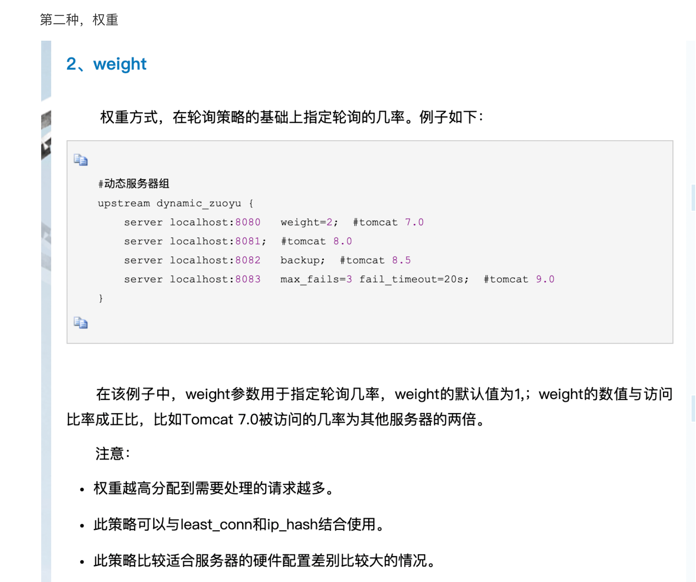
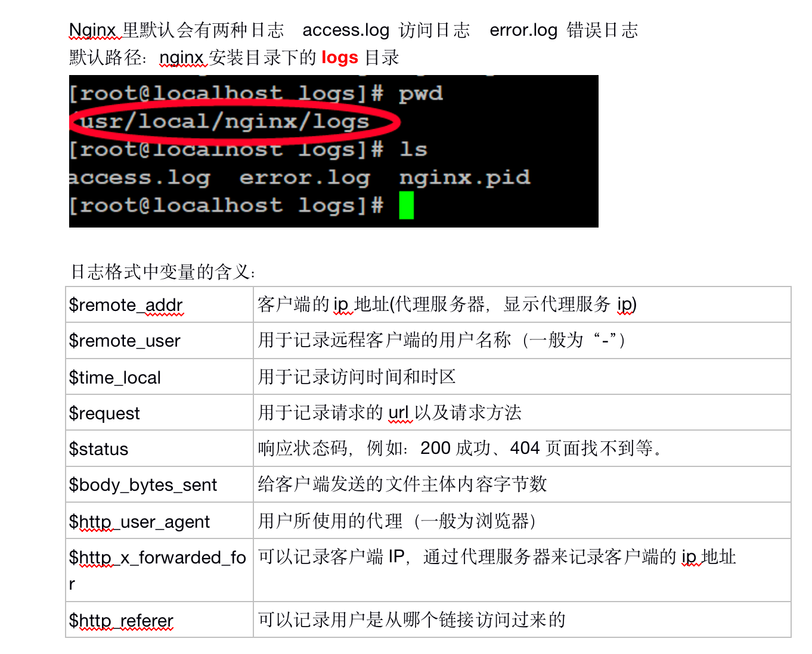
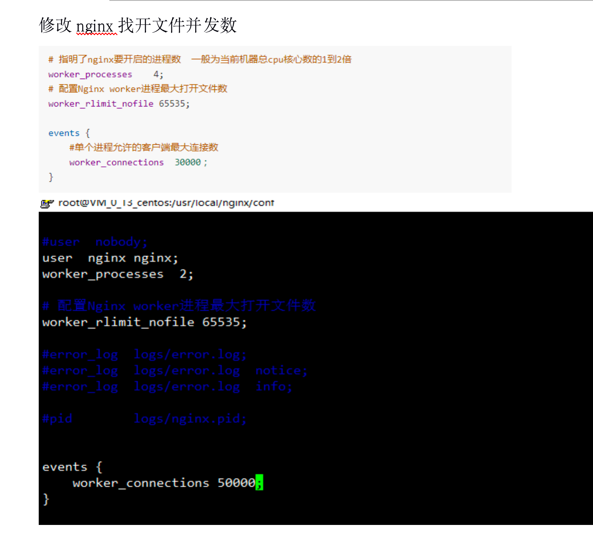

## 1.配置文件

后端

Nginx.conf

```
worker_processes  2;                       
                                           
events {                                   
    worker_connections  2048;              
}                                          
                                                                                                             
http {                                                                                                       
    include       mime.types;                                                                                
    default_type  application/octet-stream;                                                                  
                                                                                                             
    sendfile        on;                                                                                      
                                                                                                             
    keepalive_timeout  65;                                                                                   
    send_timeout 3600;                                                                                       
                                                                                                             
    client_max_body_size 500m;                                                                               
                                                                                                             
    client_header_buffer_size 32k;                                                                           
    large_client_header_buffers 16 128k;                                            
    gzip  on;                              
    gzip_min_length 1k;                    
    gzip_buffers 4 16k;                    
    gzip_comp_level 2;                     
    gzip_types text/plain application/x-javascript text/css application/xml text/javascript application/x-htt
    gzip_vary off;                                                                                           
    gzip_disable "MSIE [1-6]\.";                                                                             
                                                                                                             
                                                                                                             
    lua_shared_dict _ppos_wx 64m;                                                                            
                                                                                                             
    server {                                                                                                 
        listen       80;                                                                                     
        server_name  localhost;                                                                              
                                                                                                             
        location / {                                                                                         
            root   html;                                                                                     
            index  index.html index.htm;                                                                     
        }                                                                                                    
                                                                                                             
        error_page   500 502 503 504  /50x.html;                                                             
        location = /50x.html {                                                                               
            root   html;                                                                                     
        }                                                                                                    
    }                                           
                                                
    include /data/service/tengine/conf/conf.d/*.conf;
}  
```

Api.conf

```
upstream prohttp {
    server 192.168.1.214:8100;
}
upstream imghttpd {
   server 192.168.1.214:8805;
}

upstream cooper {
   server 192.168.1.214:8192;
}

upstream datasource {
   server 192.168.1.214:18000;
}

server {
    listen  80;
    server_name apitest.wesais.cn;

    #add_header Access-Control-Allow-Origin "*";
    # add_header Access-Control-Allow-Headers "Contert-Type";
    # add_header Access-Control-Allow-Credentials true;
    #add_header Access-Control-Allow-Methods "GET, POST, OPTIONS";

    #include /data/service/tengine/conf/conf.d/expire.cfg;

    error_page   500 502 503 504  /50x.html;
    location = /50x.html {
        root   html;
    }

    # backend datasource
    location ^~ /api/v1/ {
        client_max_body_size 500m;
        proxy_set_header Host $http_host;
        proxy_set_header X-Scheme $scheme;
        proxy_set_header X-Forwarded-For $proxy_add_x_forwarded_for;
        proxy_set_header X-Real-IP $remote_addr;
        proxy_set_header Remote_addr $remote_addr;
        rewrite '^(.*)$' $1 break;
        proxy_pass http://datasource;
        proxy_redirect default ;
        proxy_buffering off;
    }

    location ^~ /base/images/upload {
        rewrite '^/base/images/upload$' /img/upload  last;
    }

    location ^~ /images {
        client_max_body_size 500m;
        proxy_pass http://imghttpd;
        proxy_redirect default;
        proxy_buffering off;
        proxy_set_header Host $http_host;
        proxy_set_header X-Scheme $scheme;
        proxy_set_header X-Real-IP $remote_addr;
        proxy_set_header Remote_addr $remote_addr;
        add_header Access-Control-Allow-Origin "*";
        add_header Access-Control-Allow-Credentials true;
        add_header Access-Control-Allow-Methods "GET, POST, OPTIONS";
        expires      30d;
    }
    # backend gateway
    location ^~ /cooper2 {
        client_max_body_size 500m;

        proxy_set_header Host $proxy_host;
        proxy_set_header X-Scheme $scheme;
        proxy_set_header X-Real-IP $remote_addr;
        proxy_set_header Remote_addr $remote_addr;
        rewrite '^/cooper2/(.*)$' /$1 break;
        proxy_pass http://cooper;
    }

    # backend gateway
    location ^~ / {
        client_max_body_size 500m;

        proxy_set_header Host $proxy_host;
        proxy_set_header X-Scheme $scheme;
        proxy_set_header X-Real-IP $remote_addr;
        proxy_set_header Remote_addr $remote_addr;
        proxy_pass http://prohttp;
    }

    # static file configs
    # assets
    location ^~ /assets/static/ {
        index  index.html index.htm index.php;
        root /backend/ppos-assets/applications/http/public/static;
        rewrite '^/assets/static/(.*)/$' /$1/index.html break;
        rewrite '^/assets/static/(.*)$' /$1 break;
    }

    # cardWork
    location ^~ /cardWork/static/ {
        index  index.html index.htm index.php;
        root /backend/ppos-cardWork/applications/http/public/static;
        rewrite '^/cardWork/static/(.*)/$' /$1/index.html break;
        rewrite '^/cardWork/static/(.*)$' /$1 break;
    }
    # coupon
    location ^~ /coupon/static/ {
        index  index.html index.htm index.php;
        root /backend/ppos-coupon/applications/http/public/static;
        rewrite '^/coupon/static/(.*)/$' /$1/index.html break;
        rewrite '^/coupon/static/(.*)$' /$1 break;
    }
    # enterAdmin
    location ^~ /enterAdmin/static/ {
        index  index.html index.htm index.php;
        root /backend/ppos-enterAdmin/applications/http/public/static;
        rewrite '^/enterAdmin/static/(.*)/$' /$1/index.html break;
        rewrite '^/enterAdmin/static/(.*)$' /$1 break;
    }
    # field
    location ^~ /field/static/ {
        index  index.html index.htm index.php;
        root /backend/ppos-field/applications/http/public/static;
        rewrite '^/field/static/(.*)/$' /$1/index.html break;
        rewrite '^/field/static/(.*)$' /$1 break;
    }
    # goods
    location ^~ /goods/static/ {
        index  index.html index.htm index.php;
        root /backend/ppos-goods/applications/http/public/static;
        rewrite '^/goods/static/(.*)/$' /$1/index.html break;
        rewrite '^/goods/static/(.*)$' /$1 break;
    }
    # locker
    location ^~ /locker/static/ {
        index  index.html index.htm index.php;
        root /backend/ppos-locker/applications/http/public/static;
        rewrite '^/locker/static/(.*)/$' /$1/index.html break;
        rewrite '^/locker/static/(.*)$' /$1 break;
    }
    # member
    location ^~ /member/static/ {
        index  index.html index.htm index.php;
        root /backend/ppos-member/applications/http/public/static;
        rewrite '^/member/static/(.*)/$' /$1/index.html break;
        rewrite '^/member/static/(.*)$' /$1 break;
    }
    # statistic
    location ^~ /statistic/static/ {
        index  index.html index.htm index.php;
        root /backend/ppos-statistic/applications/http/public/static;
        rewrite '^/statistic/static/(.*)/$' /$1/index.html break;
        rewrite '^/statistic/static/(.*)$' /$1 break;
    }
    # ticket
    location ^~ /ticket/static/ {
        index  index.html index.htm index.php;
        root /backend/ppos-ticket/applications/http/public/static;
        rewrite '^/ticket/static/(.*)/$' /$1/index.html break;
        rewrite '^/ticket/static/(.*)$' /$1 break;
    }
    # public
    location ^~ /public/static/ {
        index  index.html index.htm index.php;
        root /backend/ppos-public/applications/http/public/static;
        rewrite '^/public/static/(.*)/$' /$1/index.html break;
        rewrite '^/public/static/(.*)$' /$1 break;
    }
    # pppos-class
    location ^~ /class/static/ {
        index  index.html index.htm index.php;
        root /backend/ppos-class/applications/http/public/static;
        rewrite '^/class/static/(.*)/$' /$1/index.html break;
        rewrite '^/class/static/(.*)$' /$1 break;
    }

}
```


前端 nginx.conf

```
worker_processes  2;

events {
    worker_connections  2048;
}

http {
    include       mime.types;
    default_type  application/octet-stream;
    
    sendfile        on;
    
    keepalive_timeout  65;
    send_timeout 3600;
    
    client_max_body_size 500m;
   
    client_header_buffer_size 32k;
    large_client_header_buffers 16 128k;
 
    gzip  on;
    gzip_min_length 1k;
    gzip_buffers 4 16k;
    gzip_comp_level 2; 
    gzip_types text/plain application/x-javascript text/css application/xml text/javascript application/x-httpd-php image/jpeg image/gif image/png;
    gzip_vary off;      
    gzip_disable "MSIE [1-6]\.";

    
    lua_shared_dict _ppos_wx 64m;
    
    server {
        listen       80;
        server_name  localhost;
        
        location / {
            root   html;
            index  index.html index.htm;
        }
        
        error_page   500 502 503 504  /50x.html;
        location = /50x.html {
            root   html;
        }
    }
    
    include /data/service/tengine/conf/conf.d/*.conf;
}
```

ppos-vue-business.conf

```

server {
    listen  80;
    server_name "~^(www.)?(\w{2,})-stadium?\.wesais\.cn$";

    root /frontend/ppos-vue-business/dist;
    location / {
        index  index.html index.htm;
    }

    error_page   500 502 503 504  /50x.html;
    location = /50x.html {
        root   html;
    }

    location ~ .*\.(?:jpg|jpeg|gif|png|ico|cur|gz|svg|svgz|mp4|ogg|ogv|webm)$ {
        expires      1d;
    }

    location ~ .*\.(?:js|css)$ {
        expires      1d;
    }
}

ppos-vue-admin.conf

server {
    listen  80;
    server_name admtest.wesais.cn;

    root /frontend/ppos-vue-admin/dist;
    location / {
        index  index.html index.htm;
    }

    error_page   500 502 503 504  /50x.html;
    location = /50x.html {
        root   html;
    }

    location ~ .*\.(?:jpg|jpeg|gif|png|ico|cur|gz|svg|svgz|mp4|ogg|ogv|webm)$ {
        expires      1d;
    }

    location ~ .*\.(?:js|css)$ {
        expires      1d;
    }

}
```


1.php-fpm本质上也是一种php的形式.在使用nginx作为web服务器时,php以进程的方式存在,处理请求.此时php的全称加php-fastCGI process Manager,php-fpm是其缩写而成.而在使用Apache作为web服务器时.php是以模块的方式被apache加载,进而处理请求.所以本质上都是php,只是在不同环境下的运行方式不同,php是以模块的方式运行,而php-fpm是以进程的方式运行.

模块方式运行的php,占用的端口号是8080.进程方式运行的php占用的端口号是9000


.在lnmp下搭建站点时,nginx有两种方式链接php-fpm.
取决于php-fpm.conf文件中的listen选项


```

一个普通的vhost下面的conf文件例子.
重启php-fpm
1.先杀死进程,pkill php-fpm
2.重启php-fpm,使用service php-fpm start即可
server {
        listen 8090;
        server_name localhost;
        index index.html index.htm index.php;
        root   /home/wwwroot/Big2PHP/public;

                location / {
            #autoindex  on;
            if (!-e $request_filename) {
                          rewrite ^/(.*)$ /index.php/$1 last;
                          break;
                          }
        }
                location ~ \.php(.*)$ {
                #fastcgi_pass   unix:/dev/shm/php-cgi.sock;
                fastcgi_pass   127.0.0.1:9000;
                fastcgi_index  index.php;
                #下面两句是给fastcgi权限，可以支持 ?s=/module/controller/action的url访问模式
                fastcgi_split_path_info  ^((?U).+\.php)(/?.+)$;
                fastcgi_param  SCRIPT_FILENAME  $document_root$fastcgi_script_name;
                #下面两句才能真正支持 index.php/index/index/index的pathinfo模式
                fastcgi_param  PATH_INFO  $fastcgi_path_info;
                fastcgi_param  PATH_TRANSLATED  $document_root$fastcgi_path_info;
                include        fastcgi_params;
        }
}
```


### 1.配置前端站点


#### 禁用html缓存 


记得禁用index.html缓存 ，禁用html缓存，防止更新项目后，客户一直加载的旧index.html，导致用户反馈问题没生效

```conf
#禁用html缓存，防止更新项目后，客户一直加载的旧index.html，导致用户反馈问题没生效
    location ~* \.html$ {
        #no-cache 先和服务器确认，html文件是否被更改，如果被更改，则返回最新的html文件，如果没有被更改，则走本地缓存
        add_header Cache-Control "no-cache";
    }
```


前端：没有https的配置 和 有https的配置

```
server {
    listen  80;
    server_name "~^(www.)?(\w{2,})-stadium?\.wesais\.cn$";

    root /frontend/ppos-vue-business/dist;
    location / {
        index  index.html index.htm;
    }

    error_page   500 502 503 504  /50x.html;
    location = /50x.html {
        root   html;
    }

    location ~ .*\.(?:jpg|jpeg|gif|png|ico|cur|gz|svg|svgz|mp4|ogg|ogv|webm)$ {
        expires      1d;
    }

    location ~ .*\.(?:js|css)$ {
        expires      1d;
    }
}

server {
    listen  80;
    server_name admtest.wesais.cn;

    root /frontend/ppos-vue-admin/dist;
    location / {
        index  index.html index.htm;
    }
    
   
    location ~* \.html$ {
        add_header Cache-Control "no-cache";
    }

    error_page   500 502 503 504  /50x.html;
    location = /50x.html {
        root   html;
    }

    location ~ .*\.(?:jpg|jpeg|gif|png|ico|cur|gz|svg|svgz|mp4|ogg|ogv|webm)$ {
        expires      1d;
    }

    location ~ .*\.(?:js|css)$ {
        expires      1d;
    }

}
```

```
server {
    listen 443 ssl;
    server_name user.paypolitan.net;
    index index.html index.htm index.php;
    root /home/wwwroot/h5/dist;

    ssl_certificate cert/user_paypolitan_net_integrated.crt;
    ssl_certificate_key cert/user_paypolitan_net.key; # SSL证书私钥
    ssl_session_timeout 5m;
    ssl_ciphers ECDHE-RSA-AES128-GCM-SHA256:ECDHE:ECDH:AES:HIGH:!NULL:!aNULL:!MD5:!ADH:!RC4;
    ssl_protocols TLSv1 TLSv1.1 TLSv1.2;
    ssl_prefer_server_ciphers on;

    location / {
            index  index.html index.htm index.php;
            #autoindex  on;
               if ($request_filename ~* ^.*?/.(zip|apk)$) {
                add_header Content-Disposition: 'attachmet;';
               }
        }
}
server {
 listen 80;
 server_name user.paypolitan.net;
 # 监听80端口 如果发现访问的是80端口 则进行url重写强制跳转到443端口
 rewrite ^(.*) https://$server_name$1 permanent; 
}
```


### 2.配置后端站点

```

一个普通的vhost下面的conf文件例子.
重启php-fpm
1.先杀死进程,pkill php-fpm
2.重启php-fpm,使用service php-fpm start即可

没有https的配置

server {
        listen 8047;
        server_name localhost;
        index index.html index.htm index.php;
        root /home/wwwroor/fileSystem/fileSystem/public;

                location / {
            				if (!-e $request_filename) {
                          rewrite ^/(.*)$ /index.php/$1 last;
                          #有些不支持pathinfo的服务器，可以使用这种兼容默认访问，?s=是tp的方式
                          #rewrite  ^(.*)$  /index.php?s=/$1  last;
                          break;
                          }
        				}
        				
                location ~ \.php(.*)$ {
                #fastcgi_pass unix:/dev/shm/php-cgi.sock;
                fastcgi_pass 127.0.0.1:9000;
                fastcgi_index index.php;
                #下面两句是给fastcgi权限可以支持?s=/module/controller/action的url访问模式
                fastcgi_split_path_info ^((?U).+\.php)(/?.+)$;
                fastcgi_param SCRIPT_FILENAME $document_root$fastcgi_script_name;
                #下面两句才能真正支持 index.php/index/index/index的pathinfo模式
                fastcgi_param PATH_INFO $fastcgi_path_info;
                fastcgi_param PATH_TRANSLATED $document_root$fastcgi_path_info;
                include fastcgi_params;
        }
}

这段 Nginx 配置文件是为了设置一个服务来处理对 ThinkPHP 5.1 应用的 HTTP 请求。下面逐条解释每个配置项的具体意义：

监听端口和服务器名称:
nginx
Copy code
listen 8047;
server_name localhost;
这里配置了 Nginx 监听 8047 端口，服务器名设为 localhost。这意味着此配置只响应在本机通过端口 8047 发送的请求。
索引文件和根目录:
nginx
Copy code
index index.html index.htm index.php;
root /home/wwwroor/fileSystem/fileSystem/public;
设置网站的根目录为 /home/wwwroor/fileSystem/fileSystem/public，并指定当访问目录时默认寻找的文件顺序为 index.html、index.htm、index.php。
处理 URL 重写:
nginx
Copy code
location / {
    if (!-e $request_filename) {
        rewrite ^/(.*)$ /index.php/$1 last;
    }
}
在这个 location 块中，如果请求的文件或目录不存在（!-e $request_filename），则将请求重写到 /index.php/$1，这里的 $1 代表之前匹配的请求路径。这是为了支持 ThinkPHP 的 PATH_INFO URL 模式。
处理 PHP 文件的请求:
nginx
Copy code
location ~ \.php(.*)$ {
    fastcgi_pass 127.0.0.1:9000;
    fastcgi_index index.php;
    fastcgi_split_path_info ^((?U).+\.php)(/?.+)$;
    fastcgi_param SCRIPT_FILENAME $document_root$fastcgi_script_name;
    fastcgi_param PATH_INFO $fastcgi_path_info;
    fastcgi_param PATH_TRANSLATED $document_root$fastcgi_path_info;
    include fastcgi_params;
}
这个 location 匹配以 .php 结尾的请求，处理 PHP 文件的请求通过 fastcgi_pass 指令将请求转发到 127.0.0.1:9000（即本地的 FastCGI 进程，例如 PHP-FPM）。
fastcgi_split_path_info 正则表达式用于分割 URL 为 SCRIPT 和 PATH INFO。
SCRIPT_FILENAME 和 PATH_INFO 参数设置是为了正确地向 FastCGI 传递必要的信息，确保 PHP 脚本可以正确接收到路径信息，以支持 ThinkPHP 的 URL 路由机制。
注释部分:
配置中包含的注释提供了替代的重写规则（如使用 ?s= 查询字符串参数）和一些参数的说明，以帮助理解或根据需要调整配置。
总结来说，这个 Nginx 配置主要是为了确保对 ThinkPHP 应用的正确请求处理和路径解析，使其能够支持友好的 URL 结构和路径信息传递。
```

```
#有https的配置

server {
    listen 443 ssl;
    server_name api.wenlin.top;
    index index.html index.htm index.php;
    root /home/wwwroot/hyper/hyper-new-api/public;

    ssl_certificate cert/api.wenlin.top.crt;
    ssl_certificate_key cert/api.wenlin.top.key; # SSL证书私钥
    ssl_session_timeout 5m;
    ssl_ciphers ECDHE-RSA-AES128-GCM-SHA256:ECDHE:ECDH:AES:HIGH:!NULL:!aNULL:!MD5:!ADH:!RC4;
    ssl_protocols TLSv1 TLSv1.1 TLSv1.2;
    ssl_prefer_server_ciphers on;

    location / {
            index  index.html index.htm index.php;
            #autoindex  on;
               if ($request_filename ~* ^.*?/.(zip|apk)$) {
                add_header Content-Disposition: 'attachmet;';
               }
            if (!-e $request_filename) {
                          rewrite ^/(.*)$ /index.php/$1 last;
                          break;
                          }

        }
        location ~ \.php(.*)$ {
                fastcgi_pass 127.0.0.1:9000;
                fastcgi_index  index.php;
                #下面两句是给fastcgi权限，可以支持 ?s=/module/controller/action的url访问模式
                fastcgi_split_path_info  ^((?U).+\.php)(/?.+)$;
                fastcgi_param  SCRIPT_FILENAME  $document_root$fastcgi_script_name;
                #下面两句才能真正支持 index.php/index/index/index的pathinfo模式
                fastcgi_param  PATH_INFO  $fastcgi_path_info;
                fastcgi_param  PATH_TRANSLATED  $document_root$fastcgi_path_info;
                include        fastcgi_params;
        }
}
server {
 listen 80;
 server_name api.wenlin.top;
 # 监听80端口 如果发现访问的是80端口 则进行url重写强制跳转到443端口
 rewrite ^(.*) https://$server_name$1 permanent; 
}
```


```
server {
    listen 443 ssl;
    server_name api.paypolitan.net;
    index index.php index.html ;
    root /home/wwwroot/epan-api/public;

    ssl_certificate cert/api_paypolitan_net_integrated.crt;
    ssl_certificate_key cert/api_paypolitan_net.key; # SSL证书私钥
    ssl_session_timeout 5m;
    ssl_ciphers ECDHE-RSA-AES128-GCM-SHA256:ECDHE:ECDH:AES:HIGH:!NULL:!aNULL:!MD5:!ADH:!RC4;
    ssl_protocols TLSv1 TLSv1.1 TLSv1.2;
    ssl_prefer_server_ciphers on;

    location / {
            index  index.html index.htm index.php;
            #autoindex  on;
               if ($request_filename ~* ^.*?/.(zip|apk)$) {
                add_header Content-Disposition: 'attachmet;';
               }
            if (!-e $request_filename) {
                          rewrite ^/(.*)$ /index.php/$1 last;
                          break;
                          }

        }
        location ~ \.php(.*)$ {
                fastcgi_pass unix:/dev/shm/php-cgi.sock;
                fastcgi_index  index.php;
                #下面两句是给fastcgi权限，可以支持 ?s=/module/controller/action的url访问模式
                fastcgi_split_path_info  ^((?U).+\.php)(/?.+)$;
                fastcgi_param  SCRIPT_FILENAME  $document_root$fastcgi_script_name;
                #下面两句才能真正支持 index.php/index/index/index的pathinfo模式
                fastcgi_param  PATH_INFO  $fastcgi_path_info;
                fastcgi_param  PATH_TRANSLATED  $document_root$fastcgi_path_info;
                include        fastcgi_params;
        }
}
server {
 listen 80;
 server_name api.paypolitan.net;
 # 监听80端口 如果发现访问的是80端口 则进行url重写强制跳转到443端口
 rewrite ^(.*) https://$server_name$1 permanent; 
}
```


//root 


//转发到不同的程序下

```
server {
   listen 80;
   server_name 192.168.0.218;
    index index.php index.html index.htm;
    location / {
        root   /home/www/sdp-web/dist/;
        index  index.html index.htmi index.php;
        }
   location /api {
         proxy_set_header X-Real-IP $remote_addr;
         proxy_set_header X-Forwarded-For $proxy_add_x_forwarded_for;
        #add_header 'Access-Control-Allow-Origin' '*';
         proxy_pass http://192.168.0.218:8080;
                 }
location /client {
                proxy_set_header X-Real-IP $remote_addr;
                proxy_set_header X-Forwarded-For $proxy_add_x_forwarded_for;
                #add_header 'Access-Control-Allow-Origin' '*';
                proxy_pass http://192.168.0.218:8080;
                                  }
location /storage {
                proxy_set_header X-Real-IP $remote_addr;
                proxy_set_header X-Forwarded-For $proxy_add_x_forwarded_for;
                proxy_pass http://192.168.0.218:8080;
        }
         access_log /var/log/nginx/sase.metelyd.com.access.log;
         error_log /var/log/nginx/sase.metelyd.com.error.log;

}
```


### 3.在nginx层设置跨域

```
location / {
            add_header Access-Control-Allow-Origin *;
            add_header Access-Control-Allow-Methods 'GET, POST, OPTIONS';
            add_header Access-Control-Allow-Headers 'DNT,X-Mx-ReqToken,Keep-Alive,User-Agent,X-Requested-With,If-Modified-Since,Cache-Control,Content-Type,Authorization';

            if ($request_method = 'OPTIONS') {
                return 204;
            }

            index  index.html index.htm index.php;
            #autoindex  on;
            if (!-e $request_filename) {
                rewrite ^/(.*)$ /index.php/$1 last;
                break;
            }
        }
```


## 2.负载均衡

在http段内，在server段外，配置upstream参数即可。test是别名，随便取都行。

括号里面是服务器ip加端口号，代表要转发到哪个服务器的哪个端口号中。


然后在location /中配置proxy_pass http://test

重启nginx即可。

这里可以配置很多种转发的策略。

第一种，轮询（默认，没有写就是轮询）。


2.



3.


4.


例子：

http段中


server段中


## 3.nginx日志

一般在下图所示的目录中。如果没有的话，就去看nginx配置文件中日志的路径。





## 4.nginx配置优化

### 4.1增加nginx的work进程配置



### 4.1 调大等待时间


### 4.3gzip压缩


```
#修改配置为
gzip on;                     #开启gzip压缩功能
gzip_min_length 10k;         #设置允许压缩的页面最小字节数; 这里表示如果文件小于10个字节，就不用压缩，因为没有意义，本来就很小.
gzip_buffers 4 16k;          #设置压缩缓冲区大小，此处设置为4个16K内存作为压缩结果流缓存
gzip_http_version 1.1;       #压缩版本
gzip_comp_level 2;           #设置压缩比率，最小为1，处理速度快，传输速度慢；9为最大压缩比，处理速度慢，传输速度快; 这里表示压缩级别，可以是0到9中的任一个，级别越高，压缩就越小，节省了带宽资源，但同时也消耗CPU资源，所以一般折中为6
gzip types text/css text/xml application/javascript;      #制定压缩的类型,线上配置时尽可能配置多的压缩类型!
gzip_disable "MSIE [1-6]\.";       #配置禁用gzip条件，支持正则。此处表示ie6及以下不启用gzip（因为ie低版本不支持）

gzip  on;
    gzip_min_length  1k;
    gzip_buffers     4 16k;
    gzip_http_version 1.1;
    gzip_comp_level 9;
    gzip_types       text/plain application/x-javascript text/css application/xml text/javascript application/x-httpd-php application/javascript application/json;
    gzip_disable "MSIE [1-6]\.";
    gzip_vary on;
```


### 4.4设置浏览器缓存


4.5 配置每个链接的上传速度是多少？防止流量攻击。


### 5.Nginx防盗链配置


## 1. 什么是盗链?

百度百科的解释如下:

> 盗链是指服务提供商自己不提供服务的内容，通过技术手段绕过其它有利益的最终用户界面（如广告），直接在自己的网站上向最终用户提供其它服务提供商的服务内容，骗取最终用户的浏览和点击率。受益者不提供资源或提供很少的资源，而真正的服务提供商却得不到任何的收益。

盗链在如今的互联网世界无处不在，盗图，盗视频、盗文章等等，都是通过获取正规网站的图片、视频、文章等的 url 地址，直接放到自己网站上使用而未经授权。 盗资源是黑产界以最小成本获取最高利益的一个常用手段。比如笔者最近考虑买房，在贝壳网上有房源的真是户型图以及VR。某些房产中介直接会盗用贝壳网上的真实户型图来骗取点击。因此，对于任何一个大型网站而言，做好防盗措施，避免自身利益受损是至关重要的。Nginx 在代理这类静态资源(图片、视频、文章等)时，可以通过配置实现防盗连的功能。


## 2. 如何防盗链？

前面介绍到，盗链是直接使用正规网站保存图片、视频等的 URL 以获取相应的资源。最简单的防盗想法就是根据客户端请求资源时所携带的一些关键信息来验证请求的合法性，比如客户端 IP、请求 URL 中携带的 referer，如果不合法则直接拒绝请求。此外，由于这些基础信息都可以伪造，因此这样的基础手段也不一定安全。此外，还有登录认证、使用 cookie 等其他防盗连手段。另外，针对特定场景，比如流媒体直播中还有更为高级的防盗手段包括时间戳防盗链、swf 防盗链、回源鉴权防盗链等。


## 3. Nginx中防盗链配置


### 3.1 refer模块防盗

Nginx 用于实现防盗链功能的模块为 refer 模块,其依据的原理是: 如果网站盗用了你的图片，那么用户在点击或者查看这个盗链内容时，发送 http 请求的头部中的 referer 字段将为该盗版网站的 url。这样我们通过获取这个头部信息，知道 http 发起请求的页面，然后判断这个地址是否是我们的合法页面，不是则判断为盗链。Nginx 的 referer 模块中有3个指令，用法分别如下：

```yaml
Syntax:	referer_hash_bucket_size size;
Default: referer_hash_bucket_size 64;
Context: server, location

Syntax:	referer_hash_max_size size;
Default: referer_hash_max_size 2048;
Context: server, location

Syntax:	valid_referers none | blocked | server_names | string ...;
Default: —
Context: server, location


代码块
预览复制
```

最重要的是 valid_referers 指令，它后面可以带上多个参数，表示多个 referer 头都是有效的。它的参数形式有:

- none: 允许缺失 referer 头部的请求访问
- blocked: 有 referer 这个字段，但是其值被防火墙或者是代理给删除了
- server_names: 若 referer 中的站点域名和 server_names 中的某个域名匹配，则允许访问
- 任意字符或者正则表达式

**Nginx 会通过查看 referer 字段和 valid_referers 后面的 referer 列表进行匹配，如果匹配到了就将内置的变量$invalid_referer值设置为0，否则设置该值为1**

这样一个简单的 Nginx 防盗链配置如下:

```shell
...

    location / {
       valid_referers none blocked *.domain.pub www.domain.com/nginx server_names ~\.baidu\.;
       if ($invalid_referer) {
          return 403;
       }
       return 200 "valid\n";
   }

...


代码块
预览复制
```


### 3.2 secure_link模块防盗

前面这种简单检查 referer 头部值的防盗链方法过于脆弱，盗用者很容易通过伪造 referer 的值轻而易举跳过防盗措施。在 Nginx 中有一种更为高级的防盗方式，即基于 secure_link 模块，该模块能够检查请求链接的权限以及是否过期，多用于下载服务器防盗链。这个模块默认未编译进 Nginx，需要在源码编译时候使用 --with-secure_link_module 添加。

该模块的通过验证 URL 中的哈希值的方式防盗链。它的防盗过程如下：

- 由服务器或者 Nginx 生成安全的加密后的 URL, 返回给客户端;
- 客户端使用安全的 URL 访问 Nginx，获取图片等资源，由 Nginx 的 secure_link 变量判断是否验证通过;

secure_link 模块中总共有3个指令，其格式和说明分别如下：

```yaml
Syntax:	secure_link expression;
Default: —
Context: http, server, location

Syntax:	secure_link_md5 expression;
Default: —
Context: http, server, location

Syntax:	secure_link_secret word;
Default: —
Context: location


代码块
预览复制
```

通过配置 secure_link, secure_link_md5 指令，可实现对链接进行权限以及过期检查判断的功能。

和 referer 模块中的 $invalid_referer 变量一样，secure_link 模块也是通过内置变量 KaTeX parse error: Expected 'EOF', got '判' at position 14: secure\_link 判̲断验证是否通过。secure_link 的值有如下三种情况：

- 空字符串: 验证不通过
- 0: URL 过期
- 1: 验证通过

通常使用这个模块进行 URL 校验，我们需要考虑的是如何生成合法的 URL ？另外，需要在 Nginx 中做怎样的配置才可以校验这个 URL？

对于第一个问题，生成合法的 URL 和 指令 secure_link_md5 有关。例如:

```shell
secure_link_md5 "$secure_link_expires$uri$remote_addr secret";


代码块
预览复制
```

如果 Nginx 中secure_link_md5 是上述配置，那么生成合法 url 的命令如下:

```shell
# 2020-02-05 21:00:00 转换成时间戳为1580907600
echo -n '1580907600/test.png127.0.0.1 secret' | \
    openssl md5 -binary | openssl base64 | tr +/ -_ | tr -d =


代码块
预览复制
```

通过上述命令，我们得到了一个 md5 值:cPnjBG9bAZvY_jbPOj13mA，这个非常重要。接下来，构造合的 URL 和指令 secure_link 相关。如果 secure_link 指令的配置如下:

```shell
secure_link $arg_md5,$arg_expires;


代码块
预览复制
```

那么我们的请求的 url 中必须带上 md5 和 expires 参数，例如:

```shell
http://180.76.152.113:9008/test.png?md5=cPnjBG9bAZvY_jbPOj13mA&expires=1580907600


代码块
预览复制
```

对于 Nginx 中的校验配置示例如下:

```shell
location ~* .(gif|jpg|png|swf|flv|mp4)$  {
    secure_link $arg_md5,$arg_expires;
    secure_link_md5 "$secure_link_expires$uri$remote_addr secret";

    # 空字符串，校验不通过
    if ($secure_link = "") {
        return 403;
    }

    # 时间过期
    if ($secure_link = "0") {
        return 410 "URL过期，请重新生成";
    }

    root /root/test;
}


代码块
预览复制
```

在 Nginx 的配置中，除了前面提到的 secure_link 和 secure_link_md5 指令外，我们对通过校验和校验失败的情况进行了处理。接下来请看实验部分。


## 4. 案例实战


### 4.1 refer 模块防盗链测试

在 nginx.conf 中加入如下防盗配置:

```shell
...

http {
    ...
    server {
       listen 9008;

       location / {
           valid_referers none blocked *.domain.pub www.domain.com/nginx server_names ~\.baidu\.;
           if ($invalid_referer) {
              return 403;
           }
           return 200 "valid\n";
       }
    }
    ...
}

...


代码块
预览复制
```

重新加载或者启动 Nginx 后，我们进行如下操作:

```
[shen@shen Desktop]$ curl -H 'referer: http://www.domain.com/test' http://180.76.152.113:9008 
<html>
<head><title>403 Forbidden</title></head>
<body>
<center><h1>403 Forbidden</h1></center>
<hr><center>nginx/1.17.6</center>
</body>
</html>
[shen@shen Desktop]$ curl -H 'referer: http://www.domain.com/nginx' http://180.76.152.113:9008 
valid
[shen@shen Desktop]$ curl -H 'referer: ' http://180.76.152.113:9008 
valid
[shen@shen Desktop]$ curl http://180.76.152.113:9008 
valid
[shen@shen Desktop]$ curl -H 'referer: http://www.domain.pub/test' http://180.76.152.113:9008 
valid


代码块
预览复制
```

第一个 http 请求 referer 的值存在，但是没有匹配后面的域名，所以返回403。其余的请求中 referer 值要么不存在，要么没有这个头部，要么匹配了后面的域名正则表达，都通过了 referer 校验，所以都返回 “valid” 字符串。我们通过构造不同的 referer 头部字段成功的绕过了 Nginx 的referer 模块校验，也说明了这种防盗的方式极不靠谱。


### 4.2 secure_link 防盗链测试

我们准备一个静态图片, 名为 test.png，放到搭建了 Nginx 的服务器上，全路径为 /root/test/test.png。
我们准备 Nginx 配置如下:

```shell
...

http {
    ...
  
    server {
       listen  8000;

       location / {
           # return 200 "$remote_addr";
           root /root/test;
       }
    }

    server {
       listen 8001;

       location ~* .(jpg|png|flv|mp4)$  {
          secure_link $arg_md5,$arg_expires;
          secure_link_md5 "$secure_link_expires$uri$remote_addr secret";

          # 空字符串，校验不通过
          if ($secure_link = "") {
             return 403;
          }

          # 时间过期
          if ($secure_link = "0") {
             return 410;
          }

          # 校验通过，访问对的静态资源
          root /root/test;
       }
    }

}

...


代码块
预览复制
```

首先，在浏览器上访问8000端口我们可以获取对应的 $remote_addr 变量值(打开 return 的注释配置)，结果为103.46.244.69， 这是客户端请求时的对外 IP。访问浏览器上访问8000端口，URI=/test.png， 可以看到这个静态图片。


接下来，我们在访问8001端口，URI=/test.png时，可以发现返回403页面，说明安全模块生效。


当前时间为2020年02月05日晚上9点半，我们找一个过期时间晚上10点，得到相应的时间戳为1580911200。按照 secure_link_md5 指令格式，使用如下 shell 命令生成 md5 值:

```shell
[shen@shen Desktop]$ echo -n '1580911200/test.png103.46.244.69 secret' | openssl md5 -binary | openssl base64 | tr +/ -_ | tr -d =
KnJx3J6fN_0Qc1W5TqEVXw


代码块
预览复制
```

这样可以得到我们的安全访问 URL 为:

```shell
# 访问静态资源test.png的安全URL为:
http://180.76.152.113:8001/test.png?md5=KnJx3J6fN_0Qc1W5TqEVXw&expires=1580911200


代码块
预览复制
```

再次到浏览器上访问时候，我就可以看到静态图片了。


此外，我们还可以等到10点之后，测试过期后的结果。在过期之后再用这个 URL 访问时无法查看图片，而且返回的是 410 的状态码，这说明 Nginx 成功检测到这个密钥值已经过期。


## 5. 小结

本节我们介绍了一些防盗链的知识，然后开始介绍 Nginx 中的防盗链配置。一般的 Nginx 防盗链手段都是通过 referer 字段来判断请求的来源地，由此去判定请求是否合法。但是该字段容易伪造，所以很少用该方法实现防盗功能。而Nginx 的 secure_link 模块主要是使用 hash 算法加密方式，一般用于图片、视频下载，生成下载 URL，安全性高。此外，我们也可以使用一些第三方的模块增强 Nginx 的防盗链功能，比如常用的第三放模块ngx_http_accesskey_module 可用于实现文件下载的防盗功能。