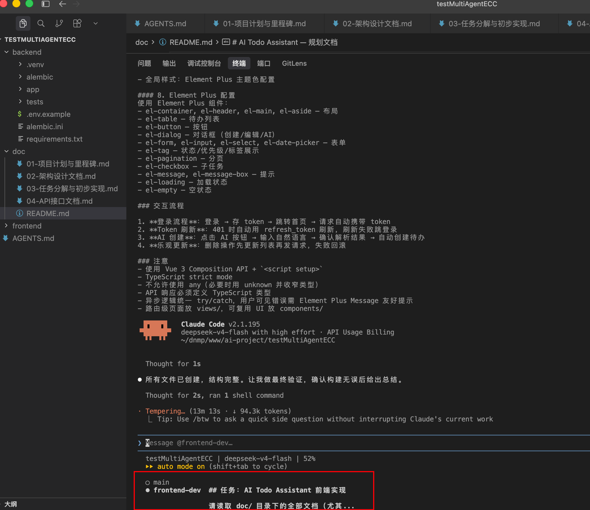
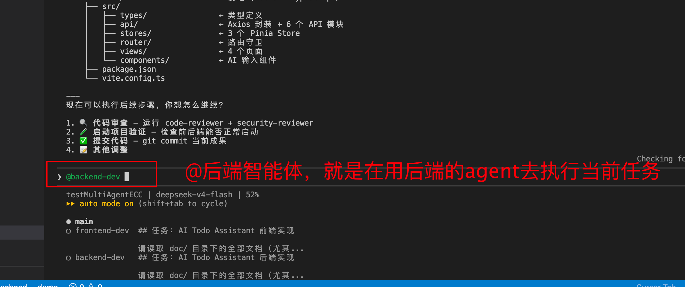

Harness engineer

### 1.初始化项目

先使用一个 demo 文档，到项目目录下

### 2.生成计划文档

然后使用ecc命令来生成计划文档

/ecc:plan "根据AGENTS.md里面的项目简介在doc目录下生成计划文档"

/ecc:plan "生成数据库中所有表的结构(DDL)"

/ecc:plan "生成所有接口的接口文档"

### 3.执行计划

按技能规范，`orch-build-mvp` 标准用法是仅传入文档路径，由技能内部调度全流程

 /ecc:orch-build-mvp 

//不标准用户，手动加了很多内容

/ecc:orch-build-mvp  "读取 doc/README.md，构建 MVP。
使用 Agent 工具并行启动两个独立的 Agent：
Agent: ecc:gan-generator
name: "backend-dev"
prompt: "读取doc文档目录中后端部分，在 backend/ 下实现全部代码"

Agent 2: ecc:gan-generator
name: "frontend-dev"
prompt: "读取doc文档目录中前端部分，在 frontend/ 下实现全部代码"
"

"读取 doc/stadiumWorkBench-plan.md，构建 MVP。
使用 Agent 工具并行启动两个独立的 Agent：
Agent: ecc:gan-generator
name: "backend-dev"
prompt: "读取doc文档目录中后端部分，在 information-pkyd目录下实现对应后端的代码"

Agent 2: ecc:gan-generator
name: "frontend-dev"
prompt: "读取doc文档目录中前端部分，在 vue-pika-shop-operation目录下实现对应前端的代码"
"

多agent 可以切换

### 4.验证阶段

进行/code-review  进行代码审查，ecc会使用8个视角并行审查代码，然后出一个审查报告（报告可能有错）

然后进行人工审查，进行审查报告调整，调整后，让cc针对新调整后的报告进行修复

如果功能不复杂，则直接 /code-review --fix 进行代码审查并自动修复 。

安全审查

/security-review 可选，基于场景

### 5.运行项目

执行前端 和 后端的 run命令，跑起来

### 6.后续迭代和修改

好,后续要迭代新功能和修改功能，目前有多种方式，1 直接在主agent中说，2 在之前创建好的两个agent（backend-dev 和frontend-dev）各自说一遍，3 每个功能任务都使用新的agent。这3个方式各自的优缺点对比一下，需要多维度对比

三种迭代方式的全面对比分析

---
方式定义

┌────────────────────┬─────────────────────────────────────────────────────────────────────────────────┐
│        方式        │                                      操作                                       │
├────────────────────┼─────────────────────────────────────────────────────────────────────────────────┤
│ ① 主 agent 直写    │ 在 main 会话说"加功能 X"，主 agent 分析→读代码→调用 Edit/Write 直接改           │
├────────────────────┼─────────────────────────────────────────────────────────────────────────────────┤
│ ② 旧 subagent 续命 │ 在 backend-dev 会话说"加功能 X 的后端"，在 frontend-dev 会话说"加功能 X 的前端" │
├────────────────────┼─────────────────────────────────────────────────────────────────────────────────┤
│ ③ 新 agent 每功    │ 在 main 会话说"加功能 X"，主 agent 分析后派全新 backend-X 和 frontend-X agent   │
└────────────────────┴─────────────────────────────────────────────────────────────────────────────────┘

---
维度 1：上下文质量

┌──────────────────────┬─────────────────────────────────────────────────────┬──────────────────────────────────────────────────────────────────────────────┬─────────────────────────────────────────────────────────┐
│                      │                   ① 主 agent 直写                   │                              ② 旧 subagent 续命                              │                     ③ 新 agent 每功                     │
├──────────────────────┼─────────────────────────────────────────────────────┼──────────────────────────────────────────────────────────────────────────────┼─────────────────────────────────────────────────────────┤
│ 当前项目代码的可见性 │ ✅ 完整 — 一次 Read 就能拿到最新代码                │ ❌ 不确定 — 旧 agent 的上下文是"上次 Read                                    │ ✅ 可控 — 新 agent 在 prompt 里被明确告知要 Read        │
│                      │                                                     │ 时的快照"，代码可能已被另一端改过，它不知道                                  │ 哪些文件，拿到的永远是最新状态                          │
├──────────────────────┼─────────────────────────────────────────────────────┼──────────────────────────────────────────────────────────────────────────────┼─────────────────────────────────────────────────────────┤
│ 历史决策的追溯       │ ✅ 完整 — 主 agent                                  │ ⚠️ 部分 — 它知道"自己当时怎么写的"，但不知道为什么改了、另一端怎么调的       │ ❌ 零 — 需要从代码反推设计意图                          │
│                      │ 全程参与所有决策讨论，知道"为什么这样设计"          │                                                                              │                                                         │
├──────────────────────┼─────────────────────────────────────────────────────┼──────────────────────────────────────────────────────────────────────────────┼─────────────────────────────────────────────────────────┤
│ 对话噪声             │ ❌ 会积累 — 讨论越多，有效上下文越被稀释            │ ❌ 严重 — 旧 agent 的上下文里全是 MVP                                        │ ✅ 干净 — 每次 prompt 精确定义任务，无关信息为零        │
│                      │                                                     │ 的生成过程（几万字的代码输出），新指令进去淹没在噪声中                       │                                                         │
├──────────────────────┼─────────────────────────────────────────────────────┼──────────────────────────────────────────────────────────────────────────────┼─────────────────────────────────────────────────────────┤
│ "知道什么不能碰"     │ ✅ 天然 — 参与了所有讨论，知道哪些是敏感点          │ ❌ 缺乏 — 不知道后续讨论中暴露的边界约束                                     │ ⚠️ 依赖 prompt — 必须在 prompt 里明确列出禁区           │
└──────────────────────┴─────────────────────────────────────────────────────┴──────────────────────────────────────────────────────────────────────────────┴─────────────────────────────────────────────────────────┘

---
维度 2：跨前后端协调

┌────────────────────────┬──────────────────────────────────────────────────────┬────────────────────────────────────────────────────────────────────────────────────────┬─────────────────────────────────────────────┐
│                        │                   ① 主 agent 直写                    │                                   ② 旧 subagent 续命                                   │               ③ 新 agent 每功               │
├────────────────────────┼──────────────────────────────────────────────────────┼────────────────────────────────────────────────────────────────────────────────────────┼─────────────────────────────────────────────┤
│ 接口契约一致性         │ ✅ 强 — 同一个 agent 同时看到两端的代码，改 API      │ ❌ 很弱 — 分别告诉两个 agent，你说给 backend-dev 的 API 设计和说给 frontend-dev        │ ✅ 强 — 主 agent 在 prompt                  │
│                        │ 时同步更新 schema 和前端类型                         │ 的可能描述不一致；两端可能实现出不同的接口契约                                         │ 里把契约写死，两端照同一个 spec 实现        │
├────────────────────────┼──────────────────────────────────────────────────────┼────────────────────────────────────────────────────────────────────────────────────────┼─────────────────────────────────────────────┤
│ 谁来协调               │ 主 agent（自动）                                     │ 你（手动） — 你需要充当"传话筒"和信息同步者                                            │ 主 agent（自动）                            │
├────────────────────────┼──────────────────────────────────────────────────────┼────────────────────────────────────────────────────────────────────────────────────────┼─────────────────────────────────────────────┤
│ 两端改动不一致时怎么办 │ 主 agent 能立刻发现并修正                            │ ❌ 无法发现 — 两个 agent 不知道对方改了什么，只有你分别看了之后才能发现不一致          │ ✅ 主 agent 在结果出来后做 diff review      │
│                        │                                                      │                                                                                        │ 能发现                                      │
├────────────────────────┼──────────────────────────────────────────────────────┼────────────────────────────────────────────────────────────────────────────────────────┼─────────────────────────────────────────────┤
│ 时序依赖处理           │ ✅ 串行改，后端改完确认无误再改前端                  │ ❌ 你需要在两个 agent 间手动控制顺序                                                   │ ✅ 我可以用 parallel() 或 pipeline()        │
│                        │                                                      │                                                                                        │ 控制执行顺序                                │
└────────────────────────┴──────────────────────────────────────────────────────┴────────────────────────────────────────────────────────────────────────────────────────┴─────────────────────────────────────────────┘

---
维度 3：效率

这里分场景看，不能一概而论：

场景 A：改一行（比如改个文案、改个 CSS 颜色、修个 typo）

┌────────────┬────────────────────────┬─────────────────────────────────┬─────────────────────────────────────────────┐
│            │       ① 主 agent       │           ② 旧 agent            │                 ③ 新 agent                  │
├────────────┼────────────────────────┼─────────────────────────────────┼─────────────────────────────────────────────┤
│ 操作步骤   │ 1 步："把标题改成 XXX" │ 2 步：找到对应端 agent → 说一遍 │ 3 步：描述需求 → 等主 agent 分析 → 派 agent │
├────────────┼────────────────────────┼─────────────────────────────────┼─────────────────────────────────────────────┤
│ 耗时       │ 5 秒                   │ 你要开两个会话窗口              │ 15 秒 + agent 启动开销                      │
├────────────┼────────────────────────┼─────────────────────────────────┼─────────────────────────────────────────────┤
│ token 消耗 │ 最少                   │ 中                              │ 多（启动 agent 有固定开销）                 │
├────────────┼────────────────────────┼─────────────────────────────────┼─────────────────────────────────────────────┤
│ 胜出       │ ✅ 碾压                │ ❌                              │ ❌                                          │
└────────────┴────────────────────────┴─────────────────────────────────┴─────────────────────────────────────────────┘

场景 B：加一个中等功能（如登录历史，涉及后端 4 文件 + 前端 3 文件）

┌────────────────┬────────────────────────────────────┬─────────────────────────────────────────────┬─────────────────────────────────────────┐
│                │             ① 主 agent             │                 ② 旧 agent                  │               ③ 新 agent                │
├────────────────┼────────────────────────────────────┼─────────────────────────────────────────────┼─────────────────────────────────────────┤
│ 操作步骤       │ 1 步：描述功能                     │ 2 步：分别两个 agent                        │ 1 步：描述功能 → 自动派                 │
├────────────────┼────────────────────────────────────┼─────────────────────────────────────────────┼─────────────────────────────────────────┤
│ 并行能力       │ ❌ 串行改                          │ ✅ 可以同时跟两个说（但你自己是瓶颈）       │ ✅ 两个 agent 真正并行执行              │
├────────────────┼────────────────────────────────────┼─────────────────────────────────────────────┼─────────────────────────────────────────┤
│ 上下文窗口消耗 │ ⚠️ 中等 — 这次功能的代码进出上下文 │ ❌ 高 — 旧 agent 的 prompt 很长，新指令浪费 │ ✅ 最优 — 每个 agent 只消耗自己的上下文 │
├────────────────┼────────────────────────────────────┼─────────────────────────────────────────────┼─────────────────────────────────────────┤
│ 胜出           │ ⚠️ 勉强可用                        │ ❌                                          │ ✅ 最合理                               │
└────────────────┴────────────────────────────────────┴─────────────────────────────────────────────┴─────────────────────────────────────────┘

场景 C：大规模功能（如整个日历视图、团队协作模块）

┌──────────┬───────────────────────────────────────────────┬──────────────────────────────┬─────────────────┐
│          │                  ① 主 agent                   │          ② 旧 agent          │   ③ 新 agent    │
├──────────┼───────────────────────────────────────────────┼──────────────────────────────┼─────────────────┤
│ 是否可行 │ ❌ 不可行 — 主 agent context 会被代码输出撑爆 │ ❌ 旧 agent 的上下文也装不下 │ ✅ 唯一可行方案 │
├──────────┼───────────────────────────────────────────────┼──────────────────────────────┼─────────────────┤
│ 质量     │ —                                             │ —                            │ ✅ 每端独立推理 │
├──────────┼───────────────────────────────────────────────┼──────────────────────────────┼─────────────────┤
│ 胜出     │ ❌                                            │ ❌                           │ ✅ 必须用       │
└──────────┴───────────────────────────────────────────────┴──────────────────────────────┴─────────────────┘

---
维度 4：代码质量与一致性

┌────────────────────┬─────────────────────────────────────────────────────────────┬───────────────────────────────────────────────────┬───────────────────────────────────────────────────────────────────┐
│                    │                       ① 主 agent 直写                       │                ② 旧 subagent 续命                 │                          ③ 新 agent 每功                          │
├────────────────────┼─────────────────────────────────────────────────────────────┼───────────────────────────────────────────────────┼───────────────────────────────────────────────────────────────────┤
│ 与现有代码风格一致 │ ✅ 最佳 — 主 agent 刚看过全部代码，知道现有的命名/结构/模式 │ ⚠️ 中 — 旧 agent 记得"它当时怎么写"，但可能有偏离 │ ⚠️ 依赖 prompt — 必须在 prompt 里要求"对齐现有代码风格"并提供示例 │
├────────────────────┼─────────────────────────────────────────────────────────────┼───────────────────────────────────────────────────┼───────────────────────────────────────────────────────────────────┤
│ 重复代码风险       │ ✅ 低 — 看到全局，不会重复写已有逻辑                        │ ❌ 高 — 两个旧 agent 各自不知道对方有什么可复用   │ ⚠️ 中 — prompt 里可以指定"复用现有的 X service"                   │
├────────────────────┼─────────────────────────────────────────────────────────────┼───────────────────────────────────────────────────┼───────────────────────────────────────────────────────────────────┤
│ 安全一致性         │ ✅ 受控 — 主 agent 知道所有安全边界                         │ ❌ 不可控 — 旧 agent 可能忘了当初的安全约束       │ ⚠️ — prompt 里需要重申安全要求                                    │
└────────────────────┴─────────────────────────────────────────────────────────────┴───────────────────────────────────────────────────┴───────────────────────────────────────────────────────────────────┘

---
维度 5：错误恢复与调试

┌───────────────┬─────────────────────────────┬──────────────────────────────────┬──────────────────────────────────────────────────────┐
│               │       ① 主 agent 直写       │        ② 旧 subagent 续命        │                   ③ 新 agent 每功                    │
├───────────────┼─────────────────────────────┼──────────────────────────────────┼──────────────────────────────────────────────────────┤
│ 改错了怎么办  │ ✅ 直接对话里说"不对，回滚" │ ❌ 你需要分别找两个 agent 说回滚 │ ✅ 每个 agent 在独立 worktree 里，不 commit 自动丢弃 │
├───────────────┼─────────────────────────────┼──────────────────────────────────┼──────────────────────────────────────────────────────┤
│ 定位 bug 来源 │ ✅ 主 agent 知道改了什么    │ ❌ 你不知道是哪个 agent 改错了   │ ✅ 每个 agent 改动隔离，容易定位                     │
├───────────────┼─────────────────────────────┼──────────────────────────────────┼──────────────────────────────────────────────────────┤
│ 回滚范围      │ 全部回滚                    │ 分别回滚                         │ 精确回滚某个 agent 的改动                            │
└───────────────┴─────────────────────────────┴──────────────────────────────────┴──────────────────────────────────────────────────────┘

---
维度 6：长期演进

┌────────────────┬────────────────────────────────────────────────────────────┬────────────────────────────────────────────────────┬────────────────────────────────────────────────────┐
│                │                      ① 主 agent 直写                       │                 ② 旧 subagent 续命                 │                  ③ 新 agent 每功                   │
├────────────────┼────────────────────────────────────────────────────────────┼────────────────────────────────────────────────────┼────────────────────────────────────────────────────┤
│ 第 5 个功能时  │ ❌ 主 agent 上下文已经被填满（规划讨论 + 审查 + 4 轮修改） │ ❌ 旧 agent 早被对话历史塞满，可能已经无法再收消息 │ ✅ 每次都是干净起点                                │
├────────────────┼────────────────────────────────────────────────────────────┼────────────────────────────────────────────────────┼────────────────────────────────────────────────────┤
│ 第 10 个功能时 │ ❌ 完全不可行，必须开新会话                                │ ❌                                                 │ ✅                                                 │
├────────────────┼────────────────────────────────────────────────────────────┼────────────────────────────────────────────────────┼────────────────────────────────────────────────────┤
│ 项目知识积累   │ ✅ 在同一会话里积累                                        │ ❌                                                 │ ❌ — 每个新 agent 零知识起点，需要通过 prompt 传递 │
└────────────────┴────────────────────────────────────────────────────────────┴────────────────────────────────────────────────────┴────────────────────────────────────────────────────┘

---
维度 7：你的负担

┌──────────────┬──────────────────────┬─────────────────────────────────────────────────────────────────────┬───────────────────────────────────┐
│              │   ① 主 agent 直写    │                         ② 旧 subagent 续命                          │          ③ 新 agent 每功          │
├──────────────┼──────────────────────┼─────────────────────────────────────────────────────────────────────┼───────────────────────────────────┤
│ 你需要做什么 │ 一句话描述需求       │ 手动拆分前后端任务 + 分别描述 + 确保两边对齐 + 检查两端结果是否一致 │ 一句话描述需求（主 agent 自动拆） │
├──────────────┼──────────────────────┼─────────────────────────────────────────────────────────────────────┼───────────────────────────────────┤
│ 出错率       │ 低 — 主 agent 自动协 │ 高 — 你成为协调瓶颈，容易遗漏                                       │ 低 — 主 agent 协调                │
├──────────────┼──────────────────────┼─────────────────────────────────────────────────────────────────────┼───────────────────────────────────┤
│ 心智负担     │ 低                   │ 最高                                                                │ 最低                              │
└──────────────┴──────────────────────┴─────────────────────────────────────────────────────────────────────┴───────────────────────────────────┘

---
综合评分

┌────────────┬─────────────────┬────────────────────┬─────────────────┐
│    维度    │ ① 主 agent 直写 │ ② 旧 subagent 续命 │ ③ 新 agent 每功 │
├────────────┼─────────────────┼────────────────────┼─────────────────┤
│ 上下文质量 │        8        │         2          │        7        │
├────────────┼─────────────────┼────────────────────┼─────────────────┤
│ 跨端协调   │        9        │         1          │        9        │
├────────────┼─────────────────┼────────────────────┼─────────────────┤
│ 小改动效率 │       10        │         2          │        3        │
├────────────┼─────────────────┼────────────────────┼─────────────────┤
│ 中改动效率 │        6        │         3          │        9        │
├────────────┼─────────────────┼────────────────────┼─────────────────┤
│ 大改动效率 │        2        │         1          │       10        │
├────────────┼─────────────────┼────────────────────┼─────────────────┤
│ 代码一致性 │        9        │         4          │        6        │
├────────────┼─────────────────┼────────────────────┼─────────────────┤
│ 错误恢复   │        7        │         3          │        9        │
├────────────┼─────────────────┼────────────────────┼─────────────────┤
│ 长期演进   │        3        │         1          │        9        │
├────────────┼─────────────────┼────────────────────┼─────────────────┤
│ 你的负担   │        9        │         1          │        9        │
├────────────┼─────────────────┼────────────────────┼─────────────────┤
│ 加权总分   │       7.0       │        1.9         │       7.8       │
└────────────┴─────────────────┴────────────────────┴─────────────────┘

---
#### 6.1 最终建议

方式②（找旧 subagent）→ 永远不要用。这是最差的方案。

方式①（主 agent 直写）→ 小改动（≤5 个文件）的首选。
  但一个会话中积累 3-4 个功能后就该开新会话。

方式③（新 agent 每功）→ 中大型功能的首选。
  长期演进的唯一可持续方案。

你的实际工作流应该是：

  会话 1: 主 agent（MVP 构建 + 审查 → 这时用方式③，就是你现在做的）
  会话 2: 主 agent（3-4 个小迭代 → 用方式①）
  会话 3: 主 agent（1 个大功能 → 用方式③）
  会话 4: 主 agent（维护 + bug 修 → 用方式①）

