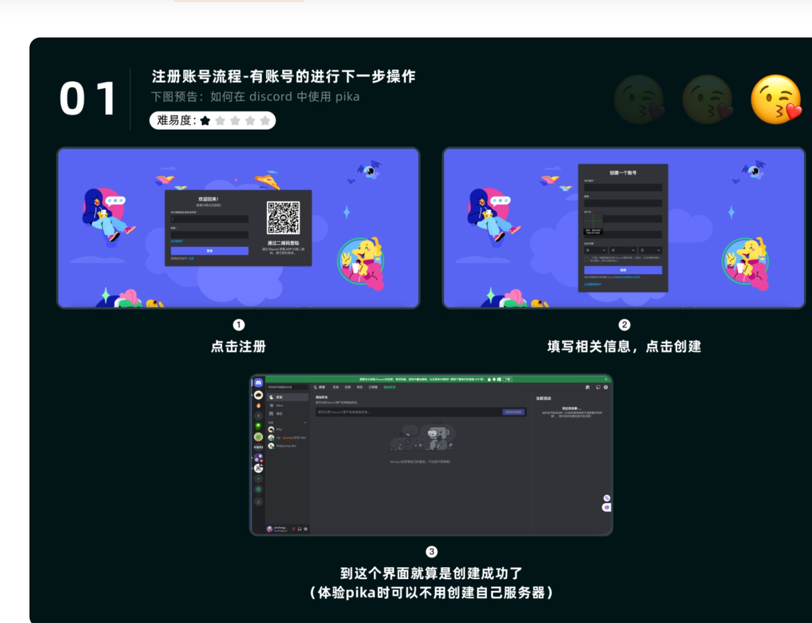
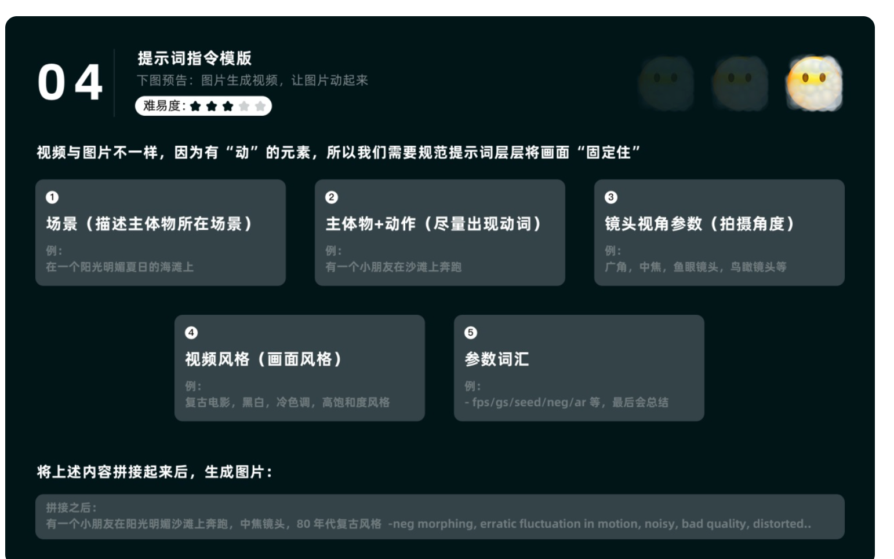
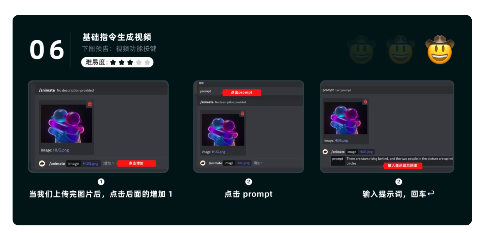
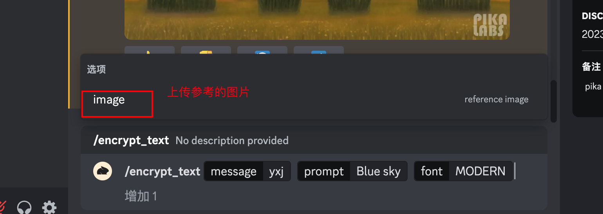

# **PIKA背景简介**

Pika 是什么？用生成式 AI 技术能够生成和编辑 3D 动画、动漫、卡通和电影等各种风格的视频。也是 Runway Gen-2 的最强竞品。

那么，今天就带来 [Pika Labs](https://www.uisdc.com/tag/pika-labs) 的完整使用指南（目前社区为试用版，最多可以生成三秒），大家可以先行体验，后续排队拿到 1.0 体验资格后会继续为大家带来更新。

## 一、注册&如何使用

### **1. 注册 discord 账号**

相信大概部分用过 MJ 的小伙伴已经有账号了，这里再给大家简单重复一下注册步骤相关网站

1. discord 官网： [https://discord.com/](https://link.uisdc.com/?redirect=https%3A%2F%2Fdiscord.com%2F)

2. Pika 官网： [https://pika.art/](https://link.uisdc.com/?redirect=https%3A%2F%2Fpika.art%2F) （大家可以先注册账号，加入 waitlist）

   

### **2. 将 Pika 加入个人对话**

发现很多小伙伴在添加服务器的时候会没有权限，这个时候可以按如下方法将 pika robot“加入到自己服务器里”

## 二、基础指令生成视频与功能按键解释

**1. 基础指令**

①文字提示词生成视频

在 pika labs 中，生成视频的过程非常直观。只需要在对话框中输入斜杠 “/”调出指令菜单输入 “create”，然后输入相应的提示词。文字提示是生成视频的关键，可以让你对生成的视频内容进行更精细的控制，后面会进行模版规范，让生成的内容更加符合自己的想法。

下图是为大家做的提示词指令模版，可以把闹钟的画面进行拆解，依序填写，拼接，会生成的更贴合想法一些

②根据图片生成视频

你不仅可以利用文字提示来生成视频，还可以在对话框中输入斜杠 “/”调出指令菜单输入 “animate”，上传图片后根据图片内容生成视频

③图配合提示词生成视频

有时我们上传图片后，图片的动态处理方向并不是我们想要的，那怎么办呢，可以参考下方图片+文本这种输入方式，会更好的控制图片延伸的视频方向，后续还会介绍一种功能等同的方法，方便控制视频走向。

**2. 视频功能按键**

生成视频后下方的五个功能按键介绍

## 三、进阶玩法-参数命令详解答

工欲善其事,必先利其器，参数的命令大都是对摄像机的镜头进行调整，先来说我们最常用到的一个

#### -neg 负面描述

负面提示：

neg 后续跟的词汇是不想在视频中出现的词汇，比如说 模糊，多根手指，低质量等，这里为大家提供一个模板，可以在生成视频时根据需求来删减

例如:

-neg lack of detail, erratic fluctuation in motion, noisy, bad quality, distorted, poorly drawn,morphing blurry, grainy, low resolution, oversaturated

#### -motion 增强画面动作

默认是 1，0 是没有动作，4 是动作幅度最大

数值越高，会让视频中的动作更加的强烈，建议多进行调试，3 是最不稳定的，如果出现破相等相关问题，可以在负面提示词里进行规避

#### -gs 画面（提示词）相关程度

数值越高，与提示词的相关性越强，在 8-24 之间，默认为 12

#### -seed 种子

和 MJ 里一样，保持画面一致性，下图为如何导出查看种子（MJ 的小邮件对 pika 不会触发生效）

#### -camera zoom 画面放缩

比提示词更加对镜头可控，氛围 zoom，Pan，Rotate，每次只能使用其中一个

①-camera zoom in 画面放大

②-camera zoom out 画面缩小

**-camera pan 画面平移**

将画面趋势进行不同方位的平移，这里可以配合 rotate 和 -motion# 来实现多种不错的效果

①向上平移

-camera pan up 向上平移

-camera pan up left 向左上平移

-camera pan up right 向右上平移

②向下平移

-camera pan down 向下平移

-camera pan down left 向左下平移

-camera pan down left 向右下平移

③向左&右平移

-camera pan left 向左平移

-camera pan right 向右平移

#### **-camera rotate 画面旋转**

这里需要注意下，旋转的幅度也是可以配合 -motion#来同步改变的

①顺时针旋转:

-camera rotate clockwise / -camera rotate cw

②逆时针旋转：

-camera rotate counterclockwise / -camera rotate cc

#### -fps 调整每秒的帧数 数值越高，视频越流畅 一般每秒24帧就比较流畅了

-fps 24

#### -ar 视频的宽高比

-ar 16:9 

9:16

4:5

## 4.Encrypt  -- 把文本或图案嵌入到视频中

4.1Encrypt-text把文字嵌入视频中

4.2 使用图案的话与text类似， 只是少了font这个选项。

请确保图片颜色单一，且对比明显。。pika才容易识别形状

技巧：

1.上传到参考图片：pika喜欢高密度 ，可塑性强的图像，比如 云，水，颜料，树木等，容器将文本嵌入到视频当中。

2.当使用单一图像当参考图片去生成结果时，会比较困难。

比如3个人的数量时，会很难，如果人的数量是100个时，会比较容易。

3.尽量选择黑白的图片，才比较好识别图案。

4.prompt权重会稍微大于图片参考的权重。但如何特殊情况下，你需要结果更接近与参考图，需要减少prompt，并降低重量，虽然重量越大，字体图案会更明显，但也更容易出现失真的情况

#### 4.3 prompt 

-w 加密信息的权重，数值越高，信息在视频中越明显 （范围：0-～2，默认1）

-size 设置文本的尺寸 （范围50～100 默认100）

