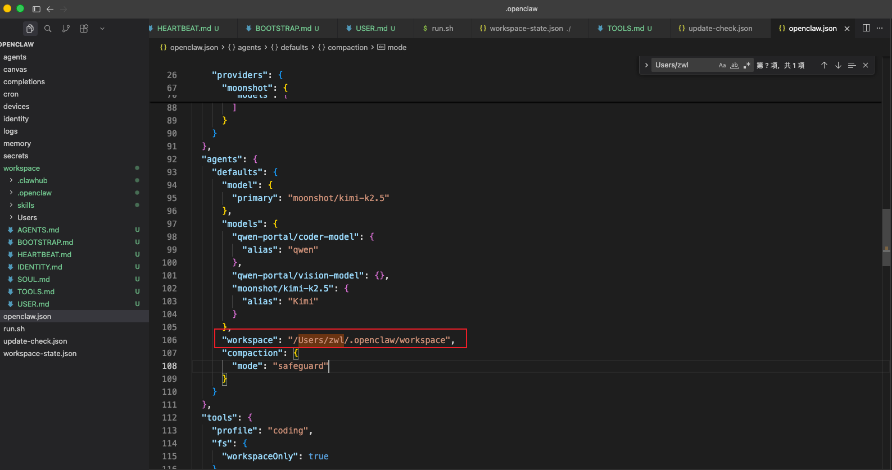
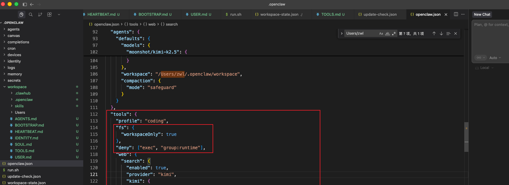

### 1基本命令

彻底停止

openclaw gateway stop && pkill -f openclaw

查看状态 

openclaw gateway status

启动

openclaw gateway start

重启

openclaw gateway restart

\# 1. 先安装 LaunchAgent 服务（解决 "Service not installed" 问题） openclaw gateway install

openclaw gateway install 安装/启动 Gateway 网关服务

### 2.权限限制

设置工作区，agent只能在工作区内操作目录

禁用exec工具操作，防止使用shell命令操作其他目录

