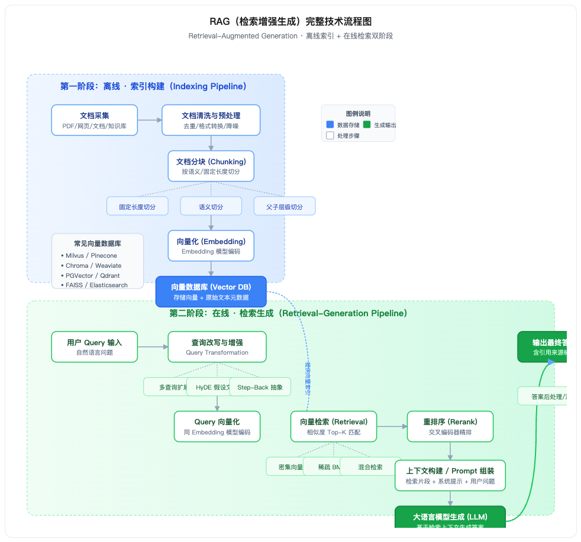
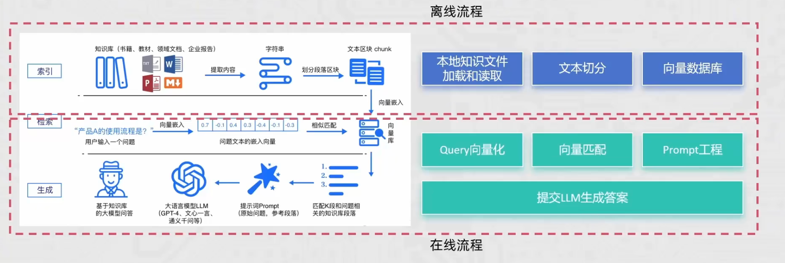
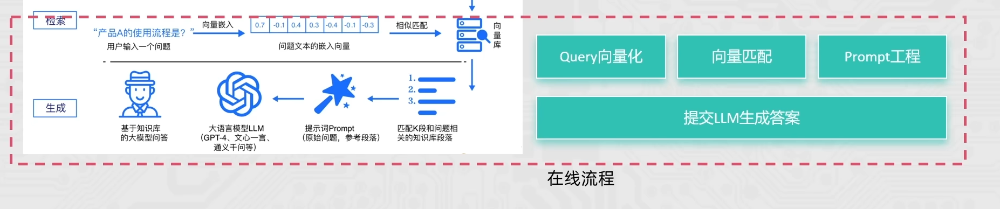
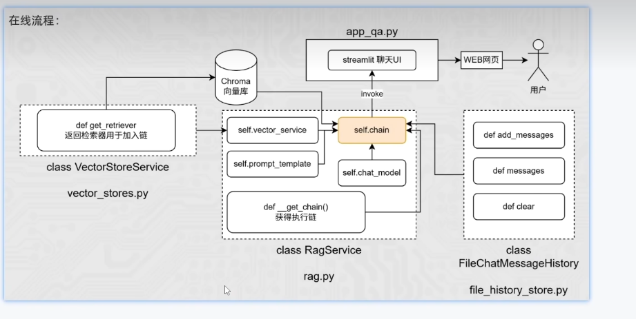

### RAG 检索增强生成技术





### 流程详细说明

**第一阶段：离线索引构建（Indexing Pipeline）** 重点是要lamaindex 这个包进行

该阶段在用户查询前预先完成，核心目标是将非结构化知识转化为可检索的向量索引。

1. **文档采集**：收集各类数据源（PDF、Word、网页、Markdown、数据库等），形成原始知识库。

   

   如果是pdf，word文档等数据，需要转成markdown格式的文档。阿里云的百炼平台有转化器 可以转成markdown格式的文档。
   实际工作中，你也可以借助百炼提供的 DashScopeParse 来完成 PDF、Word 等格式的文件解析。DashScopeParse 背后使用了阿里云的[文档智能](https://www.aliyun.com/product/ai/docmind)服务，能够帮助你从 PDF、Word 等格式的文件中识别文档中的图片、提取出结构化的文本信息。

2. **文档清洗与预处理**：去除冗余内容、统一格式、解析表格 / 图片、清理噪声数据，保证文本质量。


​		清楚无关内容


3. **文档分块（Chunking）**：将长文档切分为合适大小的文本块，常见策略包括固定长度切分、语义切分（按段落 / 章节）、父子层级切分（大段嵌套小段）。

   根据不同的场景，选择不同的切割算法


4. **向量化（Embedding）**：使用 Embedding 模型将每个文本块编码为高维稠密向量，同时保留原始文本与元数据。

   不同的embedding模型的转化效果是不一样的，最好用最新的embedding模型，text-embedding-v3,text-embedding-v4

   可以增加标签选项，给不同的切片打上标签，后续搜索时，提示搜索效率

   

5. **向量数据库存储**：将向量与对应原文、元数据一并存入向量数据库，建立索引以支持高效的相似度检索。

   Chroma 向量数据库等等


**第二阶段：在线检索生成（Retrieval-Generation Pipeline）**

用户提问时实时执行，核心是 "检索相关知识 → 注入上下文 → 模型生成答案"。

1. **用户 Query 输入**：接收用户的自然语言问题。

2. **查询改写与增强**：对原始问题进行优化，常见技术包括多查询扩展（生成多个同义问题）、HyDE（先生成假设答案再检索）、Step-Back 抽象（提炼更高层问题），提升召回率。如果用户问题比较模糊，加一个反问的ai智能体，通过提问的方式，不断完善用户的问题信息

   **【方法二：将单一查询改写为多步骤查询】**

   除了改写问题，你还可以尝试另一种思路：把复杂的问题拆解成简单的步骤。LlamaIndex 提供了两个强大的工具来实现这个功能：

   - StepDecomposeQueryTransform： 这个工具可以帮你把一个复杂问题分解成多个子问题。比如对于"张伟是哪个部门的?",它会先分解为：
     1. "公司里有几个叫张伟的员工？"
     2. "这些张伟分别在哪些部门？"

   

3. **Query 向量化**：使用与离线阶段**同一套** Embedding 模型，将用户问题编码为向量。

   

4. **向量检索**：在向量库中计算相似度，召回 Top-K 个最相关的文本块；支持密集向量检索、BM25 稀疏检索、混合检索等多种方式。

   

5. **重排序（Rerank）**：使用交叉编码器（Cross-Encoder）对初筛结果进行精细排序，进一步提升相关性准确度。

   可以扩大召回的切片数量，然后使用rerank在20个切片中，选取相关性最强的，前3个切片进行返回。

   

6. **上下文构建 / Prompt 组装**：将检索到的相关片段、系统提示词、用户问题按指定模板拼装成完整的 Prompt。

   完善prompt提示词

   

7. **大语言模型生成**：LLM 基于注入的检索上下文，生成准确、有据可依的回答。

   可以根据问题场景，选用不同的大模型，如果是简单查询场景，使用小参数模型，复杂场景引入带深度思考的推理模型。调整模型的temperature 和 top‑p，来控制生成的随机性和多样性。

   

8. **答案输出与后处理**：对生成结果进行格式化、添加引用来源标注，最终返回给用户。

   有很多rag评测框架，比较出名的是使用ragas 来评测回答的质量。嵌入一下ragas的代码，可以从多个维度对回答进行打分，比如相关性，事实准确性等维度来评判，然后优化回答的准确率。

   ragas：https://docs.ragas.io/en/stable/concepts/metrics/available_metrics/


最后引入trulens这个rag测试框架对rag项目进行观察，可以观察用户输入的问题，tag召回的内容，上下文组装的内容，调用了什么大模型，生成了什么答案。可以基于观测的日志，进行不断优化。


项目运行上线后，也不是结束了，要持续进行数据采集——知识更新——专家验证的流程。要不断的完善rag的文档资料，然后进行解析和更新，最后把生成的结果给业务专家进行验证，根据验证结果，不断完善系统，提高整体项目的准确率。


RAG项目流程图




项目步骤

#### 1.离线流程

整理文档资料（md，pdf，doc，txt）最好是MD文档的格式，然后维护一个存储文件映射的文件fileHashMap.txt，每次需要把文档存入向量数据库时，都对文件进行一次哈希函数加密，然后查询fileHashMap.txt是否存在对应的密文，如果没有则把文档解析成向量并存入向量数据库中，然后把文件的哈希值，写入文件中fileHashMap.txt。


3个技术点

 1 其中对多个文档资料读取时 需要使用分块，多线程的方式进行哈希运算，提升效率

2 可以指定内容转向量时的embedding模型，例如下面代码中的text-embedding-v4

```
self.chroma = Chroma(
            collection_name=config.collection_name,     # 数据库的表名
            embedding_function=DashScopeEmbeddings(model="text-embedding-v4"),
            persist_directory=config.persist_directory,     # 数据库本地存储文件夹
        )     # 向量存储的实例 Chroma向量库对象
```

3 对文档资料进行切割时，可以定义切割字符串，切割size等等信息

        self.spliter = RecursiveCharacterTextSplitter(
            chunk_size=config.chunk_size,       # 分割后的文本段最大长度
            chunk_overlap=config.chunk_overlap,     # 连续文本段之间的字符重叠数量
            separators=config.separators,       # 自然段落划分的符号
            length_function=len,                # 使用Python自带的len函数做长度统计的依据
        )     # 文本分割器的对象
```python
"""
知识库
"""
import os
import config_data as config
import hashlib
from langchain_chroma import Chroma
from langchain_community.embeddings import DashScopeEmbeddings
from langchain_text_splitters import RecursiveCharacterTextSplitter
from datetime import datetime


def check_md5(md5_str: str):
    """检查传入的md5字符串是否已经被处理过了
        return False(md5未处理过)  True(已经处理过，已有记录）
    """
    if not os.path.exists(config.md5_path):
        # if进入表示文件不存在，那肯定没有处理过这个md5了
        open(config.md5_path, 'w', encoding='utf-8').close()
        return False
    else:
        for line in open(config.md5_path, 'r', encoding='utf-8').readlines():
            line = line.strip()     # 处理字符串前后的空格和回车
            if line == md5_str:
                return True         # 已处理过

        return False


def save_md5(md5_str: str):
    """将传入的md5字符串，记录到文件内保存"""
    with open(config.md5_path, 'a', encoding="utf-8") as f:
        f.write(md5_str + '\n')


def get_string_md5(input_str: str, encoding='utf-8'):
    """将传入的字符串转换为md5字符串"""

    # 将字符串转换为bytes字节数组
    str_bytes = input_str.encode(encoding=encoding)

    # 创建md5对象
    md5_obj = hashlib.md5()     # 得到md5对象
    md5_obj.update(str_bytes)   # 更新内容（传入即将要转换的字节数组）
    md5_hex = md5_obj.hexdigest()       # 得到md5的十六进制字符串

    return md5_hex


class KnowledgeBaseService(object):
    def __init__(self):
        # 如果文件夹不存在则创建，如果存在则跳过
        os.makedirs(config.persist_directory, exist_ok=True)

        self.chroma = Chroma(
            collection_name=config.collection_name,     # 数据库的表名
            embedding_function=DashScopeEmbeddings(model="text-embedding-v4"),
            persist_directory=config.persist_directory,     # 数据库本地存储文件夹
        )     # 向量存储的实例 Chroma向量库对象

        self.spliter = RecursiveCharacterTextSplitter(
            chunk_size=config.chunk_size,       # 分割后的文本段最大长度
            chunk_overlap=config.chunk_overlap,     # 连续文本段之间的字符重叠数量
            separators=config.separators,       # 自然段落划分的符号 separators = ["\n\n", "\n", ".", "!", "?", "。", "！", "？", " ", ""]
            length_function=len,                # 使用Python自带的len函数做长度统计的依据
        )     # 文本分割器的对象

    def upload_by_str(self, data: str, filename):
        """将传入的字符串，进行向量化，存入向量数据库中"""
        # 先得到传入字符串的md5值
        md5_hex = get_string_md5(data)

        if check_md5(md5_hex):
            return "[跳过]内容已经存在知识库中"

        if len(data) > config.max_split_char_number:
            knowledge_chunks: list[str] = self.spliter.split_text(data)
        else:
            knowledge_chunks = [data]

        metadata = {
            "source": filename,
            # 2025-01-01 10:00:00
            "create_time": datetime.now().strftime("%Y-%m-%d %H:%M:%S"),
            "operator": "小曹",
        }

        self.chroma.add_texts(      # 内容就加载到向量库中了
            # iterable -> list \ tuple
            knowledge_chunks,
            metadatas=[metadata for _ in knowledge_chunks],
        )

        #
        save_md5(md5_hex)

        return "[成功]内容已经成功载入向量库"


if __name__ == '__main__':
    service = KnowledgeBaseService()
    r = service.upload_by_str("周杰轮222", "testfile")
    print(r)

```


2.在线流程

获取用户的输入，然后把用户的输入转成向量，转成向量后去向量数据库中查询，查询出结果后，把用户的输入和查询的向量结果组成一段prompt 给大模型，获取大模型的结果，返回给用户







短期记忆的话可以使用langchain的History功能实现

```
LangChain提供了历史功能，帮助模型在有历史记忆的情况下回答。


基于RunnableWithMessageHistory在原有链的基基础上创建带有历史记录功能的新链(新Runnable实例）)

基于InMemoryChatMessageHistory为历史记录提供内存存储(临时用)。存储在内存中，程序重启的话会丢失
```


长期记忆

实现一个Fi leChatMessageHistory 继承 BaseChatMessageHistory
我们可以自行实现一个基于Json格式和本地文件的会话数据保存。


Rag 项目如果优化回答准确率？

1.