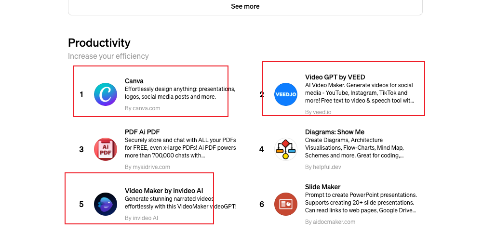

## 文本类

1.chatgpt 生成文本。

## 图片类

1.mj生成图片。

2.gpt 的 dell3

Canna 设计大师 可以根据要求设计任何事

video GPT by veed 和video maker by invideo ai 生成视频，但效果一般。

加强版的dell 3:gpts:https://chat.openai.com/g/g-1w6xd1o0W-hui-hua-da-shi-hua-tu-chao-ji-dalle

3.修复图片或视频，让图片或视频 更加清晰的工具（https://www.youtube.com/watch?v=iSBqyVWTqhU&list=PLPpU3NyRmFI7fZcxZknZZ2K795IaJIA1I&index=16）：CodeFormer

## 视频类

1.gpts插件生成视频。

2.pika， runway 生成视频。

3.修复图片或视频，让图片或视频 更加清晰的工具（https://www.youtube.com/watch?v=iSBqyVWTqhU&list=PLPpU3NyRmFI7fZcxZknZZ2K795IaJIA1I&index=16）：CodeFormer

4.生成数字人视频 heygen ，可以声音克隆 ，还可以让视频中的人中国人说英语。

5.可以使用ai工具加强画质，修复视频。

6.视频转动漫风格 domo ai。

7.ai换脸

1.使用discord 在线 换instaface(https://www.youtube.com/watch?v=FnljDHgQSmc) 

2.使用roop下载在本地部署，在本地换：https://www.youtube.com/watch?v=nSDz2W7SbOk

