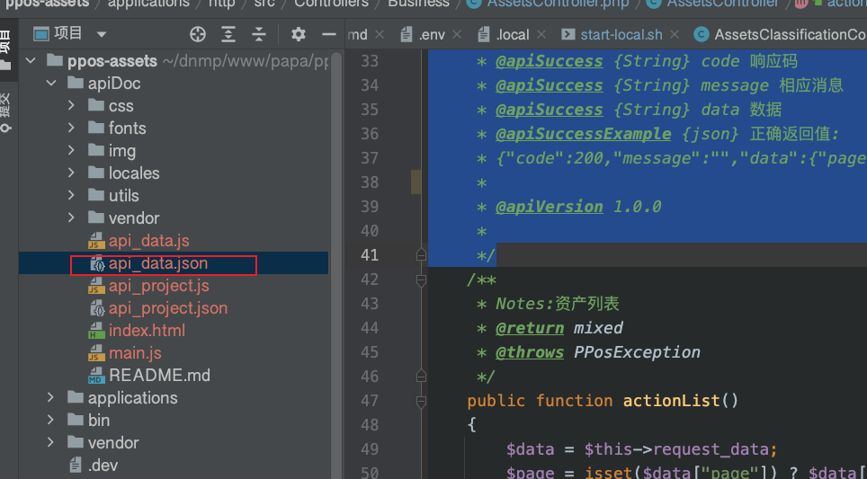

## 1.使用apidoc的注释格式 编写接口的注释

```php
		/**
     *
     * @api {post} /assets/Assets/list 资产列表
     * @apiDescription 功能描述: 资产列表
     * @apiGroup V509-资产管理-资产管理
     * @apiHeader {String} Authorization 用户授权token
     * @apiHeader {String} Content-Type=application/json The content type of the request.
     * @apiBody {String{200}} [keyword] 搜索关键字：资产编号、资产名称
     * @apiBody {String="small","huge"} [ac_ids] 资产分类ID  12,1201,120101
     * @apiBody {String} [start_date] 开始日期  开始日期 格式 yy-mm-dd
     * @apiBody {String} [end_date] 结束日期  开始日期 格式 yy-mm-dd
     * @apiBody {Object} [test_object]="2024-07-22" 结束日期
     * @apiBody {String[]} [test_str_arr] 结束日期
     * @apiBody {Number} page 页码 默认1
     * @apiBody {Number} size 分页　默认10
     * @apiSuccess {String} code 响应码
     * @apiSuccess {String} message 相应消息
     * @apiSuccess {String} data 数据
     * @apiSuccessExample {json} 正确返回值:
     * {"code":200,"message":"","data":{"page":1,"size":"10","list":[{"assets_id": 资产ID,"assets_number": 资产编号,"ac_id": "资产分类ID","ac_name": "资产分类","assets_name": "资产名称","specifications": "规格型号","cost": "价值(元)","book_value": "账面净值","use_status": "使用状态","use_status_text": "使用状态文本","remark": "备注"}],"count":"10"}}
     *
     * @apiVersion 1.0.0
     *
     */
```

apidoc的文档：https://apidocjs.com/#param-api-body

常用的是 

1. 有[]  说明test_str_arr是可选。没有[]说明testr是必填

 @apiBody {String[]} [test_str_arr] 结束日期  

@apiBody {String[]} test 测试


2. 说明test_object的默认值是2024-07-22

[test_object]="2024-07-22" 结束日期


## 2.然后跑apidoc命令


必须要安装0.29.0版本的apidoc（https://apifox.com/help/api-docs/importing-api/apidoc）

npm install apidoc@0.29.0 -g 或者 npm install apidoc@0.29.0 --location=global


要卸载旧版本的 `apidoc`，你可以使用 `npm uninstall` 命令。全局卸载 `apidoc` 的命令如下：

npm uninstall -g apidoc


 ppos-assets git:(develop) ✗ apidoc -i ./applications/http/src/Controllers/Business/ -o ./apiDoc

{"level":"warn","message":"Please create an apidoc.json or apidoc.config.js configuration file or add an 'apidoc' key to your package.json."}

说明成功了，只是有警告而已




对接的目录下有文件生成


直接打开index.html就可以看到文档。


## 3.直接把接口生成出来的json，导入到apifox。

api_data.json就是对应的json参数


然后新增好对应的定时导入，把本地的json文件路径放进去


然后每次写完注释，重新生成json文件，再点击导入即可。