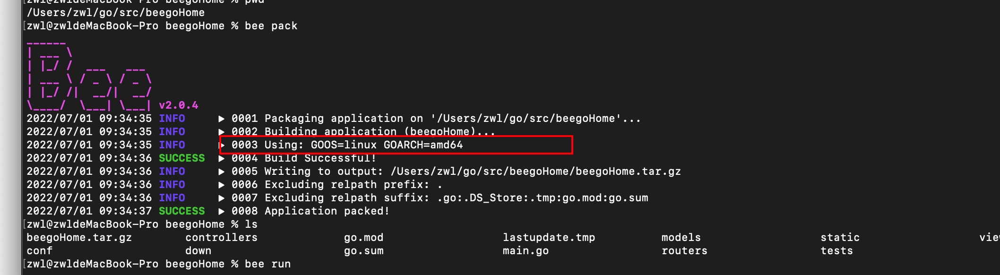
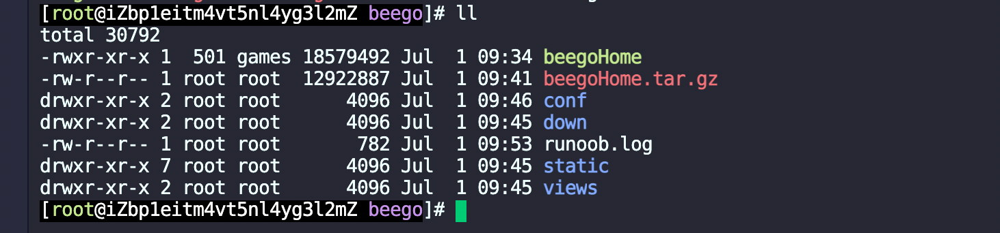

1.拿不到post请求中的body参数？

```
需要在app.conf开启配置copyrequestbody = true
```


2.beego部署

1.首先需要设置包的环境

export GOOS=linus

export GOOS=amd64




然后再执行bee pack命令就会在当前目录下，生成一个压缩文件。


把压缩文件放在linux服务器上，解压后的文件目录下，会有一个可执行的二进制文件。




执行二进制文件即可把项目跑起来。./beegoHome 或者

nohup /home/wwwroot/beego/beegoHome > runoob.log 2>&1 &

会把项目输出的数据，重定向到当前的runoob.log文件中。


一般推荐使用Supervisord部署。


```
bee dockerize -image="library/golang:1.18.3" -expose=8080
```