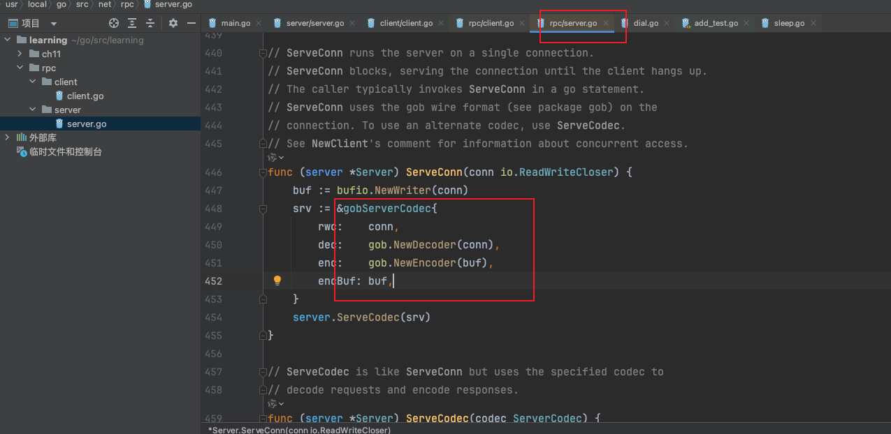
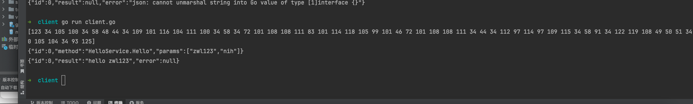

### 1.Go rpc初体验

使用go自带的rpc包，做一个rpc服务


服务端

```go
package main

import (
	"net"
	"net/rpc"
)

type HelloService struct {
}

func NewHelloService() *HelloService {
	return &HelloService{}
}

func (h *HelloService) Hello(request string, response *string) error {
	*response = "hello " + request
	return nil
}

func main() {
	//1. 实例化一个server
	listen, err := net.Listen("tcp", ":8900")
	if err != nil {
		panic("error")
	}
	//2. 注册处理逻辑 handler
	err = rpc.RegisterName("HelloService", NewHelloService())
	if err != nil {
		return
	}

	//3. 启动服务
	conn, _ := listen.Accept()
	rpc.ServeConn(conn)// 会在这里监听
}

```


客户端

```go
package main

import (
	"fmt"
	"net/rpc"
)

func main() {

	//建立一个tcp链接  发送一个请求给链接 内容是zwl
	client, err := rpc.Dial("tcp", "localhost:8900")
	if err != nil {
		panic("error")
	}

	response := new(string)
	err = client.Call("HelloService.Hello", "zwl", response)
	if err != nil {
		fmt.Println(err)
		return
	}

	fmt.Println(*response)

}

```


没有指定编码协议，用的是go自带的gob编码协议




### 2.rpc 使用json传输 替换go自带的gob

服务端

使用jsonrpc.NewServerCodec(conn) 修改编码和解码协议

```go
package main

import (
	"net"
	"net/rpc"
	"net/rpc/jsonrpc"
)

type HelloService struct {
}

func NewHelloService() *HelloService {
	return &HelloService{}
}

func (h *HelloService) Hello(request string, response *string) error {
	*response = "hello " + request
	return nil
}

func main() {
	//1. 实例化一个server
	listen, err := net.Listen("tcp", ":8900")
	if err != nil {
		panic("error")
	}
	//2. 注册处理逻辑 handler
	err = rpc.RegisterName("HelloService", NewHelloService())
	if err != nil {
		return
	}

	//3. 启动服务
	conn, _ := listen.Accept()
	rpc.ServeCodec(jsonrpc.NewServerCodec(conn))
}

```


客户端

```go
package main

import (
	"fmt"
	"net"
	"net/rpc"
	"net/rpc/jsonrpc"
)

func main() {

	//建立一个tcp链接  发送一个请求给链接 内容是
	conn, err := net.Dial("tcp", "localhost:8900")
	if err != nil {
		panic("error")
	}

	response := new(string)

	client := rpc.NewClientWithCodec(jsonrpc.NewClientCodec(conn))
	err = client.Call("HelloService.Hello", "zwl", response)
	if err != nil {
		fmt.Println(err)
		return
	}

	fmt.Println(*response)

}

```


### 3.之前用的是tcp传输，现在使用http协议来传输


```go
package main

import (
	"bytes"
	"encoding/json"
	"fmt"
	"io/ioutil"
	"net/http"
)

func main() {

	//发送一个http请求

	//Read io.Reader

	//requestStruct := struct {
	//	id     int
	//	params []string
	//	method string
	//}{
	//	0,
	//	[]string{"zwl"},
	//	"HelloService.Hello",
	//}

	requestStruct := map[string]interface{}{"id": 0, "params": []string{"zwl123", "nih"}, "method": "HelloService.Hello"}

	jsonByte, err := json.Marshal(requestStruct)
	if err != nil {
		panic("error")
	}
	fmt.Println(jsonByte)
	fmt.Println(string(jsonByte))

	//http.NewRequest("POST", "http://localhost:8900/jsonrpc", bytes.NewReader(jsonByte))
	req, _ := http.NewRequest("POST", "http://localhost:8900/jsonrpc", bytes.NewBuffer(jsonByte))

	//设置请求头
	req.Header.Set("Content-Type", "application/json")

	//发起请求
	client := &http.Client{}
	resp, err := client.Do(req)
	if err != nil {
		panic(err.Error())
	}
	defer resp.Body.Close()

	body, err := ioutil.ReadAll(resp.Body)
	if err != nil {
		panic(err.Error())
	}

	fmt.Println(string(body))

}

```


服务端

```go
package main

import (
	"io"
	"net/http"
	"net/rpc"
	"net/rpc/jsonrpc"
)

type HelloService struct {
}

func NewHelloService() *HelloService {
	return &HelloService{}
}

func (h *HelloService) Hello(request string, response *string) error {
	*response = "hello " + request
	return nil
}

func main() {

	//给某一个请求，绑定一个处理逻辑

	//给rpc服务，注册对应对处理逻辑
	err := rpc.RegisterName("HelloService", NewHelloService())
	if err != nil {
		return
	}

	http.HandleFunc("/jsonrpc", func(writer http.ResponseWriter, request *http.Request) {

		conn := struct {
			io.Writer
			io.ReadCloser
		}{
			Writer:     writer,
			ReadCloser: request.Body,
		} //conn io.ReadWriteCloser

		err := rpc.ServeRequest(jsonrpc.NewServerCodec(conn))
		if err != nil {
			return
		}

	})

	http.ListenAndServe(":8900", nil)

}

```





### 4.封装后的方法

看 md/go/rpc和grpc/code/封装后的rpc代码


