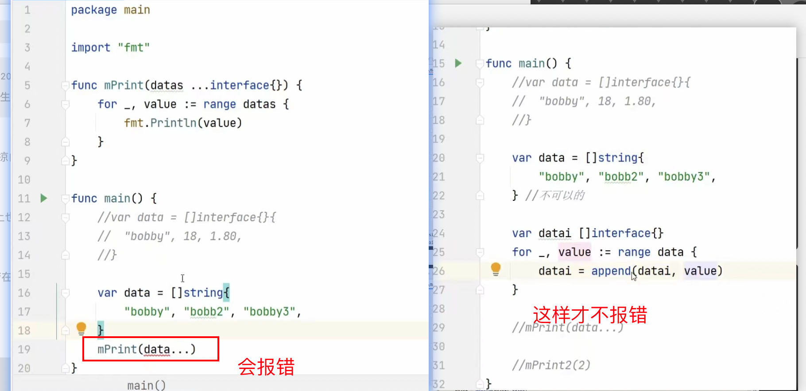

## 	基础知识

### 1.变量定义用var定义

```
var name string = '张三'

或者不用限制类型，编译器会自动根据初值赋予变量类型
var name = '张三'

也可以同时定义多个类型，比如
var name, isBoy, age = '张三', true, 18

也可以这样
var = (
	name = '张三'
	isBoy = true
	age = '18'
)

在函数内部可以:=定义变量。在函数外部是不可以的，var 关键字在函数内外都可以定义。
比如：func demo () {
		name := '张三'
		
		isBoy, age := true, 18
}
```


### 2.数据类型

分为基本数据类型和复合数据类型

基本数据类型：int, float, string,bool

复合数据类型：array, slice,map,function,pointer,channel,list链表


数组的数据类型：【size】type,比如：var array1 = [4]int{1,2,3,4},    数据类型：则为[4]int（【size】type）


[]byte字节切片 的 存储空间


#### 类型转换 

go是一种强类型的语言，所以如果在赋值的时候两边类型不一致会报错，就连int都分为int,int8,int32,int64这么多种。

但同一基础类型（int,float）的变量在转换时很简单，都可以通过括号括起来即可，因为他们的底层都是一个类型的。

使用 `type (a)`这种形式来进行强制类型转换,比如

```
var a int32  = 10
var b int64 = int64(a)

b := 1.589
c := int(b)
fmt.Println(c)//1
```


#### 2.1切片

```
var s1 []int //定义了一个切片，还没有给其赋值。此时s1是nil

s1 := make([]int,0)//定义了一个切片，切片中有0个元素。此时s1不是nil,是一个空切片
此时如果想给切片增加元素时，不能通过s1[i] = i的方式，只能通过s1=append(s1,i)的方式。因为切片的长度是0，获取不到s1[i]的值。

s :=[] int {1,2,3}  //定义且赋值
```

当在已有数组的基础上，定义一个切片

比如


如果定义的切片第一个元素，也是是从数组的第一个元素开始。比如切片s2，那么切片储存的内存地址，和数组一致。如果定义的切片的第一个元素和数组的不一样，比如切片s1，那么切片储存的地址和数组的地址会不一样。


切片类型的变量，如果直接用fmt.Printf("%p\n",s2)输出格式化的变量时，会输出切片底层储存数组的内存地址。如果加上&代表取变量的地址符，会取到切片变量本身在内存中的地址。


切片的储存


append函数是在切片的基础上追加一个元素。


##### 切片复制 

如果想获取一个切片的元素，并且不受后续切片改变带来的影响，可以借助append函数

```go
append([]int(nil),*dp...)

*dpTotal = append(*dpTotal, append([]int(nil), *dp1...))//如果后续*dp1改变了，不会影响dpTotal
*dpTotal = append(*dpTotal,*dp1)//如果后续*dp1改变了，会直接影响dpTotal，因为他是把内存地址仍进去了dpTotal

```


如果想复制一个切片，使用copy即可。

```go
//不想让arr受到排序的影响，所以使用copy将，arr复制一份出来给tmp。
func getMaxValue(arr []int) int {
	tmp := make([]int, len(arr))
	copy(tmp, arr)
	sort.Ints(tmp)
	return tmp[len(tmp)-1]
}
```

map转切片时：阻止切片自动扩容，来节省性能

```
resSlice := make([]string, 0, len(resMap))
	//fmt.Println(len(resSlice),cap(resSlice))
	for k, _ := range resMap {
		resSlice = append(resSlice, k)
	}
	
	这样子，切片不会自动扩容，切片长度就是len(resMap)
	
```


1.切片底层原理

切片本质上，还是值传递。底层是一个struct 结构体。当进行传递时，会把复制一个结构体，指向底层的同一个数组。比如s1和s2。s1赋值给s2，此时他们都指向了底层同一个数组。当s2不停点append时，会触发扩容，此时会把s1底层指向的数组复制一份出来，指向最新的数组。此时改了s2的某个值，s1不会改变。底层数组512之后不是成倍扩容


#### 2.2字符串

字符串不能修改


字符串其实是字节的集合


不过可以通过格式化打印来展示编码对应的数值

```
fmt.Printf("%c",string1[0]) // 输出h
fmt.Printf("%c",104) // 输出h
```


#### 2.3函数数据类型


函数是数据类型是：func (int),  如果是只写函数名，没有小括号则取的是函数的内存地址。


#### 2.4指针

什么是指针？就是一个存储了的内存地址的变量

指针定义： var p *int   代表指针p是需要指向一个整型变量的指针。其中int可以换成其他数据类型

var a = 10

p = &a //代表指针p指向了变量a的内存地址


当变量传递时，大多数情况下会是值传递，此时可以考虑是否能用指针的形式，进行传递，因为值传递会拷贝一份变量出来，再进行传递，效率没有那么高，特别时变量占用的内存比较大的时候，比较浪费性能。此时可以考虑使用指针。

```go
package main

import "fmt"

func main() {
	var a = 10
	var p *int
	p = &a

	fmt.Println(p,a) //指针指向的内存地址，a的值
	fmt.Println(&p) //存储指针的内存地址
	fmt.Print(*p) // 指针加上*号，就代表访问变量a
}

//输出
0x1400012c008 10
0x14000126018
10

```


当指针指向了一个结构体的时候，不用*号，可以直接p.name访问，因为go做了优化。如上图。

类型为指针的数组（简称为指针数组）

```
	arr1 := [3]int{1,2,3}
	p1 := &arr1

	// 其中(*p1)可以简写成p1
	(*p1)[1] = 100
	fmt.Println(arr1)
	p1[1] = 200
	fmt.Println(arr1)
```


在c中指针可以运算的，这个能力go有可以，只是放在unsafe包中。少数情况下会用到。


##### 指针命名规范 

取首字母小写，作为指针的命名

```
typer Person struct {
	name string
	age int
}

typer PersonBoy struct {
	name string
	age int
}

p := new(Person)
pb := new(Person)


func (pn *Person) get(a int,b int) (int,error) {
	//
}
```


#### 2.5结构体

结构体是一种可以储存，不同数据类型数据构成的数据集合，构成结构体的一系列数据称为成员变量，也称字段。

定义方式


```go
package main

import "fmt"

func main() {

//三种定义方式，如下
	//1
	var person1  = Person{}
	person1.name = "allen"
	person1.age = 20
	person1.address = "china"

	//2
	person2 := Person{
		name:"allen",
		age:20,
		address:"china",
	}

	//3
	person3 := Person{"allen",20,"china"}
	fmt.Print(person1)
	fmt.Print(person2)
	fmt.Print(person3)
}

type Person struct {
	name string
	age int
	address string
}


//{allen 20 china}{allen 20 china}{allen 20 china}
```

结构体还可以嵌套，比如

```
var person1  = Person{}
person1.name = "allen"
person1.age = 20

address := Address{
   city: "shenzhen",
   home: "512",
}
person1.address = address

fmt.Println(person1)

//{allen 20 {shenzhen 512}}

```


匿名结构体

```
匿名结构体
s1 := struct {
		name string
		age int
	}{
		"mike",
		20,
	}
```


匿名字段

​	**//person1.city = "china" 当匿名字段是一个结构体时，可以简写，只能.拼接上对应的属性**

```go
package main

import "fmt"

func main() {
	var person1  = Person{}
	person1.name = "allen"
	person1.age = 20
	person1.Address.city = "china"
	//person1.city = "china" 当匿名字段是一个结构体时，可以简写，只能.拼接上对应的属性
	person1.home = "512"

	fmt.Println(person1)
}

type Person struct {
	name string
	age int
	Address	
}

type Address struct {
	city string
	home string
}

//{allen 20 {china 512}}

```

结构体指针，可以简写

​	**下面的(*p5) 可以简写成p5**

```
	var person1  = Person{}
	person1.name = "allen"
	person1.age = 20
	person1.address = "china"
	
	p5 := &person1
	fmt.Println(p5)

	//*p5.name = "boy" 这样会报错，要加小括号变成(*p5).name
	(*p5).name = "boy"
	fmt.Println(*p5)
	fmt.Println(person1)

	//(*p5) 可以简写成p5
	p5.name = "girl"
	fmt.Println(*p5)
	fmt.Println(person1)
	
	
```


##### 空结构体

在 Go 语言中，`struct{}{}` 表示一个空结构体（empty struct）。空结构体不包含任何字段，因此不占用任何内存空间，常用于那些需要类型但不需要存储数据的场景。

在您提供的代码片段中，`struct{}{}` 被用于一个映射（map）的值，这是一种常见的用法，特别是在需要集合（set）的场景中，但 Go 语言本身不直接支持集合类型。

```go
//removeDuplicateElement 删除数组重复元素...
func (that Mp) RemoveDuplicateElement(originals interface{}) (interface{}, error) {
	temp := map[string]struct{}{}
	switch slice := originals.(type) {
	case []string:
		result := make([]string, 0, len(originals.([]string)))
		for _, item := range slice {
			key := fmt.Sprint(item)
			if _, ok := temp[key]; !ok {
				temp[key] = struct{}{}
				result = append(result, item)
			}
		}
		return result, nil
	case []int64:
		result := make([]int64, 0, len(originals.([]int64)))
		for _, item := range slice {
			key := fmt.Sprint(item)
			if _, ok := temp[key]; !ok {
				temp[key] = struct{}{}
				result = append(result, item)
			}
		}
		return result, nil
	default:
		return nil, errors.New("Unknown type...")
	}
}
```


#### 2.6集合map

#### 判断某个变量是否是某个数据类型断言

#### 判断map中，是否含有对应的字段

```go
string1 := map[string]interface{}{"string":"1","name":"mike"}

	fmt.Println(string1)
	fmt.Printf("%T",string1)

	v,ok := string1["string"]//判断string1变量中是否含有string字段
	if !ok {
		fmt.Println("没有string")
	} else {
		fmt.Println("有string")
		fmt.Println(v)
	}

	if n, ok := v.(int); ok{//判断是类型是否是int
		fmt.Println(n)
	} else {
		fmt.Println("v的类型不是int")
	}


//判断interface{}是什么类型
switch vv := v.(type) {
		case *bodyXml:
			fn, err := setBodyXml(req, resp, r.xmlEncOpts, vv.v)
			if err != nil {
				return nil, err
			}
			delayedFunc = append(delayedFunc, fn)
		case url.Values:
			p := param{vv}
			if method == "GET" || method == "HEAD" {
				queryParam.Copy(p)
			} else {
				formParam.Copy(p)
			}
		case Param:
			if method == "GET" || method == "HEAD" {
				queryParam.Adds(vv)
			} else {
				formParam.Adds(vv)
			}
		case error:
			return nil, vv
		}


//返回token
		//_value := _response.Get("token")  //return interface{}
		//var _token string
		//switch valueType := _value.(type) {
		//case string:
		//	_token = valueType
		//default:
		//	_token = ""
		//}

		_value := _response.Get("token")
		var _token string
		v, ok := _value.(string)
		if ok {
			_token = v
		} else {
			//不是string，
			_token = ""
		}

		return _token
```


map转切片时：阻止切片自动扩容，来节省性能

```go
resSlice := make([]string, 0, len(resMap))
	//fmt.Println(len(resSlice),cap(resSlice))
	for k, _ := range resMap {
		resSlice = append(resSlice, k)
	}
	
	这样子，切片不会自动扩容，切片长度就是len(resMap)
```


#### 2.7数组

初始化一个有长度的二维切片

```
dp := make([][]int, length)
	for i := 0; i < 10; i++ {
		dp[i] = make([]int, length1)
	}
```


### 3.值传递和引用传递

引用传递：把内存地址传递给了另外一个变量。属于引用传递的数据类型是：slice，map,channel

值传递：把变量的值，复制了一份，传递给了另外一个变量。属于值传递的数据类型是：int， float，bool，string，array


### 5.defer关键字 延迟执行

用于延迟一段代码的执行。适用场景：打开文件后，可以defer close操作 继续读和写。防止忘记close文件资源。defer close会在外围函数即将结束时，执行。

注意事项

1.当外围函数中的语句正常执行完毕时，只有其实所有的延迟函数都执行完毕，外围函数才会真正的结束执行。

2.当外围函数中的return语句时，只有defer延迟的函数都执行完时，才会真正的返回

3.当外围函数中引发panic错误时，只有当延迟的函数都执行完时，panic才会真正的扩展至调用的函数。


因为defer的延迟执行，是延迟函数内部代码段段执行。实参和形参的赋值是不会延迟的。所以defer时，当时a等于1,已经把a传给了函数get1，get1中的a已经时1了。而get1延迟执行了。所以先执行了a++，输出了2，再执行get1，输出1.


defer的5大特性

1.先进后出


先打开的资源，可能被后续的代码，依赖，所以先defer的最后执行也合理。


2.defer作用域仅为当前函数


3.defer后的函数形参在声明时确认


形参是指针类型的，所以传进去的是一个指针，所以最后执行defer时，会拿到指针对应的值


其中的num没有通过形参的方式传进去，而且在最后defer执行时去获取全局变量num。所以最后defer执行时会

出现num=10


4 return 与 defer的执行顺序是： return先，defer后

函数返回过程
有一个事实必须要了解，关键字return不是一个原子操作，实际上return只代理汇编指令ret，即将跳转程序执行。比如语句return i，实际上分两步进行，即将i值存入栈中作为返回值，然后执行跳转，而defer的执行时机正是跳转前，所以说defer执行时还是有机会操作返回值的。


num 一开始被 返回值的类型定义成了 整型的默认值0，然后num = 10 , 从0变成10, 然后 return 2 ,从10变成2，

然后执行defer，因为没有形参，走的全局变量此时defer中的num取值是2，2+5 = 7。然后函数真正的结束，num=7返回了。


5.panic 时 已声明的defer会出栈执行


正是利用这个特性，可以在panic之前使用defer函数，在defer中使用recover函数，捕获错误，防止程序崩溃。


1.函数返回过程
有一个事实必须要了解，关键字return不是一个原子操作，实际上return只代理汇编指令ret，即将跳转程序执行。比如语句return i，实际上分两步进行，即将i值存入栈中作为返回值，然后执行跳转，而defer的执行时机正是跳转前，所以说defer执行时还是有机会操作返回值的。

举个实际的例子进行说明这个过程：

func deferFuncReturn() (result int) {
    i := 1
    defer func() {
       result++
    }()
    return i
}
该函数的return语句可以拆分成下main两行：

result = i
return


而延迟函数的执行正是在return之前，即加入defer后的执行过程如下：

result = i
result++
return

所以上面函数实际返回i++值。 

返回2


关于主函数有不同的返回方式，但返回机制就如上机介绍所说，只要把return语句拆开都可以很好的理解，下面分别举例说明

2.主函数拥有匿名返回值，返回字面值
一个主函数拥有一个匿名的返回值，返回时使用字面量，比如返回“1”、“2”、“hello”这样的值，这种情况下defer语句是无法操作返回值的。
一个返回字面值的函数，如下所示：

func foo() int {
    var i int
    defer func() {
        i++
    }()
    return 1
}


上面的return语句，直接把1写入栈中作为返回值，延迟函数无法操作该返回值，所以就无法影响返回值。

返回1


3主函数拥有匿名返回值，返回变量
一个主函数拥有一个匿名的返回值，返回使用本地或全局变量，这种情况下defer语句可以引用到返回值，但不会改变返回值。
一个返回本地变量的函数，如下所示：

func foo() int {
    var i int
    defer func() {
        i++
    }()
    return i
}

因为是匿名返回值 所以和i没关系 。上面的函数，返回一个局部变量，同时defer函数也会操作这个局部变量。对于匿名返回值来说，可以假定仍然有一个变量存储返回值，假定返回值变量为”anony”，上面的返回语句可以拆分成以下过程：

anony = i
i++
return

返回0 

由于i是整型，会将值拷贝给anony，所以defer语句中修改i值，对函数返回值不造成影响。


4主函数拥有具名返回值
主函声明语句中带名字的返回值，会被初始化成一个局部变量，函数内部可以像使用局部变量一样使用该返回值。如果defer语句操作该返回值，可能会改变返回结果。
一个影响返回值的例子：

func foo() (ret int) {
    defer func() {
        ret++
    }()
    return 0
}
上面的函数拆解出来，如下所示：

ret = 0
ret++
return
函数真正返回前，在defer中对返回值做了+1操作，所以函数最终返回1。

### 6.type关键字

#### 1.定义数据类型

#### 2.给数据类型起别名

```go
package main

import (
	"fmt"
)

func main() {

	var int1 myInt = 10
  
	var int3 intName = 11
  
	var int2 = 10
  
	int2 = int3 //不会报错，因为只是int3的数据类型是intName,而intName只是int的别名
  
	//int1 = int2 //会报错cannot use int2 (variable of type int) as type myInt in assignment。因为int1的数据类型是myInt,而int2的数据类型是int，所以会报错
  
  fun1 := demo()
	fmt.Println(fun1(1))
}

func demo() func(int) string {
	fun := func (a int) string {
		fmt.Println(a)
		return  "ok"
	}
	return fun
}

func demo()中的func(int) string可以简写成myFun

func demo() myFun {
	fun := func (a int) string {
		fmt.Println(a)
		return  "ok"
	}
	return fun
}

type myInt int //定义了新的数据类型myInt

type myFun func(int) string//定义了一个新的函数数据类型，当一些函数的数据类型比较复杂，可以定义一个新的数据类型，去简化写法

type intName = int //给int起了一个别名

```

#### 3非本地类型不能定义方法


#### 4.结构体中嵌套时使用别名


看视频吧。


### 7 error类型

error也是一种数据类型。go自带的，go没有try catch机制。

```
源码中error的数据类型 main.error

error是一个接口

type error interface {
	Error() string //Error方法，会在使用fmt打印错误时，内部自动调用Error方法获取错误信息。
}
```

如果去获取错误？

1.通过断言的方式自己去底层看错误类的字段有哪些，比如看到了底层PathError是

```go
type PathError struct {
	Op   string
	Path string
	Err  error
}
即可访问对应的字段，获取更多的错误。
```


2.断言得知错误的其他方法。


3.直接比较


#### 7.1创建错误


#### 自定义错误


### 7.1异常panic 和recover

panic会导致整个服务挂了，下面是使用panic的注意事项


recover之后，panic的程序会直接return。


### 8.sleep 程序sleep

```
//7.睡眠
	time.Sleep(3 *time.Second) //让当前的程序进入睡眠状态
	fmt.Println("main。。。over。。。。。")
```


## 函数

### 1函数其实也是一种数据类型。

函数是数据类型是：func (int),  如果是只写函数名，没有小括号则取的是函数的内存地址。


### 2 函数的可变参数

1.当函数的参数中，遇到不确定函数的个数，但参数的类型一致就可以用可变参数。

比如求多个整数的和

```
package main

import "fmt"

func main() {

	getSum(1,2,3,4)

}

func getSum(num ... int) {
	fmt.Printf("%T",num)
	fmt.Println()

	sum := 0
	for _,value := range num {
		sum += value
	}
	fmt.Println(sum)
}

//输出
[]int //num是切片类型
10  //求和是10

```

可变参数，只能放在定义函数时参数的最后面，一个函数定义中，最多只能有一个可变参数


### 3.闭包函数

什么是闭包函数？

就是一个函数a（外层函数）中的返回值也是一个函数b（内层函数）。函数b则称为闭包函数。

如果函数b中使用了函数a（外层函数）中的局部变量，则局部变量和函数b（内层函数）称为闭包结构。


闭包结构中的局部变量的生命周期会发生改变，正常的局部变量会随着函数的结束而销毁。但闭包结构中的局部变量不会，因为内层函数还要继续使用。比如下面的i

 比如

```go
package main

import "fmt"
func main() {
	a := get1()
	fmt.Println(a) //2
	fmt.Printf("%T\n",a) //2

	res1 := a()
	fmt.Println(res1)
	res2 := a()
	fmt.Println(res2)
	res3 := a()
	fmt.Println(res3)

	b := get1() //b重新调用了get1，这里的i和a中的i不是同一个内存地址。这里的i新开辟了内存地址，所以i从0开始。
	test1 := b()
	fmt.Println(test1)
}

func get1() func() int {
	i := 0
	fun := func () int{
		i++
		return i
	}
	return fun

}

//输出

0x10016da10
func() int

1
2
3

1


```


### 4.make函数和new函数

make函数，用来创建map（类似于php的关联数组），切片，channel通道

```
	创建切片，返回切片数值
	arr2 := make([]int,10)
	arr2[0]= 1
	arr2[1]= 2
	arr2[2]= 3

	创建map，返回map数值
	map2 := make(map[string]string,10)
	map2["name"] = "allen"
	map2["addr"] = "china"
```


new函数用来创建各种类型的指针

```
	p2 := new(Person)   //会创建一个对象，对象取的都是默认值。而不是一个nil。
	p2.name = "allen"
	p2.age = 20
	p2.address = "china"

	fmt.Printf("%p",p2)//0x14000062180{
	fmt.Println(*p2)//{allen 20 china}
```


## OOP面向对象

Go语⾔⾯向对象

1、Go并不是⼀个纯⾯向对象的编程语⾔。在Go中的⾯向对象，结构体替代了

类。

Go并没有提供类class，但是它提供了结构体struct，⽅法method，可以

在结构体上添加。提供了捆绑数据和⽅法的⾏为，这些数据和⽅法与类类

似。

2、Go语⾔设计的⾮常简洁优雅，Go没有沿袭传统⾯向对象编程中的诸多概念，

⽐如继承、虚⽅法、构造⽅法和析构⽅法、this等。

Go不⽀持继承，尽管匿名字段的内存和⾏为类似继承，但是它不是继

承。

3、尽管Go语⾔没有继承和多态。但是通过别的⽅式实现：

继承：通过匿名字段实现

多态：通过接⼝实现。


4、Go语⾔中学习⾯向对象，主要学习结构体struct、⽅法method、接⼝

interface。


```

```

非结构体也可以定义对应的方法，如下图。


聚合性（has -> a）

```
type Person struct {
	name string 
	age int
	address Address//出生地址
}f

type Address struct {
	city string
	home string
}

在结构体Person中，嵌套了一个Address结构体。person has a address  ，人都有一个出生地址

```


继承性(is -> a)

```
type Person struct {
	name string 
	age int
	address Address//出生地址
}

type Boy struct {
	Person //结构体作为匿名字段 
	sex string
}

结构体作为匿名字段 可模拟继承性。代表Boy is a Person


```


### 方法

go语言中的方法和函数类似

```go
package main

import "fmt"

func main() {

	address := Address{"shenzhen","512"}
	obj := Person{"allen",20,address}
	obj.getPersonInfo()
	address.getPersonInfo()

	//getPersonInfo() 会报函数不存在，因为下面定义的都是方法不是函数。

	//方法和函数的区别
	// 1.方法可以重名 2.方法必须指明调用者，比如func (obj Person) getPersonInfo()
}

//这是定义了方法
func (obj Person) getPersonInfo() {
	fmt.Println("Person obj")
	fmt.Println(obj.name)
}
func (obj Address) getPersonInfo() {
	fmt.Println("Address obj")
	fmt.Println(obj.city)
}

type Person struct {
	name string
	age int
	Address
}

type Address struct {
	city string
	home string
}
```


## 接口interface

### 接口介绍

```go
package main

import "fmt"

func main() {

	address := Address{"shenzhen", "512"}
	obj := Person{"allen", 20, address}

	address.test1()
	address.test()
	obj.test1()
	obj.test()

	var demo1 Demo
	demo1 = address
	demo1.test1()
	//demo1.city //不能访问，因为city是address结构体的，而demo1是Demo的接口对象。
  
  testInterface(address)
	testInterface(obj)
}

//这是定义了方法
func (obj Person) test() {
	fmt.Println("person test interface")
	fmt.Println(obj.name)
}
func (obj Person) test1() {
	fmt.Println("person test1 interface")
	fmt.Println(obj.name)
}


func (obj Address) test() {
	fmt.Println("address test interface")
	fmt.Println(obj.city)
}
func (obj Address) test1() {
	fmt.Println("address test1 interface")
	fmt.Println(obj.city)
}

//定义结构体，相当于类。其他语言中需要显示的实现Demo接口。比如php中需要class Person implements Demo，但go中，不需要这样，只要实现了接口对应的方法，那么此结构体就是接口的实现对象。比如Person和Address，都实现了接口中的test和test1方法。
type Person struct {
	name string
	age int
	Address
}

type Address struct {
	city string
	home string
}

//定义接口
type Demo interface {
	test()
	test1()
}

//需要一个Demo接口类型的实现。比如Person或者Address对象
func testInterface (d Demo) {
	d.test()
	d.test1()
}
```


如果某个函数，要求传入一个接口的对象。那么传入任意一个，接口的实现对象接口。比如要求传入一个Demo接口的类型。传入Person对象或者Address对象都行。


多接口实现

```go
package main

import "fmt"

func main()  {


	var dogObj Dog = &Animal{10}

	println(dogObj.say())

	var catObj Cat = &Animal{20}

	println(catObj.cute())

	//i am 10 year old
	//i am 20 year old and so cute


}
type Animal struct {
	age int
}

func (a *Animal) say() string {
	return fmt.Sprintf("i am %d year old", a.age)
}

func (a *Animal) cute() string {
	return fmt.Sprintf("i am %d year old and so cute", a.age)
}

type Dog interface {
	say() string
}

type Cat interface {
	cute() string
}

```


多接口嵌套

```go
package main

import "fmt"

func main()  {


	var dogObj Dog = &Animal{10}

	println(dogObj.say())
	println(dogObj.eat())


	var catObj Cat = &Animal{20}

	println(catObj.cute())
	println(catObj.eat())

	//i am 10 year old
	//i am 10 year old and eat full
	//i am 20 year old and so cute
	//i am 20 year old and eat full


}
type Animal struct {
	age int
}

func (a *Animal) say() string {
	return fmt.Sprintf("i am %d year old", a.age)
}

func (a *Animal) cute() string {
	return fmt.Sprintf("i am %d year old and so cute", a.age)
}

func (a *Animal) eat() string {
	return fmt.Sprintf("i am %d year old and eat full", a.age)
}

type Dog interface {
	say() string
	Eat
}

type Cat interface {
	cute() string

	Eat
}

type Eat interface {
	eat() string
}


```


### 空接口

就是接口中，没有任何的方法

```
//空接口
type A interface {

}
```

​	//空接口可以是任意类型的数据。多用在接收任意类型数据的地方。比如函数参数，数组元素的类型，切片元素的类型，map中value的类型

```
package main

import "fmt"

func main() {
	var a A
	a = "hello"
	//空接口可以是任意类型的数据。多用在接收任意类型数据的地方。比如函数参数，数组元素的类型，切片元素的类型，map中value的类型
	fmt.Println(a)

	var arr [3]interface{}
	arr[0] = 1
	arr[1] = "string"
	arr[2] = 1.11

	slice1 := make([]interface{},5,10)
	slice1[0] = 1
	slice1[1] = 1.11
	slice1[2] = "string"
	person := Address{"shenzhen","512"}
	slice1[3] = person

	map1 := make(map[string]interface{})
	map1["demo"] = "mike"
	map1["age"] = 20

	fmt.Println(arr)
	fmt.Println(slice1)
	fmt.Println(map1)
}


type Person struct {
	name string
	age int
	Address
}

type Address struct {
	city string
	home string
}

//空接口
type A interface {

}

//空接口
func anyType(a A) {

}

//a参数后面需要写一个数据类型。如果不想限制数据类型，可以直接写interface{}
func anyType1(a interface{}) {

}

```


接口嵌套（继承）

```
package main

import "fmt"

func main() {
	//var a A
	//a = "hello"//空接口可以是任意类型的数据。多用在接收任意类型数据的地方。比如函数参数，数组元素的类型，切片元素的类型，map中value的类型
	//fmt.Println(a)
	a := Person{"allen",20}
	var d Demo
	d = a
	d.test1()
	d.test()

	var aa A
	aa = a
	aa.test2()
	//aa.test()//报红，不能调用test方法。因为aa是接口A的类型，而test方法是接口Demo的方法。Demo中有A，相当于Demo继承了A，所以Demo对象（d）可以调用A父类的方法，而
	//父类对象aa,不能调用子类方法（test），只能调用test2(父类方法)
}

//这是定义了方法
func (obj Person) test() {
	fmt.Println("person test interface")
	//fmt.Println(obj.name)
}
func (obj Person) test1() {
	fmt.Println("person test1 interface")
	//fmt.Println(obj.name)
}
func (obj Person) test2() {
	fmt.Println("person test2 interface")
	//fmt.Println(obj.name)
}
func (obj Person) test3() {
	fmt.Println("person test3 interface")
	//fmt.Println(obj.name)
}


func (obj Address) test() {
	fmt.Println("address test interface")
	fmt.Println(obj.city)
}
func (obj Address) test1() {
	fmt.Println("address test1 interface")
	fmt.Println(obj.city)
}

type Person struct {
	name string
	age int
	//Address
}

type Address struct {
	city string
	home string
}

type Demo interface {
	test()
	test1()
	A //继承了接口A
	B // 继承了接口B
}

type A interface {
	test2()
}

type B interface {
	test3()
}

```


极端情况下slice的空接口问题




```
├── applications 应用目录，主要写业务的目录
│   ├── common 公共目录 公共文件存放目录 极少用
│   │   └── src
│   │       ├── Dialers
│   │       ├── Listeners
│   │       └── Models
│   ├── console 命令行目录 多用于计划任务场景,每个计划任务都是一条命令
│   │   ├── config 主要配置命令的路径和参数
│   │   ├── runtime 执行日志
│   │   │   └── logs
│   │   │       ├── 202305
│   │   │       ├── 202306
│   │   │       ├── 202307
│   │   │       └── 202308
│   │   ├── src 
│   │   │   ├── Commands 存储业务的命令行源码文件 
│   │   │   └── Libraries 系统底层文件，不用太关注 
│   │   └── template 模版文件，有个createModule命令，会自动生成curd业务，需要用到此模版文件
│   ├── doc 实现功能技术方案，用来记录开发中设计的思路，逻辑等，方便后人学习。
│   ├── http 实现http服务目录
│   │   ├── config 配置文件 主要是httpd.php 
│   │   ├── public 
│   │   │   ├── export
│   │   │   └── static 
│   │   │       └── template 模版文件，一般是excel模版
│   │   ├── runtime 日志
│   │   │   └── logs
│   │   │       ├── 202304
│   │   │       ├── 202305
│   │   │       ├── 202306
│   │   │       ├── 202307
│   │   │       └── 202308
│   │   ├── src
│   │   │   ├── Components 组件
│   │   │   ├── Controllers 控制器
│   │   │   │   ├── Business 管理后台控制器
│   │   │   │   ├── CommunityAdmin 
│   │   │   │   └── Wx 微信c端控制器
│   │   │   ├── Libraries 
│   │   │   ├── Messages 
│   │   │   ├── Middleware 中间件
│   │   │   └── Validator 验证器
│   │   └── views 视图 少用
│   │       ├── errors
│   │       ├── layouts
│   │       └── profile
│   ├── pposlib 公司专属的业务代码包
│   │   ├── Cache 缓存实现
│   │   ├── Config Config.php是路由文件
│   │   ├── Console 命令行的业务的代码
│   │   ├── Controllers 有个base控制器，base是其他业务控制器继承的基础控制器
│   │   ├── DB 数据库层
│   │   │   ├── Base 操作数据库表的文件
│   │   │   └── Orm 对base进行了业务的封装
│   │   ├── Exception 封装的异常
│   │   ├── Helpers 助手文件目录 Functions类是存放助手函数的文件，其他类文件也是类似作用。
│   │   └── Logic 业务逻辑层
│   ├── tcp tcp服务 一般不用 php主要是写业务逻辑，tcp，udp,websocket这些底层服务一般用go
│   │   ├── config
│   │   ├── runtime
│   │   └── src
│   │       ├── Controllers
│   │       ├── Handlers
│   │       ├── Libraries
│   │       └── Models
│   ├── udp udp服务 一般不用
│   │   ├── config
│   │   ├── runtime
│   │   └── src
│   │       ├── Controllers
│   │       ├── Handlers
│   │       ├── Libraries
│   │       └── Models
│   └── websocket websocket服务 一般不用
│       ├── config
│       ├── runtime
│       └── src
│           ├── Components
│           ├── Controllers
│           ├── Handlers
│           ├── Interceptors
│           ├── Libraries
│           ├── Middleware
│           └── Models
├── bin 框架的入口文件
│           
│           
│           
├──start-local.sh 框架的启动sh脚本，本地环境，start-pro.sh是生产环境，其他环境类似
├──.local 本地环境的配置


私有库
```


### 接口断言

//判断类型。

比如下面：不知道这个d是调用的Person的test还是Address的test，还是实现对象的指针类型？,此时可以通过断言的方式知道。

```go
package main

import (
	"fmt"
)

func main() {

	//instance := Person{"allen",20}
	address := Address{"allen","512"}
	var instance *Address = &address //也可以是实现类的指针类型
	fmt.Println(instance)
	getType(instance)
}

func getType(d Demo) {
	//不知道这个d是调用的Person的test还是Address的test，还是实现对象的指针类型？,此时可以通过断言的方式知道。
	//d.test()

	if instance,ok :=  d.(Person); ok{
		instance.test()
	} else if instance,ok :=  d.(Address); ok {
		instance.test()
	} else if _,ok :=  d.(*Address); ok {
		fmt.Println("指针类型...")
	}else  {
		fmt.Println("unknow...")
	}

	//switch instance := d.(type) {
	//case Person:
	//	instance.test()
	//case Address:
	//	instance.test()
	//case *Address:
	//	fmt.Println("address p...")
	//default:
	//	fmt.Println("unknow...")
	//}

}

//这是定义了方法
func (obj Person) test() {
	fmt.Println("person test interface")
	//fmt.Println(obj.name)
}
func (obj Person) test1() {
	fmt.Println("person test1 interface")
	//fmt.Println(obj.name)
}
func (obj Person) test2() {
	fmt.Println("person test2 interface")
	//fmt.Println(obj.name)
}
func (obj Person) test3() {
	fmt.Println("person test3 interface")
	//fmt.Println(obj.name)
}


func (obj Address) test() {
	fmt.Println("address test interface")
	fmt.Println(obj.city)
}
func (obj Address) test1() {
	fmt.Println("address test1 interface")
	fmt.Println(obj.city)
}

type Person struct {
	name string
	age int
	//Address
}

type Address struct {
	city string
	home string
}

type Demo interface {
	test()
	test1()
}


```


## for循环

###  Continue的label操作

```go
package main

import "fmt"

func main() {

    // 不使用标记
    fmt.Println("---- continue ---- ")
    for i := 1; i <= 3; i++ {
        fmt.Printf("i: %d\n", i)
            for i2 := 11; i2 <= 13; i2++ {
                fmt.Printf("i2: %d\n", i2)
                continue
            }
    }

    // 使用标记
    fmt.Println("---- continue label ----")
    re:
        for i := 1; i <= 3; i++ {
            fmt.Printf("i: %d\n", i)
                for i2 := 11; i2 <= 13; i2++ {
                    fmt.Printf("i2: %d\n", i2)
                    continue re//会跳到上层循环（i）的下一次循环(i==2)中。
                }
        }
}

输出
---- continue ---- 
i: 1
i2: 11
i2: 12
i2: 13
i: 2
i2: 11
i2: 12
i2: 13
i: 3
i2: 11
i2: 12
i2: 13
---- continue label ----
i: 1
i2: 11
i: 2
i2: 11
i: 3
i2: 11
```


## go导入新包后，需要更新依赖

命令：sudo go mod tidy


## 日常开发中经常使用的操作


```go
package main

import (
	"encoding/json"
	"fmt"
	"math/rand"
	"strconv"
	"strings"
	"sync"
	"time"
)

func main() {

	type JsonTest struct {
		Name string
		Age  int64
	}
	jsonTestMap := map[string]interface{}{"name": "张文林😄", "age": 10}

	JsonTestStruct := JsonTest{
		Name: "张文林😄",
		Age:  10,
	}

	////如何解析json
	//jsonStr := "{\"name\":\"张文林😄\",\"age\":10}"

	JsonTestStructSlice, err := json.Marshal(JsonTestStruct)
	if err != nil {
		fmt.Println("JsonTestStruct json marshal err:", err.Error())
		return
	}
	fmt.Println("JsonTestStructSlice json :", JsonTestStructSlice)
	fmt.Println(string(JsonTestStructSlice))

	jsonTestMapSlice, err := json.Marshal(jsonTestMap)
	if err != nil {
		fmt.Println("json marshal err:", err.Error())
		return
	}
	fmt.Println("jsonTestMapSlice json :", jsonTestMapSlice)
	fmt.Println(string(jsonTestMapSlice))

	//json 如何获取一个json
	JsonTestStructTwo := new(JsonTest)
	err = json.Unmarshal(JsonTestStructSlice, JsonTestStructTwo)
	if err != nil {
		fmt.Println("json unmarshal err:", err.Error())
		return
	}
	fmt.Println(JsonTestStructTwo)

	jsonTestMapTwo := map[string]interface{}{}

	err = json.Unmarshal(jsonTestMapSlice, &jsonTestMapTwo)
	if err != nil {
		fmt.Println("map json unmarshal err:", err.Error())
		return
	}
	fmt.Println(jsonTestMapTwo)

	fmt.Println("-------------")

	//数组的粘合 和 字符串的切割成数组
	array1 := []string{"1", "2", "3", "4", "5"}
	array1Str := strings.Join(array1, ",")
	fmt.Println(array1Str)

	array1Slice := strings.Split(array1Str, ",")
	fmt.Println(array1Slice)
	fmt.Println("-------------")

	//获取二位数组中的某一列

	type User struct {
		Name string
		Age  int64
	}

	type UserList []User

	twoSlice := make(UserList, 0)

	twoSlice = append(twoSlice, User{Name: "zwl", Age: 10}, User{Name: "yxj", Age: 11})

	fmt.Println(twoSlice)

	NameSlice := make([]string, 0)
	AgeSlice := make([]int64, 0)
	for _, v := range twoSlice {
		NameSlice = append(NameSlice, v.Name)
		AgeSlice = append(AgeSlice, v.Age)
	}
	fmt.Println(NameSlice)
	fmt.Println(AgeSlice)
	fmt.Println("-------------")

	//某个元素是否在数组内
	var str1 = "6"
	slice1124 := []string{"1", "2", "3", "4", "5"}
	isTrue := false
	for _, v := range slice1124 {
		if v == str1 {
			isTrue = true
			break
		}
	}
	fmt.Println(isTrue)

	tmpMap := make(map[string]bool)
	for _, v := range slice1124 {
		tmpMap[v] = true
	}

	if v, ok := tmpMap[str1]; ok {
		fmt.Println(v)
		fmt.Println("str1 在 slice1124")
	} else {
		//
		fmt.Println("str1 不在 slice1124")
	}
	fmt.Println("-------------")

	//数组去重

	sliceRepeat := []string{"1", "1", "8", "3", "2", "5", "zw", "dq", "zw", "1"}
	repeatMap := make(map[string]bool)
	for _, v := range sliceRepeat {
		repeatMap[v] = true
	}

	var newRepeat []string
	for k, _ := range repeatMap {
		newRepeat = append(newRepeat, k)
	}
	fmt.Println(sliceRepeat)
	fmt.Println(newRepeat)
	fmt.Println("-------------")

	//数组合并
	mergeSlice1 := []string{"1", "2", "3"}
	mergeSlice2 := []string{"4", "5", "6"}
	mergeSlice3 := append(mergeSlice2, mergeSlice1...)
	fmt.Println(mergeSlice3)

	//数组增加 //数组截取
	var newRepeatTwo []string
	newRepeatTwo = append(newRepeatTwo, "1")
	newRepeatTwo = append(newRepeatTwo, "2", "3")
	newRepeatTwo = append(newRepeatTwo, "4", "5")
	fmt.Println(newRepeatTwo)

	// k
	index := 2
	subSlice1 := newRepeatTwo[:index]
	subSlice2 := newRepeatTwo[index+1:]
	fmt.Println(subSlice1)
	fmt.Println(subSlice2)
	fmt.Println("-------------")

	//数组求差集 求交集 求并集

	slice1 := []string{"1", "2", "3"}
	slice2 := []string{"3", "4", "1"}
	// 计算并集
	unionResult := union(slice1, slice2)
	fmt.Println("Union:", unionResult)

	// 计算交集
	intersectionResult := intersection(slice1, slice2)
	fmt.Println("Intersection:", intersectionResult)

	// 计算差集
	differenceResult := difference(slice1, slice2)
	fmt.Println("Difference:", differenceResult)
	fmt.Println("-------------")
	//获取当前时间戳 秒级 获取当前毫秒时间戳

	nowTimeSecond := time.Now().Unix()
	fmt.Println(nowTimeSecond)

	nowTimeHaoMiao := time.Now().UnixMilli()
	fmt.Println(nowTimeHaoMiao)
	fmt.Println("-------------")

	//获取当前日期，日期如何转时间戳 时间戳如何转成日期

	today := time.Now().Format("2006-01-02 15:04:05")
	fmt.Println(today)

	timeType := time.Unix(nowTimeSecond, 0)
	todayDate := timeType.Format("2006-01-02")
	fmt.Println(todayDate)

	timeTime, _err := time.Parse("2006-01-02", "2024-06-07")
	if _err != nil {
		fmt.Println(_err)
	}
	fmt.Println(timeTime.Unix())
	fmt.Println("-------------")

	//各种类型变量的转化
	//如何将int 转成 string
	fmt.Println(strconv.Itoa(123))

	fmt.Println(strconv.FormatFloat(100.123, 'f', 6, 64))

	var int64Value int64 = 100
	fmt.Println(strconv.FormatInt(int64Value, 10))
	fmt.Println("-------------")

	//如何去两边的空白
	trimstr := "  13  zwf  "
	trimstr1 := ",  13  zwf  ,"
	fmt.Println(strings.Trim(trimstr, " "))
	fmt.Println(strings.Trim(trimstr1, ","))
	fmt.Println("-------------")

	//字符串如何包含特定
	strContain := "hello world zwl"
	fmt.Println(strings.Contains(strContain, "zwl1"))
	fmt.Println(strings.Contains(strContain, "zwl"))
	fmt.Println(strings.Contains(strContain, " "))
	fmt.Println("-------------")

	//如何生成一个随机数 0,9  1~100
	var maxInt int = 100
	var minInt int = 1
	rand.Seed(time.Now().UnixNano())
	randInt := rand.Intn(maxInt-minInt+1) + minInt
	fmt.Println(randInt)

}

// 返回两个字符串切片的并集
func union(slice1, slice2 []string) []string {
	unique := make(map[string]bool)
	result := []string{}

	for _, item := range slice1 {
		if !unique[item] {
			unique[item] = true
			result = append(result, item)
		}
	}

	for _, item := range slice2 {
		if !unique[item] {
			unique[item] = true
			result = append(result, item)
		}
	}

	return result
}

// 返回两个字符串切片的交集
func intersection(slice1, slice2 []string) []string {
	unique := make(map[string]bool)
	result := []string{}

	for _, item := range slice1 {
		unique[item] = true
	}

	for _, item := range slice2 {
		if unique[item] {
			result = append(result, item)
		}
	}

	return result
}

// 返回两个字符串切片的差集（slice1 中有但 slice2 中没有的元素）
func difference(slice1, slice2 []string) []string {
	unique := make(map[string]bool)
	result := []string{}

	for _, item := range slice2 {
		unique[item] = true
	}

	for _, item := range slice1 {
		if !unique[item] {
			result = append(result, item)
		}
	}

	return result
}

```


