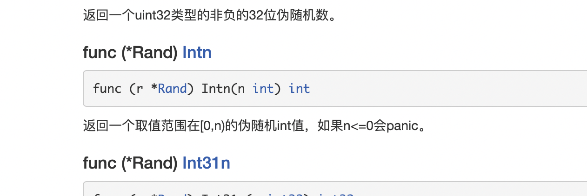

### 1.生成指定范围的随机数



其中n是取不到的

```go
package main

import (
	"fmt"
	"math/rand"
	"time"
)

func main() {
	//获取当前时间对象
	//timeObj := time.Now()

	//获取当前时间的纳秒数
	//timestamp1 := timeObj.UnixNano()
  	//rand.Seed(timestamp1)

	// 重置随机的种子数量 才能让每次运行出不同的随机数量
  rand.Seed(time.Now().UnixNano())

	//随机出10 ~100到的整数 100 - 10 = 90+1 。随机出0～90的整数，再加10，就是10～100的随机数
	num := rand.Intn(90+1) + 10
	fmt.Print(num)
}

```


### 2.定时器

```
package main

import (
	"fmt"
	"time"
)

func main() {
	ticker := time.NewTicker(3*time.Second)
	count := 0
	for v := range ticker.C {
		fmt.Println("h")
		fmt.Println(v)
		count++
		if count > 5 {
			ticker.Stop()
			break
		}
	}
}
```


### 3.数据库操作


### 4.json操作

1🔔将数据编码为JSON格式


```
package main
 
import (
	"encoding/json"
	"fmt"
)
 
type Student struct {
	Name   string `json:"name"`
	Age    int    `json:"age"`
	Email  string `json:"email"`
	Wechat string `json:"wechat"`
}
 
func JsonMarshal() {
	xiaoMing := Student{
		Name:   "xiaoMing",
		Age:    23,
		Email:  "vip_13031075266@163.com",
		Wechat: "ssjjqq23",
	}
 
	fmt.Println(xiaoMing)
 
	data, _ := json.Marshal(xiaoMing)
	fmt.Printf("%s\n", data)
}
```

2🔔对JSON数据进行解码


```
package main
 
import (
	"encoding/json"
	"fmt"
	"log"
)
 
type Student struct {
	Name   string `json:"name"`
	Age    int    `json:"age"`
	Email  string `json:"email"`
	Wechat string `json:"wechat"`
}
type Msg struct {
	MessageType string          `json:"message_type"`
	MessageBody json.RawMessage `json:"message_body"`
}
 
func JsonUnMarshal() {
	jsonData := []byte(`{"name":"xiaoMing","age":23,
	"email":"vip_13031075266@163.com","wechat":"ssjjqq23"}`)
 
	var xiaoMing Student
	err := json.Unmarshal(jsonData, &xiaoMing)
	if err != nil {
		log.Print(err)
	}
	fmt.Printf("%+v\n", xiaoMing)
}
```

3.🔔解码未知结构的JSON数据

借jsonvalue包

```
package main

import (
	"fmt"
	jsonvalue "github.com/Andrew-M-C/go.jsonvalue"
)

func main() {

	str := `{
	"MESSAGE_type":"tcp_log",
		"message_body":{
		"time":1629,
			"sess_id":"0x611DD45400000001",
			"demo":{"name":"123","age":12},
	}
}`
	v,_ := JsonUnMarshalUnknownJson(str)
	//value,_ := v.Get("MESSAGE_type")//tcp_log
	//value,_ := v.Get("message_body")//{time: 1629, sess_id: 0x611DD45400000001, demo: {name: 123, age: 12}}
	//value,_ := v.Get("message_body","time")//1629
	//value,_ := v.Get("message_body","demo")//{name: 123, age: 12}
	//value,_ := v.Get("message_body","demo","name")//123
	value,_ := v.Get("message_body","demo","age")//12
	
	fmt.Println(value)
}

func JsonUnMarshalUnknownJson(jsonstr string) (*jsonvalue.V, error){
	//raw := []byte(jsonstr)
	v,err := jsonvalue.UnmarshalString(jsonstr)

	//https://github.com/Andrew-M-C/go.jsonvalue/blob/master/docs/zh-cn/03_get.md jsonvalue文档
	fmt.Printf("%T\n",v)//*jsonvalue.V
	fmt.Println(v)//{MESSAGE_type: tcp_log, message_body: {time: 1629, sess_id: 0x611DD45400000001, demo: {name: 123, age: 12}}}
	
	return v,err//可以获取很多类型的数据.
}

```


### 5.mysql操作

1.下载对应的包

go get -u github.com/go-sql-driver/mysql

```
"database/sql"是go自带的包
```

```
//测试链接
import (
	"database/sql"

	_ "github.com/go-sql-driver/mysql"
)

func main() {
   // DSN:Data Source Name
	dsn := "user:password@tcp(127.0.0.1:3306)/dbname"
	db, err := sql.Open("mysql", dsn)
	if err != nil {
		panic(err)
	}
	defer db.Close()  // 注意这行代码要写在上面err判断的下面，因为如果db有错误的话，而且没有经过err判断，会出现在nil变量上调用close方法就panic了
}
```


```go
//模块化的测试链接

// 定义一个全局对象db
//其中sql.DB是表示连接的数据库对象（结构体实例），它保存了连接数据库相关的所有信息。它内部维护着一个具有零到多个底层连接的连接池，它可以安全地被多个goroutine同时使用。
var db *sql.DB

// 定义一个初始化数据库的函数
func initDB() (err error) {

	// DSN:Data Source Name
	dsn := "user:password@tcp(127.0.0.1:3306)/sql_test?charset=utf8mb4&parseTime=True"
  
  //如果配置了parseTime=true，MySQL中的DATE、DATETIME等时间类型字段将自动转换为golang中的time.Time类型。 类似的0000-00-00 00:00:00 ，会被转为time.Time的零值。
  
  //loc设置，默认值 UTC，表示解析为UTC时间，一般设置为Local，表示使用当地时间，这个设置只表示解析为time.Time类型时，使用的配置。并不改变MySQL的time zone时区信息time_zone setting，否则，如果没有配置或配置了parseTime=false, 只会转为 []byte / string 。
  
	// 不会校验账号密码是否正确
	// 注意！！！这里不要使用:=，我们是给全局变量赋值，然后在main函数中使用全局变量db
	db, err = sql.Open("mysql", dsn)
	if err != nil {
		return err
	}
	
	// 尝试与数据库建立连接（校验dsn是否正确）
	err = db.Ping()
	if err != nil {
		return err
	}
	
	//最大连接时长
	db.SetConnMaxLifetime(time.Minute * 3)
	//最大连接数
	db.SetMaxOpenConns(10)
	
	//SetMaxIdleConns设置连接池中的最大闲置连接数。 如果n大于最大开启连接数，则新的最大闲置连接数会减小到匹配最大开启连接数的限制。 如果n<=0，不会保留闲置连接
	db.SetMaxIdleConns(10)
	
	return nil
}

func main() {
	err := initDB() // 调用初始化数据库的函数
	if err != nil {
		fmt.Printf("init db failed,err:%v\n", err)
		return
	}
  db.close()//释放数据库连接池资源
}
```


### 6.strings包是操作字符串的，比如截取，寻找等

具体用法看手册


### 7.strconv是字符串与其他类型数据之间的转换

具体看手册

