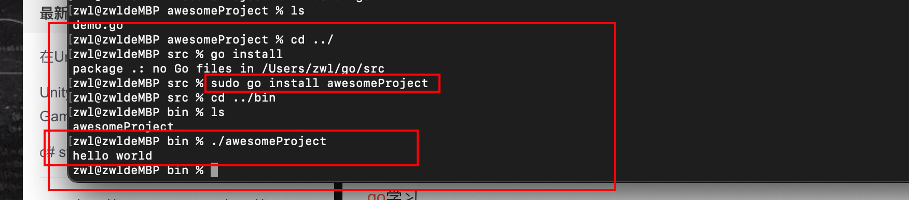

### 1.安装pkg的go软件后，配置环境变量。

```
export GOROOT=/usr/local/go
export GOPATH=/Users/zwl/go
export GOBIN=$GOROOT/bin
export PATH=$PATH$GOBIN

保存退出后执行：source .bash_profile然后其生效
```


### 2.运行hello world

可以用go run demo.go

也可以编译成二进制文件，直接执行

go build和go install的区别

可以用go build demo.go 会在当前目前下生成一个demo的可执行文件

用go install demo.go 会在gopath目录下，生成一个bin文件目录，里面就会有demo的可执行文件


Demo.go所在的文件夹名叫 awesomeProject 

也可以go install awesomeProject 会自动去找 awesomeProject声明为main的go文件，进行编译。

