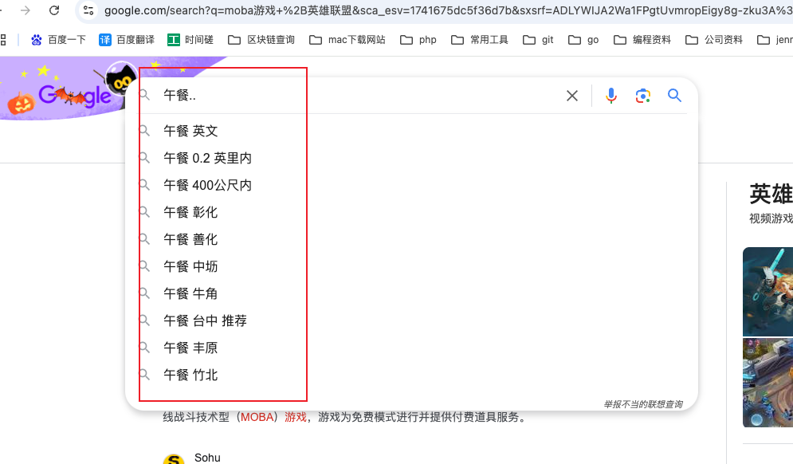

## 1.精准搜索，不能分词

用两个引号扩起来


"ai赚钱项目"


## 2.搜索某个文件类型

:文件类型  例子：简历:doc


## 3.站内搜索

在某个网站上搜索对应的关键字

关键字 site:网站域名

比如在www.freedidi.com网站中搜索 Windows 11 这个关键字  		Windows 11 site:www.freedidi.com


## 4.过滤特定的内容

```
+ 搜出处理的内容必须带后面的内容
- 搜出处理的内容不能带后面的内容
```

比如 moba游戏 +英雄联盟

结果中肯定会带英雄联盟的


结果中肯定不能带王者荣耀的

moba游戏 -王者荣耀


## 5 限定搜索范围

关键词 + 两个点

比如 午餐..    



