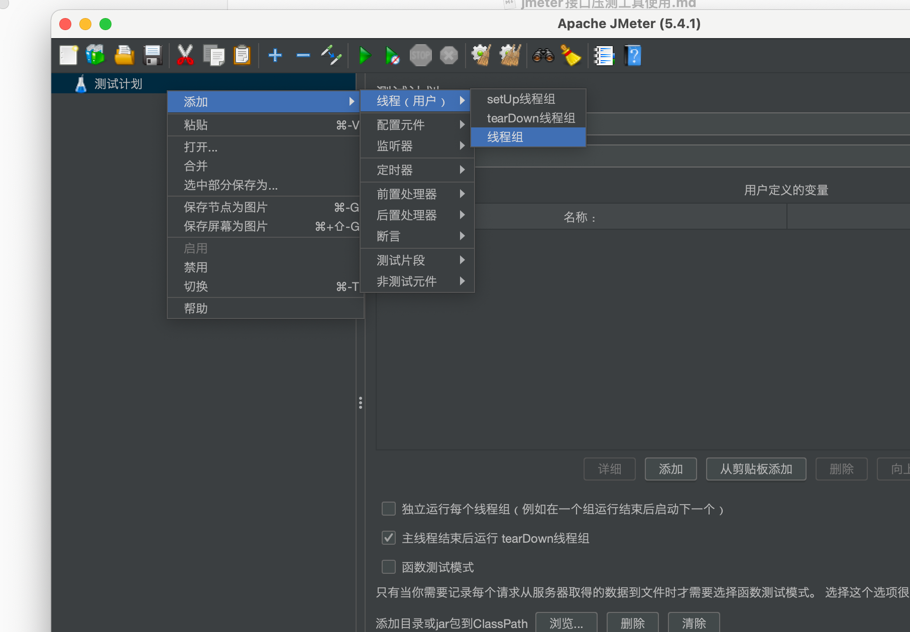
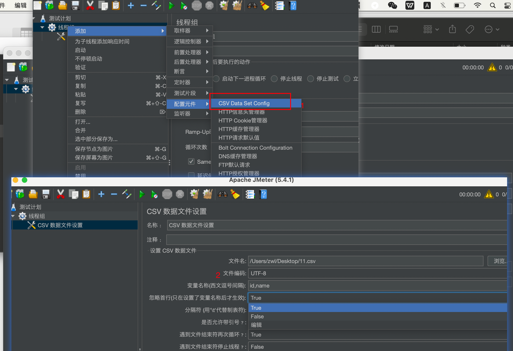
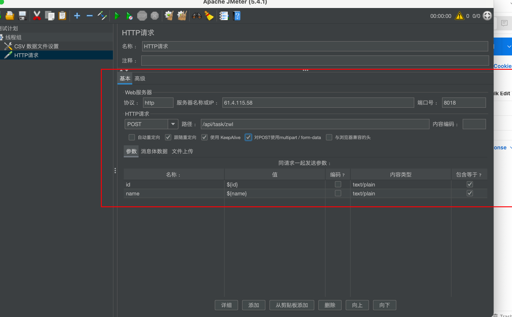
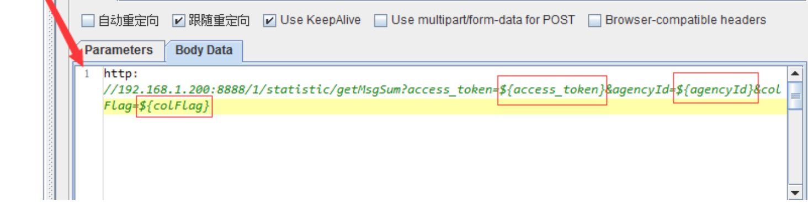
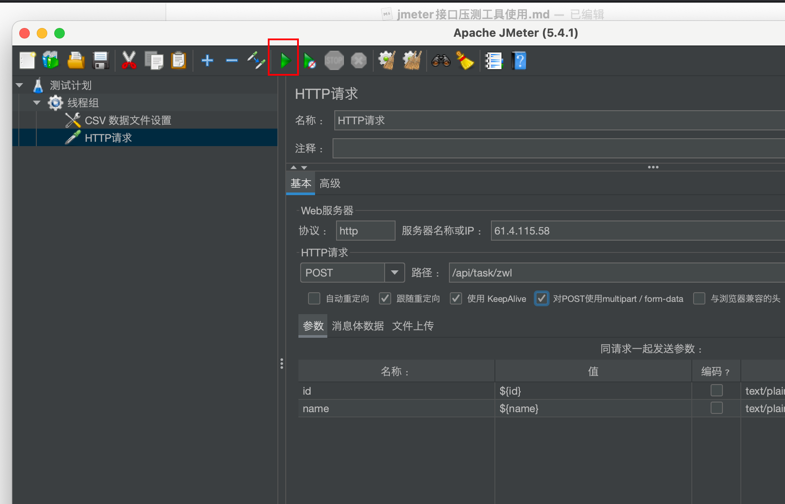

1.启动jmeter

sh + jmeter命令的路径。

sh /Users/zwl/Downloads/apache-jmeter-5.4.1/bin/jmeter

2.在计划任务中添加线程组。

一个线程数代表一个请求。时间代表在多少秒内发出请求。

设置请求从文件读取请求参数.文件名上传不了的话直接输入路径即可。

发送post请求时，想通过参数从文件读时，如下配置即可

如果get时，则使用下面的形式即可

然后添加查看结果树和汇总报告，然后run起来即可

