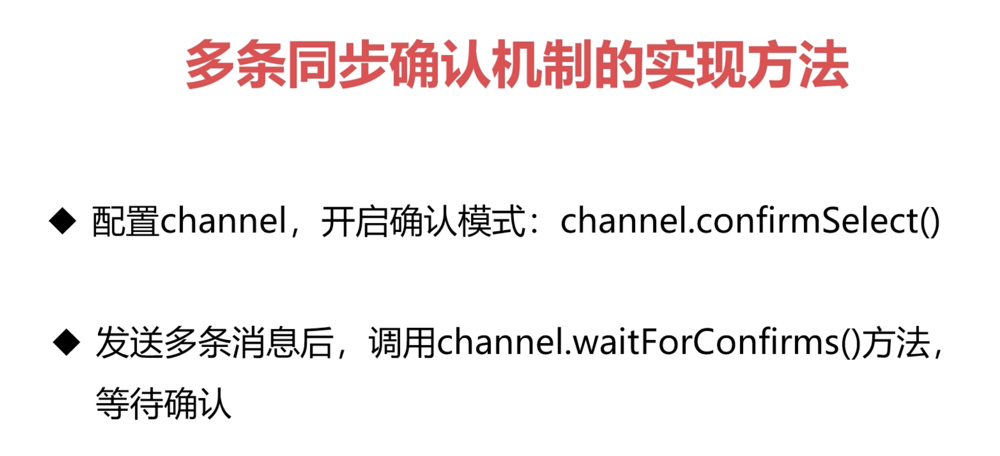

### 1.安装

docker安装

```
docker run -it --name rabbitmq -p 5672:5672 -p 15672:15672 rabbitmq:3-management
下载rabbitmq软件。其中rabbitmq:3-management是指，下载管理后台的插件
```

```
--rm解析
在Docker容器退出时，默认容器内部的文件系统仍然被保留，以方便调试并保留用户数据。

但是，对于foreground容器，由于其只是在开发调试过程中短期运行，其用户数据并无保留的必要，因而可以在容器启动时设置--rm选项，这样在容器退出时就能够自动清理容器内部的文件系统。

示例如下：

docker run --rm ba-208

等价于

docker run --rm=true ba-208

显然，--rm选项不能与-d同时使用（或者说同时使用没有意义），即只能自动清理foreground容器，不能自动清理detached容器。

注意，--rm选项也会清理容器的匿名data volumes。

所以，执行docker run命令带--rm命令选项，等价于在容器退出后，执行docker rm -v。
```

```
php 安装amqp扩展

安装amqp之前，还需安装rabbitmq-c，不然就会提示错误


1.安装rabbitmq-c

wget -c https://github.com/alanxz/rabbitmq-c/releases/download/v0.8.0/rabbitmq-c-0.8.0.tar.gz

tar zxf rabbitmq-c-0.8.0.tar.gz

cd rabbitmq-c-0.8.0

./configure --prefix=/usr/local/rabbitmq-c-0.8.0

make && make install

2.amqp扩展
wget -c http://pecl.php.net/get/amqp-1.11.0.tgz

tar zxf amqp-1.11.0.tgz

cd amqp-1.9.3

/usr/local/php/bin/phpize

./configure --with-php-config=/usr/local/php/bin/php-config --with-amqp --with-librabbitmq-dir=/usr/local/rabbitmq-c-0.8.0

./configure --with-php-config=/usr/local/php/bin/php-config --with-amqp --with-librabbitmq-dir=/usr/local/rabbitmq-c-0.8.0

make && make install
```


### 2.AMQP协议


1.publisher是生产者

2.routing key路由键，相当于快递的收件地址

3.message 消息，快递的东西

4.connection 链接 走网络的tcp链接，把消息发给rabbitmq。 对外是一个tcp链接，但其实在connecttion内部分为了多了逻辑上的channel ，一个线程一般分配一个channel，多个线程复用同一个链接。

4.message broker（消息中间件，这里指rabbitmq）。里面的exchange 交换机 相当于快递的分拨中心，

binding 和routing key 一起进行比较，然后分发到对一下的queue中，其中queue相当于收件箱


5.consumer消费者。消费消息的角色


3.exchange 转发消息的模式

1.direct模型

如果routing key 和bind key一致的，就取走消息

2.fanout模式

扇形分发消息,生产者推送一条消息，所有queue都能收到消息

3.topic模式

根据routing key 和下面的通配规则分发消息


比如

routing key1 是caffee.hot.sweet  

routing key2 是caffee.cold.diff  

routing key3 是naicha.cold.sweet  

routing key3 是naicha.hot.sweet 


bind key 如果是 caffee.#的话，可以收到1 和 2. 有的通配符%的意思

bind key 如果是 caffee.*.sweet的话，可以收到1


演示网站amqp协议的网站

http://tryrabbitmq.com/


AMQP defalut是一个特殊的交换机，会把routing key 投放到名称相同的队列名中。不用判断bind key


6.rabbitmq的管控台

-p 15672:15672


### 3.rabbitmq命令


```
rabbitmqctl --help

查看相关
1.查看状态
rabbitmqctl status

2.查看绑定
rabbitmqctl list_bingings

3.查看channel
rabbitmqctl list_channels

4.查看链接
rabbitmqctl list_connections

5.查看消费者
rabbitmqctl list_consumers

6.查看交换机
rabbitmqctl list_exchanges


用户相关
新建用户
7.rabbitmqctl add_user

修改用户密码
rabbitmqctl change_password

删除用户
rabbitmqctl delete_user


查看用户
rabbitmqctl list_users


设置用户角色
rabbitmqctl set_user_tags
查对应的官方文档即可。
```


### 4.微服务拆分原则


```php
public function test()
        {
            //连接broker
            $cnn = new \AMQPConnection(config('rabbitMq.host'));
            if (!$cnn->connect()) {
                echo "Cannot connect to the broker";
                exit();
            }
            //在连接内创建一个通道
            $ch = new \AMQPChannel($cnn);
            //创建一个交换机
            $ex = new \AMQPExchange($ch);
            //声明路由键
            $routingKey = 'key_1';
            //声明交换机名称
            $exchangeName = 'exchange_1';
            //设置交换机名称
            $ex->setName($exchangeName);
            //设置交换机类型
            //AMQP_EX_TYPE_DIRECT:直连交换机
            //AMQP_EX_TYPE_FANOUT:扇形交换机
            //AMQP_EX_TYPE_HEADERS:头交换机
            //AMQP_EX_TYPE_TOPIC:主题交换机
            $ex->setType(AMQP_EX_TYPE_DIRECT);
            //设置交换机持久
            $ex->setFlags(AMQP_DURABLE);
            //声明交换机
            $ex->declareExchange();
            //创建一个消息队列
            $q = new \AMQPQueue($ch);
            //设置队列名称
            $q->setName('queue_1');
            //设置队列持久
            $q->setFlags(AMQP_DURABLE);
            //声明消息队列 
            $q->declareQueue();
            //交换机和队列通过$routingKey进行绑定
            $q->bind($ex->getName(), $routingKey);
            //接收消息并进行处理的回调方法
            //设置消息队列消费者回调方法，并进行阻塞
            $q->consume(function ($envelope, $queue){
                $data = json_decode($envelope->getBody(),true);
                $insert_data = array(
                    'name' => $data['hello'],
                    'value' => $data['data'],
                    'describe' => time(),
                );
                $res = SysConfig::getInstance()->insert($insert_data);
                if($res){
                    //显式确认，队列收到消费者显式确认后，会删除该消息
                    $queue->ack($envelope->getDeliveryTag());
                }
            });
            //$q->consume("receive", AMQP_AUTOACK);//隐式确认,不推荐
        }

        public function test2()
        {
            $cnn = new \AMQPConnection(config('rabbitMq.host'));
            if (!$cnn->connect()) {
                echo "Cannot connect to the broker";
                exit();
            }
            $ch = new \AMQPChannel($cnn);
            $ex = new \AMQPExchange($ch);
            //消息的路由键，一定要和消费者端一致
            $routingKey = 'key_1';
            //交换机名称，一定要和消费者端一致，
            $exchangeName = 'exchange_1';
            $ex->setName($exchangeName);
            $ex->setType(AMQP_EX_TYPE_DIRECT);
            $ex->setFlags(AMQP_DURABLE);
            $ex->declareExchange();
            //创建10个消息
            for ($i=1;$i<=50000;$i++){
                //消息内容
                $msg = array(
                    'data'  => 'message_'.time(),
                    'hello' => 'world'.rand(0,10000),
                );
                //发送消息到交换机，并返回发送结果
                //delivery_mode:2声明消息持久，持久的队列+持久的消息在RabbitMQ重启后才不会丢失
                echo "Send MessageLogic:".$ex->publish(json_encode($msg), $routingKey, AMQP_NOPARAM, array('delivery_mode' => 2))."\n";
                //代码执行完毕后进程会自动退出
            }

        }
```

```php
class RabbitMq
{
        /** MQ Channel
         * @var \AMQPChannel
         */
        public $AMQPChannel ;
    
        /** MQ Link
         * @var \AMQPConnection
         */
        public $AMQPConnection ;
    
        /** MQ Envelope
         * @var \AMQPEnvelope
         */
        public $AMQPEnvelope ;
    
        /** MQ Conversion
         * @var \AMQPExchange
         */
        public $AMQPExchange ;
    
        /** MQ Queue
         * @var \AMQPQueue
         */
        public $AMQPQueue ;
    
        /** conf
         * @var
         */
        public $conf ;
    
        /** exchange
         * @var
         */
        public $exchange ;
    
        /** link
         * BaseMQ constructor.
         * @throws \AMQPConnectionException
         */
        public function __construct()
        {
            $this->conf     = config('rabbitMq.host');
            $this->exchange = config('rabbitMq.exchange');
            $this->AMQPConnection = new \AMQPConnection($this->conf);
            if (!$this->AMQPConnection->connect())
                throw new \AMQPConnectionException("Cannot connect to the broker!\n");
        }
    
        /**
         * close link
         */
        public function close()
        {
            $this->AMQPConnection->disconnect();
        }
    
        /** Channel
         * @return \AMQPChannel
         * @throws \AMQPConnectionException
         */
        public function channel()
        {
            if(!$this->AMQPChannel) {
                $this->AMQPChannel =  new \AMQPChannel($this->AMQPConnection);
            }
            return $this->AMQPChannel;
        }
    
        /** Conversion
         * @return \AMQPExchange
         * @throws \AMQPConnectionException
         * @throws \AMQPExchangeException
         */
        public function exchange()
        {
            if(!$this->AMQPExchange) {
                $this->AMQPExchange = new \AMQPExchange($this->channel());
                $this->AMQPExchange->setName($this->exchange);
            }
            return $this->AMQPExchange ;
        }
    
        /** queue
         * @return \AMQPQueue
         * @throws \AMQPConnectionException
         * @throws \AMQPQueueException
         */
        public function queue()
        {
            if(!$this->AMQPQueue) {
                $this->AMQPQueue = new \AMQPQueue($this->channel());
            }
            return $this->AMQPQueue ;
        }
    
        /** Envelope
         * @return \AMQPEnvelope
         */
        public function envelope()
        {
            if(!$this->AMQPEnvelope) {
                $this->AMQPEnvelope = new \AMQPEnvelope();
            }
            return $this->AMQPEnvelope;
        }

}
```


### 5高级特性概述

#### 1死信队列

队列长时间积压了大量数据，导致rabbimq运行效率低下，如果给这些消息设置过期时间，则可能消息过期后，出现业务数据的丢失，因为不推荐使用过期机制。此时可以将这些消息放入一个新的队列，专门处理这些数据。新的队列就叫死信队列。


### 6发送端发送给rabbitmq的确认机制

1.单条同步确认机制

每发送一条，马上调用channel->waitForConfirms方法确认一条。返回true和false。true代表rabbitmq成功收到了一条消息。


2.多条同步确认机制



发送多条消息后，调用waitForConfirms后，返回true的话，代表多条消息确认成功。但如果返回false的话，则不知道是哪一条消息发送失败了，因为不推荐。

3.异步确认机制

发现消息后，会异步回调一个方法


有可能回调单条或多条。

回调函数时，会告诉我们确认了一条还是多条。

比如如果确认了一条，不知道是前面的哪条。


上面是原生amqp的写法。

一般使用封装好的客户端操作rabbitmq。比如php-amqplib

```
composer require php-amqplib/php-amqplib
```


### 7.消息返回机制

1.消息返回机制。
配置项：mandatory。如果此配置为true，当消息没有被交换机路由时，会回调一个returnListener方法。

默认为false，false的话会默认丢弃。

1. 生产者发布消息时设置`mandatory=true`,表示消息无法路由到队列时,会退回给生产者

   ```php
       $channel->basic_publish($message,'PHP-Direct-Exchange',$routingKey,true);
   ```

```php
//消息到达交换机,但是没有进入合适的队列,消息回退
    $channel->set_return_listener(function ($reply_code,$reply_text,$exchange,$routing_key,AMQPMessage $msg){
        echo '没有进入合适的队列'.PHP_EOL;
    });
```


### 8.消费端确认机制


1.可以确认单条或者确认多条。multiple在配置。false则单条。true则多条。

自动ack可以在basicConsume方法中关掉自动的参数中 关掉自动ack


建议一次确认一条。

消费者成功消费后，需要手动确认消息，则调用ack方法即可。如果异常，可以重回队列，使用nack方法 可以让消息重回队列。


不过即使重回队列，下次大概率还是异常，建议发邮件，人工处理


如果没有显示调用ack方法，消息会变成unacked状态。在停掉消费者后，消息变成ready状态。


### 9.消费端限流机制

防止没消费完消息，又一直给消费者推送，导致消费者积压了大量的消息。

如果没有显示确认，当unack数目达到多少时，就不推送消息搞消费者了

消费端限流参数配置，在basicConsume消费前，加一个channel->basicqos方法，传入prefetchcount参数，此参数默认为3，即可。


### 10.消息过期机制

队列中消息的ttl。
还有一个队列自己的ttl，叫expire


一种是通过消息属性expiration设置消息本身的有效期

设置单条消息的过期时间，可以在basicpublish方法中，设置expire参数，来设置此消息的过期时间。

```
$msg = new AMQPMessage(1,['content_type' => 'text/plain','expiration' => '60000']);

    for ($i = 1; $i <= 10; $i++) {
        //发送消息到交换机，并返回发送结果
        $channel->basic_publish($msg,$exchange,$routingKey,true);
    }
```


一种是通过队列属性x-message-ttl设置，投递到该队列中的所有消息都有相同的过期时间

在声明队列的时候，declarequeue时，可以设置队列的过期时间。

在声明队列的时候，可以给设置x-message-ttl参数的值。这个是队列的过期时间。比如设置为15秒，如果一个不会过期的消息，进入了此队列，在设置的时间内没有被消费 则会自动删除。

```
$m_table = new \PhpAmqpLib\Wire\AMQPTable();
$m_table->set('x-message-ttl', 60000 );
$channel->queue_declare('normalQueue',
    false, true, false, false, false, $m_table);
```


```
通过channel.queueDeclare方法中到x-expires参数是可以控制队列在指定时间未被使用过后删除，未被使用包括以下三点：
1没有任何消费者
2未被重新声明过期时间
3未调用过Basic.Get命令
x-expires 是删除队列的，一般不建议
$m_table = new \PhpAmqpLib\Wire\AMQPTable();
$m_table->set('x-expires', 60000 );
$channel->queue_declare('normalQueue',
    false, true, false, false, false, $m_table);
```


### 11.死信队列

什么是死信队列？


无用，废弃的消息，存放的队列，称为死信队列。

产生死信消息的3种情况

1.当消息被显示nack后，nack方法中可以设置requeue参数，并且requeue设置为false（没有重回队列）。

2.过期的消息

3.超过队列的长度的消息。

