实际中的索引优化详解：https://blog.csdn.net/qq_35642036/article/details/82820129#

mysql优化分为5个层面，优化效率从高到低排行分别是

​			SQL语句及索引的优化	

​			表结构层面的优化

​			mysql参数配置的优化

​			服务器硬件的优化

​			项目设计层面的优化（针对有过期时间数据，引入高性能的redis等缓存数据库。或者在存储数据比较慢时，可以先将数据写入redis中马上返回响应，提供服务端的响应数据，再将数据异步的写入mysql中）

# 1.SQL语句及索引的优化

开启慢查询日志，快速定位生产环境中效率慢的sql：
开启mysql的慢查询配置，设置慢查询秒数，大于此参数的sql语句会把被记录到慢查询日志中。查询慢查询日志的文件路径

```
查看是否开启慢日志
show variables like 'slow_query%'
慢日志时间
show variables like 'long_query_time'

修改配置文件my.cnf，在[mysqld]下的下方加入
[mysqld]
slow_query_log = ON
slow_query_log_file = /usr/local/mysql/var/slow.log
long_query_time = 1
重启mysql
service mysqld restart

//如果用下面的方式设置，mysql重启后会失效
将 slow_query_log 全局变量设置为“ON”状态
mysql> set global slow_query_log='ON'; 

设置慢查询日志存放的位置
mysql> set global slow_query_log_file='/usr/local/mysql/var/slow.log';

查询超过1秒就记录
mysql> set global long_query_time=1;

有时候设置不生效就改配置文件

```

和慢查询搭配使用的两款工具：mysqldumpslow工具和pt_query_digest工具是慢查询日志的两款分析工具。第一个是mysql自带的。第二个需要另外下载。第二个功能比较丰富。


推荐使用pt_query_digest

安装：wget percona.com/get/pt-query-digest

```

yum -y install perl perl-DBI perl-IO-Socket-SSL perl-DBD-MySQL perl-Time-HiRes perl-Digest-MD5
# wget percona.com/get/pt-query-digest 
# chmod 777 pt-query-digest
```

pt-query-digest --help列出所有参数

查询分析总体的慢日志情况

./pt-query-digest mysql-slow.log | more

overAll是指总的查询语句条数

time range是sql的时间范围

exec_time 是执行时间

lock time 是锁的时间

rows sent是查询到的数据行数。比如1条

rows examine是查询时扫描的行数。比如扫描了3条，才查到需要的那一条。此行数为3

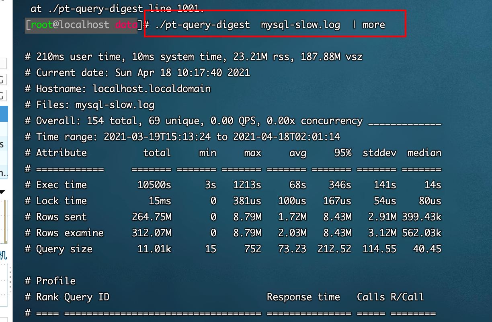

使用空格查看下一页内容，使用crtl+f键查看上一页内容

常用写法

```
> 和 >> 的区别是，第一个是覆盖写入，第二个是追加写入
2&>1  是将标准错误输出到标准输出中。这样可以保证命令执行的成功
#直接分析慢查询文件
pt-query-digest  mysql-slow.log > slow_report.log

分析指定时间范围内的查询
pt-query-digest slow.log --since '2021-04-16 00:30:00' --until '2021-04-18 10:00:00' >> slow_report3.log 

分析指含有select语句的慢查询
./pt-query-digest --filter '$event->{fingerprint} =~ m/^select/i' mysql-slow.log > slow_report4.log

查询所有所有的全表扫描或full join的慢查询
./pt-query-digest --filter '(($event->{Full_scan} || "") eq "yes") ||(($event->{Full_join} || "") eq "yes")' mysql-slow.log> slow_report6.log

把查询保存到query_review表
pt-query-digest --user=root –password=abc123 --review  h=localhost,D=test,t=query_review--create-review-table  slow.log


把查询保存到query_history表
pt-query-digest  --user=root –password=abc123 --review  h=localhost,D=test,t=query_history--create-review-table  slow.log_0001
pt-query-digest  --user=root –password=abc123 --review  h=localhost,D=test,t=query_history--create-review-table  slow.log_0002

通过tcpdump抓取mysql的tcp协议数据，然后再分析
tcpdump -s 65535 -x -nn -q -tttt -i any -c 1000 port 3306 > mysql.tcp.txt
pt-query-digest --type tcpdump mysql.tcp.txt> slow_report9.log

分析binlog
mysqlbinlog mysql-bin.000093 > mysql-bin000093.sql
pt-query-digest  --type=binlog  mysql-bin000093.sql > slow_report10.log

分析general log
pt-query-digest  --type=genlog  localhost.log > slow_report11.log
```


### 1、尽量避免使用子查询。

因为子查询会在mysql中创建临时表存储，查询结果。而join不用，所以join链接效率会更高一点

其中改成join链接时要注意是否存在一对多的关系。

如果存在一对多的（主表一条，对应从表多条）关系，使用子查询会查出一条。但使用join查询，会查出多条重复了。此时应该使用distinct进去去重

select distinct t.id from t left join t1 on t.id = t1.tid;


### 2.避免函数索引


### 3、用IN来替换OR

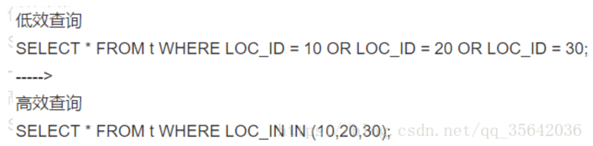

另外，MySQL对于IN做了相应的优化，即将IN中的常量全部存储在一个数组里面，而且这个数组是排好序的。但是如果数值较多，产生的消耗也是比较大的。再例如：`select id from table_name where num in(1,2,3)` 对于连续的数值，能用 between 就不要用 in 了；再或者使用连接来替换。


### 4.LIKE前缀%号、双百分号、_下划线查询非索引列或*无法使用到索引，如果查询的是索引列则可以


### 5.读取适当的记录LIMIT M,N，而不要读多余的记录

```sql
select id,name 
from table_name limit 866613, 20
```

使用上述sql语句做分页的时候，可能有人会发现，随着表数据量的增加，直接使用limit分页查询会越来越慢。

优化的方法如下：可以取前一页的最大行数的id，然后根据这个最大的id来限制下一页的起点。比如此列中，上一页最大的id是866612。sql可以采用如下的写法：

```sql
select id,name from table_name 
where id> 866612 limit 20
```


### 6.避免数据类型不一致

### 7、分组统计可以禁止排序sort，总和查询可以禁止排重用union all


union和union all的差异主要是前者需要将结果集合并后再进行唯一性过滤操作，这就会涉及到排序，增加大量的CPU运算，加大资源消耗及延迟。**当然，union all的前提条件是两个结果集没有重复数据。**所以一般是我们明确知道不会出现重复数据的时候才建议使用 union all 提高速度。

另外，**如果排序字段没有用到索引，就尽量少排序；**


### 8、避免随机取记录

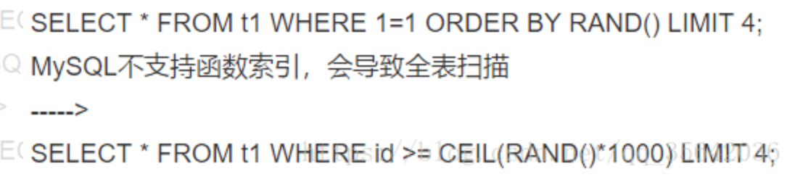

### 9、禁止不必要的ORDER BY排序

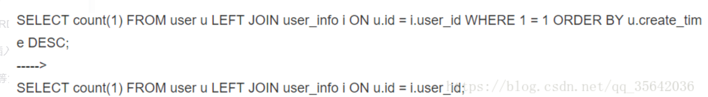


### 10.、批量INSERT插入

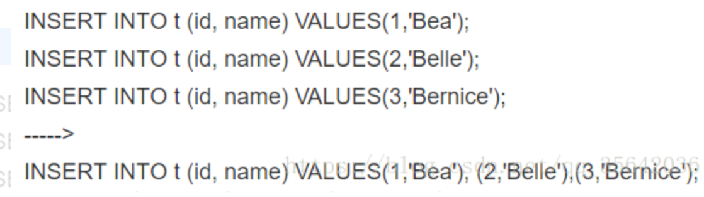

### 11、不要使用NOT等负向查询条件

你可以想象一下，对于一棵B+树，根节点是40，如果你的条件是等于20，就去左面查，你的条件等于50，就去右面查，但是你的条件是不等于66，索引应该咋办？还不是遍历一遍才知道。

### 12、尽量不用select *

SELECT *增加很多不必要的消耗（cpu、io、内存、网络带宽）；增加了使用覆盖索引的可能性；当表结构发生改变时，前者也需要经常更新。所以要求直接在select后面接上字段名。

### 13、**区分in和exists**

```sql
select * from 表A 
where id in (select id from 表B)

上面sql语句相当于

select * from 表A 
where exists(select * from 表B where 表B.id=表A.id)

区分in和exists主要是造成了驱动顺序的改变（这是性能变化的关键），如果是exists，那么以外层表为驱动表，先被访问，如果是IN，那么先执行子查询。所以IN适合于外表大而内表小的情况；EXISTS适合于外表小而内表大的情况。
```

### 14.max函数和count函数的优化

max（‘字段’），如果被max统计的字段，没有索引会走全表扫描。加一个索引即可

count('*')   count('id')的区别是，第一个会统计查询出来的所有行数。第二个如果遇过某个列字段的值为null时，不统计

count()函数是可以加条件，比如 select count('sex = 1 or null')  from student;可以查出性别等于男（1）的数量

SELECT COUNT(sex = 2 OR NULL) FROM m_student

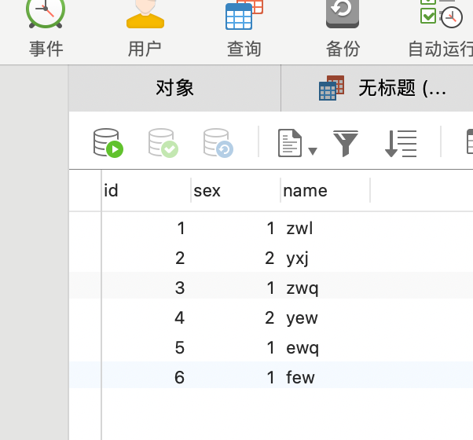


### 15.group by优化

Explain select actor.first_name ,actor.last_name , count(*) from film_actor left join actor on film_actor.actor_id = actor.actor_id  group by film_actot.actor.id

用explain分析会出现using tempnay 和using filesort。使用临时表的查询，效率慢

先联表，后group by

优化后

Explain select actor.first_name, actor.last_name, c.cnt from actor inner join (select actor_id,count(*) as cat from file_actor group by actor.id)  as on film_actor.actor_id = actor.actor_id.

先group by 再联表查询可以优化

整个过程中我们得知，其实EXPLAIN有时候并不能指出你的SQL的所有问题，有一些隐藏问题必须要你自己思考，正如我们这个例子，看起来临时表是最大效率低的源头，但是实际上9W的临时表对MYSQL来说不足以挂齿的。我们进行内联查询前，最好能限制连的表大小的条件都先用上了，同时尽量让条件查询和分组执行的表尽量小，效率才高

### 16.limit的优化

如果可以记录到上一次查询到主键的位置。

比如select id, name from used_record order by id limit 50 ,5

```php

```

下次查询时使用select id, name from used_record  where id > 55 and where id  <= 60  order by id limit 1 ,5

可以加快效率

16.【having 子句】的使用

​		用于对group by 子句得到的统计结果再进行第2次筛选。

统计每一品牌库存数量大于20的品牌。select brand,sum(inventory) from goods group by brand having sum >20;

### 17order by

排序时，使用order by（‘id’）主键时走索引，效率高


## **索引的优化：**

### **1、Join语句的优化**

Join 性能点（https://mp.weixin.qq.com/s/J4nO4VoR8PzgvD9By-3I9g）

当我们执行两个表的Join的时候，就会有一个比较的过程，逐条比较两个表的语句是比较慢的，因此可以把两个表中数据依次读进一个`内存块`中，在Mysql中执行：show variables like 'join_buffer_size'，可以看到join在内存中的缓存池大小，其大小将会影响join语句的性能。

在执行join的时候，数据库会选择一个表把他**要返回以及需要进行和其他表进行比较的数据**放进`join_buffer。`

`如果是有索引的情况，则`直接读取两个表的索引树进行比较就可以了。

若没有索引，则会使用 'Block nested loop' 算法，`Block` 块，也就是说每次都会取一块数据到内存以减少I/O的开销


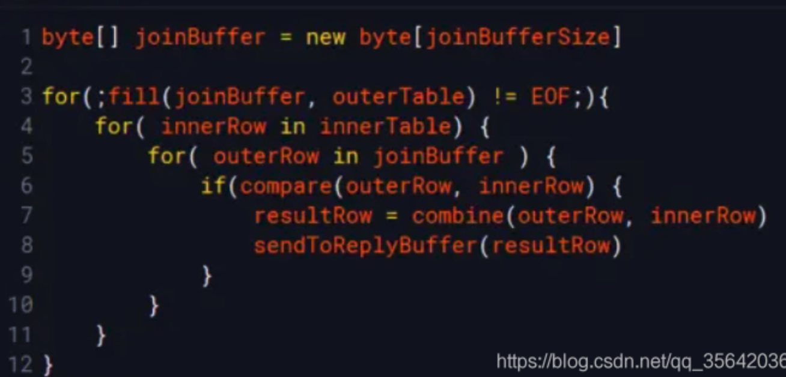

另外，Innodb会为每个数据表分配一个存储在磁盘的 表名.ibd 文件，若关联的表过多，将会导致查询的时候磁盘的磁头移动次数过多，从而影响性能

所以实践中，尽可能减少Join语句中的NestedLoop的循环次数：“永远用小结果集驱动大的结果集”

1. **用小结果集驱动大结果集**，将筛选结果小的表首先连接，再去连接结果集比较大的表，尽量减少join语句中的Nested Loop的循环总次数
2. **优先优化Nested Loop的内层循环**（也就是最外层的Join连接），因为内层循环是循环中执行次数最多的，每次循环提升很小的性能都能在整个循环中提升很大的性能；
3. 对被驱动表的join字段上建立**索引**；
4. 当被驱动表的join字段上无法建立索引的时候，设置**足够的Join Buffer Size**。
5. 尽量用inner join(因为其会自动选择小表去驱动大表).避免 LEFT JOIN (一般我们使用Left Join的场景是大表驱动小表)和NULL，那么如何优化Left Join呢？
   1、条件中尽量能够过滤一些行将驱动表变得小一点，用小表去驱动大表 
   2、右表的条件列一定要加上索引（主键、唯一索引、前缀索引等），最好能够使type达到range及以上（ref,eq_ref,const,system） 
6. 适当地在表里面添加冗余信息来减少`join`的次数
7. 使用更快的固态硬盘

​      性能优化，left join 是由左边决定的，左边一定都有，所以右边是我们的关键点，建立索引要建在右边。当然如果索引是在左边的，我们可以考虑使用右连接，如下

```sql
select * from atable
left join btable on atable.aid=btable.bid;//最好在bid上建索引
（Tips：Join左连接在右边建立索引；组合索引则尽量将数据量大的放在左边，在左边建立索引）
```

### **2、避免索引失效**


**1.最佳左前缀法则**

​    如果索引了多列，要遵守最左前缀法则，指的是查询从索引的最左前列开始并且不跳过索引中的列。Mysql查询优化器会对查询的字段进行改进，判断查询的字段以哪种形式组合能使得查询更快，所有比如创建的是(a,b)索引，查询的是(b,a)，查询优化器会修改成(a,b)后使用索引查询。

**2.不在索引列上做任何操作**

​    (计算、函数、(自动or手动)类型转换)，会导致索引失效而转向全表扫描。

**3.存储引擎不能使用索引中范围条件右边的列。**

​    如这样的sql: select * from user where username='123' and age>20 and phone='1390012345',其中username, age, phone都有索引，只有username和age会生效，phone的索引没有用到。

**4.尽量使用覆盖索引(只访问索引的查询(索引列和查询列一致))**

​    如select age from user减少select *

**5.mysql在使用不等于(!= )的时候无法使用索引会导致全表扫描。**

使用<或者>是可以走到索引的

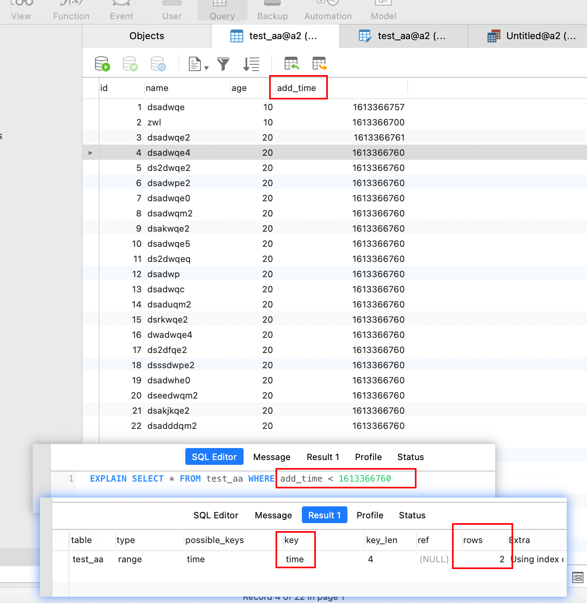

**6.is null, is not null 也无法使用索引，在实际中尽量不要使用null。**

**7.like 以通配符开头(‘%abc..’)mysql索引失效会变成全表扫描的操作。**

​    所以最好用右边like 'abc%'。如果两边都要用，可以用select age from user where username like '%abc%',其中age是必须是索引列，才可让索引生效

​    假如index(a,b,c), where a=3 and b like 'abc%' and c=4，a能用，b能用，c不能用，类似于不能使用范围条件右边的列的索引

​    对于一棵B+树来讲，如果根是字符def，如果通配符在后面，例如abc%，则应该搜索左面，例如efg%，则应该搜索右面，如果通配符在前面%abc，则不知道应该走哪一面，还是都扫描一遍吧。

**8.字符串不加单引号索引失效**

**9.少用or，用它来连接时会索引失效**

**10.尽量避免子查询，而用join**

**11、在组合索引中，将有区分度的索引放在前面**

​    如果没有区分度，例如用性别，相当于把整个大表分成两部分，查找数据还是需要遍历半个表才能找到，使得索引失去了意义。

**12、避免在 where 子句中对字段进行 null 值判断**

​    对于null的判断会导致引擎放弃使用索引而进行全表扫描。


# 


## 1.存储时间数据的mysql字段类型，比较

### 1.1timestamp

```


1. 占用4个字节

2. 允许为空值，但是不可以自定义值，所以为空值时没有任何意义。

3. TIMESTAMP值不能早于1970或晚于2037。这说明一个日期，例如'1968-01-01'，虽然对于DATETIME或DATE值是有效的，但对于TIMESTAMP值却无效，如果分配给这样一个对象将被转换为0。

4.值以UTC格式保存( it stores the number of milliseconds)

5.时区转化 ，存储时对当前的时区进行转换，检索时再转换回当前的时区。

6. 默认值为CURRENT_TIMESTAMP()，其实也就是当前的系统时间。

7. 数据库会自动修改其值，所以在插入记录时不需要指定timestamp字段的名称和timestamp字段的值，你只需要在设计表的时候添加一个timestamp字段即可，插入后该字段的值会自动变为当前系统时间。

8. 以后任何时间修改表中的记录时，对应记录的timestamp值会自动被更新为当前的系统时间。
```

1.2 int

```
int

\1. 占用4个字节

\2. 建立索引之后，查询速度快

\3. 条件范围搜索可以使用使用between

\4. 不能使用mysql提供的时间函数

结论：适合需要进行大量时间范围查询的数据表
```


1.3datetime

```
datetime

\1. 占用8个字节

\2. 允许为空值，可以自定义值，系统不会自动修改其值。

\3. 实际格式储存(Just stores what you have stored and retrieves the same thing which you have stored.)

\4. 与时区无关(It has nothing to deal with the TIMEZONE and Conversion.)

\5. 不可以设定默认值，所以在不允许为空值的情况下，必须手动指定datetime字段的值才可以成功插入数据。

\6. 可以在指定datetime字段的值的时候使用now()变量来自动插入系统的当前时间。

结论：datetime类型适合用来记录数据的原始的创建时间，因为无论你怎么更改记录中其他字段的值，datetime字段的值都不会改变，除非你手动更改它。
```


## 2.联合索引或者或者叫复合索引

索引的类型有4种，主键索引，唯一索引，普通索引，全文索引。联合索引是普通索引中的一种。

联合索引中，有最左匹配原则。

加入建立了一个联合索引（uid，name，age，add_time）

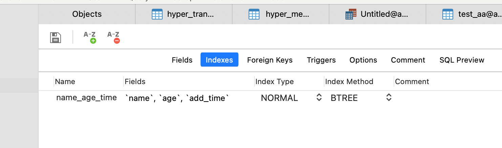


唯一索引和联合索引结合，依然遵循向左原则

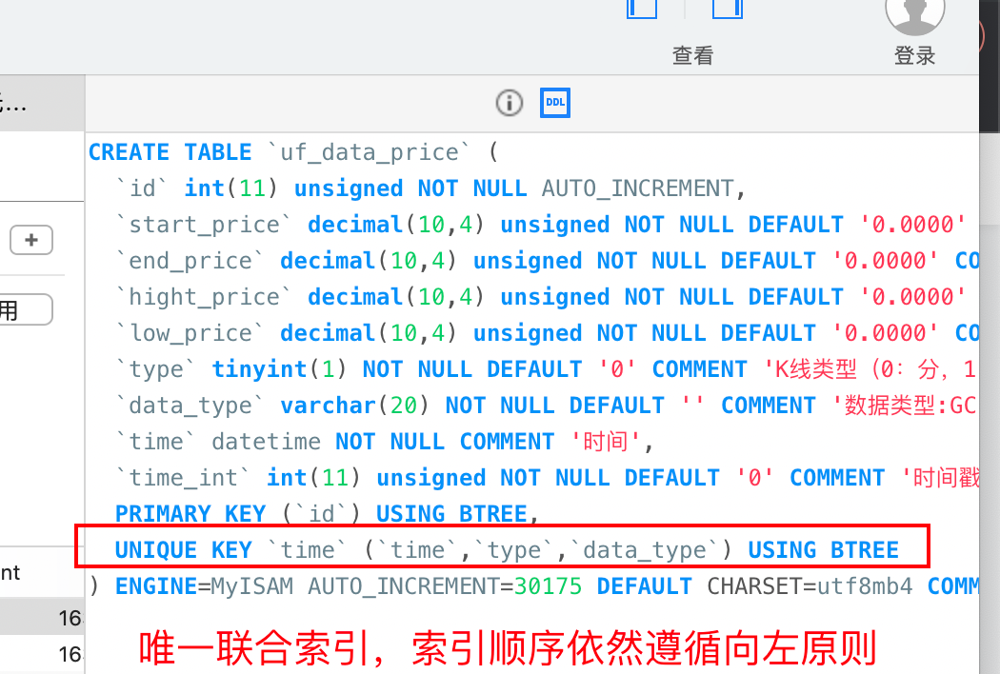


### 2.1没有完全遵从最左原则

如果是：where name = 'dsadsa' and add_time > 1489849543;没有遵循最左原则（如下图，没有age条件），但是最左的字段有在查询条件中，索引还是会生效。只是没有全部索引生效的查询效率高而已。

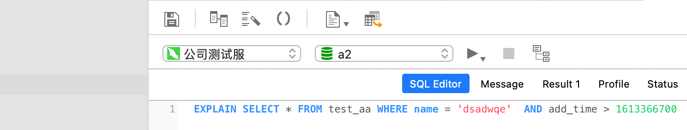


索引依然生效了

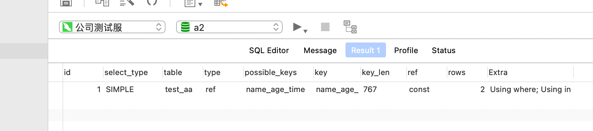

2.2如果独立索引和联合索引，同时设置了同一个字段，比如除了联合索引name_age_add_time，还有一个独立索引name。此时，如果where name = 'zwl' and age = 10 and add_time > today。

2.2.1如果此时name = ‘zwl’已经可以查到到唯一的记录，则生效的索引会是独立索引name。联合索引会不生效。

2.2.2如果此时name = ‘zwl’不能查到到唯一的记录，需要依赖后的age等查询条件，此时。联合索引生效。


### 3.独立索引。

独立索引是普通索引中的一种。

如果有多个独立索引，只会生效一个，如果and前后有字段没有索引，有索引字段还是会生效。

比如建立了三个独立索引，分别是name，age，add_time索引。

如果where name = ‘zwl’ and age = 1.

如果只用name条件查出来的记录只有一个，那就name索引生效

如果只用name条件查出来的记录有多个，但用age条件查出来的记录只有一个，此时age索引生效

如果name和age条件查出来的记录才能唯一，此时根据name和age索引建立的优先级决定。如果name索引在age索引之前建立。则用name。反之，则用age。如下图

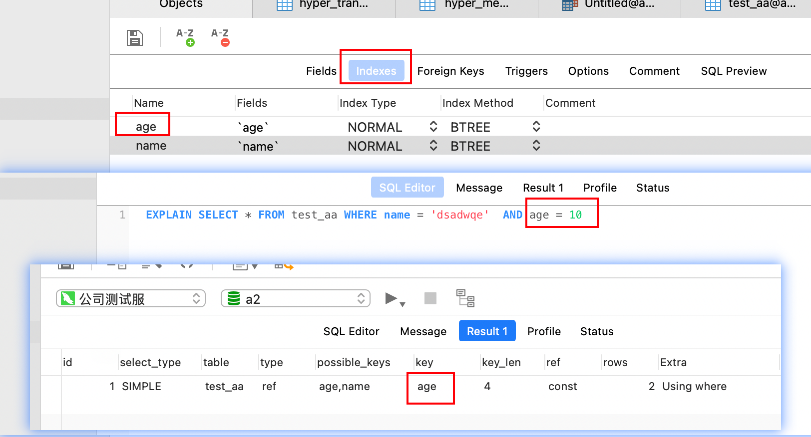


### 4.or运算符是否走索引。

or运算符，只有在or两边都有索引的情况下，才会走索引。如果or其中一边没有索引，则全表扫描。

比如name = 1 or age = 20 or gender = 1；如果三个字段都有索引，则走索引。如果gender没有，则走全表。

如果or的两边是联合索引，也能生效。


如果此时有or运算符。比如

where name = ‘zwl’ or age = 10;并且此时表的数据量非常小，看似两个独立索引都能生效，其实两个索引都没有生效，走了全表扫描因为mysql知道，走全表速度比索引要快。

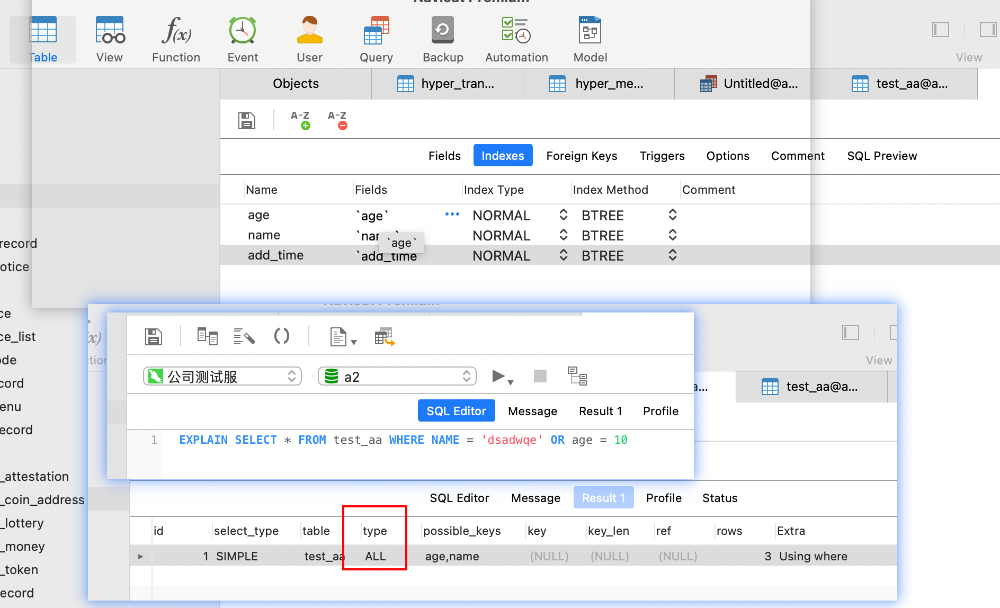

当数据量较多时，就会走索引了。

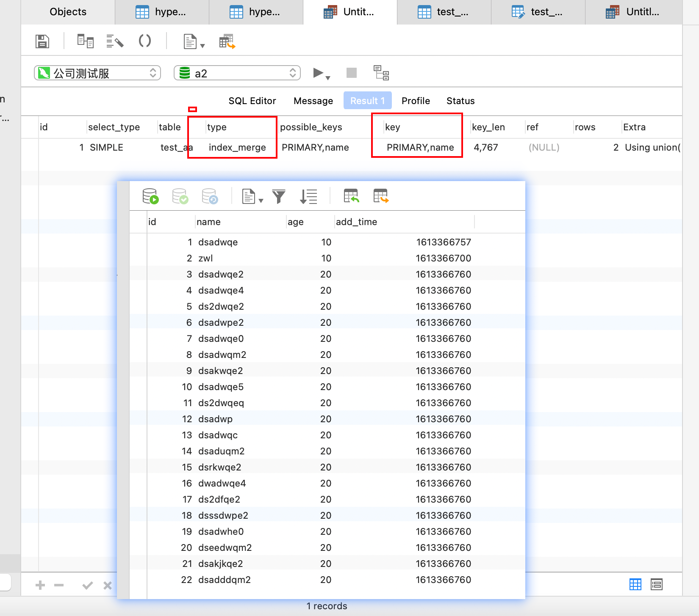


### 5.like索引

如果查询是，使用了like的左边使用了百分号，但此时触发了索引覆盖。此时即使like的左边出现了百分号，依然走索引。


### 6.强制走索引

**key列显示MySQL实际决定使用的键（索引），必然包含在possible_keys中**

如果没有选择索引，键是NULL。要想强制MySQL使用或忽视possible_keys列中的索引，在查询中使用FORCE INDEX、USE INDEX或者IGNORE INDEX。

mysql强制使用索引:force index(索引名).

```sql
  SELECT SUM(price) as totalRepeatMoney FROM `hyper_plan_order` force index(uid) WHERE  `uid` IN (22012931,22012938,22012930)  AND `is_invest` = 2 LIMIT 1
下面是uid的索引。
```

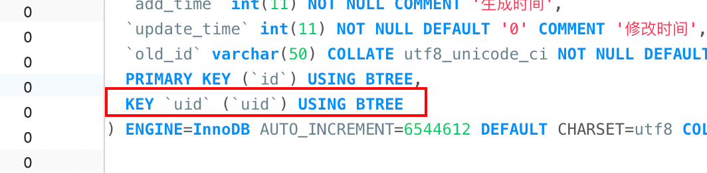


# 2.表结构层面的优化

表结构的设计满足3范式，比如字段值不存储null值，用tinyint代替枚举类型等。
选择合适的存储引擎

对数据量较大的表进行分区，分表等操作，防止单表数据量过大，导致查询较慢


### mysql分区。

mysql的一个表其实对应着，磁盘中的3个文件。一个是表结构文件，一个是表数据文件，一个是表索引文件。如果表数据过大，可以对表进行分区，根据一定的规则，将一个表对应的文件，拆分成许多个小文件，查询时只需要去对应的小文件中找就会快很多。


# 3.mysql软件层面的优化

根据不同服务器配置，合理调整mysql的对应的参数。比如mysql的最大链接数，mysql打开文件的最大数量等配置

查看连接数：show variables like 'max_connections';


### 3.1查看数据库进程

**show full processlist，**杀掉某个进程：**kill processid;** 

**模糊查询进程ID**,找出sleep进程的id。如下图，然后选中复制即可

```sql
select concat('KILL ',id,';') from information_schema.processlist where Command = 'Sleep';
```

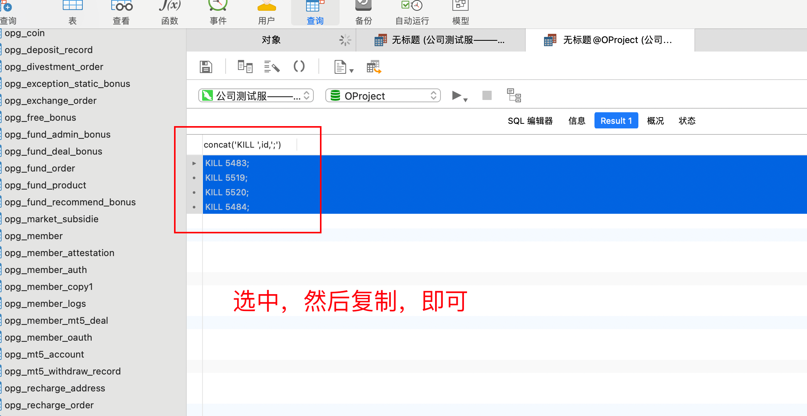

```
KILL 5483;
KILL 5519;
KILL 5520;
KILL 5484;
```

即可复制出kill的命令；

然后复制到navicat中执行，即可一键杀死sleep进程。


**查看进程：**show processlist;

区别：show processlist;只列出前100条，如果想全列出请使用show full processlist;

先 简单说一下各列的含义和用途：

​      id列，不用说了吧，一个标识，你要kill一个语句的时候很有用。

​    user列，显示单前用户，如果不是root，这 个命令就只显示你权限范围内的sql语句。

​    host列，显示这个语句是从哪个ip的哪个端口上发出的。呵呵，可以用来追踪出问题语句的用户。

​     db列，显示 这个进程目前连接的是哪个数据库。

​	command列，显示当前连接的执行的命令，一般就是休眠（sleep），查询（query），连接 （connect）。

​    time列，此这个状态持续的时间，**单位是秒。**

   state列，显示使用当前连接的sql语句的状态，很重要的列，后续会有所有的状态 的描述，请注意，state只是语句执行中的某一个状态，一个sql语句，已查询为例，可能需要经过copying to tmp table，Sorting result，Sending data等状态才可以完成，

   info列，显示这个sql语句，因为长度有限，所以长的sql语句就显示不全，但是一个判断问题语句的重要依据。


   这个命令中最关键的就是state列，mysql列出的状态主要有以下几种：

   Checking table 
   正在检查数据表（这是自动的）。 
   Closing tables 
正在将表中修改的数据刷新到磁盘中，同时正在关闭已经用完的表。这是一个很快的操作，如果不是这样的话，就应该确认磁盘空间是否已经满了或者磁盘是否正处于重负中。 
   Connect Out 
复制从服务器正在连接主服务器。 
  Copying to tmp table on disk 
由于临时结果集大于 tmp_table_size，正在将临时表从内存存储转为磁盘存储以此节省内存。 
  Creating tmp table 
正在创建临时表以存放部分查询结果。 
  deleting from main table 
服务器正在执行多表删除中的第一部分，刚删除第一个表。 
  deleting from reference tables 
服务器正在执行多表删除中的第二部分，正在删除其他表的记录。 
  Flushing tables 
正在执行 FLUSH TABLES，等待其他线程关闭数据表。 
  Killed 
发送了一个kill请求给某线程，那么这个线程将会检查kill标志位，同时会放弃下一个kill请求。MySQL会在每次的主循环中检查kill标志 位，不过有些情况下该线程可能会过一小段才能死掉。如果该线程程被其他线程锁住了，那么kill请求会在锁释放时马上生效。 
  Locked 
被其他查询锁住了。 
  Sending data 
正在处理 SELECT 查询的记录，同时正在把结果发送给客户端。 
  Sorting for group 
正在为 GROUP BY 做排序。 
  Sorting for order 
正在为 ORDER BY 做排序。 
  Opening tables 
这个过程应该会很快，除非受到其他因素的干扰。例如，在执 ALTER TABLE 或 LOCK TABLE 语句行完以前，数据表无法被其他线程打开。 正尝试打开一个表。 
  Removing duplicates 
正在执行一个 SELECT DISTINCT 方式的查询，但是MySQL无法在前一个阶段优化掉那些重复的记录。因此，MySQL需要再次去掉重复的记录，然后再把结果发送给客户端。 
  Reopen table 
获得了对一个表的锁，但是必须在表结构修改之后才能获得这个锁。已经释放锁，关闭数据表，正尝试重新打开数据表。 
  Repair by sorting 
修复指令正在排序以创建索引。 
  Repair with keycache 
修复指令正在利用索引缓存一个一个地创建新索引。它会比 Repair by sorting 慢些。 
  Searching rows for update 
正在讲符合条件的记录找出来以备更新。它必须在 UPDATE 要修改相关的记录之前就完成了。 
  Sleeping 
正在等待客户端发送新请求. 
  System lock 
正在等待取得一个外部的系统锁。如果当前没有运行多个 mysqld 服务器同时请求同一个表，那么可以通过增加 --skip-external-locking参数来禁止外部系统锁。 
 U pgrading lock 
INSERT DELAYED 正在尝试取得一个锁表以插入新记录。 
 Updating 
正在搜索匹配的记录，并且修改它们。 
 User Lock 
正在等待 GET_LOCK()。 
 Waiting for tables 
该线程得到通知，数据表结构已经被修改了，需要重新打开数据表以取得新的结构。然后，为了能的重新打开数据表，必须等到所有其他线程关闭这个表。以下几种 情况下会产生这个通知：FLUSH TABLES tbl_name, ALTER TABLE, RENAME TABLE, REPAIR TABLE, ANALYZE TABLE, 或 OPTIMIZE TABLE。 
 waiting for handler insert 
INSERT DELAYED 已经处理完了所有待处理的插入操作，正在等待新的请求。 
大部分状态对应很快的操作，只要有一个线程保持同一个状态好几秒钟，那么可能是有问题发生了，需要检查一下。 


sleep链接：严重消耗mysql服务器资源(主要是cpu, 内存)，并可能导致mysql崩溃。

当上一步查看进程时，发现有大量的sleep连接。可以设置mysql的最大链接数和超时时间设置。可以有效防止大量sleep链接。如果超过了超时时间，mysql会自动杀死sleep链接。


查看mysql的超时配置参数

show  global variables like '%timeout%'

show  variables like '%timeout%'

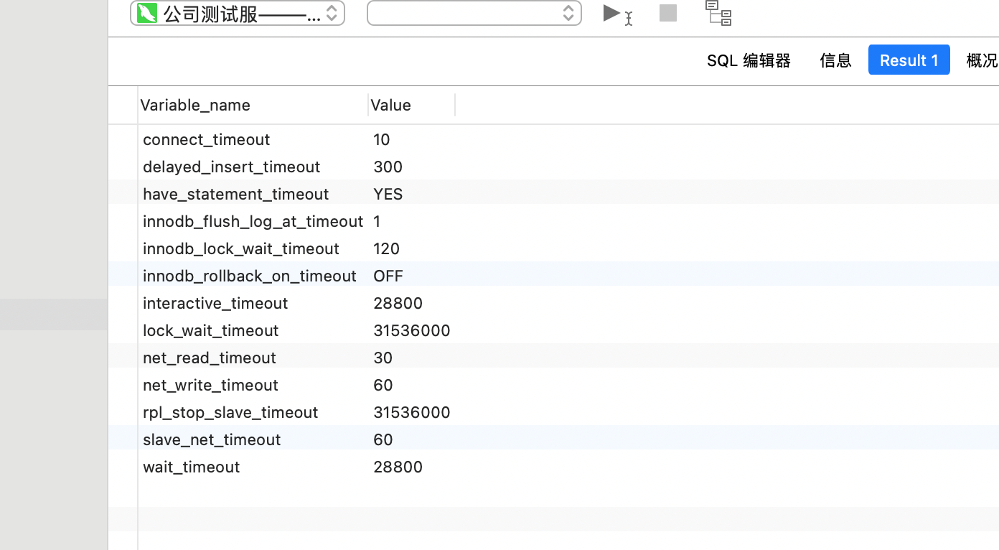

修改mysql配置，需要重启。线上环境应该尽量避免重启数据库。

可通过命令行方式进行修改

set global wait_timeout=10;

set wait_timeout=10;

show global variables like 'wait_timeout';

show variables like 'wait_timeout';

这里一个容易把人搞蒙的地方是如果查询时使用的是show variables的话，会发现设置好像并没有生效，这是因为单纯使用show variables的话就等同于使用的是show session variables，查询的是会话变量，只有使用show global variables，查询的才是全局变量。


### 3.2针对一些大数据量下的查询较慢的场景，可以引入ES搜索引擎。

在大数据量下ES的查询效率比mysql要快很多。


# 4.硬件层面

提示服务器配置，比如使用更大的内存，使用ssd硬盘等

增加服务器数量，做mysql集群，进行读写分离，增加mysql效率