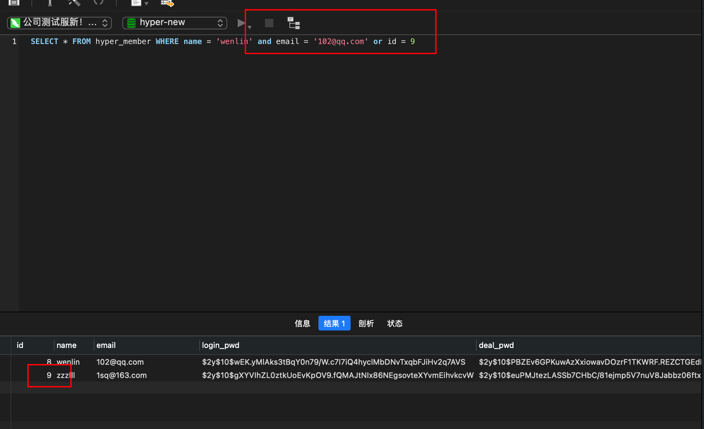

## 1.CURD(增删改查操作)

```
查:select id from user where id =1;

删:delete from user where id = 1;

改:update user set username =’张三’ where id = 1;

增:insert into user(id,name) values(‘1’,’张三’);如果直接写user,则表明增加全部字段.values要写user中全部字段的值.
```


## 2.查看表的创建语句


## 3.统计函数


## 3.1  group分组

```
group 可以根据多个字段分组，返回分组好的数据中的第一条。

还可以根据函数处理后的结果，进行分组。比如下面根据日期分组。
SELECT DATE_FORMAT(create_time,'%Y-%m-%d'),count(DATE_FORMAT(create_time,'%Y-%m-%d')) FROM uf_bet_order GROUP BY DATE_FORMAT(create_time,'%Y-%m-%d');
```


虽然可以分组，但分析后，发现走了临时排序，会比较慢。


但是 Using temporary 仍然存在， GROUP BY仍然没走索引！其实也不难理解，因为这个查询语句的GROUP BY条件包含了函数。


mysql5.7版本有一个新特性，虚拟列，可以让对函数处理后的字段，依然走索引。

https://www.jianshu.com/p/8447f5aefedd


```
mysql 8 支持函数索引，直接使用函数会走索引的
这个有时间使用mysql8验证下
```


## 3.2 group分组 查看重复的条数

```
SELECT order_id,COUNT(*) as num  FROM hyper_plan_order GROUP BY order_id HAVING num > 1
```


## 4.having子句的应用

主要是对group by出来的数据进行二次筛选.where子句中不能使用统计函数


## 5.order by子句的应用

进行显示顺序上的控制,order by id  默认是升序asc 降序是desc,如果第一个值相等,则比较第二个值

优先级：where，Group By, Having, Order by, limit


## 6.外键


## 7.between

.between …… and …..这个是在某个范围之间,是属于闭区间.


## 8.like子句


## 9.行子查询


## 10查询在某个日期之前

使用函数DATE_FORMAT(‘字段名’,’%Y -%m -%d’) 如图


## 11.使用group报错

11.1有两种解决方法

第一种是，MySQL提供了**any_value()**函数来抑制ONLY_FULL_GROUP_BY值被拒绝，如下sql。


```sql
SELECT any_value(uid) AS uid,SUM(any_value(amount)) AS total_amount FROM `m_recharge_order` GROUP BY `uid`
```

第二种是下面的方法。


1

```
select @@global.sql_mode;
ONLY_FULL_GROUP_BY,STRICT_TRANS_TABLES,NO_ZERO_IN_DATE,NO_ZERO_DATE,ERROR_FOR_DIVISION_BY_ZERO,NO_AUTO_CREATE_USER,NO_ENGINE_SUBSTITUTION
set session sql_mode='STRICT_TRANS_TABLES,NO_ZERO_IN_DATE,NO_ZERO_DATE,ERROR_FOR_DIVISION_BY_ZERO,NO_AUTO_CREATE_USER,NO_ENGINE_SUBSTITUTION'

ONLY_FULL_GROUP_BY,STRICT_TRANS_TABLES,NO_ZERO_IN_DATE,NO_ZERO_DATE,ERROR_FOR_DIVISION_BY_ZERO,NO_AUTO_CREATE_USER,NO_ENGINE_SUBSTITUTION


STRICT_TRANS_TABLES,NO_ZERO_IN_DATE,NO_ZERO_DATE,ERROR_FOR_DIVISION_BY_ZERO,NO_AUTO_CREATE_USER,NO_ENGINE_SUBSTITUTION

```


然后复制出来，去掉only_full_group_by这个。在执行语句set session sql_mode。下面是举例。

```
set session sql_mode= 'STRICT_TRANS_TABLES,NO_ZERO_IN_DATE,NO_ZERO_DATE,ERROR_FOR_DIVISION_BY_ZERO,NO_AUTO_CREATE_USER,NO_ENGINE_SUBSTITUTION'

```

group by可以分组多个字段

## 12.查看数据二进制文件

```
/www/server/mysql/bin/mysqlbinlog  --start-datetime="2020/05/08 15:01:10" --stop-datetime="2020/05/08 16:14:00" /www/server/data/mysql-bin.000001 | grep 202005081611581073
```

## 13.连接查询

```sql
SELECT m.id,m.`name` from member as m LEFT JOIN transfe as t on m.id = t.uid WHERE t.`status` = 2 and m.bonus_account = 0;
```

left join ....on   关联id    where。。。。

## 14.mysql5.7的sql文件导入到5.6的数据库中，会报错，需要设置

1、先检查一下数据库被限制了索引的大小
SHOW variables like ‘innodb_large_prefix’;
如果查询的值是off的话,执行下面的命令
SET GLOBAL INNODB_LARGE_PREFIX = ON;

2、执行完了,还需要查看当前innodb_file_format引擎格式类型是不是BARRACUDA
SHOW variables like ‘innodb_file_format’;
如果不是的话则需要修改
SET GLOBAL innodb_file_format = BARRACUDA;

BARRACUDA是mysq5.7的默认格式

## 15.mysql出现死锁，如何解决？


死锁的定义与报错。

## 16.varchar

在mysql5.0之后，字符长度是不能确定的，但有一个总的原则就是，一行记录的总长度不能超过65535字节就行，而且varchar需要看你用的是utf8还是utf8mb4编码。utf8：一个中文字符占用3个字节。utf8mb4：一个中文字符占用3个字节，一个emoji占用4个字节。65535除了存储一行的长度等必要数据后，一般是65530 / 3 = 16382个字符。


varchar 10  长度是10个字符串 


10个汉字 可以插入


11个汉字 会报错


## 17.inner join 和left join的区别

直接写join的话，默认是inner join链接。

inner是内链接

会把两张表都链接字段值都相同的记录，筛选出来

如果左表有一条记录，而右表有多条记录。左表会填充多条重复的记录和右表保持一致的记录数。

不会出现null填充的现象。


SELECT p.FirstName,p.lastName,a.city,a.state from Person p LEFT JOIN Address a ON p.personId = a.personId

left join有null的情况出现


SELECT p.FirstName,p.lastName,a.city,a.state from Person p INNER  JOIN Address a ON p.personId = a.personId

没有null的情况。


left join是外链接

会根据左表字段值去链接右表，字段值相同 的找出来，如果右表中没有字段相同的记录，则用null值代替.

比如下图中的06.

如果左表的记录有一条，右表记录有多条。最终拼接的记录行数会以右表为准，左表则填充相同的记录。比如下图

中的05


## 18.group by查询多条记录

例子1:


```sql
要求：是找出每个人杀怪数量最多的前两条记录

SELECT d.user_name,c.user_id,c.timestr,c.kills FROM (
SELECT b.user_id,b.timestr,b.kills,(SELECT count(*) FROM user_kills a WHERE a.user_id = b.user_id and a.kills >= b.kills) as cnt FROM user_kills b ORDER BY kills DESC 
) c LEFT JOIN user1 d ON c.user_id = d.id WHERE cnt <= 2

重点是cnt的统计
cnt是先让user_kill表针对kills进行倒叙排序别名为表b，然后正常的user_kill表为表a，然后条件为a.user_id = b.user_id and b.kills >= a.kills 。 即可找出kill的count（*）值，最大的kill值应该为1，所以最后加个条件
where cnt <= 2并且和表user1别名为d，进行联表，并且user1表中的用户是不可能重复的。所以即使不用分组，也可以找出每个用户的记录。注意得左外链接
```


2.例子2


```sql
找出每个班级分数的前三名

SELECT c.class,c.score FROM (SELECT
	b.class,b.score,COUNT(*) as count_num
FROM
	opg_test a
	JOIN ( SELECT * FROM opg_test ORDER BY score DESC ) b ON a.class = b.class 
WHERE
	a.score >= b.score
	GROUP BY b.class,b.score) c WHERE c.count_num <=2
	
	只适合没有并列的情况，比如并列情况下，假如满分100的同学有2个，99分同学有1个。此时最高分应该是100分和99分。但sql查出来的确不是。
	
	
有并列的情况。todo
```

没有并列的情况


有并列的情况，三班的103有两名


## 19.如何批量插入大量数据？

在tp框架中，插入大量数据，使用封装好的insertAll方法插入数据，每次只能插入5000条左右。太多行数据会报错。

但手动组装好插入的sql语句，在执行sql时。每次插入的数据量可以达到10w条。大大提高了插入的效率。


```sql
用select和insert into
INSERT INTO `platform_information`.`platform_company_area` (company_area_id,NAME,lat,lng) 
SELECT
			company_area_id,
			NAME,
			lat,
			lng 
		FROM
			`platform_information`.`platform_company_area` 
	WHERE
	company_id = 1
```


## 20.mysql如何平滑重新加载配置文件

service mysqld reload

## 21.主从复制

原理


主服务器中

1.配置文件中开启二进制日志和配置唯一的server-id，然后重启mysql服务。

```
vi /etc/my.cnf
# 开启二进制日志文件
log-bin=mysql-bin
#配置唯一的server-id
server-id=1
```

2.在主服务器中获取二进制日志的名称和数据所在日志中的位置

进入mysql，执行下面命令

```
show master status;
```


3.创建用户

创建用户过程中可以会出现的问题

https://www.cnblogs.com/lvhanzhi/p/10485455.html

```
# 创建账号 # REPLICATION SLAVE 主从复制的账号权限    ALL所有权限
# ip地址 % 所有的IP
grant  权限  on 数据库.数据表  to  ‘用户名’@’ip地址’   identified  by ‘密码’;
# 立刻生效
flush privileges;

grant REPLICATION SLAVE on *.* to 'zwl'@'47.97.185.94' identified by 'zwlzwlzwl@zwl';
flush privileges;
```


创建后好：一定要在从服务器中使用mysql命令进行登录一次，测试是否能够登录成功。

在从服务器中执行：mysql -h47.244.240.76 -uzwl -pzwlzwlzwl@zwl

其中47.244.240.76是主服务器ip


如果登录不了，可能出现的情况如下：

主服务器防火墙对从服务器没有开放

主服务器开设的登录账号规定的IP不是你现在所登录的从服务器IP


从服务器

1.配置唯一的server-id

不能和主服务器的server-id一样即可。记得重新加载mysql配置文件。


2.使用master分配的用户账号读取master二进制日志

通过root账户，进入mysql

\#先停止从服务 

stop slave;

\# 配置从服务器

```
CHANGE MASTER TO
  # 主服务器地址
  MASTER_HOST='47.244.240.76',
  # 主服务器账号
  MASTER_USER='zwl',
  # 主服务器密码
  MASTER_PASSWORD='zwlzwlzwl@zwl',
  # 主服务器端口
  MASTER_PORT=3306,
  # 主服务器binlog日志文件名
  MASTER_LOG_FILE=' mysql-bin.000073',要对应show master status中的名字
  # 日志记录起点位置
  MASTER_LOG_POS=120,要对应show master status中的位置
  # 连接重试次数
  MASTER_CONNECT_RETRY=10;

CHANGE MASTER TO
  MASTER_HOST='94.103.4.65',
  MASTER_USER='salveone',
  MASTER_PASSWORD='jwJeKqd9qpqW',
  MASTER_PORT=3306,
  MASTER_LOG_FILE='mysql-bin.000008',
  MASTER_LOG_POS=642,
  MASTER_CONNECT_RETRY=10;
```

\# 启动从服务器

start slave;

查看从服务器的slave状态。

show slave status\G;

```
Slave_IO_Running:Yes 
此进程负责从服务器从主服务器上读取binlog 日志，并写入从服务器上的中继日志。 
Slave_SQL_Running:Yes 
此进程负责读取并且执行中继日志中的binlog日志， 
注：以上两个都为yes配置成功，注意以前的数据不会同步，只会同步配置成功后的数据。
```


当主从同步场景中，主数据库和从数据库的数据出现不一致时，可以把主数据库的数据导出，在从数据库中运行一遍，然后使用flush logs,生成一个新的二进制文件，然后重新开始同步即可。

flush logs;


```
查询主服务器是否开启二进制日志
show variables like '%log_bin%'

1、主从服务器分别作以下操作：
  1.1、版本一致
  1.2、初始化表，并在后台启动mysql
  1.3、修改root的密码

2、修改主服务器master:
   #vi /etc/my.cnf
       [mysqld]
       log-bin=mysql-bin   //[必须]启用二进制日志
       binlog_format = ROW   //有三种模式，Statement, Mixed,ROW。但另外两种在某些特殊情况下，会出现主从不一致的情况
       server-id=222      //[必须]服务器唯一ID，默认是1，一般取IP最后一段

3、修改从服务器slave:
   #vi /etc/my.cnf
       [mysqld]
       log-bin=mysql-bin   //启用二进制日志
       server-id=226      //[必须]服务器唯一ID，默认是1，一般取IP最后一段
log_slave_updates=1   //开启从库记录binlog日志，开启后可以记录binlgo

4、重启两台服务器的mysql
   /etc/init.d/mysql restart

5、在主服务器上建立帐户并授权slave:
GRANT select,replication slave,replication client ON *.* to 'username'@'%' identified by 'password';
一般不用root帐号，%表示所有客户端都可能连，只要帐号，密码正确，此处可用具体客户端IP代替，如192.168.145.226，加强安全。

GRANT select,replication slave,replication client ON *.* to 'salveone'@'5.188.33.127' identified by 'jwJeKqd9qpqW';

flush privileges;

6、登录主服务器的mysql，查询master的状态
show master status;
   +------------------+----------+--------------+------------------+
   | File             | Position | Binlog_Do_DB | Binlog_Ignore_DB |
   +------------------+----------+--------------+------------------+
   | mysql-bin.000004 |      308 |              |                  |
   +------------------+----------+--------------+------------------+
   1 row in set (0.00 sec)
   注：执行完此步骤后不要再操作主服务器MYSQL，防止主服务器状态值变化

7、配置从服务器Slave：
change master to master_host='主服务器ip',master_user='用户名',master_password='密码',master_log_file='mysql-bin.000004',master_log_pos=308; 

start slave;    //启动从服务器复制功能 

8、检查从服务器复制功能状态：
show slave status

   *************************** 1. row ***************************

              Slave_IO_State: Waiting for master to send event
              Master_Host: 192.168.2.222  //主服务器地址
              Master_User: mysync   //授权帐户名，尽量避免使用root
              Master_Port: 3306    //数据库端口，部分版本没有此行
              Connect_Retry: 60
              Master_Log_File: mysql-bin.000004
              Read_Master_Log_Pos: 600     //#同步读取二进制日志的位置，大于等于Exec_Master_Log_Pos
              Relay_Log_File: ddte-relay-bin.000003
              Relay_Log_Pos: 251
              Relay_Master_Log_File: mysql-bin.000004
              Slave_IO_Running: Yes    //此状态必须YES
              Slave_SQL_Running: Yes     //此状态必须YES
                    ......
Slave_IO及Slave_SQL进程必须正常运行，即YES状态，否则都是错误的状态(如：其中一个NO均属错误)。
```


开放只读账户

```

CREATE USER `epan-read`@`61.4.115.58` IDENTIFIED BY 'Adur2Dz2KwAAcc' PASSWORD EXPIRE NEVER;

GRANT Select, Show Databases, Show View ON *.* TO `epan-read`@`61.4.115.58`;
```


不能给主库开放远程root的链接权限

root只能本地链接。可以用navicat使用ssh链接mysql。这样也是本地链接


mysql主从模式默认是异步复制的。什么是异步复制？

### 异步复制：

应用发起数据更新（含insert、update、delete操作）请求，master在执行完更新操作后立即向应用程序返回响应，然后master在向slave同步数据。

数据更新过程中master不需要等待slave的响应，因此异步复制的数据库实例通常具有较高的性能，且slave不可以用并不影响master对外提供服务。但因数据并不是实时同步到slave，而master在slave有延迟的情况下发生故障则有较小的概率会引起数据不一致。

### 半同步复制：

应用发起数据更新（含insert、update、delete操作）请求，master在执行完更新操作后立即向slave复制数据，slave接收到数据并写到relaylog中（不需要执行）后才向master返回成功的信息，master必须在接受到slave的成功信息后再向应用程序返回响应。

仅在数据复制发生异常（slave节点不可以用或者数据复制所用的网络发生异常）的情况下，master会暂停（MySQL默认10s左右）对应用的响应，将复制方式降为异步复制。当数据复制恢复正常，将恢复为半同步复制。（腾讯云数据库MySQL半同步复制采用一主一从的架构）

### 全同步复制：

应用发起数据更新（含insert、update、delete操作）请求，master在执行完更新操作后立即向slave复制数据，slave接受到数据并执行完后才向master返回成功的信息，master必须接收到slave的成功信息后再向应用程序响应。

因master向slave复制数据是同步进行的，master每次更新操作都需要保证slave也成功执行，因此强同步复制能最大限度保障主从数据的一直性。但因每次master更新操作都强依赖于slave的返回，因此slave如果仅此一台，它不可用将极大影响master上的正常操作。

（腾讯云数据库MySQL强同步复制采用一主两从的架构，仅需其中一台slave成功执行即可返回，避免了单台slave不可以用影响master上操作的问题，提高了强同步复制集群的可用性）


## 21.1主从延迟方式

主从延迟方案排查。

https://www.jianshu.com/p/ed19bb0e748a


## 22.时间类型

datetime

可以把默认值设置为当前时间。


CURRENT_TIMESTAMP

更新datetime类型的字段时，

```
date('Y-m-d H:i:00')，要写这样的格式才行。
```


## 23.修改某个表的自增值

```sql
alter table hyper_member AUTO_INCREMENT 22210000;
```


## 24 用sql批量导入数据

```sql
insert into hyper_plan_orders 
select id,uid,uname,product_id,base_money,offset_money,bonus_money,is_invest,
pay_type
,buy_num,is_end,
price,amount,residue_amount,FROM_UNIXTIME(release_time),FROM_UNIXTIME(add_time),FROM_UNIXTIME(update_time),order_id,task_id from hyper_plan_order limit 1;
```


## 25 设置global和session变量


虽然设置了global变量、session变量，但是在mysql服务重启之后，数据库的配置又会重新初始化，一切按照my.ini的配置进行初始化。global和session的配置都会失效了。


## 26.如何配置跳板机

在mysql的配置文件中配置bind字段即可。

文件默认在/etc/my.cnf

bind配置指定的ip字段即可。

然后在navicat中通过ssh作为跳板机，即可登陆


## 27 查看binlog日志，和恢复

参考链接：https://juejin.cn/post/6844903511201677325

首先确认你的日志是否启用了   使命令:mysql>show variables like 'log_bin';


如果是单机的话，适合用statement模式，如果是主从复制，则走row模式。


2、如果启用了，即ON，那日志文件就在mysql的安装目录的data目录下,

一般是/www/server/data.

3、怎样知道当前的日志mysql> show master status。

需要cd到/www/server/data目录下,才有	数据库的二进制文件(mysql-bin.000001)


### 查看

把二进制文件转换成人能看懂的文件
--base64-output=decode-rows -v 


可以查看某些数据，在binlog中的记录。

/www/server/mysql/bin/mysqlbinlog --no-defaults --database=demo --base64-output=decode-rows -v --start-datetime='2021-12-14 00:00:00' --stop-datetime='2021-12-14 15:00:00' mysql-bin.000011 | grep 22065986


也可以用这个语句查看：show binlog events in 'binlog.000003' 不过没有上面那个语句查看的数据多


### 恢复


4.比如下午5点30分不小心删除了某个数据库。（但是5点的时候，备份了一次）

4.1先flush logs ，让后续的 binlog 到新的文件中(binlog.000004)。保证之前的binlog文件(binlog.000003)，不会新增和修改。方便还原数据。

4.2 然后把备份的数据库文件导，则把数据还原到了5点的数据，此时丢了5点~5点30分的数据。如何把这

30分钟的数据恢复呢。用binlog文件，


### 1.根据pos位置还原。

查看binlog文件，查找中的pos位置

```sql
mysqlbinlog --no-defaults --database=demo --base64-output=decode-rows -v --start-datetime='2023-08-02 10:30:00' --stop-datetime='2023-08-02 10:47:00' binlog.000003
```


其中的at 是pos位置， 也可以通过下面这条语句查看

show binlog events in 'binlog.000003'


找到想还原的区间，起点位置和终点位置。pos位置


很明显，看到了drop database demo对应的pos是3403,3403前面一个是3326，所以终点位置是3326.


起点位置，看你想从哪个位置，恢复数据。不能选到表中已有的数据。比如表中id =10的记录，binlog中选起点位置时，需要在insert id=10 这条的pos之后。不然会报错，重复插入id为10的记录。


终点位置3326 起点位置2684

```
--stop-position=3326

/usr/bin/mysqlbinlog --start-position=2684 --stop-position=3326 --database=demo /var/lib/mysql/binlog.000004 | /usr/bin/mysql -uroot -pmysqlP+ld+1K+Dz -v demo
```

就可以把5点~5.30分丢的数据，找回来了，找回来之后，就完全恢复了。然后就可以愉快的开启访问啦。

```
/usr/bin/mysqlbinlog --stop-position=5018  --database=demo /var/lib/mysql/binlog.000004 | /usr/bin/mysql -uroot -pmysqlP+ld+1K+Dz -v demo
```

```
也可以把binlog日志 到出来分析

/mysql/app/mariadb/bin/mysqlbinlog --no-defaults --database=db  --base64-output=decode-rows -v --start-datetime='2019-04-11 00:00:00' --stop-datetime='2019-04-11 15:00:00'  mysql-bin.000007 > /tmp/binlog007.sql

```


```
通过时间恢复对应的数据。
--database=hello 指定数据库名

/usr/bin/mysqlbinlog --start-datetime="2018-04-27 20:58:18" --stop-datetime="2018-04-27 20:58:35" --database=hello /var/lib/mysql/mysql-bin.000009 | /usr/bin/mysql -uroot -p8856769abcd -v hello 
```


## 28.DATE_FORMAT日期函数

```
SELECT id,DATE_FORMAT(create_time,'%Y-%m-%d %H:%i:%s') FROM uf_bet_order 
```


## 29 判断表是否存在

SHOW TABLES LIKE 'hyper_user'


## 30.or的顺序


or的生效了




## 31处理日期的函数DATEDIFF,返回两个日期之间的差值

leecode[197. 上升的温度](https://leetcode.cn/problems/rising-temperature/)


\# Write your MySQL query statement below

SELECT

​    weather.id AS 'Id'

FROM

​    weather

​        JOIN

​    weather w ON DATEDIFF(weather.recordDate, w.recordDate) = 1

​        AND weather.Temperature > w.Temperature

;


## 32 查看当前语句的资源消耗情况

Show profiles是MySql用来分析当前会话[SQL语句](https://so.csdn.net/so/search?q=SQL语句&spm=1001.2101.3001.7020)执行的资源消耗情况，可以用于SQL的调优测量。
Show profiles默认状态下是关闭的，执行`set profiling=true;`打开状态


可以用show profile查看最近执行的SQL语句执行情况

其中Query_ID为每条执行SQL的编号，Duration为执行时间，Query为SQL语句。
可以查询每个Query_ID对应的SQL语句的资源耗费情况

其中Status表示Query_ID为3的那条SQL语句执行过程中经历的所有状态，Duration表时每个状态期间的耗费时间，执行该SQL的总时间即为所有的Duration加起来的总和。
另外，还可以查看SQL语句的cpu、io等利用情况

除了查看cpu、io阻塞等参数情况，还可以查询下列参数的利用情况


## 33启动数据库

/etc/init.d/mysql start

service mysql start


或者把mysql改成mysqld


## 34.大表中的一些疑问

### 1.给某个表 添加字段 和 索引时，会锁表吗？

都不会锁表。

mysql 8.0.34 版本测试 有效。当表的数据有800w时，添加了一个字段 只需要0.5s。

添加一个索引需要42s。


```sql
CREATE TABLE `users` (
  `user_id` int NOT NULL AUTO_INCREMENT,
  `name` varchar(255) CHARACTER SET utf8mb4 COLLATE utf8mb4_general_ci NOT NULL DEFAULT '',
  `name_int` tinyint(1) NOT NULL DEFAULT '1',
  `gender` tinyint(1) NOT NULL DEFAULT '1' COMMENT '性别，1男，2女。默认1',
  `u_time` datetime NOT NULL,
  `c_time` int NOT NULL DEFAULT '0',
  `age` int NOT NULL DEFAULT '0',
  PRIMARY KEY (`user_id`),
  KEY `idx_name_int` (`name_int`) USING BTREE,
  KEY `idx_c_time` (`c_time`) USING BTREE,
  KEY `idx_u_time` (`u_time`) USING BTREE,
  KEY `name` (`name`) USING BTREE
) ENGINE=InnoDB AUTO_INCREMENT=10230001 DEFAULT CHARSET=utf8mb4 COLLATE=utf8mb4_general_ci;
```


### 2.int字段比varchar快多少？

其中的name字段的值 只能是 zwl，yxj，allen，mike，wangzhen。这5个名称之内 其中的name_int字段的值 只能是 1，2，3，4，5。这5个数字之内

name 

name_int 

0.03，0.053,0.046,0.067,0.058 name字段用varchar存储时，在1000w的表中查询了5次，平均用时是0.05s

0.002, 0.003, 0.002, 0.034 ,0.025 name字段用int存储时，在1000w的表中查询了5次，平均用时是0.013s

结论时int会比varchar快4倍左右。


### 3.性别字段，或者区分度低的字段要加索引吗？

users表的没有添加gender字段的索引时，查询速度是0.003s

gender字段加了索引后，0.004s


加了索引后，没快多少。不如不加，区别度不高的字段，没有必要加索引。


### 4.联表 join 会 比单表查询慢吗？


联两表

SELECT ua.user_id,u.name from user_activity as ua LEFT JOIN users as u on ua.user_id = u.user_id where ua.activity_name = 'dog' LIMIT 1000 

-- 0.049 s


SELECT 
    u.user_id,
    u.name AS user_name,
    ua.user_activity_name
FROM 
    users u
INNER JOIN 
    user_activity ua ON u.user_id = ua.user_id where u.`name` = 'mike' LIMIT 1000

0.215s


不联表

SELECT user_id from user_activity where activity_name = 'dog'   0.9s

SELECT user_id,name from users where user_id in (1，2，3，4，5) LIMIT 1000    3s


联两张表 比 不联表快 10倍以上。


联5张表

```sql
SELECT 
    u.user_id,
    u.name AS user_name,
    ul.user_look_name,
    uc.user_class_name,
    ua.user_activity_name,
    uco.user_county_name
FROM 
    users u
INNER JOIN 
    users_look ul ON u.user_id = ul.user_id
INNER JOIN 
    users_activity ua ON u.user_id = ua.user_id
INNER JOIN 
    users_class uc ON u.user_id = uc.user_id
INNER JOIN 
    users_county uco ON u.user_id = uco.user_id;

```

16s


----------

联4张表

16s


-----联三张表

5s

```
EXPLAIN SELECT 
    u.user_id,
    u.name AS user_name,
    ua.user_activity_name,
    uco.user_county_name
FROM 
    users u
INNER JOIN 
    user_activity ua ON u.user_id = ua.user_id
INNER JOIN 
    user_county uco ON u.user_id = uco.user_id where u.`name` = 'mike' LIMIT 1000
```


第一个简单查询 不走索引，因为关联表的user_id都是从1～1000w之内随机生成的。所以关联不大。

改成user_id 在 1～1000之内生成的话。

UPDATE user_activity
SET user_id = FLOOR(1 + (RAND() * 1000));


再执行sql 就走索引了。


### 5.int快还是datetime 类型快，差距有多少？


int快一点，没有快很多，int快10%而已。

c_time 是int， u_time 是datetime

-- 0.860
SELECT count(*) from users where u_time > '2024-05-05 20:55:56'

-- 0.054
SELECT * from users where u_time > '2024-05-05 20:55:56' LIMIT 1000

-- 0.731
SELECT count(*) from users where c_time > 1714913756

-- 0.042
SELECT * from users where c_time > 1714913756 LIMIT 1000


```sql
CREATE TABLE `platform_kind_tag` (
  `id` int NOT NULL AUTO_INCREMENT,
  `kind_tag_id` int NOT NULL DEFAULT '0' COMMENT 'ID',
  `company_id` int NOT NULL DEFAULT '0' COMMENT '公司ID',
  `business_id` int NOT NULL DEFAULT '0' COMMENT '中心ID',
  `option_id` int NOT NULL DEFAULT '0' COMMENT '项目配置id，对应base服务那边的option表id',
  `option_name` varchar(50) CHARACTER SET utf8mb3 COLLATE utf8mb3_general_ci NOT NULL DEFAULT '' COMMENT '项目名称',
  `option_value` varchar(50) CHARACTER SET utf8mb3 COLLATE utf8mb3_general_ci NOT NULL DEFAULT '' COMMENT '项目值',
  `type` tinyint NOT NULL DEFAULT '0' COMMENT '类型：1=体育培训,2=体育人才,3=场馆',
  `sort` int NOT NULL DEFAULT 100 COMMENT '排序权重，越大越靠前，默认100',
  `operator` int NOT NULL DEFAULT '0',
  `c_time` int NOT NULL DEFAULT '0',
  `u_time` int NOT NULL DEFAULT '0'
  PRIMARY KEY (`id`) USING BTREE,
  KEY `idx_sort` (`sort`) USING BTREE,
  KEY `s_id` (`company_id`,`type`) USING BTREE
) ENGINE=InnoDB DEFAULT CHARSET=utf8mb3 COMMENT='运城模块-项目分类标签表';
```


35 更新某个表时，条件是本表的子查询时会报错。

比如

```sql
DELETE 
FROM
	platform_organization_sport_tag 
WHERE
	company_id = 497 
	AND organization_id IN (
	SELECT
		organization_id 
	FROM
		platform_organization_sport_tag 
	WHERE
	organization_id NOT IN ( SELECT organization_id FROM platform_organization WHERE company_id = 497 ) 
	AND company_id = 497))
	
	改成
	
	DELETE 
FROM 
    platform_organization_sport_tag 
WHERE 
    company_id = 497 
    AND organization_id IN (
        SELECT * FROM (
            SELECT 
                organization_id 
            FROM 
                platform_organization_sport_tag 
            WHERE 
                organization_id NOT IN (
                    SELECT 
                        organization_id 
                    FROM 
                        platform_organization 
                    WHERE 
                        company_id = 497
                ) 
                AND company_id = 497
        ) AS temp_table
    );

	在这个查询中，子查询被包裹在一个额外的 SELECT * FROM (...) AS temp_table 中，从而避免直接在 DELETE 语句中引用目标表的问题。这样就可以用一条 SQL 语句解决问题。
	
	
	拆解
	sql1
	SELECT organization_id FROM platform_organization WHERE company_id = 497 
	
	sql2
	SELECT
		organization_id 
	FROM
		platform_organization_sport_tag 
	WHERE
	organization_id NOT IN ( SELECT organization_id FROM platform_organization WHERE company_id = 497 ) 
	AND company_id = 497
	
	sql3	
	delete from platform_organization_sport_tag where company_id = 497 and organization_id NOT IN ( SELECT organization_id FROM platform_organization WHERE company_id = 497 )
```

