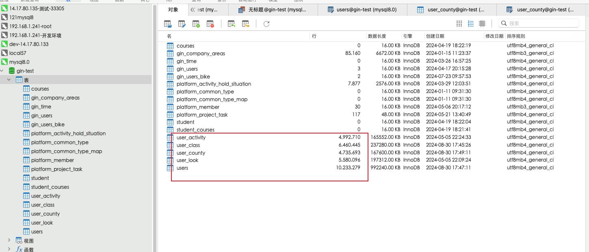
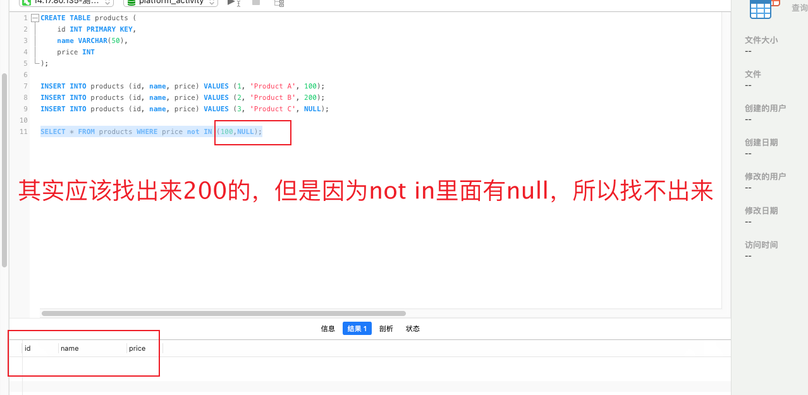

## 1.CURD(增删改查操作)

```
查:select id from user where id =1;

删:delete from user where id = 1;

改:update user set username =’张三’ where id = 1;

增:insert into user(id,name) values(‘1’,’张三’);如果直接写user,则表明增加全部字段.values要写user中全部字段的值.
```


## 2.查看表的创建语句


## 3.统计函数


## 3.1  group分组

```
group 可以根据多个字段分组，返回分组好的数据中的第一条。

还可以根据函数处理后的结果，进行分组。比如下面根据日期分组。
SELECT DATE_FORMAT(create_time,'%Y-%m-%d'),count(DATE_FORMAT(create_time,'%Y-%m-%d')) FROM uf_bet_order GROUP BY DATE_FORMAT(create_time,'%Y-%m-%d');
```


虽然可以分组，但分析后，发现走了临时排序，会比较慢。


但是 Using temporary 仍然存在， GROUP BY仍然没走索引！其实也不难理解，因为这个查询语句的GROUP BY条件包含了函数。


mysql5.7版本有一个新特性，虚拟列，可以让对函数处理后的字段，依然走索引。

https://www.jianshu.com/p/8447f5aefedd


```
mysql 8 支持函数索引，直接使用函数会走索引的
这个有时间使用mysql8验证下
```


## 3.2 group分组 查看重复的条数

```
SELECT order_id,COUNT(*) as num  FROM hyper_plan_order GROUP BY order_id HAVING num > 1
```


## 4.having子句的应用

主要是对group by出来的数据进行二次筛选.where子句中不能使用统计函数


## 5.order by子句的应用

进行显示顺序上的控制,order by id  默认是升序asc 降序是desc,如果第一个值相等,则比较第二个值

优先级：where，Group By, Having, Order by, limit


## 6.外键


## 7.between

.between …… and …..这个是在某个范围之间,是属于闭区间.


## 8.like子句


## 9.行子查询


## 10查询在某个日期之前

使用函数DATE_FORMAT(‘字段名’,’%Y -%m -%d’) 如图


## 11.使用group报错

11.1有两种解决方法

第一种是，MySQL提供了**any_value()**函数来抑制ONLY_FULL_GROUP_BY值被拒绝，如下sql。


```sql
SELECT any_value(uid) AS uid,SUM(any_value(amount)) AS total_amount FROM `m_recharge_order` GROUP BY `uid`
```

第二种是下面的方法。


1

```
select @@global.sql_mode;
ONLY_FULL_GROUP_BY,STRICT_TRANS_TABLES,NO_ZERO_IN_DATE,NO_ZERO_DATE,ERROR_FOR_DIVISION_BY_ZERO,NO_AUTO_CREATE_USER,NO_ENGINE_SUBSTITUTION
set session sql_mode='STRICT_TRANS_TABLES,NO_ZERO_IN_DATE,NO_ZERO_DATE,ERROR_FOR_DIVISION_BY_ZERO,NO_AUTO_CREATE_USER,NO_ENGINE_SUBSTITUTION'

ONLY_FULL_GROUP_BY,STRICT_TRANS_TABLES,NO_ZERO_IN_DATE,NO_ZERO_DATE,ERROR_FOR_DIVISION_BY_ZERO,NO_AUTO_CREATE_USER,NO_ENGINE_SUBSTITUTION


STRICT_TRANS_TABLES,NO_ZERO_IN_DATE,NO_ZERO_DATE,ERROR_FOR_DIVISION_BY_ZERO,NO_AUTO_CREATE_USER,NO_ENGINE_SUBSTITUTION

```


然后复制出来，去掉only_full_group_by这个。在执行语句set session sql_mode。下面是举例。

```
set session sql_mode= 'STRICT_TRANS_TABLES,NO_ZERO_IN_DATE,NO_ZERO_DATE,ERROR_FOR_DIVISION_BY_ZERO,NO_AUTO_CREATE_USER,NO_ENGINE_SUBSTITUTION'

```

group by可以分组多个字段

## 12.查看数据二进制文件

```
/www/server/mysql/bin/mysqlbinlog  --start-datetime="2020/05/08 15:01:10" --stop-datetime="2020/05/08 16:14:00" /www/server/data/mysql-bin.000001 | grep 202005081611581073
```

## 13.连接查询

```sql
SELECT m.id,m.`name` from member as m LEFT JOIN transfe as t on m.id = t.uid WHERE t.`status` = 2 and m.bonus_account = 0;
```

left join ....on   关联id    where。。。。

## 14.mysql5.7的sql文件导入到5.6的数据库中，会报错，需要设置

1、先检查一下数据库被限制了索引的大小
SHOW variables like ‘innodb_large_prefix’;
如果查询的值是off的话,执行下面的命令
SET GLOBAL INNODB_LARGE_PREFIX = ON;

2、执行完了,还需要查看当前innodb_file_format引擎格式类型是不是BARRACUDA
SHOW variables like ‘innodb_file_format’;
如果不是的话则需要修改
SET GLOBAL innodb_file_format = BARRACUDA;

BARRACUDA是mysq5.7的默认格式

## 15.mysql出现死锁，如何解决？


死锁的定义与报错。

## 16.varchar

在mysql5.0之后，字符长度是不能确定的，但有一个总的原则就是，一行记录的总长度不能超过65535字节就行，而且varchar需要看你用的是utf8还是utf8mb4编码。utf8：一个中文字符占用3个字节。utf8mb4：一个中文字符占用3个字节，一个emoji占用4个字节。65535除了存储一行的长度等必要数据后，一般是65530 / 3 = 16382个字符。


varchar 10  长度是10个字符串 


10个汉字 可以插入


11个汉字 会报错


## 17.inner join 和left join的区别

直接写join的话，默认是inner join链接。

inner是内链接

会把两张表都链接字段值都相同的记录，筛选出来

如果左表有一条记录，而右表有多条记录。左表会填充多条重复的记录和右表保持一致的记录数。

不会出现null填充的现象。


SELECT p.FirstName,p.lastName,a.city,a.state from Person p LEFT JOIN Address a ON p.personId = a.personId

left join有null的情况出现


SELECT p.FirstName,p.lastName,a.city,a.state from Person p INNER  JOIN Address a ON p.personId = a.personId

没有null的情况。


left join是外链接

会根据左表字段值去链接右表，字段值相同 的找出来，如果右表中没有字段相同的记录，则用null值代替.

比如下图中的06.

如果左表的记录有一条，右表记录有多条。最终拼接的记录行数会以右表为准，左表则填充相同的记录。比如下图

中的05


## 18.group by查询多条记录

例子1:


```sql
要求：是找出每个人杀怪数量最多的前两条记录

SELECT d.user_name,c.user_id,c.timestr,c.kills FROM (
SELECT b.user_id,b.timestr,b.kills,(SELECT count(*) FROM user_kills a WHERE a.user_id = b.user_id and a.kills >= b.kills) as cnt FROM user_kills b ORDER BY kills DESC 
) c LEFT JOIN user1 d ON c.user_id = d.id WHERE cnt <= 2

重点是cnt的统计
cnt是先让user_kill表针对kills进行倒叙排序别名为表b，然后正常的user_kill表为表a，然后条件为a.user_id = b.user_id and b.kills >= a.kills 。 即可找出kill的count（*）值，最大的kill值应该为1，所以最后加个条件
where cnt <= 2并且和表user1别名为d，进行联表，并且user1表中的用户是不可能重复的。所以即使不用分组，也可以找出每个用户的记录。注意得左外链接
```


2.例子2


```sql
找出每个班级分数的前三名

SELECT c.class,c.score FROM (SELECT
	b.class,b.score,COUNT(*) as count_num
FROM
	opg_test a
	JOIN ( SELECT * FROM opg_test ORDER BY score DESC ) b ON a.class = b.class 
WHERE
	a.score >= b.score
	GROUP BY b.class,b.score) c WHERE c.count_num <=2
	
	只适合没有并列的情况，比如并列情况下，假如满分100的同学有2个，99分同学有1个。此时最高分应该是100分和99分。但sql查出来的确不是。
	
	
有并列的情况。todo
```

没有并列的情况


有并列的情况，三班的103有两名


## 19.如何批量插入大量数据？

在tp框架中，插入大量数据，使用封装好的insertAll方法插入数据，每次只能插入5000条左右。太多行数据会报错。

但手动组装好插入的sql语句，在执行sql时。每次插入的数据量可以达到10w条。大大提高了插入的效率。


```sql
用select和insert into
INSERT INTO `platform_information`.`platform_company_area` (company_area_id,NAME,lat,lng) 
SELECT
			company_area_id,
			NAME,
			lat,
			lng 
		FROM
			`platform_information`.`platform_company_area` 
	WHERE
	company_id = 1
```


## 20.mysql如何平滑重新加载配置文件

service mysqld reload

## 21.主从复制

原理


主服务器中

1.配置文件中开启二进制日志和配置唯一的server-id，然后重启mysql服务。

```
vi /etc/my.cnf
# 开启二进制日志文件
log-bin=mysql-bin
#配置唯一的server-id
server-id=1
```

2.在主服务器中获取二进制日志的名称和数据所在日志中的位置

进入mysql，执行下面命令

```
show master status;
```


3.创建用户

创建用户过程中可以会出现的问题

https://www.cnblogs.com/lvhanzhi/p/10485455.html

```
# 创建账号 # REPLICATION SLAVE 主从复制的账号权限    ALL所有权限
# ip地址 % 所有的IP
grant  权限  on 数据库.数据表  to  ‘用户名’@’ip地址’   identified  by ‘密码’;
# 立刻生效
flush privileges;

grant REPLICATION SLAVE on *.* to 'zwl'@'47.97.185.94' identified by 'zwlzwlzwl@zwl';
flush privileges;
```


创建后好：一定要在从服务器中使用mysql命令进行登录一次，测试是否能够登录成功。

在从服务器中执行：mysql -h47.244.240.76 -uzwl -pzwlzwlzwl@zwl

其中47.244.240.76是主服务器ip


如果登录不了，可能出现的情况如下：

主服务器防火墙对从服务器没有开放

主服务器开设的登录账号规定的IP不是你现在所登录的从服务器IP


从服务器

1.配置唯一的server-id

不能和主服务器的server-id一样即可。记得重新加载mysql配置文件。


2.使用master分配的用户账号读取master二进制日志

通过root账户，进入mysql

\#先停止从服务 

stop slave;

\# 配置从服务器

```
CHANGE MASTER TO
  # 主服务器地址
  MASTER_HOST='47.244.240.76',
  # 主服务器账号
  MASTER_USER='zwl',
  # 主服务器密码
  MASTER_PASSWORD='zwlzwlzwl@zwl',
  # 主服务器端口
  MASTER_PORT=3306,
  # 主服务器binlog日志文件名
  MASTER_LOG_FILE=' mysql-bin.000073',要对应show master status中的名字
  # 日志记录起点位置
  MASTER_LOG_POS=120,要对应show master status中的位置
  # 连接重试次数
  MASTER_CONNECT_RETRY=10;

CHANGE MASTER TO
  MASTER_HOST='94.103.4.65',
  MASTER_USER='salveone',
  MASTER_PASSWORD='jwJeKqd9qpqW',
  MASTER_PORT=3306,
  MASTER_LOG_FILE='mysql-bin.000008',
  MASTER_LOG_POS=642,
  MASTER_CONNECT_RETRY=10;
```

\# 启动从服务器

start slave;

查看从服务器的slave状态。

show slave status\G;

```
Slave_IO_Running:Yes 
此进程负责从服务器从主服务器上读取binlog 日志，并写入从服务器上的中继日志。 
Slave_SQL_Running:Yes 
此进程负责读取并且执行中继日志中的binlog日志， 
注：以上两个都为yes配置成功，注意以前的数据不会同步，只会同步配置成功后的数据。
```


当主从同步场景中，主数据库和从数据库的数据出现不一致时，可以把主数据库的数据导出，在从数据库中运行一遍，然后使用flush logs,生成一个新的二进制文件，然后重新开始同步即可。

flush logs;


```
查询主服务器是否开启二进制日志
show variables like '%log_bin%'

1、主从服务器分别作以下操作：
  1.1、版本一致
  1.2、初始化表，并在后台启动mysql
  1.3、修改root的密码

2、修改主服务器master:
   #vi /etc/my.cnf
       [mysqld]
       log-bin=mysql-bin   //[必须]启用二进制日志
       binlog_format = ROW   //有三种模式，Statement, Mixed,ROW。但另外两种在某些特殊情况下，会出现主从不一致的情况
       server-id=222      //[必须]服务器唯一ID，默认是1，一般取IP最后一段

3、修改从服务器slave:
   #vi /etc/my.cnf
       [mysqld]
       log-bin=mysql-bin   //启用二进制日志
       server-id=226      //[必须]服务器唯一ID，默认是1，一般取IP最后一段
log_slave_updates=1   //开启从库记录binlog日志，开启后可以记录binlgo

4、重启两台服务器的mysql
   /etc/init.d/mysql restart

5、在主服务器上建立帐户并授权slave:
GRANT select,replication slave,replication client ON *.* to 'username'@'%' identified by 'password';
一般不用root帐号，%表示所有客户端都可能连，只要帐号，密码正确，此处可用具体客户端IP代替，如192.168.145.226，加强安全。

GRANT select,replication slave,replication client ON *.* to 'salveone'@'5.188.33.127' identified by 'jwJeKqd9qpqW';

flush privileges;

6、登录主服务器的mysql，查询master的状态
show master status;
   +------------------+----------+--------------+------------------+
   | File             | Position | Binlog_Do_DB | Binlog_Ignore_DB |
   +------------------+----------+--------------+------------------+
   | mysql-bin.000004 |      308 |              |                  |
   +------------------+----------+--------------+------------------+
   1 row in set (0.00 sec)
   注：执行完此步骤后不要再操作主服务器MYSQL，防止主服务器状态值变化

7、配置从服务器Slave：
change master to master_host='主服务器ip',master_user='用户名',master_password='密码',master_log_file='mysql-bin.000004',master_log_pos=308; 

start slave;    //启动从服务器复制功能 

8、检查从服务器复制功能状态：
show slave status

   *************************** 1. row ***************************

              Slave_IO_State: Waiting for master to send event
              Master_Host: 192.168.2.222  //主服务器地址
              Master_User: mysync   //授权帐户名，尽量避免使用root
              Master_Port: 3306    //数据库端口，部分版本没有此行
              Connect_Retry: 60
              Master_Log_File: mysql-bin.000004
              Read_Master_Log_Pos: 600     //#同步读取二进制日志的位置，大于等于Exec_Master_Log_Pos
              Relay_Log_File: ddte-relay-bin.000003
              Relay_Log_Pos: 251
              Relay_Master_Log_File: mysql-bin.000004
              Slave_IO_Running: Yes    //此状态必须YES
              Slave_SQL_Running: Yes     //此状态必须YES
                    ......
Slave_IO及Slave_SQL进程必须正常运行，即YES状态，否则都是错误的状态(如：其中一个NO均属错误)。
```


开放只读账户

```

CREATE USER `epan-read`@`61.4.115.58` IDENTIFIED BY 'Adur2Dz2KwAAcc' PASSWORD EXPIRE NEVER;

GRANT Select, Show Databases, Show View ON *.* TO `epan-read`@`61.4.115.58`;
```


不能给主库开放远程root的链接权限

root只能本地链接。可以用navicat使用ssh链接mysql。这样也是本地链接


mysql主从模式默认是异步复制的。什么是异步复制？

### 异步复制：

应用发起数据更新（含insert、update、delete操作）请求，master在执行完更新操作后立即向应用程序返回响应，然后master在向slave同步数据。

数据更新过程中master不需要等待slave的响应，因此异步复制的数据库实例通常具有较高的性能，且slave不可以用并不影响master对外提供服务。但因数据并不是实时同步到slave，而master在slave有延迟的情况下发生故障则有较小的概率会引起数据不一致。

### 半同步复制：

应用发起数据更新（含insert、update、delete操作）请求，master在执行完更新操作后立即向slave复制数据，slave接收到数据并写到relaylog中（不需要执行）后才向master返回成功的信息，master必须在接受到slave的成功信息后再向应用程序返回响应。

仅在数据复制发生异常（slave节点不可以用或者数据复制所用的网络发生异常）的情况下，master会暂停（MySQL默认10s左右）对应用的响应，将复制方式降为异步复制。当数据复制恢复正常，将恢复为半同步复制。（腾讯云数据库MySQL半同步复制采用一主一从的架构）

### 全同步复制：

应用发起数据更新（含insert、update、delete操作）请求，master在执行完更新操作后立即向slave复制数据，slave接受到数据并执行完后才向master返回成功的信息，master必须接收到slave的成功信息后再向应用程序响应。

因master向slave复制数据是同步进行的，master每次更新操作都需要保证slave也成功执行，因此强同步复制能最大限度保障主从数据的一直性。但因每次master更新操作都强依赖于slave的返回，因此slave如果仅此一台，它不可用将极大影响master上的正常操作。

（腾讯云数据库MySQL强同步复制采用一主两从的架构，仅需其中一台slave成功执行即可返回，避免了单台slave不可以用影响master上操作的问题，提高了强同步复制集群的可用性）


## 21.1主从延迟方式

主从延迟方案排查。

https://www.jianshu.com/p/ed19bb0e748a


## 22.时间类型

datetime

可以把默认值设置为当前时间。


CURRENT_TIMESTAMP

更新datetime类型的字段时，

```
date('Y-m-d H:i:00')，要写这样的格式才行。
```


## 23.修改某个表的自增值

```sql
alter table hyper_member AUTO_INCREMENT 22210000;
```


## 24 用sql批量导入数据

```sql
insert into hyper_plan_orders 
select id,uid,uname,product_id,base_money,offset_money,bonus_money,is_invest,
pay_type
,buy_num,is_end,
price,amount,residue_amount,FROM_UNIXTIME(release_time),FROM_UNIXTIME(add_time),FROM_UNIXTIME(update_time),order_id,task_id from hyper_plan_order limit 1;
```


## 25 设置global和session变量


虽然设置了global变量、session变量，但是在mysql服务重启之后，数据库的配置又会重新初始化，一切按照my.ini的配置进行初始化。global和session的配置都会失效了。


## 26.如何配置跳板机

在mysql的配置文件中配置bind字段即可。

文件默认在/etc/my.cnf

bind配置指定的ip字段即可。

然后在navicat中通过ssh作为跳板机，即可登陆


## 27 查看binlog日志，和恢复

参考链接：https://juejin.cn/post/6844903511201677325

首先确认你的日志是否启用了   使命令:mysql>show variables like 'log_bin';


如果是单机的话，适合用statement模式，如果是主从复制，则走row模式。


2、如果启用了，即ON，那日志文件就在mysql的安装目录的data目录下,

一般是/www/server/data.

3、怎样知道当前的日志mysql> show master status。

需要cd到/www/server/data目录下,才有	数据库的二进制文件(mysql-bin.000001)


### 查看

把二进制文件转换成人能看懂的文件
--base64-output=decode-rows -v 


可以查看某些数据，在binlog中的记录。

/www/server/mysql/bin/mysqlbinlog --no-defaults --database=demo --base64-output=decode-rows -v --start-datetime='2021-12-14 00:00:00' --stop-datetime='2021-12-14 15:00:00' mysql-bin.000011 | grep 22065986


也可以用这个语句查看：show binlog events in 'binlog.000003' 不过没有上面那个语句查看的数据多


### 恢复


4.比如下午5点30分不小心删除了某个数据库。（但是5点的时候，备份了一次）

4.1先flush logs ，让后续的 binlog 到新的文件中(binlog.000004)。保证之前的binlog文件(binlog.000003)，不会新增和修改。方便还原数据。

4.2 然后把备份的数据库文件导，则把数据还原到了5点的数据，此时丢了5点~5点30分的数据。如何把这

30分钟的数据恢复呢。用binlog文件，


### 1.根据pos位置还原。

查看binlog文件，查找中的pos位置

```sql
mysqlbinlog --no-defaults --database=demo --base64-output=decode-rows -v --start-datetime='2023-08-02 10:30:00' --stop-datetime='2023-08-02 10:47:00' binlog.000003
```


其中的at 是pos位置， 也可以通过下面这条语句查看

show binlog events in 'binlog.000003'


找到想还原的区间，起点位置和终点位置。pos位置


很明显，看到了drop database demo对应的pos是3403,3403前面一个是3326，所以终点位置是3326.


起点位置，看你想从哪个位置，恢复数据。不能选到表中已有的数据。比如表中id =10的记录，binlog中选起点位置时，需要在insert id=10 这条的pos之后。不然会报错，重复插入id为10的记录。


终点位置3326 起点位置2684

```
--stop-position=3326

/usr/bin/mysqlbinlog --start-position=2684 --stop-position=3326 --database=demo /var/lib/mysql/binlog.000004 | /usr/bin/mysql -uroot -pmysqlP+ld+1K+Dz -v demo
```

就可以把5点~5.30分丢的数据，找回来了，找回来之后，就完全恢复了。然后就可以愉快的开启访问啦。

```
/usr/bin/mysqlbinlog --stop-position=5018  --database=demo /var/lib/mysql/binlog.000004 | /usr/bin/mysql -uroot -pmysqlP+ld+1K+Dz -v demo
```

```
也可以把binlog日志 到出来分析

/mysql/app/mariadb/bin/mysqlbinlog --no-defaults --database=db  --base64-output=decode-rows -v --start-datetime='2019-04-11 00:00:00' --stop-datetime='2019-04-11 15:00:00'  mysql-bin.000007 > /tmp/binlog007.sql

```


```
通过时间恢复对应的数据。
--database=hello 指定数据库名

/usr/bin/mysqlbinlog --start-datetime="2018-04-27 20:58:18" --stop-datetime="2018-04-27 20:58:35" --database=hello /var/lib/mysql/mysql-bin.000009 | /usr/bin/mysql -uroot -p8856769abcd -v hello 
```


## 28.DATE_FORMAT日期函数

```
SELECT id,DATE_FORMAT(create_time,'%Y-%m-%d %H:%i:%s') FROM uf_bet_order 
```


## 29 判断表是否存在

SHOW TABLES LIKE 'hyper_user'


## 30.or的顺序


or的生效了


## 31处理日期的函数DATEDIFF,返回两个日期之间的差值

leecode[197. 上升的温度](https://leetcode.cn/problems/rising-temperature/)


\# Write your MySQL query statement below

SELECT

​    weather.id AS 'Id'

FROM

​    weather

​        JOIN

​    weather w ON DATEDIFF(weather.recordDate, w.recordDate) = 1

​        AND weather.Temperature > w.Temperature

;


## 32 查看当前语句的资源消耗情况

Show profiles是MySql用来分析当前会话[SQL语句](https://so.csdn.net/so/search?q=SQL语句&spm=1001.2101.3001.7020)执行的资源消耗情况，可以用于SQL的调优测量。
Show profiles默认状态下是关闭的，执行`set profiling=true;`打开状态


可以用show profile查看最近执行的SQL语句执行情况

其中Query_ID为每条执行SQL的编号，Duration为执行时间，Query为SQL语句。
可以查询每个Query_ID对应的SQL语句的资源耗费情况

其中Status表示Query_ID为3的那条SQL语句执行过程中经历的所有状态，Duration表时每个状态期间的耗费时间，执行该SQL的总时间即为所有的Duration加起来的总和。
另外，还可以查看SQL语句的cpu、io等利用情况

除了查看cpu、io阻塞等参数情况，还可以查询下列参数的利用情况


## 33启动数据库

/etc/init.d/mysql start

service mysql start


或者把mysql改成mysqld


## 34.大表中的一些疑问





### 1.给某个表 添加字段 和 索引时，会锁表吗？


都不会锁表。


但是添加索引，如果表是大表的话， 系统的cpu会飘高，飘到200%左右.

添加字段不会飙升cpu，而且添加字段很快


mysql 8.0.34 版本测试 有效。当表的数据有800w时，

添加了一个字段 只需要0.5s。

添加一个索引需要42s。


```sql
CREATE TABLE `users` (
  `user_id` int NOT NULL AUTO_INCREMENT,
  `name` varchar(255) CHARACTER SET utf8mb4 COLLATE utf8mb4_general_ci NOT NULL DEFAULT '',
  `name_int` tinyint(1) NOT NULL DEFAULT '1',
  `gender` tinyint(1) NOT NULL DEFAULT '1' COMMENT '性别，1男，2女。默认1',
  `u_time` datetime NOT NULL,
  `c_time` int NOT NULL DEFAULT '0',
  `age` int NOT NULL DEFAULT '0',
  PRIMARY KEY (`user_id`),
  KEY `idx_name_int` (`name_int`) USING BTREE,
  KEY `idx_c_time` (`c_time`) USING BTREE,
  KEY `idx_u_time` (`u_time`) USING BTREE,
  KEY `name` (`name`) USING BTREE
) ENGINE=InnoDB AUTO_INCREMENT=10230001 DEFAULT CHARSET=utf8mb4 COLLATE=utf8mb4_general_ci;
```


### 2.int字段比varchar快多少？

其中的name字段的值 只能是 zwl，yxj，allen，mike，wangzhen。这5个名称之内 其中的name_int字段的值 只能是 1，2，3，4，5。这5个数字之内

name 

name_int 

0.03，0.053,0.046,0.067,0.058 name字段用varchar存储时，在1000w的表中查询了5次，平均用时是0.05s

0.002, 0.003, 0.002, 0.034 ,0.025 name字段用int存储时，在1000w的表中查询了5次，平均用时是0.013s

结论时int会比varchar快4倍左右。


### 3.性别字段，或者区分度低的字段要加索引吗？

users表的没有添加gender字段的索引时，查询速度是0.003s

gender字段加了索引后，0.004s


加了索引后，没快多少。不如不加，区别度不高的字段，没有必要加索引。


### 4.联表 join 会 比单表查询慢吗？


联两表

SELECT ua.user_id,u.name from user_activity as ua LEFT JOIN users as u on ua.user_id = u.user_id where ua.activity_name = 'dog' LIMIT 1000 

-- 0.049 s


SELECT 
    u.user_id,
    u.name AS user_name,
    ua.user_activity_name
FROM 
    users u
INNER JOIN 
    user_activity ua ON u.user_id = ua.user_id where u.`name` = 'mike' LIMIT 1000

0.215s


不联表

SELECT user_id from user_activity where activity_name = 'dog'   0.9s

SELECT user_id,name from users where user_id in (1，2，3，4，5) LIMIT 1000    3s


联两张表 比 不联表快 10倍以上。


联5张表

```sql
SELECT 
    u.user_id,
    u.name AS user_name,
    ul.user_look_name,
    uc.user_class_name,
    ua.user_activity_name,
    uco.user_county_name
FROM 
    users u
INNER JOIN 
    users_look ul ON u.user_id = ul.user_id
INNER JOIN 
    users_activity ua ON u.user_id = ua.user_id
INNER JOIN 
    users_class uc ON u.user_id = uc.user_id
INNER JOIN 
    users_county uco ON u.user_id = uco.user_id;

```

16s


----------

联4张表

16s


-----联三张表

5s

```
EXPLAIN SELECT 
    u.user_id,
    u.name AS user_name,
    ua.user_activity_name,
    uco.user_county_name
FROM 
    users u
INNER JOIN 
    user_activity ua ON u.user_id = ua.user_id
INNER JOIN 
    user_county uco ON u.user_id = uco.user_id where u.`name` = 'mike' LIMIT 1000
```


第一个简单查询 不走索引，因为关联表的user_id都是从1～1000w之内随机生成的。所以关联不大。

改成user_id 在 1～1000之内生成的话。

UPDATE user_activity
SET user_id = FLOOR(1 + (RAND() * 1000));


再执行sql 就走索引了。


### 5.int快还是datetime 类型快，差距有多少？


int快一点，没有快很多，int快10%而已。

c_time 是int， u_time 是datetime

-- 0.860 
SELECT count(*) from users where u_time > '2024-05-05 20:55:56'

-- 0.054
SELECT * from users where u_time > '2024-05-05 20:55:56' LIMIT 1000

-- 0.731
SELECT count(*) from users where c_time > 1714913756

-- 0.042
SELECT * from users where c_time > 1714913756 LIMIT 1000


```sql
CREATE TABLE `platform_kind_tag` (
  `id` int NOT NULL AUTO_INCREMENT,
  `kind_tag_id` int NOT NULL DEFAULT '0' COMMENT 'ID',
  `company_id` int NOT NULL DEFAULT '0' COMMENT '公司ID',
  `business_id` int NOT NULL DEFAULT '0' COMMENT '中心ID',
  `option_id` int NOT NULL DEFAULT '0' COMMENT '项目配置id，对应base服务那边的option表id',
  `option_name` varchar(50) CHARACTER SET utf8mb3 COLLATE utf8mb3_general_ci NOT NULL DEFAULT '' COMMENT '项目名称',
  `option_value` varchar(50) CHARACTER SET utf8mb3 COLLATE utf8mb3_general_ci NOT NULL DEFAULT '' COMMENT '项目值',
  `type` tinyint NOT NULL DEFAULT '0' COMMENT '类型：1=体育培训,2=体育人才,3=场馆',
  `sort` int NOT NULL DEFAULT 100 COMMENT '排序权重，越大越靠前，默认100',
  `operator` int NOT NULL DEFAULT '0',
  `c_time` int NOT NULL DEFAULT '0',
  `u_time` int NOT NULL DEFAULT '0'
  PRIMARY KEY (`id`) USING BTREE,
  KEY `idx_sort` (`sort`) USING BTREE,
  KEY `s_id` (`company_id`,`type`) USING BTREE
) ENGINE=InnoDB DEFAULT CHARSET=utf8mb3 COMMENT='运城模块-项目分类标签表';
```


## 35 更新某个表时，条件是本表的子查询时会报错。

比如

```sql
DELETE 
FROM
	platform_organization_sport_tag 
WHERE
	company_id = 497 
	AND organization_id IN (
	SELECT
		organization_id 
	FROM
		platform_organization_sport_tag 
	WHERE
	organization_id NOT IN ( SELECT organization_id FROM platform_organization WHERE company_id = 497 ) 
	AND company_id = 497))
	
	改成
	
	DELETE 
FROM 
    platform_organization_sport_tag 
WHERE 
    company_id = 497 
    AND organization_id IN (
        SELECT * FROM (
            SELECT 
                organization_id 
            FROM 
                platform_organization_sport_tag 
            WHERE 
                organization_id NOT IN (
                    SELECT 
                        organization_id 
                    FROM 
                        platform_organization 
                    WHERE 
                        company_id = 497
                ) 
                AND company_id = 497
        ) AS temp_table
    );

	在这个查询中，子查询被包裹在一个额外的 SELECT * FROM (...) AS temp_table 中，从而避免直接在 DELETE 语句中引用目标表的问题。这样就可以用一条 SQL 语句解决问题。
	
	
	拆解
	sql1
	SELECT organization_id FROM platform_organization WHERE company_id = 497 
	
	sql2
	SELECT
		organization_id 
	FROM
		platform_organization_sport_tag 
	WHERE
	organization_id NOT IN ( SELECT organization_id FROM platform_organization WHERE company_id = 497 ) 
	AND company_id = 497
	
	sql3	
	delete from platform_organization_sport_tag where company_id = 497 and organization_id NOT IN ( SELECT organization_id FROM platform_organization WHERE company_id = 497 )
```


## 36.mysql的设置为null的坏处


1：NULL作为布尔值的时候，不为1也不为0

2：任何值和NULL使用运算符（>、<、>=、<=、!=、<>）或者（in、not in、any/some、all），返回值都为NULL

3：当IN和NULL比较时，无法查询出为NULL的记录

4：当NOT IN 后面有NULL值时，不论什么情况下，整个sql的查询结果都为空 



5：判断是否为空只能用IS NULL、IS NOT NULL。  不等于  != '' 或者 = ‘’ 都没用

6：count(字段)无法统计字段为NULL的值，count(*)可以统计值为null的行


## 37.mysql字段 整型的长度作用

在 MySQL 中，`int(0)`、`int(11)` 和 `int` 实际上是相同的数据类型，都是表示整数类型，但它们之间存在一些细微的差异：

1. **`int` 和 `int(11)` 的区别**:
   - `int(11)` 中的数字 `11` 是指显示宽度，这与存储的实际数据没有关系。它主要是为了在某些工具中显示的时候，有一个固定的宽度。例如，如果定义了 `int(11)`，但存储的实际数据只有 `1234`，在显示的时候可能会补充 0 使其显示为 `0000001234`。不过，这种补零显示需要结合 `ZEROFILL` 属性才能生效。
   - `int` 默认情况下没有指定显示宽度，相当于 `int(11)`，但不受显示宽度的限制。
2. **`int(0)` 的问题**:
   - `int(0)` 是一个非法的定义。整数类型的显示宽度必须是正整数，定义为 `int(0)` 会导致错误。通常情况下，这种定义是不允许的。

实际上，在 MySQL 8.0 及以后版本中，显示宽度被废弃，不再支持指定显示宽度，所以在这些版本中 `int`、`int(11)` 和 `int(0)`（假设允许的话）在功能上完全相同，都是表示整数类型。

总结：

- **`int`**: 默认整数类型，没有指定显示宽度。
- **`int(11)`**: 指定了显示宽度为 11，但在 MySQL 8.0 及以后的版本中没有实际意义。
- **`int(0)`**: 非法定义，不允许显示宽度为 0。

因此，建议使用 `int` 或 `int(11)` 来定义整数类型，避免使用 `int(0)`。


38

## 38.行存储格式类型

MySQL 支持几种不同的行存储格式，每种格式都有其优缺点和特定的使用场景：

1. **`COMPACT`**:
   - 默认行格式。
   - 更加紧凑，适合存储较短的字符串和整数。
   - 对于长文本或大字段，性能可能不如其他格式。
2. **`REDUNDANT`**:
   - 最早期的行格式，几乎没有使用。
   - 在新系统中很少使用。
3. **`DYNAMIC`**:
   - 适合存储大字段（如 `BLOB` 和 `TEXT`）。
   - 大字段会存储在溢出页中，仅保留 20 字节的指针在原行中。
   - 在某些情况下可以提高性能，减少数据页的大小。
4. **`COMPRESSED`**:
   - 数据在存储时被压缩。
   - 适合需要减少存储空间的场景。
   - 读取和写入性能可能会受到影响，因为数据需要压缩和解压缩。
5. **`ROW_FORMAT=DEFAULT`**:
   - 使用表或数据库的默认行格式。

### `ROW_FORMAT=DYNAMIC` 的作用

`ROW_FORMAT=DYNAMIC` 是一种行存储格式，旨在更好地处理具有大字段的数据表。它的具体作用包括：

- **存储大字段**: 当表中包含 `BLOB`、`TEXT` 或者其他大字段类型时，大字段的数据会存储在溢出页中，而不是行数据页中。这减少了主数据页的大小，提高了读取性能。
- **减少页分裂**: 由于行数据的紧凑存储，减少了数据页分裂的可能性，从而提高了性能。
- **提高灵活性**: 对于经常更新大字段的表，`DYNAMIC` 行格式可以减少页分裂和重定位的开销。


以下是一个使用 `ROW_FORMAT=DYNAMIC` 创建表的例子：

```
sql
复制代码
CREATE TABLE example_table (
  id INT AUTO_INCREMENT PRIMARY KEY,
  name VARCHAR(100),
  description TEXT
) ENGINE=InnoDB ROW_FORMAT=DYNAMIC;
```

在这个例子中，表 `example_table` 将使用 `DYNAMIC` 行格式来存储数据。

### 

`ROW_FORMAT=DYNAMIC` 是一种行格式类型，适用于需要处理大字段的表。它通过将大字段存储在溢出页中，减少主数据页的大小，从而提高性能。选择合适的行格式可以优化表的存储和访问性能，根据具体需求选择行格式是数据库设计的重要部分。


## 39 存储位置数据(经纬度)

### 1.使用point 格式存储经纬度


### 2.使用decimal来存储

**使用 `DECIMAL` 或 `DOUBLE` 类型存储**

这是最常用的方法，适合需要手动处理经纬度数据的情况。经纬度是数值，通常使用 `DECIMAL` 或 `DOUBLE` 类型来存储，具体取决于精度要求。

#### 具体示例：

- **纬度**（Latitude）：范围从 -90 到 +90。
- **经度**（Longitude）：范围从 -180 到 +180。

在使用 `DECIMAL` 数据格式存储经纬度时，设置字段的精度非常重要。经纬度的值需要足够的精度来确保准确性，尤其是当你在处理全球范围内的位置数据时。

### 经纬度的常见取值范围：

- **纬度**（Latitude）：从 -90 到 +90。
- **经度**（Longitude）：从 -180 到 +180。

通常，经纬度小数点后最多保留 8 位精度，以确保数据足够准确，适用于大多数应用场景。以下是如何设置 `DECIMAL` 类型的字段精度：

#### 1. **选择精度的原则**

- 经度（Longitude）

  ：最大值为 180.00000000，因此使用 

  ```
  DECIMAL(11, 8)
  ```

   是常见选择，其中：

  - 11 表示总的位数。
  - 8 表示小数部分的位数（小数点后保留 8 位）。

- 纬度（Latitude）

  ：最大值为 90.00000000，因此使用 

  ```
  DECIMAL(10, 8)
  ```

  ，其中：

  - 10 表示总的位数。
  - 8 表示小数部分的位数。

保留 8 位小数足以在大多数应用场景中提供亚米级别的精度。

#### 2. **DECIMAL 字段精度建议**

- **经度（Longitude）：DECIMAL(11, 8)**
  - 范围：-180.00000000 到 +180.00000000
  - 解释：总共 11 位数字，其中 8 位是小数点后的部分，3 位是小数点前的整数部分。
- **纬度（Latitude）：DECIMAL(10, 8)**
  - 范围：-90.00000000 到 +90.00000000
  - 解释：总共 10 位数字，其中 8 位是小数点后的部分，2 位是小数点前的整数部分。

#### 示例：

```
sql


复制代码
CREATE TABLE locations (
    location_id INT AUTO_INCREMENT PRIMARY KEY,
    latitude DECIMAL(10, 8) NOT NULL,   -- 纬度
    longitude DECIMAL(11, 8) NOT NULL   -- 经度
);
```

#### 3. **关于精度的计算**

每个小数位对应的物理距离（在赤道附近）：

- 小数点后 4 位（如 `0.0001`）：大约是 11.1 米的精度。
- 小数点后 5 位（如 `0.00001`）：大约是 1.11 米的精度。
- 小数点后 6 位（如 `0.000001`）：大约是 0.11 米的精度（即 11 厘米）。
- 小数点后 7 位（如 `0.0000001`）：大约是 1.11 厘米的精度。
- 小数点后 8 位（如 `0.00000001`）：大约是 1.11 毫米的精度。

因此，`DECIMAL(10, 8)` 和 `DECIMAL(11, 8)` 保证了小数点后 8 位的精度，足以覆盖大多数需要高精度的位置数据场景。

#### 总结：

- **经度字段**：使用 `DECIMAL(11, 8)`。
- **纬度字段**：使用 `DECIMAL(10, 8)`。

这将提供高精度的经纬度存储，适合全球定位的绝大多数应用场景。


### 实战

```sql

CREATE TABLE `locations` (
  `location_id` int NOT NULL AUTO_INCREMENT,
  `coordinates` point NOT NULL,
  `lat` DECIMAL(9, 6) NOT NULL,  -- 纬度，范围从 -90 到 90，精度为 6 位小数
  `lng` DECIMAL(9, 6) NOT NULL, -- 经度，范围从 -180 到 180，精度为 6 位小数
  PRIMARY KEY (`location_id`),
  SPATIAL KEY `coordinates` (`coordinates`)
) ENGINE=InnoDB DEFAULT CHARSET=utf8mb4 COLLATE=utf8mb4_general_ci;


//写入
INSERT INTO `locations` (coordinates, lat, lng)
SELECT 
    ST_GeomFromText(CONCAT('POINT(',
        -122.419416 + (RAND() * 0.162 - 0.081), -- 随机经度（9000米约为0.081度）
        ' ',
        37.774929 + (RAND() * 0.162 - 0.081),  -- 随机纬度（9000米约为0.081度）
    ')')),
    ROUND(37.774929 + (RAND() * 0.162 - 0.081), 6),  -- 随机纬度
    ROUND(-122.419416 + (RAND() * 0.162 - 0.081), 6) -- 随机经度
FROM (
    SELECT 1 AS dummy
    UNION ALL SELECT 1
    UNION ALL SELECT 1
    UNION ALL SELECT 1
    UNION ALL SELECT 1
    UNION ALL SELECT 1
    UNION ALL SELECT 1
    UNION ALL SELECT 1
    UNION ALL SELECT 1
    UNION ALL SELECT 1
    -- 通过重复选择来生成更多的行
) AS t1, (
    SELECT 1 AS dummy
    UNION ALL SELECT 1
    UNION ALL SELECT 1
    UNION ALL SELECT 1
    UNION ALL SELECT 1
    UNION ALL SELECT 1
    UNION ALL SELECT 1
    UNION ALL SELECT 1
    UNION ALL SELECT 1
    UNION ALL SELECT 1
) AS t2
LIMIT 1000;


-- 找出POINT(-122.419416 37.774929)点内 6000米范围内的所有点位，并且根据距离，由近到远进行排序返回

//point 格式
SELECT 
    location_id, 
    ST_Distance_Sphere(coordinates, ST_GeomFromText('POINT(-122.419416 37.774929)')) AS distance
FROM 
    locations
  -- HAVING distance <= 6000
ORDER BY 
    distance ASC;

// decimal 格式
SELECT
	location_id, 
	ST_Distance_Sphere (
		POINT ( lng, lat ),
	POINT (-122.419416, 37.774929)) AS distance 
FROM
	locations 
-- HAVING distance < 6000 
ORDER BY
	distance ASC 
	
	
	// 使用where条件过滤
	SELECT
	location_id, 
	ST_Distance_Sphere (
		POINT ( lng, lat ),
	POINT (-122.419416, 37.774929)) AS distance 
FROM
	locations 
 where ST_Distance_Sphere (
		POINT ( lng, lat ),
	POINT (-122.419416, 37.774929)) < 6000 
ORDER BY
	distance ASC 
	
	
	
1	SELECT * ,ST_Distance_Sphere(POINT(lng,lat), POINT(114.467936,30.47369)) AS distance FROM train WHERE (is_del = 0) HAVING ST_Distance_Sphere(POINT(lng,lat), POINT(114.467936,30.47369)) < 5000 ORDER BY distance DESC LIMIT 10

2 SELECT * ,ST_Distance_Sphere(POINT(lng,lat), POINT(114.467936,30.47369)) AS distance FROM train WHERE (is_del = 0) HAVING distance < 5000 ORDER BY distance DESC LIMIT 10


3 SELECT * ,ST_Distance_Sphere(POINT(lng,lat), POINT(114.467936,30.47369)) AS distance FROM train WHERE (is_del = 0) and  ST_Distance_Sphere(POINT(lng,lat), POINT(114.467936,30.47369)) < 5000 ORDER BY distance DESC LIMIT 10

第3种效率更高，因为在搜索条件时就已经过滤了很多不符合条件的参数。
```


## 40 mysql使用全文索引和中文分词

## 

**分词** 是将连续的文本字符串切分成有意义的词语序列的过程。在自然语言处理（NLP）中，分词是文本分析的基础步骤之一。对于英文等以空格分隔的语言，分词相对简单；但对于中文、日文、韩文等语言，由于词语之间没有明显的分隔符，分词变得更加复杂。

在数据库中，尤其是 MySQL 中，分词对于实现高效的全文搜索（Full-Text Search）至关重要。MySQL 8.0 引入了多种分词器（Tokenizer），其中 **ngram 分词器** 是处理中文等语言的主要工具。

#### MySQL 8.0 中的分词器

MySQL 8.0 支持多种全文分词器，主要包括：


```
这两个全文索引的主要区别在于所使用的解析器（parser）以及索引的处理方式。以下是详细的比较：

1. FULLTEXT KEY name_index (name) WITH PARSER ngram
解析器: 使用 ngram 解析器。
适用性: 适用于处理不支持的语言或需要对较短的单词进行搜索的情况，特别是对于中文、日文和韩文等语言，因为这些语言的词语通常较短（少于4个字符）。
功能: 使用 ngram 解析器时，MySQL 会将文本分割成小的 n-gram（n-元组），允许对这些小单元进行索引和搜索。
效率: 可能会导致更大的索引大小和更慢的查询性能，因为需要处理更多的索引单元。


2. FULLTEXT KEY name_index (name)
解析器: 默认使用 MySQL 的标准全文搜索解析器。
适用性: 主要适用于英语及其他基于拉丁字母的语言，通常能有效处理单词的查找。
功能: 该解析器对最小字长有默认设置（通常为4个字符），因此不支持短于这个长度的单词的搜索。
效率: 在处理拉丁字母文本时，查询和索引的性能通常更佳，因为它不需要生成大量的 n-gram。
总结
如果你的数据包含中文或其他需要处理短单词的语言，建议使用 ngram 解析器。
如果你的数据主要是英文或其他支持的语言，默认解析器通常已足够。
在选择使用哪种解析器时，考虑你的数据类型和搜索需求是很重要的。
```


1. **默认分词器（InnoDB Full-Text Parser）**：适用于英文等以空格分隔的语言。
2. **ngram 分词器**：适用于中文、日文、韩文等没有明显分隔符的语言。
3. **MeCab 分词器**（需要额外安装）：适用于日文等语言。

在处理中文时，**ngram 分词器** 是最常用的选择。

#### ngram 分词器

**ngram 分词器** 将文本分割成固定长度的字符序列（n-gram）。对于中文，每个字符通常表示一个汉字，因此 ngram 分词器可以有效地对中文文本进行分词。

#### 配置 ngram 分词器

在 MySQL 8.0 中，配置 ngram 分词器涉及以下几个步骤：

1. **设置 `ngram_token_size`**：

   `ngram_token_size` 决定了分词时的字符块大小。对于中文，通常设置为 2 或 3。

   ```
   sql
   
   
   复制代码
   SET GLOBAL ngram_token_size = 2;
   ```

   你也可以在创建表时指定分词器和相关参数。


##### 也可以设置单个分词，也能做，但不推荐，

```

ngram 是一种基于固定长度的子串分词方式，它会将字符串拆分为固定长度的连续片段。对于中文分词，通常会设置 n=1, 2, 3，从而支持粒度为单字、双字或三字的分词。

例如：

输入："苹果手机"
n=1（单字分词）：["苹", "果", "手", "机"]
n=2（双字分词）：["苹果", "果手", "手机"]
2. MySQL 的 FULLTEXT 索引与 ngram 分词
MySQL 从 5.7.6 开始，支持 InnoDB 表上的中文全文检索，ngram 分词器是其中一个重要选项。

配置 ngram 分词支持
在创建 FULLTEXT 索引时，可以指定 ngram 分词器：

sql
复制代码
CREATE TABLE products (
    id INT AUTO_INCREMENT PRIMARY KEY,
    name VARCHAR(255),
    FULLTEXT(name) WITH PARSER ngram
) ENGINE=InnoDB;
3. 单字搜索的关键配置
要支持中文单字搜索，n-gram 分词需要满足以下条件：

3.1 设置 ngram 的最小粒度为 1
MySQL 的 ngram 分词器默认支持 n=2 到 n=3，这意味着不能直接索引单字。如果需要支持单字搜索，需要修改 innodb_ft_min_token_size 配置。

在 MySQL 配置文件（如 my.cnf）中添加：

ini
复制代码
[mysqld]
innodb_ft_min_token_size = 1
修改完成后，重启 MySQL 服务，使配置生效。

3.2 重新生成 FULLTEXT 索引
修改配置后，必须删除并重新创建全文索引才能生效：

sql
复制代码
ALTER TABLE products DROP INDEX name;
ALTER TABLE products ADD FULLTEXT(name) WITH PARSER ngram;
4. 插入数据和单字搜索示例
插入数据
sql
复制代码
INSERT INTO products (name) VALUES ('苹果手机');
INSERT INTO products (name) VALUES ('果汁饮料');
INSERT INTO products (name) VALUES ('手机壳');
搜索单字
使用 MATCH ... AGAINST 执行单字搜索：

sql
复制代码
SELECT * FROM products
WHERE MATCH(name) AGAINST('果' IN NATURAL LANGUAGE MODE);
结果：


6. 注意事项
6.1 索引大小
设置 innodb_ft_min_token_size=1 会导致索引变大，因为中文每个字符都会作为一个 token 进行索引。

6.2 噪音问题
单字搜索可能返回过多不相关结果，因此：

可以结合其他字段（如分类、品牌）过滤结果。
配置停用词（Stop Words）以减少无意义的单字匹配。

6.3 性能问题
单字搜索会增加查询的计算量，尤其是在大数据量场景下。因此，推荐结合缓存机制或者搜索推荐系统引导用户输入更多字词。

总结
通过配置 MySQL 的 ngram 分词器并调整 innodb_ft_min_token_size=1，可以支持中文单字搜索。实际应用中，为了优化搜索体验，可以结合 BOOLEAN MODE 和字段权重，以及限制结果集的大小。对于更复杂的中文分词需求，可以考虑使用 Elasticsearch 等专业搜索引擎。
```


1. **创建全文索引时指定分词器**：

   ```
   sql
   
   
   复制代码
   CREATE TABLE articles (
     id INT AUTO_INCREMENT PRIMARY KEY,
     title VARCHAR(255),
     body TEXT,
     FULLTEXT KEY ft_title_body (title, body) WITH PARSER ngram
   ) ENGINE=InnoDB;
   ```

2. **修改已有表的全文索引**：

   如果表已经存在，可以通过以下方式修改全文索引以使用 ngram 分词器：

   ```
   sql
   
   
   复制代码
   ALTER TABLE articles DROP INDEX ft_title_body,
     ADD FULLTEXT KEY ft_title_body (title, body) WITH PARSER ngram;
   ```

#### 示例：使用 ngram 分词器进行中文全文搜索

假设我们有一个 `articles` 表，仅包含 `title` 字段，并希望使用 ngram 分词器进行中文搜索和分页。

```
sql


复制代码
-- 创建表并使用 ngram 分词器
CREATE TABLE articles (
  id INT AUTO_INCREMENT PRIMARY KEY,
  title VARCHAR(255),
  FULLTEXT KEY ft_title (title) WITH PARSER ngram
) ENGINE=InnoDB;

-- 插入示例数据
INSERT INTO articles (title) VALUES
('MySQL 8.0 中文分词搜索'),
('使用 FULLTEXT 索引进行全文搜索'),
('如何使用分词器优化搜索效果'),
('通过 MySQL 实现高效的文本搜索'),
('分词器在数据库中的应用');

-- 执行中文全文搜索并分页
SELECT * FROM articles
WHERE MATCH(title) AGAINST('分词搜索' IN NATURAL LANGUAGE MODE)
LIMIT 0, 10;  -- 第1页，每页10条
```

#### 分词器的工作原理

以 `ngram_token_size = 2` 为例，"分词搜索" 这个词组会被分割成以下 2-gram：

- 分词
- 词搜
- 搜索

这样，在进行全文搜索时，MySQL 会匹配这些 2-gram，从而提高搜索的准确性和覆盖率。

#### 优化分词效果

1. **调整 `ngram_token_size`**：

   根据具体业务需求，调整 `ngram_token_size` 可以影响搜索的粒度。较小的 token size 提高了匹配的灵活性，但可能增加噪音；较大的 token size 提高了精确度，但可能漏掉部分相关结果。

   ```
   sql
   
   
   复制代码
   SET GLOBAL ngram_token_size = 3;
   ```

2. **最小分词长度**：

   可以设置 `innodb_ft_min_token_size` 来控制最小的 token 长度，进一步优化搜索效果。

   ```
   sql
   
   
   复制代码
   SET GLOBAL innodb_ft_min_token_size = 2;
   ```

3. **停用词（Stopwords）**：

   MySQL 支持停用词列表，避免某些常见但无意义的词影响搜索结果。可以自定义停用词列表以适应中文环境。

#### 分词器的限制

1. **固定长度的分词**：

   ngram 分词器使用固定长度的字符块进行分词，这在某些情况下可能导致分词不准确。例如，对于较长的词语，可能需要更大的 token size。

2. **性能考虑**：

   增加分词粒度（较小的 `ngram_token_size`）会增加索引的大小和搜索时的计算量，可能影响查询性能。因此，需要在准确性和性能之间找到平衡点。

3. **缺乏语义理解**：

   ngram 分词器仅基于字符级别的分割，缺乏对语义的理解，可能无法准确捕捉多义词或上下文相关的词义。

#### 其他分词器选项

除了 ngram 分词器，MySQL 还支持其他分词器，尽管它们可能需要额外的配置或插件。例如：

- **MeCab 分词器**：适用于日文，可以提供更准确的分词效果，但需要额外安装和配置。
- **自定义分词器**：通过插件机制，开发者可以实现自定义的分词逻辑，以满足特定的业务需求。

#### 实践中的最佳实践

1. **选择合适的 `ngram_token_size`**：

   根据业务需求和数据特点，选择合适的分词粒度。对于大多数中文应用，2-gram 或 3-gram 是常见的选择。

2. **优化索引**：

   仅对需要进行全文搜索的字段创建 `FULLTEXT` 索引，避免不必要的索引增加存储和维护成本。

3. **结合其他搜索技术**：

   对于复杂的搜索需求，可以考虑将 MySQL 的全文搜索与其他搜索引擎（如 Elasticsearch、Sphinx 等）结合使用，以获得更强大的搜索功能。

4. **监控和调优**：

   定期监控全文搜索的性能和准确性，根据实际情况调整分词器参数和索引设置。

#### 总结

MySQL 8.0 提供了强大的全文搜索功能，尤其通过 **ngram 分词器**，可以有效地处理中文等非空格分隔的语言。通过合理配置分词器参数和索引设置，可以实现高效且准确的分词搜索。然而，分词器的选择和配置需要根据具体的业务需求和数据特点进行调整，以平衡搜索准确性和系统性能。


```sql
查询配置
show VARIABLES LIKE "ngram_token_size"
show VARIABLES LIKE "innodb_ft_min_token_size"


CREATE TABLE articles (
  id INT AUTO_INCREMENT PRIMARY KEY,
  title VARCHAR(255)
) ENGINE=InnoDB;

// 插入分词列的全文索引，并且使用ngram处理中文分词
ALTER TABLE articles ADD FULLTEXT INDEX(title) WITH PARSER ngram;

-- 插入示例数据 
INSERT INTO articles (title) VALUES ('MySQL 8.0 中文分词搜索'), ('使用 FULLTEXT 索引进行全文搜索'), ('如何使用分词器优化搜索效果'), ('通过 MySQL 实现高效的文本搜索'); 
-- 执行针对 title 字段的全文搜索并分页 


SELECT * FROM articles WHERE MATCH(title) AGAINST('中文分词' IN NATURAL LANGUAGE MODE)
```


## 41分词的搜索模式

在 MySQL 中，全文搜索可以使用两种模式：**自然语言模式（Natural Language Mode）** 和 **布尔模式（Boolean Mode）**。这两种模式在搜索行为和结果的计算方式上有较大的区别。下面是对两者的详细介绍和使用场景的比较。

#### 1. **自然语言模式（Natural Language Mode）**

#### 工作原理：

- **自动计算相关性**：自然语言模式基于 MySQL 的内置算法，自动计算文本中每个词语的相关性，然后返回相关性最高的结果。它会考虑词频、词在文档中的分布等因素，类似于传统的搜索引擎行为。
- **无需显式操作符**：你只需要输入搜索词，MySQL 会根据这些词的出现频率和相关性返回匹配结果。

#### 关键特性：

- **自动忽略无意义词**：自然语言模式中，某些常见词（例如 "the" 或 "is" 等）可能会被 MySQL 认为是无关紧要的词，这些词在相关性计算中会被忽略。
- **词语相关性排名**：MySQL 会根据词在表中出现的频率对搜索结果排序。出现频率越低的词语被认为越重要，排名越靠前。
- **自动分词**：自然语言模式下会自动对输入的文本进行分词，这对中英文的处理尤其重要。

#### 示例：

假设你有以下文章表：

```
sql


复制代码
CREATE TABLE articles (
  id INT AUTO_INCREMENT PRIMARY KEY,
  title VARCHAR(255),
  content TEXT,
  FULLTEXT (title, content)
) ENGINE=InnoDB;
```

你想在 `title` 和 `content` 字段中搜索与 "MySQL 中文搜索" 相关的内容，可以使用自然语言模式：

```
sql


复制代码
SELECT * FROM articles
WHERE MATCH(title, content) AGAINST('MySQL 中文搜索' IN NATURAL LANGUAGE MODE);
```

- **结果排序**：MySQL 会根据文章中 "MySQL"、"中文"、"搜索" 这些词的相关性自动返回最相关的记录。

#### 自然语言模式的优点：

- 简单易用，不需要复杂的语法。
- 自动排序，适合快速获取相关性较高的结果。
- 适合一般用户的搜索场景。

#### 局限：

- 不支持精确的逻辑控制，例如排除某些词或强制包含某些词。
- 对于自定义的高级搜索需求可能力不从心。

#### 2. **布尔模式（Boolean Mode）**

#### 工作原理：

- **精确控制查询**：布尔模式允许使用逻辑操作符（如 `+`、`-`、`*` 等）来精确控制查询。例如，你可以指定必须包含某些词、排除某些词，或者调整词的优先级。
- **不自动计算相关性**：布尔模式不会根据词频或其他因素自动计算相关性，而是直接执行用户指定的逻辑。

#### 关键特性：

- 支持逻辑操作符

  ：布尔模式允许使用操作符来精确控制查询逻辑，常见操作符如下：

  - **`+`**：强制包含。必须包含该词语的记录才会返回。
  - **`-`**：排除。该词语不能出现在结果中。
  - **`\*`**：通配符，表示词的部分匹配。
  - **`>` 和 `<`**：用于提高或降低词语的权重。
  - **`~`**：减少词语的权重。
  - **`()`**：用于分组子表达式，类似于数学中的括号操作。
  - **`""`**：精确短语匹配。

#### 示例：

假设你要在 `title` 和 `content` 中搜索所有包含 "MySQL" 但不包含 "搜索" 的文章，可以使用布尔模式：

```
sql


复制代码
SELECT * FROM articles
WHERE MATCH(title, content) AGAINST('+MySQL -搜索' IN BOOLEAN MODE);
```

- **解释**：`+MySQL` 表示查询结果必须包含 "MySQL"，而 `-搜索` 表示查询结果中不能包含 "搜索"。

进一步的例子是使用通配符搜索带有 "优化" 前缀的词语：

```
sql


复制代码
SELECT * FROM articles
WHERE MATCH(title, content) AGAINST('优化*' IN BOOLEAN MODE);
```

- **解释**：`优化*` 表示匹配所有以 "优化" 开头的词语，比如 "优化"、"优化器"。

#### 布尔模式的优点：

- **精确控制**：允许你精确控制搜索逻辑，适合需要复杂查询的场景。
- **灵活性高**：支持逻辑操作符、权重控制、精确短语匹配等高级功能。
- **适合过滤结果**：可以排除不相关的内容或强制包含重要的关键词。

#### 局限：

- **需要掌握布尔逻辑**：用户需要熟悉操作符和布尔逻辑的用法，语法较为复杂。
- **相关性不自动计算**：搜索结果不会自动按照相关性排序，用户需要手动定义查询逻辑。

#### 3. **自然语言模式与布尔模式的对比**

| 特性           | 自然语言模式                 | 布尔模式                         |
| -------------- | ---------------------------- | -------------------------------- |
| **相关性计算** | 自动计算相关性并按相关性排序 | 不自动计算，需要用户控制查询逻辑 |
| **语法复杂度** | 简单易用，只需输入关键词     | 复杂，需要使用逻辑操作符         |
| **逻辑控制**   | 不支持精确控制               | 支持逻辑操作符精确控制查询       |
| **搜索行为**   | 基于文本的相关性             | 完全基于用户定义的逻辑           |
| **适合场景**   | 快速获取与关键词相关的内容   | 需要精确过滤和控制的搜索场景     |

#### 总结：

- **自然语言模式** 适合一般用户或不需要太复杂逻辑的查询。你只需要输入关键词，MySQL 会自动返回最相关的结果。
- **布尔模式** 适合高级用户或开发者，他们需要对搜索逻辑进行精确控制，过滤掉不相关的结果或强制包含重要的关键词。

选择哪种模式取决于你具体的需求。如果需要简单快速的搜索，使用自然语言模式；如果需要精确控制搜索行为，可以选择布尔模式。


## 42 全文索引(fulltext) 和普通索引(normal使用的是breetree索引)效率对比

fulltext索引 比较快


普通索引 稍微慢一点


