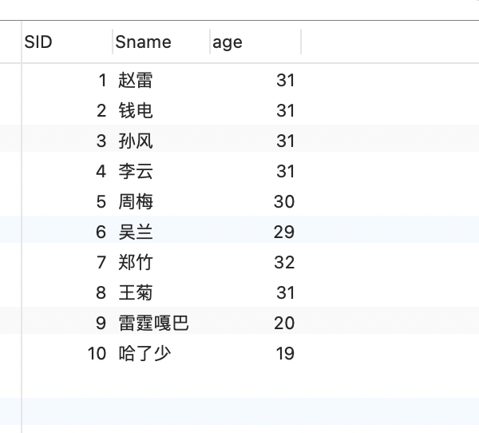

### 表结构和表数据

```
-- 数据SQL
-- 学⽣表 Student
create table Student(SId varchar(10),Sname varchar(10),Sage datetime,Ssex
varchar(10));
insert into Student values('01' , '赵雷' , '1990-01-01' , '男');
insert into Student values('02' , '钱电' , '1990-12-21' , '男');
insert into Student values('03' , '孙⻛' , '1990-12-20' , '男');
insert into Student values('04' , '李云' , '1990-12-06' , '男');
insert into Student values('05' , '周梅' , '1991-12-01' , '⼥');
insert into Student values('06' , '吴兰' , '1992-01-01' , '⼥');
insert into Student values('07' , '郑⽵' , '1989-01-01' , '⼥');
insert into Student values('09' , '张三' , '2017-12-20' , '⼥');
insert into Student values('10' , '李四' , '2017-12-25' , '⼥');
insert into Student values('11' , '李四' , '2012-06-06' , '⼥');
insert into Student values('12' , '赵六' , '2013-06-13' , '⼥');
insert into Student values('13' , '孙七' , '2014-06-01' , '⼥');
-- 科⽬表 Course
create table Course(CId varchar(10),Cname nvarchar(10),TId varchar(10));
insert into Course values('01' , '语⽂' , '02');
insert into Course values('02' , '数学' , '01');
insert into Course values('03' , '英语' , '03');
-- 教师表 Teacher
create table Teacher(TId varchar(10),Tname varchar(10));
insert into Teacher values('01' , '张三');
insert into Teacher values('02' , '李四');
insert into Teacher values('03' , '王五');
-- 成绩表 SC
create table SC(SId varchar(10),CId varchar(10),score decimal(18,1));
insert into SC values('01' , '01' , 80);
insert into SC values('01' , '02' , 90);
insert into SC values('01' , '03' , 99);
insert into SC values('02' , '01' , 70);
insert into SC values('02' , '02' , 60);
insert into SC values('02' , '03' , 80);
insert into SC values('03' , '01' , 80);
insert into SC values('03' , '02' , 80);
insert into SC values('03' , '03' , 80);
insert into SC values('04' , '01' , 50);
insert into SC values('04' , '02' , 30);
insert into SC values('04' , '03' , 20);
insert into SC values('05' , '01' , 76);
insert into SC values('05' , '02' , 87);
insert into SC values('06' , '01' , 31);
insert into SC values('06' , '03' , 34);
insert into SC values('07' , '02' , 89);
insert into SC values('07' , '03' , 98);
```


### 1.查询" 01 "课程⽐" 02 "课程成绩⾼的学⽣的信息及课程分数

难点是01比02成绩高这部分直接，把01和02的数据联表，然后使用条件列1比列2大，即可查出。

```
SELECT t1.sid,t2.Sname,t1.s1_score,s2_score FROM (SELECT
	s1.sid,
	s1.score AS s1_score,
	s2.score AS s2_score 
FROM
	( SELECT sid, score FROM sc WHERE Cid = 01 ) AS s1
	INNER JOIN ( SELECT sid, score FROM sc WHERE Cid = 02 ) AS s2 ON s1.sid = s2.sid 
WHERE
	s1.score > s2.score) AS t1 LEFT JOIN Student AS t2 ON t1.sid = t2.SId
```


### 2.查询同时选了" 01 "课程和" 02 "课程的同学id和分数

同时选了01和02，其实是把01的找出来，然后把02的也找出来，进行链表。就是同时选了01，也选了02的学生了。

```
SELECT
	t1.SId,t1.score as 01_score, t2.score as 02_score
FROM
	( SELECT * FROM SC WHERE CId = '01' ) AS t1
	JOIN ( SELECT * FROM SC WHERE CId = '02' ) AS t2 ON t1.SId = t2.SId
```


### 3.查询不存在" 01 "课程但存在" 02 "课程的情况

```
SELECT
	* 
FROM
	SC 
WHERE
	sid NOT IN ( SELECT Sid FROM SC WHERE CId = 01 ) 
	AND sid IN ( SELECT Sid FROM SC WHERE CId = 02 )
	
	
SELECT
	 t1.sid,t1.score,t2.score
FROM
	( SELECT * FROM SC WHERE cid = 02 ) AS t1
	LEFT JOIN ( SELECT * FROM SC WHERE cid = 01 ) AS t2 ON t1.sid = t2.sid
```


### 4.查询平均成绩⼤于等于 60 分的同学的学⽣编号和学⽣姓名和平均成绩

```sql
SELECT
	t1.SId,
	t1.Sname,
	t2.avg_score 
FROM
	Student AS t1
	JOIN ( SELECT SId, AVG( score ) AS avg_score FROM sc GROUP BY SId HAVING AVG( score ) >= 60 ) AS t2 ON t1.SId = t2.SId

```


### 5.查询在 SC 表存在成绩的学⽣信息

```
SELECT SC.CId,Student.* FROM SC LEFT JOIN Student ON SC.SId=Student.SId
```


### 6.查询所有同学的学⽣编号、学⽣姓名、选课总数、所有课程的总成绩(没成绩的显示为 null )

```
SELECT
Student.Sname,
	t1.*
FROM
	Student
	LEFT JOIN ( SELECT SId, COUNT( CId ), SUM( score ) FROM SC GROUP BY SC.SId ) AS t1 ON Student.SId = t1.SId
```


### 7.查询学过「张三」老师授课的同学的信息

```sql
SELECT
	t1.SId,
	Student.Sname 
FROM
	(
	SELECT
		sc.SId 
	FROM
		( SELECT Course.CId FROM Teacher JOIN Course ON Teacher.TId = Course.TId WHERE Teacher.Tname = '张三' ) AS zhangsan_coures_table
		JOIN SC ON zhangsan_coures_table.CId = sc.CId 
	) AS t1
	LEFT JOIN Student ON t1.SId = Student.SId
```


### 8.查询没有学全所有课程的同学的信息

```
SELECT * FROM Student WHERE SId NOT IN (SELECT SC.SId FROM SC GROUP BY SId HAVING COUNT(CId) = (SELECT COUNT(CId) AS total_c_num FROM Course))
```


9.查询至少有一门课与学号为" 01 "的同学所学相同的同学的信息

```
SELECT
	* 
FROM
	Student 
WHERE
	SId IN (
SELECT DISTINCT
	( SId ) 
FROM
	SC 
WHERE
	SId NOT IN ( SELECT SId FROM SC WHERE CId NOT IN ( SELECT CId FROM SC WHERE SId = 01 ) ) 
	)
```


### 10.查询没学过"张三"老师讲授的任⼀门课程的学生姓名

```
SELECT
	Sname 
FROM
	Student 
WHERE
	SID NOT IN ( SELECT SID FROM SC WHERE CID IN ( SELECT CID FROM Course WHERE TID IN ( SELECT TID FROM Teacher WHERE Tname = '张三' ) ) )
```


11.查询两门及其以上不及格课程的同学的学号，姓名及其平均成绩

```
SELECT
	Student.Sname,
	t1.* 
FROM
	( SELECT SID, AVG( score ) FROM SC WHERE score < 60 GROUP BY SID HAVING COUNT( CID ) >= 2 ) AS t1
	LEFT JOIN Student ON t1.SID = Student.SID
```


### 11.检索" 01 "课程分数⼩于 60，按分数降序排列的学生信息

```
SELECT
	* 
FROM
	( SELECT SID, score FROM SC WHERE CID = 01 AND score < 60 ORDER BY score ) AS t1
	JOIN Student ON t1.SID = Student.SID
```


### 12.按平均成绩从⾼到低显示所有学生的所有课程的成绩以及平均成绩

```
SELECT * FROM Student LEFT JOIN (SELECT
	t1.*,
	sc.CID,
  sc.score
FROM
	sc
	LEFT JOIN ( SELECT SID, AVG( score ) AS avg_score FROM SC GROUP BY SID) as t1 ON t1.SID = sc.SID) as t2 on Student.SID = t2.SID  ORDER BY t2.avg_score DESC
```


### 13.查询各科成绩最高分、最低分和平均分

 以如下形式显示：课程 ID，课程 name，最高分，最低分，平均分, 要求输出课程号和选修⼈数，查询结果按⼈数降序排列，若⼈数相同，按课程号升序排列.order by可以排序两个字段的。

```
SELECT
	CID,
	MAX( score ),
	MIN( score ),
	AVG( score ),
	COUNT( SID ) AS s_num 
FROM
	SC 
GROUP BY
	CID 
ORDER BY
	s_num DESC,
	CID ASC
```


### 14.按各科平均成绩进⾏排序，并显示排名

```
SELECT
	CID,
	AVG( score ) as avg_score
FROM
	SC 
GROUP BY
	CID ORDER BY avg_score desc
```


### 15.统计各科成绩的前3名

考虑有并列的情况。

记录下来为什么要这样写？

思路，

成绩最好的前3名，肯定count（*） 会小于等于3.

比如第一名是100分，小于等于100分的，肯定就是100本身这条记录。所以记录条数只会是1。第2名是99，以此类推。


所以先去重进行倒序（考虑并列的情况）。然后进行链表。然后进行cid，sid，score分组,每组的条数count是，条数小于等于3的


```
SELECT
	a.cid,
	a.sid,
	a.score 
FROM
	sc a
	LEFT JOIN ( SELECT DISTINCT cid, score FROM sc) b ON a.cid = b.cid 
WHERE
	a.score <= b.score 
GROUP BY
	a.cid,
	a.sid,
	a.score 
HAVING
	count( a.score ) <= 3 
ORDER BY
	cid,
	score DESC;

```


### 16.查询同名同性学生名单，并统计同名⼈数。

```
SELECT Sname,COUNT(SID) as num from Student GROUP BY Sname HAVING COUNT(SID) >= 2
```


### 17查询 1990 年出生的学生名单

```mysql
SELECT * FROM student WHERE YEAR(sage)=1990 

//17查询 3月份 出生的学生名单
SELECT * FROM student WHERE MONTH(sage)=03


//17查询 1号 出生的学生名单
SELECT * FROM student WHERE dayofmonth(sage)=01
```


### 18.查询每门课程的平均成绩，结果按平均成绩降序排列，平均成绩相同时，按课程编号升序排列

```
SELECT CID,AVG(score) as avg_score FROM SC GROUP BY CID  ORDER BY avg_score DESC,CID asc
```


### 19.查询平均成绩⼤于等于 85 的所有学生的学号、姓名和平均成绩

```
SELECT
	a.*,b.Sname 
FROM
	( SELECT SID, AVG( score ) AS avg_score FROM SC GROUP BY SID HAVING AVG( score ) >= 85 ) a
	JOIN Student b ON a.SID = b.SID
```


### 20.查询课程名称为「数学」，且分数低于 60 的学生姓名和分数

```
SELECT
	a.*,
	b.Sname 
FROM
	( SELECT SID, score FROM SC WHERE CID = ( SELECT CID FROM Course WHERE Cname = '数学' ) AND score < 60 ) a
	JOIN Student b ON a.sid = b.sid
```


### 21.查询所有学生的课程及分数情况（存在学生没成绩，没选课的情况）

```
SELECT
	c.*,
	d.Cname 
FROM
	(
SELECT
	a.SID,
	a.Sname,
	b.CID,
	b.score 
FROM
	Student a
	LEFT JOIN SC b ON a.SID = b.SID 
	) c
	LEFT JOIN Course d ON c.CID = d.CID
	GROUP BY c.SID,c.CID,c.score
```


### 22.查询任何⼀门课程成绩在 70 分以上的姓名、课程名称和分数

```
SELECT
	c.*,
	d.Cname 
FROM
	(
SELECT
	a.*,
	b.Sname 
FROM
	( SELECT SID, CID, score FROM SC WHERE score > 70 ) a
	LEFT JOIN Student b ON a.SID = b.SID 
	) c
	LEFT JOIN Course d ON c.CID = d.CID
```


### 23.成绩有重复的情况下，查询选修「张三」老师所授课程的学生中，成绩最⾼的学生信息及其成绩

```
	SELECT * FROM (SELECT
	CID,score 
FROM
	SC 
WHERE
	CID IN ( SELECT CID FROM Course WHERE TID = ( SELECT TID FROM Teacher WHERE Tname = '张三' ) ) 
ORDER BY
	score DESC 
	LIMIT 1 ) a LEFT JOIN SC b on a.CID = b.CID WHERE b.score = a.score
	
	
	SELECT
	s2.sname,
	s2.sid,
	s1.score 
FROM
	student AS s2
	JOIN sc AS s1 ON s1.SId = s2.SId 
WHERE
	score = (
	SELECT
		max( score ) 
	FROM
		sc AS s1 
	WHERE
	cid = ( SELECT c1.cid FROM course AS c1 JOIN teacher AS t1 ON c1.tid = t1.tid WHERE t1.tname = '张三' ) 
	)
```


### 

### 24.查询不同课程成绩相同的学生的学生编号、课程编号、学生成绩

```
SELECT DISTINCT
	a.sid,
	a.CID,
	a.score 
FROM
	SC a
	JOIN SC b ON a.score = b.score 
WHERE
	a.CID != b.CID 
ORDER BY
	score
```


### 25.检索⾄少选修两门课程的学生学号

```
SELECT sid,count(*) as count_num FROM SC GROUP BY sid HAVING count(*) >= 2
```


### 26.查询选修了全部课程的学生信息

```
SELECT
	* 
FROM
	(
	SELECT
		SID,
		count( * ) AS count_num 
	FROM
		SC 
	GROUP BY
		SID 
	HAVING
		COUNT( * ) = ( SELECT COUNT( * ) AS count_num FROM Course ) 
	) a
	LEFT JOIN Student b ON a.SID = b.SID
```


### 27.查询各学生的年龄，只按年份来算

```
SELECT SID,Sname,(YEAR(NOW()) - year(Sage)) as age from Student
```




28.查询本周过生日的学生

```
//查询本周过生日的学生
select sid, sname,ssex, sage
from student
WHERE WEEKOFYEAR(student.Sage)=WEEKOFYEAR(CURDATE())

//查询下周过生日的学生
select sid, sname,ssex, sage
from student
where WEEKOFYEAR(student.Sage)=WEEKOFYEAR(CURDATE())+1
```


29.查询本月过生日的学生

```
//本月
select *
from student
where month(student.sage)=month(now());

//下个月
select *
from student
where month(student.sage)=month(now()) + 1;
```

