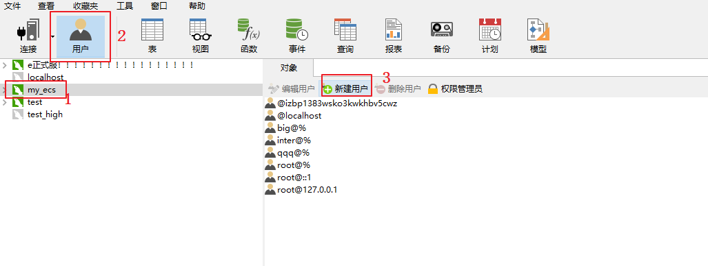
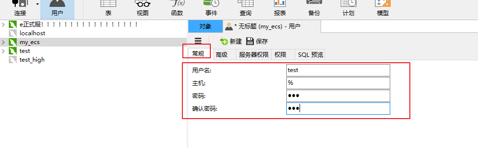
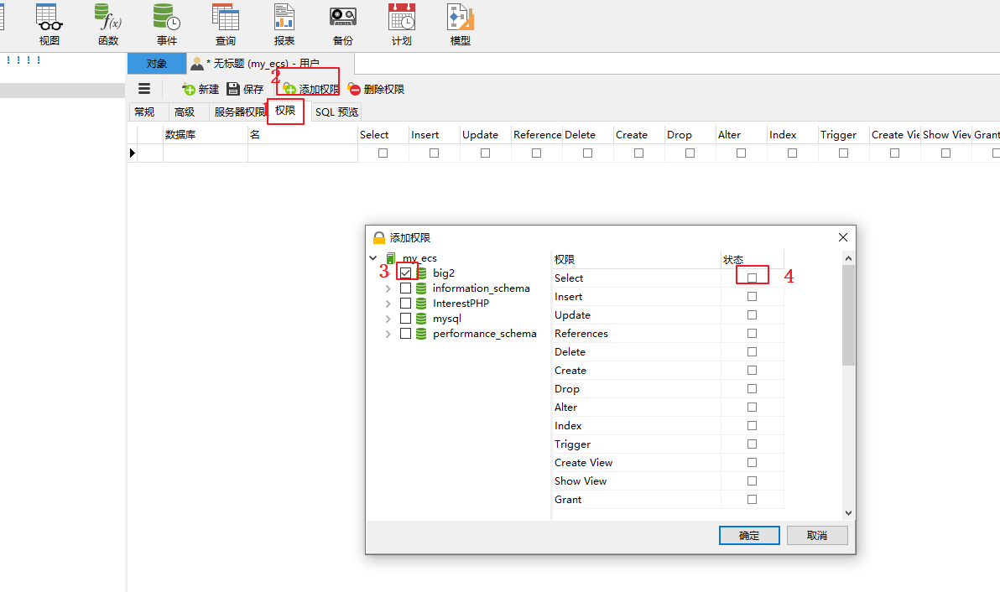
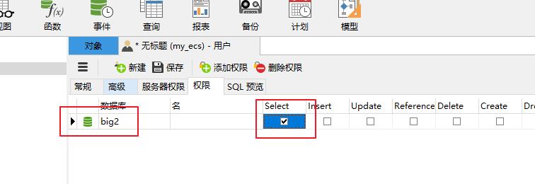
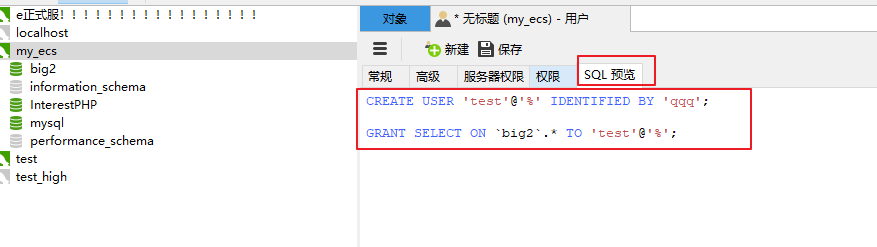

1.

2.


3.

4.

然后去登录test和对应的密码去登录就是只读权限了


如果图形化的操作不行，就运行命令行。只读账号

```
MySQL [(none)]> use mysql
Database changed

MySQL [mysql]> CREATE USER `scan-read`@`%` IDENTIFIED BY 'DLlHr2Dz2KwAWoP';
Query OK, 0 rows affected (0.01 sec)

MySQL [mysql]> 
MySQL [mysql]> GRANT Select, Show Databases, REPLICATION SLAVE, REPLICATION CLIENT,Show View ON *.* TO `scan-read`@`%`;
Query OK, 0 rows affected (0.01 sec)

MySQL [mysql]> flush privileges;
Query OK, 0 rows affected (0.01 sec)

ip：94.103.4.65
用户:scan-read
密码：DLlHr2Dz2KwAWoP
端口：3306
```


```
MySQL [(none)]> use mysql
Database changed

MySQL [mysql]> CREATE USER `epan-read`@`61.4.115.58` IDENTIFIED BY 'Adur2Dz2KwAAZa';
Query OK, 0 rows affected (0.01 sec)

MySQL [mysql]> 
MySQL [mysql]> GRANT Select, Show Databases, Show View ON *.* TO `epan-read`@`61.4.115.58`;
Query OK, 0 rows affected (0.01 sec)

MySQL [mysql]> flush privileges;
Query OK, 0 rows affected (0.01 sec)
```




添加远程访问权限（root权限，all privileges）

```
grant all privileges on *.* to root @"%" identified by "Jkffqw@#d12";

grant all privileges on *.* to maite @"%" identified by "h3fi38g49hfojw883hosig";

flush privileges;
```

