## 1.基础知识积累

```

isset()是否被设置 empty()是否为空
当isset(null)时,返回值其false.   null也是未设置值.

$n = false;
$nn = $n ?: 0;
var_dump($nn);//0
值 为false时,isset()为true;因为设置值,只不过值是false而已

?:判断的是,条件是否为空.不为空的时候,输出原条件,为空时输出:符合后面的值
$gender = $user_gender == '1' ? '男' : '女';

??是null合并
$i =false;
$re = $i ?? 1;//相当于 isset($i) ? $i : 1
$re= false

```

## 2.接收json/xml格式的数据。


## 3.数组合并

使用array_merge()函数时,如何两个数组的键名一致,会发生覆盖现象,后面的数组覆盖前面的值


## 4.GLOBALS全局变量


## 5.一次网站的http请求经历的过程


## 6.float类型的值转化为整型时会出现精度丢失的情况


## 6.1 float数据类型精度问题

float类型的精度，最多是14位，如果大于14位会出现，四舍五入的情况

比如

```php
$a = '9999.9999999999';//14位
$b = (float) $a;
return $b;//9999.9999999999

$a = '9999.9999999999';//15位
$b = (float) $a;
return $b;//100000

 $a = '9999999999999.9999999999';//24位
$b = (float) $a;
return $b;//10000000000000

//24位之后，出现科学计数法
 $a = '9999999999999.9999999999';//25位
$b = (float) $a;
return $b;//1.0E+14
```


## 7{}代码里的大括号作用

.

## 8.array_sum统计数组的值


## 9.匹配中国大陆手机号码正则

```php
if(!is_numeric($mobile) || !preg_match("/^1\d{10}$/", $mobile)){
   return returnJson(Status::FAILED,Lang::get('mobile_error'));
}
```


## 10.获取函数的参数值。


```
func_get_args()//


```

## 11.curl函数

```php
if (!function_exists('send_http')) {
    /**
     * Notes: curl发送http请求
     * User: 闻铃
     * DateTime: 2021/9/8 下午6:27
     * @param string $url 请求的url
     * @param bool $isPost 是否为post请求
     * @param array $data 请求参数
     * @param array $header 请求头 说明：应这样格式设置请求头才生效 ['Authorization:0f5fc4730e21048eae936e2eb99de548']
     * @param bool $isJson 是否为json请求，默认为Content-Type:application/x-www-form-urlencoded
     * @param int $timeOut 超时时间 单位秒，0则永不超时
     * @return mixed
     */
    function curl_request(string $url, bool $isPost = true, array $data = [], array $header = [], bool $isJson = false, int $timeOut = 0): array
    {
        if (empty($url)) {
            return false;
        }

        //初始化curl
        $curl = curl_init();

        //如果curl版本，大于7.28.1，得是2才行 。 而7.0版本的php自带的curl版本为7.40.1.  使用php7以上的，就能确保没问题
        $ssl = (strpos($url, 'https') !== false) ? 2 : 0;

        $options = [
            //设置url
            CURLOPT_URL            => $url,

            //将头文件的信息作为数据流输出
            CURLOPT_HEADER         => false,

            // 请求结果以字符串返回,不直接输出
            CURLOPT_RETURNTRANSFER => true,

            // 禁止 cURL 验证对等证书
            CURLOPT_SSL_VERIFYPEER => false,

            //identity", "deflate", "gzip“，三种编码方式，如果设置为空字符串，则表示支持三种编码方式。当出现乱码时，可设置此字符串
            CURLOPT_ENCODING       => '',

            //设置http版本。HTTP1.1是主流的http版本
            CURLOPT_HTTP_VERSION   => CURL_HTTP_VERSION_1_1,

            //连接对方主机时的最长等待时间。设置为10秒时，如果对方服务器10秒内没有响应，则主动断开链接。为0则，不限制服务器响应时间
            CURLOPT_CONNECTTIMEOUT => 0,

            //整个cURL函数执行过程的最长等待时间，也就是说，这个时间是包含连接等待时间的
            CURLOPT_TIMEOUT        => $timeOut,

            //检查服务器SSL证书中是否存在一个公用名
            CURLOPT_SSL_VERIFYHOST => $ssl,

            //设置头信息
            CURLOPT_HTTPHEADER     => $header
        ];

        // post和get特殊处理
        if ($isPost) {
            // 设置POST请求
            $options[CURLOPT_POST] = true;

            if ($isJson && $data && !is_array($data)) {
                //json处理
                $data   = json_encode($data);
                $header = array_merge($header, ['Content-Type: application/json']);

                //设置头信息
                $options[CURLOPT_HTTPHEADER] = $header;

                //如果是json字符串的方式，不能用http_build_query函数
                $options[CURLOPT_POSTFIELDS] = $data;
            } else {
                //x-www-form-urlencoded处理
                //如果是数组的方式,要加http_build_query，不加的话，遇到二维数组会报错。
                $options[CURLOPT_POSTFIELDS] = http_build_query($data);
            }
        } else {
            // GET
            $options[CURLOPT_CUSTOMREQUEST] = 'GET';

            //没有？且data不为空,将参数拼接到url中
            if (strpos($url, '?') === false && !empty($data) && is_array($data)) {
                $params_arr = [];
                foreach ($data as $k => $v) {
                    array_push($params_arr, $k . '=' . $v);
                }
                $params_string        = implode('&', $params_arr);
                $options[CURLOPT_URL] = $url . '?' . $params_string;
            }
        }

        //数组方式设置curl，比多次使用curl_setopt函数设置在速度上要快
        curl_setopt_array($curl, $options);

        // 执行请求
        $response = curl_exec($curl);

        //返回的CONTENT_TYPE类型
        $contentType = curl_getinfo($curl, CURLINFO_CONTENT_TYPE);

        //返回的http状态码
        $httpCode = curl_getinfo($curl, CURLINFO_HTTP_CODE);

        $result = ['code' => $httpCode, 'header' => $contentType];
        //没有错误时curl_errno返回0
        if (curl_errno($curl) == 0) {
            $result['msg'] = 'SUCCESS';
            if (is_null($response)) {
                $result['body'] = null;
            } else {
                $data = json_decode($response, true);
                if ($data) {
                    //json数据
                    $result['body'] = $data;
                } else {
                    //不是json,则认为是xml数据
                    libxml_disable_entity_loader(true);//验证xml
                    $xml            = simplexml_load_string($response, 'SimpleXMLElement', LIBXML_NOCDATA);//解析xml
                    $result['body'] = $xml;
                }
            }
        } else {
            $result['msg']  = curl_error($curl);
            $result['body'] = null;
        }

        //关闭请求
        curl_close($curl);
        return $result;
    }
}
```

## 12.break关键字，可以控制循环中断的重数

```php
				$data = [1,2,3,4,5,6,7];
        $data_qq = [1,2,3,4,5,6,7];
        $q = 0;
        foreach ($data as $k => $v) {
            foreach ($data_qq as $kk => $vv) {
                if ($vv == 3) {
                    $q = 1;
                    break 2;
                }
            }
            var_dump($q);die;
        }
        var_dump('ok');die;

如果break 2时，会输出ok。如果break 1时，会输出1.
```

## 13.前端传文件过来时，用$_FILE数组接收。

```php
$_FILES['myFile']['name'] //客户端文件的原名称。

$_FILES['myFile']['type'] //文件的 MIME 类型，需要浏览器提供该信息的支持，例如"image/gif"。

$_FILES['myFile']['size'] //已上传文件的大小，单位为字节。

$_FILES['myFile']['tmp_name'] //文件被上传后在服务端储存的临时文件名，一般是系统默认。可以在php.ini的upload_tmp_dir 指定，但 用 putenv() 函数设置是不起作用的。

$_FILES['myFile']['error'] //和该文件上传相关的错误代码。['error'] 是在 PHP 4.2.0 版本中增加的。下面是它的说明：(它们在PHP3.0以后成了常量)
```

会接收到这样的一个二位数组。然后后面主要用函数move_uploaded_file（$tmp_name，$file_path），将保存图片的临时变量移动到对应的文件夹中.

## 14.后端创建一个图片后，可以生成二进制数据。

图形验证码举例子，且不用保存到服务器，用完即删。

将创建好的图片，返回给前端有两种方式。

1.在对其进行base64编码。即可返回给前端。


```php
设置请求头，直接返回二进制数据。
2.response($content, 200, ['Content-Length' => strlen($content)])->contentType('image/png');
```


## 15&& 和 and是有优先级关系的

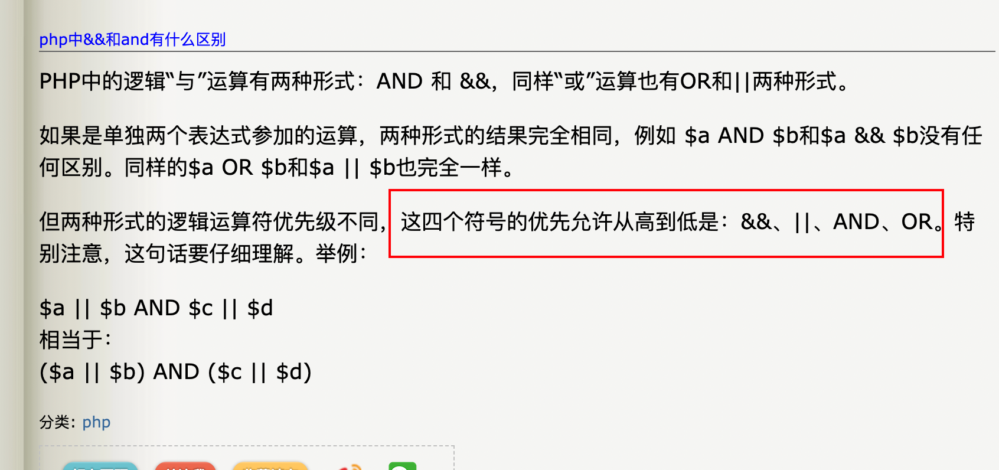

## 16.php垃圾回收机制

每个变量被定义时，会生成一个zval的容器，存储此变量的类型和值。这个zval容器还会两个额外的信息，一个是Is_ref，是一个布尔值，来标识这个变量是否有被引用。通过这个字节，php才能将引用变量和普通变量区分开。第二个额外字节是"refcount"，用来表示zval容器的变量个数。zval容器中的变量也称为符号，每个符号都有对应的作用域。当变量容器中的refcount值为0时，此变量容器就会清除。

当任何关联到某个变量容器的变量离开它的作用域(比如：函数执行结束)，或者对变量调用了函数 [unset()](https://www.php.net/manual/zh/function.unset.php)时，”refcount“就会减1。当refcount被减少到0时，所在的变量容器会被清除，并且会进入根缓冲区。仅仅在根缓冲区满了时，才对缓冲区内部所有不同的变量容器执行垃圾回收操作。


其中会涉及到一个垃圾周期。仅仅在引用计数减少到非零值时，才会产生垃圾周期(garbage cycle)。其次，在一个垃圾周期中，通过检查引用计数是否减1，并且检查哪些变量容器的引用次数是零，来发现哪部分是垃圾。

## 17.static和self区别

如果没有继承关系，这两个关键字没有区别。

如果有继承关系，且父类和子类有方法名相同的静态方法时。

self关键字会调用当前类中的方法。

static关键字会调当前正在实例化类的方法。

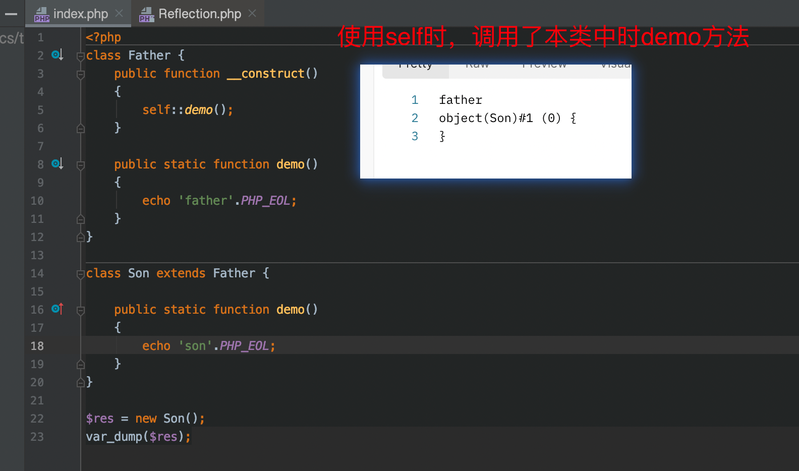

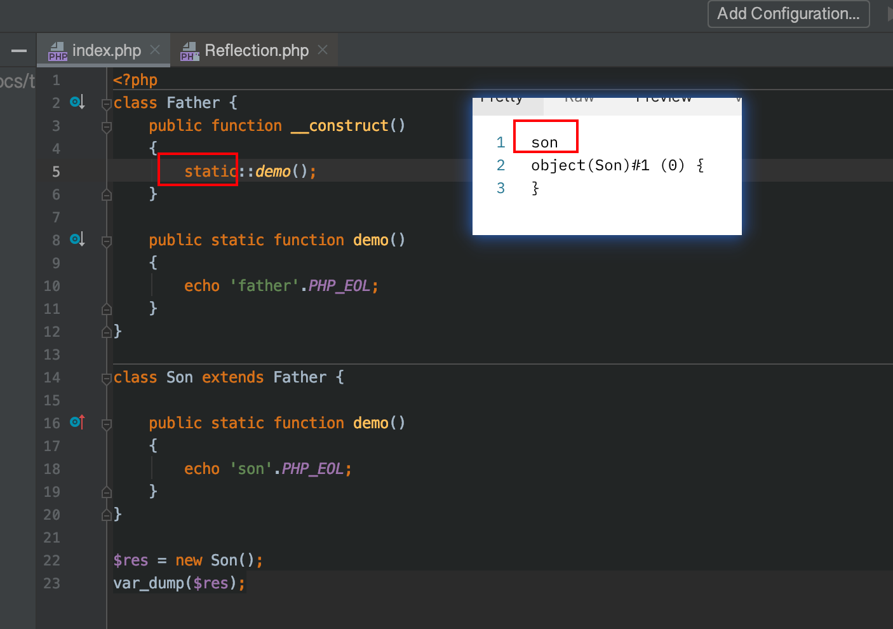


## 18.try 和catch

php的异常：程序在运行中出现不符合预期的情况，允许发生（你也不想让他出现不正常的情况）但他是一种不正常的情况，按照我们的正常逻辑本不该出的错误，但仍然会出现的错误，属于逻辑和业务流程的错误，而不是编译或者语法上的错误。

php的错误：	属于php脚本自身的问题，大部分情况是由错误的语法，服务器环境导致，使得编译器无法通过检查，甚至无法运行的情况。warning、notice都是错误，只是他们的级别不同而已，并且错误是不能被try-catch捕获的。

try catch不能捕获错误，只能捕获异常。

但在框架中，可以捕获到错误，因为框架底层使用到register_shutdown_function，set_error_handler，set_exception_handler这三个函数，可以捕获到错误。

所以在线上环境，一定要开始app_debug模式，和修改错误模版，不能外露框架版本，这是不安全的行为。


## 19接口Countable

某个类实现Countable接口之后，需要实现count方法，

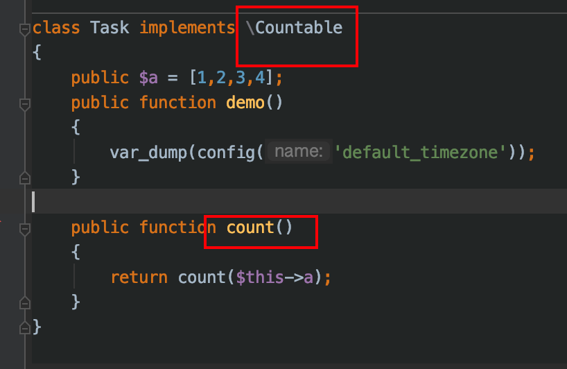

```php
$obj = new Task();
var_dump(count($obj));die;
```

可在此类上的对象上，直接使用count函数

## 20接口ArrayAccess

实现此接口之后，可以通过数组的方式，去访问对象。比如thinkphp的model类

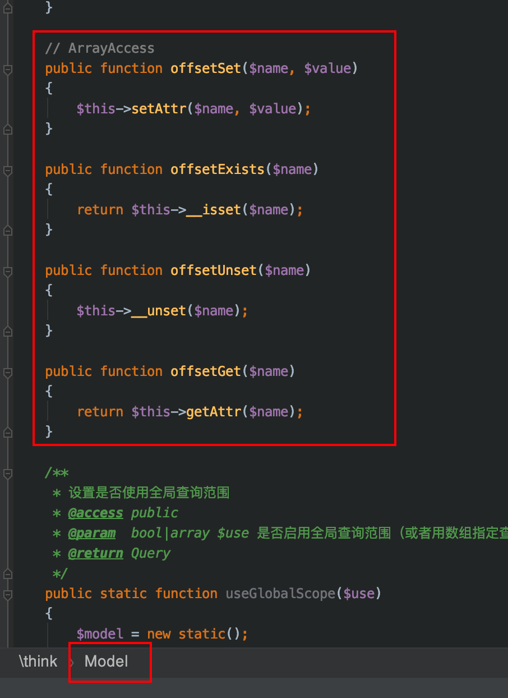

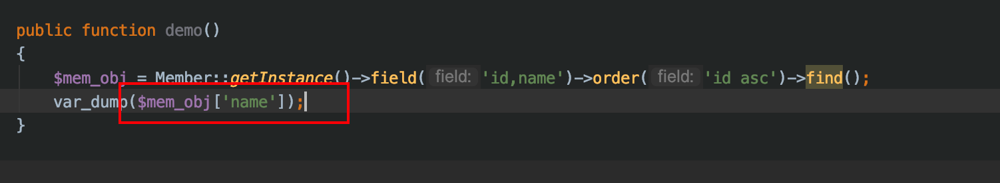


## 21.php反射机制ReflectionClass

反射机制是php内置的一种机制，在程序运行中可以用来探索程序中运行的类的各种信息。即使是私有类型的属性也能通过反射机制获取。反射机制的使用场景常见于：mvc框架的容器底层源码，或者自动生成php代码注释等应该场景。比如thinkphp5.1版本容器类等封装就使用到了反射机制。

```php
class Father {

    private $age = '312312312312';
    public function demo()
    {
        return 'father';
    }
}
$class = 'Father';
$res = new ReflectionClass($class);
$property = $res->getProperty("age");
// 设置属性可访问
$property->setAccessible(true);

$father_obj = new Father();

var_dump($property->getValue($father_obj));

```

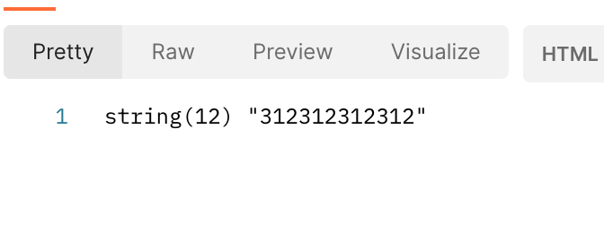

## 22 php的执行过程

php的执行过程大体上分为两步，第一步是预编译阶段，第二步是执行阶段。

预编译阶段是：检测php的基本语法，代码优化。检测完之后编译成计算机可以识别的指令。

执行阶段是：对编译阶段得到的结果进行执行。执行时开始对内存进行操作（申请空间，存储数据，再读取空间。。。。）


## 23.opcache扩展

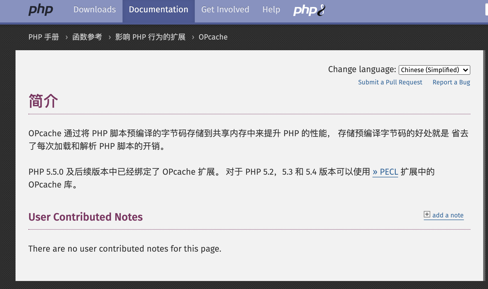

默认开启的。opcache会对编译好的脚本进行缓存。

php代码的执行，大体上可分为两个阶段，1:编译阶段(解析php代码，并将其编译成机器可以执行的字节码)。2执行阶段：交给cpu执行，开始申请内存空间，去执行编译好的指令。当执行一个没有改动的文件时，php会自动去内存获取到以前编译好的字节码，从而省去重复加载和解析php脚本的开销，提高效率。


对于一些常驻内存的服务来说，如果改了东西后，平滑重启不生效很可能就是这个opcache的问题。需要执行opcache_reset();函数后，刷新缓存才行


## 24函数参数的可变变量...$arg


## 25.php危险的函数，应该禁用

```
passthru,system,chroot,chgrp,chown,ini_alter,ini_restore,dl,readlink,symlink,popepassthru,stream_socket_server,fsocket,popen,shell_exec,exec,eval,ini_set,pfsockopen,phpinfo,proc_get_status,proc_open,syslog,scandir
```

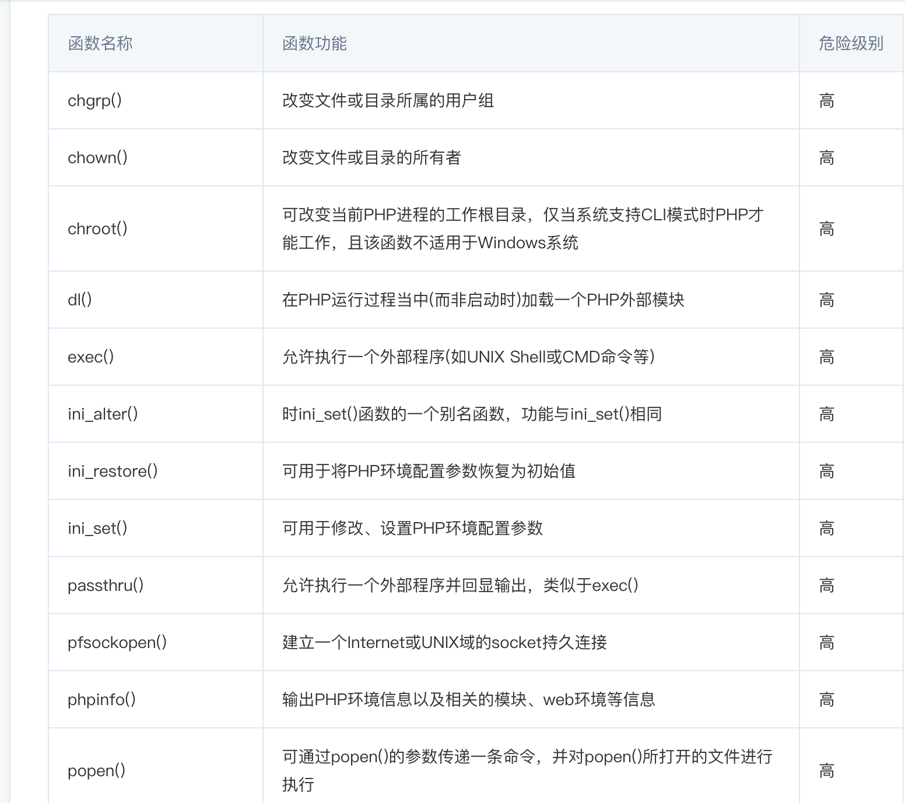

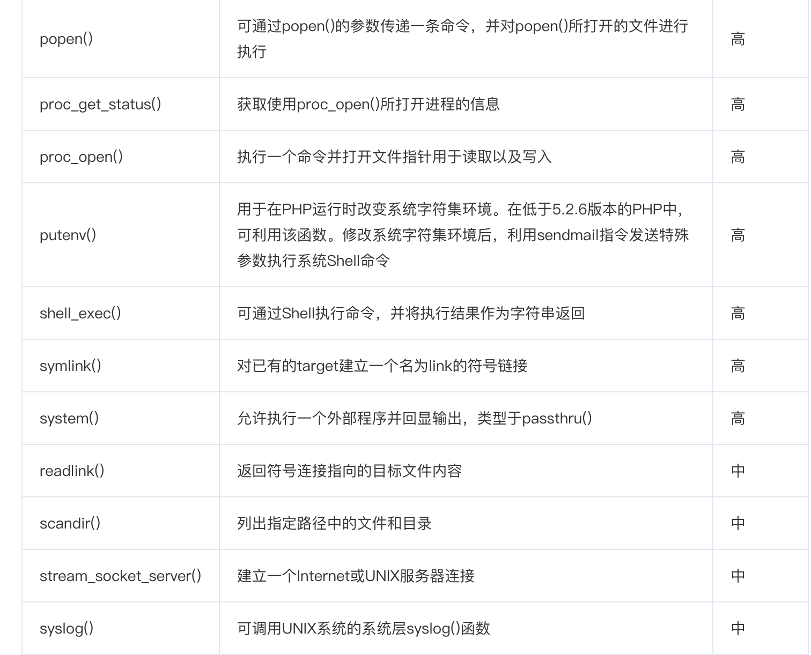


## 26使用header重定向

```
header('HTTP/1.1 301 Moved Permanently');//发出301头部
header('Location:'.$domain.'/admin/index/login?sign='.$sign);//
exit;
```


## 27.直接返回图片的二进制数据

设置一个content-type的响应头，告诉浏览器即可

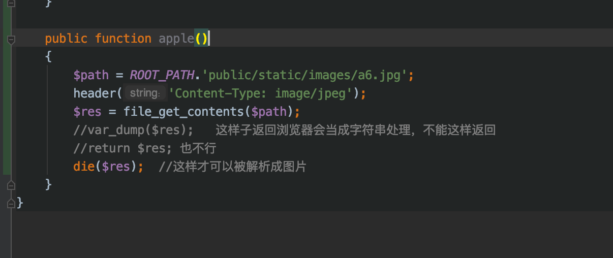


## 28.界定符EOF

```php
$url = $request['url'] ?? '';
        $time = $response['useTime'] ?? '';
        $request = is_array($request) ? json_encode($request,JSON_UNESCAPED_UNICODE) : $request;
        $response = is_array($response) ? json_encode($response,JSON_UNESCAPED_UNICODE) : $response;

        $log = <<<EOF
        
请求url:    {$url}

请求参数:   {$request}

响应数据:   {$response}

响应时间:   {$time}秒
EOF;
        return $log;
```


## 29.获取远程或者本地图片信息。

```php
$imgPath = "https://gunbull.org/metadata/images/{$number}.png";

            $stream_opts = [
                "ssl" => [
                    "verify_peer"=>false,
                    "verify_peer_name"=>false,
                ]
            ];
            $img = file_get_contents($imgPath,false, stream_context_create($stream_opts));
            $data = base64_encode($img);
            echo $data;die;
```


## 30.php的错误和异常，Exception类，Error类，Throwable接口

Throwable能捕获更多的错误和异常。Throwable包括了Error和Exception。

```php
<?php

function add(int $left, int $right)
{
    return $left + $right;
}
//try {
//    $value = add('left', 'right');
//} catch (Throwable $e) {//Throwable可以捕获这个类型的错误，会输出321，会打印错误信息。
//    var_dump('321');
//    echo $e->getMessage(), "\n";
//}

try {
    $value = add('left', 'right');
} catch (Exception $e) {//exception捕获不了这个类型的错误，不会输出321，而是会直接报错
    var_dump('321');
    echo $e->getMessage(), "\n";
}
```


```
在 PHP 大致有三种类型的可捕获的异常 / 错误

Error：PHP 内核抛出错误的专用类型，如类不存在，函数不存在，函数参数错误，都会抛出此类型的错误，PHP 代码中不应该使用 Error类来作为异常抛出
Exception：应用开发者应该使用的异常基类
ErrorException：此异常基类专门负责将 PHP 的 Warning/Notice 等信息通过 set_error_handler 转换成异常，PHP 未来的规划必然是将所有的 Warning/Notice 转为异常，以便于 PHP 程序能够更好更可控地处理各种错误

Throwable包括了Error和Exception
PHP7中出现了Throwable接口，该接口由Error和Exception实现，用户不能直接实现Throwable接口，而只能通过继承Exception来实现接口；
```

链接：https://www.cnblogs.com/zyf-zhaoyafei/p/6928149.html

```
由此引出一个奇葩的问题：问什么不能触发，为什么框架中是可以的？其实原因很简单，
只在parse-time出错时是不会调用本函数的。只有在run-time出错的时候，才会调用本函数，我的理解是语法检查器前没有执行register_shutdown_function()去把需要注册的函数放到调用的堆栈中，所以就根本不会运行。
那框架中为什么任何错误都能进入到register_shutdown_function()中呢，其实在框架中一般会有统一的入口index.php，然后每个类库文件都会通过include ** 的方式加载到index.php中，相当与所有的程序都会在index.php中聚集，同样，你写的具有语法错误的文件也会被引入到入口文件中，这样的话，调用框架，执行index.php，index.php本身并没有语法错误，也就不会产生parse-time错误，而是 include 文件出错了，是run-time的时候出错了，所以框架执行完之后就会触发register_shutdown_function();
```

**1：set_error_handler()**
　　看到这个名字估计就知道什么意思了，这个函数用于捕获错误，设置一个用户自定义的错误处理函数。

当程序出现错误的时候自动调用此方法，不过需要注意一下两点：第一，如果存在该方法，相应的error_reporting()就不能在使用了。所有的错误都会交给自定义的函数处理。第二，此方法不能处理以下级别的错误：E_ERROR、 E_PARSE、 E_CORE_ERROR、 E_CORE_WARNING、 E_COMPILE_ERROR、 E_COMPILE_WARNING，set_error_handler() 函数所在文件中产生的E_STRICT，该函数只能捕获系统产生的一些Warning、Notice级别的错误


**2.register_shutdown_function()**
　　捕获PHP的错误：Fatal Error、Parse Error等，这个方法是PHP脚本执行结束前最后一个调用的函数，比如脚本错误、die()、exit、异常、正常结束都会调用


**3：set_exception_handler()**
　　设置默认的异常处理程序，用在没有用try/catch块来捕获的异常，也就是说不管你抛出的异常有没有人捕获，如果没有人捕获就会进入到该方法中，并且在回调函数调用后异常会中止。看一下用法：


## 31.env文件里面，不能出现 ( 和 )  这两个括号,或者其他特殊符号的问题

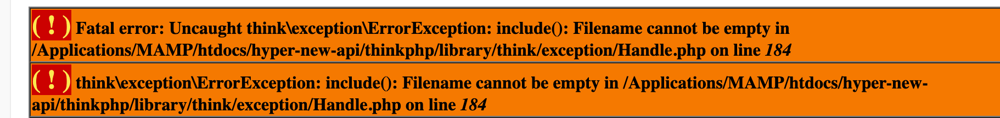              


## 32.bc函数统一保留小数位

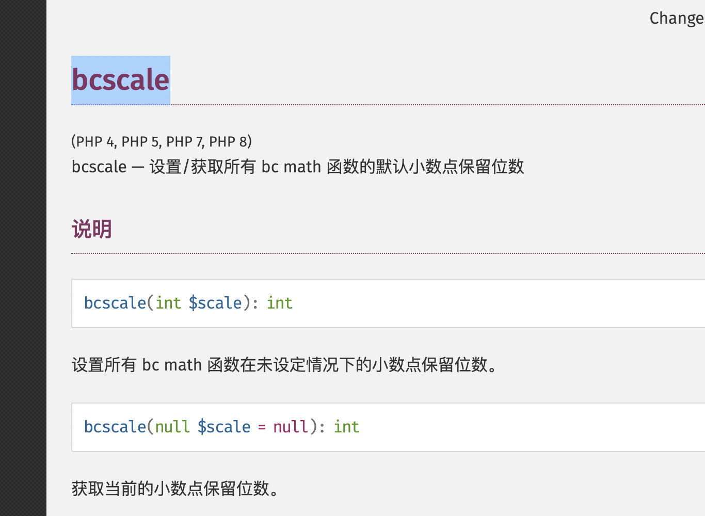

先使用bcscale，再使用bc函数的话，bc函数，都会保留设定好的位数字

```
bcscale(10);

bcsub(1.999999,1.32173821321);// 会保留10位小数。
```

```

```


## 33.php接收不到文件(上传文件大小大于配置值)。修改配置文件，中有一项是

找到php.ini配置文件；2、配置“upload_max_filesize = 30M”内容；3、修改post_max_size选项即可。


## 34.php的nts中的nts是非线程安全的意思


## 35.php-fpm可以指定php.ini 和php-fpm配置文件目录启动

```bash
/usr/local/php/sbin/php-fpm -c /usr/local/php/etc/php.ini -y /usr/local/php/etc/php-fpm.conf
```


## 36.php代码的执行流程

php代码的执行，大体上可分为两个阶段，

1:编译阶段(由php解释器（php-cgi）解析php代码，如果由语法错误会被解析出来。通过解析后会将其编译成一段中间代码，一般称为Opcodes)。

2执行阶段：将opcodes交给Zend Vm(php执行opcodes的引擎,(因为机器只能执行机器指令，所以php代码需要通过zend VM进行转化，转化机器指令交给CPU执行))cpu执行，开始申请内存空间，去执行编译好的指令。当执行一个没有改动的文件时，php会自动去内存获取到以前编译好的opcodes，从而省去重复加载和解析php脚本的开销，提高效率。


jit（just in time）

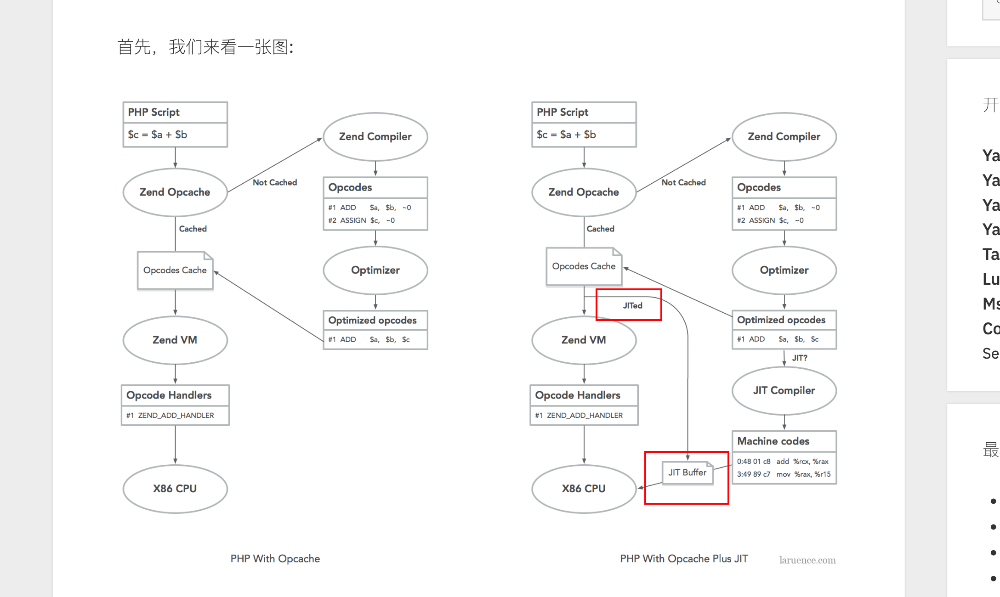

jit简单来说，就是可以通过opcache结合runtime，进一步优化后，直接生成机器码，跳过了zend VM的步骤。从而提高了效率

提高了一倍左右。


## 37.变量的复制和引用

其他类型的数据类型的话，都是值复制，当变量为对象时复制的是对象的句柄。


*首先，将PHP中的变量看成是一个一个的数据槽。这个数据槽可以保存一个基本类型（int、string、bool等）。创建引用时，这个槽里保存的是内存地址，或者说是指向引用对象的一个指针，引用没有拷贝操作，仅仅是将指针指向了原变量（参考数据结构）。创建普通赋值时，则是拷贝的基本类型。*

***而对象则与基本类型不同，它不能直接保存在数据槽中，而是将对象的“句柄”保存在了数据槽**。这个句柄是指向对象特定实例的标识符。虽然句柄不是我们所能直观操作的类型，但它也属于基本类型。*

*当你获取一个包含对象句柄的变量，并将其分配给另一个变量时，另一个变量获取的是这个对象的句柄。（注意，不是引用！不是引用！不是引用！！）。通过句柄，两个变量都可以修改同一个对象。但是，这两个变量并没有直接关系，它们是两个独立的变量，其中一个变量修改为其他值时，并不会对另一个变量产生影响。只有该变量在修改对象内部的内容时，另一个变量因为持有相同的句柄，所以它的对象内容也会相应地发生改变。*

- [ ] 

- ```php
  <?php
  
  class D
  {
      public $d = 0;
  }
  
  function f1(array $arr)
  {
      //其实$arr 是$dArray的对象句柄。
      //$dArray和$arr是两个变量， 所以改了$arr[0]之后，不会影响到$dArray
  
      //但句柄的话，其实值的都是同一个对象。所以改了$arr[1]中的d属性后，$dArray也会受到影响
  
      $d1 = new D();
      var_dump($d1);
      $d1->d = 1;
      $arr[0] = $d1;
  
  
      $d2 = $arr[1];
      $d2->d = 2;
  
      var_dump($arr);
  }
  
  $dArray = [];
  $dArray[0] = new D();
  $dArray[1] = new D();
  f1($dArray);
  var_dump($dArray);
  ```


## 38.常量const和define的区别和应用

在PHP5.3中，有两种方法可以定义常量：

1. 使用`const`关键字
2. 使用`define()`方法


```csharp
const FOO = 'BAR';
define('FOO','BAR');
```

这两种方式的根本区别在于`const`会在代码编译时定义一个常量，而`define`则是在代码运行时才定义一个常量。这就使得`const`会有以下几个缺点：

- `const`不能在条件语句中使用。如果要定义一个全局变量，`const`必须要处于整个代码的最外层：


```csharp
if (...) {
    const FOO = 'BAR';    // 无效的
}
// but
if (...) {
    define('FOO', 'BAR'); // 有效的
}
```

你可以能会问为什么我要这么做？一个最平常的例子是当你在检测一个常量是否已经被定义时：


```ruby
if (!defined('FOO')) {
    define('FOO', 'BAR');
}
```

- `const`只能用来声明变量（如数字、字符串，或者`true, false, null, _FILE_`），而`define()`还能接受表达式。不过在PHP5.6之后`const`也可以接受常量的表达式了：


```csharp
const BIT_5 = 1 << 5;    // 在PHP5.6之后有效，之前无效
define('BIT_5', 1 << 5); // 一直有效
```

- `const`的常量命名只能用直白的文本，而`define()`允许你用任何表达式来对常量命名。这样我们就可以执行以下操作：


```bash
for ($i = 0; $i < 32; ++$i) {
    define('BIT_' . $i, 1 << $i);
}
```

- `const`定义的常量是大小写敏感的，但是`define`允许你将其第三个参数设置为true来关闭其对大小写的敏感：


```php
define('FOO', 'BAR', true);
echo FOO; // BAR
echo foo; // BAR
```

------

以上就是你需要注意的几点。


重点

那么现在我来说明以下，为什么不涉及以上情况下，我个人总是习惯使用`const`：

- `const`更加易读、美观。
- `const`默认在当前的`namespace`下定义常量，而使用`define`则需要你写明整个`namespace`的完整路径：


```php
namespace A\B\C;
// 如果要定义常量 A\B\C\FOO:
const FOO = 'BAR';
define('A\B\C\FOO', 'BAR');
```

- 自从PHP5.6后，使用`const`数组也能被定义为常量。而`define`目前是不支持这一功能的，但是该功能会在PHP7中被实现：


```csharp
const FOO = [1, 2, 3];    // 在PHP 5.6中有效
define('FOO', [1, 2, 3]); // 在PHP 5.6无效, 在PHP 7.0有效
```

- 因为`const`在编译时就被执行了，所以它在速度上要比`define`快一点。

尤其是在使用`define`定义大量常量时，PHP的运行速度会变得非常慢。人们甚至发明了诸如[`apc_load_constants`](https://link.jianshu.com?t=http://php.net/apc_load_constants)[`hide`](https://link.jianshu.com?t=http://pecl.php.net/package/hidef)来避免这个问题

与`define`相比，`const`能使定义常量的效率提高一倍（在配置有XDebug的开发机器上，这个差异还会更大）。但是在查询时间上，两者是没有区别的（因为二者用的都是同一个查询表）

最后需要注意的一点是，`const`可以在class和interface当中使用 ，而`define`是做不到这一点的：


```csharp
class Foo {
    const BAR = 2; // 有效
}
class Baz {
    define('QUX', 2); // 无效
}
```

## 总结

除非你需要使用表达式或者在条件语句中定义常量，不然的话仅仅是为了代码的简单可读性你都最好要使用`const`


## 39.标准输入输出，标准错误

```
define('STDIN', fopen('php://stdin', 'r'));
define('STDOUT', fopen('php://stdout', 'w'));
define('STDERR', fopen('php://stderr', 'w'));
```


输入

```
<?php
echo "请输入内容:";
$jimmy = fgets(STDIN);
echo sprintf("输入的内容为: %s\n", $jimmy);

$demo = fopen('php://stdin', 'r');
echo "请输入: ";
$test = fread($demo, 12); //最多读取12个字符
echo sprintf("输入为: %s\n", $test);
fclose($demo);

--------------输出

请输入内容:sad
输入的内容为: sad

请输入: asdasdasdasdasdasd
输入为: asdasdasdasd（这里因为设置了最多读取12个字符，设置更多一些就可以完整显示）
```


```
fwrite(STDOUT, "通过STDOUT写入；\n");

//$demo = fopen("php://stdout", "w");
//fwrite($demo, "通过php://stdout写入");
//fclose($demo);

fwrite(STDOUT, "清输入:\n");
$context = fgets(STDIN);

fwrite(STDOUT,'写入的内容是:'.$context);

fwrite(STDERR,'this is error');

----------------输出

zwl@zwldeMacBook-Pro demo % php demo.php
通过STDOUT写入；
清输入:
eiqwoewq
写入的内容是:eiqwoewq
this is error%                                                                                                                              zwl@zwldeMacBook-Pro demo % 
```


## 40 语言结构

1.什么是语言结构 
语言结构：就是PHP语言的关键词，语言语法的一部分；它不可以被用户定义或者添加到语言扩展或者库中；它可以有也可以没有变量和返回值。 
2.语言结构执行速度快的原因 
函数都要先被PHP解析器（Zend引擎）分解成语言结构，所以，函数比语言结构多了一层解析器解析，速度就相对慢了 
3.php中常见的语言结构有这些array()，echo，empty()，eval()，exit()，isset()，list()，print 或 unset()

4.怎样判断是语言结构还是函数 

使用function_exists 

function check($name){   if(function_exists($name)){
        echo $name.'为函数';
    }else{
        echo $name.'为语言结构';
    }
}
5.语言结构与函数的区别 
1.语言结构比对应功能的函数快 
2.语言结构在错误处理上比较直接，由于是语言关键词，所以不具备再处理的环节 
3.语言结构不能在配置项(php.ini)中禁用，函数则可以。 
4.语言结构不能被用做回调函数


## 41 pdo 获取长链接


**示例 #4 持久化连接**

```
<?php$dbh = new PDO('mysql:host=localhost;dbname=test', $user, $pass, array(    PDO::ATTR_PERSISTENT => true));?>
```

**`PDO::ATTR_PERSISTENT`** 选项的值转换为 [bool](https://www.php.net/manual/zh/language.types.boolean.php)（启用/禁用持久连接），除非它不是数字 [string](https://www.php.net/manual/zh/language.types.string.php)，在这种情况下允许使用多个持久连接池。如果不同的链接使用不兼容的设置，非常有用，例如 **`PDO::MYSQL_ATTR_USE_BUFFERED_QUERY`** 的值不同。

> **注意**:
>
> 如果想使用持久连接，必须在传递给 PDO 构造函数的驱动程序选项数组中设置 **`PDO::ATTR_PERSISTENT`**。如果在对象实例化后用 [PDO::setAttribute()](https://www.php.net/manual/zh/pdo.setattribute.php) 设置此属性，驱动程序将不会使用持久连接。

> **注意**:
>
> 如果使用 PDO ODBC 驱动程序且 ODBC 库支持 ODBC 连接池（有 unixODBC 和 Windows 是其中的两个；可能会有更多），建议不要使用持久 PDO 连接，而是把连接缓存留给 ODBC 连接池层。ODBC 连接池在进程中与其它模块共享；如果 PDO 缓存连接，则此连接永远不会被返回到 ODBC 连接池，从而导致创建额外的连接来服务其它模块。


## 42原生php实现加锁操作

### 1. 文件锁（flock）

文件锁是一种简单且通用的锁机制。通过使用PHP的`flock()`函数，你可以在一个文件上放置一个轻量级的锁。这适用于单服务器环境。

```php
$lockFile = fopen("/path/to/your/lockfile.lock", "w+");

if (flock($lockFile, LOCK_EX)) {  // 获取独占锁
    // 执行锁内代码
    echo "Locked!";
    
    // 释放锁
    flock($lockFile, LOCK_UN);
} else {
    echo "Could not lock the file!";
}

fclose($lockFile);

```


## 43php借助其他软件实现加锁操作

redis的setnx操作。

借助mysql的事务和锁的机制。也可以。


## 44  empty可以直接判断 数组不存在的变量


```php
if (isset($search["status"]) && !empty($search["status"])){
            $query->setAnd("status",$search["status"]);
}


可以优化成
  
if (!empty($search["status"])){
            $query->setAnd("status",$search["status"]);
}

因为empty里面已经调用了isset函数了
  
  
PHP 中的 empty 是一个 语言构造器（language construct），而不是一个普通的函数。这导致了以下一些特性和限制，其中包括不能用 可变函数（variable functions） 或 命名参数（named arguments） 来调用它。

1. 什么是语言构造器？
语言构造器是 PHP 的内置语法结构，用来完成某些特定的任务，例如 echo、isset、unset、include、require 和 empty 等。它们和普通函数有一些重要的区别：

无需括号： 在很多情况下，语言构造器的使用可以省略括号，例如 echo "Hello, World!";。
不能作为可变函数： 由于它们不是函数，不能通过变量动态调用。
没有返回值类型限制： 某些构造器，比如 echo，实际上不返回任何值。
empty 的作用是检查一个变量是否为空，因此它被设计为语言构造器，而不是一个普通函数。

2. 可变函数调用的限制
什么是可变函数？
在 PHP 中，函数名可以存储在变量中，通过变量动态调用函数。例如：

php
复制代码
$functionName = "strlen";
echo $functionName("Hello"); // 输出 5
为什么 empty 不能作为可变函数调用？
因为 empty 不是一个普通函数，它是语言构造器。在可变函数的上下文中，PHP 只支持调用函数，而不支持调用语言构造器。例如：

php
复制代码
$functionName = "empty";
$functionName($var); // 报错：Uncaught Error: Call to undefined function empty()
在这段代码中，PHP 试图寻找一个名为 empty 的函数，而不是调用语言构造器 empty，所以会报错。

3. 命名参数调用的限制
什么是命名参数？
从 PHP 8.0 开始，可以使用 命名参数（named arguments），允许按参数名称而非顺序传递值。例如：

php
复制代码
function greet($name, $message) {
    echo "$name, $message";
}

greet(message: "Hello!", name: "John"); // 输出：John, Hello!
为什么 empty 不能使用命名参数？
因为 empty 不是函数，没有参数的名称绑定机制，而是直接基于语言规则操作变量。因此，以下代码是不允许的：

php
复制代码
empty(var: $myVar); // 报错：syntax error
这种调用方式只适用于普通函数，而不适用于语言构造器。

4. 总结
可变函数限制： empty 是语言构造器，不能通过变量动态调用。
命名参数限制： empty 不能使用 PHP 8.0 引入的命名参数功能，因为它不是普通函数。
正确使用方式： 始终直接调用 empty($var) 或 empty($array['key'])，而不要尝试用变量或命名参数的方式调用。
```


## 45.在循环里面可以使用in_array  可以 使用array_flip优化

比如

```
$ActivityDataCity = array_column($ActivityData, "city");
        // 有些city 在$cityMap 但是不在$ActivityData 中，我需要在$ActivityData中添加对应的city记录
        foreach ($cityMap as $k => $vv) {
            if (!in_array($k, $ActivityDataCity)) {
                $ActivityData[] = ["city" => $k, "city_name" => $vv, "city_count" => 0];
            }
        }
```

优化成

```
$existingCities = array_flip(array_column($ActivityData, "city"));
        foreach ($cityMap as $cityId => $cityName) {
            if (!isset($existingCities[$cityId])) {
                $ActivityData[] = [
                    "city" => $cityId,
                    "city_name" => $cityName,
                    "city_count" => 0
                ];
            }
        }
```


#### 核心实现原理

1. **数据结构转换**
   通过`array_column`和`array_flip`将`$ActivityData`中的城市 ID 转换为关联数组的键，利用哈希表特性实现 O (1) 时间复杂度的存在性检查。
2. **高效匹配逻辑**
   - 先构建现有城市 ID 的 "索引表"（`$existingCities`）
   - 再遍历目标城市列表（`$cityMap`），逐个检查是否在 "索引表" 中
   - 缺失的城市直接添加到原数组

#### 性能优势分析

- **时间复杂度**：O(n+m)
  - n = `$ActivityData`的长度（构建索引表的时间）
  - m = `$cityMap`的长度（遍历检查的时间）
  - 每次`isset()`操作均为 O (1)
- **空间复杂度**：O(n)
  仅需额外存储`$existingCities`索引表，空间占用与原数组长度成正比。

#### 适用场景

- **大数据量场景**：当`$ActivityData`和`$cityMap`包含大量数据时，该方案性能优势显著。
- **性能敏感场景**：如 API 接口、批量数据处理等对响应速度要求高的场景。
- **需要重复检查的场景**：若需要多次进行存在性检查，可复用`$existingCities`索引表。

#### 与第二段代码的核心差异

| 对比维度           | 第一段代码（array_flip+isset） | 第二段代码（in_array）          |
| ------------------ | ------------------------------ | ------------------------------- |
| **存在性检查方式** | 关联数组键检查（O (1)）        | 线性搜索（O (n)，n 为数组长度） |
| **时间复杂度**     | O(n+m)                         | O (n×m)（m 次 O (n) 搜索）      |
| **大数据表现**     | 高效，适合 10 万级以上数据     | 低效，数据量大时明显卡顿        |
| **代码可读性**     | 需要理解 array_flip 的用途     | 更直观，`in_array`是常见函数    |

还可以优化成

```php
$missingCities = [];
        $existingCities = array_flip(array_column($ActivityData, "city"));
        foreach ($cityMap as $cityId => $cityName) {
            if (!isset($existingCities[$cityId])) {
                $missingCities[] = [
                    "city" => $cityId,
                    "city_name" => $cityName,
                    "city_count" => 0
                ];
            }
        }
        return array_merge($ActivityData, $missingCities);//一次性合并

```

若数据量极大，可先收集所有缺失城市，再一次性合并到`$ActivityData`中，减少数组动态扩容次数：


## 46 php数组底层结构实现 

php的底层是通过哈希表（hashTable）和 双向链表 来实现的。


一个数组对应了两个数据结构：

  1.哈希表

2. 双向链表

以下是一个简化的示意图，展示 PHP 数组通过**双向链表**维护插入顺序的核心机制。我们以插入 3 个元素为例，逐步可视化底层结构：

### 🌰 示例代码

```php
$arr = [];
$arr["name"] = "John";   // 插入顺序：1
$arr[100] = "A";         // 插入顺序：2
$arr["city"] = "New York"; // 插入顺序：3
```

### 🔨 步骤 1：插入第一个元素 `["name" => "John"]`

#### 哈希表结构（假设哈希值映射到索引 3）

```plaintext
哈希表 (桶数组)
索引: 0  1  2  3  4  5  ...
桶  : ↓  ↓  ↓  ↓  ↓  ↓
值  : -  -  -  ●  -  -
```

- `●` 表示存储节点的桶，节点内容：
  `key="name", value="John"`
  `pListNext = NULL`（无下一个节点）
  `pListLast = NULL`（无上一个节点）

#### 双向链表结构

```plaintext
双向链表（初始状态）
head ────────> ● <──────── tail
           （节点1：第一个插入的元素）
```

### 🔨 步骤 2：插入第二个元素 `[100 => "A"]`

#### 哈希表结构（假设哈希值映射到索引 1）

```plaintext
哈希表
索引: 0  1  2  3  4  5  ...
桶  : ↓  ↓  ↓  ↓  ↓  ↓
值  : -  ●  -  ●  -  -
```

- 新节点（节点 2）内容：
  `key=100, value="A"`
  `pListNext = NULL`（暂未连接）
  `pListLast = 节点1`（上一个节点是第一个元素）

#### 双向链表更新

```plaintext
双向链表（连接节点1和节点2）
head ───> ● <───> ● <────── tail
        节点1         节点2
        pListNext↑     pListLast↑
        pListLast↓     pListNext↓
```

### 🔨 步骤 3：插入第三个元素 `["city" => "New York"]`

#### 哈希表结构（假设哈希值映射到索引 4）

```plaintext
哈希表
索引: 0  1  2  3  4  5  ...
桶  : ↓  ↓  ↓  ↓  ↓  ↓
值  : -  ●  -  ●  ●  -  ...
```

- 新节点（节点 3）内容：
  `key="city", value="New York"`
  `pListNext = NULL`（暂未连接）
  `pListLast = 节点2`（上一个节点是第二个元素）

#### 双向链表最终结构

```plaintext
双向链表（完整连接）
head ───> ● <───> ● <───> ● <────── tail
        节点1         节点2         节点3
        pListNext↑     pListNext↑     pListNext↓
        pListLast↓     pListLast↓     pListLast↑
```

### 🔍 遍历顺序示意图

当使用 `foreach` 遍历时，PHP 从链表头部开始，按 `pListNext` 指针顺序访问：

```plaintext
遍历路径：
head → 节点1（"name" => "John"）
     → 节点1.pListNext → 节点2（100 => "A"）
     → 节点2.pListNext → 节点3（"city" => "New York"）
     → 节点3.pListNext = NULL（结束）
```

### 🧩 关键总结

1. **哈希表（桶数组）**：负责快速定位元素（通过键的哈希值），物理存储位置可能分散。
2. **双向链表（逻辑连接）**：通过 `pListNext` 和 `pListLast` 指针，将所有元素按**插入顺序**串联成一个链条。
3. **遍历逻辑**：`foreach` 完全忽略哈希表的物理顺序，直接按链表的逻辑顺序访问，确保输出顺序与插入顺序一致。


这个设计让 PHP 数组在保持哈希表高效查找的同时，通过双向链表实现了有序性，是典型的 “空间换秩序” 策略。