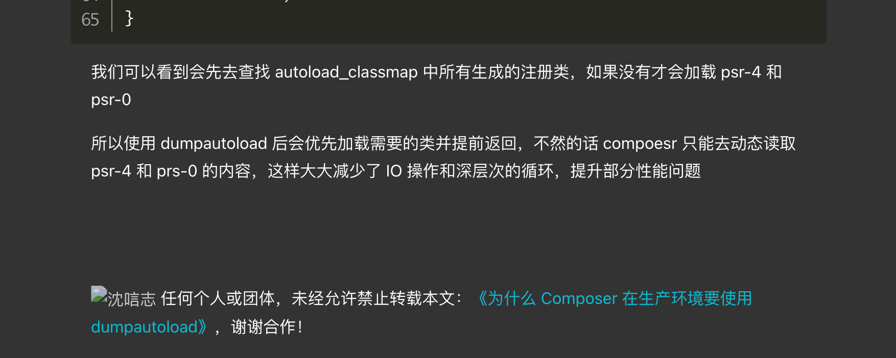

### 1.有些composer.json里面的扩展，本地环境没有安装时，可以使用命令

```shell
composer update --ignore-platform-reqs
composer install --ignore-platform-reqs
```

可以先忽略安装一些不存在的扩展。


### 2.指定composer对应的php版本

/Applications/MAMP/bin/php/php7.4.2/bin/php /usr/local/bin/composer update  --ignore-platform-reqs

```
/Applications/MAMP/bin/php/php7.4.2/bin/php /usr/local/bin/composer update 
```

```
/Applications/MAMP/bin/php/php7.4.21/bin/php /Applications/MAMP/bin/php/composer update --ignore-platform-reqs

/Applications/MAMP/bin/php/composer
```


### 3.安装composer


curl -sS https://getcomposer.org/installer | php

或

php -r "readfile('https://getcomposer.org/installer');" | php


mv composer.phar /usr/local/bin/composer


```cpp
composer config -g repo.packagist composer https://packagist.phpcomposer.com
// 阿里镜像地址
// composer config -g repo.packagist composer https://mirrors.aliyun.com/composer/
```


### 4. composer命令 


-o 命令

- **--optimize (-o):** 转换 PSR-0/4 autoloading 到 classmap 获得更快的载入速度。这特别适用于生产环境，但可能需要一些时间来运行，因此它目前不是默认设置。

- ```
  命令格式
  
  sh
  复制代码
  composer install -o
  composer update -o
  作用
  
  提高性能：在生产环境中使用优化的自动加载器可以显著提高性能，尤其是对于大型项目。
  生成类映射文件：-o 选项会生成一个类映射文件，将每个类名映射到文件路径，从而避免在每次加载类时遍历文件系统。
  更快的类加载：通过使用类映射文件，PHP可以更快速地找到并加载类文件。
  示例
  
  安装依赖时优化自动加载器
  
  sh
  复制代码
  composer install -o
  这会安装项目的依赖并优化自动加载器。
  
  更新依赖时优化自动加载器
  
  sh
  复制代码
  composer update -o
  这会更新项目的依赖并优化自动加载器。
  
  实际使用场景
  开发环境
  
  在开发环境中，通常不需要使用 -o 选项，因为在开发过程中可能会频繁地添加或修改类文件，每次都重新生成类映射文件会比较耗时。
  
  生产环境
  
  在生产环境中，推荐使用 -o 选项以优化性能。由于生产环境中的代码通常是稳定的，生成类映射文件一次即可，大大提高了类加载的效率。
  
  总结
  使用 -o 选项可以显著提高自动加载的性能，特别适合在生产环境中使用。在开发环境中，可以省略这个选项以节省时间和资源。
  ```

  

- **--no-dev:** 禁用 autoload-dev 规则。

```
这句话的意思是，当运行Composer安装PHP依赖包时，只安装那些在生产环境中需要的依赖包，而不安装开发环境（例如测试、调试）所需的依赖包。具体操作是通过在composer install命令中添加--no-dev选项来实现的。

详细解释
生产环境和开发环境的依赖区别

生产环境依赖：这些依赖包是应用程序在实际运行中所需要的。例如，应用程序的核心功能、数据库连接库、模板引擎等。
开发环境依赖：这些依赖包是开发和测试过程中所需要的。例如，单元测试框架、调试工具、代码生成器等。这些通常不需要在生产环境中运行。
composer install --no-dev

composer install：安装composer.json文件中指定的所有依赖包。
--no-dev：这个选项告诉Composer不安装require-dev部分中列出的开发依赖包，只安装require部分中的生产依赖包。
代码示例
假设你的composer.json文件如下：

json
复制代码
{
    "require": {
        "monolog/monolog": "^2.0"
    },
    "require-dev": {
        "phpunit/phpunit": "^9.0"
    }
}
require部分中的monolog/monolog是生产环境的依赖。
require-dev部分中的phpunit/phpunit是开发环境的依赖。
执行命令
sh
复制代码
composer install --no-dev
结果
Composer会安装monolog/monolog，因为它在require部分。
Composer不会安装phpunit/phpunit，因为它在require-dev部分，而我们使用了--no-dev选项。
作用
在生产环境中使用--no-dev选项可以：

减少安装的依赖包数量，降低磁盘使用和潜在的安全风险。
减少应用程序的体积，使其部署更快。
避免在生产环境中包含不必要的开发工具和测试代码。
通过这个方式，确保你的生产环境只包含必要的依赖，从而提升性能和安全性。
```


生产环境最好：composer install -o --no-dev 


### dump-autoload命令 优化composer加载速度

**composer dump-autoload**

- 重新生成自动加载文件，通常在添加新的类时使用。

- 下载或者更新包后，最好跑一下composer dump-autoload -o命令，会更新映射关系。

  写完之后需要运行一下命令行`composer dump-autoload` -o更新composer的命名空间与文件夹映射关系。





//


### 5composer install 和composer update区别


首先要搞清楚的一件事情是，**所有的依赖都定义在`composer.json`中**，手册中给出了一些[基本用法和例子](https://links.jianshu.com/go?to=http%3A%2F%2Fdocs.phpcomposer.com%2F01-basic-usage.html%23composer.json-Project-Setup)。你可能已经注意到，在指定版本号的时候，我们并不一定要指明一个精确的版本。

那么就有可能发生这么一个情况，对于同一份`composer.json`，我们在不同时刻拉取到的依赖文件可能不同（因为composer会在满足条件的情况下去拉取最新的那份依赖），从而导致一些异常情况。

`composer update`和`composer install`正是为了解决这个问题而出现的。

##### 1、当你执行`composer update`的时候，composer会去读取`composer.json`中指定的依赖，去分析他们，并且去拉取符合条件最新版本的依赖。

##### 然后他会把所拉取到的依赖放入vendor目录下，并且把所有拉取的依赖的精确版本号写入`composer.lock`文件中。

##### `2、composer install`所执行的事情非常类似，只在第一步的时候有差别。当你本地如果已经存在一份`composer.lock`时，

##### 它将会去读取你的`composer.lock`而非`composer.json`，并且以此为标准去下载依赖。

##### 当你本地没有`composer.lock`的时候，它所做的事情和`composer update`其实并没有区别。

这意味着，只要你本地有一份`composer.lock`，你就可以保证无论过去了多久，你都能拉到相同的依赖。而如果你把它纳入你的项目的版本控制中，

那么你就可以确保你项目中的每一个人、每一台电脑，


不管什么系统，都能拉取到一模一样的依赖，以减少潜在的依赖对部署的影响。当然，请记得，你应该使用的命令是`composer install`。

那什么时候该使用`composer update`呢？当你修改了你的依赖关系，不管是新增了依赖，还是修改了依赖的版本，又或者是删除了依赖，

这时候如果你执行`composer install`的时候，是不会有任何变更的，但你会得到一个警告信息

Warning: The lock file is not up to date with the latest changes in composer.json. You may be getting outdated dependencies. Run update to update them.

*有人可能会很好奇php是怎么知道我修改了依赖，或者`composer.lock`已经过期了。很简单，如果你打开`composer.lock`的话，*

*会发现其中有一个hash字段，这就是当时对应的那份依赖的哈希值。**如果值不一致自然而然就知道发生了变更了。*

这时候，你应该去通过`composer update`来更新下你的依赖了。

*如果你不希望影响别的已经安装的依赖，仅仅更新你修改的部分，那你可以通过指定白名单来确定要更新的范围，*


### 6.更新指定的依赖

*例如:`composer update monolog/monolog`仅会更新monolog/monlog这个依赖，**别的依赖哪怕有更新也会被忽略。*


### 8.下载包方式source 和 dist。

下载包方式
下载包的方式有两种： source 和 dist。

对于稳定版本 composer 将默认使用 dist 方式，而 source 表示版本控制源

区别
-prefer-dist 会从github 上下载.zip压缩包，并缓存到本地。下次再安装就会从本地加载，大大加速安装速度。但她没有保留 .git文件夹,没有版本信息。适合基于这个package进行开发。

–prefer-source 会从github 上clone 源代码，不会在本地缓存。但她保留了.git文件夹，从而可以实现版本控制。适合用于修改源代码。

source 可以理解成直接从git服务器(比如：github)获取源代码，这样如果git有提交，那么可以迅速获得最新代码，但是下载速度会慢。

dist 可以理解成composer有编译服务器，如果从编译服务器获取，那么就可以绕开git服务器了，这样下载速度会更快，但是提交的代码会有延迟。


