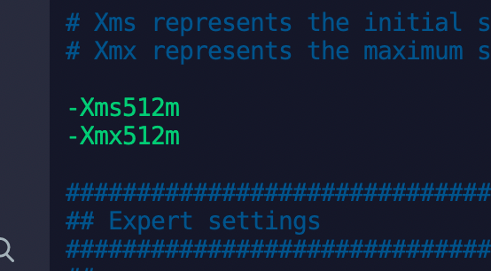

### 1.安装elasticSearch步骤


概况背景：是java写的，网上找个教程，安装好jdk后，输入java -version。如果能输出java的版本，就说明安装成功了,所以先安装jdk

1.1安装并解压jdk，安装包在笔记文件夹有，是linux版本的。

拿到安装包后解压

```
tar -zxvf jdk-8u144-linux-x64.tar.gz
```

1.2配置jdk环境变量

```

编辑全局变量
vim /etc/profile

CentOS6上面的是JAVAHOME，CentOS7是{JAVA_HOME}
在文本的最后一行粘贴如下：
#java environment
export JAVA_HOME=/usr/local/jdk-16.0.2
export CLASSPATH=.:${JAVA_HOME}/jre/lib/rt.jar:${JAVA_HOME}/lib/dt.jar:${JAVA_HOME}/lib/tools.jar
export PATH=$PATH:${JAVA_HOME}/bin

让刚刚设置的环境变量生效
source /etc/profile

//检查是否成功
java -version
```


2.安装es

解压其es安装包

tar -zxvf elasticsearch-7.10.0-linux-x86_64.tar.gz

然后

需要配置一下es的配置文件

Vim /usr/local/elasticsearch-7.10.0/configelasticsearch.yml

```
#节点名字
node.name: node-1 

#目录数据，注意要提前创建好，并给对应的权限
path.data: /path/to/data
path.logs: /path/to/logs

#访问的ip
network.host: 0.0.0.0
#服务占用的端口号
http.port: 9200

#主服务器的名字，单机配置
cluster.initial_master_nodes: ["node-1"]

#如果安装了x-pack安装包，报错时，可以设置此选项。
xpack.ml.enabled: false

#内存配置
bootstrap.memory_lock: false
bootstrap.system_call_filter: false

//使用head插件需要配置下面两个配置项目，可以提前配置上。
http.cors.enabled: true
http.cors.allow-origin: "*"
```


linux环境下的修改

vim /etc/sysctl.conf

增加下面的配置，max_map_count是文件包含限制一个进程可以拥有的VMA(虚拟内存区域)的数量

vm.max_map_count=262144

保存退出后执行：sysctl -p

查看修改结果：sysctl -a | grep vm.max_map_count


然后启动es，走到bin目录下

cd  /usr/local/elasticsearch-7.10.0/bin

执行./elasticsearch即可启动，加上-d是以守护进程启动，刚开始建议不要加-d,因为这样可以看到报错信息。


报错信息具体可以去/path/to/log里面的elasticsearch.log文件里面查看。


有时启动时，发现启动后返回一个killed。是因为es要求的内存，大于系统的内存。此时可以修改es的配置参数，

vim /usr/local/elasticsearch-7.10.0/config/jvm.options 

里面的xms参数,改为521m即可




具体还有什么报错，去看日志进行对应的解决即可。

es的服务器不能以root命令执行，需要创建一个账户比如esearch_user用户去，然后从root切换到esearch_user去执行，才能启动服务。


然后访问服务器的ip和设置的端口，比如47.97.185.94:9200,就会出现下面访问成功的页面


### 2.安装图形化页面

#### 2.1head插件

此插件需要安装node.js和npm。

去官网下载node包，在es的安装包里面有。


 

```
ln -s /app/software/nodejs/bin/npm /usr/local/bin/ 

ln -s /app/software/nodejs/bin/node /usr/local/bin/
```

执行node -v和npm -v都对应的版本后，说明安装成功，可以走下一步。


head插件网址：https://github.com/mobz/elasticsearch-head


npm install时可能会有错误，需要自己留意。根据错误提示解决对应的错误即可。


然后打开9100页面，然后手动输入9200的服务端口，点击链接，出现下面页面说明head插件安装成功。


#### 2.2kibana图形化页面


首先需要创建一个索引，指定索引的数据字段类型，如果

首先让我们在 Console 中输入 :返回结果 （是以REST ful 风格返回的 ）：

3、那么 name 这个字段用不用指定类型呢。毕竟我们关系型数据库 是需要指定类型的啊 !

字符串类型

text 、 keyword

数值类型

long, integer, short, byte, double, float, half_float, scaled_float

日期类型

date

te布尔值类型

boolean

二进制类型

binary

等等......

4、指定字段类型

// 命令解释

// PUT 创建命令 test1 索引 type1 类型 1 id

PUT /test1/type1/1

{

"name":"狂神说", // 属性

"age":16 // 属性

}

// 警告信息：不支持在文档索引请求中指定类型

// 而是使用无类型的端点(/{index}/_doc/{id}， /{index}/_doc，或

/{index}/_create/{id})。

{

"_index" : "test1", // 索引

"_type" : "type1", // 类型

"_id" : "1", // id

"_version" : 1, // 版本

"result" : "created", // 操作类型

"_shards" : { // 分片信息

"total" : 2,

"successful" : 1,

"failed" : 0

},

"_seq_no" : 0,

"_primary_term" : 1

}


PUT /test2

{

"mappings": {

"properties": {

"name":{

"type": "text"

},

"age":{

"type": "long"

},

"birthday":{

"type": "date"

}


13输出：

5、查看一下索引字段

输出：

6、我们看上列中 字段类型是我自己定义的 那么 我们不定义类型 会是什么情况呢？

}

}

}


{

"acknowledged" : true,

"shards_acknowledged" : true,

"index" : "test2"

}


GET test2 

1

{

"test2" : {

"aliases" : { },

"mappings" : {

"properties" : {

"age" : {

"type" : "long"

},

"birthday" : {

"type" : "date"

},

"name" : {

"type" : "text"

}

}

},

"settings" : {

"index" : {

"creation_date" : "1585384302712",

"number_of_shards" : "1",

"number_of_replicas" : "1",

"uuid" : "71TUZ84wRTW5P8lKeN4I4Q",

"version" : {

"created" : "7060199"

},

"provided_name" : "test2"

}

}

}

}

PUT /test3/_doc/1

{

"name":"狂神说",

"age":13,

"birth":"1997-01-05"

}

\# 输出


7查看一下test3索引：

返回结果：

{

"_index" : "test3",

"_type" : "_doc",

"_id" : "1",

"_version" : 1,

"result" : "created",

"_shards" : {

"total" : 2,

"successful" : 1,

"failed" : 0

},

"_seq_no" : 0,

"_primary_term" : 1

}


GET test3 

1

{

"test3" : {

"aliases" : { },

"mappings" : {

"properties" : {

"age" : {

"type" : "long"

},

"birth" : {

"type" : "date"

},

"name" : {

"type" : "text",

"fields" : {

"keyword" : {

"type" : "keyword",

"ignore_above" : 256

}

}

}

}

},

"settings" : {

"index" : {

"creation_date" : "1585384497051",

"number_of_shards" : "1",

"number_of_replicas" : "1",

"uuid" : "xESBKF1XTpCAZOgMqBNUbA",

"version" : {

"created" : "7060199"

},

"provided_name" : "test3"

}

}

}

}


36我们看上列没有给字段指定类型那么es就会默认给我配置字段类型！

对比关系型数据库 ：

PUT test1/type1/1 ： 索引test1相当于关系型数据库的库，类型type1就相当于表 ，1 代表数据中的主

键 id

这里需要补充的是 ，在elastisearch5版本前，一个索引下可以创建多个类型，但是在elastisearch5后，

一个索引只能对应一个类型，而id相当于关系型数据库的主键id若果不指定就会默认生成一个20位的

uuid，属性相当关系型数据库的column(列)。

而结果中的 result 则是操作类型，现在是 created ，表示第一次创建。如果再次点击执行该命令那么

result 则会是 updated ，我们细心则会发现 _version 开始是1，现在你每点击一次就会增加一次。表示

第几次更改。

7、我们在来学一条命令 (elasticsearch 中的索引的情况) ：

返回结果：查看我们所有索引的状态健康情况 分片，数据储存大小等等。

8、那么怎么删除一条索引呢(库)呢?

返回：

**增删改查命令**

创建数据PUT

第一条数据：

第二条数据 :

GET _cat/indices?v 

1

DELETE /test1 

1

{

"acknowledged" : true # 表示删除成功！

}

即可创建索引成功


搜索dev toole，通过命令来查询索引文件


### 3.安装es对应的php操作类

官网封装了一个包：<https://github.com/elastic/elasticsearch-php>

使用下面命令安装即可。

composer require elasticsearch/elasticsearch


如果遇到Unable to create temporary file这样的错误，参考下图解决方案试试。


### 4.es集群部署

首先强调一下，集群应该在不同的机器上部署，但服务器资源有限，目前只在一台服务器上，部署多个es实例，来组成集群。

以elasticsearch-7.10.0为主节点，以es2和es3为从节点。组成一个集群。

把es实例1复制出两份，放到es2和es3


然后编辑es2的elasticsearch.yml文件，

```
#集群名称
cluster.name: es_node
#当前节点名称
node.name: es_node-2
#数据和日志文件路径
path.data: /path/to/data2
path.logs: /path/to/logs2
#服务器的host
network.host: 0.0.0.0
#es2启动的端口号
http.port: 9201

#有xpack报错时，设置为false
xpack.ml.enabled: false

bootstrap.memory_lock: false
bootstrap.system_call_filter: false

#跨域的设置
http.cors.enabled: true
http.cors.allow-origin: "*"

#释放为master主节点
node.master: false

#自动发现主节点的服务，此处的ip应填写主节点的ip，因为是在本地集群，就填写了本地ip
discovery.zen.ping.unicast.hosts: ["127.0.0.1"]
```

然后启动es2服务即可。

### 5封装一个工具类

```php
<?php


namespace App\Lib\ElasticSearch;

use Elasticsearch\ClientBuilder;

class MyElasticSearch
{
    //ES客户端链接
    private $client;

    private $host = '127.0.0.1';

    private $port = '9200';

    /**
     * 构造函数
     * MyElasticSearch constructor.
     */
    public function __construct()
    {
        $params = [
            $this->host.':'.$this->port,
        ];
        $this->client = ClientBuilder::create()->setHosts($params)->build();
    }

    /**
     * 判断索引是否存在
     * @param string $index_name
     * @return bool|mixed|string
     */
    public function existsIndex($index_name = 'test_ik')
    {
        $params = [
            'index' => $index_name
        ];

        try {
            return $this->client->indices()->exists($params);
        } catch (\Elasticsearch\Common\Exceptions\BadRequest400Exception $e) {
            $msg = $e->getMessage();
            $msg = json_decode($msg,true);
            return $msg;
        }
    }

    /**
     * 创建索引
     * @param string $index_name
     * @return array|mixed|string
     */
    public function createIndex($index_name = 'test_ik') { // 只能创建一次
        $params = [
            'index' => $index_name,
            'body' => [
                'settings' => [
                    'number_of_shards' => 5,
                    'number_of_replicas' => 0
                ]
            ]
        ];

        try {
            return $this->client->indices()->create($params);
        } catch (\Elasticsearch\Common\Exceptions\BadRequest400Exception $e) {
            $msg = $e->getMessage();
            $msg = json_decode($msg,true);
            return $msg;
        }
    }

    /**
     * 删除索引
     * @param string $index_name
     * @return array
     */
    public function deleteIndex($index_name = 'test_ik') {
        $params = ['index' => $index_name];
        $response = $this->client->indices()->delete($params);
        return $response;
    }

    /**
     * 添加文档
     * @param $id
     * @param $doc ['id'=>100, 'title'=>'phone']
     * @param string $index_name
     * @param string $type_name
     * @return array
     */
    public function addDoc($id,$doc,$index_name = 'test_ik',$type_name = 'goods') {
        $params = [
            'index' => $index_name,
            'type' => $type_name,
            'id' => $id,
            'body' => $doc
        ];

        $response = $this->client->index($params);
        return $response;
    }

    /**
     * 判断文档存在
     * @param int $id
     * @param string $index_name
     * @param string $type_name
     * @return array|bool
     */
    public function existsDoc($id = 1,$index_name = 'test_ik',$type_name = 'goods') {
        $params = [
            'index' => $index_name,
            'type' => $type_name,
            'id' => $id
        ];

        $response = $this->client->exists($params);
        return $response;
    }

    /**
     * 获取文档
     * @param int $id
     * @param string $index_name
     * @param string $type_name
     * @return array
     */
    public function getDoc($id = 1,$index_name = 'test_ik',$type_name = 'goods') {
        $params = [
            'index' => $index_name,
            'type' => $type_name,
            'id' => $id
        ];

        $response = $this->client->get($params);
        return $response;
    }

    /**
     * 更新文档
     * @param int $id
     * @param string $index_name
     * @param string $type_name
     * @param array $body ['doc' => ['title' => '苹果手机iPhoneX']]
     * @return array
     */
    public function updateDoc($id = 1,$index_name = 'test_ik',$type_name = 'goods', $body=[]) {
        // 可以灵活添加新字段,最好不要乱添加
        $params = [
            'index' => $index_name,
            'type' => $type_name,
            'id' => $id,
            'body' => $body
        ];

        $response = $this->client->update($params);
        return $response;
    }

    /**
     * 删除文档
     * @param int $id
     * @param string $index_name
     * @param string $type_name
     * @return array
     */
    public function deleteDoc($id = 1,$index_name = 'test_ik',$type_name = 'goods') {
        $params = [
            'index' => $index_name,
            'type' => $type_name,
            'id' => $id
        ];

        $response = $this->client->delete($params);
        return $response;
    }

    /**
     * 搜索文档 (分页，排序，权重，过滤)
     * @param string $index_name
     * @param string $type_name
     * @param array $body
     * $body = [
    'query' => [
    'bool' => [
    'should' => [
    [
    'match' => [
    'cate_name' => [
    'query' => $keywords,
    'boost' => 4, // 权重大
    ]
    ]
    ],
    [
    'match' => [
    'goods_name' => [
    'query' => $keywords,
    'boost' => 3,
    ]
    ]
    ],
    [
    'match' => [
    'goods_introduce' => [
    'query' => $keywords,
    'boost' => 2,
    ]
    ]
    ]
    ],
    ],
    ],
    'sort' => ['id'=>['order'=>'desc']],
    'from' => $from,
    'size' => $size
    ];
     * @return array
     */
    public function searchDoc($index_name = "test_ik",$type_name = "goods",$body=[]) {
        $params = [
            'index' => $index_name,
            'type' => $type_name,
            'body' => $body
        ];

        $results = $this->client->search($params);
        return $results;
    }
  
  
   /**
     * Notes:
     * User: 闻铃
     * DateTime: 2021/7/25 上午8:53
     * @param string $index_name 索引名称
     * @param string $type_name  类型名称
     * @param string $searchType 查询类型名称
     * @param string $field      检索字段名称
     * @param string $keywords   检索的关键字
     * @param int $page          页码
     * @param int $size          条数
     * @param string $sort       排序字段
     * @return mixed
     */
    public function searchField(string $index_name, string $type_name, string $searchType = 'match', string $field,$keywords, int $page = 1, int $size = 15, string $sort = 'id') {
        $params = [
            'index' => $index_name,
            'type' => $type_name,
            'body' => [
                'query' => [
                    $searchType => [
                        $field => $keywords
                    ]
                ],
                'sort' => [$sort => ['order' => 'desc']],//order不变，通过sort字段倒叙，默认_id到顺序
                'from' => ($page - 1) * $size,
                'size' => $size,
            ]
        ];
        return $this->client->search($params);
    }

}
```


### 6.head插件的基本使用

#### 6.1建立索引，相当于datebase


0~4是分片数，因为video—test设置的分片数是5，其中加粗的是主分片，没有加粗的是副本。


#### 6.2然后新建类型，相当于table

其中在es7中，新增类型时不支持设置类型名，所以改这样子新增。默认的类型名是：_doc


在 Elasticsearch 中，`text` 字段的分词器（analyzer）是非常重要的，它决定了文本是如何被分解为词项（tokens）并存储在倒排索引中的。除了 `ik_max_word` 分词器外，Elasticsearch 还提供了多种不同的分词器，你可以根据具体的需求选择合适的分词器。下面是一些常见的分词器和它们的适用场景。

### 1. **`ik_smart` 分词器**

`ik_smart` 是 IK 分词器的另一种配置，它与 `ik_max_word` 不同，`ik_smart` 更倾向于使用 **智能切分**，即分词时会更加注重关键词的精准切分，较少产生一些无意义的词项。

- 特点

  ：

  - 适用于对分词结果要求较少的情况，通常适用于短文本和需要精准匹配的场景。
  - `ik_smart` 会生成较少的词项，相比 `ik_max_word` 分词器，`ik_smart` 的粒度较粗，切分的结果更少。

- **适用场景**：对于长文本的检索性能较好，适用于搜索时需要匹配的关键词较为精确的场景（例如人名、地点、产品名称等）。

**示例**：

```
php


复制代码
'name' => ['type' => 'text', 'analyzer' => 'ik_smart']
```

### 2. **`standard` 分词器**

`standard` 是 Elasticsearch 默认的分词器，它基于 Unicode 字符分隔符来将文本拆分成词项。它将文本按空格、标点符号等分隔符分开，适用于英语等以空格为主要分隔符的语言。

- 特点

  ：

  - 默认分词器，适用于多种语言，但对于中文、日文等没有明确分隔符的语言，效果较差。
  - 会按照标准的分词规则（包括空格、标点符号等）进行分词。

- **适用场景**：适用于英语和其他语言的文本分析，适合基于单词的分词。

**示例**：

```
php


复制代码
'name' => ['type' => 'text', 'analyzer' => 'standard']
```

### 3. **`whitespace` 分词器**

`whitespace` 分词器仅通过空格字符分割文本，适合处理没有标点符号或其他分隔符的文本。

- 特点

  ：

  - 仅以空格为分隔符进行分词。
  - 比 `standard` 分词器简单，不会处理其他标点符号。

- **适用场景**：当你希望完全按照空格来分隔文本时，适合那些单纯以空格分割单词的文本。

**示例**：

```
php


复制代码
'name' => ['type' => 'text', 'analyzer' => 'whitespace']
```

### 4. **`keyword` 分词器**

`keyword` 分词器不会对文本进行分词处理，直接将文本作为一个整体存储。这种分词器适用于不需要分词的字段，如 ID、标签、状态码等。

- 特点

  ：

  - 不会分词，直接使用原始字符串进行存储。
  - 适用于需要精确匹配的字段，如用户 ID、电子邮件、URL 等。

- **适用场景**：适合存储不需要分析的字段，如精确匹配的值。

**示例**：

```
php


复制代码
'name' => ['type' => 'keyword']
```

### 5. **`pattern` 分词器**

`pattern` 分词器基于正则表达式来分割文本。你可以自定义正则表达式来决定分词规则。

- 特点

  ：

  - 可以根据用户定义的正则表达式来分词。
  - 非常灵活，可以根据特定的规则对文本进行分割。

- **适用场景**：当文本需要根据特定规则（例如某些字符、数字、标点等）进行分词时，使用 `pattern` 分词器可以满足复杂的需求。

**示例**：

```
php


复制代码
'name' => [
    'type' => 'text',
    'analyzer' => 'pattern',
    'pattern' => '\\s|,|;|:'
]
```

### 6. **`ngram` 和 `edge_ngram` 分词器**

`ngram` 和 `edge_ngram` 分词器是针对 **前缀匹配** 和 **模糊搜索** 场景的分词器。

- **ngram 分词器**：将文本拆分为所有可能的连续字符组合，适合做模糊搜索、拼音搜索等。
- **edge_ngram 分词器**：与 `ngram` 相似，但它只会生成文本开头的子串（前缀），适用于前缀匹配场景。

**ngram 分词器的特点**：

- 会将文本拆分为任意长度的子串，适合做拼音搜索、模糊匹配。
- 查询时可能会增加查询的匹配宽度，导致性能问题。

**edge_ngram 分词器的特点**：

- 仅对文本前缀进行分词，非常适合进行前缀匹配搜索。
- 它会从文本的开头生成一个或多个 n-grams，适用于自动补全和拼音搜索。

**适用场景**：适用于需要进行前缀匹配、自动补全、拼音搜索等场景。

**示例**：

```
php


复制代码
'name' => [
  'type' => 'text',
  'analyzer' => 'edge_ngram_analyzer'
]
```

### 7. **`custom` 分词器**

除了内置的分词器外，Elasticsearch 还支持自定义分词器。你可以根据需要选择不同的分词器和过滤器来构建适合自己需求的分词策略。

**自定义分词器的特点**：

- 你可以通过设置不同的 **tokenizer** 和 **filter** 来创建自己独特的分词器。
- 常用的自定义过滤器包括：`lowercase`、`stop`、`synonym`、`edge_ngram` 等。

**适用场景**：适合处理具有特定需求的文本分析，如同义词替换、分词过滤、大小写转换等。

**示例**：

```
json


复制代码
"settings": {
  "analysis": {
    "tokenizer": {
      "custom_tokenizer": {
        "type": "standard"
      }
    },
    "filter": {
      "custom_filter": {
        "type": "lowercase"
      }
    },
    "analyzer": {
      "custom_analyzer": {
        "type": "custom",
        "tokenizer": "custom_tokenizer",
        "filter": ["custom_filter"]
      }
    }
  }
}
```

### 总结

除了 `ik_max_word` 和 `ik_smart` 外，Elasticsearch 还支持多种分词器，包括：

- `standard`：标准分词器，适用于大部分英文文本。
- `whitespace`：仅根据空格分词，适用于简单的分词需求。适合 tag_ids 多标签 ids 可以是空格分词
- `keyword`：不分词，适用于需要精确匹配的字段。
- `pattern`：基于正则表达式进行分词，适用于有特定规则的文本。
- `ngram` 和 `edge_ngram`：适用于前缀匹配、模糊搜索、自动补全等场景。
- `custom`：自定义分词器，允许你根据需要定制分析过程。

你可以根据自己的需求选择合适的分词器，并结合不同的分词器、过滤器和自定义分析器来实现更加精细的文本分析。


standard 分词器 默认


6.3查询文档

进行分词查询，可以进行中文分词查询。


其他的查询还有：最大，最小值查询，折线图等等。


### 7搜索的常用语法


####  **IK 分词器的分词粒度**

**IK 分词器**是 ElasticSearch 中常用的中文分词插件，支持两种模式：

- **智能分词 (smart mode)**：尽可能以词语为单位分词，生成较大的分词粒度。例如："苹果手机" 分为 ["苹果", "手机"]。
- **细粒度分词 (max_word mode)**：尽可能多地拆分，生成更细的分词粒度。例如："苹果手机" 分为 ["苹", "果", "苹果", "手", "机", "手机"]。

为了支持单个字的搜索，需要使用 **细粒度分词**。


一般使用smart mode即可 ，但如果有些需要搜索单个字的，可以 使用细粒度分词，设置为ik_max_word即可

```
protected $_es_field = [
        'name' => ['type' => 'text', "analyzer" => "ik_max_word"],
        //'name' => ['type' => 'text'],
        'id_card' => ['type' => 'text'],
        'phone'   => ['type' => 'text'],
        'level'                      => ['type' => 'byte'],
        'age'                        => ['type' => 'integer'],
        'guide_type'                 => ['type' => 'byte'],
        'first_become_time'          => ['type' => 'integer'],
        'tag_ids'                    => ['type' => 'text', "analyzer" => "whitespace"],
        'community'                  => ['type' => 'long'],
        'instructor_id'              => ['type' => 'integer'],
        'member_id'                  => ['type' => 'integer'],
    ];
```

如下name 搜索一个 文字，就可以搜索出张文林和李文军。

```
url:https://14.17.80.135:9200/zw_social_sports_instructor/_search GET

参数:'{"from":0,"size":10,"query":{"bool":{"filter":[{"term":{"province":"36"}},{"bool":{"should":[{"match":{"name":"文"}}]}},{"term":{"is_del":2}},{"term":{"company_id":"718"}}]}},"sort":{"instructor_id":"desc"}}'
[info] 2024-12-11 11:09:17 <papa-f84bf2ce8464b86eb281e4b18d0a5b5d> [message] 耗时:0.1041

返回结果(200):{
"took":2,"timed_out":false,"_shards":{"total":1,"successful":1,"skipped":0,"failed":0},"hits":{"total":{"value":2,"relation":"eq"},"max_score":null,

"hits":[{"_index":"zw_social_sports_instructor","_id":"196607","_score":null,"_source":{"name":"李文军","id_card":"532401197408010313","phone":"16612345678","level":0,"age":50,"guide_type":1,"education_level":9,"nation":1,"gender":1,"personnel_form":3,"now_level_grant_time":1701100800,"first_become_time":1699632000,"tag_ids":"2436","company_id":718,"organ_unit_id":2017,"organ_unit_company_area_id":"36","operator":3118,"is_del":2,"province":36,"city":3604,"county":360481,"street":360481001,"community":360481001001,"instructor_id":196607,"member_id":0},"sort":[196607]},

{"_index":"zw_social_sports_instructor","_id":"196605","_score":null,"_source":{"name":"张文林","id_card":"44132319971015531X","phone":"15976123893","level":3,"age":27,"guide_type":2,"education_level":1,"nation":1,"gender":1,"personnel_form":1,"now_level_grant_time":0,"first_become_time":1733068800,"tag_ids":"2476","company_id":718,"organ_unit_id":0,"organ_unit_company_area_id":"36","operator":900004209,"is_del":2,"province":36,"city":3604,"county":360481,"street":360481001,"community":360481001001,"instructor_id":196605,"member_id":31981},"sort":[196605]}]}

}


```


1查看分词后的结果

#### 1.2 查看文档的分析结果

你可以使用 `_analyze` API 来查看一个特定的文本字段（如 `name`）是如何被分词器分析的。这有助于确认分词器是否正确地将 `"李四玲"` 分解为多个词项。

例如，你可以用以下请求来分析 `name` 字段的内容：

```
bash


复制代码
GET /your_index_name/_analyze
{
  "text": "李四玲",
  "field": "name"
}
```

如果你使用的是 `ik_max_word` 分词器，返回的结果应该包含多个词项，如：

```
json


复制代码
{
  "tokens": [
    { "token": "李", "start_offset": 0, "end_offset": 1, "type": "word", "position": 1 },
    { "token": "四", "start_offset": 1, "end_offset": 2, "type": "word", "position": 2 },
    { "token": "玲", "start_offset": 2, "end_offset": 3, "type": "word", "position": 3 },
    { "token": "李四", "start_offset": 0, "end_offset": 2, "type": "word", "position": 1 },
    { "token": "四玲", "start_offset": 1, "end_offset": 3, "type": "word", "position": 2 },
    { "token": "李四玲", "start_offset": 0, "end_offset": 3, "type": "word", "position": 1 }
  ]
}
```

如果 `ik_max_word` 分词器工作正常，你应该看到 `"李"` 被作为一个独立的词项列出，此外还会有 `"李四"`, `"四玲"`, `"李四玲"` 等词项。如果你没有看到 `"李"` 作为独立的词项，那么可能是分词器配置的问题，或者你查询的字段和实际索引的字段不一致。


参考url：https://www.cnblogs.com/yjf512/p/4897294.html

1.使用match查询，分词匹配，有分词，在es7版本，即使是中文，也可以把关键字的颗粒度拆成一个字。比如刘德华，可以搜索出老华婆。命中了华这个字。

```
$params = [
            'index' => 'video_index',//索引名称
            'type' => $type_name,//类型名称
            'body' => [
                'query' => [  //query表示查询
                    'match' => [     //全文检索
                        'name' => '刘德华'   //name检索的字段，刘德华时检索的关键字
                    ]
                ],
                'sort' => [$sort => ['order' => 'desc']],//排序
                'from' => ($page - 1) * $size,//分页
                'size' => $size,//分页size
            ]
        ];
```


2.精准查询

使用match_phrase关键字即可，不会分词，只会找含有关键字的数据。注意是含有，不是等于。

```
$params = [
            'index' => 'video_index',//索引名称
            'type' => $type_name,//类型名称
            'body' => [
                'query' => [  //query表示查询
                    'match_phrase' => [     //全文检索
                        'name' => '刘德华'   //name检索的字段，刘德华时检索的关键字
                    ]
                ],
                'sort' => [$sort => ['order' => 'desc']],//排序
                'from' => ($page - 1) * $size,//分页
                'size' => $size,//分页size
            ]
        ];
```


参考链接：https://blog.csdn.net/u013090676/article/details/79513417

term完全匹配。


1.匹配


7分词器。对中文比较友好。如果需要搜索时要求比较高的话，比如颗粒度比较小的话，可以用它，ik分词器。有高亮的提示返回。


#### 扩展 使用和mysql的like查询一模一样的模糊查询方式

1. name 使用keyword 类型去存储 和 然后搜索时使用 wildcard 

2. ```
   protected $_es_field = [
   //        'name' => ['type' => 'text', "analyzer" => "ik_max_word"],
           'name' => ['type' => 'keyword'],
           //'name' => ['type' => 'text'],
   
           'id_card' => ['type' => 'text'],
           'phone'   => ['type' => 'text'],
   
         
       ];
   ```

3. ```
    if (isset($search["keyword"]) && !empty($search["keyword"])) {
   
               $query['bool']['filter'][] = [
                   'bool' => ['should' => [
                       //match
   //                    array('match_phrase' => ['name' =>  $search["keyword"]])
   //                    array('match' => ['name' =>  $search["keyword"]]), //不能使用，如果关键词是多个，会出现不按顺序的情况
   
   
                       array('wildcard' => ['name' =>  '*' .$search["keyword"]. '*']),//
                       array('wildcard' => ['id_card' => '*' . $search["keyword"] . '*']),
                       array('wildcard' => ['phone' => '*' . $search["keyword"] . '*'])
                   ]]
               ];
   
           }
   ```

   

#### 数据量比较大时，不推荐


数据量比较大时，推荐ik_smart 或者 ik_max_word


## 8.批量更新

### 8.1同一个索引中的多条文档数据

是的，你可以使用 Elasticsearch 的 Bulk API 来一次性更新同一个索引中的多个文档。在批量更新请求中，你可以包含多个 `update` 操作，每个操作对应于要更新的一个文档。

以下是一个示例，演示如何使用 Bulk API 进行一次性的批量更新：

```
jsonCopy code
POST /your_index/_bulk
{"update":{"_id":"1"}}
{"doc":{"field1":"new_value1"}}
{"update":{"_id":"2"}}
{"doc":{"field2":"new_value2"}}
{"update":{"_id":"3"}}
{"doc":{"field3":"new_value3"}}
```

在上述示例中，每个 `update` 操作都指定了一个文档的 `_id`，并包含了要更新的字段及其新值。你可以根据实际情况调整文档的标识符和要更新的字段。

如果你使用 Elasticsearch PHP 客户端库，可以使用类似以下的 PHP 代码来执行批量更新：

```php
phpCopy code
require 'vendor/autoload.php';

use Elasticsearch\ClientBuilder;

// 你的Elasticsearch服务器地址
$hosts = [
    'http://localhost:9200',
];

// 创建Elasticsearch客户端
$client = ClientBuilder::create()->setHosts($hosts)->build();

// 构建批量更新请求体
$bulkParams = [
    ['update' => ['_index' => 'your_index', '_id' => '1']],
    ['doc' => ['field1' => 'new_value1']],
    ['update' => ['_index' => 'your_index', '_id' => '2']],
    ['doc' => ['field2' => 'new_value2']],
    ['update' => ['_index' => 'your_index', '_id' => '3']],
    ['doc' => ['field3' => 'new_value3']],
];

// 执行批量更新
$response = $client->bulk(['body' => $bulkParams]);

// 输出响应
print_r($response);
```

这样，你可以一次性更新同一个索引中的多个文档，从而提高性能，尤其是在需要批量处理文档更新时。


### 8.2 更新多个索引的多条数据

是的，Elasticsearch 提供了批量更新（Bulk API）的功能，允许你一次性提交多个文档的更新请求。这可以显著提高性能，特别是当你需要更新或索引大量文档时。

以下是一些关于如何使用 Elasticsearch 批量更新的示例：

### 1. 使用 Bulk API

使用 Bulk API 需要构建一个包含多个操作的 JSON 请求体。每个操作包含一个 `index` 或 `update` 操作以及相应的文档数据。

```
jsonCopy code
{ "index" : { "_index" : "your_index", "_id" : "1" } }
{ "field1" : "value1" }
{ "update" : { "_index" : "your_index", "_id" : "2" } }
{ "doc" : { "field2" : "value2" } }
{ "delete" : { "_index" : "your_index", "_id" : "3" } }
```

### 2. 使用 Elasticsearch PHP 客户端库

以下是使用 Elasticsearch PHP 客户端库执行批量更新的简单示例：

```
phpCopy code
require 'vendor/autoload.php';

use Elasticsearch\ClientBuilder;

// 你的Elasticsearch服务器地址
$hosts = [
    'http://localhost:9200',
];

// 创建Elasticsearch客户端
$client = ClientBuilder::create()->setHosts($hosts)->build();

// 构建批量更新请求体
$bulkParams = [
    ['index' => ['_index' => 'your_index', '_id' => '1']],
    ['field1' => 'value1'],
    ['update' => ['_index' => 'your_index', '_id' => '2']],
    ['doc' => ['field2' => 'value2']],
    ['delete' => ['_index' => 'your_index', '_id' => '3']],
];

// 执行批量更新
$response = $client->bulk(['body' => $bulkParams]);

// 输出响应
print_r($response);
```

请注意，以上示例中的每个文档操作都包含一个标识符（`_index` 和 `_id`），用于指定操作的目标索引和文档。你需要根据实际情况替换为你的索引名称和文档标识符。

批量更新是一个强大的工具，但在使用时需要注意以下几点：

- **批量大小：** 不宜设置过大的批量大小，因为太大的批量可能导致请求体过大，影响性能。
- **错误处理：** 在批量操作中，一个操作的失败不会影响其他操作，因此你需要检查响应以查看每个操作的执行结果。
- **注意并发：** 在高并发环境中，可能需要考虑并发冲突和版本控制等问题。

总体而言，批量更新是一个非常有用的功能，特别是在需要处理大量文档的情况下。


```
{"took":1,"timed_out":false,"_shards":{"total":1,"successful":1,"skipped":0,"failed":0},"hits":{"total":{"value":5,"relation":"eq"},"max_score":null,"hits":[{"_index":"zw_event_plan","_id":"2037","_score":null,"_source":{"plan_id":2037},"sort":[2037]},{"_index":"zw_event_plan","_id":"93","_score":null,"_source":{"plan_id":93},"sort":[93]},{"_index":"zw_event_plan","_id":"92","_score":null,"_source":{"plan_id":92},"sort":[92]},{"_index":"zw_event_plan","_id":"89","_score":null,"_source":{"plan_id":89},"sort":[89]},{"_index":"zw_event_plan","_id":"88","_score":null,"_source":{"plan_id":88},"sort":[88]}]}}


```

