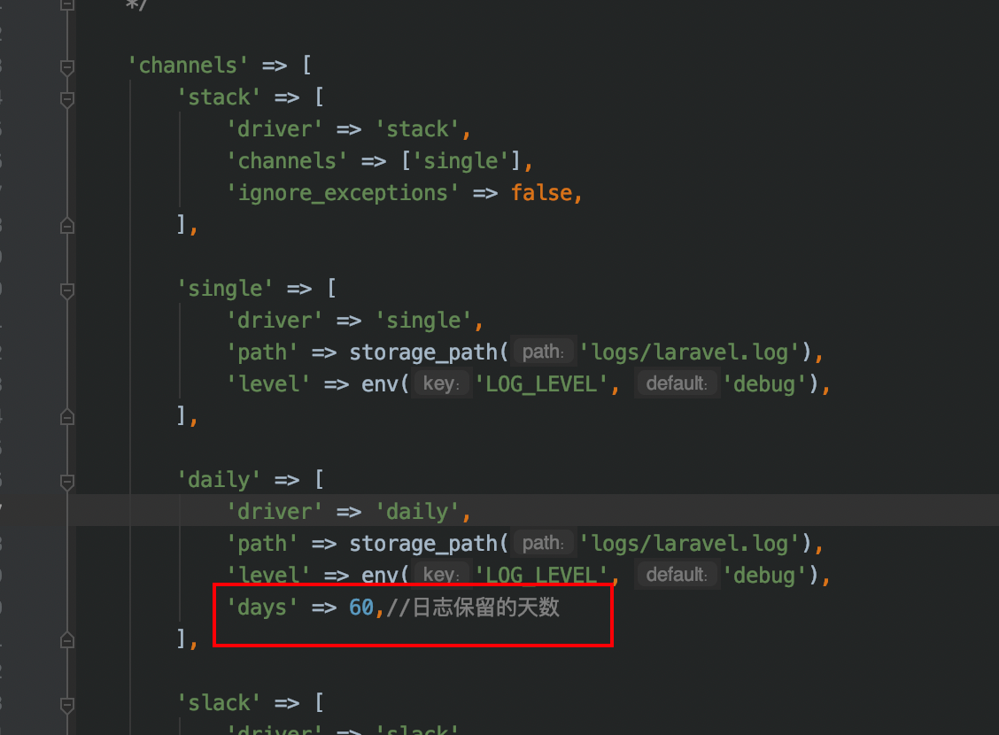
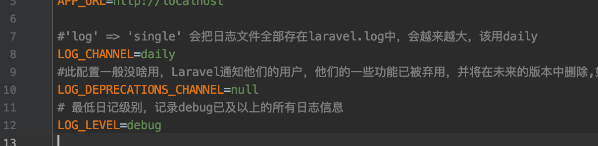
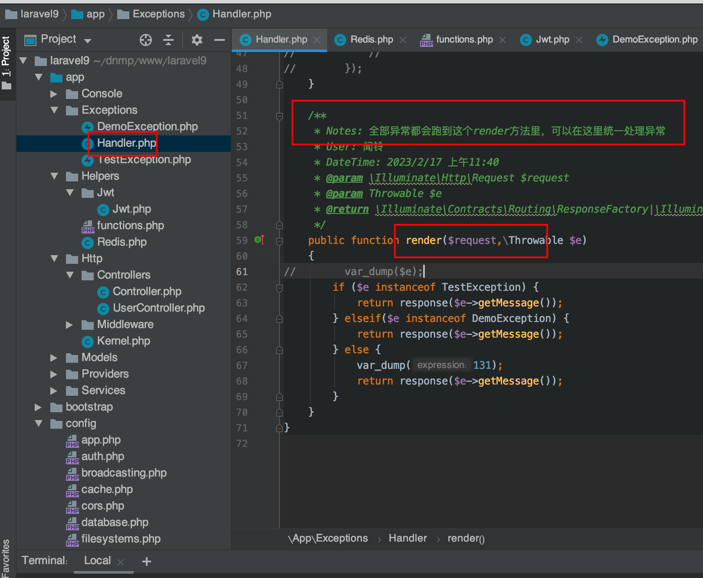

laravel框架知识点

### 1.下载指定版本的laravel框架

```
composer create-project laravel/laravel dc 5.5.28 --prefer-dist
```

### 2直接使用类的方法

laravel中的需要用到的类,可以在app.php中的aliases数组中定义一个.然后可以直接用某个类,不需要use.比如

路由Route

### 3.七牛云上传文件步骤


步骤：

​     a. 申请七牛对象存储与依赖配置（减轻服务器自身的压力，加快用户访问速度）

​     b. 展示相关界面（添加和列表）

​     c. 异步上传实现（保存到七牛云）

​     d. 确认表单能否提交

​     e. 数据入表

 php think make:controller admin/index --plain

### **a.** **申请七牛对象存储与依赖配置**

Ⅰ、申请七牛云的对象存储（官网）：https://www.qiniu.com/


创建成功之后会得到以下信息（后期会使用到）：

融合CDN测试域名：ptl2hcfdl.bkt.clouddn.com【30天内有效】

Bucket名称：wx_diancan

从[密钥管理](https://portal.qiniu.com/user/key)界面复制AK&SK：

​    AK：bBOpNSfGr5G1b0IFDvF68L7Za35-PAVUliL4Zrkn

​    SK：AOlw43W9NjgzmNNAEoZrO1sMU5w6CGwn-7pyOekM

 

Ⅱ、配置七牛依赖（其实就是laravel框架中的代码库）

项目主页：https://github.com/zgldh/qiniu-laravel-storage

 

参考步骤：


 

安装SDK：composer require zgldh/qiniu-laravel-storage


 

config/app.php 里面的 providers 数组， 加上一行：


 

config/filesystems.php 里面的 disks数组加上：


 


### **c.** **异步****上传实现（保存到七牛云）**

异步上传需要借助第三方插件：webuploader

Ⅰ、将解压出来的插件目录存放到项目目录中去，确保后期页面可以访问引入


 

Ⅱ、引入插件相关的资源到对应的模板中


文件上传路由：


 

JavaScript异步部分，可以参考：https://fex-team.github.io/webuploader/js/getting-started.js

地址中的图片上传demo。


 

编写上传处理方法webuploader


 

修改前端回调，给予用户提示：


 

小bug解决：防止用户选择图片越选越多


 


### 4.依赖注入原理（反射机制和递归）

```php
<?php

/**
 * @author zhuxinlei
 * @date 2020-06-12
 * @desc 我是类A的注释
 */
class A
{
    //我是构造函数的注释
    public function __construct(B $b)
    {
        $this->b = $b;
    }
    //我是getB的注释
    public function getB()
    {
        $this->b->bMethod();
    }
}
class B
{
    public function __construct(C $c,D $d)
    {
        $this->c = $c;
        $this->d = $d;
    }
    public  function bMethod()
    {
        echo "我是B中的方法bMethod()";
    }
}

class C{
    public function __construct(){

    }
    public function cMethod(){
        echo "我是C中的方法cMethod()";
    }

}

class D{
    public function __construct(){

    }
    public function dMethod(){
        echo "我是D中的方法dMethod()";
    }
}

class Ioc
{
    protected $instances = [];
    public function __construct()
    {
    }
    public function getInstance($abstract){
        //获取类的反射信息,也就是类的所有信息
        $reflector = new ReflectionClass($abstract);
        //  echo $reflector->getDocComment();  获取类的注释信息

        //获取反射类的构造函数信息
        $constructor = $reflector->getConstructor();
        //获取反射类的构造函数的参数
        $dependencies = $constructor->getParameters();

        if(!$dependencies){
            return new $abstract();
        }
        foreach ($dependencies as $dependency) {

            if(!is_null($dependency->getClass())){
                $p[] = $this->make($dependency->getClass()->name);
                //这里$p[0]是C的实例化对象,$p[1]是D的实例化对象
            }
        }
        //创建一个类的新实例,给出的参数将传递到类的构造函数
        return $reflector->newInstanceArgs($p);
    }


    public function make($abstract)
    {
        return $this->getInstance($abstract);
    }
}

$ioc = new Ioc();
$a = $ioc->make('A');
$a->getB();

```


## laravel9知识


### 1.下载laravel9框架及其初始化


#### 1.1安装

composer create-project laravel/laravel laravel9 9.5.2 --prefer-dist


--prefer-dist代表下载zip包到本地，不带laravel的git文件夹


#### 1.2初始化


给权限

`storage` 目录和 `bootstrap/cache` 目录要给权限


chmod -R 777 cache

chmod -R 777 resources


storage 目录包含你的日志、编译的 Blade 模板、基于文件的会话、文件缓存和框架生成的其他文件。 该目录分为 app、framework 和 logs 目录。 app 目录可用于存储应用程序生成的任何文件。framework 目录用于存储框架生成的文件和缓存。 最后，logs 目录包含应用程序的日志文件。

storage/app/public 目录可用于存储用户生成的文件，例如个人资料头像，这些文件应该可以公开访问。 你应该在 public/storage 创建一个指向这个目录的符号链接。 您可以使用 php artisan storage:link Artisan 命令创建链接。


创建软连接

php artisan storage:link Artisan


定义公共函数


在 app/common/(目录可以自己随便来) 下新建一个文件 functions.php, 在内部补充如下代码

```php
//测试公共函数
function show(){
    return '我是公共函数';
}
```

在根目录下找到 composer.json 文件，找到 autoload 项添加

```php
"files":["app/common/functions.php"]
```

在终端输入

```php
composer dump-autoload -o
```

控制器里面可以直接调用

```php
echo show()
```


日志配置







Larval错误处理




