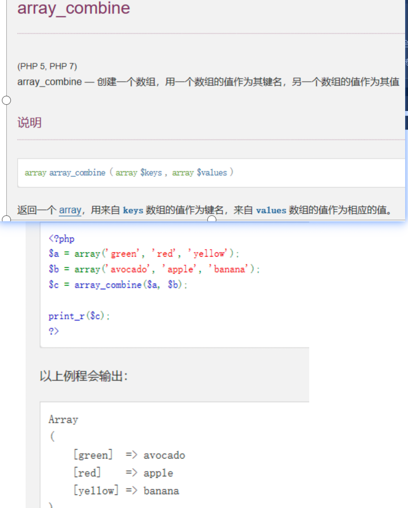

## 1.使用filter_var函数过滤参数

比如:filter_var($email, FILTER_VALIDATE_EMAIL));如何$eamil是邮箱,则返回邮箱地址,不是邮箱格式则返回false;

## 2.is_numeric()检查一个变量是否是数字

```
2.is_numeric()此函数是检查一个变量是否为数字或数字字符串.
是的话返回TRUE,否的话返回false
```

## 3.json_encode

json_encode($data, JSON_UNESCAPED_UNICODE);

加上第二个参数返回的数据如果有中文就不会乱码.

## 4.intval()获得变量的整数值  向上取整ceil()  向下取整floor()

## 5.substr_replace字符串替换

substr_replace($value['phone'], '', 3, 4);

替换将手机号的中间替换为

## 6.date和strtotime时间转换

date将时间戳转换为时间     strtotime(' 2019-10-10 10:10 ');将时间转换为时间戳.

## 7.获取某个域名对应的ip地址.

gethostbyname(); 

## 8排序

ksort(),将数组建名按照ascii值排序,sort(),将数字从小到大进行排序(效率比冒泡和快排高)

## 9.strpos('rjewlrjew','w')查询字符串首次出现的位置,

若strpos('rjewlrjew','w')的值===false,则说明,字符串没有该字符.

## 10.bcsub减法  bcmul乘法  bcadd加法 bcdiv除法  bcsub($a,$b,6);   

左操作数  运算符  右操作   6是精度

## 13.strtolower：所有的字符都小写（针对英文字母）

strtoupper：所有的字符都大写

## 14.count()计算数组的个数或者对象属性的个数.  strlen()计算字符串的长度.

## 15.min()返回数组的最小值,max()返回数组的最大值  

当遇到string类型的数据时,会将其当做0处理.若string为最值,则返回字符串.

## 16.preg_match()

```
检查是否是正确的手机号
function check_is_mobile($mobile) {
    if (!is_numeric($mobile)) {
        return false;
    }
    return preg_match('#^1[\d]{10}$#', $mobile) ? true : false;
}

```

## 17检查是否有中文

```

if (preg_match("/[\x7f-\xff]/", $str)) {
    echo "含有中文";
}else{
    echo "没有中文";
}

```

```php


function check_bankCard($card_number){
        $arr_no = str_split($card_number);
        $last_n = $arr_no[count($arr_no)-1];
        krsort($arr_no);
        $i = 1;
        $total = 0;
        foreach ($arr_no as $n){
            if($i%2==0){
                $ix = $n*2;
                if($ix>=10){
                    $nx = 1 + ($ix % 10);
                    $total += $nx;
                }else{
                    $total += $ix;
                }
            }else{
                $total += $n;
            }
            $i++;
        }
        $total -= $last_n;
        $x = 10 - ($total % 10);
        if($x == $last_n){
            return 'true';
        }else{
            return 'false';
        }
    }
```

## 17.pathinfo('/tes/tfsdfs/index.txt')     

返回值数组的格式如下,想要什么数据自己拿

array(4) { ["dirname"]=> string(11) "/tes/tfsdfs" ["basename"]=> string(9) "index.txt" ["extension"]=> string(3) "txt" ["filename"]=> string(5) "index" } 

## 18.array_filter($arr ,callback)   

返回值是通过callback方法筛选后的数组.此函数的作用主要是过滤数组中不符合条件的元素

例子;检查变量是否为奇数 

```php
function odd($var){
  return ($var & 1);//&按位与运算  
}
$arr=['1','2','3'];
var_dump(array_filter($arr,'odd'));//array(2) { [0]=> string(1) "1" [2]=> string(1) "3" }
即可过滤掉数组中的偶数.

array_walk_recursive()此参数主要是将数组中的每个元素进行处理.可以解决xss攻击
$arr = array(1,2,3);
array_walk_recursive($arr,function (&$var){
    $var += 1;
});
var_dump($arr);


$arr = array('<script>alert(1);</script>',2,3);
array_walk_recursive($arr,function (&$var){
    $var = htmlspecialchars($var);
});
```

## 19.file_put_contents

```

file_put_contents('./data111.txt',$da,FILE_APPEND);
文件写入函数,如果第一个参数表示的文件不存在会自动创建,加了第三个参数之后会追加的形式写入数据,如果去掉第三个参数,则也覆盖的形式写入数据.
```

## 20.strtr 字符串替换函数 效率比str_replace高四倍


21.

```php
21.尽量使用isset()来代替一下strlen函数
if (strlen($foo) < 5) { echo “Foo is too short”$$ }
(与下面的技巧做比较)
if (!isset($foo{5})) { echo “Foo is too short”$$ }
调用isset()恰巧比strlen()快，因为与后者不同的是，isset()作为一种语言结构，意味着它的执行不需要函数查找和字母小写化。也就是说，实际上在检验字符串长度的顶层代码中你没有花太多开销。
$arr['id']的性能是$arr[id]的7倍。
如果你需要判断一个字符串的长度是否不小于5,你可以使用isset($foo[‘4’]) 如果是true就说明长度不小于5.
```

## 22.set_time_limit

设置php脚本的运行时间,如果set_time_limit(0);则代表php脚本的运行时间不被限制,多用来运行一些时间比较长的脚本.比如填充大量数据.

## 23.extract

将接收到的参数直接注册到变量中,可以直接获取.

比如:extract($_POST); $_POST=[‘user’=>’zwl’,’age’=>’12’]  后面可以直接访问使用$user即可访问到zwl,直接使用$age,可以直接访问到12;

## 24.array_column — 返回数组中指定的一列

array_multisort($arr_col,SORT_DESC,$cust_list);当第一个数组的值和第三个数组的其中一列时,函数array_multisort,通过第二个参数(控制排序顺序,可以是正序也可以是倒叙.)

var_dump($arr_col,$cust_id);的结果如下图


    

```
array_multisort($arr_col,SORT_ASC,$cust_list);
```

最后以降序的顺序好的结果如上图


## 27.生成一个唯一的字符串(长度为13),可用于生成token.   uniqid()

## 28.获取xml函数

```php
function xml_encode($data, $root='think', $item='item', $attr='', $id='id',$encoding='utf-8') {
    if(is_array($attr)){
        $_attr = array();
        foreach ($attr as $key => $value) {
            $_attr[] = "{$key}=\"{$value}\"";
        }
        $attr = implode(' ', $_attr);//implode — 将一个一维数组的值转化为字符串
    }
    $attr   = trim($attr);
    $attr   = empty($attr) ? '' : " {$attr}";
    $xml    = "<?xml version=\"1.0\" encoding=\"{$encoding}\"?>";//  \"  表示转义双引号
    $xml   .= "<{$root}{$attr}>";//$attr根节点属性
    $xml   .= data_to_xml($data, $item, $id);
    $xml   .= "</{$root}>";
    return $xml;
}
function data_to_xml($data, $item='item', $id='id') {
    $xml = $attr = '';
    foreach ($data as $key => $val) {
        if(is_numeric($key)){
            $id && $attr = " {$id}=\"{$key}\"";
            $key  = $item;
        }
        $xml    .=  "<{$key}{$attr}>";
        $xml  .=  (is_array($val) || is_object($val)) ? data_to_xml($val, $item, $id) : $val;
        $xml    .=  "</{$key}>";
    }
    return $xml;
}
```


## 29.获取一个和原数组顺序相反的数组.


## 30.strlen()计算字符串的长度.

## 33.include和require的区别。

1.include引入文件时如果发生错误，不会终止程序的执行。会有警告提示。require会终止程序的程序，会有致命错误提示。

2.include在用的时候，才会加载对应的文件。

require一开始就会加载对应的文件。

34. ## 数组去重使用array_unique

    

    ## 35。对密码进行，加密时使用php自带的函数进行加密

    

## 36对接受到的参数要记得用trim函数

## 37.组装数据

常用于组装excel表头和一行数据的value值，即可组装成一个键名和键值一一对应的数组。


```

```

## 38urlencode和urldecode函数

Urlencode对url进行编码，方便传输时因为中文或者&号引起歧义。最好对url进行编码之后，再发送。

Urldecode对url进行解码。

## 39.数组的差集和交集

***\*差集：\*******\*array_diff()\*******\*，\*******\*array_diff_assoc()\****

***\*交集：\*******\*array_intersect()\*******\*，\**** ***\*array_intersect_assoc()\****

其中assoc是只关联数组。


## 40.include和require的区别。

1.include引入文件时如果发生错误，不会终止程序的执行。会有警告提示。require会终止程序的程序，会有致命错误提示。

2.include在用的时候，才会加载对应的文件。require一开始就会加载对应的文件。

## 41.数组去重，array_unique函数即可


## 42.数组倒序，使用以下函数即可


## 43.str_pad函数，将指定字符串，用指定字符以指定的方式扩充为指定长度。


44.抽奖算法

```php
/**
 * 概率算法，根据概率得出对应的值
 * */
function get_rand($proArr) {
    $result = '';
    //概率数组的总概率精度
    $proSum = array_sum($proArr);

    //概率数组循环
    foreach ($proArr as $key => $proCur) {
        $randNum = mt_rand(1, $proSum);
        if ($randNum <= $proCur) {
            $result = $key;
            break;
        } else {
            $proSum -= $proCur;
        }
    }
    unset ($proArr);
    return $result;
}
```

## 45.组装数据，常用于组装excel表头和一行数据的value值

即可组装成一个键名和键值一一对应的数组



## 46.urlencode和urldecode函数

Urlencode对url进行编码，方便传输时因为中文或者&号引起歧义。最好对url进行编码之后，再发送。

Urldecode对url进行解码。

## 47.字符串格式化参数

其中%s代表字符串站位符

```php
			 $str = 'hello %s,张文%s';
       $res = sprintf($str,'world','林');
       var_dump($res);die;
```


## 48获取函数参数的函数，func_get_args


```php
function demo($name,$age)
{
    $res = func_get_args();
    var_dump($res);die;
    return 'demo'.$name.'|'.$age;
}
demo('zwl','12');
```


## 49追踪某个方法在哪里被调用过。一般用于调试阶段

```php
<?php
// filename: /tmp/a.php

function a_test($str)
{
    echo "\nHi: $str";
    var_dump(debug_backtrace());
}

a_test('friend');
?>

<?php
// filename: /tmp/b.php
include_once '/tmp/a.php';
?>
```


## 50.header函数，设置返回的请求头。

可以通过header函数，来实现文件下载的功能。

通过a标签的方式，请求控制器中的方法。在控制器中使用header函数即可

```php
//告诉浏览器不要解析，当成附件直接下载。
header("Content-type: application/octet-stream");
//设置文件下载后的文件名
header("Content-Disposition: attachment; filename=SecurityCenter.csv");

//拼接好文件内容，输出到浏览器中即可
$content = '';
foreach ($data_info as $v) {
  $content .= implode(',', $v) . PHP_EOL;
}// 拼接
$header = implode(',', $header) . PHP_EOL;// 处理内容
echo $header.$content;
```

不能使用ajax请求。

## 51array_walk函数，对数组中的值就是回调函数的处理。


## 60.数据乱码时。使用iconv函数

可以转换其编码方式

```
iconv('GBK','UTF-8',$v['symbol'])
```

## 61.call_user_func()和call_user_func_array

总结： call_user_func 和 call_user_func_array不同在于传参方式，前者是字符串形式，后者是数组形式。

**call_user_func()**是利用回调函数**处理字符串**，**call_user_func_array**是利用回调函数**处理数组**。

```php
//静态调用某个方法。
$res = call_user_func_array('app\tool\GoogleAuthenticator::demo',['zwl',20]);
var_dump($res);
//实例化调用某个方法,其中thinkphp的门面类就是调用这个方法。
$res = call_user_func_array([new GoogleAuthenticator(),'demo'],['zwqewqw1l',20]);
var_dump($res);
//直接调用某个函数
$res = call_user_func_array('demo',['1',20]);
var_dump($res);
```

## 62视频格式时间的处理函数


## 63.parse_str把url格式的字符串，解析成变量

<?php
$str = "first=value&arr[]=foo+bar&arr[]=baz";

// 推荐用法
parse_str($str, $output);
echo $output['first']; // value
echo $output['arr'][0]; // foo bar
echo $output['arr'][1]; // baz


## 64.拆包和打包二进制数据，多用于tcp链接接收和发送时，对数据进行操作


## 65.file_get_contents文件函数

file_get_contents 不适合用来发起http请求。

file_get_contents 可以打开图片文件等数据，会返回二进制数据。

 file_put_contents也可以 写入二进制数据，生成pdf，和图片