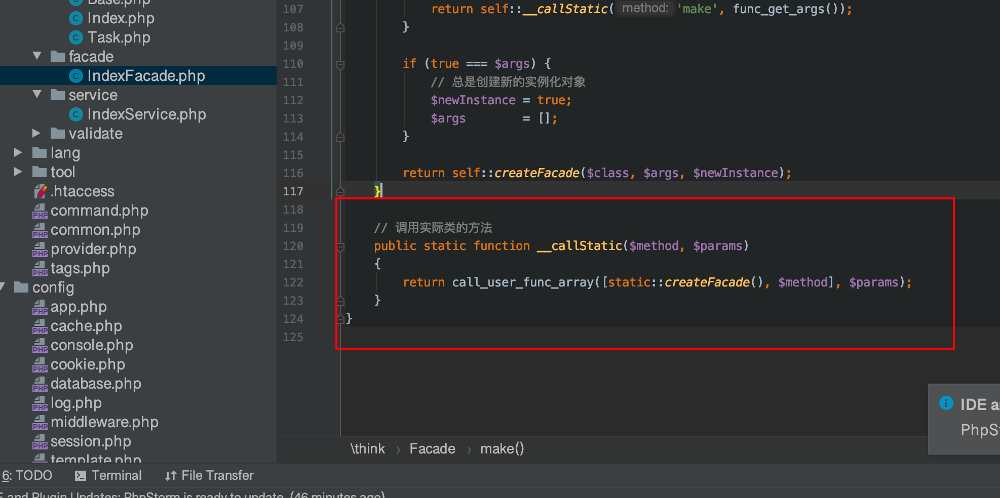
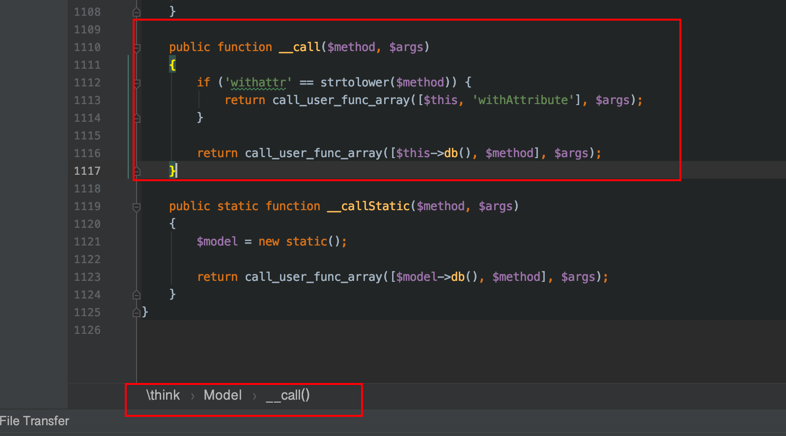
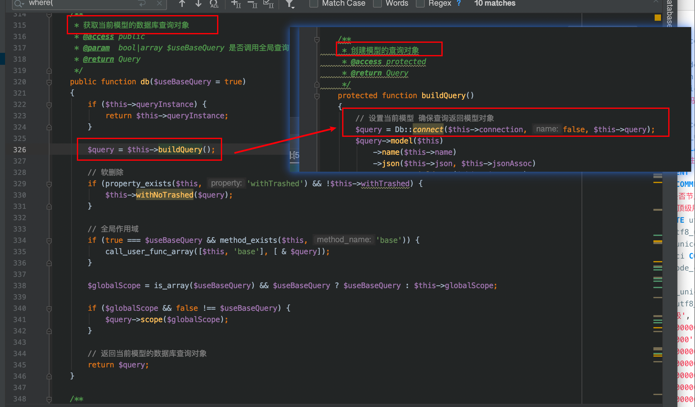

源码解读：https://www.kancloud.cn/misslihui/thinkphp5/1829755

框架在初始化时。执行App类的run方法。其中初始化了很多应用的配置。比如命名空间，配置文件，common公共函数，中间件配置，容器配置provider.php,钩子标签tags.php等等配置。

### 1.自动加载机制。	

https://github.com/cshaptx4869/tp5.1-code-read/blob/master/%E8%87%AA%E5%8A%A8%E5%8A%A0%E8%BD%BD.md

```php
php自动加载源码解析
  
  总体思路：使用spl_autoload_register函数，注册__autoload的魔术方法.
  然后定义类命名空间和路径的关系，其中有关的类有composer类，exctend扩展类等类的定义。并将关系赋值给Loader类的属性，为下一步引入做准备。
  然后去根据上一步Loader类的属性，去查找对应的文件，看文件是否存在，存在就引入文件。
  1.注册系统自动加载
  2.Composer自动加载支持
  3.注册命名空间定义
  4.加载类库映射文件
  5.自动加载extend目录
```

```php
// 1.调用 register 方法，注册自动加载机制
public static function register($autoload = '')
{
    // 注册系统自动加载 第一个参数是回调函数
    spl_autoload_register($autoload ?: 'think\\Loader::autoload', true, true);
  
	// 获取应用根目录末尾带分隔符
    $rootPath = self::getRootPath();
  
	// 设置composer的目录
    self::$composerPath = $rootPath . 'vendor' . DIRECTORY_SEPARATOR . 'composer' . DIRECTORY_SEPARATOR;

    // Composer自动加载支持
    if (is_dir(self::$composerPath)) {
        if (is_file(self::$composerPath . 'autoload_static.php')) {
          // 即获取引入的 autoload_static.php 的类名（包含命名空间）
            require self::$composerPath . 'autoload_static.php';
          
					// 返回所有定义过的类名组成的数组
            $declaredClass = get_declared_classes();
            
          //弹出数组中最后一个对象。一般是autoload_static文件中的定义的类ComposerStaticInita37cf6621defe68c577f46dd0754fb15，$composerClass其实就是autoload_static文件中的定义的类
            $composerClass = array_pop($declaredClass);
          
            foreach (['prefixLengthsPsr4', 'prefixDirsPsr4', 'fallbackDirsPsr4', 'prefixesPsr0', 'fallbackDirsPsr0', 'classMap', 'files'] as $attr) {
                // 对象或类是否存在属性
                if (property_exists($composerClass, $attr)) {
                    self::${$attr} = $composerClass::${$attr};
                }
            }
        } else {
            self::registerComposerLoader(self::$composerPath);
        }
    }

    // 注册think和traits命名空间定义 $prefixLengthsPsr4 $prefixDirsPsr4
    self::addNamespace([
        'think'  => __DIR__,
        'traits' => dirname(__DIR__) . DIRECTORY_SEPARATOR . 'traits',
    ]);

    // 加载根目录下runtime中的类库映射文件 php think optimize:autoload
    if (is_file($rootPath . 'runtime' . DIRECTORY_SEPARATOR . 'classmap.php')) {
        self::addClassMap(__include_file($rootPath . 'runtime' . DIRECTORY_SEPARATOR . 'classmap.php'));
    }

    // 自动加载extend目录 $fallbackDirsPsr4 所以也可使用该方法增加自定义的自动加载目录
    self::addAutoLoadDir($rootPath . 'extend');
}

其中很重要的4个属性
//register方法主要就是初始化了Loader类的者4个属性。
	prefixDirsPsr4
  一些类库或目录文件名对应的路径信息。比如app\对应application目录。
  
  prefixLengthPsr4
  一些类库或目录文件名的长度。
  
  fallbackDirsPsr4
  //自定义加载的目录路径，比如extends目录对应
  
  classMap，如果在里面有值就直接返回了。
  //类名和类名所在路径的关系
```


thinkphp可以自动加载的目录是：application, extend,thinkphp,vendor。

如果想要让自己在项目目录下，新建的zwl目录，也可以被自动加载到，需要改源码


```php
// 自动加载extend目录 $fallbackDirsPsr4 所以也可使用该方法增加自定义的自动加载目录
    self::addAutoLoadDir($rootPath . 'extend');
		self::addAutoLoadDir($rootPath . 'zwl');
注意，如果是zwl目录下的类，不能要写命名空间，直接\即可。比如Demo类，直接 new \Demo()
  自定义目录下，最好不要新建目录，不然加载不到。需要修改源码。如下
```


### 2.配置类源码

```php
以数组的方式访问对象，需要实现了ArrayAccess接口。

比如thinkphp中的model类，查出来的结果集是对象，但却可以用数组的方式进行方式，就是因为model类继承了ArrayAccess接口，并实现了接口的4个方法。
$mem_info = Member::getInstance()->field('id,name')->find();
var_dump($mem_info['name']);
```


```
在App类的初始化方法中，加载了config目录下的配置文件和模块下config目录下的配置文件，然后将配置文件中的数据赋值给Config类的config属性。如下图位置所示。
```


加载之后呢

$this->config属性的值就是一个二维数组

```php
[
	'app' => [
    ''
  ],
  'cache'	=>	[
    
  ],
]

```


### 3.容器源码和门面

```php
/*容器主要的其实就是实现了注册树模式。注册树像是一个盒子，将要用或者正在调用的实例放在盒子中，同一进程中的下次请求进入，就不会再去实例化。而是直接在盒子里面进行查找返回。
容器是主要通过think\Container类来实现的。我们分析一下app类通过容器进行实例化的过程。*/

Container::get('app')；
  
public  static  function  get($abstract, $vars = [], $newInstance = false){
    return  static::getInstance()->make($abstract, $vars, $newInstance);
}
//可以看出，主要是通过Container类的make方法进行实例化。
public  function  make($abstract, $vars = [], $newInstance = false){
    if (true === $vars) {
        // 总是创建新的实例化对象
        $newInstance = true;
        $vars = [];
    }
    $abstract = isset($this->name[$abstract]) ? $this->name[$abstract] : $abstract;
    // 若对象树中有该对象的实例，则直接返回
    if (isset($this->instances[$abstract]) && !$newInstance) {
        return  $this->instances[$abstract];
    }
    // 是否有容器绑定标识。然后通过容器标识来找到最终实例化的类
    if (isset($this->bind[$abstract])) {
        $concrete = $this->bind[$abstract];
        if ($concrete instanceof Closure) {
            $object = $this->invokeFunction($concrete, $vars);
        } else {
            return  $this->make($concrete, $vars, $newInstance);
        }
    } else {
      //通过反射机制，生成类的实例。
        $object = $this->invokeClass($abstract, $vars);
    }
    if (!$newInstance) {
        $this->instances[$abstract] = $object;
    }
    return  $object;
}

/*make先根据参数，判断是否总是创建新的实例。在根据容器对象实例数组$instances,判断是否有该实例，若有则直接返回。如果无，则进行实例化。先根据绑定标识找到需要实例化的类。若无绑定标识，则直接实例化类。
是通过invokeClass类调用反射执行实例化，和支持依赖注入的。若需要实例化的类中有__make方法，则先执行__make方法。在执行构造方法 进行实例化。*/

public  function  invokeClass($class, $vars = []){
    try {
        // 利用反射机制，获取到需要实例化的反射类
        $reflect = new  ReflectionClass($class);
        // 若有__make方法，则先执行
        if ($reflect->hasMethod('__make')) {
            $method = new  ReflectionMethod($class, '__make');
            if ($method->isPublic() && $method->isStatic()) {
                // 绑定函数的参数，支持依赖注入
                $args = $this->bindParams($method, $vars);
                return  $method\->invokeArgs(null, $args);
            }
        }	
        // 通过反射类获取到类的构造函数
        $constructor = $reflect->getConstructor();
        // 绑定构造函数的参数，支持依赖注入，在bindParams方法中，会自动管理依赖注入的类。
        $args = $constructor ? $this->bindParams($constructor, $vars) : [];
        // 执行构造函数，并返回实例化对象
        return  $reflect->newInstanceArgs($args);
    } catch (ReflectionException  $e) {
        throw  new  ClassNotFoundException('class not exists: '  .  $class, $class);
    }
}


```

门面:某个门面类继承了facade类，并实现了getFacadeClass方法。即可静态的方式调用类的动态方法。

其实实现了最终是调用了门面类的__callStatic方法。第一个参数是实力化，当前调用的类对象。然后传入对应的方法名和参数，就可以调用调用类中的某个方法。




### 4.框架的初始化。在App类的run方法内进行了初始化。

注意在run方法中的initialize方法中进行初始化。


```
初始化了路由，中间件，错误机制，命名空间等等属性，
```

### 5.控制器的源码解读

1.在App的run方法中，执行应用的初始化，然后在路由调度,返回一个路由调度对象。


2.然后执行路由调度对象的run方法，经过一系列挑战后，执行调用Modurl类的exec方法。


3.首先初始化了路由，然后根据路由规则，找到对应的控制器类和方法。在通过反射机制中的ReflectionMethod即可，传入反射类和方法即可调用对应的方法。然后返回一个respons对象。


4.然后run方法返回这个respond对象


5.然后回到入口文件的index.php中，执行respond的send方法。


在此方法之后的代码，和客户端没有关系了。是服务端后续的逻辑处理。


### 6.数据库Db类和Model类解析

```
//首先要搞明白数据库的核心类库，分别是connection类（连接器，用来链接不同的数据库类型，比如mysql，ptsql等数据库类型），
//query类（查询类，可构建查询语句属性（比如使用where方法，order方法等都是返回query对象），也可以执行查询操作（比如Db：：query方法，执行sql））。
//build类（sql语句生成器），生成可以执行的sql语句。
```

1.Db类,静态调用一个不存在的方法时（比如Db::name()），走到此方法。


2.此方法主要是获得初始化数据链接，并返回一个query对象。


3.在find方法，执行query对象的find方法。

```php
 $res = Db::name('member')->where(['id' => 1])->find();
//先跳转到connection的find方法
```


```
然后在跳转到connection的query方法。在此方法中执行：$this->PDOStatement->execute();

然后再调用return $this->getResult($pdo, $procedure);
会返回执行的结果数据。
```


其实Db常用的场景就这两种

```php
Db::query()//执行原生sql
Db::name()->where()->find()//执行拼接好的方法。
//其中两种方式底层都是调用了connection类的query方法。其中都有进行预处理。

```


Model类

```php
//model类中调用了不存在的where方法，会自动走到__call方法，然后再跳转到Db类。
$res = Member::getInstance()->where(['name' => 'zzzzzz'])->find();
var_dump($res);
```



获取数据库链接对象还是用的Db类的方法。



使用Db：：connect方法拿到数据库链接对象（query类），此query类是可以配置的，默认在database.php文件中的query配置中指定对应的类。然后实例化query类后，并返回就回到__call方法中的call_user_func_array方法，会执行query类中的where方法。


其实Db类操作数据库时，使用的where方法也是这个。模型类和DB类操作数据库用的都是query类中的where方法。


然后where方法返回query对象，一系列的field，limit，order方法返回的都是query对象，最终执行find或者select方法。比如find方法，就是query类中的find方法。其实这样的find方法和Db的使用的find方法是同一个，都是query类中的同一个方法。

### 7thinkphp5.1中间件的实现原理：

利用了责任链模式，或者也可以说是管道模式。

不妨将管道中流动的水流比如一个请求，将中间件必做管道中的关卡。中间件就是请求进行一定的处理，处理完返回请求。给下一个中间件处理。框架会把中间件当作队列的形式，储存为类的一个属性。每次弹出队列中的一个元素，进行调用，调用完返回reponse对象。

```
protected $config;

    public function __construct($config)
    {
        $this->config = is_file($config) ? include $config : $config;
    }

    public function parse()
    {
        return $this->config;
    }
    
    
    protected $config;

    public function __construct($config)
    {
        if (!function_exists('yaml_parse_file')) {
            throw new \Exception('请先开启yaml扩展');
        }
        $this->config = is_file($config) ? yaml_parse_file($config) : $config;
    }

    public function parse()
    {
        return $this->config;
    }

/**
     * 加载配置文件
     * @param $file 文件名
     * @param $name 一级配置名
     * @return mixed
     */
    protected function loadFile($file, $name)
    {
        $name = strtolower($name);
        $type = pathinfo($file, PATHINFO_EXTENSION);
        return $this->parse($file, $type, $name);
    }
```

