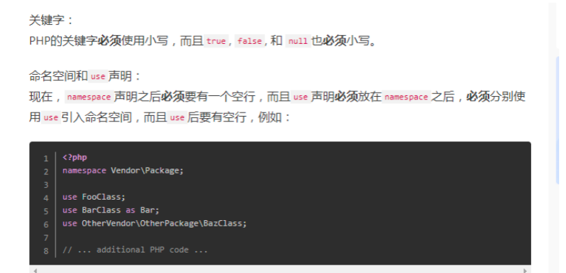
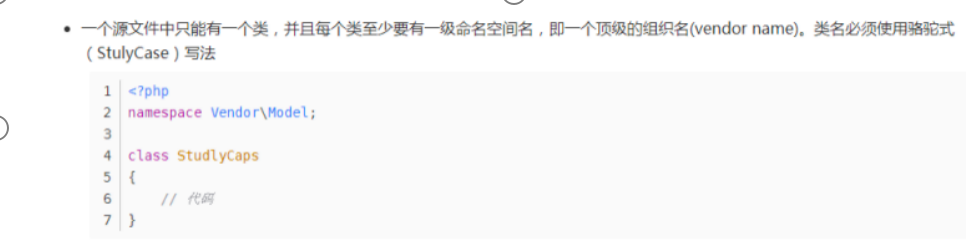
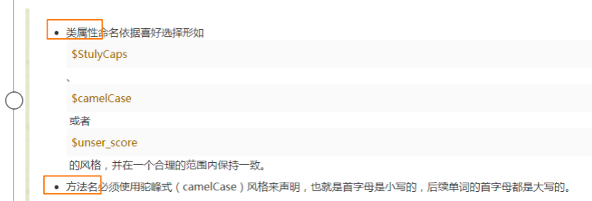
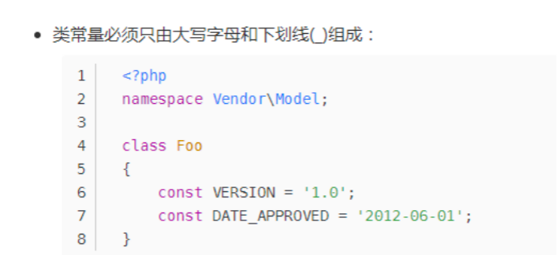
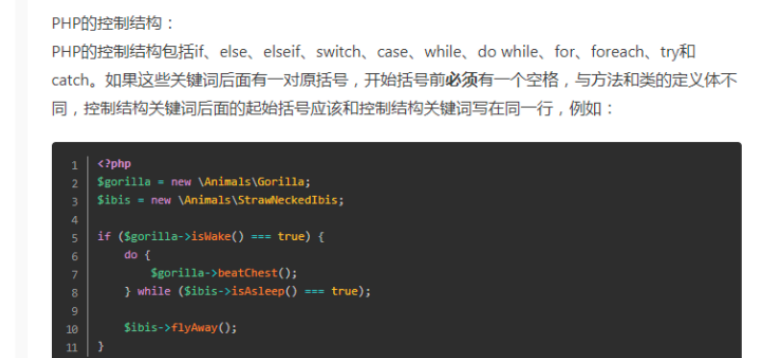
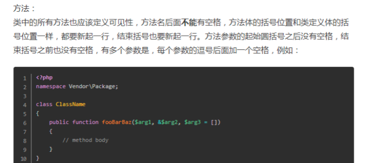

### 											PSR代码规范

php代码文件用utf-8编码

### 变量名

变量的命名原则必须统一。两种方式，喜欢用下划线的那种。
如变量的命名可以为第一个单词首字母小写，其余单词首字母大写(驼峰);
还可以采用单词所有字母小写，单词之间用下划线分割。

1.




2.类名用大驼峰，方法名用小驼峰，变量名用下划线隔开



3.




4.


5.




6.



7.术语“类”是指所有类，接口和特征。

任何右括号都不得在同一行后跟任何评论或声明。

当实例化一个新类时，即使没有参数传递给构造函数，括号也必须始终存在。

```
new User();
```

8.函数和类里面的方法名定义是,左边的大括号必须要独占一行.比如

```php
 <?php
 namespace think\Cache;
 
 use think\Controller;
 
 class UserType
 {
  	public $user_pwd = 'weqw';
     
    public function userEat($id, $username = 'zwl')
    {
      $ni = '231';
      if ($ni === true) {
        return true;
      }
    }
     
     public static function userSleep()
     {
      	$this->userEat();
     }
     
     public function userTalk()
     {
         self::userSleep();
     }
 }
```

```php
 <?php
 
  function getNum($ni, $mi)
  {
  	$o = [1,2,3];
  	foreach ($o as $k => $v) {
      	var_dump($v);
    }
  }
  
  getNum();
```

```

9.常量和env文件
常量用大写加下划线隔开。方法的参数或者函数的参数，如果是两个以上，第二个参数，在前一个参数的逗号，要用空格隔开。比如
protected function assign($name, $value = '')
{
    $this->view->assign($name, $value);
    return $this;
}
```


### 1。接口规范

```php
		/**
     * @Description	接口描述
     * @access 		 	public
     * @return 		 	json
     * @Author 			闻铃
     */
    public function demo()
    {
        try {
            //接收参数
            $post = $this->request->post();
            list($dealPwd, $amount) = [$post['dealPwd'], $post['amount']];

            if (empty($passwd) || strlen($passwd) != 6) {
                return returnJson(Status::FAILED,Lang::get('pwd_error'));
            }
            // 验证交易密码是否正
            $is_true = password_verify($passwd, $this->user['deal_pwd']);
            if (!$is_true) {
                return returnJson(Status::FAILED, Lang::get('pwd_error'));
            }
            Db::startTrans();
            Db::commit();
            return returnJson(Status::SUCCESS,Lang::get('buy_success'));
        }
        catch (\Exception $e) {
            Db::rollback();
            errorLog($this->action, $e);
            return returnJson(Status::SYSTEM_ERROR, Lang::get('system_error'));
        }
    }
```

### 2方法规范

```php
/**
 * Notes:
 * User: 闻铃
 * DateTime: 2021/5/13 上午10:03
 * @param $number
 * @param $name
 */
function demo($number, $name)
{

}
```

### 3函数规范

```php
if (!function_exists('input')) {
    /**
     * 获取输入数据 支持默认值和过滤
     * @param string    $key 获取的变量名
     * @param mixed     $default 默认值
     * @param string    $filter 过滤方法
     * @return mixed
     */
    function input($key = '', $default = null, $filter = '')
    {
       
    }
}
```

### 4.模型规范

```php
//新建一个单例模式，所有的模型类都继承此代码片段
trait Singleton
{
    private static $instance;

    /**
     * @param mixed ...$args
     * @return mixed
     */
    static function getInstance(...$args)
    {
        if(!isset(static::$instance)){
            static::$instance = new static(...$args);
        }
        return static::$instance;
    }
}
```


```php
    /**
     * 单条查询
     * @param array $where  查询条件
     * @param string $field 字段
     * @param false $lock   是否加排它锁
     * @return model
     * @throws $e
     */
    public function getOne($where, $field = '*', $lock = false)
    {
        return $this->lock($lock)->field($field)->where($where)->find();
    }

		/**
     * 分页查询
     * @param array $where  查询条件
     * @param mixed $page  页码
     * @param mixed $size  行数   
     * @param string $order 排序   
     * @param string $field 字段  
     * @return array
     * @throws $e
     */
    public function getPage($where = [], $page = 1, $size = 15, $order = 'id desc', $field = '*')
    {
        return $this->where($where)
            ->order($order)
            ->field($field)
            ->paginate($size, '', ['page'=>$page])
            ->toArray();
    }
a
		/**
     * 时间字段格式化
     * @param mixed $time  时间 
     * @return string
     * @throws $e
     */
		public function getCreateTimeAttr($time)
    {
        if ($time == 0) {
            return '';
        }
        return date('Y-m-d H:i', $time);
    }

		/**
     * 时间字段格式化
     * @param mixed $time  时间 
     * @return string
     * @throws $e
     */
		public function getUpdateTimeAttr($time)
    {
        if ($time == 0) {
            return '';
        }
        return date('Y-m-d H:i', $time);
    }

		/**
     * 更新数据
     * @param array $where 更新条件 
     * @param array $data	 更新数组
     * @return string
     * @throws $e
     */
		public function updateData($where,$data)
    {
        return $this->where($where)->update($data);
    }
	
		/**
     * 多条查询
     * @param array $where  查询条件
     * @param string $field 字段
     * @param string $limit 查询条数
     * @param false $lock   是否加排它锁
     * @param string $order 排序
     * @return array
     * @throws $e
     */
    public function getMany($where = [], $field = '*', $limit = '', $lock = false, $order = 'id asc')
    {
        return $this->lock($lock)->field($field)->where($where)->order($order)->limit($limit)->select()->toArray();
    }

//联表查询
    /*public function getJoin($where)
    {
        return $this->alias('a')
                    ->join('fund_product b','b.id = a.product_id','LEFT')
                    ->field('a.product_id,,b.product_type,sum(a.now_money) as total_money')
                    ->where($where)
                    ->select()
                    ->toArray();
    }*/
```


```

```

```

```

```

```

