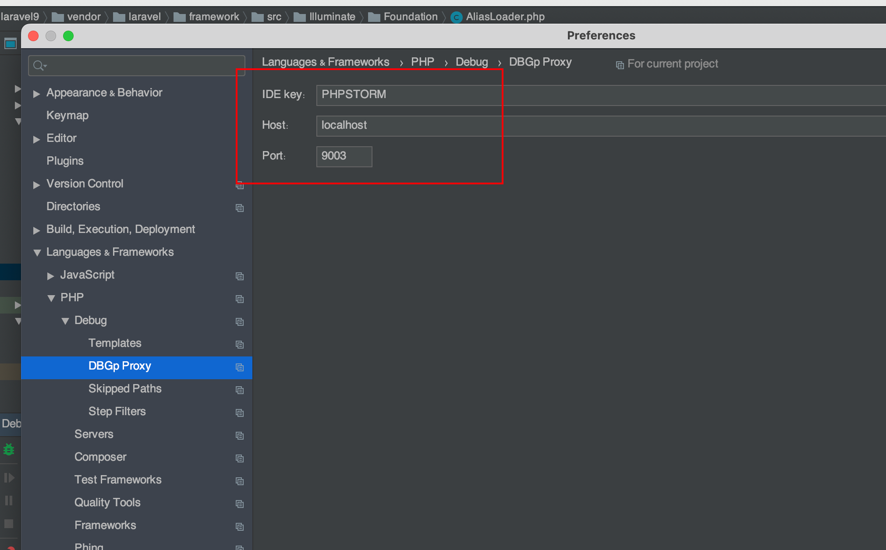
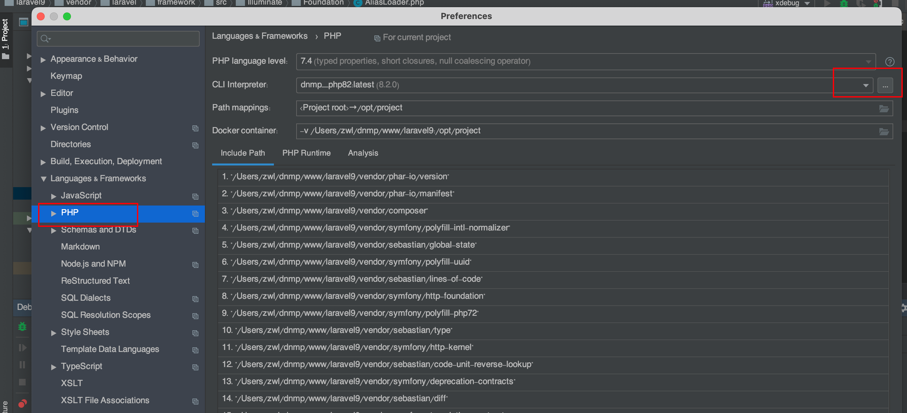

### 1.给php容器安装xedebug扩展，修改php.ini中的xdebug选项。

如何看xdebug扩展版本，用phpinfo()看。因为3.0和2.0的一些配置项名改了，所以要区分版本。

1.1如果安装的xdebug扩展是3.0版本以上的，用下面这个参数

[XDebug]

zend_extension=xdebug.so

xdebug.mode = debug

xdebug.discover_client_host = true

xdebug.client_port = 9003

xdebug.max_nesting_level = 512

xdebug.idekey = PHPSTORM

xdebug.client_host=host.docker.internal

xdebug.start_with_request=yes

1.2 如果是2.0版本的，用这个参数

[XDebug]
zend_extension=xdebug.so
xdebug.remote_enable=1
xdebug.remote_handler="dbgp"

xdebug.remote_host=host.docker.internal
xdebug.remote_port=9000
xdebug.remote_log=/var/log/php/xdebug.log
xdebug.idekey=PHPSTORM

;启用代码自动跟踪
xdebug.auto_trace = On
;启用性能检测分析
xdebug.profiler_enable = On
xdebug.profiler_enable_trigger = On
xdebug.profiler_output_name = profiler.out.%t.%p

2. 配置phpstorm

   2.1 配置phpstorm中的server

   

### 2.2 配置debug

port和上图保持一致，Host写localhost就行。

### 3.修改php CLI

3.1新建cli

最后打断点，点击下图两个小图标即可即可。

