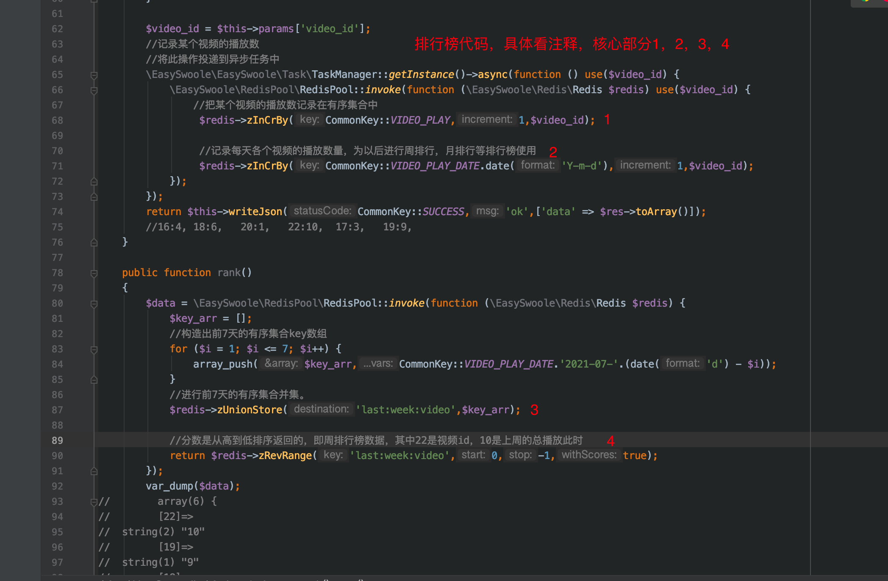
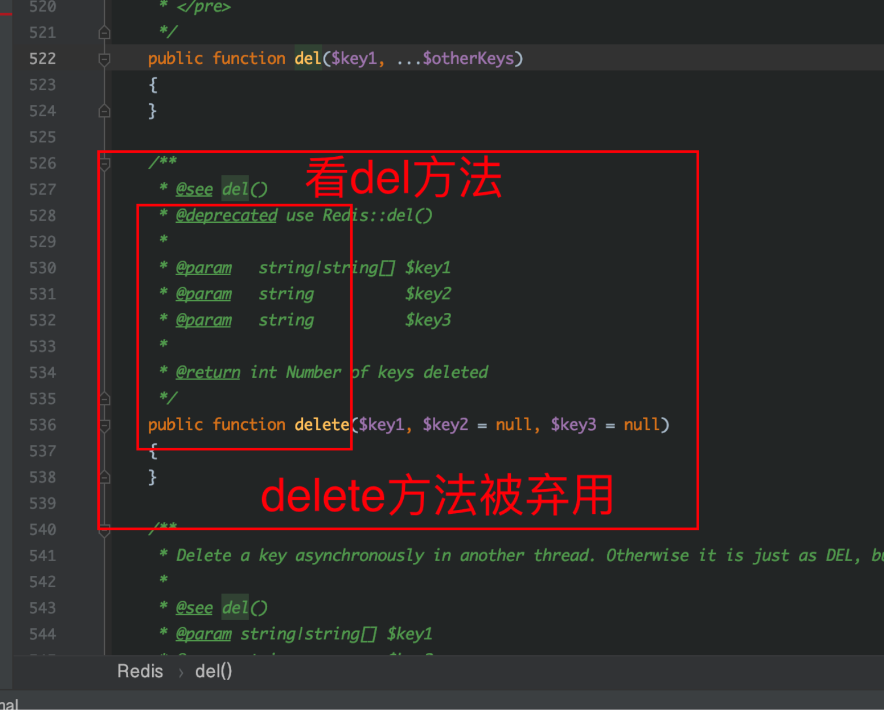
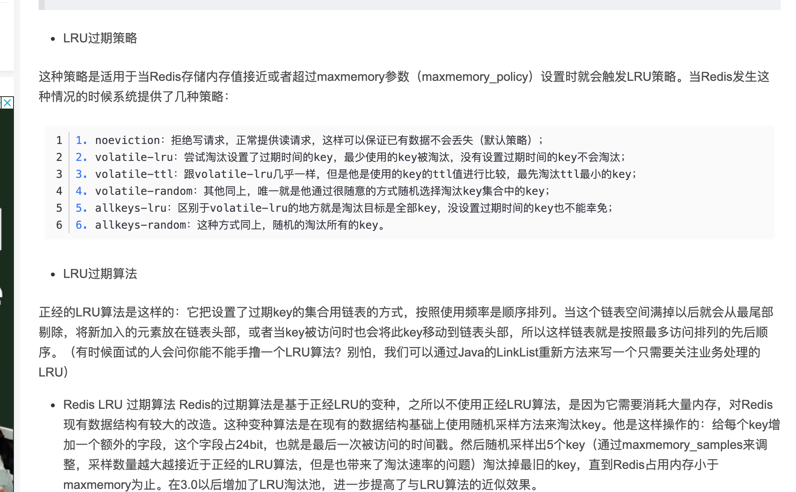
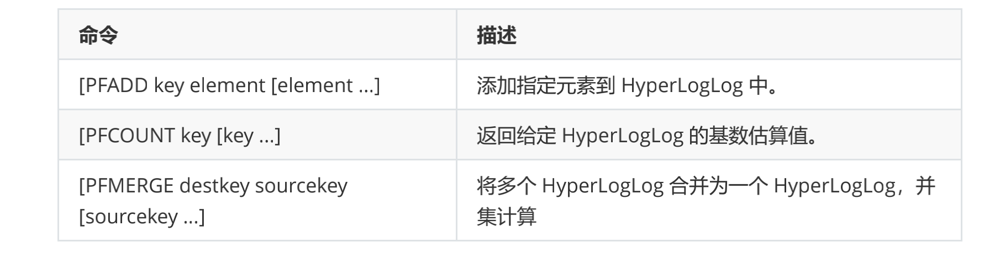
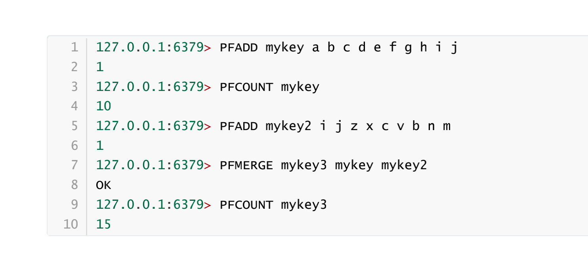
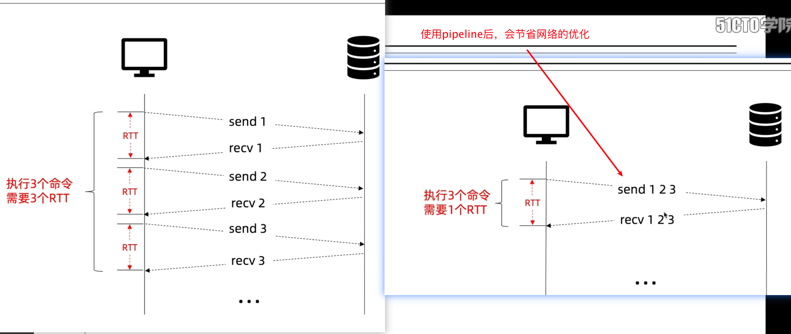

redis知识积累

https://redis.io/ 官网

http://www.redis.cn 中文网

key值在redis下，可以keys code:*可以模糊查询key值。


### **1.** ***\*字符串\****

简单的key=>value.存一个字段的值

### **2.** ***\*列表类型\****

***\*实现简单队列,就是索引数组\****

```
[‘1’,’2’,’3’];
```

***\*先进先出,或者先进后出.\****

### **3.** ***\*哈希类型\****

***\*一般用于存储数据库中的一条记录.\****

***\*类似于键值对数组\****

```
[‘username’=>’张三’,’age’=>’18’,’gender’=>’0’];
```

***\*Key如何设置\****

***\*比如 表名:主键名:第几条记录\****

```
hmset User:id:1 user 张三 age 20
```

***\*Hmset一次性设置哈希多个值.\****

 

集合的元素不能重复,集合的大小2的32次方-1;

### **4.** ***\*无序集合\****

***\*一般用于抽奖,好友关系(交集,差集,并集),推荐可能认识的人.\****

### **5.** ***\*有序集合\****

每一个值关联一个分值(用于排序),一般用于热门商品,将每个商品的搜索次数,塞进redis中.进行排序,一般用于排序.每次搜索时,将redis中的值的分值加1.


可以对多个有序集合进行并集。这样就能统计出一周的排行榜。

结合了easyswoole的redis进行统计 

 


### redis注意事项

### 1.Redis可以持久化存储

(1.rdb快照.2.aof 日志),快照的存储的文件叫dump.rdb  一般在redis文件夹中.可以直接复制到其他服务器上运行.

Aof会记录每条命令的日志,会尽量保证数据不丢失.


可以同时开启rdb和aof。两者不冲突。


坐主从复制时必须要同时开启rdb和aof。

 

### 2.Redis支持简单的事务

事务叫开启的命令叫mutli.   如果语意有问题,不会回滚,比如命令要求的类型是整形,结果我拿字符串去执行,就不会出现回滚.其他错误都会出现回滚.

 

### 3.Redis可以限制ip

可以设置一个密码.改配置文件.

可以远程连接,用图形化工具连接.

 

### 4.主从复制(读写分离).

从服务器复制主服务器的数据,主服务器负责写,从服务器负责读.简单配置一下.

 

### 5. redis发布和订阅.

有什么缺点.订阅者如果中间离开了订阅的频道,当订阅者再次回来订阅频道时,将得不到离开期间发布的数据.  加一个p时,可以使用通配符,进行订阅符合条件的频道.


### 6.并发工具

安装一个压力测试工具,ab测试工具，模拟并发的工具

```
yum install -y httpd-tools.x86_64
```


```
ab -c 并发数 -n 请求的次数   -k http://url/文件
```


### 7图形化管理

.


### 8.redis事务

开启事务:multi  提交:exec  回滚:discard


事务开启之后,回滚的情况:1.命令或方法不存在时    2.自己使用discard命令时会回滚.

比如:开启事务之后,执行了两条命令,一条是语法和命令都没问题的,第二条是语法没问题,但命令比如zadd一个list类型的数据,还有exec之后,第一条命令会执行,第二条命令会报错.无法保证其事务的原子性,所以redis的事务是简单事务.

如果已经发现了语句有问题,执行discard会回滚所有的语句.因为开启事务之后,后面的命令其实没有执行.只是加入到一个队列之中.

### 9.redis数据被删除之后,有一种办法可以恢复

去aof日志中,删掉对应的删除命令(删除数据的命令),然后重启服务,数据就会恢复.

10.

### 11.乐观锁和悲观锁


### 12.进行冷热数据的分离

例子:将数据存入列表中,当列表的长度超过 100时,使用rpoplpush命令,从存数据的列表的右边弹出一条数据,再将弹出的数据放到一个公共的列表中,然后写一个脚本,将公共联表的中的最新的存入1000条存到数据库中.用计划任务定时执行此脚本.就可以实现冷热数据的分离了.


### 13.redis登录

1.找到redis-cli的位置，然后执行下图中的指令即可，进入redis。


14.redis设置密码和限制本地登录


```
修改对应的配置项即可
```

### 15.redis中del和delete区别



### 16.常用命令

setnx，存在则设置失败，不存在，则设置成功

expire设置某个key的有效期

ttl查看某个key的有效期

lpush，从左开始往队列里面写数据，rpop从右边开始弹出数据。

set（key，value，time）

get


### 17.redis-dump工具，永久禁用。


### 18.发布与订阅模式

使用发布与订阅时，最好使用长链接，或者设置超时时间设置大一点。


不然订阅时，太久没有数据，自动会断开连接。


redis的发布与订阅模式的有什么缺点吗？

订阅者如果先订阅了，后离开，在此订阅时，得不到离开后产生的消息。

有什么措施可以解决这个问题呢？

在发消息时，做一个消息的记录。得不到消息时，可以去对应的记录里面找


### 19redis的数据销毁策略

redis是比较吃内存的。如果redis的数据大小超过了配置的参数，就会自动删除一些redis的数据。




### 20.bitmap数据结构

在开发中，可能会遇到这种情况：需要统计用户的某些信息，如活跃或不活跃，登录或者不登录；又如

需要记录用户一年的打卡情况，打卡了是1， 没有打卡是0，如果使用普通的 key/value存储，则要记录

365条记录，如果用户量很大，需要的空间也会很大，所以 Redis 提供了 Bitmap 位图这中数据结构，

Bitmap 就是通过操作二进制位来进行记录，即为 0 和 1；

如果要记录 365 天的打卡情况，使用 Bitmap

表示的形式大概如下：0101000111000111...........................，这样有什么好处呢？当然就是节约内存

了，365 天相当于 365 bit，又 1 字节 = 8 bit , 所以相当于使用 46 个字节即可。

BitMap 就是通过一个 bit 位来表示某个元素对应的值或者状态, 其中的 key 就是对应元素本身，实际上

底层也是通过对字符串的操作来实现。Redis 从 2.2 版本之后新增了setbit, getbit, bitcount 等几个

bitmap 相关命令。


setbit 设置操作

SETBIT key offffset value : 设置 key 的第 offffset 位为value (1或0)

```shell
# 使用 bitmap 来记录上述事例中一周的打卡记录如下所示： 
# 周一：1，周二：0，周三：0，周四：1，周五：1，周六：0，周天：0 （1 为打卡，0 为不打卡） 
127.0.0.1:6379> setbit sign 0 1 
0
127.0.0.1:6379> setbit sign 1 0 
0
127.0.0.1:6379> setbit sign 2 0 
0
127.0.0.1:6379> setbit sign 3 1 
0
127.0.0.1:6379> setbit sign 4 1 
0
127.0.0.1:6379> setbit sign 5 0 
0
127.0.0.1:6379> setbit sign 6 0 
0
```

getbit 获取操作

GETBIT key offffset 获取offffset设置的值，未设置过默认返回0

```shell
127.0.0.1:6379> getbit sign 3 # 查看周四是否打卡 
1
127.0.0.1:6379> getbit sign 6 # 查看周七是否打卡 
0
```

> bitcount 统计操作

bitcount key [start, end] 统计 key 上位为1的个数

\# 统计这周打卡的记录，可以看到只有3天是打卡的状态： 

```shell
127.0.0.1:6379> bitcount sign 
3 
```


1. `BITOP` performs bit-wise operations between different strings. The provided operations are AND, OR, XOR and NOT.
2. BITOP在不同字符串之间执行逐位操作。提供的操作是AND、OR、XOR和NOT。
3. 
4. `BITCOUNT` performs population counting, reporting the number of bits set to 1.

BITCOUNT执行填充计数，报告设置为1的位数

1. 
2. `BITPOS` finds the first bit having the specified value of 0 or 1.

BITPOS查找具有指定值0或1的第一位。


### 21.hyperloglog可以快速统计用户的某些指标。比如用户浏览量

即使在用户量很大的情况下，依然可以统计的很快。

Redis 在 2.8.9 版本添加了 HyperLogLog 结构。

Redis HyperLogLog 是用来做基数统计的算法，HyperLogLog 的优点是，在输入元素的数量或者体积

非常非常大时，计算基数所需的空间总是固定 的、并且是很小的。

在 Redis 里面，每个 HyperLogLog 键只需要花费 12 KB 内存，就可以计算接近 2^64 个不同元素的基

数。这和计算基数时，元素越多耗费内存就越多的集合形成鲜明对比。

HyperLogLog则是一种算法，它提供了不精确的去重计数方案。

举个栗子：假如我要统计网页的UV（浏览用户数量，一天内同一个用户多次访问只能算一次），传统的

解决方案是使用Set来保存用户id，然后统计Set中的元素数量来获取页面UV。但这种方案只能承载少量

用户，一旦用户数量大起来就需要消耗大量的空间来存储用户id。我的目的是统计用户数量而不是保存

用户，这简直是个吃力不讨好的方案！而使用Redis的HyperLogLog最多需要12k就可以统计大量的用户

数，尽管它大概有0.81%的错误率，但对于统计UV这种不需要很精确的数据是可以忽略不计的。







### 22.stream数据类型

提供了比较完整的消息订阅功能。

完善了消息在非订阅状态下，重新订阅时失去历史数据的功能。


### 23.pipeline



Redis Pipeline 允许通过使用单个 client-server-client 往返执行多个命令来提高性能。区别于一个接一个地执行100个命令，你可以将这些命令放入 pipeline 中，然后使用1次读写操作像执行单个命令一样执行它们。这样做的好处是节省了执行命令的网络往返时间（RTT）。

y在下面的示例代码中演示了使用 pipeline 通过一个 write + read 操作来执行多个命令。

```go
pipe := rdb.Pipeline()

incr := pipe.Incr(ctx, "pipeline_counter")
pipe.Expire(ctx, "pipeline_counter", time.Hour)

cmds, err := pipe.Exec(ctx)
if err != nil {
	panic(err)
}

// 在执行pipe.Exec之后才能获取到结果
fmt.Println(incr.Val())
```

上面的代码相当于将以下两个命令一次发给 Redis Server 端执行，与不使用 Pipeline 相比能减少一次RTT。

```bash
INCR pipeline_counter
EXPIRE pipeline_counts 3600
```

或者，你也可以使用`Pipelined` 方法，它会在函数退出时调用 Exec。

```go
var incr *redis.IntCmd

cmds, err := rdb.Pipelined(ctx, func(pipe redis.Pipeliner) error {
	incr = pipe.Incr(ctx, "pipelined_counter")
	pipe.Expire(ctx, "pipelined_counter", time.Hour)
	return nil
})
if err != nil {
	panic(err)
}

// 在pipeline执行后获取到结果
fmt.Println(incr.Val())
```

我们可以遍历 pipeline 命令的返回值依次获取每个命令的结果。下方的示例代码中使用pipiline一次执行了100个 Get 命令，在pipeline 执行后遍历取出100个命令的执行结果。

```go
cmds, err := rdb.Pipelined(ctx, func(pipe redis.Pipeliner) error {
	for i := 0; i < 100; i++ {
		pipe.Get(ctx, fmt.Sprintf("key%d", i))
	}
	return nil
})
if err != nil {
	panic(err)
}

for _, cmd := range cmds {
    fmt.Println(cmd.(*redis.StringCmd).Val())
}
```

在那些我们需要一次性执行多个命令的场景下，就可以考虑使用 pipeline 来优化。

## 事务

Redis 是单线程执行命令的，因此单个命令始终是原子的，但是来自不同客户端的两个给定命令可以依次执行，例如在它们之间交替执行。但是，`Multi/exec`能够确保在`multi/exec`两个语句之间的命令之间没有其他客户端正在执行命令。

在这种场景我们需要使用 TxPipeline 或 TxPipelined 方法将 pipeline 命令使用 `MULTI` 和`EXEC`包裹起来。

```go
// TxPipeline demo
pipe := rdb.TxPipeline()
incr := pipe.Incr(ctx, "tx_pipeline_counter")
pipe.Expire(ctx, "tx_pipeline_counter", time.Hour)
_, err := pipe.Exec(ctx)
fmt.Println(incr.Val(), err)

// TxPipelined demo
var incr2 *redis.IntCmd
_, err = rdb.TxPipelined(ctx, func(pipe redis.Pipeliner) error {
	incr2 = pipe.Incr(ctx, "tx_pipeline_counter")
	pipe.Expire(ctx, "tx_pipeline_counter", time.Hour)
	return nil
})
fmt.Println(incr2.Val(), err)
```

上面代码相当于在一个RTT下执行了下面的redis命令：

```bash
MULTI
INCR pipeline_counter
EXPIRE pipeline_counts 3600
EXEC
```

### Watch

我们通常搭配 `WATCH`命令来执行事务操作。从使用`WATCH`命令监视某个 key 开始，直到执行`EXEC`命令的这段时间里，如果有其他用户抢先对被监视的 key 进行了替换、更新、删除等操作，那么当用户尝试执行`EXEC`的时候，事务将失败并返回一个错误，用户可以根据这个错误选择重试事务或者放弃事务。

Watch方法接收一个函数和一个或多个key作为参数。

```go
Watch(fn func(*Tx) error, keys ...string) error
```

下面的代码片段演示了 Watch 方法搭配 TxPipelined 的使用示例。

```go
// watchDemo 在key值不变的情况下将其值+1
func watchDemo(ctx context.Context, key string) error {
	return rdb.Watch(ctx, func(tx *redis.Tx) error {
		n, err := tx.Get(ctx, key).Int()
		if err != nil && err != redis.Nil {
			return err
		}
		// 假设操作耗时5秒
		// 5秒内我们通过其他的客户端修改key，当前事务就会失败
		time.Sleep(5 * time.Second)
		_, err = tx.TxPipelined(ctx, func(pipe redis.Pipeliner) error {
			pipe.Set(ctx, key, n+1, time.Hour)
			return nil
		})
		return err
	}, key)
}
```

将上面的函数执行并打印其返回值，如果我们在程序运行后的5秒内修改了被 watch 的 key 的值，那么该事务操作失败，返回`redis: transaction failed`错误。

最后我们来看一个 go-redis 官方文档中使用 `GET` 、`SET`和`WATCH`命令实现一个 INCR 命令的完整示例。

```go
const routineCount = 100

increment := func(key string) error {
	txf := func(tx *redis.Tx) error {
		// 获得当前值或零值
		n, err := tx.Get(key).Int()
		if err != nil && err != redis.Nil {
			return err
		}

		// 实际操作（乐观锁定中的本地操作）
		n++

		// 仅在监视的Key保持不变的情况下运行
		_, err = tx.Pipelined(func(pipe redis.Pipeliner) error {
			// pipe 处理错误情况
			pipe.Set(key, n, 0)
			return nil
		})
		return err
	}

	for retries := routineCount; retries > 0; retries-- {
		err := rdb.Watch(txf, key)
		if err != redis.TxFailedErr {
			return err
		}
		// 乐观锁丢失
	}
	return errors.New("increment reached maximum number of retries")
}

var wg sync.WaitGroup
wg.Add(routineCount)
for i := 0; i < routineCount; i++ {
	go func() {
		defer wg.Done()

		if err := increment("counter3"); err != nil {
			fmt.Println("increment error:", err)
		}
	}()
}
wg.Wait()

n, err := rdb.Get("counter3").Int()
fmt.Println("ended with", n, err)
```

在这个示例中使用了 `redis.TxFailedErr` 来检查事务是否失败。