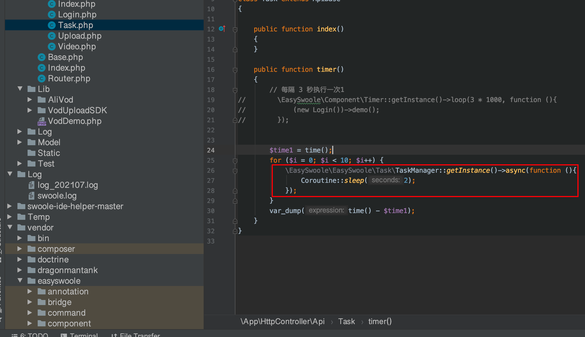

### 1.如何在控制器拿到server对象？

```php
<?php
 
ServerManager::getInstance()->getSwooleServer();
```


### 2.如何获得请求的各种参数？

```php
获取get和post的请求参数
$res = $this->request()->getRequestParam();//不能获取json方式的数据

获取请求头
$res = $this->request()->getHeaders();

获取json请求
$content = $this->request()->getBody()->__toString();
$raw_array = json_decode($content, true);

获取请求的文件信息
$request->getSwooleRequest()->files
```


### 3.如果生成一个定时器

调用loop方法即可。一般和mainServerCreate事件里面使用。在onWorkerStart事件里面，给第一个进程添加一个定时器。


### 4异步任务的使用

不能使用sleep函数，会阻塞程序。




5.


```

```

