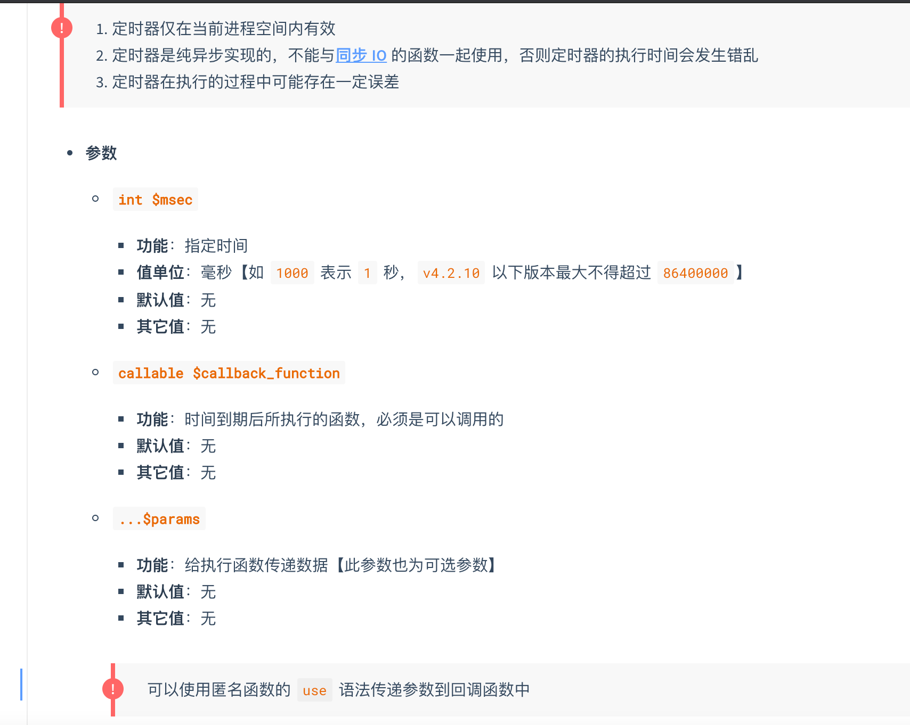
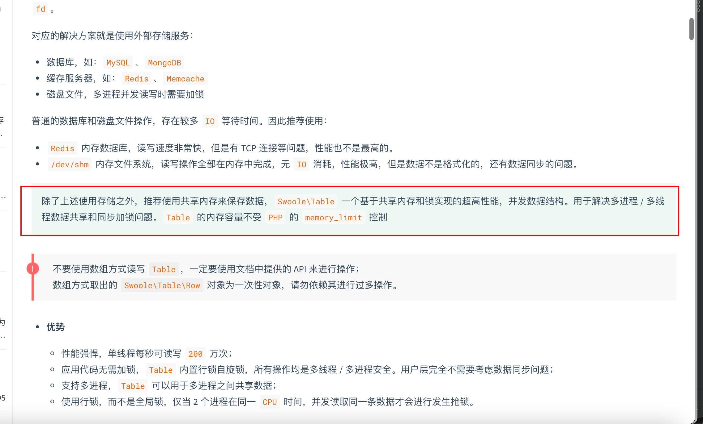

## swoole的注意事项

https://wiki.swoole.com/#/getting_started/notice

1.不要在代码中执行 `sleep` 以及其他睡眠函数，这样会导致整个进程阻塞；协程中可以使用 [Co::sleep()](https://wiki.swoole.com/#/coroutine/system?id=sleep) 或在[一键协程化](https://wiki.swoole.com/#/runtime)后使用 `sleep`；参考：[sleep/usleep 的影响](https://wiki.swoole.com/#/getting_started/notice?id=sleepusleep的影响)

2.`exit/die` 是危险的，会导致 `Worker` 进程退出；参考：[exit/die 函数的影响](https://wiki.swoole.com/#/getting_started/notice?id=exitdie函数的影响)

3.可通过 `register_shutdown_function` 来捕获致命错误，在进程异常退出时做一些清理工作；参考：[捕获 Server 运行期致命错误](https://wiki.swoole.com/#/getting_started/notice?id=捕获server运行期致命错误)

4`PHP` 代码中如果有异常抛出，必须在回调函数中进行 `try/catch` 捕获异常，否则会导致工作进程退出；参考：[捕获异常和错误](https://wiki.swoole.com/#/getting_started/notice?id=捕获异常和错误)

5.新手非常容易犯这个错误，由于 `Swoole` 是常驻内存的，所以加载类 / 函数定义的文件后不会释放。因此引入类 / 函数的 php 文件时必须要使用 `include_once` 或 `require_once`，否则会发生 `cannot redeclare function/class` 的致命错误。


6.内存管理

在回调函数中使用局部对象和变量时，当执行完进行return时，这些变量会被释放。当其过程中如果有全局变量global定义的等等全局变量，不会释放。所以要注意内存泄露的问题。


7.进程隔离,多个worker进程之间不能通过全局变量共享数据，可以通过redis，table内存来共享。


全局变量在不同的进程中也不能共享。

不同进程的文件句柄也是隔离的，也不能共享

需要共享数据的话，应该使用redis，或者swoole的table


8php随机数注意事项。


## swoole版本查看命令

```
php --ri swoole
```


## Swoole使用的各种例子

**https://github.com/swoole/swoole-src/tree/master/examples**


## 1.进程管理

swoole是一个多进程，多线程的服务

swoole的进程管理，启动swoole服务时，会启动一个master主进程和一个manager进程。

master主进程负责创建多个线程来接受和处理用户请求。

同时生成一个manager进程，manager进程负责生成和管理N多个worker和task进程。
执行一些时间比较长的任务时，会调用task进程，worker进程。


进程与进程之间是通过管道来进行通信的。

线程和线程之间是通过锁机制来实现的。

## 2.查看设置时worker进程数量。


## 3.swoole的服务端tcp例子

server端的构造方法参数。

// 参数说明

$host参数用来指定监听的ip地址 0.0.0.0监听全部地址

$port监听的端口，如9501 0-1024之间，是系统默认保留的，所在建议从5000

$mode运行的模式 SWOOLE_PROCESS多进程模式（默认） SWOOLE_BASE基本模式

使用http服务器时可以研究一下是否使用SWOOLE_BASE模式。


$sock_type指定Socket的类型 支持TCP、UDP等


```php
$server = new Swoole\Server('127.0.0.1', 9501);
$server->set(array(
    'worker_num' => 20, //一般设置为服务器CPU数的1-4倍
    'max_request' => 50,
    //"task_ipc_mode " => 3, //使用消息队列通信，并设置为争抢模式
    //"log_file" => "log/taskqueueu.log" ,//日志
));

//监听连接进入事件
//$fd客户端标识，比如数字1
$server->on('Connect', function ($server, $fd) {
    echo "Client: {$fd}Connect.\n";
});

//监听数据接收事件
$server->on('Receive', function ($server, $fd, $reactor_id, $data) {
    $data = json_encode($data);
    $server->send($fd,'处理好的数据：'.$data);//把数据返回给客户端。
    echo "Client: {$fd},reactor_id:{$reactor_id},say:{$data}.\n";
});

//监听连接关闭事件
$server->on('Close', function ($server, $fd) {
    echo "Client: {$fd}Close.\n";
});

//启动服务器
$server->start();
```


## 4.swoole客户端。

```php
class SwooleClient
{  
    private $client;

    public function __construct()  
    {  
        $this->client = new Swoole\Client(SWOOLE_SOCK_TCP);
        $this->client->set(array(
            'open_eof_check' => true,   //打开EOF检测
    				'package_eof'    => "\r\n", //设置EOF,包之间的分隔符
            'package_max_length' => 1024 * 1024 * 2,//设置一个包的最大数据包尺寸，单位为字节。默认2m
        ));
    }  
  
    public function connect()  
    {  
        if (!$this->client->connect("127.0.0.1", 9501, -1)) {
            throw new \Exception(sprintf('Swoole Error: %s', $this->client->errCode));
        }  
    }  
  
    public function send($data)  
    {  
        if ($this->client->isConnected()) {  
            if (!is_string($data)) {  
                $data = json_encode($data);  
            }
            return $this->client->send($data);  
        } else {  
            throw new \Exception('Swoole Server does not connected.');
        }  
    }  
  
    public function close()  
    {  
        $this->client->close();  
    }  
  
    public function recv()
    {
      //接受数据
       $data = $this->client->recv();
      //自己分包,包可能是1个或多个,自己分包效率比较高
       $dataArray = explode('#',$data);
       //过滤掉空包
       $dataValid = array_filter($dataArray,function ($v,$k) {
         return !empty($v);
       },ARRAY_FILTER_USE_BOTH);
      
      return $dataValid;
    }
}  

```

构造方法的参数，一般默认即可。如果需要长链接，参照下面的swoole_keep即可。


tcp链接的粘包问题


```php
public function demo()
    {
        try {
            $client = new \Swoole\Client(SWOOLE_SOCK_TCP);
            $client->set(array(
                'open_eof_check' => true,
                'package_eof' => "#",
                'package_max_length' => 1024 * 1024 * 2,
            ));
            if (!$client->connect('110.40.143.132',5678, -1)) {
                exit("connect failed. Error: {$client->errCode}\n");
            }
            while (true) {
                $data = $client->recv();
                $data_arr = explode('#',$data);//自己分包,包可能是1个或多个

                //过滤掉空包
                $data_valid = array_filter($data_arr,function ($v,$k) {
                    return !empty($v);
                },ARRAY_FILTER_USE_BOTH);

                //一个或多个元素
                foreach ($data_valid as $k => $v) {
                    $v = explode('>',$v);
                    var_dump($v[0],$v[1]);
                }

                //心跳
                if (redis()->set('heart:lock',date('Y-m-d H:i:s'),['nx', 'ex' => 30]) && $client->isConnected()) {
                    var_dump($client->send('heart'));
                }
            }
        } catch (\Exception $e) {
            //发邮件1
            send_email_by_submail('1021103065@qq.com','heart err','file:'.$e->getFile().PHP_EOL.'msg:'.$e->getMessage());
            //errorLog('client_error', $e);
        }
    }
```

## 5.httpServer,用swoole做web服务器。

```php
class HttpServer {

    private static $handler = null;
    private        $http    = null;

    public function __construct() {
        $this->http = new Swoole\Http\Server("0.0.0.0", 6060);
        $this->http->on('request', [$this,'reqFun']);

        $this->http->start();
    }


    public function reqFun (swoole_http_request $request, swoole_http_response $response) {
        // 添加响应头
        $response->header('Content-Type','text/html;charset=utf-8');
        // 添加状态码
        #$response->status(404);
        // 发送到客户端浏览器
        $response->end("<h1>你好世界</h1>");
    }
}

$server = new HttpServer();
```


```php
<?php
$http = new Swoole\Http\Server("0.0.0.0", 6060);

// 定义mime库指向
$mimes = [
    'php' => 'text/html;charset=utf-8',
    'html' => 'text/html;charset=utf-8',
    'jpg' => 'image/jpeg',
    'jpeg' => 'image/jpeg',
];


$http->set(array(
    // 设置启动时work数量
    'worker_num' => 2,
    // 静态资源 mime
    'document_root' => '/www-data/swoole/web',//指定静态资源文件路径
    'enable_static_handler' => true,//是否开启静态资源
));

// 接受客户端请求事件
$http->on('request', function (swoole_http_request $request, swoole_http_response $response) use ($mimes) {
    // 动态服务器

    // 定义网站根目录
    $dirpath = '/www-data/swoole/web';
    // 得到请求的文件名称和相对路径
    $file = $request->server['request_uri'];
    // 得到扩展名,转为小写
    $ext = strtolower(pathinfo($file, PATHINFO_EXTENSION));

    // 文件路径
    $filepath = $dirpath . $file;

    if (file_exists($filepath)) { // 文件存在，而且是PHP的
        $status = 200;

        $_GET = $request->get;
        $_POST = $request->post;
        $_FILES = $request->files;
        #$_REQUEST = $_GET ?? $_POST;

        // put  delete
        $rawData = $request->rawContent();

        // 暂存区
        // 开启暂存区
        ob_start();
        include $filepath;
        // 从暂存区中读取数据
        $data = ob_get_contents();
        // 清空
        ob_end_clean();
    } else {
        $status = 404;
        $ext = 'html';
        $data = '<h3>文件丢了</h3>';
    }

    // 状态码
    $response->status($status);
    // 设置mime头
    $response->header('Content-Type', $mimes[$ext]);
    // 发送到客户端浏览器
    $response->end($data);
});
$http->start();


```

## 6.websocket

onMessage回调函数的参数说明


```php
<?php
class Websocket {
    public $server;
    public function __construct() {
        //WebSocket\Server 继承自 Http\Server
        $this->server = new Swoole\WebSocket\Server("0.0.0.0", 9502);

        $this->server->set(array(
            // 设置启动时work数量
            'worker_num' => 20, //一般设置为服务器CPU数的1-4倍
            //'daemonize' => 1, //1以守护进程执行
            //'max_request' => 50,
            // 静态资源 mime
            'document_root' => '/home/wwwroot',
            'enable_static_handler' => true,
        ));

        //注册事件函数
        $this->server->on('open', [$this,'onOpen']);
        $this->server->on('close', [$this,'onClose']);
        $this->server->on('message', [$this,'onMessage']);
        $this->server->on('request', [$this,'onRequest']);
        $this->server->start();
    }

  //当 WebSocket 客户端与服务器建立连接并完成握手后会回调此函数。onOpen 事件函数中可以调用$server->push //向客户端发送数据或者调用 close 关闭连接。
    public function onOpen($server, $request)
    {
        echo "client:{$request->fd},connect success\n";
    }

    public function onMessage(Swoole\WebSocket\Server $server, $frame)
    {
        // 服务器端主动向客户端发送消息
        //$frmae->data 客户端发过来的数据
        // 服务器端向客户端发送消息
      //$frame->fd客户端clientid
        echo "receive from {$frame->fd}:{$frame->data}\n";
        $server->push($frame->fd, "this is server");
    }

    public function onClose($ser, $fd)
    {
        // 客户端关闭连接时或者主动关闭链接时会，触发此回调函数
        echo "client {$fd} closed\n";
    }

    public function onRequest($request, $response)
    {
        //WebSocket\Server 继承自 Http\Server，所以 Http\Server 提供的所有 API 和配置项都可以用，request方法就是http_serve的方法。
        // 接收http请求从get获取message参数的值，给用户推送
        // $this->server->connections 遍历所有websocket连接用户的fd，给所有用户推送
        foreach ($this->server->connections as $fd) {
            // 需要先判断是否是正确的websocket连接，否则有可能会push失败
            if ($this->server->isEstablished($fd)) {
                $this->server->push($fd, $request->get['message']);
            }
        }
    }

    public function run()
    {
        new Websocket();
    }
}
new Websocket();
```


## 7.毫秒定时器


有tick和after，clear三种方法

tick是每段指定时间后执行一次。会执行多次

after是间隔指定时间段后执行一次，后面就不执行了。会执行一次。如果要传参数进callback函数，可以用use关键字传递参数进去。


其中tick和after方法的参数如下,且这两个方法的返回值是一个定时器id，使用clear（）方法时，传入定时器id即可删除定时器。



```php
$param1 = 'zwl';
$param2 = 'aaa';
$path = __DIR__.'/demo.txt';
$res = swoole_timer_tick(2000,function () use ($param1, $param2, $path) {
    file_put_contents($path,'1'.PHP_EOL,FILE_APPEND);
});
```


Swoole\Event::wait();是使程序阻塞在某个地方。一般在程序的末尾。

​	


## 8.异步读取文件

（swoole_async_readfile()和swoole_async_read()）已经废弃


## 9.异步mysql客户端，目前官网不推荐使用。

4.0版本已经移除了异步客户端，用协程客户端代替。


## 10.多进程与管理

多进程能把耗时的任务，分解给多个子进程同时执行

如何查看进程之间的关系？可以使用命令

pstree -p 22727


使用多进程，处理项目对应的逻辑。如果用同步的方式，会耗时6秒。如果用多进程的方式会耗时1秒。具体的使用可参考官方文档。

```php
<?php
/**
 * Created by PhpStorm.
 * User: baidu
 * Date: 18/3/17
 * Time: 上午12:31
 */

echo "process-start-time:".date("Ymd H:i:s");
$workers = [];
$urls = [
    'http://baidu.com',
    'http://sina.com.cn',
    'http://qq.com',
    'http://baidu.com?search=singwa',
    'http://baidu.com?search=singwa2',
    'http://baidu.com?search=imooc',
];

for($i = 0; $i < 6; $i++) {
    // 子进程，创建一个worker进程，执行对应到逻辑
    $process = new swoole_process(function(swoole_process $worker) use($i, $urls) {
        // curl
        $content = curlData($urls[$i]);

        //将内容输出到管道，可以直接echo，也可以通过 $worker->write($content.PHP_EOL);方法
        //echo $content.PHP_EOL;
        $worker->write($content.PHP_EOL);
    }, true);
    $pid = $process->start();
    $workers[$pid] = $process;
}

foreach($workers as $process) {
    echo $process->read();
}
/**
 * 模拟请求URL的内容  1s
 * @param $url
 * @return string
 */
function curlData($url) {
    // curl file_get_contents
    sleep(1);
    return $url . "success".PHP_EOL;
}
echo "process-end-time:".date("Ymd H:i:s");

//创建完子进程后，必须使用wait进行回收。
```


```php
Swoole\Process::signal(SIGCHLD, function ($sig) {
    //必须为false，非阻塞模式
    while ($ret = Swoole\Process::wait(false)) {
        echo "PID={$ret['pid']}\n";
    }
});
```

```php
use app\service\DataMigration;

$date = '2021-05-01';
$table = 'hyper_transaction_history_bonus_202108';
for ($i = 0; $i < 30; $i++) {
    $process = new swoole_process(function (swoole_process $worker) use ($date, $table) {
        $code = DataMigration::bonusDetailMigrate($date, $table);
        $worker->write($code);
    }, true);
    $process->start();

    swoole_event_add($process->pipe, function ($pipe) use ($process) {
        echo $process->read();
        swoole_event_del($pipe);
    });
}

echo "ok.\n";

while ($ret = swoole_process::wait()) {
    echo PHP_EOL . "Worker Exit, PID=" . $ret['pid'] . PHP_EOL;
}
```


## 11.协程

最简单的定义为：协程是一种用户态的线程，它不由操作系统而是由用户创建，创建销毁和切换的成本非常低，遇到`io`操作会自动让出`cpu`执行权，交给其它协程去执行。


对于Swoole这样的有栈协程，你完全可以简单地将其看做是一个栈切换器，你可以在运行的子程序中随意切换到另一个子程序，底层会保存好被切走的协程的执行位置，回来时可以从原先的位置继续往下运行。


理解协程前，先明确什么事异步io？

异步IO，异步读写

异步io传统的话需要结合异步回调函数，来实现。

所谓的「异步」不过是多路复用带来的观感效果，你的程序不会阻塞在一个IO上，而是在无事可干的时候再阻塞在一堆IO上，即**IO操作不在你需要CPU的时候阻塞你，你就不会感受到IO阻塞的存在**。

比如以前公司到饭点时去外面饭店吃饭。此时可以将饭店做饭的操作比作io操作（30分钟），此操作需要等待一段时间，而且这段时间你不在公司，不能继续敲代码只能在饭店那里傻等一段时间，其实这就是一个同步io阻塞操作。

现在有了外卖，可以提前将要点的菜在软件上告诉饭店（5分钟），然后你就可以电脑面前继续敲代码，在这段阻塞的等待的时间内，你就能忙其他的事了。由原本的等30分钟变成等5分钟，所以异步的效率就更高了。


现在有协程了，可以结合异步方式，消灭异步回调的编码方式。当遇到阻塞操作时当前**协程让出CPU执行权**，并将阻塞操作交给其他协程来处理，也称协程挂起。此时程序就会继续往下执行其他的逻辑，不会阻塞。在挂起时，底层会保存好协程的执行位置，在执行完成后，可以从原先的位置继续往下运行。

协程可以通过同步的代码，写出异步的执行效果。


使用 `Coroutine::create` 或 `go` 方法创建协程，在创建的协程中才能使用协程 `API`，而协程必须创建在协程容器里面.

协程的使用，首先需要创建一个协程容器，创建协程容器有下面3种方法。


### 手动测试携程时，必须先创建协程容器(run（）一个容器出来，然后容器内部使用go（）创建一个协程出来。如果有多个io操作必须要用go创建多个协程，才能有协程效果。不然多个io操作，只创建一个协程。其他io操作就会出现同步阻塞的情况。 )

创建协程有两种方法

1.使用 Coroutine::create()

```
Coroutine::create();
```


2. Go方法创建协程

```
go();
```

//测试协程

```
<?php
//协程测试
use Swoole\Coroutine;
use function Swoole\Coroutine\run;

//\Swoole\Runtime::enableCoroutine();
$s = microtime(true);

//创建一个协程容器
run(function () {
    for ($c = 100; $c--;) {

        //创建一个协程
        go(function () {
//            for ($n = 100; $n--;) {
                Co::sleep(8);
//            }
        });
    }
});
echo 'use ' . (microtime(true) - $s) . ' s';
```


在for循环里面，进行一个携程sleep，就能快速下入下一个循环，这样就能快速开始多个携程


## 12协程中保存一些变量


## 12内存表Table

使用场景如下，性能比redis牛逼不少。可以跨进程进行变量共享。



但不能分布式。多台机器之间不能共享内存。

```php
<?php
/**
 * Created by PhpStorm.
 * User: baidu
 * Date: 18/3/18
 * Time: 下午10:00
 */
// 创建内存表
$table = new swoole_table(1024);

// 内存表增加一列
$table->column('id', $table::TYPE_INT, 4);
$table->column('name', $table::TYPE_STRING, 64);
$table->column('age', $table::TYPE_INT, 3);
$table->create();

$table->set('singwa_imooc', ['id' => 1, 'name'=> 'singwa', 'age' => 30]);


// 另外一种方案
$table['singwa_imooc_2'] = [
    'id' => 2,
    'name' => 'singwa2',
    'age' => 31,
];

$table->decr('singwa_imooc_2', 'age', 2);
print_r($table['singwa_imooc_2']);

echo "delete start:".PHP_EOL;
$table->del('singwa_imooc_2');

print_r($table['singwa_imooc_2']);
```


## 13.平滑重启

可以在onStart函数中，绑定管理进程的名字

```
 /**
     * Notes:设置进程名字
     * User: 闻铃
     * DateTime: 2021/6/27 下午10:23
     * @param $server
     */
    public function onStart($server)
    {
        swoole_set_process_name("swoole_server");
    }
```

然后写一个shell脚本

```
echo "reloading..."
pid=`pidof swoole_server`
kill -USR1 $pid
echo "reload success"
```

每次修改后，执行shell脚本即可。


pidof 进程名称 获取进程id


优雅的关闭swoole服务，执行完当前请求的任务后，关闭,发送 -15信号即可。

kill -15 主进程PID


特别注意事项

- **APC/OpCache**

  如果 `PHP` 开启了 `APC/OpCache`，`reload` 重载入时会受到影响，有 `2` 种解决方案

  - 打开 `APC/OpCache` 的 `stat` 检测，如果发现文件更新 `APC/OpCache` 会自动更新 `OpCode`
  - 在 `onWorkerStart` 中加载文件（require、include 等函数）之前执行 `apc_clear_cache` 或 `opcache_reset` 刷新 `OpCode` 缓存


## 14.通道channel

理解为消息队列即可,主要用于协程之间的通信


可以理解成消息队列


## 15每次修改了swoole模块的代码后，记得重启

一定要重启swoole服务，才能生效。因为swoole服务器说常驻内存的，需要重启才能加载更新后的代码


要设置好对应的参数才能重启


如果swoole_server的名字叫swoole_server，则执行下面语句即可

```bash
echo "loading..."
pid=`pidof swoole_server`
echo $pid
kill -USR1 $pid
echo "loading success"
```


pidof 进程名称 获取进程id


优雅的关闭swoole服务，执行完当前请求的任务后，关闭,发送 -15信号即可。

kill -15 主进程PID


## 16swoole异步任务文章

swoole的task进程中，默认不支持协程，是同步阻塞模块。如果需要协程，需要开启下图中的设置


1.swoole异步任务

首先明确其用途

1.swoole异步能解决什么样的问题？

相信大家在现在或未来的工作中，都会在遇到下面的一些问题。

问题1.测试同事说，哇这个接口好慢呀，平均响应时间都超过2秒了。能不能优化一下啊？然后自己一个，原来这里有个发邮件或者发短信验证码的操作。仔细一排查原来是因为第三方接口响应慢，导致自己的接口响应也慢。


这时swoole异步任务就很适合解决这种问题了。可以把这个操作投递到 TaskWorker 进程池中执行，投递后程序会立即返回，程序继续向下执行代码，不会拖慢当前的进程的处理速度。


这种场景只是举例，业务中如果还有类似的操作，都可以丢到异步任务中执行。


然后学习如何使用

2.swoole异步任务要如何使用？

知道能解决什么问题了，那要怎么去使用呢？

首先先捋清楚使用的大概逻辑。逻辑：我们需要创建一个swoole服务，然后通过客户端把任务send到服务端，最后服务端接受到数据后，执行对应的操作，结束。


我结合自己的使用经历，总结了下面3个步骤。PS：自己先安装好swoole扩展哦

1.创建一个swoole服务

2.将任务投递到task进程池中

3.在task中编写自己的要执行的操作


2.1	创建一个swoole服务，其实就是初始化swoole\server对象

因为task任务是swoole\server对象的方法，所以我们需要先new 一个 swoole\server对象，并设置对象的一些配置和注册一些方法，就能调用了。

初始化时

必须要设置的点

1. task_worker_num	task进程的数量

2. 注册onTask和onFinish这两个方法

   

下面是我封装的初始化swoole\server对象代码，可供参考。其中自行添加类对应的命名空间即可。

```php
class Server
{
    private $serv;

    public function __construct()
    {
      	//new一个swoole\server对象，可以new Swoole\Server('127.0.0.1', 9501)这样写，也可以new \swoole_server("127.0.0.1", 9501)这样写，别名而已，其实都是一样的。
      //其中127.0.0.1是指定监听的 ip 地址。IPv4 使用 127.0.0.1 表示监听本机，0.0.0.0 表示监听所有地址一般监听本机即可
      //$port监听的端口，如9501 0-1024之间，是系统默认保留的，所在建议从5000开始，一般使用默认的9501
        $this->serv = new \swoole_server("127.0.0.1", 9501);
      
       //配置参数
        $this->serv->set(array(
          'task_worker_num' => 200, //task进程的数量
          
          //下面是一些常用的配置参数说明
            //'worker_num' => 32, //worker进程数量一般设置为服务器CPU数的1-4倍1
            //'daemonize' => 1, //111以守护进程执行11
            //'max_request' => 2000,
            //'dispatch_mode' => 3,//抢占模式，主进程会根据Worker的忙闲状态选择投递，只会投递给处于闲置状态的Worker
            //"task_ipc_mode " => 1, // 使用Unix Socket通信，默认模式
            //"log_file" => "log/taskqueueu.log" ,//日志
        ));
      
      	// bind事件对应的方法。
      
      	//当客户端发送数据时，会触发Receive函数。此方法中能接受到客户端send的参数
        $this->serv->on('Receive', array($this, 'onReceive'));
        
      	//在task方法中，执行对应的操作
        $this->serv->on('Task', array($this, 'onTask'));
      
        //当任务执行完成后，会触发在finish事件。
        $this->serv->on('Finish', array($this, 'onFinish'));
      
      	//启动swoole服务
        $this->serv->start();
    }

   //$serv是swoole\server对象，$fd是连接的文件描述符，$from_id是TCP 连接所在的 Reactor 线程 ID，$data收到的数据内容，可能是文本或者二进制内容
    public function onReceive($serv, $fd, $from_id, $data)
    {
        //把数据转发到task中
        $serv->task($data);
    }

    public function onTask($serv, $task_id, $from_id, $data)
    {
      //暂时留空 2.3部分会完善
    }

   //
    public function onFinish($serv, $task_id, $data)
    {
        //echo "Task {$task_id} finish\n";
        //echo "Result: {$data}\n";
    }

    //调用这个runStart方法，即可创建一个swoole服务。我这边是在TP中啦，在public目录下，执行php index.php api/server/runStart 这段命令，即启动swoole。通过netstat -tunlp 看是否启动成功
    public function runStart()
    {
        new Server();
    }
}
```


2.2	将任务投递到task进程池中

通过客户端类的send方法即可投递到swoole服务中

```php
class SwooleClient
{  
    private $client;

    public function __construct()  
    {  
        $this->client = new Swoole\Client(SWOOLE_SOCK_TCP);
    }  
  
    public function connect()  
    {  
       //9501要和swoole服务监听的端口号一致
        if (!$this->client->connect("127.0.0.1", 9501, -1)) {
            throw new \Exception(sprintf('Swoole Error: %s', $this->client->errCode));
        }  
    }  
  
  //投递一个数据到swoole服务中
    public function send($data)  
    {  
        if ($this->client->isConnected()) {  
            if (!is_string($data)) {  
                $data = json_encode($data);  
            }
          //拼接"\r\n"，是解决在循环场景下，投递任务可能会出现的tcp粘包问题。
            return $this->client->send($data."\r\n");  
        } else {  
            throw new \Exception('Swoole Server does not connected.');
        }  
    }  
  
    public function close()  
    {  
        $this->client->close();  
    }  
} 
```

```php
在需要投递的场景时，new 一个客户端类，把数据投递到swoole服务中
$client = new Swoolecli();
$client->connect();
if ($client->send($value)) {
   //成功，关闭链接
		$client->close();
} else {
  //异常处理
}

```


如果是在swoole的协程框架中。可以直接投递。因为是常驻内存的，内存中有初始化好的swoole对象。可以不用通过客户端的方式投递，直接$server->task($data)即可

比如

在think-swoole中可以通过下面的方式直接投递

```php
				$get = $this->request->get();
        $code = mt_rand(1111,9999);
        $phone_num = $get['phone_num'];
        $task_data = [
            'method' => 'sendSms',
            'data'   => [
                'code'       => $code,
                'phone_num'  => $phone_num
            ]
        ];
        //投递任务
        $this->app->swoole->task(json_encode($task_data));
```


在easyswoole中可以通过下面的方式直接投递

```php
$server = ServerManager::getInstance()->getSwooleServer()->task(json_encode($task_data));
```


2.3 	在task中编写自己的要执行的操作

```php
  	//执行异步任务
  	public function onTask($serv, $task_id, $from_id, $data)
    {
      //一般发送过来的数据是json数据。
    $data = json_decode($data,true);
  
    //接受到task数据，进程业务逻辑处理。我一般喜欢新建一个执行异步任务的类，统一管理对应的操作。这种这个task里面，只写3句代码就行了。
        $method = $data['method'];
        return SwooleTask::getInstance()->$method($data['data'], $serv);
    }
  	
  	
```
```php
class SwooleTask
{
    private static $obj = null;

    public static function getInstance()
    {
        if (is_null(self::$obj)) {
            self::$obj = new self();
        }
        return self::$obj;
    }

    /**
     * Notes: 发送短信验证码
     * User: 闻铃
     * DateTime: 2021/9/9 下午4:06
     * @param array $data
     * @return bool
     */
    public function sendSms($data = [])
    {
        if (empty($data)) {
            return false;
        }
        return MsgCode::send($data['phone_num'], $data['code']);
    }

    /**
     * 通过task机制推送数据给全部客户端
     * @param $data
     * @param $serv swoole server对象
     */
    public function pushLive($data, $serv) {
        //获取redis中的有序集合。
        $clients = get_redis_obj()->set();
				
        foreach($clients as $fd) {
            $serv->push($fd, json_encode($data,JSON_UNESCAPED_UNICODE));
        }
    }
}
```


3.使用时应注意什么细节？

1.swoole服务的配置有很多，应根据业务场景和环境设置合适的配置。具体配置的话请参考官方文档，如下

全部的配置：https://wiki.swoole.com/#/server/setting

下面是我总结了常用的配置

```
1.'worker_num' => 32, //一般设置为服务器CPU数的1-4倍 lscpu命令，cpus参数，即cpu核数
描述：指定启动的worker进程数。
说明：swoole是master-> n * worker的模式，开启的worker进程数越多，server负载能力越大，但是相应的server占有的内存也会更多。同时，当worker进程数过多时，进程间切换带来的系统开销也会更大。因此建议开启的worker进程数为cpu核数的1-4倍。
  
2.'ipc_mode' => 1
  描述：设置进程间的通信方式。
说明：共有三种通信方式，参数如下
  1 => 使用unix socket通信
2 => 使用消息队列通信
3 => 使用消息队列通信，并设置为争抢模式
  
3.'max_request' => 2000,
描述：每个worker进程允许处理的最大任务数。
说明：设置该值后，每个worker进程在处理完max_request个请求后就会自动重启。设置该值的主要目的是为了防止worker进程处理大量请求后可能引起的内存溢出。	
  
4.'max_conn' => 10000
  描述：服务器允许维持的最大TCP连接数
说明：设置此参数后，当服务器已有的连接数达到该值时，新的连接会被拒绝。另外，该参数的值不能超过操作系统ulimit -n的值，同时此值也不宜设置过大，因为swoole_server会一次性申请一大块内存用于存放每一个connection的信息。
 
  5.'dispatch_mode' => 3
  描述：指定数据包分发策略。
说明：共有三种模式，参数如下：
1 => 轮循模式，收到会轮循分配给每一个worker进程
2 => 固定模式，根据连接的文件描述符分配worker。这样可以保证同一个连接发来的数据只会被同一个worker处理
3 => 抢占模式，主进程会根据Worker的忙闲状态选择投递，只会投递给处于闲置状态的Worker
  
  
  
  6.'task_worker_num' => 8
  描述：服务器开启的task进程数。
说明：设置此参数后，服务器会开启异步task功能。此时可以使用task方法投递异步任务。

  7.'task_max_request' => 10000
设置此参数后，必须要给swoole_server设置onTask/onFinish两个回调函数，否则启动服务器会报错。
  描述：每个task进程允许处理的最大任务数。
说明：参考max_request task_worker_num
示例：

8.'task_max_request' => 10000
  描述：每个task进程允许处理的最大任务数。
说明：参考max_request task_worker_num
  
9.'task_ipc_mode' => 2
  描述：设置task进程与worker进程之间通信的方式。
说明：参考ipc_mode
  
  
  10.'daemonize' => 1, //以守护进程 1或0
设置程序进入后台作为守护进程运行。
说明：长时间运行的服务器端程序必须启用此项。如果不启用守护进程，当ssh终端退出后，程序将被终止运行。启用守护进程后，标准输入和输出会被重定向到 log_file，如果 log_file未设置，则所有输出会被丢弃。
  
  11.'log_file' => '/data/log/swoole.log'
  指定日志文件路径
说明：在swoole运行期发生的异常信息会记录到这个文件中。默认会打印到屏幕。注意log_file 不会自动切分文件，所以需要定期清理此文件。
  12.'heartbeat_check_interval' => 60
  设置心跳检测间隔
说明：此选项表示每隔多久轮循一次，单位为秒。每次检测时遍历所有连接，如果某个连接在间隔时间内没有数据发送，则强制关闭连接（会有onClose回调）。
  13.'heartbeat_idle_time' => 600
  设置某个连接允许的最大闲置时间。
说明：该参数配合heartbeat_check_interval使用。每次遍历所有连接时，如果某个连接在heartbeat_idle_time时间内没有数据发送，则强制关闭连接。默认设置为heartbeat_check_interval * 2。
```


2.投递任务时，如何在同一个链接,短时间内多次投递数据，可能会有数据粘包问题，解决方式如下

```php
客户端
在send时，拼接"\r\n"       
比如 $this->client->send($data."\r\n");  

服务端新增配置
  
 1.自动分包
$server->set(array(
    'open_eof_split' => true, //swoole底层实现自动分包。比较消耗cpu资源
    'package_eof' => "\r\n", //设置后缀，一般为"\r\n"
));


或者
   2.手动分包
$server->set(array(
    'open_eof_check' => true,   //打开EOF检测,每次包以EOF结尾，才send给服务端
    'package_eof'    => "\r\n", //设置EOF
))
需要在应用层代码中手动 explode("\r\n", $data) 来拆分数据包
效率比较高
  
如果对效率比较看重则使用手动分包，看场景选择合适的即可
```


4.项目实战截图

swoole异步任务的执行效率非常的高。在数据量较大的情况下，效率依然很高。

swoole的异步任务进程池效率有多高呢？手上刚好有个项目就是用swoole的异步任务的，每天异步处理6000w的新增数据量，也就6个小时左右，而且速度的瓶颈其实是卡在mysql层面。

学会了后多使用swoole异步任务，提高自己的接口响应效率吧。


## 17.waitGroup


## 18.生命周期

在server->start（）方法之前创建的变量属于，进程全局变量。不能把在请求中的变量增加到全局变量中。

因为进程全局变量不会销毁，比如全局变量是一个数组，一直往里面追加的话会引起内存泄露。

也不能给全局变量赋值。因为php的垃圾销毁机制是根据引用来判断。如果在请求中，把局部变量赋值给全局变量的话，局部变量根据垃圾销毁机制是不会呗销毁的，因为全局变量上引用了局部变量。请求越来越多的话，就一定会出问题。

注意，除了读之外，尽量不要操作全局变量。不然很容易内存泄露oom（out of memory）


## 19.channel通道

通道channel 
协程之间通信的渠道。可以理解为协程之间的消息队列


通过往channel里面push和pop消息，进行通信


典型的应用是，协程之间的连接池调用和并发调用

并发调用：
并发的调用多个请求或者其io操作。可以使用子协程和channel来操作。
比如一个协程里面，创建两个协程（子协程），然后子协程执行完之后往channel里面push，一个数据。然后主协程进行pop操作。pop两次后，就完成了并发调用的操作

其实用waitgroup代替channel的pop和push操作实现起来会更简单一些


具体的使用方式就看官方的channel的文档

https://wiki.swoole.com/#/coroutine/channel?id=coroutinechannel


如何获取协程的返回值？

在协程中return是没用的。需要借助channel实现。

可以把new 一个channel，把协程需要返回的数据写入到channel中。数据可以是数组，变量等。然后在其他地方从channel中pop出来。


## 20.父子协程优先级

父子协程优先级，优先子协程

优先执行子协程 (即 `go()` 里面的逻辑)，直到发生协程 `yield`(co::sleep 处)，然后[协程调度](https://wiki.swoole.com/#/coroutine?id=协程调度)到外层协程


### 20.1 父协程结束之后，子协程，不会立马结束退出，会执行完再退出。

```php
<?php

use Swoole\Coroutine;

Swoole\Coroutine\run(function () {
    echo "Main coroutine start\n";

    // 启动子协程
    go(function () {
        echo "Sub coroutine start\n";
        Coroutine::sleep(2);  // 模拟长时间运行任务
        echo "Sub coroutine end\n";
    });

    echo "Main coroutine end\n";
});

```

```
➜  www git:(master) ✗ php demo.php 
Main coroutine start
Sub coroutine start
Main coroutine end
Sub coroutine end
```

这表明子协程在主协程结束后继续运行，直到子协程的任务完成。因此，主协程结束并不会立即终止子协程。


## 21.异步任务


## 22.使用unix socket通信

```php


<?php
$client = new Swoole\Client(SWOOLE_SOCK_UNIX_STREAM, SWOOLE_SOCK_SYNC);
if (!$client->connect(__DIR__.'/svr.sock', 0, -1))
{
    exit("connect failed. Error: {$client->errCode}\n");
}

$client->send("hello world\n");
echo $client->recv();
$client->close();

sleep(1);
```

