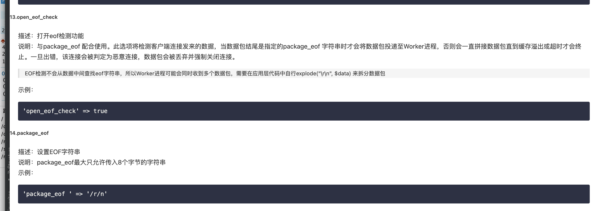

详细用法可参考我之前写的一篇文章（写的超详细哦）（https://segmentfault.com/a/1190000040659266）
1.封装好的server类

```php
class Server
{
    private $serv;

    public function __construct()
    {
        $this->serv = new \swoole_server("127.0.0.1", 9501);
        $this->serv->set(array(
            'worker_num' => 32, //一般设置为服务器CPU数的1-4倍1
            'daemonize' => 1, //111以守护进程执行11
            'max_request' => 2000,
            'dispatch_mode' => 3,//抢占模式，主进程会根据Worker的忙闲状态选择投递，只会投递给处于闲置状态的Worker
            'task_worker_num' => 200, //task进程的数量
            "task_ipc_mode " => 1, // 使用Unix Socket通信，默认模式
            //"log_file" => "log/taskqueueu.log" ,//日志
        ));
        $this->serv->on('Receive', array($this, 'onReceive'));
        // bind callback
        $this->serv->on('Task', array($this, 'onTask'));
        $this->serv->on('Finish', array($this, 'onFinish'));
        $this->serv->start();
    }

    public function onReceive($serv, $fd, $from_id, $data)
    {
        redis()->lPush('data_list',$data);
        $serv->task($data);
    }

    public function onTask($serv, $task_id, $from_id, $data)
    {
        $bonus_obj = BonusCheck::getInstance();
        if ($data['bonus_type'] == 1) {
            //静态释放
            unset($data['bonus_type']);
            $bonus_obj->checkRecord($data);
        } else {
            //动态释放
            unset($data['bonus_type']);
            $bonus_obj->checkBonus($data);
        }
    }

    public function onFinish($serv, $task_id, $data)
    {
        //echo "Task {$task_id} finish\n";
        //echo "Result: {$data}\n";
    }


    public function runStart()
    {
        new Server();
    }
}

异步任务的参数设置：https://m.w3cschool.cn/swoole/swoole-setting.html

1.'worker_num' => 32, //一般设置为服务器CPU数的1-4倍 lscpu命令，cpus参数，即cpu核数
描述：指定启动的worker进程数。
说明：swoole是master-> n * worker的模式，开启的worker进程数越多，server负载能力越大，但是相应的server占有的内存也会更多。同时，当worker进程数过多时，进程间切换带来的系统开销也会更大。因此建议开启的worker进程数为cpu核数的1-4倍。
  
2.'ipc_mode' => 1
  描述：设置进程间的通信方式。
说明：共有三种通信方式，参数如下
  1 => 使用unix socket通信
2 => 使用消息队列通信
3 => 使用消息队列通信，并设置为争抢模式
  
3.'max_request' => 2000,
描述：每个worker进程允许处理的最大任务数。
说明：设置该值后，每个worker进程在处理完max_request个请求后就会自动重启。设置该值的主要目的是为了防止worker进程处理大量请求后可能引起的内存溢出。	
  
4.'max_conn' => 10000
  描述：服务器允许维持的最大TCP连接数
说明：设置此参数后，当服务器已有的连接数达到该值时，新的连接会被拒绝。另外，该参数的值不能超过操作系统ulimit -n的值，同时此值也不宜设置过大，因为swoole_server会一次性申请一大块内存用于存放每一个connection的信息。
 
  5.'dispatch_mode' => 3
  描述：指定数据包分发策略。
说明：共有三种模式，参数如下：
1 => 轮循模式，收到会轮循分配给每一个worker进程
2 => 固定模式，根据连接的文件描述符分配worker。这样可以保证同一个连接发来的数据只会被同一个worker处理
3 => 抢占模式，主进程会根据Worker的忙闲状态选择投递，只会投递给处于闲置状态的Worker
  
  
  
  6.'task_worker_num' => 8
  描述：服务器开启的task进程数。
说明：设置此参数后，服务器会开启异步task功能。此时可以使用task方法投递异步任务。

  7.'task_max_request' => 10000
设置此参数后，必须要给swoole_server设置onTask/onFinish两个回调函数，否则启动服务器会报错。
  描述：每个task进程允许处理的最大任务数。
说明：参考max_request task_worker_num
示例：

8.'task_max_request' => 10000
  描述：每个task进程允许处理的最大任务数。
说明：参考max_request task_worker_num
  
9.'task_ipc_mode' => 2
  描述：设置task进程与worker进程之间通信的方式。
说明：参考ipc_mode
  
  
  10.'daemonize' => 1, //以守护进程 1或0
设置程序进入后台作为守护进程运行。
说明：长时间运行的服务器端程序必须启用此项。如果不启用守护进程，当ssh终端退出后，程序将被终止运行。启用守护进程后，标准输入和输出会被重定向到 log_file，如果 log_file未设置，则所有输出会被丢弃。
  
  11.'log_file' => '/data/log/swoole.log'
  指定日志文件路径
说明：在swoole运行期发生的异常信息会记录到这个文件中。默认会打印到屏幕。注意log_file 不会自动切分文件，所以需要定期清理此文件。
  12.'heartbeat_check_interval' => 60
  设置心跳检测间隔
说明：此选项表示每隔多久轮循一次，单位为秒。每次检测时遍历所有连接，如果某个连接在间隔时间内没有数据发送，则强制关闭连接（会有onClose回调）。
  13.'heartbeat_idle_time' => 600
  设置某个连接允许的最大闲置时间。
说明：该参数配合heartbeat_check_interval使用。每次遍历所有连接时，如果某个连接在heartbeat_idle_time时间内没有数据发送，则强制关闭连接。默认设置为heartbeat_check_interval * 2。
示例：
```

2.投递任务时，如何在同一个链接,多次投递数据，会有数据粘包问题。

也可以参考server的配置参数



比如

```php
$client = new Swoolecli();
$client->connect();
 
for($i = 0;$i<10;$++) {
	$client->send($data);
}
```


如果每次新开一个链接就不会有这个问题

```php

for($i = 0;$i<10;$++) {
  $client = new Swoolecli();
  $client->connect();
	$client->send($data);
}
```


```
swoole异步任务

```

