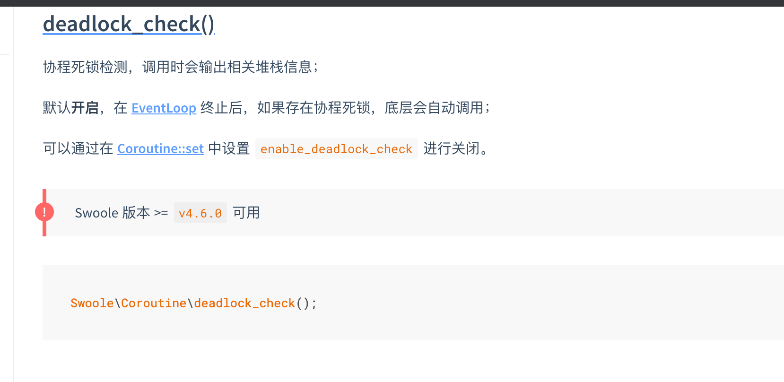

### 1.bug截图，协程死锁。

协程死锁检测。可以不打开。没关系的。





### 2.swoole日志中有如下信息

WARNING Worker_reactor_try_to_exit (ERRNO 9012): worker exit timeout, forced termination

问题原因：Worker 进程内的 定时器 或者 event::add 句柄未清理导致。


解决方法

设置两个参数

```php
'reload_async'             => true,//异步重启
'max_wait_time'            => 5//设置 Worker 进程收到停止服务通知后最大等待时间
```

注册onWorderExit回调，在回调中删除定时器或者事件

```php
public function onWorkerExit(Server $server, int $worker_id)
    {
        Timer::clearAll();
        swoole_event_del($this->process->pipe);
    }
```