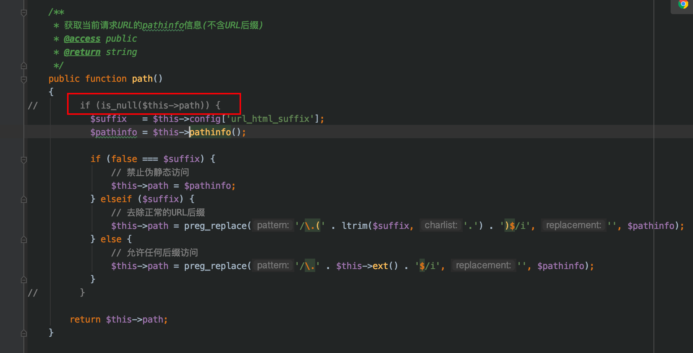
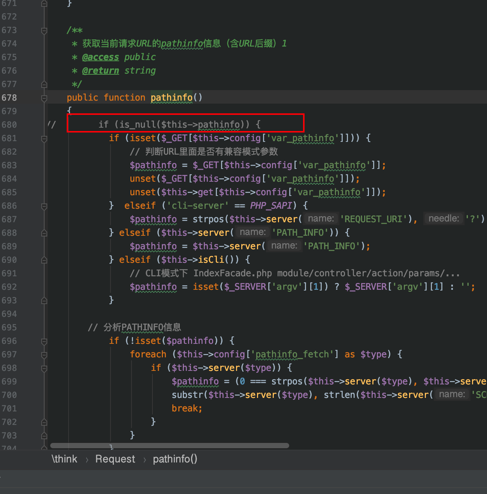
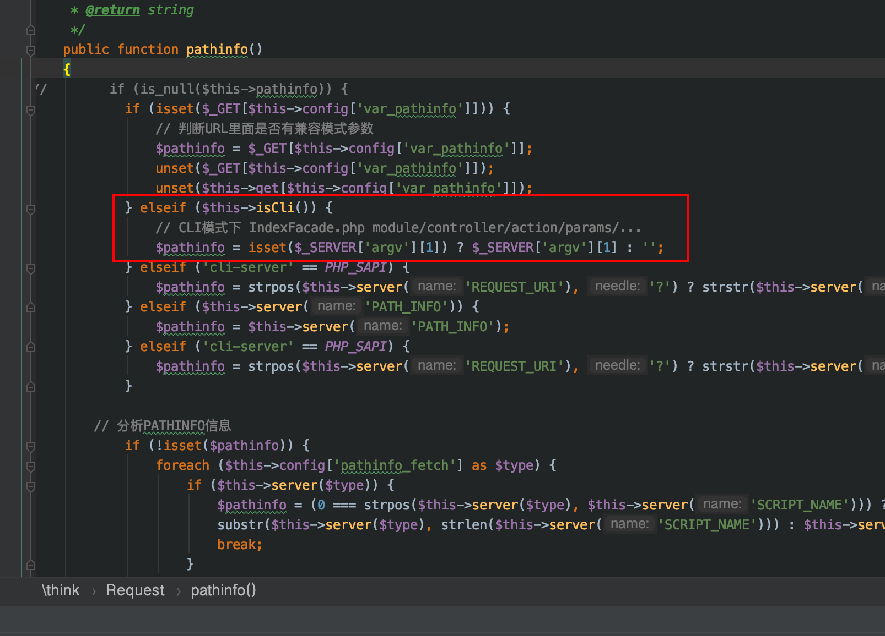
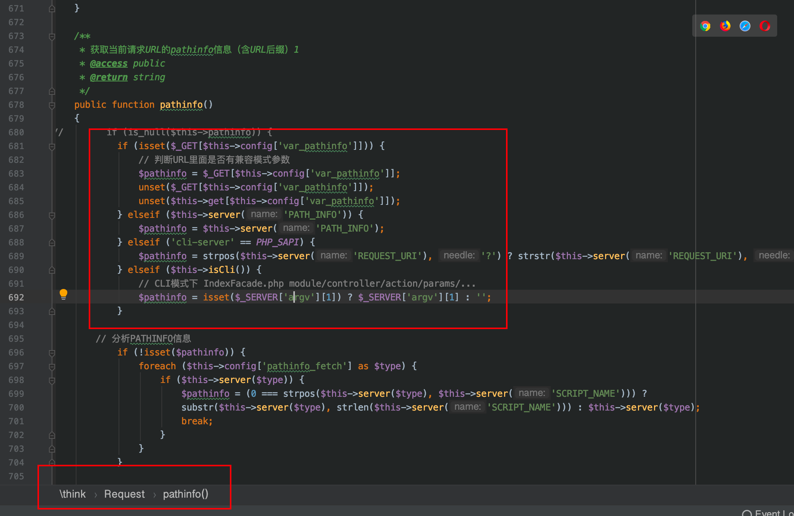
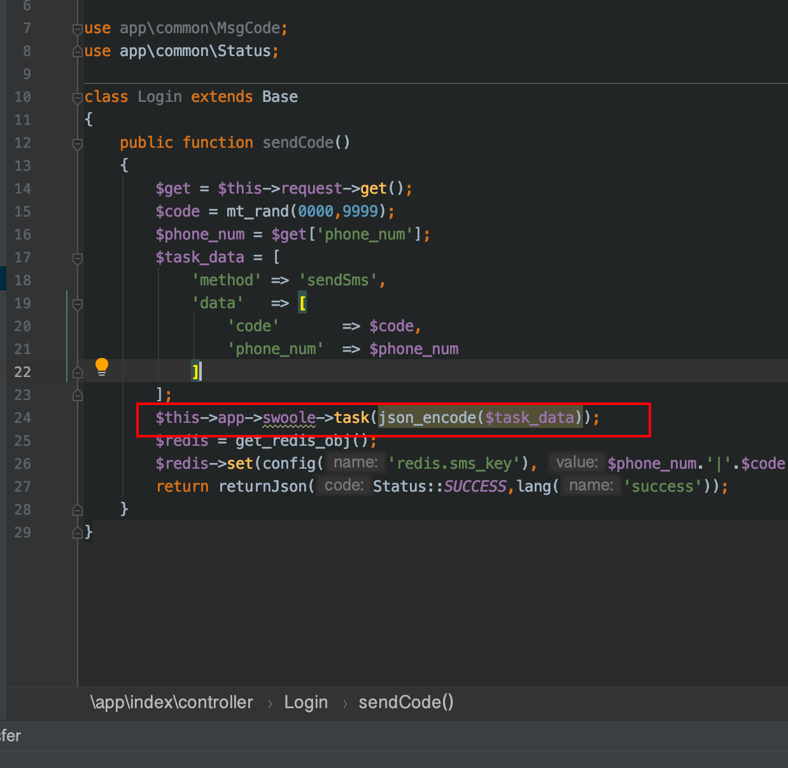

thinkphp的官方文档

### 1.安装think-swoole扩展topthink/think-swoole


### 2.然后在config目录中新建一个swoole.php的配置文件，其中可以配置很多swoole的set方法的参数。

```php
<?php
return [
    'host'                  => '0.0.0.0',
    'port'                  => 8811,
    'worker_num'            => 4,
    'max_request'           => 100,
    'daemonize'             => false,
    'task_worker_num'       => 50, //task进程的数量
    'dispatch_mode'         => 3,//抢占模式，主进程会根据Worker的忙闲状态选择投递，只会投递给处于闲置状态的Worker
    'app_path'              => '/home/wwwroot/tp51_swoole/application/',
    'enable_static_handler' => true,//是否开启静态资源
    'document_root'         => '/home/wwwroot/tp51_swoole/public/static/',//指定静态资源文件路径
];
```


### 3.然后php think swoole start 后正常的使用即可


### 4.多次请求时走都到第一次请求的方法中，因为tp底层这里，有判断，把判断去掉即可。






### 5.路由解析时，thinkphp5.1版本自带的代码，有点问题。

当浏览器直接访问url时，比如http://47.97.185.94:8811/index/task/demo

tp底层按照原来的写法，会走到第二种判断，然后$_SERVER中没有argv这个参数，会把pathinfo赋值为空。会默认走到 index模块的index控制器的index方法。



应该修改为下面的方式，将isCli放在后面去判断，即可解析对应的路径。




### 6.在app目录中想要使用http—server,可以通过这样的方式使用。比如使用task异步任务，可以直接如下图这样使用。



