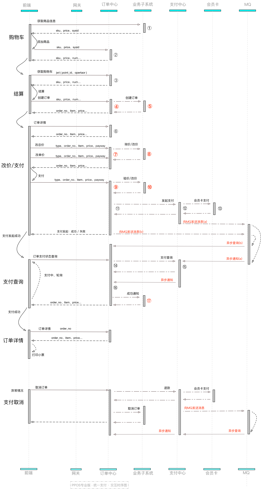
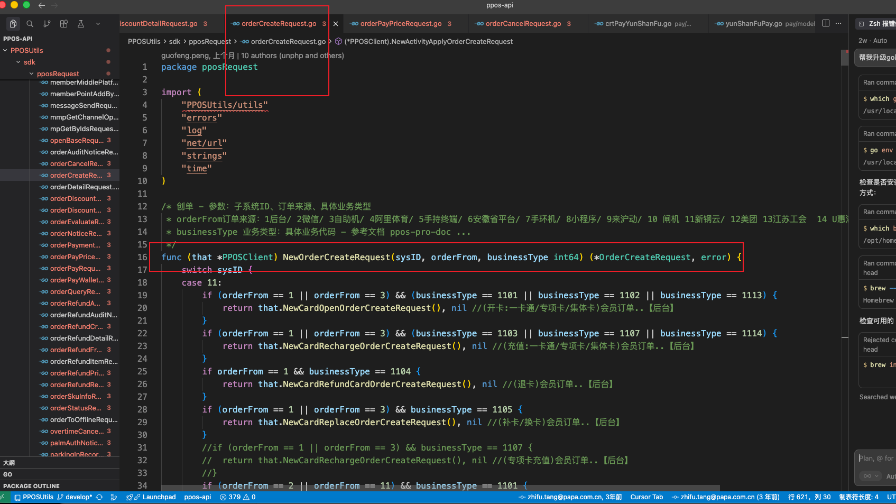

#### 统一支付流程




1. 前端 调用 业务系统处理报名逻辑 activityPlatform/wxActivity/apply  返回一个sku，sku就是报名applicant_id:34603
   

2. 前端 调用，就调用订单中心 的创单接口  shop/order/create ，同时推入一个延时队列，如果8分钟未支付，则取消订单。

   下面是参数 和 响应

   ```
   
   
   company_id: 421
   member_id: 32171
   business_id: 10000001
   latitude: 22.5483
   longitude: 113.9174
   city_id: 4403
   sys_id: 30
   sku_slice: 34603:1   sku_slice sku:数量，多个则逗号拼接，34603:1,34604:1,34609:2
   business_type: 3001
   request_id: ppsport
   handle_info: {"platform_id":3}
   
   
   ```

   ``` json
   {"code":200,"data":{"list":{"extra":{"stadium_name":"","user_info":"张文林 15976123893"},"item":[{"app_id":10101,"back_sku_num":0,"business_id":10000001,"c_time":1747279526,"company_id":421,"id":3539507,"item_price":0.01,"order_item_no":"3001150011004525628001","order_no":"3001150011004525628","pay_price":0.01,"refund_status":0,"sale_price":0.01,"sales_id":0,"sku":"34603","sku_img":"--","sku_info":"1","sku_name":"欢乐活动","sku_num":1,"sku_price":0.01,"sport_tag_id":0,"stadium_id":0,"u_time":1747279526}],"order":{"app_id":10101,"back_subtotal_count":0,"business_id":10000001,"business_type":"3001","c_time":1747279526,"company_id":421,"deduct_price":0,"id":2810124,"invoice_status":0,"member_id":32171,"notify_status":0,"notify_url":"","order_from":2,"order_info":"","order_no":"3001150011004525628","order_price":0.01,"order_status":0,"order_subject":"活动报名订单","parent_order_no":"2013150001004525628","pay_code_status":0,"pay_price":0.01,"payment_time":0,"payment_way1":0,"payment_way1_price":0,"payment_way2":0,"payment_way2_price":0,"refund_status":0,"sale_price":0.01,"sales_id":0,"stadium_id":0,"sys_id":30,"total_count":1,"trade_cate_id":30,"trade_no":"0","trade_type_id":3001,"u_time":1747279526}},"overdue_time":480,"parent_order_no":"2013150001004525628","payment_way":"0"},"message":"SUCCESS"}
   ```

   

3. 订单中心创建订单成功后，会根据sys_id=30（系统id）和business_type （业务类型），找到回调子系统的url（这块映射关系目前在在代码写死）调用子系统的创单接口（activityPlatform/activity/applyOrderCreate 创单），然后子系统也创建对应的订单
   

   子系统会创建订单和订单item（订单中sku的详情，比如sku是某个商品的某个规格，是报名比赛的具体报名记录）

   

4. 创建订单成功后返回订单中心的订单号 parent_order_no: "2013230001004537729" 
   前端 调用 shop/order/pay 接口  进行支付
   1:询价 订单中心会拿着订单号，去查询订单信息，然后根据订单的sys_id 和 businessType找到具体子系统url，带着订单调用，子系统返回该笔订单的价格

   ```
   /activityPlatform/activity/applyOrderPayPrice--content-type：application/x-www-form-urlencoded; charset=UTF-8--蓝绿环境标识：--请求参数：{"app_id":"10101","business_id":"10000001","company_id":"421","is_member_discount":"0","member_card_id":"0","member_id":"32171","member_pay_code":"","nonce_str":"h1mlbmbq1sy858eoc3mo6222mdts7s35","order_no":"3001230011004537729","parent_order_no":"2013230001004537729","payment_way":"110","personnel_id":"32171","sys_id":"16"}
   
   //返回价格信息
   {"code":200,"message":"","data":{"order":{"id":7338,"company_id":421,"order_no":"3001230011004537729","trade_id":0,"member_id":32171,"parent_order_no":2013230001004537900,"trade_type":3001,"order_price":1,"order_info":"0","order_status":0,"sale_price":1,"pay_price":1,"payment_way":0,"notify_status":0,"u_time":0,"c_time":1770084490},"member_info":{"member_id":32171,"name":"\\\\u5f20\\\\u6587\\\\u6797","phone":"15976123893","wx_open_id":""},"stadium_info":[],"item":[{"id":7416,"company_id":421,"order_no":3001230011004538000,"order_item_no":"3001230011004537729001","sku":"34942","sku_name":"\\\\u6c38\\\\u4e45\\\\u8fdb\\\\u884c\\\\u4e2d\\\\u6d3b\\\\u52a8","sku_info":"\\\\u6536\\\\u8d39\\\\u7968","sku_price":1,"sku_num":1,"sale_price":1,"item_price":1,"pay_price":1,"u_time":0,"c_time":1770084490}]}}
   ```

   

   2: 获取订单的支付信息 （包含 用户信息，open_id, 订单的分账信息）

   ```
   请求路径：/activityPlatform/order/payInfo--content-type：application/x-www-form-urlencoded; charset=UTF-8--蓝绿环境标识：--请求参数：{"app_id":"10101","company_id":"421","member_id":"32171","nonce_str":"zfpai1vmkvo75s1zlqgrhnogcguxo82b","parent_order_no":"2013230001004537729","payment_way":"110"}
   
   {\"code\":200,\"message\":\"\",\"data\":{\"mini_open_id\":\"oyQg55A68xQifV93tIpJn50LvQk0\",\"name\":\"\\u5f20\\u6587\\u6797\",\"nick_name\":\"\\u95fb\\u94c3\",\"phone\":\"15976123893\",\"member_id\":32171,\"t_config_id\":10570,\"profit_sharing\":[{\"play_auth_id\":\"89834017941202P\",\"amount\":1},{\"play_auth_id\":\"89834017941202P\",\"amount\":0}],\"platform_amount\":0}}
   
   
   ```

   

   2.订单中心拿到价格后，订单中心会调用交易中心，交易中心整合了所有的交易渠道，比如是微信支付的话，就带着当前用户的open_id 和 订单号 ，价格等等信息去和 微信支付交互，成功后返回支付的信息给前端，前端拿到支付参数后拉起微信支付的页面。


   同时交易中心推入一条消息到队列中，这条队列消息带着订单号去不断的请求第三方支付的查询接口，如果交易中心查询成功了，就通过队列回调订单中心，告诉订单中心的支付结果）

   


   前端调起微信支付的页面，然后不断轮询订单中心该笔订单的支付状态。

```
shop/order/pay

company_id: 421
member_id: 32171
business_id: 10000001
latitude: 22.5483
longitude: 113.9174
city_id: 4403
parent_order_no: 2013150001004525628
payment_way: 110
extend_field: {"trade_pay_type":"umsPay.open.mini","msg_type":"wx.unifiedOrder"}

{"code":200,"data":{"nonce_str":"7867518bf7e1480fa04a84894c0661e2","parent_order_no":"2013150001004525628","pay_sign":"uMQF4TB1TrxM9ON0wphT1Y1ZUuHGI8HQt/mjxYwcYKMCttuTOrRWm1JtB7XnYS1KBSeXmN0ZvpHhGyEHmNOgVKqeMeKdePaiC8GaX0WahM1tCIf5tJpBt6bqeQRcy6xzF/A7FfBEO6Ds2EE0sueN0bMT3ER8DvxOfGL0yLG56FE7f0vimI99N94Q+MFm7p3OhK5eLR1Gy1TJ63uPQShLncw19tECoZVcmYROqx0B9VjSYygGIcIAiRcvhIx+e2RMLs/KC0tTjoyGrlD/s0hlpAE7ADk2UvoOpWOFsJPUGocU4fawkjoCNPuKHyD0ctEbQJ57eWks9KtIi2zd8BPZpQ==","pay_url":"","payment_way":110,"prepay_id":"wx151125319537390e319953c133b11e0001","price":"1","sign_type":"RSA","timestamp":"1747279531","transaction_code":"0","transaction_msg":"","transaction_status":"0"},"message":"SUCCESS"}
```


1.查询支付结果
如果支付成功了，订单中心的订单会同步改成成功的状态，订单中心也会通知子系统的支付状态，子系统同步跟进支付结果，去修改对应的子系统业务订单。前端也会轮询成功，完成支付。


通知子系统支付结果

支付成功

```
 请求路径：/activityPlatform/activity/applyOrderPayNotice--content-type：application/x-www-form-urlencoded; charset=UTF-8--蓝绿环境标识：--请求参数：{"app_id":"10101","business_id":"10000001","company_id":"421","member_card_id":"0","member_id":"32171","nonce_str":"0dlfcr6hdfxs3ebj6hgkgqwv2gtfblvu","order_no":"3001230011004537729","parent_order_no":"2013230001004537729","pay_price":"1","payment_way":"110","stadium_id":"0","sys_id":"18","trade_no":"1012602031008000000"}

支付成功回调


```

支付超时

```
activityPlatform/activity/applyOrderOverTime
```


支付取消

```
activityPlatform/activity/applyOrderCancel
```


```
shop/order/state 不断轮询订单中心

company_id: 421
member_id: 32171
business_id: 10000001
latitude: 22.5483
longitude: 113.9174
city_id: 4403
parent_order_no: 2013150001004525628

// 未支付
{"code":200,"data":{"parent_order_no":"2013150001004525628","return_msg":"OK","time_end":"2025-05-15 11:25:26","total_fee":0.01,"transaction_code":"0","transaction_msg":"订单未支付","transaction_status":"0"},"message":"SUCCESS"}

//已支付， 则停止轮询
{"code":200,"data":{"parent_order_no":"2013150001004525628","return_msg":"OK","time_end":"2025-05-15 11:25:26","total_fee":0.01,"transaction_code":"0","transaction_msg":"SUCCESS","transaction_status":"1"},"message":"SUCCESS"}
```


5.停止轮询后前端弹出 报名成功


// 后面还有退款的操作 下面是子系统需要实现的通知接口


// 退单创建

activityPlatform/activity/actionApplyOrderRefundCreate


//退单金额

// activityPlatform/activity/actionApplyOrderRefundPrice


// 退单商品详情

//activityPlatform/activity/actionApplyOrderRefundItem


//退款手续费

//activityPlatform/activity/actionApplyOrderRefundFree


// 退款成功通知

activityPlatform/activity/applyOrderRefundNotice

