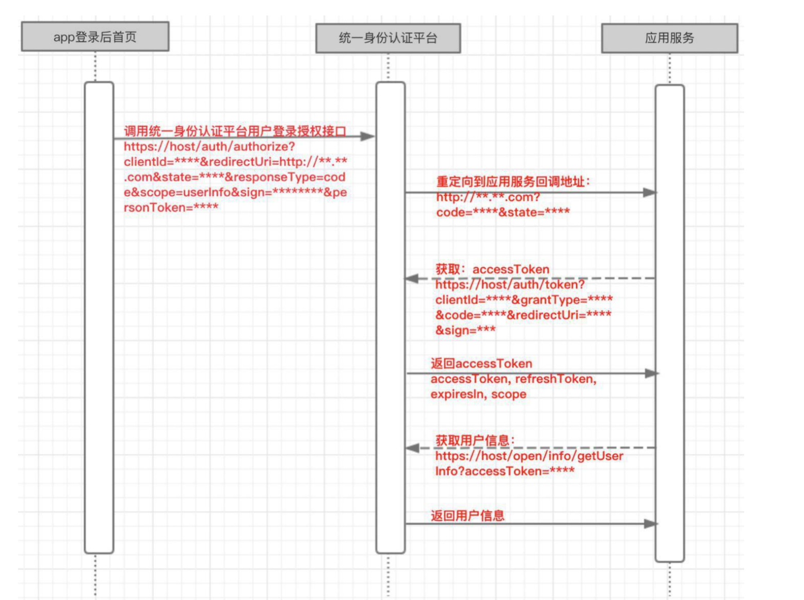

# i宁德APP对接

<br>

### 1. 需求背景
标准版宁德客户是独立部署的客户。
为了实现“一个账号，全市通用；一次登录，全市通行”，需要在i宁德app上集成我们的场馆预约功能，同时使用统一身份认证平台的身份作为登录用户的身份信息

对接模式：根据对方提供的对接文档、请求方式、签名验证、数据加密等等，进行接口联调、测试。

### 2. 三方系统

1. 统一身份认证平台
2. 应用app（i宁德app）
3. 三方对接系统（我方）

### 3. 对接时序图



### 4. 业务接口调用

#### 接口调用说明
一、调用获取accessToken接口

申请应用接入的时候分配的 clientId 和 clientSecret参数加上用户授权页面回调获取到的code来获取令牌
```
Request
GET请求 https://host/auth/token?clientId=****&grantType=authorizationCode&code=****&redirectUri=****&sign=*** 
参数说明：
{
    "grantType": "授权类型: authorizationCode 或 refreshToken",
    "clientId": "第三方用户唯一凭证",
    "code": "用户授权页面回调获取到的code",
    "redirectUri": "申请应用时填写的跳转我方系统的地址",
    "sign": "签名字符串"
}
Response
{
    "data": {
        "expiresIn": 1702971669272,
        "scope": "userInfo",
        "accessToken": "78456739-fb62-33e1-bf91-1f4e7c3df392",
        "tokenType": "",
        "refreshToken": "00c4a07e-e7c7-3b4a-b044-b7ad191a78e1"
    },
    "meta": {
        "code": "0",
        "message": "成功"
    }
}
```

二、调用获取用户接口
```
GET请求：https://host/open/info/getUserInfo?accessToken=**** 
请求示例（accessToken为上述获取的accessToken）
响应：
{
    "data": {
        "personToken": "e70653eebab606324eab9559916c08a4431dfe23a03b3f8061f61b1a7936e97fb26501a348dfa4894c12fdc12c4cc381b794e19f7edd26c18f32aeb626136ea0363f64bd06e747588af6ed90845b86d678cca268844edaaab1a2976061c531ddbb58c4cc1e8509ebf4b4fccde2f05bb7994ff66a2360707f9af15939b1443e153599b277c95e90226af751b5c32b090c4ce0f2de9d8b341e3fa8cbb54b048c6a",
        "certNoType": "1",
        "mail": null,
        "ethnicity": null,
        "certLevel": "L3",
        "sex": "1",
        "mobile": "OUxPdExzak95Sjl5eEo5M2pMZUx5Zz09",
        "userName": "***",
        "version": null,
        "userId": 2089032,
        "certNo": "d2tZUlRTa3FTVWNKdWlab0dWT01qaGh0WEtDSENXZHN3cStSOHdzTklRMD0=",
        "certName": "QU1FbHJHWUMzYkdQMlA1eHMvNkhOQT09",
        "encrypt": 1,
        "toonNo": "100103607737",
        "userType": "mzt_app",
        "uniqueId": "76d972eb6ef5928b943ce703a9c5db0b2c9bfdb48c795de0018c7bbcc4f11ba0,2c9bfd0d8c40b89c018c4433e09b6b90"
    },
    "meta": {
        "code": "0",
        "message": "成功"
    }
}
```
返回的用户信息是加密的，手机号、身份证号、实名信息等都是采用 SM4 ECB 的方式加密的，秘钥是appSecret前16位，需要解密才能使用


下面是对接的具体文档

- [统一身份认证平台对接接口规范.doc](../doc/附件3-1-1：《i宁德APP应用服务统一身份认证平台接入规范》.pdf)

