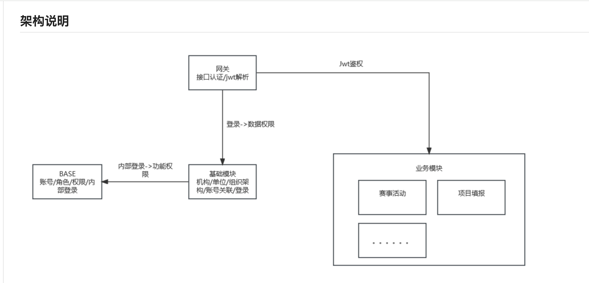
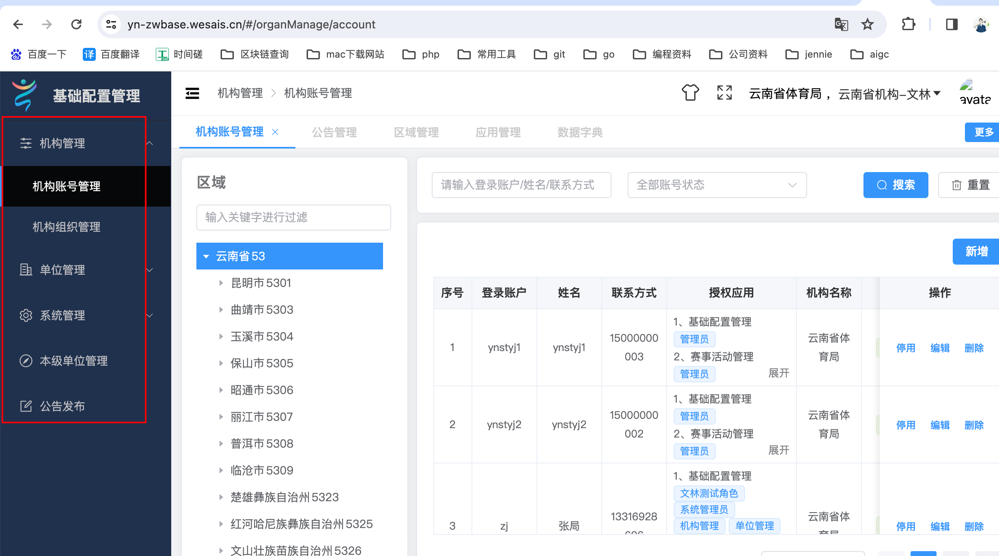
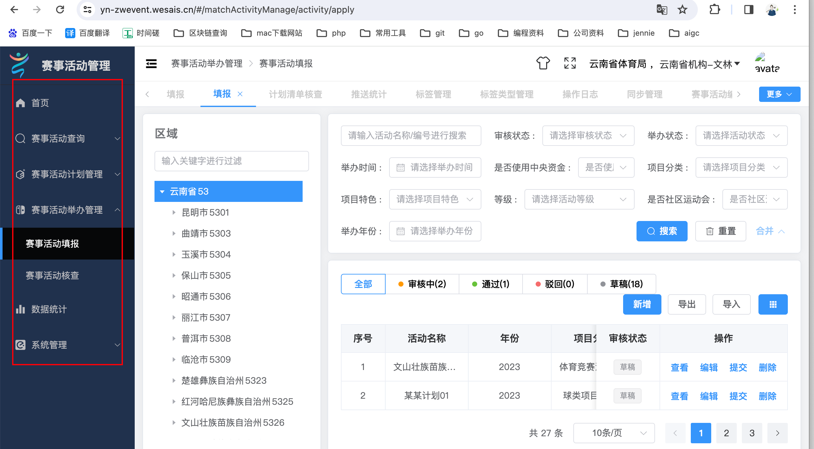
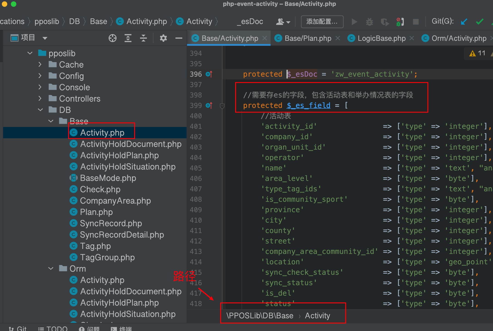
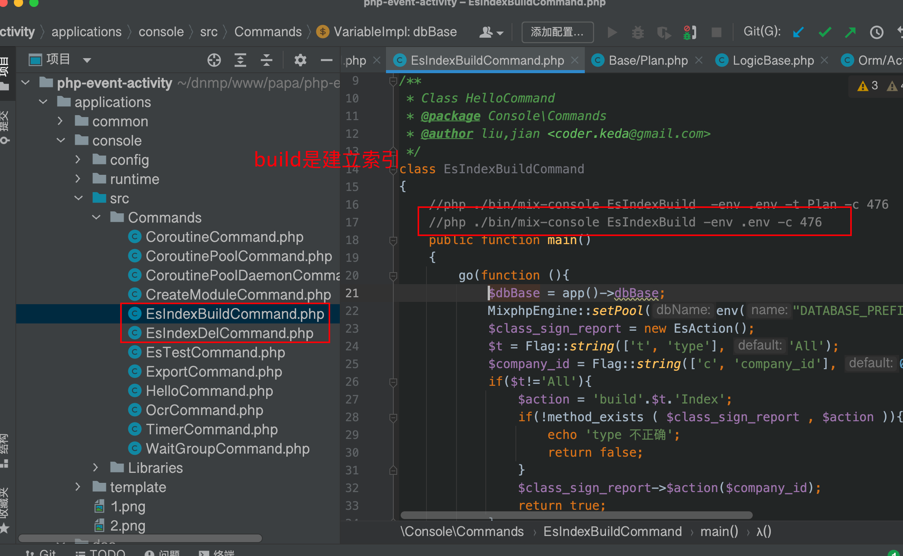
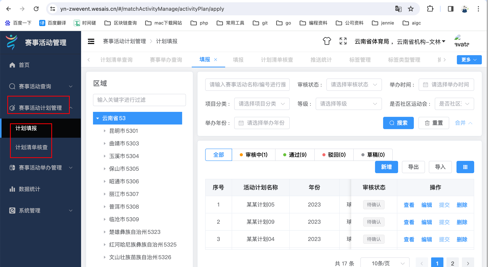
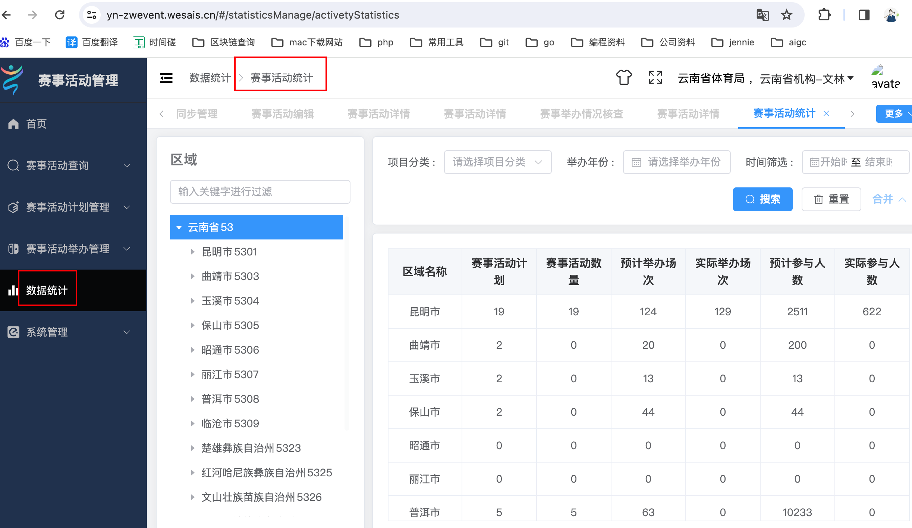
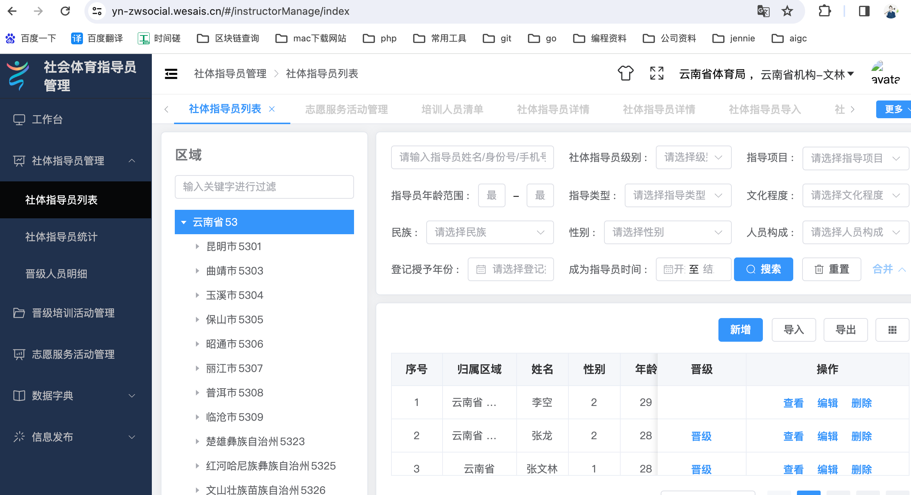
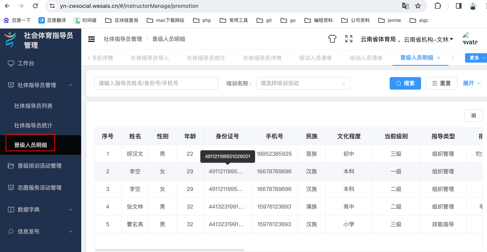
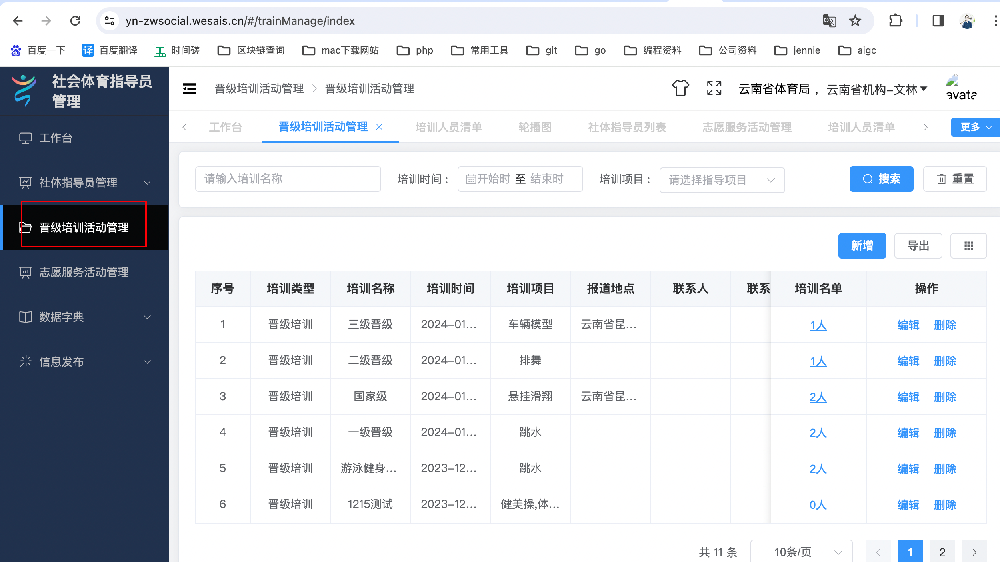

## 1.云南二期省工作平台系统说明


此工作平台主要解决了云南省 填报 赛事，计划，项目，社体指导员，权限控制等问题。主要分为6个子系统

1.基础架构系统 ： 负责账号角色权限分配，机构和单位的管理，数据字典等基础信息管理等功能。
2.赛事填报系统： 负责填报每年需要举办的赛事和计划信息，并同步给体育总局平台。
3.社体指导员系统：负责管理社会体育指导员信息，活动的系统，包括填报，晋级，培训等功能。
4.项目填报系统： 负责填报项目信息，进行统一管理。

5.场馆填报系统：负责填报和管理场馆信息。
6.一张图一张表系统：负责数据统一管理和展示的系统。


### 大体架构图



1.在基础架构应用新建和分配好账号后

在PC端进行统一登陆，统一登陆后只能看到账号对应的权限和子应用。


### 1.基础架构应用系统。

总共 个模块功能：

1.机构管理 

2.单位管理

3.系统管理

4.本级单位管理

5.公告发布




#### 1.机构单位管理

机构单位表，负责机关和单位的curd。

举个例子：一个云南省教育局机构，就是表的一条记录。

```sql
CREATE TABLE `platform_organ_unit` (
  `id` int NOT NULL AUTO_INCREMENT,
  `organ_unit_id` int NOT NULL DEFAULT '0' COMMENT '表id',
  `company_id` int NOT NULL DEFAULT '0' COMMENT '公司id',
  `operator` int NOT NULL DEFAULT '0' COMMENT '操作人id',
  `company_area_id` int NOT NULL DEFAULT '0' COMMENT '所属区域id',
  `manage_organ_id` int NOT NULL DEFAULT '0' COMMENT '管理机构id(单位数据)',
  `level_id` tinyint NOT NULL DEFAULT '0' COMMENT '级别id（省级，州市级，区县级）',
  `type` tinyint NOT NULL DEFAULT '1' COMMENT '类型：1机构，2单位',
  `kind_id` tinyint NOT NULL DEFAULT '0' COMMENT '单位类型id(单位数据)',
  `name` varchar(255) CHARACTER SET utf8mb4 COLLATE utf8mb4_general_ci NOT NULL DEFAULT '' COMMENT '名称',
  `social_credit_code` varchar(70) CHARACTER SET utf8mb4 COLLATE utf8mb4_general_ci NOT NULL DEFAULT '' COMMENT '统一社会信用代码',
  `contact_name` varchar(50) CHARACTER SET utf8mb4 COLLATE utf8mb4_general_ci NOT NULL DEFAULT '' COMMENT '联系人',
  `contact_way` varchar(100) CHARACTER SET utf8mb4 COLLATE utf8mb4_general_ci NOT NULL DEFAULT '' COMMENT '联系方式',
  `address` varchar(100) CHARACTER SET utf8mb4 COLLATE utf8mb4_general_ci NOT NULL DEFAULT '' COMMENT '详细地址',
  `img` varchar(100) CHARACTER SET utf8mb4 COLLATE utf8mb4_general_ci NOT NULL DEFAULT '' COMMENT '图标',
  `status` tinyint(1) NOT NULL DEFAULT '1' COMMENT '状态：1有效，2无效',
  `c_time` int NOT NULL DEFAULT '0' COMMENT '添加时间',
  `u_time` int NOT NULL DEFAULT '0' COMMENT '修改时间',
  PRIMARY KEY (`id`) USING BTREE
) ENGINE=InnoDB AUTO_INCREMENT=114 DEFAULT CHARSET=utf8mb4 COLLATE=utf8mb4_general_ci COMMENT='架构模块-机构单位信息表';
```


#### 2 机构单位和账号的绑定关系表 

主要是organ_unit_id和personnel_id，一个organ_unit_id可以对应多个personnel_id。

举个例子：一个云南省体育局 可以 对应多个账号，账号a是局长的，账号b是副局长的。账号a和b都是云南省体育局的，都具有云南省体育局的权限。

```sql
CREATE TABLE `platform_organ_unit_account` (
  `id` int NOT NULL AUTO_INCREMENT,
  `organ_unit_account_id` int NOT NULL DEFAULT '0' COMMENT '表id',
  `company_id` int NOT NULL DEFAULT '0' COMMENT '公司id',
  `operator` int NOT NULL DEFAULT '0' COMMENT '操作人id',
  `organ_unit_id` int NOT NULL DEFAULT '0' COMMENT '机构单位id',
  `type` tinyint NOT NULL DEFAULT '1' COMMENT '类型：1机构，2单位',
  `company_area_id` int NOT NULL DEFAULT '0' COMMENT '区域id',
  `c_time` int NOT NULL DEFAULT '0' COMMENT '添加时间',
  `u_time` int NOT NULL DEFAULT '0' COMMENT '修改时间',
  `name` varchar(50) CHARACTER SET utf8mb4 COLLATE utf8mb4_general_ci NOT NULL DEFAULT '' COMMENT '机构单位名称',
  `personnel_id` int NOT NULL DEFAULT '0' COMMENT '员工id',
  PRIMARY KEY (`id`) USING BTREE,
  UNIQUE KEY `personnel_id` (`personnel_id`) USING BTREE
) ENGINE=InnoDB AUTO_INCREMENT=103 DEFAULT CHARSET=utf8mb4 COLLATE=utf8mb4_general_ci COMMENT='架构模块-账号关联表';
```


#### 3.系统管理


角色管理，应用管理： 主要对接了 base服务的接口，对应auth数据库


##### 区域管理

存储区域数据的表

eg：云南省  行政区划id53，对应的经纬度信息。精确到街道 

```sql
CREATE TABLE `platform_company_area` (
  `id` int NOT NULL AUTO_INCREMENT,
  `company_id` int NOT NULL DEFAULT '0' COMMENT '公司id',
  `company_area_id` int NOT NULL DEFAULT '0' COMMENT '区域ID',
  `name` varchar(25) CHARACTER SET utf8 COLLATE utf8_general_ci NOT NULL DEFAULT '' COMMENT '区域名称',
  `pinyin` varchar(50) CHARACTER SET utf8 COLLATE utf8_general_ci NOT NULL DEFAULT '',
  `lat` decimal(10,6) NOT NULL DEFAULT '0.000000' COMMENT '纬度',
  `lng` decimal(10,6) NOT NULL DEFAULT '0.000000' COMMENT '经度',
  `people_num` int NOT NULL DEFAULT '0',
  `sort` int NOT NULL DEFAULT '0' COMMENT '排序',
  `des` varchar(100) CHARACTER SET utf8 COLLATE utf8_general_ci DEFAULT '' COMMENT '简介',
  `operator` int NOT NULL DEFAULT '0',
  `u_time` int NOT NULL DEFAULT '0',
  `c_time` int NOT NULL DEFAULT '0',
  PRIMARY KEY (`id`) USING BTREE,
  KEY `company_id` (`company_id`) USING BTREE,
  KEY `company_area_id` (`company_area_id`) USING BTREE,
  KEY `sort` (`sort`) USING BTREE
) ENGINE=InnoDB AUTO_INCREMENT=311591 DEFAULT CHARSET=utf8mb3 COMMENT='系统模块-公司区域表';
```


区域的社区表，社区是街道的下一级。

```sql
CREATE TABLE `platform_company_area_community` (
  `id` int NOT NULL AUTO_INCREMENT,
  `company_area_community_id` int NOT NULL DEFAULT '0' COMMENT '表id',
  `company_id` int NOT NULL DEFAULT '0' COMMENT '公司id',
  `street_company_area_id` int NOT NULL DEFAULT '0' COMMENT '街道的行政区划编码',
  `name` varchar(50) CHARACTER SET utf8mb4 COLLATE utf8mb4_general_ci NOT NULL DEFAULT '' COMMENT '社区或村的名称',
  `c_time` int NOT NULL DEFAULT '0' COMMENT '添加时间',
  `u_time` int NOT NULL DEFAULT '0' COMMENT '修改时间',
  `operator` int NOT NULL DEFAULT '0' COMMENT '操作人id',
  PRIMARY KEY (`id`) USING BTREE,
  UNIQUE KEY `idx_id` (`company_area_community_id`) USING BTREE,
  KEY `idx_street` (`street_company_area_id`) USING BTREE
) ENGINE=InnoDB AUTO_INCREMENT=106840 DEFAULT CHARSET=utf8mb4 COLLATE=utf8mb4_general_ci COMMENT='系统模块-社区或村的区域表';
```


##### 公告管理

```sql
CREATE TABLE `platform_notice` (
  `id` int NOT NULL AUTO_INCREMENT,
  `company_id` int NOT NULL DEFAULT '0',
  `business_id` int NOT NULL DEFAULT '0',
  `branch_id` int NOT NULL DEFAULT '0' COMMENT '部门ID',
  `notice_id` int NOT NULL DEFAULT '0' COMMENT '公告ID',
  `type` int NOT NULL DEFAULT '1' COMMENT '类型 1:公告消息，2：政策资讯\n',
  `name` varchar(500) CHARACTER SET utf8 COLLATE utf8_general_ci NOT NULL DEFAULT '' COMMENT '公告名称',
  `images` varchar(1000) CHARACTER SET utf8 COLLATE utf8_general_ci NOT NULL DEFAULT '/HOST/images/member_avatar/20210428/cbb2aa51970aa3dcc9e9c78451b54f72.png' COMMENT '图片',
  `video` varchar(1000) CHARACTER SET utf8 COLLATE utf8_general_ci NOT NULL DEFAULT '' COMMENT '视频地址',
  `video_banner` varchar(500) CHARACTER SET utf8 COLLATE utf8_general_ci NOT NULL DEFAULT '' COMMENT '视频首图',
  `url` varchar(500) CHARACTER SET utf8 COLLATE utf8_general_ci NOT NULL DEFAULT '' COMMENT '链接',
  `is_wx` tinyint(1) DEFAULT '1' COMMENT '是否微信可见，1：可见，2：不可见',
  `status` tinyint(1) NOT NULL DEFAULT '4' COMMENT '状态（1：已发布，4：未发布）',
  `operator` int NOT NULL DEFAULT '0',
  `u_time` int NOT NULL DEFAULT '0',
  `c_time` int NOT NULL DEFAULT '0',
  `show_status` tinyint NOT NULL DEFAULT '1' COMMENT '弹窗提醒:1=首次登录,2=每次登录',
  `wx_is_popup` tinyint NOT NULL DEFAULT '1' COMMENT '微信展示:0=否,1=是',
  `community_id` int DEFAULT '0',
  `released_time` int unsigned NOT NULL DEFAULT '0' COMMENT '发布时间',
  `bank_cities` varchar(255) CHARACTER SET utf8mb4 COLLATE utf8mb4_general_ci NOT NULL DEFAULT '' COMMENT '城市id,多个则以逗号拼接',
  `mp_type` varchar(30) CHARACTER SET utf8mb4 COLLATE utf8mb4_general_ci NOT NULL DEFAULT '' COMMENT '应用类型：应用中心appCenter，社体socialSports',
  `show_type` tinyint(1) NOT NULL DEFAULT '2' COMMENT '公告的展示类型：1管理后台公告，2c端公告',
  PRIMARY KEY (`id`) USING BTREE,
  UNIQUE KEY `notice_id` (`notice_id`) USING BTREE,
  KEY `is_wx` (`is_wx`) USING BTREE,
  KEY `status` (`status`) USING BTREE
) ENGINE=InnoDB AUTO_INCREMENT=224 DEFAULT CHARSET=utf8mb3 COMMENT='系统模块-公告表'
```


##### 数据字典

配置表

```sql
CREATE TABLE `platform_data_dictionary` (
  `id` int NOT NULL AUTO_INCREMENT,
  `data_dictionary_id` int NOT NULL DEFAULT '0' COMMENT '表id',
  `company_id` int NOT NULL DEFAULT '0' COMMENT '公司id',
  `operator` int NOT NULL DEFAULT '0' COMMENT '操作人id',
  `value` text CHARACTER SET utf8mb4 COLLATE utf8mb4_general_ci NOT NULL COMMENT '值',
  `business_info` text CHARACTER SET utf8mb4 COLLATE utf8mb4_general_ci NOT NULL COMMENT '业务信息',
  `name` varchar(255) CHARACTER SET utf8mb4 COLLATE utf8mb4_general_ci NOT NULL DEFAULT '' COMMENT '名称',
  `note` varchar(255) CHARACTER SET utf8mb4 COLLATE utf8mb4_general_ci NOT NULL DEFAULT '' COMMENT '备注',
  `c_time` int NOT NULL DEFAULT '0' COMMENT '添加时间',
  `u_time` int NOT NULL DEFAULT '0' COMMENT '修改时间',
  `type` int NOT NULL DEFAULT '1' COMMENT '类型：1机构类型，2单位类型，3单位级别，4角色类型, 100使用场景(100~199属于公用类型)，200赛事备案开关(200~300属于赛事应用的配置)，默认是1',
  PRIMARY KEY (`id`) USING BTREE
) ENGINE=InnoDB AUTO_INCREMENT=174 DEFAULT CHARSET=utf8mb4 COLLATE=utf8mb4_general_ci COMMENT='系统模块-数据字典表';
```


### 2.赛事填报系统


简介：帮助政府填报 赛事的计划 和 实际的赛事活动举办信息 ，并且可以审核对应的赛事活动，和推送数据给体育总局。

功能概览




#### 备注说明：

##### 1.数据权限说明

首先看到的数据，有权限的限制。

填报列表 只能看到自己所属机构单位填报的数据。

 比如： 云南省昆明市体育局 只能看到 云南省昆明市体育局填报的数据


审核列表(本级发布或本级审核或审核过的)

比如： 云南省昆明市体育局 只能看到 需要云南省昆明市体育局审核的 或者 云南省昆明市体育局审核过的 或者 云南省昆明市体育局自己发起的计划 


普通列表(机构则区域内,单位自己填报的)

比如： 如果是机构，可以看到机构所属区域内的。

比如 云南省昆明市体育局 机构，可以看到昆明市以下的，看不到其他市的数据。
比如 云南省昆明市社体中心 单位，只能看到云南省昆明市社体中心的数据，不可以看到云南省昆明市五华区社体中心的数据。


##### 2.结合了搜索引擎elasticsearch和技术说明


###### 2.1 计划，活动存储了elasticsearch 进行搜索和管理 标签化管理。


举个例子：进行赛事活动activity的新增，修改，删除时，都是对应操作es，进行mysql和es同步。

其中新增时会给活动分配很多标签。比如 活动 可以多选个标签，然后在存入es时 进行空白符切割后存入es（

举个例子，多选了 篮球，足球，羽毛球这3个标签后，写入es时会变成 "篮球 足球 羽毛球", 

），为后续使用搜索时做基础 .


列表页面的搜索也是通过es进行搜索，es相关的代码都会在Base类中进行定义和说明




###### 2.2 ES中 删除和重建索引

当es和mysql中数据不一致时，可以先删除索引，再重建索引。执行下图的命令即可




#### 赛事计划管理 




计划表 一个计划可以对应多个活动。

赛事举办前一般会有个计划，规定了大概的赛事资源。

```sql
CREATE TABLE `platform_plan` (
  `id` int NOT NULL AUTO_INCREMENT,
  `plan_id` int NOT NULL DEFAULT '0' COMMENT '表id',
  `company_id` int NOT NULL DEFAULT '0' COMMENT '公司id',
  `operator` int NOT NULL DEFAULT '0' COMMENT '操作人id',
  `organ_unit_id` int NOT NULL DEFAULT '0' COMMENT '机构单位id',
  `organ_unit_company_area_id` int NOT NULL DEFAULT '0' COMMENT '填报计划的机构单位所属的区域id',
  `name` varchar(80) CHARACTER SET utf8mb4 COLLATE utf8mb4_general_ci NOT NULL DEFAULT '' COMMENT '赛事名称',
  `first_hold_name` varchar(255) CHARACTER SET utf8mb4 COLLATE utf8mb4_general_ci NOT NULL DEFAULT '' COMMENT '第一主办单位',
  `notes` varchar(1000) CHARACTER SET utf8mb4 COLLATE utf8mb4_general_ci NOT NULL DEFAULT '' COMMENT '备注',
  `type_tag_ids` varchar(500) CHARACTER SET utf8mb4 COLLATE utf8mb4_general_ci NOT NULL DEFAULT '' COMMENT '分类标签ids',
  `is_community_sport` tinyint(1) NOT NULL DEFAULT '1' COMMENT '是否属于社区运动会',
  `year` int NOT NULL DEFAULT '0' COMMENT '赛事年份',
  `province` int NOT NULL DEFAULT '0' COMMENT '省',
  `city` int NOT NULL DEFAULT '0' COMMENT '市',
  `county` int NOT NULL DEFAULT '0' COMMENT '区县',
  `status` tinyint(1) NOT NULL DEFAULT '1' COMMENT '状态：1草稿，2审核中，3人工审核通过，4驳回，5自动审核通过',
  `area_level` tinyint NOT NULL DEFAULT '0' COMMENT '赛事等级:1省级，2市级，3县级',
  `about_match_num` int NOT NULL DEFAULT '0' COMMENT '预计比赛场次',
  `about_join_num` int NOT NULL DEFAULT '0' COMMENT '预计参加人数',
  `plan_start_time` int NOT NULL DEFAULT '0' COMMENT '计划开始时间',
  `activity_start_time` int NOT NULL DEFAULT '0' COMMENT '活动开始时间',
  `plan_end_time` int NOT NULL DEFAULT '0' COMMENT '计划结束时间',
  `activity_end_time` int NOT NULL DEFAULT '0' COMMENT '活动结束时间',
  `c_time` int NOT NULL DEFAULT '0' COMMENT '添加时间',
  `u_time` int NOT NULL DEFAULT '0' COMMENT '修改时间',
  `sync_check_status` tinyint(1) NOT NULL DEFAULT '1' COMMENT '同步审核状态：1待审核，2审核通过，3驳回',
  `is_del` tinyint(1) NOT NULL DEFAULT '2' COMMENT '是否删除，1是，2否',
  `review_id` int NOT NULL DEFAULT '0' COMMENT '关联审核id',
  `reviewer_id` int NOT NULL DEFAULT '0' COMMENT '当前审核人',
  `over_reviewer_list` varchar(1000) CHARACTER SET utf8mb4 COLLATE utf8mb4_general_ci NOT NULL DEFAULT '' COMMENT '已审核人列表',
  `sync_review_id` int NOT NULL DEFAULT '0' COMMENT '关联审核id',
  `sync_reviewer_id` int NOT NULL DEFAULT '0' COMMENT '当前审核人',
  `sync_over_reviewer_list` varchar(1000) CHARACTER SET utf8mb4 COLLATE utf8mb4_general_ci NOT NULL DEFAULT '' COMMENT '已审核人列表',
  PRIMARY KEY (`id`) USING BTREE
) ENGINE=InnoDB AUTO_INCREMENT=155 DEFAULT CHARSET=utf8mb4 COLLATE=utf8mb4_general_ci COMMENT='赛事模块-计划信息表';
```


#### 赛事活动管理

##### 活动备注：

一个赛事活动只能对应一个计划  

一个activity_id，在其他附属表中，只会对应一条记录。

比如活动A，在附属表platform_activity_hold_document，platform_activity_hold_plan，platform_activity_hold_situation这三个表中，活动A都只会有一条记录。

platform_activity是主表 ，有其他3个关联表

```sql
CREATE TABLE `platform_activity` (
  `id` int NOT NULL AUTO_INCREMENT,
  `activity_id` int NOT NULL DEFAULT '0' COMMENT '表id',
  `company_id` int NOT NULL DEFAULT '0' COMMENT '公司id',
  `operator` int NOT NULL DEFAULT '0' COMMENT '操作人id',
  `organ_unit_id` int NOT NULL DEFAULT '0' COMMENT '机构单位id',
  `plan_id` int NOT NULL DEFAULT '0' COMMENT '计划id',
  `name` varchar(80) CHARACTER SET utf8mb4 COLLATE utf8mb4_general_ci NOT NULL DEFAULT '' COMMENT '赛事名称',
  `area_level` tinyint NOT NULL DEFAULT '0' COMMENT '赛事等级:1省级，2市级，3县级,4国家级，5跨省赛事活动',
  `type_tag_ids` varchar(500) CHARACTER SET utf8mb4 COLLATE utf8mb4_general_ci NOT NULL DEFAULT '' COMMENT '分类标签id',
  `is_community_sport` tinyint(1) NOT NULL DEFAULT '1' COMMENT '是否属于社区运动会',
  `province` int NOT NULL DEFAULT '0' COMMENT '省',
  `city` int NOT NULL DEFAULT '0' COMMENT '市',
  `county` int NOT NULL DEFAULT '0' COMMENT '区县',
  `street` int unsigned NOT NULL DEFAULT '0' COMMENT '街道',
  `company_area_community_id` int NOT NULL DEFAULT '0' COMMENT '社区',
  `address` varchar(50) CHARACTER SET utf8mb4 COLLATE utf8mb4_general_ci NOT NULL DEFAULT '' COMMENT '详细地址',
  `is_hold_plan` tinyint NOT NULL DEFAULT '2' COMMENT '是否提交办赛方案：1是，2否',
  `is_hold_situation` tinyint NOT NULL DEFAULT '2' COMMENT '是否提交举办情况：1是，2否',
  `is_hold_document` tinyint NOT NULL DEFAULT '2' COMMENT '是否提交相关资料：1是，2否',
  `c_time` int NOT NULL DEFAULT '0' COMMENT '添加时间',
  `u_time` int NOT NULL DEFAULT '0' COMMENT '修改时间',
  `sync_check_status` tinyint(1) NOT NULL DEFAULT '1' COMMENT '同步审核状态：1待审核，2审核通过，3驳回',
  `lat` decimal(10,6) NOT NULL DEFAULT '0.000000' COMMENT '纬度',
  `lng` decimal(10,6) NOT NULL DEFAULT '0.000000' COMMENT '经度',
  `sync_status` tinyint(1) NOT NULL DEFAULT '3' COMMENT '同步状态：1已同步，2同步失败，3未同步',
  `status` tinyint(1) NOT NULL DEFAULT '1' COMMENT '状态：1草稿，2审核中，3人工审核通过，4驳回，5自动审核通过2',
  `is_del` tinyint(1) NOT NULL DEFAULT '2' COMMENT '是否删除，1是，2否',
  `review_id` int NOT NULL DEFAULT '0' COMMENT '关联审核id',
  `reviewer_id` int NOT NULL DEFAULT '0' COMMENT '当前审核人',
  `over_reviewer_list` varchar(1000) CHARACTER SET utf8mb4 COLLATE utf8mb4_general_ci NOT NULL DEFAULT '' COMMENT '已审核人列表',
  PRIMARY KEY (`id`) USING BTREE,
  UNIQUE KEY `unindex_activity_id` (`activity_id`) USING BTREE
) ENGINE=InnoDB AUTO_INCREMENT=180 DEFAULT CHARSET=utf8mb4 COLLATE=utf8mb4_general_ci COMMENT='赛事模块-计划信息表'
```


赛事活动-相关资料表 

每个赛事活动 都有对应的相关资料，比如每个赛事活动都有： 赛事的规程文件资料，赛事秩序文件资料等

```sql
CREATE TABLE `platform_activity_hold_document` (
  `id` int NOT NULL AUTO_INCREMENT,
  `activity_hold_document_id` int NOT NULL DEFAULT '0' COMMENT '表id',
  `company_id` int NOT NULL DEFAULT '0' COMMENT '公司id',
  `operator` int NOT NULL DEFAULT '0' COMMENT '操作人id',
  `organ_unit_id` int NOT NULL DEFAULT '0' COMMENT '机构单位id',
  `activity_id` int NOT NULL DEFAULT '0' COMMENT '活动id',
  `cover_img` varchar(150) CHARACTER SET utf8mb4 COLLATE utf8mb4_general_ci NOT NULL DEFAULT '' COMMENT '赛事活动封面',
  `activity_img` varchar(1000) CHARACTER SET utf8mb4 COLLATE utf8mb4_general_ci NOT NULL DEFAULT '' COMMENT '赛事活动图片,多个则逗号分开',
  `activity_url` varchar(200) CHARACTER SET utf8mb4 COLLATE utf8mb4_general_ci NOT NULL DEFAULT '' COMMENT '赛事活动视频',
  `match_socre_doc` varchar(200) CHARACTER SET utf8mb4 COLLATE utf8mb4_general_ci NOT NULL DEFAULT '' COMMENT '赛事成绩文件',
  `match_socre_doc_name` varchar(100) CHARACTER SET utf8mb4 COLLATE utf8mb4_general_ci NOT NULL DEFAULT '' COMMENT '赛事成绩文件名称',
  `match_order_doc` varchar(200) CHARACTER SET utf8mb4 COLLATE utf8mb4_general_ci NOT NULL DEFAULT '' COMMENT '赛事秩序文件',
  `match_order_doc_name` varchar(100) CHARACTER SET utf8mb4 COLLATE utf8mb4_general_ci NOT NULL DEFAULT '' COMMENT '赛事秩序文件名称',
  `match_regulation_doc` varchar(200) CHARACTER SET utf8mb4 COLLATE utf8mb4_general_ci NOT NULL DEFAULT '' COMMENT '赛事规程文件',
  `match_regulation_doc_name` varchar(100) CHARACTER SET utf8mb4 COLLATE utf8mb4_general_ci NOT NULL DEFAULT '' COMMENT '赛事规程文件名称',
  `match_other_doc` varchar(200) CHARACTER SET utf8mb4 COLLATE utf8mb4_general_ci NOT NULL DEFAULT '' COMMENT '赛事其他相关文件',
  `match_other_doc_name` varchar(100) CHARACTER SET utf8mb4 COLLATE utf8mb4_general_ci NOT NULL DEFAULT '' COMMENT '赛事其他相关文件名称',
  `match_info` varchar(1000) CHARACTER SET utf8mb4 COLLATE utf8mb4_general_ci NOT NULL DEFAULT '' COMMENT '赛事资讯{{"title":"标题","url":"https:www.a.com/demo.doc"},{"title":"志愿服务方案2","url":"https:www.a.com/demo.doc"}}',
  `live_channel` varchar(1000) CHARACTER SET utf8mb4 COLLATE utf8mb4_general_ci NOT NULL DEFAULT '' COMMENT '直播或转播渠道[{“title":"标题","url":"https:www.a.com/demo.doc"},{"title":"志愿服务方案2","url":"https:www.a.com/demo.doc”}]',
  `c_time` int NOT NULL DEFAULT '0' COMMENT '添加时间',
  `u_time` int NOT NULL DEFAULT '0' COMMENT '修改时间',
  `status` tinyint(1) NOT NULL DEFAULT '1' COMMENT '状态：1草稿，2正常',
  PRIMARY KEY (`id`) USING BTREE,
  UNIQUE KEY `unindex` (`activity_id`) USING BTREE
) ENGINE=InnoDB AUTO_INCREMENT=58 DEFAULT CHARSET=utf8mb4 COLLATE=utf8mb4_general_ci COMMENT='赛事活动模块-相关资料表'
```


赛事活动-活动办赛方案表

```sql
CREATE TABLE `platform_activity_hold_plan` (
  `id` int NOT NULL AUTO_INCREMENT,
  `activity_hold_plan_id` int NOT NULL DEFAULT '0' COMMENT '表id',
  `company_id` int NOT NULL DEFAULT '0' COMMENT '公司id',
  `operator` int NOT NULL DEFAULT '0' COMMENT '操作人id',
  `organ_unit_id` int NOT NULL DEFAULT '0' COMMENT '机构单位id',
  `activity_id` int NOT NULL DEFAULT '0' COMMENT '活动id',
  `notes` varchar(255) CHARACTER SET utf8mb4 COLLATE utf8mb4_general_ci NOT NULL DEFAULT '' COMMENT '需要批复的事项',
  `event_organization_plan` varchar(150) CHARACTER SET utf8mb4 COLLATE utf8mb4_general_ci NOT NULL DEFAULT '' COMMENT '赛事组织方案url',
  `event_organization_plan_name` varchar(150) CHARACTER SET utf8mb4 COLLATE utf8mb4_general_ci NOT NULL DEFAULT '' COMMENT '赛事组织方案url名称',
  `emergency_response_plan` varchar(150) CHARACTER SET utf8mb4 COLLATE utf8mb4_general_ci NOT NULL DEFAULT '' COMMENT '应急处理方案url',
  `emergency_response_plan_name` varchar(150) CHARACTER SET utf8mb4 COLLATE utf8mb4_general_ci NOT NULL DEFAULT '' COMMENT '应急处理方案url名称',
  `prevention_control_plan` varchar(150) CHARACTER SET utf8mb4 COLLATE utf8mb4_general_ci NOT NULL DEFAULT '' COMMENT '疫情防控方案url',
  `prevention_control_plan_name` varchar(150) CHARACTER SET utf8mb4 COLLATE utf8mb4_general_ci NOT NULL DEFAULT '' COMMENT '疫情防控方案url名称',
  `media_promotion_plan` varchar(150) CHARACTER SET utf8mb4 COLLATE utf8mb4_general_ci NOT NULL DEFAULT '' COMMENT '媒体宣传方案url',
  `media_promotion_plan_name` varchar(150) CHARACTER SET utf8mb4 COLLATE utf8mb4_general_ci NOT NULL DEFAULT '' COMMENT '媒体宣传方案url名称',
  `public_opinion_plan` varchar(150) CHARACTER SET utf8mb4 COLLATE utf8mb4_general_ci NOT NULL DEFAULT '' COMMENT '舆情方案url',
  `public_opinion_plan_name` varchar(150) CHARACTER SET utf8mb4 COLLATE utf8mb4_general_ci NOT NULL DEFAULT '' COMMENT '舆情方案url名称',
  `filing_registration_form` varchar(150) CHARACTER SET utf8mb4 COLLATE utf8mb4_general_ci NOT NULL DEFAULT '' COMMENT '备案登记表url',
  `filing_registration_form_name` varchar(150) CHARACTER SET utf8mb4 COLLATE utf8mb4_general_ci NOT NULL DEFAULT '' COMMENT '备案登记表url名称',
  `other_plan` varchar(3000) CHARACTER SET utf8mb4 COLLATE utf8mb4_general_ci NOT NULL DEFAULT '' COMMENT '其他方案[{"name":"志愿服务方案1","url":"https:www.a.com/demo.doc"},{"name":"志愿服务方案2","url":"https:www.a.com/demo.doc"}}',
  `plan_des` text CHARACTER SET utf8mb4 COLLATE utf8mb4_general_ci NOT NULL COMMENT '方案说明',
  `c_time` int NOT NULL DEFAULT '0' COMMENT '添加时间',
  `u_time` int NOT NULL DEFAULT '0' COMMENT '修改时间',
  `safe_control_plan` varchar(150) CHARACTER SET utf8mb4 COLLATE utf8mb4_general_ci NOT NULL DEFAULT '' COMMENT '安全风险防控方案',
  `safe_control_plan_name` varchar(150) CHARACTER SET utf8mb4 COLLATE utf8mb4_general_ci NOT NULL DEFAULT '' COMMENT '安全风险防控方案文件名',
  `sync_check_status` tinyint(1) NOT NULL DEFAULT '1' COMMENT '同步审核状态：1待审核，2审核通过，3驳回',
  `status` tinyint(1) NOT NULL DEFAULT '1' COMMENT '状态：1草稿，2正常',
  PRIMARY KEY (`id`) USING BTREE,
  UNIQUE KEY `unindex_activity_id` (`activity_id`) USING BTREE
) ENGINE=InnoDB AUTO_INCREMENT=181 DEFAULT CHARSET=utf8mb4 COLLATE=utf8mb4_general_ci COMMENT='赛事活动模块-活动办赛方案表';
```


赛事活动-活动举办情况表

```sql
CREATE TABLE `platform_activity_hold_situation` (
  `id` int NOT NULL AUTO_INCREMENT,
  `activity_hold_situation_id` int NOT NULL DEFAULT '0' COMMENT '表id',
  `company_id` int NOT NULL DEFAULT '0' COMMENT '公司id',
  `operator` int NOT NULL DEFAULT '0' COMMENT '操作人id',
  `organ_unit_id` int NOT NULL DEFAULT '0' COMMENT '机构单位id',
  `activity_id` int NOT NULL DEFAULT '0' COMMENT '活动id',
  `start_time` int NOT NULL DEFAULT '0' COMMENT '比赛开始时间',
  `end_time` int NOT NULL DEFAULT '0' COMMENT '比赛结束时间',
  `join_num` int NOT NULL DEFAULT '0' COMMENT '参赛人数',
  `match_number` int NOT NULL DEFAULT '0' COMMENT '赛事场次',
  `hold_way` tinyint(1) NOT NULL DEFAULT '1' COMMENT '举办形式：1线上，2线下，3线上和线下',
  `match_situation` tinyint(1) NOT NULL DEFAULT '1' COMMENT '赛事情况：1计划举办，2实际举办',
  `is_use_public_stadium` tinyint(1) NOT NULL DEFAULT '1' COMMENT '是否使用公共体育场馆：1是，2否',
  `facility_usage` varchar(255) CHARACTER SET utf8mb4 COLLATE utf8mb4_general_ci NOT NULL DEFAULT '' COMMENT '公共体育场地设施使用情况',
  `now_number` int NOT NULL DEFAULT '0' COMMENT '当前届次',
  `event_cycle` varchar(20) CHARACTER SET utf8mb4 COLLATE utf8mb4_general_ci NOT NULL DEFAULT '' COMMENT '赛事周期',
  `contacts_name` varchar(20) CHARACTER SET utf8mb4 COLLATE utf8mb4_general_ci NOT NULL DEFAULT '' COMMENT '联系人',
  `contact_way` varchar(50) CHARACTER SET utf8mb4 COLLATE utf8mb4_general_ci NOT NULL DEFAULT '' COMMENT '联系方式',
  `first_unit_name` varchar(50) CHARACTER SET utf8mb4 COLLATE utf8mb4_general_ci NOT NULL DEFAULT '' COMMENT '第一主办单位名称',
  `other_unit_name` varchar(50) CHARACTER SET utf8mb4 COLLATE utf8mb4_general_ci NOT NULL DEFAULT '' COMMENT '其他主办单位名称',
  `hold_unit_name` varchar(50) CHARACTER SET utf8mb4 COLLATE utf8mb4_general_ci NOT NULL DEFAULT '' COMMENT '承办单位名称',
  `held_hold_unit_name` varchar(50) CHARACTER SET utf8mb4 COLLATE utf8mb4_general_ci NOT NULL DEFAULT '' COMMENT '协办单位名称',
  `do_unit_name` varchar(50) CHARACTER SET utf8mb4 COLLATE utf8mb4_general_ci NOT NULL DEFAULT '' COMMENT '执行单位名称',
  `report_unit_name` varchar(50) CHARACTER SET utf8mb4 COLLATE utf8mb4_general_ci NOT NULL DEFAULT '' COMMENT '上报单位名称',
  `source_of_subsidy_funds` tinyint(1) NOT NULL DEFAULT '1' COMMENT '补助资金来源：1中央体彩金，2省级补助',
  `total_money` decimal(14,2) NOT NULL DEFAULT '0.00' COMMENT '活动经费总额，单位元，保留两位小数',
  `sport_bonus_money` decimal(14,2) NOT NULL DEFAULT '0.00' COMMENT '中央体彩-资金金额',
  `sport_bonus_year` char(4) CHARACTER SET utf8mb4 COLLATE utf8mb4_general_ci NOT NULL DEFAULT '' COMMENT '体彩下达年份',
  `sport_bonus_unit` varchar(50) CHARACTER SET utf8mb4 COLLATE utf8mb4_general_ci NOT NULL DEFAULT '' COMMENT '资金支持单位',
  `sport_bonus_money_doc_url` varchar(150) CHARACTER SET utf8mb4 COLLATE utf8mb4_general_ci NOT NULL DEFAULT '' COMMENT '资金下达文件url',
  `sport_bonus_money_doc_name` varchar(100) CHARACTER SET utf8mb4 COLLATE utf8mb4_general_ci NOT NULL DEFAULT '' COMMENT '资金下达文件名称',
  `sport_bonus_area_money` decimal(14,2) NOT NULL DEFAULT '0.00' COMMENT '中央体彩-自筹资金金额',
  `sport_bonus_area_year` char(4) CHARACTER SET utf8mb4 COLLATE utf8mb4_general_ci NOT NULL DEFAULT '' COMMENT '自筹资金-下达年份',
  `sport_bonus_area_unit` varchar(50) CHARACTER SET utf8mb4 COLLATE utf8mb4_general_ci NOT NULL DEFAULT '' COMMENT '自筹资金支持单位',
  `price_info` varchar(3000) CHARACTER SET utf8mb4 COLLATE utf8mb4_general_ci NOT NULL DEFAULT '' COMMENT '资金情况',
  `c_time` int NOT NULL DEFAULT '0' COMMENT '添加时间',
  `u_time` int NOT NULL DEFAULT '0' COMMENT '修改时间',
  `status` tinyint(1) NOT NULL DEFAULT '1' COMMENT '状态：1草稿，2正常',
  `year` char(4) CHARACTER SET utf8mb4 COLLATE utf8mb4_general_ci NOT NULL DEFAULT '' COMMENT '举办年份',
  `tag_ids` varchar(1000) CHARACTER SET utf8mb4 COLLATE utf8mb4_general_ci NOT NULL DEFAULT '' COMMENT '举办特色的标签id信息，多个则逗号隔开',
  `sport_bonus_money_source` varchar(50) CHARACTER SET utf8mb4 COLLATE utf8mb4_general_ci NOT NULL DEFAULT '' COMMENT '经费来源',
  `guidance_unit_name` varchar(50) CHARACTER SET utf8mb4 COLLATE utf8mb4_general_ci NOT NULL DEFAULT '' COMMENT '指导单位',
  `des` varchar(1000) CHARACTER SET utf8mb4 COLLATE utf8mb4_general_ci NOT NULL DEFAULT '' COMMENT '赛事说明',
  `is_public_show` tinyint(1) NOT NULL DEFAULT '1' COMMENT '是否公开：1是，2否',
  `sport_bonus_other_info` varchar(1000) CHARACTER SET utf8mb4 COLLATE utf8mb4_general_ci NOT NULL DEFAULT '' COMMENT '资金的其他记录，可多条,eg:[{"money":"100","year":"2023","unit":"资金支持单位"},{"money":"100","year":"2023","unit":"资金支持单位"}]',
  `match_status` tinyint(1) NOT NULL DEFAULT '2',
  PRIMARY KEY (`id`) USING BTREE,
  UNIQUE KEY `unindex_activity_id` (`activity_id`) USING BTREE
) ENGINE=InnoDB AUTO_INCREMENT=91 DEFAULT CHARSET=utf8mb4 COLLATE=utf8mb4_general_ci COMMENT='赛事活动模块-活动举办情况表';
```


#### 统计数据可视化

这个是在计划 和 活动 的数据基础上，进行了一些统计。




### 3.社会体育指导员系统


#### 主要功能

指导员模块，培训活动管理，志愿服务活动管理 ，数据字典，信息发布。





数据字典和信息发布，其实是对应基础架构应用系统的功能，这块可以看基础架构应用系统模块的内容。


其他模块：

##### 指导员模块


管理指导员的curd ，而且也对接es，与赛事活动系统的es对接类型。

 比较不一样的是，还有相关的晋级表，社体指导员可以从三级，二级，一级，国家级，这样一层一层往上升级的，对应的设计体指导员晋级记录表（platform_promote_record）

社体模块-社会体育指导员表

```sql
CREATE TABLE `platform_instructor` (
  `id` int NOT NULL AUTO_INCREMENT,
  `instructor_id` int NOT NULL DEFAULT '0' COMMENT '表id',
  `company_id` int NOT NULL DEFAULT '0' COMMENT '公司id',
  `operator` int NOT NULL DEFAULT '0' COMMENT '操作人id',
  `organ_unit_id` int NOT NULL DEFAULT '0' COMMENT '机构单位id',
  `name` varchar(20) CHARACTER SET utf8mb4 COLLATE utf8mb4_general_ci NOT NULL DEFAULT '' COMMENT '姓名',
  `id_card` varchar(30) CHARACTER SET utf8mb4 COLLATE utf8mb4_general_ci NOT NULL DEFAULT '' COMMENT '身份证号',
  `province` int NOT NULL DEFAULT '0' COMMENT '省',
  `city` int NOT NULL DEFAULT '0' COMMENT '市',
  `county` int NOT NULL DEFAULT '0' COMMENT '区县',
  `address` varchar(50) CHARACTER SET utf8mb4 COLLATE utf8mb4_general_ci NOT NULL DEFAULT '' COMMENT '详细地址',
  `gender` tinyint(1) NOT NULL DEFAULT '1' COMMENT '性别：1男，2女，3未知',
  `age` tinyint(1) NOT NULL DEFAULT '0' COMMENT '年龄',
  `phone` varchar(15) CHARACTER SET utf8mb4 COLLATE utf8mb4_general_ci NOT NULL DEFAULT '' COMMENT '手机号码',
  `nation` tinyint(1) NOT NULL DEFAULT '1' COMMENT '民族，1汉族，2...',
  `education_level` tinyint(1) NOT NULL DEFAULT '1' COMMENT '文化程度：1其他，2小学，3初中，4高中，5中专，6大专，7本科，8硕士，9博士',
  `level` tinyint(1) NOT NULL DEFAULT '3' COMMENT '指导员级别：0(国家级)，1(一级)，2(二级)，3(三级)',
  `guide_type` tinyint(1) NOT NULL DEFAULT '1' COMMENT '指导类型：1技能指导，2组织管理',
  `tag_ids` varchar(1000) CHARACTER SET utf8mb4 COLLATE utf8mb4_general_ci NOT NULL DEFAULT '' COMMENT '指导项目ids',
  `personnel_form` tinyint(1) NOT NULL DEFAULT '1' COMMENT '人员构成: 1业务兼职人员，2体育行业相关人员，3体育教师',
  `first_become_time` int NOT NULL DEFAULT '0' COMMENT '成为社体指导员的日期，时间戳类型数据',
  `now_level_grant_time` int NOT NULL DEFAULT '0' COMMENT '现有等级授予日期，时间戳类型数据',
  `now_level_organ_unit_name` varchar(50) CHARACTER SET utf8mb4 COLLATE utf8mb4_general_ci NOT NULL DEFAULT '' COMMENT '现有等级授予部门',
  `area_range` tinyint(1) NOT NULL DEFAULT '1' COMMENT '地区分布：1城市，2农村',
  `avatar` varchar(255) CHARACTER SET utf8mb4 COLLATE utf8mb4_general_ci NOT NULL DEFAULT '' COMMENT '头像图片',
  `is_del` tinyint(1) NOT NULL DEFAULT '2' COMMENT '是否删除，1是，2否',
  `import_id` int NOT NULL DEFAULT '0' COMMENT '批次号',
  `c_time` int NOT NULL DEFAULT '0' COMMENT '添加时间',
  `u_time` int NOT NULL DEFAULT '0' COMMENT '修改时间',
  `organ_unit_company_area_id` varchar(30) CHARACTER SET utf8mb4 COLLATE utf8mb4_general_ci NOT NULL DEFAULT '' COMMENT '所属的区域id',
  PRIMARY KEY (`id`),
  UNIQUE KEY `unindex` (`id_card`) USING BTREE
) ENGINE=InnoDB AUTO_INCREMENT=97 DEFAULT CHARSET=utf8mb4 COLLATE=utf8mb4_general_ci COMMENT='社体模块-社会体育指导员表'
```


社体模块-晋级记录表

每一次晋级的记录都会被记录



```sql
CREATE TABLE `platform_promote_record` (
  `id` int NOT NULL AUTO_INCREMENT,
  `promote_record_id` int NOT NULL DEFAULT '0' COMMENT '表id',
  `company_id` int NOT NULL DEFAULT '0' COMMENT '公司id',
  `operator` int NOT NULL DEFAULT '0' COMMENT '操作人id',
  `organ_unit_id` int NOT NULL DEFAULT '0' COMMENT '机构单位id',
  `promote_time` int NOT NULL DEFAULT '0' COMMENT '晋级时间',
  `old_grant_time` int NOT NULL DEFAULT '0' COMMENT '原等级授予时间',
  `interval_day` int NOT NULL DEFAULT '0' COMMENT '间隔时长，单位：天',
  `old_tag_ids` varchar(100) CHARACTER SET utf8mb4 COLLATE utf8mb4_general_ci NOT NULL DEFAULT '' COMMENT '原指导项目',
  `now_tag_ids` varchar(100) CHARACTER SET utf8mb4 COLLATE utf8mb4_general_ci NOT NULL DEFAULT '' COMMENT '现指导项目',
  `old_level` tinyint(1) NOT NULL DEFAULT '3' COMMENT '原等级：0国家级，1一级，2二级，3三级, 4群众，展示为-',
  `promote_level` tinyint(1) NOT NULL DEFAULT '3' COMMENT '晋级等级：0国家级，1一级，2二级，3三级',
  `promote_name` varchar(50) CHARACTER SET utf8mb4 COLLATE utf8mb4_general_ci NOT NULL DEFAULT '' COMMENT '培训名称',
  `promote_organ_unit_name` varchar(50) CHARACTER SET utf8mb4 COLLATE utf8mb4_general_ci NOT NULL DEFAULT '' COMMENT '授予部门名称',
  `c_time` int NOT NULL DEFAULT '0' COMMENT '添加时间',
  `u_time` int NOT NULL DEFAULT '0' COMMENT '修改时间',
  `instructor_id` int NOT NULL DEFAULT '0' COMMENT '指导员id',
  `name` varchar(255) CHARACTER SET utf8mb4 COLLATE utf8mb4_general_ci NOT NULL DEFAULT '' COMMENT '姓名',
  `gender` tinyint(1) NOT NULL DEFAULT '1' COMMENT '性别：1男，2女，3未知',
  `age` tinyint(1) NOT NULL DEFAULT '0' COMMENT '年龄',
  `id_card` varchar(50) CHARACTER SET utf8mb4 COLLATE utf8mb4_general_ci NOT NULL DEFAULT '' COMMENT '身份证号',
  `phone` varchar(18) CHARACTER SET utf8mb4 COLLATE utf8mb4_general_ci NOT NULL DEFAULT '' COMMENT '手机号',
  `nation` tinyint(1) NOT NULL DEFAULT '1' COMMENT '民族',
  `education_level` tinyint(1) NOT NULL DEFAULT '1' COMMENT '文化程度',
  `guide_type` tinyint(1) NOT NULL DEFAULT '1' COMMENT '指导类型：1技能指导，2组织管理',
  `personnel_form` tinyint(1) NOT NULL DEFAULT '1' COMMENT '人员构成，1业务兼职人员….',
  `first_become_time` int NOT NULL DEFAULT '0' COMMENT '成为指导员时间',
  `now_level_grant_time` int NOT NULL DEFAULT '0' COMMENT '现有等级授予时间',
  `now_level_organ_unit_name` varchar(50) CHARACTER SET utf8mb4 COLLATE utf8mb4_general_ci NOT NULL DEFAULT '' COMMENT '现有等级授予部门',
  `note` varchar(100) CHARACTER SET utf8mb4 COLLATE utf8mb4_general_ci NOT NULL DEFAULT '' COMMENT '活动晋级时填写的备注',
  `train_activity_id` int NOT NULL DEFAULT '0' COMMENT '活动id',
  `province` int NOT NULL DEFAULT '0' COMMENT '省id',
  `city` int NOT NULL DEFAULT '0' COMMENT '市',
  `county` int NOT NULL DEFAULT '0' COMMENT '区',
  `company_area_id` int NOT NULL DEFAULT '53',
  PRIMARY KEY (`id`)
) ENGINE=InnoDB AUTO_INCREMENT=107 DEFAULT CHARSET=utf8mb4 COLLATE=utf8mb4_general_ci COMMENT='社体模块-晋级记录表';
```


##### 活动模块 



1晋级培训，2技能培训


指导员可以通过活动进行培训或者晋级，有一张关联表platform_train_activity_apply。

一个活动对应或多条活动报名记录，属于一对多关系

```sql
CREATE TABLE `platform_train_activity` (
  `id` int NOT NULL AUTO_INCREMENT,
  `train_activity_id` int NOT NULL DEFAULT '0' COMMENT '表id',
  `company_id` int NOT NULL DEFAULT '0' COMMENT '公司id',
  `operator` int NOT NULL DEFAULT '0' COMMENT '操作人id',
  `organ_unit_id` int NOT NULL DEFAULT '0' COMMENT '机构单位id',
  `cover_img` varchar(1000) CHARACTER SET utf8mb4 COLLATE utf8mb4_general_ci NOT NULL DEFAULT '' COMMENT '培训活动封面',
  `promote_name` varchar(50) CHARACTER SET utf8mb4 COLLATE utf8mb4_general_ci NOT NULL DEFAULT '' COMMENT '培训名称',
  `train_start_time` int NOT NULL DEFAULT '0' COMMENT '培训开始时间',
  `train_end_time` int NOT NULL DEFAULT '0' COMMENT '培训结束时间',
  `province` int NOT NULL DEFAULT '0' COMMENT '省',
  `city` int NOT NULL DEFAULT '0' COMMENT '市',
  `county` int NOT NULL DEFAULT '0' COMMENT '区县',
  `address` varchar(50) CHARACTER SET utf8mb4 COLLATE utf8mb4_general_ci NOT NULL DEFAULT '' COMMENT '详细地址',
  `lat` decimal(10,6) NOT NULL DEFAULT '0.000000' COMMENT '维度',
  `lng` decimal(10,6) NOT NULL DEFAULT '0.000000' COMMENT '经度',
  `tag_ids` varchar(1000) CHARACTER SET utf8mb4 COLLATE utf8mb4_general_ci NOT NULL DEFAULT '' COMMENT '培训项目',
  `contact_name` varchar(20) CHARACTER SET utf8mb4 COLLATE utf8mb4_general_ci NOT NULL DEFAULT '' COMMENT '联系人',
  `phone` varchar(20) CHARACTER SET utf8mb4 COLLATE utf8mb4_general_ci NOT NULL DEFAULT '' COMMENT '手机号码',
  `main_hold_unit` varchar(50) CHARACTER SET utf8mb4 COLLATE utf8mb4_general_ci NOT NULL DEFAULT '' COMMENT '主办单位',
  `help_hold_unit` varchar(50) CHARACTER SET utf8mb4 COLLATE utf8mb4_general_ci NOT NULL DEFAULT '' COMMENT '协办单位',
  `real_hold_unit` varchar(50) CHARACTER SET utf8mb4 COLLATE utf8mb4_general_ci NOT NULL DEFAULT '' COMMENT '承办单位',
  `train_type` tinyint(1) NOT NULL DEFAULT '1' COMMENT '培训类型：1晋级培训，2技能培训',
  `promote_level` tinyint(1) NOT NULL DEFAULT '3' COMMENT '晋级级别：0国家级，1一级，2二级，3三级',
  `wx_is_show` tinyint(1) NOT NULL DEFAULT '1' COMMENT '微信端是否可见：1是，2否',
  `wx_is_apply` tinyint(1) NOT NULL DEFAULT '1' COMMENT '微信端是否报名：1是，2否',
  `apply_start_time` int NOT NULL DEFAULT '0' COMMENT '报名开始时间',
  `apply_end_time` int NOT NULL DEFAULT '0' COMMENT '报名结束时间',
  `allow_apply_level` varchar(30) CHARACTER SET utf8mb4 COLLATE utf8mb4_general_ci NOT NULL DEFAULT '' COMMENT '允许报名的指导员级别,多选则逗号隔开：0国家级，1一级，2二级，3三级',
  `allow_apply_tag_ids` varchar(100) CHARACTER SET utf8mb4 COLLATE utf8mb4_general_ci NOT NULL DEFAULT '' COMMENT '允许报名的当前指导项目',
  `is_del` tinyint(1) NOT NULL DEFAULT '2' COMMENT '是否删除，1是，2否',
  `c_time` int NOT NULL DEFAULT '0' COMMENT '添加时间',
  `u_time` int NOT NULL DEFAULT '0' COMMENT '修改时间',
  `street` int NOT NULL DEFAULT '0' COMMENT '街道id',
  `allow_apply_num` int NOT NULL DEFAULT '0' COMMENT '微信报名人数限制',
  `allow_apply_num_leave` int unsigned NOT NULL DEFAULT '0' COMMENT '可报名的名额数量',
  `organ_unit_company_area_id` varchar(20) CHARACTER SET utf8mb4 COLLATE utf8mb4_general_ci NOT NULL DEFAULT '' COMMENT '所属区域id',
  PRIMARY KEY (`id`),
  UNIQUE KEY `unindex` (`train_activity_id`) USING BTREE
) ENGINE=InnoDB AUTO_INCREMENT=57 DEFAULT CHARSET=utf8mb4 COLLATE=utf8mb4_general_ci COMMENT='社体模块-培训活动表';
```


活动报名表

活动的报名数据，可以对报名数据进行审核


```sql
CREATE TABLE `platform_train_activity_apply` (
  `id` int NOT NULL AUTO_INCREMENT,
  `company_id` int NOT NULL DEFAULT '0',
  `train_activity_apply_id` int NOT NULL DEFAULT '0' COMMENT '表id',
  `operator` int NOT NULL DEFAULT '0' COMMENT '操作人id',
  `organ_unit_id` int NOT NULL DEFAULT '0' COMMENT '机构单位id',
  `train_activity_id` int NOT NULL DEFAULT '0' COMMENT '活动id',
  `instructor_id` int NOT NULL DEFAULT '0' COMMENT '指导员id,如果为0说明是群众报名',
  `name` varchar(20) CHARACTER SET utf8mb4 COLLATE utf8mb4_general_ci NOT NULL DEFAULT '' COMMENT '姓名',
  `id_card` varchar(30) CHARACTER SET utf8mb4 COLLATE utf8mb4_general_ci NOT NULL DEFAULT '' COMMENT '身份证号',
  `province` int NOT NULL DEFAULT '0' COMMENT '省',
  `city` int NOT NULL DEFAULT '0' COMMENT '市',
  `county` int NOT NULL DEFAULT '0' COMMENT '区县',
  `address` varchar(50) CHARACTER SET utf8mb4 COLLATE utf8mb4_general_ci NOT NULL DEFAULT '' COMMENT '详细地址',
  `gender` tinyint(1) NOT NULL DEFAULT '1' COMMENT '性别：1男，2女，3未知',
  `age` tinyint(1) NOT NULL DEFAULT '0' COMMENT '年龄',
  `phone` varchar(15) CHARACTER SET utf8mb4 COLLATE utf8mb4_general_ci NOT NULL DEFAULT '' COMMENT '手机号码',
  `nation` tinyint(1) NOT NULL DEFAULT '1' COMMENT '民族，1汉族，2...',
  `education_level` tinyint(1) NOT NULL DEFAULT '1' COMMENT '文化程度：1其他，2小学，3初中，4高中，5中专，6大专，7本科，8硕士，9博士',
  `level` tinyint(1) NOT NULL DEFAULT '3' COMMENT '0(国家级)，1(一级)，2(二级)，3(三级)',
  `guide_type` tinyint(1) NOT NULL DEFAULT '1' COMMENT '指导类型：1技能指导，2组织管理',
  `tag_ids` varchar(1000) CHARACTER SET utf8mb4 COLLATE utf8mb4_general_ci NOT NULL DEFAULT '' COMMENT '指导项目ids',
  `personnel_form` tinyint(1) NOT NULL DEFAULT '1' COMMENT '人员构成: 1业务兼职人员，2体育行业相关人员，3体育教师',
  `first_become_time` int NOT NULL DEFAULT '0' COMMENT '成为社体指导员的日期，时间戳类型数据',
  `now_level_grant_time` int NOT NULL DEFAULT '0' COMMENT '现有等级授予日期，时间戳类型数据',
  `now_level_organ_unit_name` varchar(50) CHARACTER SET utf8mb4 COLLATE utf8mb4_general_ci NOT NULL DEFAULT '' COMMENT '现有等级授予部门',
  `area_range` tinyint(1) NOT NULL DEFAULT '1' COMMENT '地区分布：1城市，2农村',
  `avatar` varchar(255) CHARACTER SET utf8mb4 COLLATE utf8mb4_general_ci NOT NULL DEFAULT '' COMMENT '头像图片',
  `apply_chan` tinyint NOT NULL DEFAULT '1' COMMENT '报名渠道:1后台，2微信',
  `status` tinyint NOT NULL DEFAULT '1' COMMENT '状态：1待审核，2通过，3拒绝',
  `notes` varchar(50) CHARACTER SET utf8 COLLATE utf8_general_ci NOT NULL DEFAULT '' COMMENT '备注',
  `u_time` int NOT NULL DEFAULT '0',
  `c_time` int NOT NULL DEFAULT '0',
  `is_promote` tinyint(1) NOT NULL DEFAULT '2' COMMENT '是否已晋级：1是，2否',
  `promote_level` tinyint(1) NOT NULL DEFAULT '3' COMMENT '晋级级别',
  `promote_tag_ids` varchar(255) CHARACTER SET utf8mb4 COLLATE utf8mb4_general_ci NOT NULL DEFAULT '' COMMENT '晋级项目ids',
  `promote_organ_unit_name` varchar(50) CHARACTER SET utf8mb4 COLLATE utf8mb4_general_ci NOT NULL DEFAULT '' COMMENT '授予部门',
  `member_id` int NOT NULL DEFAULT '0' COMMENT '用户id',
  `import_id` int NOT NULL DEFAULT '0' COMMENT '导入批次id',
  PRIMARY KEY (`id`)
) ENGINE=InnoDB AUTO_INCREMENT=98 DEFAULT CHARSET=utf8mb4 COLLATE=utf8mb4_general_ci COMMENT='活动模块-报名记录表';
```


##### 志愿者活动培训

专门是对志愿者进行培训的活动 ，而上一个活动是专门针对指导员的

 curd

```sql
CREATE TABLE `platform_voluntary_activity` (
  `id` int NOT NULL AUTO_INCREMENT,
  `company_id` int NOT NULL DEFAULT '0' COMMENT '公司id',
  `province` int NOT NULL DEFAULT '0' COMMENT '省',
  `city` int NOT NULL DEFAULT '0' COMMENT '市',
  `county` int NOT NULL DEFAULT '0' COMMENT '区县',
  `street` int NOT NULL DEFAULT '0' COMMENT '街道',
  `voluntary_activity_id` int NOT NULL DEFAULT '0' COMMENT '志愿活动ID',
  `member_id` int NOT NULL DEFAULT '0' COMMENT '会员ID',
  `sport_tag_ids` varchar(255) CHARACTER SET utf8mb4 COLLATE utf8mb4_general_ci NOT NULL DEFAULT '' COMMENT '项目ID',
  `address` varchar(255) CHARACTER SET utf8mb4 COLLATE utf8mb4_general_ci NOT NULL DEFAULT '' COMMENT '地址',
  `lat` decimal(10,6) NOT NULL DEFAULT '0.000000' COMMENT '纬度',
  `lng` decimal(10,6) NOT NULL DEFAULT '0.000000' COMMENT '经度',
  `activity_duration` decimal(10,1) NOT NULL DEFAULT '0.0' COMMENT '活动时长(小时)',
  `join_num` int NOT NULL DEFAULT '0' COMMENT '参与人数',
  `images` text CHARACTER SET utf8mb4 COLLATE utf8mb4_general_ci NOT NULL COMMENT '图片',
  `status` tinyint(1) NOT NULL DEFAULT '1' COMMENT '状态1.审核中2.发布3.撤销',
  `view` int NOT NULL DEFAULT '0' COMMENT '浏览数',
  `love` int NOT NULL DEFAULT '0' COMMENT '点赞数',
  `hot` int NOT NULL DEFAULT '0' COMMENT '热度',
  `operator` int NOT NULL DEFAULT '0' COMMENT '操作人员id(员工id)',
  `u_time` int NOT NULL DEFAULT '0' COMMENT '修改时间',
  `c_time` int NOT NULL DEFAULT '0' COMMENT '创建时间',
  PRIMARY KEY (`id`) USING BTREE,
  UNIQUE KEY `voluntary_activity_id` (`voluntary_activity_id`) USING BTREE,
  KEY `cmpccs` (`company_id`,`member_id`,`province`,`city`,`county`,`street`) USING BTREE
) ENGINE=InnoDB AUTO_INCREMENT=51 DEFAULT CHARSET=utf8mb4 COLLATE=utf8mb4_general_ci COMMENT='社体指导员模块-志愿活动表';
```


在c端 可以进行活动点赞 

1.资源行为记录表

```sql
CREATE TABLE `platform_resource_behavior_record` (
  `id` int NOT NULL AUTO_INCREMENT,
  `company_id` int NOT NULL DEFAULT '0' COMMENT '公司id',
  `resource_behavior_record_id` int NOT NULL DEFAULT '0' COMMENT '资源行为记录id',
  `resource_type_id` int NOT NULL DEFAULT '0' COMMENT '资源类型id：1.志愿活动2.培训',
  `resource_id` int NOT NULL DEFAULT '0' COMMENT '资源ID',
  `member_id` int NOT NULL DEFAULT '0' COMMENT '会员ID',
  `behavior_type` tinyint(1) NOT NULL DEFAULT '1' COMMENT '行为类型:1.点赞',
  `operator` int NOT NULL DEFAULT '0' COMMENT '操作人员id(员工id)',
  `u_time` int NOT NULL DEFAULT '0' COMMENT '修改时间',
  `c_time` int NOT NULL DEFAULT '0' COMMENT '创建时间',
  PRIMARY KEY (`id`) USING BTREE,
  UNIQUE KEY `resource_behavior_record_id` (`resource_behavior_record_id`) USING BTREE,
  KEY `cmv` (`company_id`,`member_id`,`resource_id`) USING BTREE
) ENGINE=InnoDB AUTO_INCREMENT=240 DEFAULT CHARSET=utf8mb4 COLLATE=utf8mb4_general_ci COMMENT='社体指导员模块-资源行为记录表';
```

