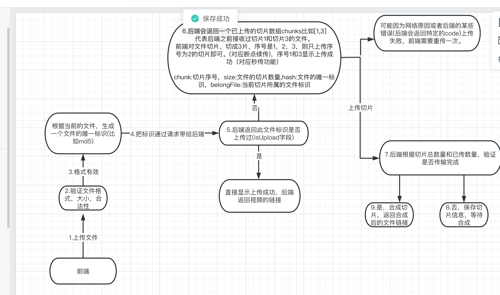
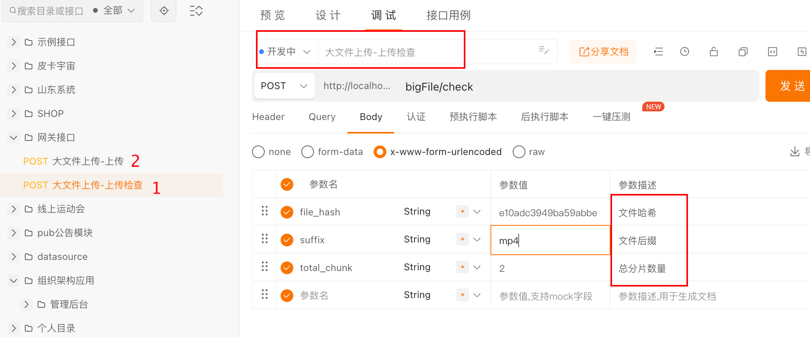
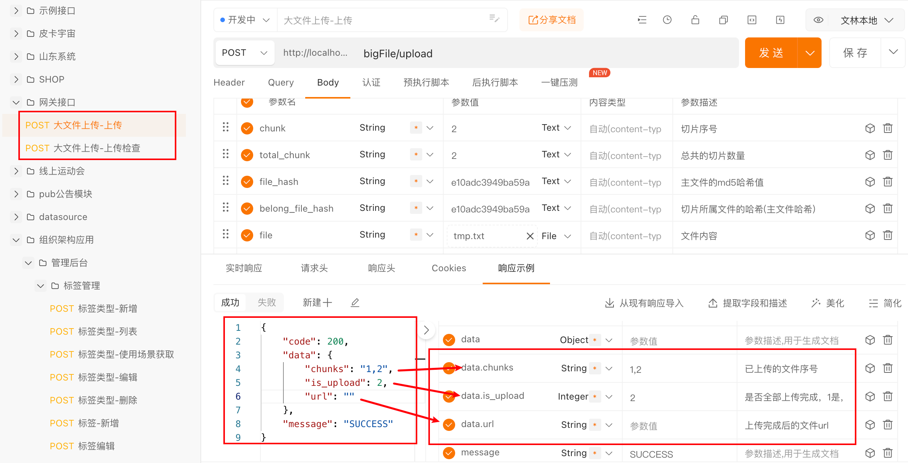

## 1.大文件上传会遇到的问题

当需要上传的文件比较大时可能会面临一些常见的问题和挑战，这些问题需要在设计上传系统时予以考虑和解决。以下是一些大文件上传可能面临的问题：

1. **传输时间和速度**：上传大文件需要更长的时间，速度可能受到网络连接速度、带宽和延迟的限制。慢速的连接可能会导致上传时间过长。
2. **中断和恢复**：上传大文件时，中断可能会发生，例如，由于网络问题或用户退出应用程序。在这种情况下，需要一种方式来支持断点续传，以确保上传可以从中断处恢复，而不必重新开始。
3. **内存和存储需求**：在上传和处理大文件时，可能需要大量的内存和存储空间。这可能会对服务器或客户端的资源产生负担。
4. **安全性**：确保大文件的安全传输非常重要，特别是对于敏感数据。数据应该进行加密，同时需要进行身份验证以防止未经授权的访问。
5. **网络稳定性**：网络不稳定或不可靠可能导致上传失败。这需要实施重试机制，以便在发生上传失败时自动重试。
6. **用户体验**：上传大文件时，提供良好的用户体验至关重要。用户应该能够轻松地上传文件，同时能够看到上传进度和状态。
7. **文件完整性**：确保上传的文件在传输过程中不会损坏或丢失，需要使用校验和和完整性检查。


## 2.解决问题的原理和流程


解决问题的总体的思想就是分而治之，**最后合并的思路**。





### 接口文档

```go
// /go/src/papa/gateway/controller/route.go
_router.POST("/bigFile/check", new(BigFileCheck))             //第一步 大文件上传，上传检查
_router.POST("/bigFile/upload", new(BigFileUpload))           //第二步 大文件上传，断点续传
```


第一步




响应参数




第二步


响应参数


### 2.1如何唯一标识一个文件

在上传之前，前端计算文件的md5值以此去唯一的标示一个文件，文件的信息后端会存储在mysql数据库表中。 可以根据一定的算法去标记文件，而不是对整个文件进行md5(比如取文件的前100位，取文件第100位开始的后面100位，取文件的最后100位，比如快生成md5)


### 2.2断点续传

断点续传可以实现这样的功能，比如RD上传200M的文件，当用户上传完199M时，断网了，有了断点续传的功能，我们允许RD再次上传时，能从第199M的位置重新上传。

实现原理：

实现断点续传的前提是，大文件切片上传。然后前端得问后端哪些chunk曾经上传过，让前端跳过这些上传过的chunk就好了。

前端的上传器（uploader.js）在上传时会先发送一个GET请求，这个请求不会携带任何chunk数据，作用就是向后端询问哪些chunk曾经上传过。 后端会将这些数据保存在mysql数据库表中。比如按这种格式：`1:2:3:5`表示，曾经上传过的分片有1，2，3，5。第四片没有被上传，前端会跳过1，2，3，5。 仅仅会将第四个chunk发送给后端。


### 2.3 秒传是如何实现的？

秒传实现的功能是：当RD重复上传一份相同的文件时，除了第一次上传会正常发送上传请求后，其他的上传都会跳过真正的上传，直接显示秒成功。

实现方式：

后端存储着当前文件的相关信息。为了实现秒传，我们需要搞一个字段（isUploaded）表示当前md5对应的文件是否曾经上传过。 后端在处理 前端的上传器（uploader.js）发送的第一个GET请求时，会将这个字段发送给前端，比如 isUploaded = true。前端看到这个信息后，直接跳过上传，显示上传成功。


### 2.4 前端的并发数。

前端会在同一时刻并发 发送3个chunk，后端就会相应的为每个请求开启三个协程处理上传的过来的chunk。

在我们的项目中，会将前端并发数调整成了1。原因如下：

因为考虑到了断点续传的实现，后端需要记录下曾经上传过哪些切片。（这个记录在mysql的数据库表中，以 ”1:2:3:4:5“ ）这种格式记录。

如果我们将前端的并发数调大，就会出现下面的异常情况：

```
1. goroutine1 获取开启事物，读取当前上传到记录是 1:2 （未提交事物）
2. goroutine1 在现有的记录上加上自己处理的分片3，并和现有的1:2拼接在一起成1:2:3 （未提交事物）
3. goroutine2 获取开启事物，（因为RR，所以它读不到1:2:3）读取当前上传到记录是 1:2 （未提交事物）
4. goroutine1 提交事物，将1:2:3写回到mysql
5. goroutine2 在现有的记录上加上自己处理的分片4，并和现有的1:2拼接在一起成1:2:4 （提交事物）
```


**可以看到，如果前端并发上传，后端可能会出现分片丢失的问题。 其实可以通过数据库加锁实现，但从全局的角度考虑，还是让前端走串行发送。因为如果是并行发送切片，虽然用户上传的速度变快了，但是用户占有的带宽也多了，容易造成一个用户上传了大文件，导致此用户短时间内占用大量带宽，导致其他请求异常的问题，所以为了服务器带宽考虑，最后走串行发送。**


## 3.具体实现细节。


数据库表结构设计

1.主文件信息

```sql
CREATE TABLE `ppospro_big_file_main` (
  `id` int NOT NULL AUTO_INCREMENT,
  `app_id` int NOT NULL DEFAULT '0' COMMENT '平台id',
  `file_name` varchar(255) CHARACTER SET utf8mb4 COLLATE utf8mb4_general_ci NOT NULL DEFAULT '' COMMENT '文件路径和文件名',
  `file_hash` char(32) CHARACTER SET utf8mb4 COLLATE utf8mb4_general_ci NOT NULL DEFAULT '' COMMENT '文件哈希',
  `is_upload` tinyint(1) NOT NULL DEFAULT '2' COMMENT '是否上传完成：1上传完成，2未上传完成',
  `url` varchar(255) CHARACTER SET utf8mb4 COLLATE utf8mb4_general_ci NOT NULL DEFAULT '' COMMENT '文件的链接',
  `total_chunk` int NOT NULL DEFAULT '0' COMMENT '总分片数量',
  `c_time` int NOT NULL DEFAULT '0',
  `u_time` int NOT NULL DEFAULT '0',
  `chunks` varchar(2000) CHARACTER SET utf8mb4 COLLATE utf8mb4_general_ci NOT NULL DEFAULT '' COMMENT '已上传的chunks序号：1,2,3,5',
  PRIMARY KEY (`id`)
) ENGINE=InnoDB AUTO_INCREMENT=253 DEFAULT CHARSET=utf8mb4 COLLATE=utf8mb4_general_ci COMMENT='大文件上传模块-主文件信息表';
```


2.切片文件信息

```sql
CREATE TABLE `ppospro_big_file_slice` (
  `id` int NOT NULL AUTO_INCREMENT,
  `app_id` int NOT NULL DEFAULT '0' COMMENT '应用id',
  `belong_file_hash` char(32) CHARACTER SET utf8mb4 COLLATE utf8mb4_general_ci NOT NULL DEFAULT '' COMMENT '主文件的哈希',
  `chunk` int NOT NULL DEFAULT '0' COMMENT '切片序号',
  `file_hash` char(32) CHARACTER SET utf8mb4 COLLATE utf8mb4_general_ci NOT NULL DEFAULT '' COMMENT '切片文件哈希',
  `file_name` varchar(255) CHARACTER SET utf8mb4 COLLATE utf8mb4_general_ci NOT NULL DEFAULT '' COMMENT '文件目录和名称',
  `c_time` int NOT NULL DEFAULT '0',
  `u_time` int NOT NULL DEFAULT '0',
  PRIMARY KEY (`id`),
  KEY `idx_hash` (`file_hash`) USING BTREE
) ENGINE=InnoDB AUTO_INCREMENT=1489 DEFAULT CHARSET=utf8mb4 COLLATE=utf8mb4_general_ci COMMENT='大文件上传-切片文件表';
```


### 3.具体代码


#### 3.1 控制器层

##### 3.1.1 /bigFile/check check方法

```go
// BigFileCheck 上传前查询
// hash 文件哈希， size 文件大小
type BigFileCheck struct {
	FileHash   string `form:"file_hash"`
	FileSuffix string `form:"suffix"`
	TotalChunk int64  `form:"total_chunk"`
	//Size		int64  `form:"size"`
}

func (c *BigFileCheck) Handler() Handler {
	return new(BigFileCheck)
}

func (c *BigFileCheck) Serve(ctx *gin.Context) error {

	//验证参数
	if len(c.FileHash) != 32 {
		return respon(ctx, utils.ThrowException(40010700, "文件标识应使用32位的md5编码字符串"))
	}

	maxChunk := int64(FILE_SIZE)
	if c.TotalChunk > maxChunk {
		ctx.JSON(200, parse(utils.ThrowException(4001001001, "上传的文件大小不能超过"+utils.ToString(maxChunk*int64(10))+"m")))
		return nil
	}

	_logic := model.NewLogic().NewBigFileMain()
	//处理业务逻辑
	_resMap, _err := _logic.Get(c.FileHash, gateServerDomain, c.FileSuffix, c.TotalChunk).Action(0)

	if _err != nil {
		return respon(ctx, _err)
	}
	return respon(ctx, _resMap)
}


```


##### 3.1.2  /bigFile/upload 方法

```go
// BigFileUpload 大文件上传，带断点续传,切片传输。
/*
	chunk 切片序号
	total_chunk 总切片数量
	file_hash 文件的md5值
	size 大小
	belong_file_hash 所属文件的hash
	file 文件内容
*/
type BigFileUpload struct {
	Chunk      int64 `form:"chunk"`
	TotalChunk int64 `form:"total_chunk"`
	//可以注释掉filehash，根据belong_file_hash和序号标识每一个切片
	//FileHash       string `form:"file_hash"`
	Size           int64  `form:"size"`
	BelongFileHash string `form:"belong_file_hash"`
}

func (c *BigFileUpload) Handler() Handler {
	return new(BigFileUpload)
}

/*func (c *BigFileUpload) Serve(ctx *gin.Context) error {
	//验证参数
	//这个5个参数必传
	_logic := model.NewLogic().NewBigFileMain()
	_logic.SetBigFileUploadParams(&model.BigFileUploadParams{
		Chunk:            c.Chunk,
		TotalChunk:       c.TotalChunk,
		Size:             c.Size,
		BelongFileHash:   c.BelongFileHash,
		GateServerDomain: gateServerDomain,
	})

	if c.Chunk > 100 || c.TotalChunk > 50 {
		ctx.JSON(200, parse(utils.ThrowException(4001001001, "chunk或者totalChunk不能大于50个")))
		return nil
	}

	if c.Chunk > c.TotalChunk {
		ctx.JSON(200, parse(utils.ThrowException(4001001001, "chunk序号不能大于TotalChunk")))
		return nil
	}

	_sizeMax := 100 * 1024 * 1024 //100 * 1024 * 1024
	_file := ctx.Request.Body
	b := make([]byte, _sizeMax)
	_fileSize, err := _file.Read(b)
	if err != nil {
		return err
	}
	if _fileSize > _sizeMax {
		ctx.JSON(200, parse(utils.ThrowException(4001001001, "上传的图像大小不能超过"+utils.SizeFormat(int64(_sizeMax)))))
		return nil
	}

	_returnMp, _errEnd := _logic.Upload(&b).Action(0)
	fmt.Println(_returnMp)
	fmt.Println(_errEnd)
	if _errEnd != nil {
		return respon(ctx, _errEnd)
	}
	return respon(ctx, _returnMp)
}
*/

func (c *BigFileUpload) Serve(ctx *gin.Context) error {

	//验证参数
	//这个5个参数必传
	_logic := model.NewLogic().NewBigFileMain()
	_logic.SetBigFileUploadParams(&model.BigFileUploadParams{
		Chunk:            c.Chunk,
		TotalChunk:       c.TotalChunk,
		Size:             c.Size,
		BelongFileHash:   c.BelongFileHash,
		GateServerDomain: gateServerDomain,
	})

	if c.Chunk > c.TotalChunk {
		ctx.JSON(200, parse(utils.ThrowException(4001001001, "chunk序号不能大于TotalChunk")))
		return nil
	}

	_sizeMax := int64(30 * 1024 * 1024) //2 * 1024 * 1024
	_file, _header, _err := ctx.Request.FormFile("file")
	if _err != nil {
		return respon(ctx, utils.ThrowException(400100001, "文件解析失败:"+_err.Error()))
	}

	//1024 * 1024 * 20   每个分块10M
	if _header.Size > _sizeMax {
		ctx.JSON(200, parse(utils.ThrowException(4001001001, "单次上传的图像大小不能超过"+utils.SizeFormat(_sizeMax))))
		return nil
	}

	//最大FILE_SIZEm
	maxChunk := int64(FILE_SIZE)
	if c.TotalChunk > maxChunk || c.Chunk > maxChunk {
		ctx.JSON(200, parse(utils.ThrowException(4001001001, "上传的文件大小不能超过"+utils.ToString(maxChunk*int64(10))+"m")))
		return nil
	}
	//验证mime type

	if c.Chunk == 1 {
		headSlice := make([]byte, 512)
		_, _err := _file.Read(headSlice)
		if _err != nil {
			fmt.Println(_err)
			ctx.JSON(200, parse(utils.ThrowException(4001001001, "无效的文件格式"+_err.Error())))
			return nil
		}
		_contentType := http.DetectContentType(headSlice)
		fmt.Println(_contentType)
		_mimeType := "image/jpeg,image/png,image/gif,image/svg+xml,image/webp,video/mp4,video/x-m4v,video/quicktime,video/x-ms-wmv,video/x-msvideo,video/mpeg,application/msword,application/vnd.ms-excel,application/pdf"
		if strings.Contains(_mimeType, _contentType) == false {
			ctx.JSON(200, parse(utils.ThrowException(4001001001, "非法的文件格式")))
			return nil
		}
	}

	//重置文件的偏移量
	_, err := _file.Seek(0, 0)
	if err != nil {
		return err
	}

	_returnMp, _errEnd := _logic.Upload(&_file).Action(0)
	if _errEnd != nil {
		return respon(ctx, _errEnd)
	}
	return respon(ctx, _returnMp)
}

func respon(ctx *gin.Context, data interface{}) error {
	ctx.JSON(200, parse(data))
	return nil
}
```


#### 3.2 逻辑logic层

```go
package model

import (
	"fmt"
	"gateway/model/db"
	"io"
	"io/ioutil"
	"mime/multipart"
	"os"
	"runtime"
	"strconv"
	"strings"
	"time"

	//"PPOSUtils/utils"
	"PPOSUtils/utils"
	//"gateway/model/db"
)

// BigFileMain 大文件上传
type BigFileMain struct {
	dbInstance
	//BigFileMainId int64
	FileHash string
	params   *BigFileUploadParams
}

type BigFileUploadParams struct {
	Chunk            int64
	TotalChunk       int64
	Size             int64
	BelongFileHash   string
	GateServerDomain string
}

func (that *Logic) NewBigFileMain() *BigFileMain {
	return &BigFileMain{
		dbInstance: dbInstance{Logic: that},
		params:     new(BigFileUploadParams),
	}
}

func (that *BigFileMain) SetBigFileUploadParams(value *BigFileUploadParams) {
	that.params = value

}

func (that *BigFileMain) SetAccountType(fileHash string) *BigFileMain {
	that.FileHash = fileHash
	return that
}

//check
func (that *BigFileMain) Get(fileHash, domain, suffix string, totalChunk int64) utils.UtilsAction {

	return that.NewUtilsActon(func() interface{} {
		//查询时记得加锁for update 前端可能并发请求
		//1。hash查库，
		//2. 如果对应的hash之前的切片有全部上传过，则isUpload返回true，而且返回分片数组chunks的
		//全部序号。chunks 【1，2，3】，而且返回上传后的文件路径。2.2如果没有全部传过，返回之前上传过的chunks序号数组。
		//isUpload false，而且返回分片数组chunks的，file_name
		_db := db.NewDB(nil)
		defer _db.Close()
		_bigFileMainDb := _db.NewBigFileMain()

		_returnMap := make(utils.Mp)

		_isExist, _err := _bigFileMainDb.GetOneByFileHash(fileHash, false)
		if _err != nil {
			return _err
		}

		if !_isExist {
			//没有文件标识,返回固定参数
			//插入
			_bigFileMainDb.FileHash = fileHash
			_bigFileMainDb.IsUpload = 2
			_bigFileMainDb.FileName = suffix
			_bigFileMainDb.TotalChunk = totalChunk
			if _err := _bigFileMainDb.Add(); _err != nil {
				return _err
			}
			_returnMap["is_upload"] = 2
			_returnMap["url"] = ""
			_returnMap["chunks"] = ""
			return _returnMap
		}

		_returnMap["is_upload"] = _bigFileMainDb.IsUpload
		if _bigFileMainDb.Url != "" {
			_returnMap["url"] = domain + "/" + _bigFileMainDb.Url
		} else {
			_returnMap["url"] = ""
		}
		_returnMap["chunks"] = _bigFileMainDb.Chunks
		return _returnMap
	})
}

func createFileSlice(file *multipart.File, dirFilePath, fileName string) interface{} {

	startTime := time.Now().UnixMilli()
	isEx, err := utils.PathExists(dirFilePath)
	if err != nil {
		return err
	}
	if !isEx {
		err = os.MkdirAll(dirFilePath, 0777)
		if err != nil {
			fmt.Println("------MkdirAll err")
			return err
		}
	}
	//创建文件
	_filePath := dirFilePath + fileName
	out, err := os.Create(_filePath)
	if err != nil {
		//获取错误文件和错误行
		_, file, line, _ := runtime.Caller(0)
		fmt.Println(file + ":" + strconv.Itoa(line) + ",上传错误：%s" + err.Error())
		return utils.ThrowException(40004001, file+":"+strconv.Itoa(line)+",上传错误：%s"+err.Error())
	}
	defer out.Close()

	//创建文件
	_, err = io.Copy(out, *file)
	if err != nil {
		fmt.Println("------WriteFile err")
		return err
	}

	fmt.Println("-----------切片文件操作耗时-----ms:", time.Now().UnixMilli()-startTime)
	return nil
}

func mergeFileSlice(dirFilePath, filenameSuffix, belongFileHash string, totalChunks int) (bool, string) {
	// 开始merge
	uni := utils.UniqueId()
	targetFileName := dirFilePath + "/" + uni + "OK." + filenameSuffix
	endFileName := uni + "OK." + filenameSuffix
	startTime := time.Now().UnixMilli()

	if totalChunks == 1 {
		//无需合并，直接返回修改chunk1的文件名即可
		err := os.Rename(dirFilePath+"/chunk1."+filenameSuffix, targetFileName)
		if err != nil {
			fmt.Printf("error : %v", err)
			return false, endFileName
		}
	} else {
		// 创建临时文件
		f, err := os.OpenFile(targetFileName, os.O_CREATE|os.O_APPEND|os.O_RDWR, 0666)
		defer f.Close()
		if err != nil {
			fmt.Printf("error : %v", err)
			return false, endFileName
		}
		var totalSize int64

		// 合并文件  /upload/username/fileMd5/chunks
		// 读出指定目录下的所有文件
		for i := 1; i <= totalChunks; i++ {
			currentChunkFile := dirFilePath + "/chunk" + strconv.Itoa(i) + "." + filenameSuffix // 当前的分片名
			println(currentChunkFile)
			bytes, _err := ioutil.ReadFile(currentChunkFile)
			if _err != nil {
				fmt.Printf("error : %v", err)
				return false, endFileName
			}
			num, _err := f.Write(bytes)
			if _err != nil {
				fmt.Printf("error : %v", err)
				return false, endFileName
			}
			totalSize += int64(num)
		}
	}

	//异步删除
	go func() {
		//合成成功，删除旧文件
		for i := 1; i <= totalChunks; i++ {
			currentChunkFile := dirFilePath + "/chunk" + strconv.Itoa(i) + "." + filenameSuffix // 当前的分片名
			//不用处理错误，删除失败就失败，不影响主流程
			err := os.Remove(currentChunkFile)
			if err != nil {
				fmt.Println(currentChunkFile)
				fmt.Println(err)
			}
		}
	}()

	fmt.Println("-----------合并文件操作耗时-----ms:", time.Now().UnixMilli()-startTime)
	return true, endFileName
}

//切片文件，带hash
/*func (that *BigFileMain) UploadBak(requestParam utils.Mp, ctx *gin.Context) utils.UtilsAction {
	//40010700是提示错误
	//40010701是数据库错误

	//// 查询时记得加锁for update 前端可能并发请求
	//查询数据库中，当前文件的标识的序号， 和file_hash在数据库中是否存在，存在则直接返回成功。
	//不存在，则生成文件名 ，把文件放到一个指定的目录下存放(ctx.SaveUploadedFile())
	//文件操作成功后再操作数据库
	//然后把对应的chunks数组，加上当前的切片序号，保存在数据库中
	//判断当前切片序号，是否为最后一个切片  Chunk 和 TotalChunk 是否一样，如果一样，需要merge所有的
	//切片文件，生成一个大文件，并把大文件的视频链接，存储在数据库中，注意视频链接应该有访问权限。
	//返回合成文件的链接，返回切片的序号
	//如果有一些特殊原因，可以返回一个重传的code，前端检测到重传的code就会重传

	return that.NewUtilsActon(func() interface{} {

		file, _header, _err := ctx.Request.FormFile("file")

		// 只需要前 512 个字节就可以了
		_buffer := make([]byte, 512)
		_, _ = file.Read(_buffer)
		_contentType := http.DetectContentType(_buffer)

		_mimeType := "video/mp4,video/x-m4v,video/quicktime,video/x-ms-wmv,video/x-msvideo,video/mpeg,application/msword,application/vnd.ms-excel,application/pdf"
		if strings.Contains(_mimeType, _contentType) == false {
			fmt.Println(_contentType)
			return utils.ThrowException(40004001, "非法的文件格式")
		}

		if _err != nil {
			return that.throwException(40004001, "上传出现错误"+_err.Error())
		}
		//文件的名称
		_filename := strings.Split(_header.Filename, ".")
		_filenameSuffix := _filename[len(_filename)-1]
		//判断文件后缀是否允许上传
		_suffix := "doc,docx,xls,xlsx,pdf,mp4,wmv,3gp,avi,mov,mpg,mpeg"
		if strings.Contains(_suffix, _filenameSuffix) == false {
			fmt.Println(_filenameSuffix)
			return that.throwException(40004001, "上传格式不允许，只允许上传上传："+_suffix)
		}

		// size不能超过_sizeMax大小
		_sizeMax := int64(104857600) //100 * 1024 * 1024
		if _header.Size > _sizeMax {
			fmt.Println(_header.Size)
			return that.throwException(40004001, "上传的图像大小不能超过"+utils.SizeFormat(_sizeMax))
		}

		//BelongFileHash 必须在main中存在
		_db := that.db()
		defer _db.Close()

		_err = _db.Begin()
		if _err != nil {
			return _err
		}
		//验证主文件哈希
		_bigFileMainDb := _db.NewBigFileMain()
		_isExist, _err := _bigFileMainDb.GetOneLockByFileHash(requestParam["BelongFileHash"].(string))
		if _err != nil {
			_db.Rollback()
			return that.throwException(40010701, _err)
		}

		//错误的主文件hash
		if !_isExist {
			_db.Rollback()
			return that.throwException(40010700, "没有对应的belong_file_hash数据")
		}

		if _bigFileMainDb.IsUpload == 1 {
			// 已经上传完成，不需要再进行操作了
			_db.Rollback()
			return that.throwException(40010700, "该文件之前已上传成功，无需再次上传")
		}

		_bigFileSliceDb := _db.NewBigFileSlice()
		_isExist, _err = _bigFileSliceDb.GetOneByHashAndChunk(requestParam["FileHash"].(string), 1)
		if _err != nil {
			_db.Rollback()
			return that.throwException(40010701, _err)
		}

		_endFileName, _endFileUrl := "", ""
		//存在，说明之前上传过文件hash，直接返回成功
		if _isExist {
			_db.Commit()
			if _bigFileMainDb.Url != "" {
				_endFileUrl = requestParam["Domain"].(string) + "/" + _bigFileMainDb.Url
			}
			return utils.Mp{"is_upload": _bigFileMainDb.IsUpload, "url": _endFileUrl, "chunks": _bigFileMainDb.Chunks}
		}

		//文件操作 生成指定文件切片
		// chunk1.mp4
		_chunk := (int)(requestParam["Chunk"].(int64))
		_newFilename := "chunk" + strconv.Itoa(_chunk) + "." + _filenameSuffix

		_filePath := "bigFile/" + time.Now().Format("20060102") + "/" + requestParam["BelongFileHash"].(string)

		_fileUrl := "upload/" + _filePath // upload/bigFile/20230816/e10adc3949ba59abbe56e057f20f8832
		dir, _ := os.Getwd()
		_dirFilePath := dir + "/" + _fileUrl // /Users/zwl/code/demo/upload/bigFile/20230816/e10adc3949ba59abbe56e057f20f8832

		//创建文件切片
		res := createFileSlice(file, _dirFilePath, "/"+_newFilename)
		if res != nil {
			_db.Rollback()
			return res
		}

		//新增一条数据 slice
		_bigFileSliceDbAdd := _db.NewBigFileSlice()
		_bigFileSliceDbAdd.BelongFileHash = requestParam["BelongFileHash"].(string)
		_bigFileSliceDbAdd.FileHash = requestParam["FileHash"].(string)
		_bigFileSliceDbAdd.FileName = _dirFilePath + "/" + _newFilename
		_bigFileSliceDbAdd.Chunk = requestParam["Chunk"].(int64)
		if _err := _bigFileSliceDbAdd.Add(); _err != nil {
			_db.Rollback()
			return _err
		}

		_totalChunk := requestParam["TotalChunk"].(int64)
		_isMergeOK := false

		_chunksSlice := make([]string, 0)
		if _bigFileMainDb.Chunks != "" {
			_chunksSlice = strings.Split(_bigFileMainDb.Chunks, ",")
		}

		if len(_chunksSlice)+1 == int(_totalChunk) {
			//需要合成所有切片数据  如果等于true 则操作数据库
			_isMergeOK, _endFileName = mergeFileSlice(_dirFilePath, _filenameSuffix, requestParam["BelongFileHash"].(string), int(_totalChunk))
		}

		_bigFileMainUpdate := _db.NewBigFileMain()
		_isUpload := 2

		if _isMergeOK {
			// 操作数据库 增加更新条件 file_name,url,is-upload=1,total_chunk
			_bigFileMainUpdate.IsUpload = 1
			_bigFileMainUpdate.TotalChunk = _totalChunk
			_bigFileMainUpdate.Url = _fileUrl + "/" + _endFileName
			_bigFileMainUpdate.FileName = _dirFilePath + "/" + _endFileName
			_isUpload = 1

			_endFileUrl = requestParam["Domain"].(string) + "/" + _fileUrl + "/" + _endFileName
		}

		//成功了 进行数据库操作，更新,chunks
		//chunks  序号要改 main
		_chunks := ""
		if len(_bigFileMainDb.Chunks) == 0 {
			_chunks = strconv.Itoa(_chunk)
		} else {
			_chunks = _bigFileMainDb.Chunks + "," + strconv.Itoa(_chunk)
		}

		_bigFileMainUpdate.Chunks = _chunks
		_updateNum, _err := _bigFileMainUpdate.UpdateByFileHash(requestParam["BelongFileHash"].(string))
		if _err != nil {
			_db.Rollback()
			return _err
		}

		if _updateNum <= 0 {
			_db.Rollback()
			fmt.Println("更新失败,影响的行数:", _updateNum)
			return _updateNum
		}

		_db.Commit()
		return utils.Mp{"is_upload": _isUpload, "url": _endFileUrl, "chunks": _chunks}
	})
}*/

// upload
func (that *BigFileMain) Upload(file *multipart.File) utils.UtilsAction {
	//40010700是提示错误
	//40010701是数据库错误

	//// 查询时记得加锁for update 前端可能并发请求
	//查询数据库中，当前文件的标识的序号， 和file_hash在数据库中是否存在，存在则直接返回成功。
	//不存在，则生成文件名 ，把文件放到一个指定的目录下存放(ctx.SaveUploadedFile())
	//文件操作成功后再操作数据库
	//然后把对应的chunks数组，加上当前的切片序号，保存在数据库中
	//判断当前切片序号，是否为最后一个切片  Chunk 和 TotalChunk 是否一样，如果一样，需要merge所有的
	//切片文件，生成一个大文件，并把大文件的视频链接，存储在数据库中，注意视频链接应该有访问权限。
	//返回合成文件的链接，返回切片的序号
	//如果有一些特殊原因，可以返回一个重传的code，前端检测到重传的code就会重传
	return that.NewUtilsActon(func() interface{} {
		//BelongFileHash 必须在main中存在
		_db := that.db()
		defer _db.Close()
		//验证主文件哈希
		_bigFileMainDb := _db.NewBigFileMain()
		//_isExist, _err := _bigFileMainDb.GetOneLockByFileHash(that.params.BelongFileHash)
		_isExist, _err := _bigFileMainDb.GetOneByFileHash(that.params.BelongFileHash, false)
		if _err != nil {
			return that.throwException(40010701, _err)
		}

		//错误的主文件hash
		if !_isExist {
			return that.throwException(40010700, "没有对应的belong_file_hash数据")
		}

		_endFileName, _endFileUrl := "", ""
		if _bigFileMainDb.IsUpload == 1 {
			// 已经上传完成，不需要再进行操作了
			if _bigFileMainDb.Url != "" {
				_endFileUrl = that.params.GateServerDomain + "/" + _bigFileMainDb.Url
			}
			return utils.Mp{"is_upload": 1, "url": _endFileUrl, "chunks": _bigFileMainDb.Chunks}
		}

		_bigFileSliceDb := _db.NewBigFileSlice()
		_isExist, _err = _bigFileSliceDb.GetOneByHashAndChunk(that.params.BelongFileHash, that.params.Chunk)
		if _err != nil {
			return that.throwException(40010701, _err)
		}

		//存在，说明之前上传过文件hash，直接返回成功
		if _isExist {
			if _bigFileMainDb.Url != "" {
				_endFileUrl = that.params.GateServerDomain + "/" + _bigFileMainDb.Url
			}
			return utils.Mp{"is_upload": _bigFileMainDb.IsUpload, "url": _endFileUrl, "chunks": _bigFileMainDb.Chunks}
		}

		//文件操作 生成指定文件切片
		// chunk1.mp4
		_chunk := that.params.Chunk
		_newFilename := "chunk" + utils.ToString(_chunk) + "." + _bigFileMainDb.FileName

		_filePath := "bigFile/" + time.Now().Format("20060102") + "/" + that.params.BelongFileHash

		_fileUrl := "upload/" + _filePath // upload/bigFile/20230816/e10adc3949ba59abbe56e057f20f8832
		dir, _ := os.Getwd()
		_dirFilePath := dir + "/" + _fileUrl // /Users/zwl/code/demo/upload/bigFile/20230816/e10adc3949ba59abbe56e057f20f8832

		//创建文件切片
		res := createFileSlice(file, _dirFilePath, "/"+_newFilename)
		if res != nil {
			return res
		}
		//新增一条数据 slice
		_bigFileSliceDbAdd := _db.NewBigFileSlice()
		_bigFileSliceDbAdd.BelongFileHash = that.params.BelongFileHash
		//_bigFileSliceDbAdd.FileHash = requestParam["FileHash"].(string)
		_bigFileSliceDbAdd.FileName = _dirFilePath + "/" + _newFilename
		_bigFileSliceDbAdd.Chunk = that.params.Chunk

		if _err := _bigFileSliceDbAdd.Add(); _err != nil {
			return _err
		}
		_totalChunk := that.params.TotalChunk
		_isMergeOK := false
		_chunksSlice := make([]string, 0)
		if _bigFileMainDb.Chunks != "" {
			_chunksSlice = strings.Split(_bigFileMainDb.Chunks, ",")
		}

		if len(_chunksSlice)+1 == int(_totalChunk) {
			//需要合成所有切片数据  如果等于true 则操作数据库
			_isMergeOK, _endFileName = mergeFileSlice(_dirFilePath, _bigFileMainDb.FileName, that.params.BelongFileHash, int(_totalChunk))

		}
		_bigFileMainUpdate := _db.NewBigFileMain()
		_isUpload := 2
		if _isMergeOK {
			// 操作数据库 增加更新条件 file_name,url,is-upload=1,total_chunk
			_bigFileMainUpdate.IsUpload = 1
			_bigFileMainUpdate.TotalChunk = _totalChunk
			_bigFileMainUpdate.Url = _fileUrl + "/" + _endFileName
			_bigFileMainUpdate.FileName = _dirFilePath + "/" + _endFileName
			_isUpload = 1
			_endFileUrl = that.params.GateServerDomain + "/" + _fileUrl + "/" + _endFileName
		}

		//成功了 进行数据库操作，更新,chunks
		//chunks  序号要改 main
		_chunks := ""
		if len(_bigFileMainDb.Chunks) == 0 {
			_chunks = utils.ToString(_chunk)
		} else {
			_chunks = _bigFileMainDb.Chunks + "," + utils.ToString(_chunk)
		}

		_bigFileMainUpdate.Chunks = _chunks

		_updateNum, _err := _bigFileMainUpdate.UpdateByFileHash(that.params.BelongFileHash)
		if _err != nil {
			return _err
		}

		if _updateNum <= 0 {
			fmt.Println("更新失败,影响的行数:", _updateNum)
			return _updateNum
		}
		return utils.Mp{"is_upload": _isUpload, "url": _endFileUrl, "chunks": _chunks}
	})
}

```


#### 3.3 数据库层

```go
package db

import "PPOSUtils/utils"

//NewBigFileMain 构造方法：业务应用
func (database *DataBase) NewBigFileMain(injectionMp ...interface{}) *BigFileMain {
	_self := new(BigFileMain)
	_self.ModeHeader = ModeHeader{}.init(database, _self, injectionMp...)
	return _self
}

//BigFileMain db 业务应用
type BigFileMain struct {
	ModeHeader `xorm:"extends"`
	//BigFileMainId int64  `xorm:"int(11) not null comment('表id')" json:"big_file_main_id"` //表id
	FileName   string `xorm:"varchar(255) not null comment('文件名称')" json:"file_name"` //文件名称
	FileHash   string `xorm:"varchar(255) not null comment('文件哈希')" json:"file_hash"` //文件哈希
	IsUpload   int64  `xorm:"tinyint(1) not null comment('是否上传完成：1上传完成，2未上传完成')" json:"is_upload"`
	Url        string `xorm:"varchar(255) not null comment('文件的链接')" json:"url"`     //
	TotalChunk int64  `xorm:"int(11) not null comment('总分片数量')" json:"total_chunk"`  //
	Chunks     string `xorm:"varchar(255) not null comment('切片序号数组')" json:"chunks"` //
	ModeFooter `xorm:"extends"`
}

//GetAll  业务应用
func (that *BigFileMain) GetAll() ([]*BigFileMain, error) {
	_session := that.NewSession()
	defer _session.Close()
	_list := []*BigFileMain{}
	_err := _session.Find(&_list)
	return _list, _err
}

//GetByMpId  业务应用，查询一条 111232
func (that *BigFileMain) GetOneByFileHash(fileHash string, isLock bool) (bool, error) {
	_session := that.NewSession()
	defer _session.Close()
	_session.Where("file_hash = ?", fileHash)
	if isLock {
		_session.ForUpdate()
	}
	return _session.Get(that)
}

func (that *BigFileMain) Get(optionSlice utils.Mp) (bool, error) {
	_session := that.NewSession()
	defer _session.Close()

	if optionSlice.Has("fileHash") {
		_session.Where("file_hash = ?", optionSlice.Get("fileHash"))
	}
	return _session.Get(that)
}

func (that *BigFileMain) UpdateByFileHash(fileHash string) (int64, error) {
	_session := that.NewSession()
	defer _session.Close()
	return _session.Where("file_hash = ?", fileHash).Update(that)
}

```


#### 3.4 需要注意的点

什么时候触发合并所有切片的动作

当数据库中ppospro_big_file_main的chunks字段（已上传的chunks序号：1,2,3,5），等于total_chunk字段（总的切片数量）时，进行合并，找出已存在的所有文件，按序号读取，并把读取到的字节数量，按顺序写入到合并的文件中，合并成功后，走异步删除所有的分片文件。

```go
func mergeFileSlice(dirFilePath, filenameSuffix, belongFileHash string, totalChunks int) (bool, string) {
	// 开始merge
	uni := utils.UniqueId()
	targetFileName := dirFilePath + "/" + uni + "OK." + filenameSuffix
	endFileName := uni + "OK." + filenameSuffix
	startTime := time.Now().UnixMilli()

	if totalChunks == 1 {
		//无需合并，直接返回修改chunk1的文件名即可
		err := os.Rename(dirFilePath+"/chunk1."+filenameSuffix, targetFileName)
		if err != nil {
			fmt.Printf("error : %v", err)
			return false, endFileName
		}
	} else {
		// 创建临时文件
		f, err := os.OpenFile(targetFileName, os.O_CREATE|os.O_APPEND|os.O_RDWR, 0666)
		defer f.Close()
		if err != nil {
			fmt.Printf("error : %v", err)
			return false, endFileName
		}
		var totalSize int64

		// 合并文件  /upload/username/fileMd5/chunks
		// 读出指定目录下的所有文件
		for i := 1; i <= totalChunks; i++ {
			currentChunkFile := dirFilePath + "/chunk" + strconv.Itoa(i) + "." + filenameSuffix // 当前的分片名
			println(currentChunkFile)
			bytes, _err := ioutil.ReadFile(currentChunkFile)
			if _err != nil {
				fmt.Printf("error : %v", err)
				return false, endFileName
			}
			num, _err := f.Write(bytes)
			if _err != nil {
				fmt.Printf("error : %v", err)
				return false, endFileName
			}
			totalSize += int64(num)
		}
	}

	//异步删除
	go func() {
		//合成成功，删除旧文件
		for i := 1; i <= totalChunks; i++ {
			currentChunkFile := dirFilePath + "/chunk" + strconv.Itoa(i) + "." + filenameSuffix // 当前的分片名
			//不用处理错误，删除失败就失败，不影响主流程
			err := os.Remove(currentChunkFile)
			if err != nil {
				fmt.Println(currentChunkFile)
				fmt.Println(err)
			}
		}
	}()

	fmt.Println("-----------合并文件操作耗时-----ms:", time.Now().UnixMilli()-startTime)
	return true, endFileName
}
```

