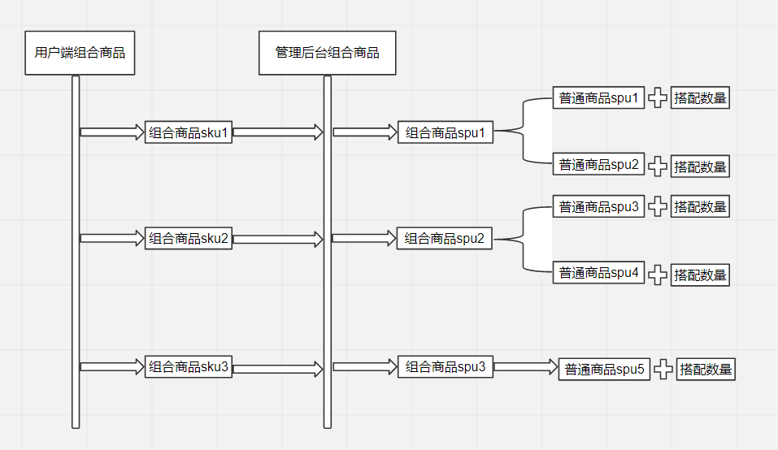
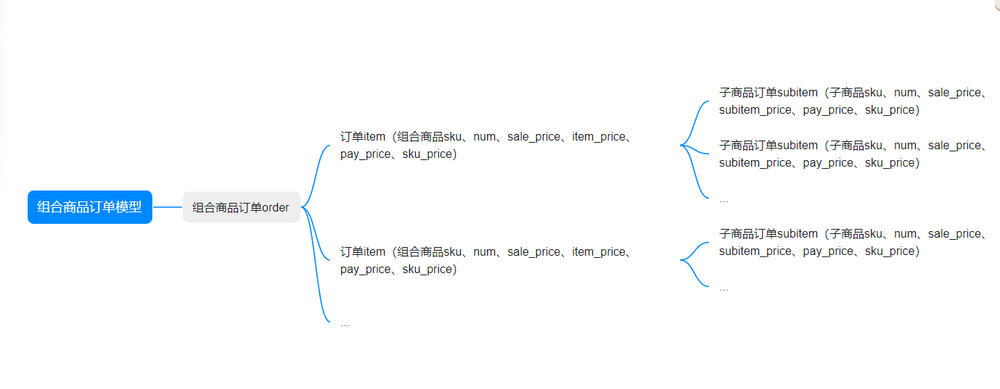

# 组合产品设计文档

 

### 1. 需求背景
体育场馆运营中，存在两个或多个项目的门票打包共同售卖（联票），用户可以根据联票权益在多个项目中运动。这里被打包的门票可能使用馆不是一个，销售馆和使用馆也不相同。

这种销售方式是把多张门票打包成一个组合商品，单独定价，库存却是和单独售卖的商品走的是同一库存。

后续还会有“买卡赠票”，“买票送装备”等组合情况，所以考虑把这个需求设计成通用功能，以后可以自由组合产品售卖，
形成多样化的产品组合，以提供给客户更多选择，最大化满足不同客户群体的需求，同时这也是一种营销方式，可以促进销售。

### 2. 设计思路

这里先介绍几个概念

组合商品VS套装商品

组合商品是指，人为将几个单独售卖的商品组合在一起进行合并售卖的商品。其中被组合商品本身也是独立的可售卖个体。

而套装商品则不同，套装商品本身在生产及供给中是以“套”为最小单位进行管理的。从制造商的生产，平台向供应商的采购或后期销售都是按套售卖，可以直接将套装商品理解成“结构复杂”的普通商品。

本次我们的设计就是实现系统的组合商品功能。

要实现的关键功能主要有以下几点

1. 组合商品的配置和组合关系的管理
2. 组合商品的库存同步
3. 组合商品的订单处理（正逆向）
4. 统计报表和结算

#### 2.1 组合商品的配置和组合关系的管理

需要注意，被组合的商品必须是独立存在的普通商品，不建议组合套组合的套娃设计，会增加后续库存同步和订单处理的复杂度，没有太大必要。

这里的普通商品可以是实物商品，也可以是虚拟票券商品。

**前后端组合关系管理结构梳理**

#### 2.2 组合商品的库存同步

现有系统普通商品大致分四类：

1. 实物商品，如水，饮料，运动器材等，每种商品都有sku和对应的库存

2. 门票，场地类的商品，只有确定售卖日期才能知道具体的sku信息，如2024年5月1日的篮球散客票上午场，如果不确定具体哪一天的门票，是不能确定要购买的商品的完整信息的，只知道是篮球散客票上午场，也就是我们常说的spu。系统设置的也是该spu的库存，每天都有这些库存。

3. 会员卡类型的商品，有销售数量限制，销售数量即为库存

4. 租赁类型商品，不限制销售数量

**被组合的单品扣减库存会有两个途径：**

单品（商品IDXXXX，规格IDXXXX）销售扣减

组合商品（组合商品IDYYYYYY，组合商品规格IDYYYYYY）销售扣减。

用户下单扣减单品库存。
单品独立售卖和组合售卖扣减同一库存，在其中任一方售出时，则对应的另一方可用库存即会同步减扣。

**组合商品按分类不同，库存计算也不同**
- 商品组合，库存是初始配置库存，单品独立售卖和组合售卖扣减同一库存，库存是一直减的

- 门票组合，每日库存都会更新为初始配置的库存

- 商品门票组合，商品库存是单品的库存，每日不会刷新，门票库存每日更新为初始配置的库存

- 买卡赠票组合，卡库存是卡的总库存，每日不会刷新，票库存每日会刷新

- 买票赠器材租赁组合，票库存每日会刷新，器材租赁无库存限制

  ...

总结一下，**组合商品的库存取决于子商品里库存数量最小的那个**（可能会出现组合商品库存变更记录是不连续的情况，也可能会出现库存少了之后，第二天又增多的情况），单品独立售卖和组合售卖扣减同一库存，在其中任一方售出时，则对应的另一方可用库存即会同步减扣。

#### 2.3 组合商品的订单处理

组合商品属于营销性质，以后还会有其他的营销功能模块，所以新增营销管理子系统。在中心端增加“营销活动管理”菜单，下挂“组合商品配置”子菜单

新增组合商品类型的订单，该订单业务类型编号为2001和2002，分别对应正向单和反向单
该订单的订单模型如下

#### 2.4 统计报表和结算

组合商品订单按正常订单记录收银收款统计数据，并增加组合商品的销售明细统计报表。
组合商品中的各子商品分别记入各自销售明细中，打上来自组合单的标记。
分类统计按子商品写入记录，组合商品不再记入，否则会重复

因组合商品中的子商品使用馆可能不是销售馆，需要提供跨馆销售结算报表。

### 3. 数据库表结构设计

...
