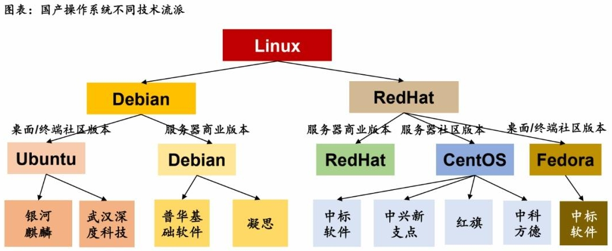

## 定义

信创即信息技术应用创新产业，旨在实现信息技术领域的自主可控，确保信息技术的安全性和国产化替代。

 

## 产业的发展

我们国家的整个信创产业可以分为4个阶段，早在80年代就已经开始关注到自主可控，从操作系统到服务器都有一些水花，但随着“棱镜门”、“技术封锁”等黑天鹅事件的发生，信创的步伐逐渐开始加快，在2018年国家将整个信创产业上升到战略级别，而根据计划在2027年国央企需要完成信息化系统的全部信创改造，可见至少在国家层面信创产业和技术都是值得留意的。

 

## 产业类别

整个信创产业包括了数据安全、网络安全的基础设施，并且是新基建的重要组成部分。信创产业涉及到多个领域，包括但不限于IT基础设施（如CPU芯片、服务器、存储、交换机、路由器）、基础软件（如数据库、操作系统、中间件）、应用软件（如OA、ERP、办公软件、政务应用）以及信息安全产品（如边界安全产品和终端安全产品）

 

## 芯片CPU
|           | 龙芯           | 鲲鹏      | 飞腾     | 海光    | 兆芯   | 申威 |
| --------- |:-------------:|:---------|:--------|:--------|:--------|:--------|
| 研发单位   |  中科院计算所  | 华为      | 天津飞腾  | 天津海光 |上海兆芯 |江南计算所 |
| 指令集体系 |  MIPS        | ARM       | ARM     | X86(AMD)| X86(VIA)    | ALPHA |
| 架构来源   | 指令集授权+自研| 指令集授权 | 指令集授权 | IP授权 | 威盛合资 | 指令集授权+自研 |
| 代表产品 | 龙芯11龙芯21龙芯3  | 鲲鹏920 | FT-2000/4、FT-2000+/64 | Hygon C86-7185 | ZXC FC-1080/1081 | 申威SW1600/SW26010 |
| 优势 | MIPS架构功耗低。终端芯片不错  | ARM服务器芯片中性能最佳 | 终端芯片和服务器芯片整体性能较好 | 基于AMD最新的Zen架构，性能高 | 兼容性强，终端领域应用可以无缝对接，得到上海市资金扶持 | 不依赖商业机构授权，自主性较高 |
| 劣势 | 只有低端的服务器芯片，MIPS指令集已停止发展  | 兼容性和生态需要进一步打造 | 兼容性和生态需要进一步打造;商用性能需要进一步提升 | 因被列入美国实体名单，技术持续性较差 | 存在知识产权瑕疵，是否自主可控存疑;没有服务器芯片 | Alpha指令集停止更新；主要用于超算和军队，市场和生态能力弱 |

 

## 操作系统
目前国产操作系统均是基于Linux内核进行的二次开发。

### 国产操作系统总览

| 国产OS | 主要产品 | 背景 | 适配硬件 | 排名或资质 | 
| --------- | --------- | --------- | --------- | --------- |
| 中标麒麟 | 桌面OS、服务器OS | CEC/中国软件 | 兼容适配目前所有国产CPU | 中国Linux市场占有率第一 |
| 银河麒麟 | 桌面OS、服务器OS | CEC/中国软件 | 适配飞腾、X86、ARM  | 通过公安部结构化保护级(第四级)测评、军方的军B+级安全认 | 
| 普华软件 | 桌面OS、服务器OS | CEC/太极股份 | 支持X86、Open Power、国产龙芯、申威、兆芯 | - |
| 深度(Deepin) | 桌面OS、服务器OS | 诚迈科技、绿盟科技 | 兆芯、华为海思等 | 全球开源操作系统(DistroWatch)排10名左右 |
| 中科方德 | 桌面OS、服务器OS | 中科院软件所 | 兆芯、支持主流x86平台 | - |
| 中兴新支点 | 桌面OS、服务器OS | 中兴通讯 | 龙芯、兆芯、ARM | 通过四级安全认证 |
| 一铭 | 桌面OS、服务器OS | 一铭软件 | 支持Intelx86、X86 64、龙芯、神威等硬件 | - | 
| 起点操作系统StartOS | 桌面OS | 东莞瓦力 | - | - |
| 神威睿思OS | 服务器OS | 江南计算所 | - | - |
| 凝思 | 服务器OS | 北京凝思科技 | - | 军用信息安全产品军B级认证 |

 

## 数据库
| 国产数据库 | 厂商 | 类型 | Sql语法 |  驱动 |
| --------- | --------- | --------- | --------- | --------- |
| TiDB | PingCAP | 关系型 | 高度兼容 MySQL 及 MySQL 生态 | JDBC、ODBC、PDO |
| DM8 | 武汉达梦 | 关系型 | 广泛的SQL语法兼容性, SQL-92 入门级符合率达到 100%，过渡级符合率达到 95%，并且部分支持 SQL-99、SQL:2003、SQL:2008 和 SQL:2011; 提供平滑迁移方案 | JDBC、ODBC、PDO|
| OpenGauss | 华为开源 | 关系型 | 支持标准的SQL92/SQL99/SQL2003/SQL2011规范，兼容postgresql | JDBC、ODBC |
| OceanBase | 阿里/蚂蚁 | 关系型 | 高度兼容 Oracle/MySQL | JDBC、ODBC、PDO、Xorm|
| PolarDB | 阿里云 | 关系型 | 高度兼容 MySQL 系统及生态 | JDBC、ODBC、PDO、Xorm|
| GaussDB | 华为云 | 关系型 | 基于OpenGauss，兼容postgresql | JDBC、ODBC |
| GaussDB For Mysql | 华为云 | 关系型 | 兼容 MySQL | JDBC、ODBC、PDO、Xorm |
| TDSQL | 腾讯云 | 关系型 | 高度兼容 MySQL 及 MySQL 生态 | JDBC、ODBC、PDO、Xorm |
| GBase | 南大通用 | 关系型 | 支持SQL-92、SQL-99、SQL:2003 | JDBC、ODBC |  
| 人大金仓 | 人大金仓 | 关系型 | 广泛的SQL语法兼容性 | JDBC、ODBC |
| MogDB | 云和恩墨 | 关系型 | 基于OpenGauss，兼容postgresql | JDBC、ODBC |

 

## 中间件
根据国标 GB/T 33847-2017《信息技术 中间件术语》定义，中间件（middleware）指位于系统软件之上，用于支持分布式应用软件， 连接不同软件实体的支撑软件。简单来说，中间件是对应用软件起到支撑、连接作用的一种基础软件。

 

### 基础类中间件

| 分类 | 国产中间件 | 厂商 |
| --------- | --------- | --------- |
| 应用服务器 | AAS | 金蝶 |
| 应用服务器 | TongWeb | 东方通 |
| 应用服务器 | BES Application Server | 宝兰德 |
| 应用服务器 | InforSuite AS | 中创 |
| 应用服务器 | PAS | 普元 |
| 应用服务器 | PAS | 普元 |
| 消息中间件 | ADMQ | 金蝶 |
| 消息中间件 | TongLINK/Q | 东方通 |
| 消息中间件 | InforSuite MQ | 中创 |
| 消息中间件 | BESMQ | 宝兰德 |
| 消息中间件 | PMQ | 普元 |
| 消息中间件 | RocketMQ | 阿里 |
| 企业服务总线 | AESB | 金蝶 |
| 企业服务总线 | PrimetonESB | 普元 |
| 企业服务总线 | TongESB | 东方通 |
| 服务代理 | 负载均衡ALB | 金蝶 |
| 服务代理 | Web服务器软件 | 宝兰德 |
| 服务代理 | 负载均衡TongHttpServer | 东方通 |

 

### 数据类中间件

| 分类 | 国产中间件 | 厂商 |
| --------- | --------- | --------- |
| 数据交换和集成 | 天燕数据交换平台ADXP | 金蝶 |
| 数据交换和集成 | 数据交换平台TongDXP | 东方通 |
| 数据交换和集成 | 数据集成平台DI | 普元 |
| 数据交换和集成 | 数据交换和集成中间件DataLink DXP | 宝兰德 |
| 数据缓存 | 天燕分布式缓存软件AMDC | 金蝶 |
| 数据缓存 | 数据缓存中间件TongRDS | 东方通 |
| 数据缓存 | 分布式缓存数据库软件BES CacheDB | 宝兰德 |
| ETL | 燕数据集成软件AETL | 金蝶 |
| ETL | 数据集成开发工具TongETL | 东方通 |
| ETL | 中创ETL工具软件 | 中创 |
| 元数据管理 | 天燕元数据管理软件AMM | 金蝶 |
| 元数据管理 | 元数据管理MetaCube | 普元 |
| 主数据管理 | 天燕主数据管理软件AMDM | 金蝶 |
| 主数据管理 | 主数据管理MDM | 普元 |

 

### 云计算类中间件

| 分类 | 国产中间件 | 厂商 |
| --------- | --------- | --------- |
| API 网关 | 天燕服务网关 ASG | 金蝶 |
| API 网关 | TongGW | 东方通 |
| 服务注册与发现 | EDAS DNCS | 阿里云 |
| 服务网格 | EDAS Mesh | 阿里云 |
| 服务网格 | TCM | 腾讯云 |
| 服务网格 | ASM | 华为云 |
| 服务网格 | ASM | 华为云 |
| 服务网格 | Mesh | 字节跳动 |
| 服务网格 | NSM | 网易 |
| 服务网格 | NSM | 网易 |
| 分布式链路跟踪 | AAPM | 金蝶 |
| 分布式链路跟踪 | Arms | 阿里云 |
| 分布式链路跟踪 | 华为云APM | 华为云 |
| 分布式链路跟踪 | 网易数帆轻舟APM | 网易 |
| 分布式链路跟踪 | 听云 APM | 听云 |
| 开发运维一体化 | ADOP | 金蝶 |
| 开发运维一体化 | DevOps | 普元 |
| 开发运维一体化 | 阿里云云效 | 阿里云 |
| 开发运维一体化 | 腾讯蓝鲸 | 腾讯 |
