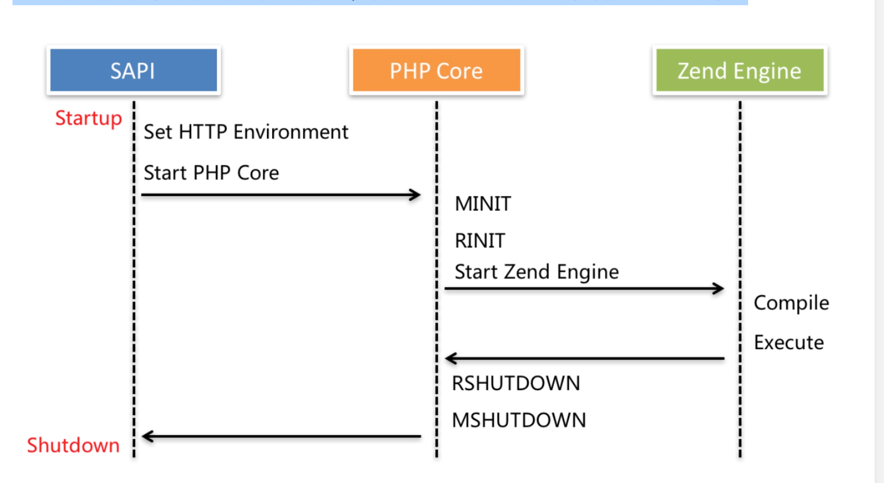
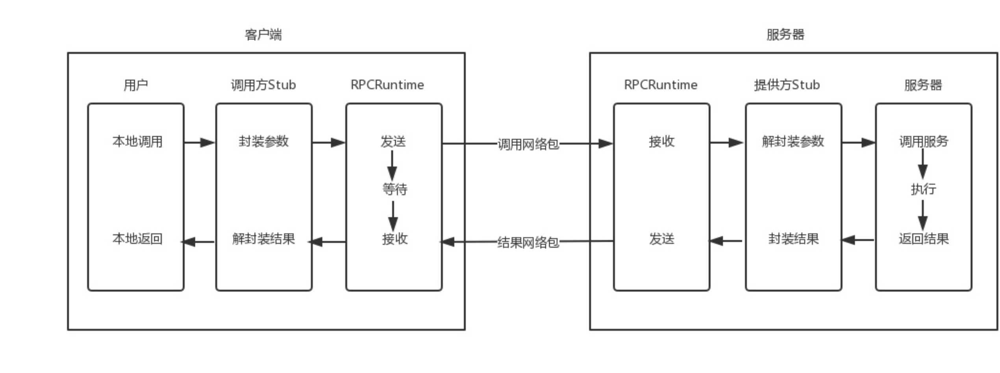

### 1.RPC 协议 前瞻

RPC 协议，所谓 RPC 指的是 Remote Procedure Call，即远程方法调用（也叫远程服务调用、远程过程调用），这也是微服务架构的前导篇，因为微服务里面远程服务之间就是通过 RPC 协议进行数据传输的。

在介绍 RPC 协议之前，我们先厘清几个概念：单体应用、微服务应用、本地方法调用与远程方法调用。

### 单体应用 vs 微服务

所谓单体应用指的是将应用的所有服务部署到一台机器上，很多中小型公司都是这么做的，这样做的好处是部署和维护起来比较简单，也方便业务早期的快速迭代，但是缺点也是显而易见的，随着业务的增长，会导致代码仓库越来越庞大，与之相伴的，随着开发人员的增加，不同团队和成员之间的协作变得越来越复杂，比如同时有五个以上的开发者在开发功能准备上线，合并代码时代码冲突的风险增加，甚至需要专门的人力来负责合并代码，协助解决冲突，然后统一上线，而随着代码仓库代码量的增加，上线时间也会随之增加，尤其是要部署多台机器的情况下，这就给线上机器的稳定性和出现问题时回滚代码带来隐患。除此之外，因为所有服务都打包在一个应用里面，运行在一种进程中，一旦某个功能涉及的代码或者资源有问题，就会导致整个应用不可用，从而让系统可用性大打折扣。

所以总结起来，单体应用主要有三个问题，第一、随着业务功能的复杂度增加，团队之间的协作和代码合并越来越困难；第二、随着代码仓库代码量的增加，应用部署时间越来越长，这就为上线期间线上系统的稳定性和代码回滚带来风险；第三、单体应用将所有服务打包到一个应用里面，如果某个功能或资源不可用，会导致整个应用不可用。

所以单体应用更适用于项目早期快速迭代和试错阶段，随着业务功能增加，开发团队的扩充，对系统稳定性和可用性的要求变高，单体应用就显得越来越捉襟见肘，那么我们该如何解决单体应用面临的这一系列问题呢？

答案想必你已经知道，那就是通过微服务架构对服务进行拆分，将原来的单体应用拆分成多个子服务，比如对于一个电商应用而言，用户服务专门用于处理与用户相关的功能，商品服务专门用于处理与商品相关的功能，交易服务专门用于处理与交易相关的功能，依次类推，具体的划分维度我们放到后面微服务系列去单独介绍，这些拆分的服务都有着自己独立的代码仓库，独立开发、独立部署、独立维护，不同的服务之间通过 RPC 协议进行通信，某个服务不可用并不会应用其它功能的使用，从而完美解决了单体应用的三个瓶颈。

**微服务虽好，但也不是包治百病，因为它也引入了一系列需要解决的问题，比如多个服务独立部署和维护导致上线的复杂度增加，出现问题后调试的复杂度增加，以及远程服务调用过程中参数传递和数据格式的约定等等，所以当团队规模很小，业务规模不大的情况下，并不适合使用微服务架构，反而是单体应用更加灵活，方便快速迭代。**

### 本地方法调用 vs 远程方法调用

我们知道，在单体应用中，所有服务都打包在一个应用里面，我们只需要通过本地方法即可调用其他的服务，比如我们有 `UserService` 和 `ProductService` 两个服务，如果要在 `UserService` 中获取某个用户发布的商品，只需要实例化 `ProductService`，并传入用户参数到到数据库查询并返回结果即可，一切操作都是在本地内存中完成的，不同服务之间的调用并不涉及到任何网络传输，编译器会帮我们完成所有的函数调用、参数解析和代码执行，以 PHP 为例，底层的执行逻辑如下（如果你对服务不太理解的话，常见的 MVC 模式其实就是一种单体应用架构模式）：

而在微服务中则不然，不同的服务部署在不同的机器，需要通过网络传输约定调用方法名、参数和返回数据才能完成一个完整的方法调用，与单体应用本地方法调用相对，我们把这种通过网络传输调用不同服务方法的方式称之为远程方法调用，既然是远程方法调用，那就与本地方法调用完全不同了，我们无法在本地实例化远程的服务类，更无法调用对应的方法，传入相应的参数，此外，不同服务之间甚至是通过不同编程语言实现的，服务方法调用期间出现异常与错误的捕获也要单独约定。。。总之，你会发现本地方法调用的那一套逻辑现在完全不适用了，所以在正式介绍 RPC 协议之前，我们应该知道，远程方法调用至少要解决以下几个问题：

1. 如何规定远程调用的语法：客户端（这里的客户端指的是服务调用方）如何告诉服务端（这里的服务端指的是服务提供方）要调用什么方法，比如我们调用远程服务的 add 方法，是传一个表示某个方法的整数，还是传一个字符串。此外方法的返回值是什么？正确的时候返回什么，错误的时候又返回什么？
2. 如何传递参数：我是先传两个整数，后传一个操作符「add」，还是先传操作符，再传两个整数？
3. 如何表示数据：在上面提到的加法这个简单的例子中，传递的就是一个固定长度的 int 值，这种情况还好，如果是变长的类型，比如一个类实例，应该怎么办呢？如果是 int，不同的平台上长度也不同，又该怎么办？
4. 服务发现问题：如何知道一个服务端都实现了哪些远程方法调用？从哪个端口可以访问这个远程方法调用？
5. 网络传输问题：网络传输过程中发生了错误、重传、丢包、性能等问题怎么办？本地调用没有这个问题，但是一旦到网络上，这些问题都需要处理，因为网络是不可靠的，虽然在同一个连接中，我们还可通过 TCP 协议保证丢包、重传的问题，但是如果服务器崩溃了又重启，当前连接断开了，TCP 就保证不了了，需要应用自己进行重新调用，但是这个时候又要考虑远程方法调用的幂等问题，多次重复调用是否会返回同样的结果，还是同样的操作回执行多次？

所有这些问题都是 RPC 协议要解决的，解决了这些问题，才能保证远程方法调用的可靠性，进而保证微服务的稳定性和可用性。下一篇，学院君将就以常见的 RPC 框架为例，介绍它们是如何解决以上的问题的

### 2.具体内容

学院君介绍了单体应用的缺点以及相应的解决方案 —— 微服务，微服务解决单体应用瓶颈的同时也引入了新的问题，即远程方法调用过程中协议约定、服务发现以及网络传输的复杂度增加，必须要解决这些问题才能保证远程方法调用的可靠性，在工程实践中，我们通常使用一些优秀的开源 RPC 框架来处理这些底层问题（如 Spring Cloud、Dubbo、gRRC、Thrift、Hprose 等），作为一般开发者，只需要基于这些框架专注上层服务实现即可，但是作为一个有追求的开发者，最好能够理解 RPC 框架底层的实现，这样才能更好的使用这些框架。

现有的 RPC 框架都是基于 Andrew D. Birrell 和 Bruce Jay Nelson 的论文实现的：[Implementing Remote Procedure Calls](http://www.cs.cmu.edu/~dga/15-712/F07/papers/birrell842.pdf)，该论文定义了 RPC 的调用标准，这篇论文对于英文不好的人啃起来有些吃力（这里有一篇[中文译文](https://www.jianshu.com/p/91be39f72c74)，感兴趣的可以看看），我们把它简化为下面的模型来介绍：

当客户端应用（服务消费方）想发起一个远程调用时，实际是通过本地调用客户端的 Stub，该 Stub 负责将调用的接口、方法和参数，通过约定的协议规范进行编码，并通过本地的 RPCRuntime（RPC 通信包） 进行传输，最终将调用网络包发送到服务器。

服务器端的 RPCRuntime 收到请求后，交给服务提供方 Stub 进行解码，然后调用服务端对应的方法，方法执行后返回结果，服务提供方 Stub 将返回的结果编码后，再发送给客户端，客户端的 RPCRuntime 收到结果，发给调用方 Stub 解码得到结果，返回给客户端。

至此，一个完整的 RPC 调用就完成了。这里面分了三个层次，对于用户层和服务端，都像是本地调用一样，专注于业务逻辑的处理就可以了，实际上，我们在进行微服务开发时，基本上也就是专注在这两块，即服务端如何提供服务和客户端如何消费服务。底层的 Stub 处理双方约定好的语法、语义、封装和解封装（解决了协议约定问题），RPCRuntime 则主要处理高性能的传输，以及网络的错误和异常（解决了网络传输问题）。

但还有一个问题，就是服务发现问题，即客户端调用远程服务时，如何得知要去哪个服务器调用呢？在这篇论文中，实现的方案是通过一个分布式数据库 Grapevine 来绑定服务名与对应的服务提供方地址，当服务端提供新的服务时，需要将其「注册」到 Grapevine，然后客户端 RPCRuntime 在发起远程调用时可以从 Grapevine 中查询到服务名对应的服务端地址，进而发起网络请求.

Grapevine 即对应着后面微服务分享中要介绍的 RPC 框架中的「注册中心」，目前比较主流的注册中心实现方案有 zookeeper、eureka、consul、etcd 等。

Sun 公司是第一个提供商业化 RPC 库和 RPC 编译器的公司，最早的 RPC 实现就是该公司提供的 ONC RPC（Open Network Computing Remote Procedure Call，开放网络计算远程方法调用），由于该 RPC 实现用在 Sun 系统中，所以也叫 Sun RPC。我们比较熟悉的 NFS（Network File System，网络文件系统） 协议就是基于 ONC RPC 实现的。

在 PHP 中，也有一些实现了 RPC 协议，可用于 RPC 通信的官方扩展可以使用，比如 [XML-RPC](https://www.php.net/manual/zh/book.xmlrpc.php)、[Yar](https://www.php.net/manual/zh/book.yar.php)、[SOAP](https://www.php.net/manual/zh/book.soap.php) ，我们可以基于它们实现一些简单的 RPC 远程调用，比如一些古老的传统 Java 系统，在 PHP 中调用其服务通常是通过 SOAP 来实现的。

此外，还可以基于一些跨语言的开源 RPC 框架在 PHP 项目中实现 RPC 调用，并实现工业级的分布式微服务架构，比如 Thrift、Hprose、gRPC、Dubbo 等，至于如何在 PHP 项目中基于这些框架来实现微服务架构，我们将在接下来的微服务系列分享中给大家详细介绍。