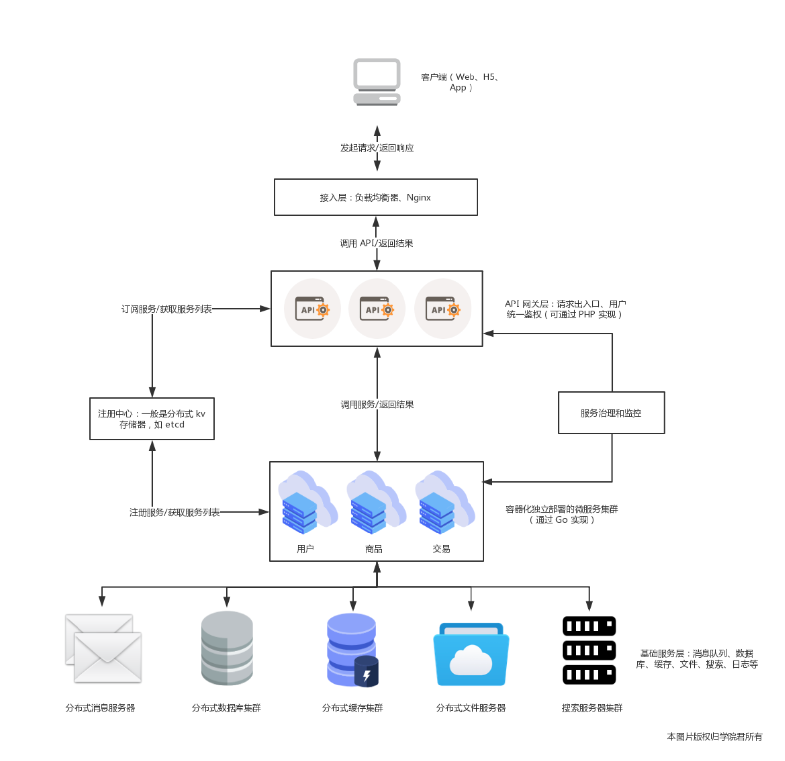
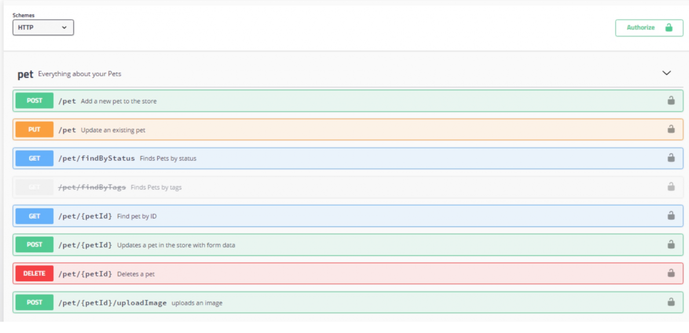
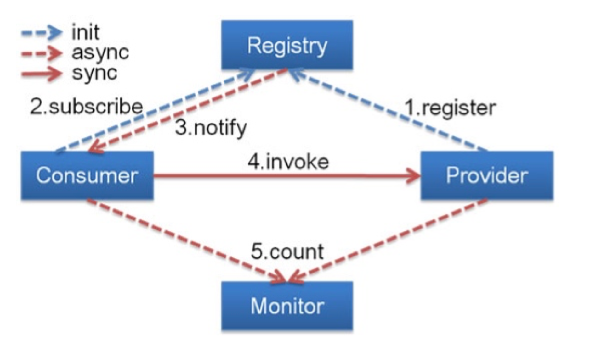

### 总体设计

看完微服务的定义后，接下来我们一起走进微服务架构，来看看它的总体设计和各个组成部分。在具体介绍之前先来看下微服务架构的整体架构图和一次正常的服务调用的完整流程：




首先服务提供者（用户、商品等微服务子模块）按照指定格式的服务接口描述，向注册中心注册服务，声明自己能够提供哪些服务以及服务的地址是什么，完成服务发布。

接下来服务消费者（API 网关层或者相邻的其它微服务模块）请求注册中心，查询所需要调用服务的地址，然后以约定的通信协议向服务提供者发起请求，得到请求结果后再按照约定的协议解析结果。

在服务调用过程中，服务的请求耗时、调用量以及成功率等指标都会被记录下来用作监控，调用经过的链路信息会被记录下来，用于故障定位和问题追踪。在这期间，如果调用失败，可以通过重试等服务治理手段来保证成功率。

所以总结起来，微服务架构下，服务调用主要依赖下面几个基本组件：

- 注册中心：注册并维护远程服务及服务提供者的地址，供服务消费者发现和调用，为保证可用性，通常基于分布式 kv 存储器来实现，比如 zookeeper、etcd 等；
- 服务框架：用于实现微服务的 RPC 框架，包含服务接口描述及实现方案、向注册中心发布服务等功能，常见的 RPC 框架包括 Spring Cloud、Dubbo、gRPC、 Thrift、go-micro 等；
- 服务网关：介于客户端与微服务之间的网关层，可以理解为「门卫」的角色，以确保服务提供者对客户端的透明，这一层可以进行反向路由、安全认证、灰度发布、日志监控等前置动作；
- 服务监控：对服务消费者与提供者之间的调用情况进行监控和数据展示；
- 服务追踪：记录对每个请求的微服务调用完整链路，以便进行问题定位和故障分析；
- 服务治理：服务治理就是通过一系列的手段来保证在各种意外情况下，服务调用仍然能够正常进行，这些手段包括熔断、隔离、限流、降级、负载均衡等。
- 基础设施：分布式消息队列、日志存储、数据库、缓存、文件服务器、搜索集群等，用以提供服务底层的基础数据服务，可以自建，也可以使用阿里云等公有云提供的服务。

此外，从微服务部署角度来说，我们通常会基于容器编排技术实现微服务的运维。

### 各个组件

接下来，我们会逐一介绍这些组件在微服务中的实现，这些组件基本上都有成熟的开源框架可供选择。

#### 服务描述

服务调用首先要解决的问题就是如何对外描述服务。比如服务的名称、请求参数和返回信息，以及服务返回信息如何解析，在本地方法调用中这根本不是什么问题，但是在微服务中，服务提供者与消费者之间可能是通过不同语言开发的，而且是通过远程网络请求来调用服务，所以这些东西必须要事先约定好。

常用的服务描述方式包括 RESTful API、XML 配置以及 IDL 文件三种。

其中，RESTful API 方式通常用于 HTTP 协议的服务描述，接口文档可以通过[Swagger](http://swagger.io/) 进行管理和维护，Spring Cloud 框架默认就是通过 REST API 提供服务。下面是一个 RESTful API 方式的服务描述的例子（官方文档的示例，在 Laravel 学院也有[介绍教程](https://laravelacademy.org/post/19694)）：



基于 HTTP 协议的 REST 服务接口虽然简单，但是性能不如基于 TCP 的 RPC 协议，RPC 协议的服务描述通常通过 XML 配置文件来定义接口名、参数以及返回值类型等，比如 Dubbo 框架默认就是以私有化的 RPC 协议（`dubbo`）来提供服务接口描述，对应的 XML 配置示例如下：

```
<beans xmlns:xsi="http://www.w3.org/2001/XMLSchema-instance"
       xmlns:dubbo="http://dubbo.apache.org/schema/dubbo"
       xmlns="http://www.springframework.org/schema/beans"
       xsi:schemaLocation="http://www.springframework.org/schema/beans http://www.springframework.org/schema/beans/spring-beans-4.3.xsd
       http://dubbo.apache.org/schema/dubbo http://dubbo.apache.org/schema/dubbo/dubbo.xsd">

    <!-- provider's application name, used for tracing dependency relationship -->
    <dubbo:application name="demo-provider"/>
    <!-- use multicast registry center to export service -->
    <dubbo:registry address="multicast://224.5.6.7:1234"/>
    <!-- use dubbo protocol to export service on port 20880 -->
    <dubbo:protocol name="dubbo" port="20880"/>
    <!-- service implementation, as same as regular local bean -->
    <bean id="demoService" class="org.apache.dubbo.demo.provider.DemoServiceImpl"/>
    <!-- declare the service interface to be exported -->
    <dubbo:service interface="org.apache.dubbo.demo.DemoService" ref="demoService"/>
</beans>
```


#### 注册中心

有了服务的接口描述，下一步要解决的问题就是服务的发布和订阅，当你通过服务提供者提供了一个新的服务，如何让服务消费者感知呢？这个时候就需要一个类似注册中心的角色，服务提供者将自己提供的服务以及 IP 地址登记到注册中心，服务消费者则从注册中心查询所需要调用服务的地址信息，然后发起网络请求。

通常，注册中心的工作流程是这样的：

- 服务提供者在启动时，根据服务发布文件中配置的发布信息向注册中心注册自己的服务。
- 服务消费者在启动时，根据消费者配置文件中配置的服务信息向注册中心订阅自己所需要的服务。
- 注册中心返回服务提供者地址列表给服务消费者。
- 当服务提供者发生变化，比如有节点新增或者销毁，注册中心将变更通知给服务消费者。

下面是服务化框架 Dubbo 的工作流程图，和我们上面介绍的流程是一样的：



#### 服务框架

通过注册中心，服务消费者就可以获取到服务提供者的地址，有了地址后就可以发起调用。但在发起调用之前你还需要解决以下几个问题：

- 服务通信采用什么协议？就是说服务提供者和服务消费者之间以什么样的协议进行网络通信，是采用四层 TCP、UDP 协议，还是采用七层 HTTP 协议，还是采用其他协议？
- 数据传输采用什么方式？就是说服务提供者和服务消费者之间的数据传输采用哪种方式，是同步还是异步，是在单连接上传输，还是多路复用。
- 数据压缩采用什么格式？通常数据传输都会对数据进行压缩，来减少网络传输的数据量，从而减少带宽消耗和网络传输时间，比如常见的 JSON 序列化、Java 对象序列化以及 Protobuf 序列化等。

#### 服务监控

一旦服务消费者与服务提供者之间能够正常发起服务调用，你就需要对调用情况进行监控，以了解服务是否正常。通常来讲，服务监控主要包括三个流程。

- 指标收集。就是要把每一次服务调用的请求耗时以及成功与否收集起来，并上传到集中的数据处理中心。
- 数据处理。有了每次调用的请求耗时以及成功与否等信息，就可以计算每秒服务请求量、平均耗时以及成功率等指标。
- 数据展示。数据收集起来，经过处理之后，还需要以友好的方式对外展示，才能发挥价值。通常都是将数据展示在 Dashboard 面板上，并且每隔 10s 等间隔自动刷新，用作业务监控和报警等。

#### 服务追踪

除了需要对服务调用情况进行监控之外，你还需要记录服务调用经过的每一层链路，以便进行问题追踪和故障定位。

服务追踪的工作原理大致如下：

- 服务消费者发起调用前，会在本地按照一定的规则生成一个 requestid，发起调用时，将 requestid 当作请求参数的一部分，传递给服务提供者。
- 服务提供者接收到请求后，记录下这次请求的 requestid，然后处理请求。如果服务提供者继续请求其他服务，会在本地再生成一个自己的 requestid，然后把这两个 requestid 都当作请求参数继续往下传递。
- 以此类推，通过这种层层往下传递的方式，一次请求，无论最后依赖多少次服务调用、经过多少服务节点，都可以通过最开始生成的 requestid 串联所有节点，从而达到服务追踪的目的。

#### 服务治理

服务监控能够发现问题，服务追踪能够定位问题所在，而解决问题就得靠服务治理了。服务治理就是通过一系列的手段来保证在各种意外情况下，服务调用仍然能够正常进行。

在生产环境中，你应该经常会遇到下面几种状况。

- 单机故障。通常遇到单机故障，都是靠运维发现并重启服务或者从线上摘除故障节点。然而集群的规模越大，越是容易遇到单机故障，在机器规模超过一百台以上时，靠传统的人肉运维显然难以应对。而服务治理可以通过一定的策略，自动摘除故障节点，不需要人为干预，就能保证单机故障不会影响业务。
- 单 IDC 故障。你应该经常听说某某 App，因为施工挖断光缆导致大批量用户无法使用的严重故障。而服务治理可以通过自动切换故障 IDC 的流量到其他正常 IDC，可以避免因为单 IDC 故障引起的大批量业务受影响。
- 依赖服务不可用。比如你的服务依赖依赖了另一个服务，当另一个服务出现问题时，会拖慢甚至拖垮你的服务。而服务治理可以通过熔断，在依赖服务异常的情况下，一段时期内停止发起调用而直接返回。这样一方面保证了服务消费者能够不被拖垮，另一方面也给服务提供者减少压力，使其能够尽快恢复。

上面是三种最常见的需要引入服务治理的场景，当然还有一些其他服务治理的手段比如自动扩缩容，可以用来解决服务的容量问题。