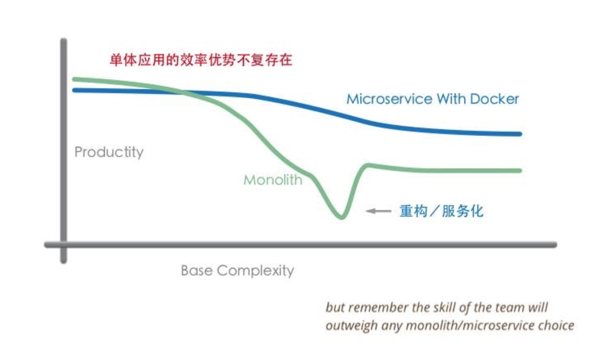

上篇分享我们介绍了微服务的整体架构和组件，可以看到微服务架构要比单体应用的架构复杂很多，所以这篇分享学院君将在正式介绍微服务架构的具体组件和落地实践之前，给大家分析下微服务的利弊和适用场景，否则，没有权衡清楚贸然进行微服务重构的话，可能会引入很多意料之外的问题。

### 1.微服务的优缺点

关于微服务架构的优缺点我们在网络协议：RPC 部分已经简单介绍过，这里我们通过表格的形式更加直观的来对比：

| S/N  | 对比点                   | 微服务架构                                                   | 单体架构                                                     | 结论                                             |
| ---- | ------------------------ | ------------------------------------------------------------ | ------------------------------------------------------------ | ------------------------------------------------ |
| 1    | 上手难度                 | API 接口调用                                                 | 数据库共享或本地程序调用                                     | 单体架构胜                                       |
| 2    | 开发效率                 | 早期设计和沟通的工作量加大，随着项目规模和时间的推移，效率变化不大 | 早期工作量小，随着项目规模和时间的推移，效率大幅度下降       | 对于简单项目单体架构胜，对于复杂项目微服务架构胜 |
| 3    | 系统设计（高内聚低耦合） | 每个业务单独包装成一个微服务，数据和代码都从物理上隔离开来，实现高内聚低耦合相对容易 | 以包的形式对代码进行模块划分，控制得当即可实现高内聚。但最终都是在数据层面将整个系统耦合在一起 | 微服务架构胜                                     |
| 4    | 系统设计（扩展性）       | 独立开发新模块，通过 API 与现有模块交互                      | 在现有系统上修改，与现存业务逻辑高度耦合                     | 微服务架构胜                                     |
| 5    | 需求变更响应速度         | 各个微服务组件独立变更，容易实施敏捷开发方法                 | 需要了解整个系统才可以正确修改，容易导致不相关模块的意外失败 | 微服务架构胜                                     |
| 6    | 系统升级效率             | 各个微服务组件独立升级，上手和开发效率高，影响面小           | 需要了解整个系统才可以正确修改，容易导致不相关模块的意外失败 | 微服务架构胜                                     |
| 7    | 运维效率                 | 大系统被拆分为多个小系统，部署和运维难度加大，但可以利用 DevOps 等方式将运维工作自动化 | 简单直接                                                     | 单体架构胜                                       |
| 8    | 代码复用性               | 微服务组件可以在新项目中直接复用，包括前端页面               | 一般以共享库的形式复用后台代码                               | 微服务架构胜                                     |
| 9    | 硬件需求                 | 按需为不同业务模块伸缩资源节点，一个系统需部署多个微服务，需要启动多个运行容器 | 整个系统只需要一个运行容器，为整个系统分配资源               | 对于简单项目单体架构胜，对于复杂项目微服务架构胜 |
| 10   | 项目成本                 | 项目早期和后期，成本变化曲线平缓                             | 项目早期成本低，后期成本大                                   | 对于简单系统单体架构胜，对于复杂系统微服务架构胜 |
| 11   | 非功能需求               | 为单独的微服务按需调优，甚至更换实现方式和程序语言           | 为整个系统调优，牵一发而动全身                               | 微服务架构胜                                     |
| 12   | 职责、成就感             | 拥有明确的职责划分，主人翁意识和成就感加强，容易形成自组织型团队 | 职责不明确，容易产生扯皮行为                                 | 微服务架构胜                                     |
| 13   | 风险                     | 大系统被拆分为小系统，风险可被控制在小系统内，但也引入了各小系统之间的交互风险 | 系统是一个整体，一荣俱荣，一损俱损                           | 微服务架构胜                                     |

对于简单项目来说，单体架构 5 胜 8 败，优势主要体现在开发效率、上手难度、运维效率、硬件需求、项目成本；对于复杂项目来说，微服务架构 11 胜 2败，优势主要体现在硬件需求、项目成本、开发效率、系统设计时的高内聚低耦合和可扩展性、需求变更响应速度、系统升级效率、代码复用性、非功能需求、职责/成就感、风险的可控性。

所以对于小型简单系统来说，使用单体架构更合适，对于大型复杂系统来说，使用微服务架构更合适，但是尽管如此，微服务也不是银弹，它也为系统引入了新的问题比如提高了系统的复杂度，这也导致了开发人员上手难度增加，需要在理解分布式系统设计的基础上才能更好的开发和维护微服务，再就是分布式服务的调用问题，服务的注册和发现、服务之间的分布式事务问题，数据库拆分之后数据报表的处理，数据库查询的复杂度增加，服务之间分布式一致性的问题，此外也为系统运维和管理增加了复杂度，这都是我们在进行微服务架构时要做好的心里准备和技术储备。

### 2.微服务的适用场景

所以微服务也不是一招鲜吃遍天，不是能够解决所有问题的万金油，它有其特定的适用场景，用之不慎很有可能带来负面作用，陷入上述提到的微服务泥淖之中无法自拔，一定要在系统进行微服务重构时认识到这一点。那么哪些场景适合使用微服务架构呢？满足以下三个条件即可考虑：

- 团队规模较大，超过10人；
- 业务复杂度高，超过5个以上的子模块（业务功能较复杂）；
- 项目需要长期迭代开发和维护（半年以上）。

以下是一个单体应用与微服务开发效率的曲线，随着业务复杂度的增加，单体应用的效率逐渐降低，甚至在某个临界点出现断崖式下跌，之后，微服务的优势就很明显了，所以很多公司在单体应用的效率低到无法接收时都会开始服务化/微服务重构：

如果一开始面临的就是一个复杂的满足上述三个条件的系统开发，我们也可以在一开始就引入微服务架构，以避免后续重构引入的额外风险和时间成本。

经过这一篇介绍，相比你应该对什么时候使用微服务架构有了一个很量化的认识，下一篇开始，我们就来介绍构成微服务架构的各个组件是如何协同工作以实现分布式服务调用的。

### 3.服务拆分的维度

如果已经决定要对系统进行微服务重构改造，首先要对耦合在单体应用中的服务进行拆分，那么服务拆分具体该怎么做呢？或者换句话说，服务拆分按照什么标准，以哪些维度作为划分依据？

这里主要有两种方式：

- 一种是从业务功能的角度进行纵向的垂直拆分，以电商网站为例，可以把常态购买看作一个服务模块，把特卖看看作一个服务模块，把拼团看作一个服务模块，把海外购看作一个服务模块，然后根据与相应模块关联的密切程度将对应的业务逻辑划分到具体的微服务中；
- 一种是从公用且功能独立的角度进行横向的水平拆分，还是以电商网站为例，上述所有服务模块都会用到用户、商品、交易这些公共功能，我们可以把这些模块也拆分为独立的微服务。

与服务拆分相关联的，还有公司组织架构的调整，原来大家可能都混在一起做开发，现在要根据拆分出来的服务为每个模块配对对应的开发人员，以便实现后续的独立开发、测试、部署和维护，另外可能还要涉及到数据库的拆分、缓存部署的调整。

### 4.服务拆分前的技术保障

前面我们多次强调过，伴随着服务的拆分和分布式的部署调用，使得系统架构的复杂性大大增加，为系统引入了很多新的问题，比如运维、配置、问题追踪与系统监控、远程服务发布与调用等，我们必须要做好这些配套的技术保障，才能开始操刀进行微服务重构。这些问题，也是从单体应用迁移到微服务架构时必将面临也必须解决的：

- 服务接口定义：对于单体应用来说，不同功能模块之间交互时，通常是以类库的方式来提供各个模块的功能；对于微服务来说，每个服务都运行在各自的进程之中，通过远程接口才能提供相应的服务，无论采用 HTTP 还是 RPC 协议，服务之间的调用都通过接口描述来约定，约定内容包括接口名、接口参数以及接口返回值。
- 服务发布与调用：单体应用由于部署在同一个包里，接口之间的调用属于进程内的调用；而拆分为微服务独立部署后，服务提供者该如何对外暴露自己的地址，服务调用者该如何查询所需要调用的服务的地址呢？这个时候你就需要一个注册中心，能够记录每个服务提供者的地址以供服务调用者查询。
- 服务监控方案：在微服务中需要一种通用的监控方案，能够覆盖业务埋点、数据收集、数据处理，最后到数据展示的全链路功能。
- 服务治理方案：拆分为微服务架构后，服务的数量变多了，依赖关系也变复杂了，当一个服务的性能有问题时，依赖的服务势必会受到影响，要如何通过熔断、限流、降级、负载均衡等方式将影响降到最低。
- 故障定位方案：在单体应用拆分为微服务之后，一次用户调用可能依赖多个服务，每个服务又部署在不同的节点上，如果用户调用出现问题，需要有一种解决方案能够将一次用户请求进行标记，并在多个依赖的服务系统中继续传递，以便串联所有路径，从而进行故障定位。

从下一篇开始，我们就将结合一个具体的微服务 RPC 框架来介绍上述问题是如何得到解决的。另外，微服务架构中，还可能要面临的一些问题是分库之后分布式数据库的访问和事务一致性，分布式缓存的设计和访问，以及公共配置中心的访问和设置，还有微服务拆分后部署和运维的复杂性增加，该如何解决等，这些都是我们在做微服务拆分的时候需要考虑到的，后续在高阶部分，学院君将给大家介绍这些问题的解决方案。