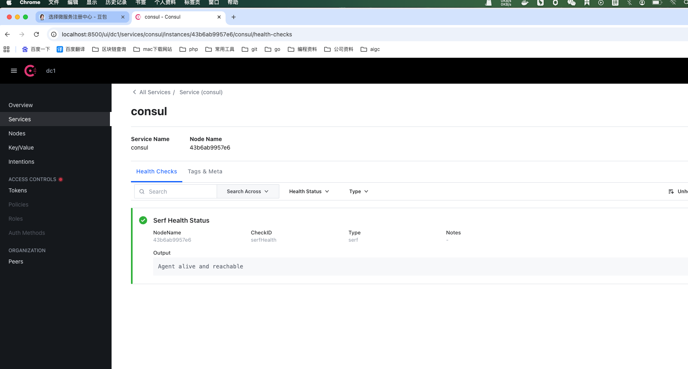
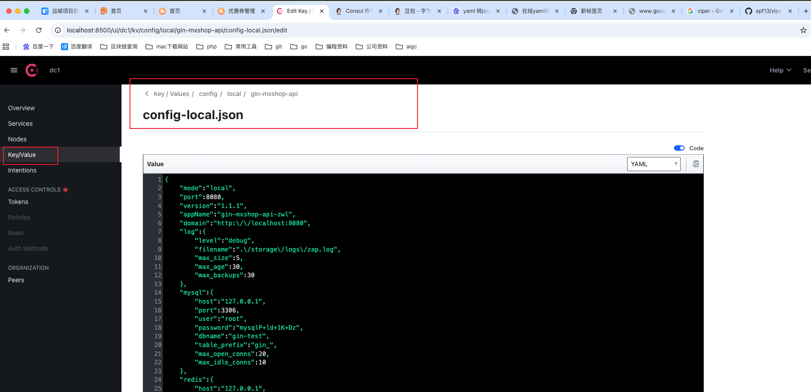

# 1. 什么是服务注册和发现

 1. **什么是服务注册和发现** 

假如这个产品已经在线上运行，有一天运营想搞一场促销活动，那么我们相对应的【用户服务】可能就要新开启三个微服务实例来支撑这场促销活动。而与此同时，作为苦逼程序员的你就只有手动去 API gateway 中添加新增的这三个微服务实例的 ip 与port ，一个真正在线的微服务系统可能有成百上千微服务，难道也要一个一个去手动添加吗？有没有让系统自动去实现这些操作的方法呢？答案当然是有的。

当我们新添加一个微服务实例的时候，微服务就会将自己的 ip 与 port 发送到注册中心，在注册中心里面记录起来。当 API gateway 需要访问某些微服务的时候，就会去注册中心取到相应的 ip 与 port。从而实现自动化操作。

 2. 技术选型 

Consul 与其他常见服务发现框架对比

| 名称      | 优点                                                         | 缺点                                                         | 接口     | 一致性算法 |
| --------- | ------------------------------------------------------------ | ------------------------------------------------------------ | -------- | ---------- |
| zookeeper | 1.功能强大，不仅仅只是服务发现 2.提供 watcher 机制能实时获取服务提供者的状态 3.dubbo 等框架支持 | 1.没有健康检查 2.需在服务中集成 sdk，复杂度高 3.不支持多数据中心 | sdk      | Paxos      |
| consul    | 1.简单易用，不需要集成 sdk 2.自带健康检查 3.支持多数据中心 4.提供 web 管理界面 | 1.不能实时获取服务信息的变化通知                             | http/dns | Raft       |
| etcd      | 1.简单易用，不需要集成 sdk 2.可配置性强                      | 1.没有健康检查 2.需配合第三方工具一起完成服务发现 3.不支持多数据中心 | http     | Raft       |


# 2. consul的安装和配置

 1. 安装 


Shell

运行代码复制代码

docker run -d -p 8500:8500 -p 8300:8300 -p 8301:8301 -p 8302:8302 -p 8600:8600/udp  hashicorp/consul consul agent  -dev -client=0.0.0.0


docker run -d -p 8500:8500 -p 8600:8600/udp --name=consul c04122b09617 agent -server -bootstrap -ui -client=0.0.0.0

docker run -d -p 8500:8500 -p 8600:8600/udp --name=consul consul agent -server -bootstrap -ui -client=0.0.0.0

- `-server`：以服务端模式启动

- `-bootstrap`：单节点模式（生产环境需至少 3 节点集群）

- `-ui`：启用 Web 管理界面（访问 `http://localhost:8500` 可查看）

  

- `-client=0.0.0.0`：允许外部访问

  


 2. 访问 

浏览器访问 127.0.0.1:8500


 3. 访问dns 

consul提供dns功能，可以让我们通过， 可以通过dig命令行来测试，consul默认的dns端口是8600， 命令行：

linux下的dig命令安装：

yum install bind-utils


Shell

运行代码复制代码

dig @192.168.1.103 -p 8600 consul.service.consul SRV

windows下载dig命令 :https://www.yuque.com/bobby-zpcyu/bq1fxp/il42n7


# 3. consul的api接口

 1. 添加服务 

https://www.consul.io/api-docs/agent/service#register-service

 2. 删除服务 

https://www.consul.io/api-docs/agent/service#deregister-service

 3. 设置健康检查 

https://www.consul.io/api-docs/agent/check

 4. 同一个服务注册多个实例 

    使用Tags:    []string{"user-srv", "srv"}标识同一个服务
    

    ​	//id 不能重复，因为后续当前的user-srv服务可能有多个实例，如果实力的id重复的话，consul最后一个会覆盖上一个的配置

    ```go
    func initUserSrvRegisterCenter(grpcPort int, uuid string) error {
    
    	consulClient := initConsul()
    
    	// localIp := "192.168.1.44"
    	// 把本地的内网ip 地址 注入到consul里面去
    	localIp := "192.168.1.57" 
    
    	// 初始化检查对象
    	check := &api.AgentServiceCheck{
    		GRPC:                           fmt.Sprintf("%s:%d", localIp, grpcPort), //当前grpc的ip地址和端口
    		Timeout:                        "5s",                                    //超时时间
    		Interval:                       "5s",                                    // 检查间隔
    		DeregisterCriticalServiceAfter: "6s",                                    //服务启动后，如果5s内没有检查到服务，则认为服务不可用，15s后注销服务
    	}
    
    	// 注册服务到consul中
    	register := &api.AgentServiceRegistration{
    		Name: "user-srv",
    
    		//id 不能重复，因为后续当前的user-srv服务可能有多个实例，如果实力的id重复的话，consul最后一个会覆盖上一个的配置
    		ID:      uuid,
    		Port:    grpcPort,
    		Tags:    []string{"user-srv", "srv"},
    		Address: localIp,
    		Check:   check,
    	}
    
    	err := consulClient.Agent().ServiceRegister(register)
    	if err != nil {
    		return err
    	}
    
    	return nil
    }
    ```

    


 5. 获取服务 

https://www.consul.io/api-docs/agent/service#list-services


# **5. go对接consul**


### 服务注册（Go/PHP 服务注册到 Consul）

服务启动时需向 Consul 注册自身信息（IP、端口、服务名等），支持 **HTTP API 直接注册** 或 **SDK 注册**。


推荐sdk  "github.com/hashicorp/consul/api"

```go
package main

import (
	"context"
	"flag"
	"fmt"
	"go-all-new/mxshop_srvs/user_srv/database/mysql"
	"go-all-new/mxshop_srvs/user_srv/handler"
	"go-all-new/mxshop_srvs/user_srv/proto"
	"go-all-new/mxshop_srvs/user_srv/utils"
	"os"
	"os/signal"
	"syscall"
	"time"

	"net"

	"github.com/hashicorp/consul/api"
	"google.golang.org/grpc"
	"google.golang.org/grpc/codes"
	"google.golang.org/grpc/health"
	"google.golang.org/grpc/health/grpc_health_v1"
	"google.golang.org/grpc/status"
)

// grpc panic拦截器  类似于http中间件
func panicInterceptor(ctx context.Context, req interface{}, info *grpc.UnaryServerInfo, handler grpc.UnaryHandler) (resp interface{}, err error) {
	//请求处理前
	defer func() {
		if r := recover(); r != nil {
			fmt.Printf("gRPC服务panic: %v\n", r)
			err = status.Errorf(codes.Internal, "服务器内部错误")
		}
	}()
	start := time.Now()

	resp, err = handler(ctx, req)

	//请求处理后
	duration := time.Since(start)
	fmt.Printf("方法: %s, 耗时: %v, 错误: %v\n", info.FullMethod, duration, err)

	return resp, err
}

func initConsul() *api.Client {

	// 获取consul默认配置
	cfg := api.DefaultConfig()

	// 获取consud的ip地址 和 端口
	cfg.Address = fmt.Sprintf("%s:%d", "127.0.0.1", 8500)

	// 创建consul客户端
	consulClient, err := api.NewClient(cfg)
	if err != nil {
		panic(err)
	}

	return consulClient
}

func initUserSrvRegisterCenter(grpcPort int, uuid string) error {

	consulClient := initConsul()

	// localIp := "192.168.1.44"
	// 把本地的内网ip 地址 注入到consul里面去
	localIp := "192.168.1.57" 

	// 初始化检查对象
	check := &api.AgentServiceCheck{
		GRPC:                           fmt.Sprintf("%s:%d", localIp, grpcPort), //当前grpc的ip地址和端口
		Timeout:                        "5s",                                    //超时时间
		Interval:                       "5s",                                    // 检查间隔
		DeregisterCriticalServiceAfter: "6s",                                    //服务启动后，如果5s内没有检查到服务，则认为服务不可用，15s后注销服务
	}

	// 注册服务到consul中
	register := &api.AgentServiceRegistration{
		Name: "user-srv",

		//id 不能重复，因为后续当前的user-srv服务可能有多个实例，如果实力的id重复的话，consul最后一个会覆盖上一个的配置
		ID:      uuid,
		Port:    grpcPort,
		Tags:    []string{"user-srv", "srv"},
		Address: localIp,
		Check:   check,
	}

	err := consulClient.Agent().ServiceRegister(register)
	if err != nil {
		return err
	}

	return nil
}

func main() {
	// 1. 初始化数据库

	mysql.InitMySQL()

	// //生成user表结构
	// mysql.DB.AutoMigrate(model.User{})

	//md5.New()

	defer func() {
		if r := recover(); r != nil {
			fmt.Println("grpc server panic: ", r)
		}
	}()

	///--------------------------------grpc--------------------------------

	//通过命令行输入ip地址 和 port
	ip := flag.String("ip", "0.0.0.0", "ip address")
	// port := flag.Int("port", 50051, "port")
	port := flag.Int("port", 0, "port")
	flag.Parse()

	if *port == 0 {
		var err error
		*port, err = utils.GetFreePort()
		if err != nil {
			panic(err)
		}
	}

	//使用grpc 注册服务

	//初始化grpc服务，添加panic拦截器
	grpcServer := grpc.NewServer(
		grpc.UnaryInterceptor(panicInterceptor),
	)
	//给grpc开启健康检查接口
	grpc_health_v1.RegisterHealthServer(grpcServer, health.NewServer())

	//注册服务到grpc 中
	proto.RegisterUserServiceServer(grpcServer, handler.NewUserServer())

	//把grpc服务注册到consul中
	uuid := utils.GetUUID()
	initUserSrvRegisterCenter(*port, uuid)

	//监听端口
	lis, err := net.Listen("tcp", fmt.Sprintf("%s:%d", *ip, *port))
	if err != nil {
		panic("failed to listen: " + err.Error())
	}

	//启动grpc服务
	fmt.Println("grpc server started ...")

	go func() {
		err = grpcServer.Serve(lis)
		if err != nil {
			panic("failed to serve: " + err.Error())
		} else {
			fmt.Println("grpc server started successfully")
		}
	}()

	//程序退出后，注销consul里面的服务,不过即使没退出，consul也会在15s后注销服务
	quit := make(chan os.Signal)
	signal.Notify(quit, syscall.SIGINT, syscall.SIGTERM)
	<-quit
	initConsul().Agent().ServiceDeregister(uuid)
}

```


# 6.当成配置中心使用

在consul的可视化页面中，设置好对应的配置文件




在go中 使用viper获取consul的配置

```go
//viper 可以获取远程的consul的配置
	viper.AddRemoteProvider("consul", "localhost:8500", "config/"+env+"/gin-mxshop-api/config-"+env+".json")
	viper.SetConfigType("json") // Need to explicitly set this to json
	_err := viper.ReadRemoteConfig()
	if _err != nil {
		fmt.Println(_err)
		fmt.Println("viper.ReadRemoteConfig fail")
		return
	}

	fmt.Println("domain-------")
	fmt.Println(viper.GetString("domain"))
```


也可以自己通过api接口获取，然后自己绑定到对应的结构体上面去

```go
//从consul 里面获取对应的配置
	// 读取配置
	// kv := common.GetConsulClient().KV()
	// pair, _, err := kv.Get("config/"+env+"/gin-mxshop-api/config-"+env+".json", nil)
	// if err != nil {
	// 	panic(err)
	// }
	// fmt.Println("配置内容：", string(pair.Value))
	// viper.SetConfigFile(string(pair.Value))
```

