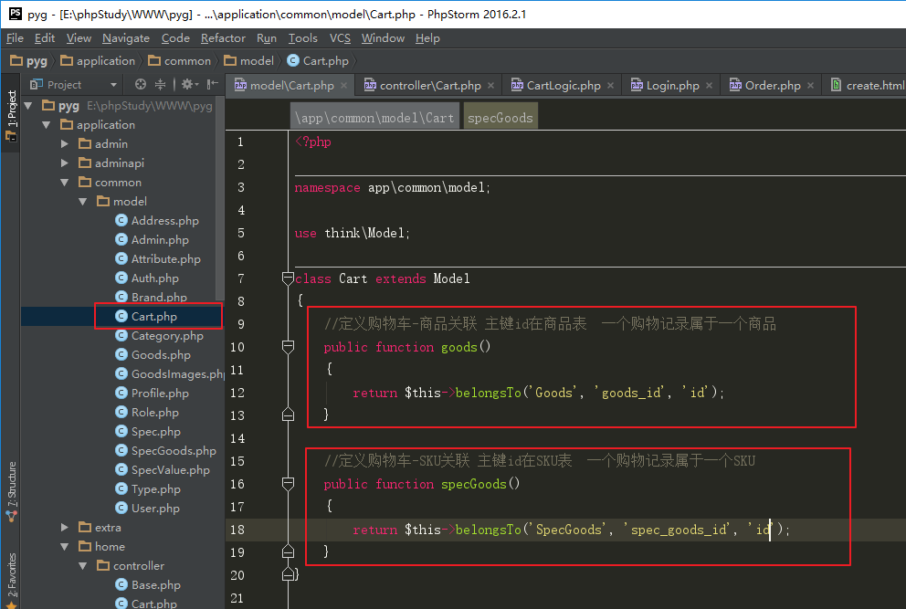
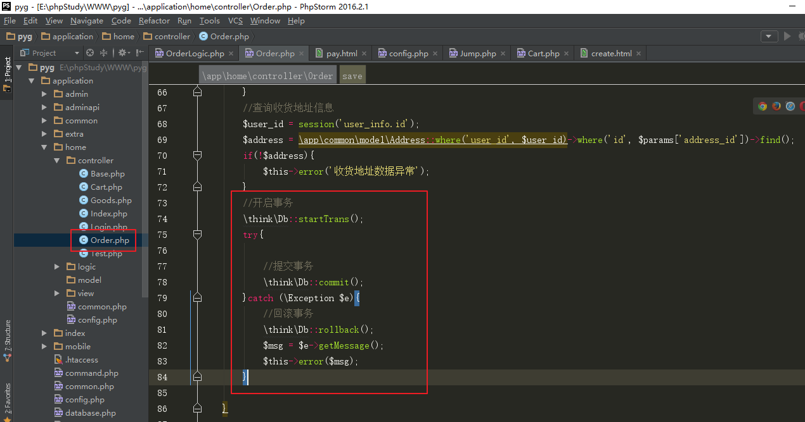
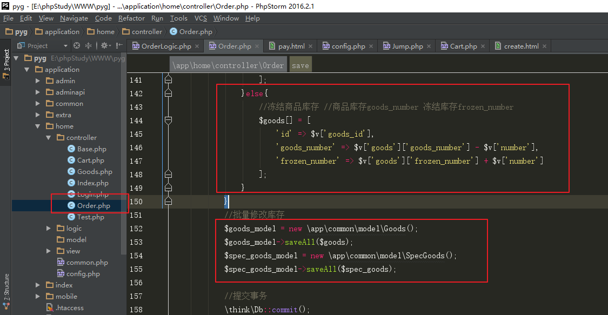
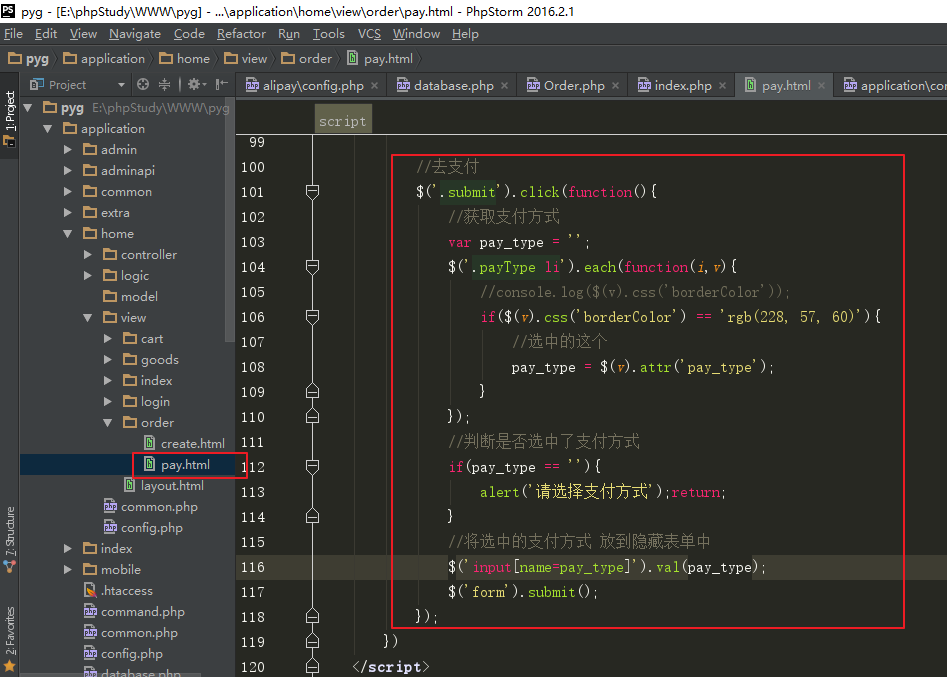
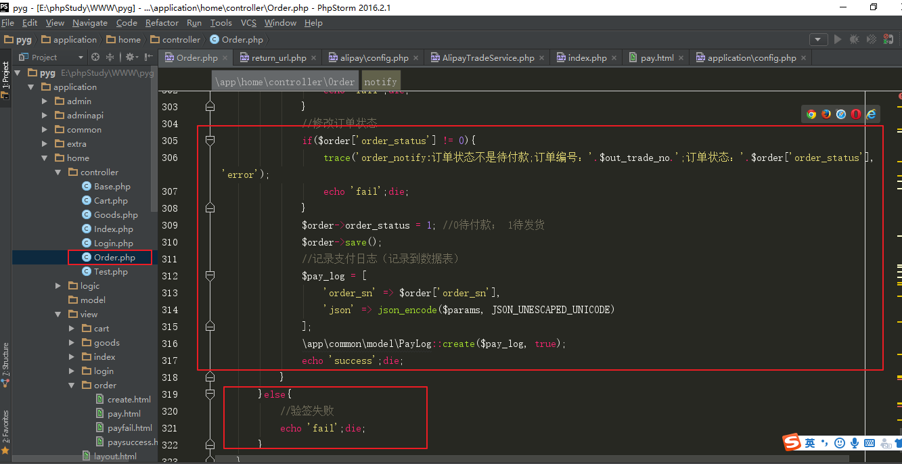
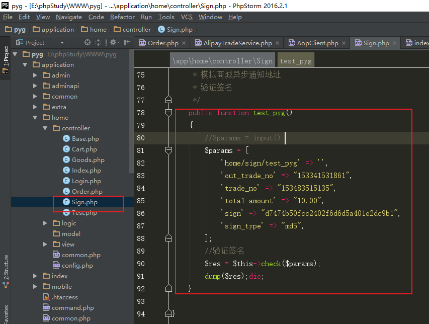

# 支付宝宝对接

# 一、结算页面

## 1、判断登录

整合模板（Order控制器create方法  getOrderInfo.html -> create.html）

创建Order控制器，继承Base控制器

 

 

结算页需要登录才能访问，修改order控制器create方法，判断登录，并设置返回的url

 

修改Login控制器dologin方法，登录成功之后，先获取返回的url

 

修改Login控制器qqcallback方法，登录成功之后，先获取返回的url

 

修改Login控制器alicallback方法，登录成功之后，先获取返回的url


## 2、从购物车跳转结算页

购物车列表页view/cart/index.html

思路：

给“结算”绑定点击事件

判断是否有选中的记录

有则跳转到结算页

 

## 3、收货地址数据展示

数据表pyg_address

```mysql
CREATE TABLE `pyg_address` (
  `id` int(11) unsigned NOT NULL AUTO_INCREMENT,
  `user_id` int(11) NOT NULL DEFAULT '0' COMMENT '用户id',
  `consignee` varchar(64) NOT NULL DEFAULT '' COMMENT '收货人姓名',
  `phone` varchar(20) NOT NULL DEFAULT '' COMMENT '收货人手机号',
  `province` int(11) DEFAULT NULL COMMENT '省份编码',
  `city` int(11) DEFAULT NULL COMMENT '城市编码',
  `district` int(11) DEFAULT NULL COMMENT '县区编码',
  `area` varchar(255) DEFAULT NULL COMMENT '省市区名称',
  `address` varchar(255) NOT NULL DEFAULT '' COMMENT '详细地址',
  `is_default` tinyint(1) DEFAULT '0' COMMENT '是否默认：0否 1是',
  `create_time` int(11) unsigned DEFAULT NULL,
  `update_time` int(11) unsigned DEFAULT NULL,
  `delete_time` int(11) unsigned DEFAULT NULL COMMENT '软删除时间',
  PRIMARY KEY (`id`)
) ENGINE=InnoDB AUTO_INCREMENT=6 DEFAULT CHARSET=utf8;
```

创建模型

```php
php think make:model common/Address 
```

收货地址展示

①在Order控制器create方法，查询用户的收货地址信息

注：数据表中默认只有几条测试数据，需要根据登录的用户id，修改pyg_address表user_id，用于测试

 

购物车表中，当前登录的用户，商品相关的信息要是完整的。（不能使用以前的测试数据）


②在view/order/create.html展示收货地址信息


## 4、封装方法用于查询购物记录

定义关联模型



将查询选中的购物记录功能，封装到了OrderLogic类的方法


## 5、购物数据展示

①修改Order控制器create方法，查询选中的购物记录数据


②修改结算页面view/order/create.html 展示结算商品信息

遍历输出每一条购物记录的商品信息


展示总价和数量


展示选中的收货地址：


# 二、下订单

## 1、数据表

订单表pyg_order; 订单商品关联表pyg_order_goods

 

每次用户提交订单，需要在订单表添加一条记录，在订单商品关联表添加多条记录。

订单数据处理完成，从购物车表将对应记录删掉。

创建前台模型：

```
php think make:model common/Order
php think make:model common/OrderGoods
```

 

## 2、结算页提交订单

订单编号：自动生成（数字、字母组合，不能重复）

用户id：读取session

订单金额：计算累加（一定是自己查询数据表累加计算）

 

从结算页需要收集的数据

收货地址address_id

 

思路：

给 “提交订单” 绑定点击事件，发送请求（form表单提交）

从页面收集对应参数值（选中的地址id），放到表单中

提交表单

 

①修改view/order/create.html,给收货地址添加属性address_id

 

②禁用“提交订单”a标签的href属性

 

③在页面加一个隐藏的表单，用于点击“提交订单”,发送请求

 

④绑定事件，获取到用户选择的地址参数，放到表单中，进行提交


## 3、创建订单

向订单表添加一条数据，

向订单商品表添加多条记录，

从购物车表删除对应的记录

①组装订单表需要的数据，添加一条记录到订单表

 




②将订单下的商品信息添加到订单商品表


③删除购物车中对应的记录


④展示选择支付页面

在配置文件中，定义支付方式


创建订单后，查询支付方式


支付页面pay.html中


## 4、库存简介

SKU => 库存

①从商品详情页 到 购物车 到结算，都可能需要显示 “有货” “无货”

②创建订单过程中，维护商品的库存

扣减库存：

创建订单时：扣减库存（预扣减|冻结库存）：设置支付时间，超过时间未支付，释放预扣减库存。

支付时：支付成功扣减库存，支付失败，释放预扣减库存。

问题：

只在创建订单时扣减库存：如果下订单后不支付，则无法继续销售。

只在支付成功时扣减库存：容易发生超卖现象，用户付款了，没货。

## 5、创建订单时预扣库存

创建订单时，对每一个商品，都要检测库存是否充足，如果库存不足，则订单创建失败


库存充足，则预扣库存（冻结库存）




# 三、支付宝支付接口

常见支付方式：微信支付、支付宝支付、银行卡支付。

 

支付宝支付接口的类型：（商家的集成方案）

担保交易接口  用户支付的资金先进入担保账户，确认收货后才进入商家的账户

即时到帐接口  用户支付的资金立即进入商家账户

担保交易接口在2016年8月已经停止申请。

 

支付宝支付流程：


## 1、创建应用（企业身份正式环境）

支付宝开放平台： <https://open.alipay.com>

使用自己的支付宝账号登录平台

  

进入我的开放平台

 

  

创建应用

 

  

 

应用创建完毕，要为其设置功能选项：

支付宝本身提供的功能很多，需要给当前的应用做选取


 

 

 

签约：需要审核

需要填写 个体工商户信息 ，个人身份无法继续签约。

## 2、沙箱应用（个人开发者测试环境）

支付宝开放平台： <https://open.alipay.com>

使用自己的支付宝账号登录平台

  

进入我的开放平台

 

  

支付宝为没有个体商户资质的开发测试人员提供了一个测试环境，即沙箱应用。

  

在沙箱环境可以看到appid、测试支付宝网关、密钥信息

 

APPID：2016091000479921

支付宝网关（gateway）：<https://openapi.alipaydev.com/gateway.do>

秘钥（公钥、私钥）：需要自行生成

 

在沙箱帐号 里边可以看到 商家信息  和  买家信息

进行付款的时候，就使用买家帐号

 

  

买家账号：[tvvxuf8253@sandbox.com](mailto:tvvxuf8253@sandbox.com)

密码及支付密码：111111

## 3、配置密钥

支付宝接口使用时，需要配置密钥。

  

后续可以通过点击“查看应用公钥” 进行修改

 


打开以下设置或修改密钥页面,先  查看密钥生成方法


 

 

点击下载密钥生成工具

 

 

解压之后，打开  RSA签名验签工具.bat

 

 

点击生成密钥，得到商户应用私钥 和商户应用公钥

生成好的密钥(公钥和私钥)会在  工具解压目录的RSA密钥目录 下保存为文件格式

 

回到沙箱应用的应用公钥设置页面，用刚才生成的应用公钥进行设置

  

修改好之后，可以重新进行查看。除了“应用公钥”，还自动生成了“支付宝公钥”。


保留 应用私钥、应用公钥、支付宝公钥 备用。

## 4、SDK的下载与配置

SDK（software development kit），软件开发工具包，简单来说就是一些demo示例代码文件。

支付宝提供了一套demo文件，可以通过下载SDK拿到

 

  


进入电脑网站支付的文档中心，可以下载SDK&demo

 

下载后：

 

 

```
config.php: 配置文件，配置支付宝参数

index.php: demo示例文件(支付宝效果体现)

notify_url.php: 异步回调地址（通知页面），支付宝以post隐藏方式向商家发起请求，该方式请求安全，用于处理业务逻辑：比如商家在该请求里可以修改订单状态

return_url.php: 同步回调地址（通知页面），支付宝通过get显示方式向商家发起请求，该方式请求不安全，用于页面展示
```


SDK&demo的使用：

把解压后的目录里面的内容移动到项目目录中public/plugins/alipay目录下

 

 

在浏览器直接访问该目录（以多级目录的方式直接访问）

http://www.pyg.com/plugins/alipay

  

直接点击付款会跳转到报错页面，需要先配置支付宝参数

 

设置方式：

从沙箱应用页面，获取到APPID, 支付宝网关，支付宝公钥

配置秘钥时生成的商户私钥

配置到public/plugins/alipay/config.php中


设置两个回调地址：

 

说明：notify_url 是用来提供给支付宝服务端调用的，必须是外网可以访问的路径

Return_url是用来页面同步跳转成功页面，是由浏览器跳转，原则上必须是外网可以访问的路径，这里测试可以使用本地的地址，也能跳转成功。

 

在浏览器重新访问http://www.tpshop.com/plugins/alipay/

点击付款，会跳转到支付宝支付页面如下：

 

 

点击登录账户付款，使用沙箱账号中的买家账号登录并付款。

  

支付成功之后，页面会跳转到支付宝成功页面

 

 

最后会跳转到商家的网站支付成功页面（之前设置的return_url的地址）

同时会携带很多参数在url中。

 

## 5、项目中集成支付宝

在自己网站集成支付接口，可以参考使用SDK中的使用方式alipay/index.php

提交表单到 pagepay/pagepay.php

PRG模式	全称：Post-Redirect-Get

本质：提交form表单

简化之后的表单：

```html
<form id='alipayment' action='pagepay/pagepay.php' method='post'>
    <input id='WIDout_trade_no' name='WIDout_trade_no' />
    <input id='WIDsubject' name='WIDsubject' />
    <input id='WIDtotal_amount' name='WIDtotal_amount' />
    <input id='WIDbody' name='WIDbody' />
</form>
```

这个表单还要实现自动提交

```javascript
<script>document.getElementById('alipayment').submit();</script>
```

具体代码实现：

1）选择支付方式-提交表单

pay.html中

li标签上自定义属性pay_type，记录支付方式名称


页面添加一个隐藏表单，用于点击”立即支付“提交表单


给“立即支付”绑定点击事件，获取选中的支付方式，提交隐藏表单

注意：“rgb(228, 57, 60)”  英文逗号和空格



2）跳转到支付宝去支付

①home分组order控制器topay方法，接收表单

 

查询订单信息


 

支付宝支付：


②支付成功页面展示（同步回调地址）

修改Order控制器callback方法，接收数据


支付宝传递的参数如下：（两个回调地址中的参数主要字段基本一样）

 

验签（参数检测）， 可参考alipay/return_url.php中的写法。


整合支付结果页面，修改view/order/paysuccess.html 和 payfail.html，根据需要展示数据


③异步通知地址 notify里，修改订单状态。（本地地址，支付宝调用不到。）

可参考alipay/notify_url.php中的写法

 注：TP框架可用trace函数，记录日志（用于以后进行调试）。见（手册-日志-日志写入）


 

## 6、扩展：验证签名的原理

支付宝接口中，返回的参数包含sign 和sign_type 签名参数。用于对所有的原始参数进行验证的（接口安全考虑）

验签原理：调用接口时，将原始参数 按照一定顺序排序，使用加密方式进行加密 生成对应sign签名值。发送请求时，将签名值和签名方式，作为附加参数。

接口接收到参数后，将原始参数以相同的规则重新生成签名值，和传递过来的签名值进行比对。

 

模拟：

定义生成签名的方法：

 

 

定义验证签名的方法：

 


模拟支付宝服务端发送请求：


模拟商城异步通知地址，验证签名



