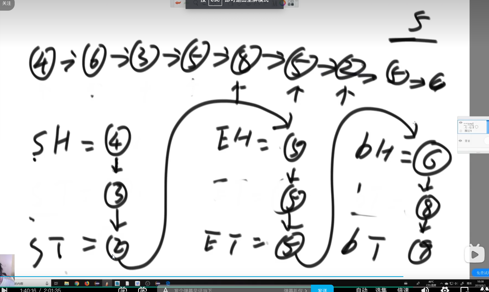
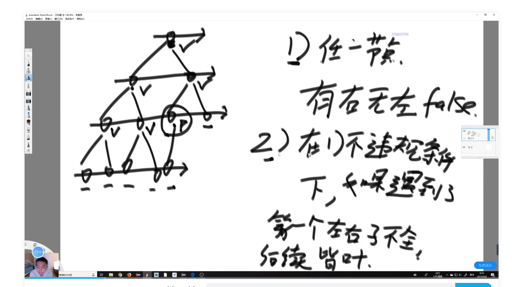

### 1.位运算异或

1.一个整形数组里面，只有一个数字，出现奇数次，其他数字都出现了偶数次。找出这个出现奇数次的数字。

比如[1,4,5,3,1,4,4,4,5] ,1,4,5都出现了偶数次，找出出现了奇数次的3.

使用异或运算中下列几个性质即可；

1。自己和自己异或后变成0的性质。

2。0和N（任何数）异或，等于N

3.异或和顺序无关

```go
package main

import (
	"errors"
	"fmt"
)

func main() {

	arr := []int{9,12,9,3,12,4,4,3,6}
	test, err := singleNum(arr)
	fmt.Println(test)
	fmt.Println(err)

}

//
func singleNum(arr []int) (any, error) {
	if len(arr) <= 1 {
		return arr, errors.New("数组长度应该大于1")
	}
	eor := 0
	for i := 0; i < len(arr); i++ {
		eor = eor ^ arr[i]

	}
	return eor,nil
}


```


1.1  一个整形数组里面，只有两个数字，出现奇数次，其他数字都出现了偶数次。找出这个两个出现奇数次的数字。

比如：[3,4,5,6,7,3,5,6,5,5] 找出4，7

```go
package main

import (
	"errors"
	"fmt"
)

func main() {
	arr := []int{3,4,5,6,7,3,5,6,5,5}
	test, num2,err := singleNum(arr)
	fmt.Println(test)
	fmt.Println(num2)
	fmt.Println(err)

}

func singleNum(arr []int) (any,any,error) {
	if len(arr) <= 1 {
		return nil,nil, errors.New("数组长度应该大于1")
	}
	eor := 0
	for i := 0; i < len(arr); i++ {
		eor = eor ^ arr[i]
	}
	//假设a和b是出现奇数次的那两个数，那么eor就是： a ^ b 而且a和b必不相等，所以 a^b != 0

	// 遇到位运算，需要提出最右侧的1
	// eor ： 				0010 1101
	// ^eor ：				1101 0010
	//^eor + 1 ：			1101 0011
	// eor & (^eor + 1)： 	0000 0001 提取出了eor最右侧的1
	rightOne := eor & (^eor + 1)

	onlyOne := 0
	
	for _,v := range arr {
		if v & rightOne == 0 {
			onlyOne ^= v //a | b
		}
	}

	return onlyOne,eor^onlyOne,nil
}

```


### 2.链表

#### 2.1反转单链表

```go
package main

import "fmt"

func main() {

	//初始化
	node1 := Node{1,nil}
	node2 := Node{2,nil}
	node3 := Node{3,nil}
	node4 := Node{4,nil}

	node1.next = &node2
	node2.next = &node3
	node3.next = &node4

	var headTmp,head *Node = &node1,&node1
	i := 1

	for headTmp != nil {
		fmt.Printf("第%d个节点值为%v,next:%p",i,headTmp.data,headTmp.next)
		fmt.Println()
		headTmp = headTmp.next
		i++
	}

	fmt.Println(head)
	newhead := reverseNode(head)
	fmt.Println()
	fmt.Println(newhead)
	//
	i = 1
	for newhead != nil {
		fmt.Printf("第%d个节点值为%v,next:%p",i,newhead.data,newhead.next)
		fmt.Println()
		newhead = newhead.next
		i++
	}

}

//定义节点
type Node struct {
	data any
	next *Node
}

func reverseNode(head *Node) *Node {
	if head == nil {
		return nil
	}
	var pre *Node //pre是上一个节点的指针

	for head != nil {
		//备份当前指针指向的下一个指针地址
		tmp := head.Next

		//断开当前指针的链接，并且把指针指向上一个节点
		head.Next = pre

		//把上一个节点的指针，指向当前节点
		pre = head

		//把cur指向下一个节点
		head = tmp
	}
	return pre
}
```


#### 2.2双链表反转（或称为逆序）

```go
package main

import "fmt"

type DoubleNode struct {
	Value int
	// 前一个节点，以下统称为前指针
	PreNode *DoubleNode
	// 后一个节点，以下统称为后指针
	NextNode *DoubleNode
}

func ReverseDbNode(head *DoubleNode) *DoubleNode {
	// 先声明两个节点，并将两个节点都置为空
	PreNode := new(DoubleNode)
	NextNode := new(DoubleNode)
	PreNode = nil
	NextNode = nil

	// head为头节点，也就是当前节点
	for head != nil {
		// 保存第二个节点的值
		NextNode = head.NextNode
		// 将当前节点的前指针，指向后一个节点，也就是把头节点的后节点变成前节点，
		head.PreNode = NextNode
		// 将当前节点的后指针，指向前一个节点，也就是把头节点的前节点变成后节点。
		head.NextNode = PreNode
		// 更新前节点，也就是把头节点变成前节点
		PreNode = head
		// 更新当前节点，也就是把后节点变成头节点
		head = NextNode
	}
	return PreNode
}

func PrintDbNode(head *DoubleNode) {
	for head != nil {
		//fmt.Print(head.Value, "\t")
		fmt.Println(head, "\t")
		// 将第二个节点替换为头节点
		head = head.NextNode
	}
	fmt.Println()
}

func main() {
	node1 := new(DoubleNode)
	node2 := new(DoubleNode)
	node3 := new(DoubleNode)
	node4 := new(DoubleNode)
	node1.Value = 1
	node2.Value = 2
	node3.Value = 3
	node4.Value = 4

	// node1为头节点，前指针为空，后指针指向node2
	node1.PreNode = nil
	node1.NextNode = node2

	node2.PreNode = node1
	node2.NextNode = node3

	node3.PreNode = node2
	node3.NextNode = node4

	// node4位尾节点，前指针指向node3，后指针为空
	node4.PreNode = node3
	node4.NextNode = nil

	PrintDbNode(node1)

	reverseNode := ReverseDbNode(node1)

	PrintDbNode(reverseNode)
}
```


#### 2.3找出两个有序链表中，值相同的节点

```go
package main

import (
	"errors"
	"fmt"
)

func main() {

	//初始化
	node1 := Node{1,nil}
	node2 := Node{2,nil}
	node3 := Node{3,nil}
	node4 := Node{4,nil}

	node1.next = &node2
	node2.next = &node3
	node3.next = &node4

	node5 := Node{2,nil}
	node6 := Node{4,nil}
	node7 := Node{5,nil}
	node8 := Node{6,nil}

	node5.next = &node6
	node6.next = &node7
	node7.next = &node8

	var headTwo,head *Node = &node5,&node1
	commonPart(head,headTwo)

}

//定义节点
type Node struct {
	data any
	next *Node
}

//找出两个有序链表中，值相同的节点
func commonPart(head *Node,headTwo *Node) (bool,error) {
	for {

		if head==nil || headTwo == nil {
			return true,nil
		}

		headTwoIntData,ok := headTwo.data.(int)
		headIntData,okTwo := head.data.(int)
		if !ok || !okTwo {
			return false,errors.New("不能有非int数据")
		}

		//相等时一起移动,不相等时，谁小谁移动
		if headTwoIntData ==  headIntData{
			fmt.Println("head:",head.data,"headTwo:",headTwo.data,"\n")
			head = head.next
			headTwo = headTwo.next
		} else if headIntData > headTwoIntData {
			headTwo = headTwo.next
		} else {
			head = head.next
		}
	}
}
```

#### 2.4判断单链表是否为回文结构

笔试的做法，不在乎空间复杂度，在乎时间复杂度

笔试时应该用栈的做法，时间：O(N)，空间O（N）

```go
package main

import (
	"errors"
	"fmt"
)

func main() {

	//初始化
	node1 := Node{1, nil}
	node2 := Node{2, nil}
	node3 := Node{3, nil}
	node4 := Node{2, nil}
	node5 := Node{1, nil}

	node1.next = &node2
	node2.next = &node3
	node3.next = &node4
	node4.next = &node5

	var head *Node = &node1
	res, err := isReNodeByStack(head)
	if err != nil {
		fmt.Println(err)
		return
	}

	fmt.Println(res)

}

//定义节点
type Node struct {
	data any
	next *Node
}

//判断某个单链表，是否为回文结构(回文结构，就是链表中存在一条对称轴，左右两边对称。比如1->2->3->2->1,1->2->2->1等等)

//通过栈的形式，空间复杂度是O(N)
func isReNodeByStack(head *Node) (bool, error) {

	//初始化一个栈
	var slice []int
	headTmp := head
	for head != nil {
		intData, ok := head.data.(int)
		if !ok {
			return false, errors.New("只能是int")
		}
		slice = append(slice, intData)
		head = head.next
	}

	//遍历链表，每遍历一个弹出一个栈元素。如果相等则继续，直达栈弹出完毕。如果不相等，则之间break,不是回文结构
	length := len(slice)
	res := true
	for headTmp != nil || length > 0 {
		intTmpData, ok := headTmp.data.(int)
		if !ok {
			return false, errors.New("只能是int")
		}

		sliceData := slice[length-1]
		if intTmpData != sliceData {
			res = false
			break
		}
		length--
		headTmp = headTmp.next
	}
	return res, nil
}

```


面试时应该用的写法，时间O（N），O(1)

```go
package main

import (
	"fmt"
)

func main() {

	//初始化
	node1 := Node{1, nil}
	node2 := Node{2, nil}
	node3 := Node{3, nil}
	node4 := Node{3, nil}
	node5 := Node{2, nil}
	node6 := Node{1, nil}

	node1.next = &node2
	node2.next = &node3
	node3.next = &node4
	node4.next = &node5
	node5.next = &node6

	var head *Node = &node1
	res, err := isReNode(head)
	if err != nil {
		fmt.Println(err)
		return
	}

	fmt.Println(res)

}

//定义节点
type Node struct {
	data any
	next *Node
}

//判断某个单链表，是否为回文结构(回文结构，就是链表中存在一条对称轴，左右两边对称。比如1->2->3->2->1,1->2->2->1等等)

//用快慢指针。当快指针走到末尾时，慢指针就到了对称轴中点的位置。
// 把中点位置的往后的节点，进行逆序。把中点指向nil。然后从头指针和尾指针，同时开始遍历，并比较节点的值。当有一个节点的值不相等时，break。
//当头或尾指针其中一个遍历到nil时，停止。此时为回文结构。然后把右边逆序的链表还原回去。实现空间复杂度为O（1）的算法
func isReNode(head *Node) (bool, error) {
	if head == nil || head.next == nil {
		return true, nil
	}

	//先找两个变量，备份头和尾的指针。
	var quick, small *Node = head, head
	first := head
	fmt.Println(1)
	for quick.next != nil && quick.next.next != nil {
		//慢指针走一步
		small = small.next
		quick = quick.next.next
	}

	//循环结束后small来到了中点位置
	mid := small.next
	small.next = nil

	//中点的右边，进行逆序，返回逆序后的头节点指针
	rightHeadNode := reverseNode(mid)

	res := true
	//从左开始，把遍历到中点，从右开始遍历到中点，比对是否一样
	for first != nil && rightHeadNode != nil {
		if first.data != rightHeadNode.data {
			res = false
			break
		}
		first = first.next
		rightHeadNode = rightHeadNode.next
	}

	//把右边的逆序回去，变成原来的样子。再把左边的最后的指针向右边的链表，变成原来的样子
	rightHead := reverseNode(small)
	small.next = rightHead

	return res, nil
}

func reverseNode(head *Node) *Node {
	if head == nil {
		return nil
	}
	var pre *Node //pre是上一个节点的指针

	for head != nil {
		//备份当前指针指向的下一个指针地址
		tmp := head.next

		//断开当前指针的链接，并且把指针指向上一个节点
		head.next = pre

		//把上一个节点的指针，指向当前节点
		pre = head

		//把cur指向下一个节点
		head = tmp
	}
	return pre
}

```


#### 2.5将单向链表按某值划分成左边小、中间相等、右边大的形式 

【题目】给定一个单链表的头节点head，节点的值类型是整型，再给定一个整 

数pivot。实现一个调整链表的函数，将链表调整为左部分都是值小于pivot的 

节点，中间部分都是值等于pivot的节点，右部分都是值大于pivot的节点。 

【进阶】在实现原问题功能的基础上增加如下的要求 

【要求】调整后所有小于pivot的节点之间的相对顺序和调整前一样 

【要求】调整后所有等于pivot的节点之间的相对顺序和调整前一样 

【要求】调整后所有大于pivot的节点之间的相对顺序和调整前一样 

【要求】时间复杂度请达到O(N)，额外空间复杂度请达到O(1)。

```java
package class04;

public class Code05_SmallerEqualBigger {

	public static class Node {
		public int value;
		public Node next;

		public Node(int data) {
			this.value = data;
		}
	}

  //笔试的做法，直接把链表的节点元素，放到数组中，给数组做一次分片(arrPartition)的过程,然后把数组中的元素串起来，完事
	public static Node listPartition1(Node head, int pivot) {
		if (head == null) {
			return head;
		}
		Node cur = head;
		int i = 0;
		while (cur != null) {
			i++;
			cur = cur.next;
		}
		Node[] nodeArr = new Node[i];
		i = 0;
		cur = head;
		for (i = 0; i != nodeArr.length; i++) {
			nodeArr[i] = cur;
			cur = cur.next;
		}
		arrPartition(nodeArr, pivot);
		for (i = 1; i != nodeArr.length; i++) {
			nodeArr[i - 1].next = nodeArr[i];
		}
		nodeArr[i - 1].next = null;
		return nodeArr[0];
	}

	public static void arrPartition(Node[] nodeArr, int pivot) {
		int small = -1;
		int big = nodeArr.length;
		int index = 0;
		while (index != big) {
			if (nodeArr[index].value < pivot) {
				swap(nodeArr, ++small, index++);
			} else if (nodeArr[index].value == pivot) {
				index++;
			} else {
				swap(nodeArr, --big, index);
			}
		}
	}

	public static void swap(Node[] nodeArr, int a, int b) {
		Node tmp = nodeArr[a];
		nodeArr[a] = nodeArr[b];
		nodeArr[b] = tmp;
	}

  //
	public static Node listPartition2(Node head, int pivot) {
		Node sH = null; // small head
		Node sT = null; // small tail
		Node eH = null; // equal head
		Node eT = null; // equal tail
		Node bH = null; // big head
		Node bT = null; // big tail
		Node next = null; // save next node
		// every node distributed to three lists
		while (head != null) {
			next = head.next;
			head.next = null;
			if (head.value < pivot) {
				if (sH == null) {
					sH = head;
					sT = head;
				} else {
					sT.next = head;
					sT = head;
				}
			} else if (head.value == pivot) {
				if (eH == null) {
					eH = head;
					eT = head;
				} else {
					eT.next = head;
					eT = head;
				}
			} else {
				if (bH == null) {
					bH = head;
					bT = head;
				} else {
					bT.next = head;
					bT = head;
				}
			}
			head = next;
		}
		// small and equal reconnect
		if (sT != null) {
			sT.next = eH;
			eT = eT == null ? sT : eT;
		}
		// all reconnect
		if (eT != null) {
			eT.next = bH;
		}
		return sH != null ? sH : eH != null ? eH : bH;
	}

	public static void printLinkedList(Node node) {
		System.out.print("Linked List: ");
		while (node != null) {
			System.out.print(node.value + " ");
			node = node.next;
		}
		System.out.println();
	}

	public static void main(String[] args) {
		Node head1 = new Node(7);
		head1.next = new Node(9);
		head1.next.next = new Node(1);
		head1.next.next.next = new Node(8);
		head1.next.next.next.next = new Node(5);
		head1.next.next.next.next.next = new Node(2);
		head1.next.next.next.next.next.next = new Node(5);
		printLinkedList(head1);
		// head1 = listPartition1(head1, 4);
		head1 = listPartition2(head1, 5);
		printLinkedList(head1);

	}

}

```


面试写法listPartition2




#### 2.6复制含有随机指针节点的链表 

【题目】一种特殊的单链表节点类描述如下 

class Node { 

int value; 

Node next; 

Node rand; 

Node(int val) { 

value = val; 

} 

}

rand指针是单链表节点结构中新增的指针，rand可能指向链表中的任意一个节 

点，也可能指向null。给定一个由Node节点类型组成的无环单链表的头节点 

head，请实现一个函数完成这个链表的复制，并返回复制的新链表的头节点。

笔试做法，不要求最优解，空间复杂度可以不怎么考虑

```go
package main

import (
	"fmt"
)

func main() {

	//初始化
	node1 := Node{1, nil,nil}
	node2 := Node{2, nil,nil}
	node3 := Node{3, nil,nil}


	node1.next = &node2
	node1.rand = &node3


	node2.next = &node3
	node2.rand = &node1

	var head *Node = &node1
	headCopy := head
	for head != nil {
		fmt.Println(head.data,head.next,head.rand)
		//head.next.data
		//head.rand.data
		if head.next != nil &&  head.rand != nil{
			fmt.Println("head.next.data:",head.next.data,"| head.next.data:",head.rand.data)
		}
		head = head.next
	}
	res, err := copyList(headCopy)
	//fmt.Println(res,err)
	if err != nil {
		fmt.Println(err)
		return
	}

	fmt.Println()
	for res != nil {
		fmt.Println(res.data,res.next,res.rand)
		if res.next != nil &&  res.rand != nil{
			fmt.Println("head.next.data:",res.next.data,"| head.next.data:",res.rand.data)
		}
		res = res.next
	}

}

//定义节点
type Node struct {
	data any
	next *Node
	rand *Node
}


func copyList(head *Node) (*Node,error) {
	//空指针，则返回nil
	if head == nil {
		return nil,nil
	}

	//var hashNode map[*Node]*Node
	hashNode := make(map[*Node]*Node)
	headTmp := head

	//遍历原链表数据，把原链表的值和新生成的节点数据，放到哈希表中。然后遍历原链表，把每个节点的指针链接起来。
	for head != nil {

		hashNode[head] = &Node{head.data,nil,nil}

		head = head.next
	}

	newHead := hashNode[headTmp]
	for headTmp != nil {
		newHeadNode := hashNode[headTmp]
		newHeadNode.next = hashNode[headTmp.next]
		newHeadNode.rand = hashNode[headTmp.rand]
		headTmp = headTmp.next
	}
	return newHead,nil
}

```


面试做法


#### 2.7给一个单链表，和指定的值。写出一个函数，可以把单链表中等于指定值的节点都删掉。

```go
package main

import "fmt"

func main() {

	//初始化
	node1 := Node{1, nil}
	node2 := Node{2, nil}
	node3 := Node{3, nil}
	node4 := Node{1, nil}
	node5 := Node{1, nil}
	node6 := Node{1, nil}

	node1.next = &node2

	node2.next = &node3
	node3.next = &node4
	node4.next = &node5
	node5.next = &node6

	res, err := deleteNode(&node1, 1)
	if err != nil {
		fmt.Println(err)
		return
	}
	for res != nil {
		fmt.Println(res.data)
		res = res.next
	}

}

//定义节点
type Node struct {
	data int
	next *Node
	//rand *Node
}

func deleteNode(head *Node, num int) (*Node, error) {
	//空指针，则返回nil
	if head == nil {
		return nil, nil
	}

	pre := &Node{0, nil}
	headTmp := head
	//在循环里面，遍历值等于，指定值的节点。等于时，记录上一个节点的指针，然后把上一个节点的指针，指向当前节点的next
	for head != nil {
		tmp := head.next

		//相等时，才删除。pre不用移
		if head.data == num {
			//上一个节点，直接跳过当前节点指向下一个节点。
			pre.next = head.next

			//如果是头节点被删除了，那么要返回下一个节点的指针。不能返回head指针。否则返回head即可
			if headTmp == head {
				headTmp = head.next
			}

			//重置当前节点的next
			head.next = nil
		} else {
			//移动到当前节点
			pre = head
		}

		head = tmp
	}
	return headTmp, nil
}

```


#### 2.8两个单链表相交的一系列问题

【题目】给定两个可能有环也可能无环的单链表，头节点head1和head2。请实 

现一个函数，如果两个链表相交，请返回相交的 第一个节点。如果不相交，返 

回null 

【要求】如果两个链表长度之和为N，时间复杂度请达到O(N)，额外空间复杂度 

请达到O(1)。

到时看java代码吧


### 3.二叉树

#### 3.1判断某个二叉树，是否为搜索二叉树

```go
package main

import (
	"errors"
	"fmt"
	"math"
)

func main() {

	//初始化
	node1 := Node{9, nil, nil}
	node2 := Node{5, nil, nil}
	node3 := Node{15, nil, nil}
	node4 := Node{2, nil, nil}
	node5 := Node{10, nil, nil}
	node6 := Node{10, nil, nil}
	node7 := Node{17, nil, nil}

	node1.left = &node2
	node1.right = &node3

	node2.left = &node4
	node2.right = &node5
	//
	node3.left = &node6
	node3.right = &node7

	// 数据初始化化
	// 数据初始化化
	res := midOrderCheckBst(&node1,0)
	fmt.Println("w:",res)
}

type Stack []any

func (s *Stack) push(v any) {
	*s = append(*s, v)
}

func (s *Stack) pop() (any, error) {
	if len(*s) == 0 {
		return 0, errors.New("空栈，不能弹出了")
	}
	item := (*s)[len(*s)-1]
	*s = (*s)[:len(*s)-1]
	return item, nil
}

type queue []any

// 入队
func (s *queue) push(a any) {
	*s = append(*s, a)
}

// 出队
func (s *queue) pop() (any, error) {
	if (len(*s) == 0) {
		return nil, errors.New("Empty queue")
	}
	item := (*s)[0]
	*s = (*s)[1:]
	return item, nil
}

//定义二叉树节点
type Node struct {
	data  int
	left  *Node
	right *Node
}

//检查是否为搜索二叉树（对于每一个根节点来说，左子树的所有节点值都比头节点值小，右子树的所有节点值都比头节点值大）
func midOrderCheckBst(head *Node,preNodeData int) bool {
	if head == nil {
		return true
	}
	stack := make(Stack, 0)
	for len(stack) > 0 || head != nil {
		if head != nil {
			//左边界进栈
			stack.push(head)
			head = head.left
		} else {
			data, err := stack.pop()
			if err != nil {
				fmt.Println(err)
				break
			}
			dataPoint := data.(*Node)

      //	当前节点，如果比上一个节点小的话，就不是升序了(也就不是搜索二叉树了)
			if dataPoint.data <= preNodeData {
				return false
			} else {
				preNodeData = dataPoint.data
			}

			head = dataPoint.right
		}
	}
	return true
}
```


#### 3.2判断一个二叉树是否为满二叉树



```go
package main

import (
	"errors"
	"fmt"
)

func main() {

	//初始化
	node1 := Node{1, nil, nil}
	node2 := Node{5, nil, nil}
	node3 := Node{15, nil, nil}
	node4 := Node{2, nil, nil}
	node5 := Node{10, nil, nil}
	//node6 := Node{10, nil, nil}
	node7 := Node{17, nil, nil}

	node1.left = &node2
	node1.right = &node3

	node2.left = &node4
	node2.right = &node5
	//
	//node3.left = &node6
	node3.right = &node7

	// 数据初始化化
	res,err := isCBT(&node1)
	if err != nil {
	    fmt.Println(err)
	    return
	}
	fmt.Println("w:", res)
}

type Stack []any

func (s *Stack) push(v any) {
	*s = append(*s, v)
}

func (s *Stack) pop() (any, error) {
	if len(*s) == 0 {
		return 0, errors.New("空栈，不能弹出了")
	}
	item := (*s)[len(*s)-1]
	*s = (*s)[:len(*s)-1]
	return item, nil
}

type queue []any

// 入队
func (s *queue) push(a any) {
	*s = append(*s, a)
}

// 出队
func (s *queue) pop() (any, error) {
	if (len(*s) == 0) {
		return nil, errors.New("Empty queue")
	}
	item := (*s)[0]
	*s = (*s)[1:]
	return item, nil
}

//定义二叉树节点
type Node struct {
	data  int
	left  *Node
	right *Node
}

//利用宽度优先遍历，判断一个树是否为完全二叉树
//完全二叉树的两个条件：
// 1.当有一个节点，具有右孩子，却没有左孩子时，不是完全二叉树。
//2.在满足条件1时，如果遇到了第一个节点的左右孩子不全，则后续节点应该全部为叶节点（没有孩子）
func isCBT(head *Node) (bool, error) {
	if head == nil {
		return true, nil
	}

	queueObj := make(queue, 0)
	queueObj.push(head)
	leaf := false

	for len(queueObj) > 0 {
		v, err := queueObj.pop()
		if err != nil {
			return false, err
		}

		vPoint := v.(*Node)

		if (vPoint.left == nil && vPoint.right != nil) || (leaf && (vPoint.left != nil || vPoint.right != nil)) {
			return false, nil
		}

		if vPoint.left != nil {
			queueObj.push(vPoint.left)
		}

		if vPoint.right != nil {
			queueObj.push(vPoint.right)
		}

		//条件二，当遇到一个节点，左右孩子不全的情况下，后面的节点，应该都是叶节点
		if vPoint.left == nil || vPoint.right == nil {
			leaf = true
		}
	}
	return true, nil
}

```


#### 3.3一个二叉树(头节点为head)中包含了两个节点o1和o2,求o1和o2的最低公共祖先节点

```go
package main

import (
	"errors"
	"fmt"
)

func main() {

	//初始化
	node1 := Node{1, nil, nil}
	node2 := Node{2, nil, nil}
	node3 := Node{3, nil, nil}
	node4 := Node{4, nil, nil}
	node5 := Node{5, nil, nil}
	node6 := Node{6, nil, nil}
	node7 := Node{7, nil, nil}

	node1.left = &node2
	node1.right = &node3

	node2.left = &node4
	node2.right = &node5

	//
	node3.left = &node6
	node3.right = &node7

	// 数据初始化化

	res := commonNode(&node1, &node2, &node5)
	fmt.Println(res)
	fmt.Println(res.data)
}

type Stack []any

func (s *Stack) push(v any) {
	*s = append(*s, v)
}

func (s *Stack) pop() (any, error) {
	if len(*s) == 0 {
		return 0, errors.New("空栈，不能弹出了")
	}
	item := (*s)[len(*s)-1]
	*s = (*s)[:len(*s)-1]
	return item, nil
}

type queue []any

// 入队
func (s *queue) push(a any) {
	*s = append(*s, a)
}

// 出队
func (s *queue) pop() (any, error) {
	if (len(*s) == 0) {
		return nil, errors.New("Empty queue")
	}
	item := (*s)[0]
	*s = (*s)[1:]
	return item, nil
}

//定义二叉树节点
type Node struct {
	data  int
	left  *Node
	right *Node
}

type returnData struct {
	isBree bool
	min    int
	max    int
}

type NodeMap map[*Node]*Node

//
func commonNode(head *Node, o1 *Node, o2 *Node) *Node {
	//初始化头节点map
	nodeMap := make(NodeMap, 0)
	fullMap(head, &nodeMap)
	nodeMap[head] = head

	//给o1的头节点，塞进o1HeadMap中
	o1HeadMap := make(NodeMap, 0)
	o1HeadMap[o1] = o1
	cur := o1
	for cur != nodeMap[cur] {
		o1HeadMap[nodeMap[cur]] = nodeMap[cur]
		//往上遍历
		cur = nodeMap[cur]
	}

	fmt.Println(o1HeadMap)
	//
	curTwo := o2
	for curTwo != nil {
		_, ok := o1HeadMap[curTwo]
		if ok {
			return curTwo
		}
		//往上遍历
		curTwo = nodeMap[curTwo]
	}
	return nil
}

func fullMap(head *Node, nodeMap *NodeMap) {
	if head == nil {
		return
	}
	fmt.Printf("%p", head)
	fmt.Println()
	(*nodeMap)[head.left] = head
	(*nodeMap)[head.right] = head

	fullMap(head.left, nodeMap)

	fullMap(head.right, nodeMap)
}
go
```


#### 3.4找后继节点

在二叉算树法中扩找展到题一个节点的后继节点 (什么是后继节点？在中序遍历中，当前节点的下一个节点，称为当前节点的后继节点。当前节点的前一个节点，称为前驱节点

【题目】 现在有一种新的二叉树节点类型如下: 

public class Node { 

public int value; 

public Node left; 

public Node right; 

public Node parent; 

public Node(int val) { 

value = val; 

} 

}

该结构比普通二叉树节点结构多了一个指向父节点的parent指针。 

假设有一棵Node类型的节点组成的二叉树，树中每个节点的parent指针都正确地指向自己的父节点，头节 

点的parent指向null。 

只给一个在二叉树中的某个节点node，请实现返回node的后继节点的函数。 

在二叉树的中序遍历的序列中， node的下一个节点叫作node的后继节点。

如何让找到后续节点的时间复杂度达到O（k），k是当前节点与后继节点的最短距离


```go
package main

import (
	"errors"
	"fmt"
)

func main() {

	//初始化
	node1 := Node{1, nil, nil,nil}
	node2 := Node{2, nil, nil,nil}
	node3 := Node{3, nil, nil,nil}
	node4 := Node{4, nil, nil,nil}
	node5 := Node{5, nil, nil,nil}
	node6 := Node{6, nil, nil,nil}
	node7 := Node{7, nil, nil,nil}

	node1.left = &node2
	node1.right = &node3

	node2.left = &node4
	node2.right = &node5
	node2.parent = &node1

	//
	node3.left = &node6
	node3.right = &node7
	node3.parent = &node1

	node4.parent = &node2
	node5.parent = &node2

	node6.parent = &node3
	node7.parent = &node3

	// 数据初始化化

	res := mostShortAfter(&node7)
	fmt.Println(res)
}

type Stack []any

func (s *Stack) push(v any) {
	*s = append(*s, v)
}

func (s *Stack) pop() (any, error) {
	if len(*s) == 0 {
		return 0, errors.New("空栈，不能弹出了")
	}
	item := (*s)[len(*s)-1]
	*s = (*s)[:len(*s)-1]
	return item, nil
}

type queue []any

// 入队
func (s *queue) push(a any) {
	*s = append(*s, a)
}

// 出队
func (s *queue) pop() (any, error) {
	if (len(*s) == 0) {
		return nil, errors.New("Empty queue")
	}
	item := (*s)[0]
	*s = (*s)[1:]
	return item, nil
}

//定义二叉树节点
type Node struct {
	data   int
	left   *Node
	right  *Node
	parent *Node
}

type returnData struct {
	isBree bool
	min    int
	max    int
}

type NodeMap map[*Node]*Node

//
func mostShortAfter(node *Node) *Node {
	//分析得知，存在两种情况。
	//1.当前节点，有右子树的情况。则后继节点为，右子树的最左节点。
	//2.当前节点无右子树的情况，则后继节点就一直往上走。
	if node == nil {
		return nil
	}

	if node.right != nil {
		return getMostLeft(node.right)
	} else {
		//父节点不为空，并且当前节点，是父节点的右孩子，继续往上.
		for node.parent != nil && node.parent.left != node {
			node = node.parent
		}
		//走到当前节点，为父节点的左孩子时，返回父节点。此时父节点必为当前节点的后继节点
		return node.parent
	}

}

func getMostLeft(head *Node) *Node {
  
	for head != nil {
		if head.left == nil {
			return head
		}
		head = head.left
	}
	return nil
}

```


#### 3.5二叉树的序列化和反序列化

```go
package main

import (
	"errors"
	"fmt"
	"strconv"
	"strings"
)

func main() {

	//初始化
	node1 := Node{1, nil, nil}
	node2 := Node{2, nil, nil}
	node3 := Node{3, nil, nil}
	node4 := Node{4, nil, nil}
	node5 := Node{5, nil, nil}
	node6 := Node{6, nil, nil}
	node7 := Node{7, nil, nil}

	node1.left = &node2
	node1.right = &node3

	node2.left = &node4
	node2.right = &node5

	//
	node3.left = &node6
	node3.right = &node7

	// 数据初始化化

	res := sign(&node1)
	fmt.Println(res)

	head := unSign(res)
	preOrder(head)


}

type Stack []any

func (s *Stack) push(v any) {
	*s = append(*s, v)
}

func (s *Stack) pop() (any, error) {
	if len(*s) == 0 {
		return 0, errors.New("空栈，不能弹出了")
	}
	item := (*s)[len(*s)-1]
	*s = (*s)[:len(*s)-1]
	return item, nil
}

type queue []any

// 入队
func (s *queue) push(a any) {
	*s = append(*s, a)
}

// 出队
func (s *queue) pop() (any) {
	if (len(*s) == 0) {
		return nil
	}
	item := (*s)[0]
	*s = (*s)[1:]
	return item
}

//定义二叉树节点
type Node struct {
	data  int
	left  *Node
	right *Node
	//parent *Node
}

type returnData struct {
	isBree bool
	min    int
	max    int
}

type NodeMap map[*Node]*Node

// 序列化二叉树,返回一个二叉树序列化后的字符串
func sign(node *Node) string {
	if node == nil {
		return "#_"
	}

	str := strconv.Itoa(node.data) + "_"

	left := sign(node.left)

	right := sign(node.right)

	return str + left + right
}

//二叉树的反序列化
func unSign(str string) *Node {
	if str == "" {
		return nil
	}
	slice := strings.Split(str, "_")
	slice = slice[:len(slice)-1]

	nodeQueue := make(queue,0)
	for _,v := range slice {
		nodeQueue.push(v)
	}
	fmt.Println(nodeQueue)

	head,_ := buildNode(&nodeQueue)
	return head
}

func buildNode(queueObj *queue) (*Node,error){
	v := queueObj.pop()
	vStr  := v.(string)
	if vStr == "#" {
		return nil,nil
	}
	vInt,err := strconv.ParseInt(vStr,10,0)
	if err != nil {
		return nil,err
	}
	node := Node{int(vInt),nil,nil}
	node.left,_ = buildNode(queueObj)
	node.right,_ = buildNode(queueObj)
	return &node,nil
}

func preOrder(head *Node) {
	if head == nil {
		return
	}

	fmt.Println(head.data)

	preOrder(head.left)

	preOrder(head.right)
}
```


#### 3.6折纸问题

折纸问题 

请把一段纸条竖着放在桌子上，然后从纸条的下边向上方对折1次，压出折痕后 

展开。 

此时折痕是凹下去的，即折痕突起的方向指向纸条的背面。 

如果从纸条的下边向上方连续对折2次，压出折痕后展开，此时有三条折痕，从 

上到下依次是下折痕、下折痕和上折痕。 

给定一个输入参数N，代表纸条都从下边向上方连续对折N次。 

请从上到下打印所有折痕的方向。 

例如:N=1时，打印: down N=2时，打印: down down up


画图分析发现，这是一颗，根节点为凹，左子树都为凹，右子树都为凸的满二叉树。如果中序遍历这颗二叉树，就是

折纸从上到下的折痕方向


```go
package main

import (
	"errors"
	"fmt"
)

func main() {

	//初始化
	//node1 := Node{1, nil, nil}
	//node2 := Node{2, nil, nil}
	//node3 := Node{3, nil, nil}
	//node4 := Node{4, nil, nil}
	//node5 := Node{5, nil, nil}
	//node6 := Node{6, nil, nil}
	//node7 := Node{7, nil, nil}
	//
	//node1.left = &node2
	//node1.right = &node3
	//
	//node2.left = &node4
	//node2.right = &node5
	//
	////
	//node3.left = &node6
	//node3.right = &node7

	// 数据初始化化
	printTree(1, 2, true)

}

type Stack []any

func (s *Stack) push(v any) {
	*s = append(*s, v)
}

func (s *Stack) pop() (any, error) {
	if len(*s) == 0 {
		return 0, errors.New("空栈，不能弹出了")
	}
	item := (*s)[len(*s)-1]
	*s = (*s)[:len(*s)-1]
	return item, nil
}

type queue []any

// 入队
func (s *queue) push(a any) {
	*s = append(*s, a)
}

// 出队
func (s *queue) pop() (any) {
	if (len(*s) == 0) {
		return nil
	}
	item := (*s)[0]
	*s = (*s)[1:]
	return item
}

//定义二叉树节点
type Node struct {
	data  int
	left  *Node
	right *Node
	//parent *Node
}

type returnData struct {
	isBree bool
	min    int
	max    int
}

type NodeMap map[*Node]*Node

//nowLevel:当前来到了二叉树的第几层，num：折纸的次数,down:true凹，false凸
func printTree(nowLevel int, num int, down bool) {
	if nowLevel > num {
		return
	}
	//左孩子 凹
	printTree(nowLevel+1, num, true)

	downStr := "凸"
	if down {
		downStr = "凹"
	}
	fmt.Println(downStr)

	//右孩子 凸
	printTree(nowLevel+1, num, false)
}
```


### 4.大数据类型的题目


解题技巧

1）哈希函数可以把数据按照种类均匀分流 

2）布隆过滤器用于集合的建立与查询，并可以节省大量空间 

3）一致性哈希解决数据服务器的负载管理问题 

4）利用并查集结构做岛问题的并行计算 

5）位图解决某一范围上数字的出现情况，并可以节省大量空间 

6）利用分段统计思想、并进一步节省大量空间 

7）利用堆、外排序来做多个处理单元的结果合并


#### 题目1

32位无符号整数的范围是0~4,294,967,295，现在有一个正好包含40亿个无符号整数的文 

件，所以在整个范围中必然存在没出现过的数。可以使用最多1GB的内存，怎么找到所有 

未出现过的数？ 

1.用分流的思想，分成100个文件。然后整合成最后的答案.(使用技巧1:哈希函数可以把数据按照种类均匀分流)

2.也可以直接用位图的解法。42亿多/8，等于512m左右，如果申请一个2^32-1个长度的位图数组，也只需要500多m的内存，即可存下一个42亿多的位图的数组。使用技巧5:位图解决某一范围上数字的出现情况，并可以节省大量空间 


【进阶】 

内存限制为 10MB，但是只用找到一个没出现过的数即可

使用技巧6:利用分段统计思想、并进一步节省大量空间 

申请一个类型为位图的数组。10mb就是，1千万左右的字节。42亿多除以1千万，就等到了430左右。所以位图上0号位置表示。0～430范围上，有多少个数。比如有100个的话，表示42亿多的数字中，有100个数字，在0～430的范围内。其他数组表示的意思也是如此。肯定有一个范围上，数量不够430.然后再这个范围继续分割。周而复始，直到范围的数量表示为1个时，那么数量不够1的那个范围，就是没有出现过的数。


二分法也可以。每次二分，肯定左右两边，有一边的范围是没有布满的。二分32次后，左右两边范围就是1，到时没有布满的那一边数字，就是在0～2^32-1整个范围上都没有出现过的数字。内存最小。


