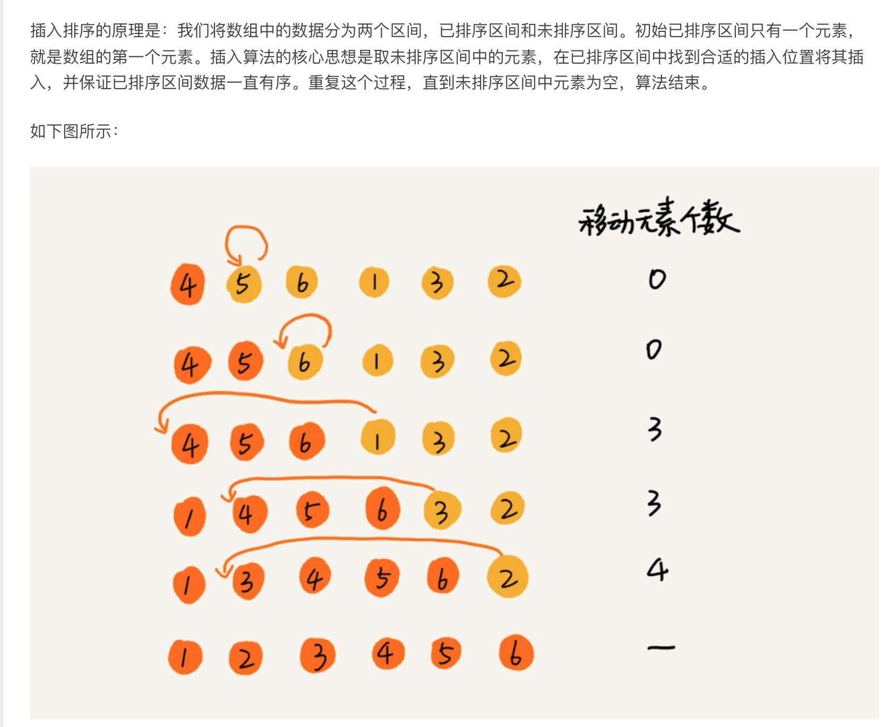

## 为什么要学习数据结构和算法？

可以加快查询的速率。

学习数据结构和算法要从复杂度分析说起。算法复杂度包括时间复杂度和空间复杂度，两者中又以时间复杂度相对重要，因为就 Web 应用而言，我们常见的性能优化策略都是以空间换时间，比如缓存系统就是如此。


O(n)的这个n的取值是由什么决定的？

实现目标所需要操作的数据个数。


公式中的低阶、常量、系数三部分都可以忽略：

比如：T(n) = O(2n+2)就是T(n) = O(n)，T(n) = O(2n^2 +2n+3)就是T(n) = O(n^2)


## 常见的数据结构类型

#### 数据结构分类

数据结构有很多种，一般来说，按照数据的逻辑结构对其进行简单的分类，包括**线性结构和非线性结构两类**

线性结构：一个含义n个数据元素的有序集合，数据元素之间具有一对一的关系。比如：队列，栈，链表，一维数组（也称为串）

非线性结构：数据元素之间具有1对多，或者多对1，或者多对多的关系的元素结合。比如，树，图，多维数组（换成矩阵时，需要多个下标才能表示唯一的数据元素，所以归为非线性结构），堆


常见的数据结构8种：

- 数组（Array）
- 队列（Queue）
- 链表（Linked List）
- 栈（Stack）
- 树（Tree）
- 散列表（Hash）
- 堆（Heap）
- 图（Graph）


### 1.数组

我们要介绍的第一个数据结构就是数组。

数组（Array）是一种线性表数据结构，它用一组连续的内存空间，来存储一组具有相同类型的数据。如果你学习过 C 语言，应该对这段定义很熟悉，但是在 PHP 这种动态语言中，因为数组底层是通过散列表（后面我们会介绍这个数据结构）实现的，所以功能异常强大，这段常规的数组定义在 PHP 中并不成立，PHP 的数组可以存储任何类型数据，如果与 Java 对比的话，PHP 数组集成了 Java 的数组、List、Set、Map 于一身，所以写代码的效率比 Java 高了几个量级。

抛开 PHP 或 JavaScript 这种动态语言，对于传统的数组，比如 C 语言和 Java 中的数组，在使用之前都需要声明数组存储数据的类型和数组的大小，数组的优点是可以通过下标值随机访问数组内的任何元素，算法复杂度是 O(1)，非常高效，但是缺点是删除/插入元素比较费劲，以删除为例，需要在删除某个元素后，将后续元素都往前移一位，如果是插入，则需要将插入位置之后的元素都往后移，所以对数组的插入/删除而言，算法复杂度是 O(n)，当然了，这个是针对 C / Java 这种语言而言，PHP 不受此约束，因为它不是传统一样上的数组嘛。


### 2.链表


#### 单链表

单链表中有两个节点比较特殊，分别是第一个结点和最后一个结点。我们通常把第一个结点叫作头结点，把最后一个结点叫作尾结点。其中，头结点用来记录链表的基地址，有了它，我们就可以遍历得到整条链表。而尾结点特殊的地方是：指针不是指向下一个结点，而是指向一个空地址 NULL，表示这是链表上最后一个结点。对单链表而言，理论上来说，插入和删除节点的时间复杂度是 O(1)，查询节点的时间复杂度是 O(n)。


用go实现单链表结构：从头部添加一个节点，从尾部添加一个节点，删除一个节点，获取


```go
package main

import (
	"fmt"
)

// 定义节点

// 入口函数
func main() {
	//var l LList
	//l = LList{&Node{1,nil},0}

	l := CreateList()
	l.Add(1)
	l.Append(2)
	l.Append(3)
	l.Append(4)

	l.Scan()

	newNode := reverseList(l.Header)
	i := 1
	for newNode.Next != nil {

		fmt.Printf("第%d的节点是%d\n", i, newNode.Data)
		newNode = newNode.Next
		i++
	}
	fmt.Printf("第%d的节点是%d\n", i, newNode.Data)

}

//反转单链表或者叫单链表逆序
func reverseList(cur *Node) *Node {
	if cur == nil {
		return nil
	}
	var pre *Node //pre是上一个节点的指针

	for cur != nil {
		//备份当前指针指向的下一个指针地址
		tmp := cur.Next

		//断开当前指针的链接，并且把指针指向上一个节点
		cur.Next = pre

		//把上一个节点的指针，指向当前节点
		pre = cur

		//把cur指向下一个节点
		cur = tmp
	}
	//头节点指针
	return pre
}

type Node struct {
	Data interface{}
	Next *Node
}

type LList struct {
	Header *Node //指向第一个节点
	Length int
}

func CreateNode(v interface{}) *Node {
	return &Node{v, nil}
}
func CreateList() *LList {
	header := CreateNode(nil)
	return &LList{header, 0}
}

//往链表头增加一个节点,
func (l *LList) Add(data interface{}) {
	newNode := CreateNode(data)
	defer func() {
		l.Length++
	}()

	if l.Length == 0 {
		l.Header = newNode
	} else {
		newNode.Next = l.Header
		l.Header = newNode //头指针指向新加的
	}

}

//往链表尾加一个节点
func (l *LList) Append(data interface{}) {
	newNode := CreateNode(data)
	defer func() {
		l.Length++
	}()

	if l.Length == 0 {
		l.Header = newNode
	}
	if l.Length > 0 {
		current := l.Header
		for current.Next != nil { //循环找到最后一个节点
			current = current.Next
		}
		current.Next = newNode //把新节点地址给最后一个节点的Next
	}
}

//往i插入一个节点，后插
func (l *LList) Insert(i int, data interface{}) {
	defer func() {
		l.Length++
	}()

	if i >= l.Length {
		l.Append(data)
		return
	}
	newNode := CreateNode(data)
	//找到第i个节点pre和i+1个after节点
	j := 1
	pre := l.Header
	for j != i {
		pre = pre.Next
		j++
	}
	after := pre.Next //获取到i+1个节点
	//修改i节点，新节点的指针
	pre.Next = newNode
	newNode.Next = after
}

//删除第i个节点
func (l *LList) Delete(i int) {
	defer func() {
		l.Length--
	}()
	if i == 1 { //删除第一个节点，把header指向第二个节点即可
		l.Header = l.Header.Next
		return
	}
	//找到第i-1个节点，找到第i+1个节点，修改i-1的节点的next即可
	j := 0
	current := l.Header
	for j == i-1 {
		current = current.Next
		j++
	}
	after := current.Next.Next
	current.Next = after
}

//遍历链表，显示出来
func (l *LList) Scan() {
	current := l.Header
	i := 1
	for current.Next != nil {
		fmt.Printf("第%d的节点是%d\n", i, current.Data)
		current = current.Next
		i++
	}
	fmt.Printf("第%d的节点是%d\n", i, current.Data)

}

```


#### 循环链表

然后还有在单链表的基础上扩展还有循环链表，循环链表和单链表的区别是尾节点指向了头结点，从而首尾相连，有点像贪吃蛇，可用于解决「约瑟夫环」问题，循环链表的结构如图所示：


#### 双向链表

此外，还有比较常见的双向链表，顾名思义，与单链表的区别是双向链表除了有一个指向下一个节点的指针外，还有一个用于指向上一个节点的指针，从而实现通过 O(1) 复杂度找到上一个节点。正是因为这个节点，使得双向链表在插入、删除节点时比单链表更高效，虽然我们前面已经提到单链表插入、删除时间复杂度已经是 O(1) 了，但是这没有考虑还只是针对插入、删除操作本身而言，以删除为例，删除某个节点后，需要将其前驱节点的指针指向被删除节点的下一个节点，这样，我们还需要获取其前驱节点，在单链表中获取前驱节点的时间复杂度是 O(n)，所以综合来看单链表的删除、插入操作时间复杂度也是 O(n)，而双向链表则不然，它有一个指针指向上一个节点，所以其插入和删除时间复杂度才是真正的 O(1)。

此外，对于有序链表而言，双向链表的查询效率显然也要高于单链表，不过更优的时间复杂度是靠更差的空间复杂度换取的，双向链表始终需要单链表的两倍空间，但是正如我们之前说的，在 Web 应用中，时间效率优先级更高，所以我们通常都是空间换时间来提高性能，Java 的 `LinkedHashMap` 底层就用到了双向链表


#### 双向循环链表


```php
<?php

/**
 * 通过 PHP 数组模拟实现单链表
 */
class LinkedList
{
    private $list = [];

    // 获取链表指定位置的元素值，从0开始
    public function get($index)
    {
        $value = NULL;
        while (current($this->list)) {
            if (key($this->list) == $index) {
                $value = current($this->list);
            }
            next($this->list);
        }
        reset($this->list);
        return $value;
    }

    // 在链表指定位置插入值，默认插到链表头部
    public function add($value, $index = 0)
    {
        array_splice($this->list, $index, 0, $value);
    }

    // 从链表指定位置删除元素
    public function remove($index)
    {
        array_splice($this->list, $index, 1);
    }

    public function isEmpty()
    {
        return !next($this->list);
    }

    public function size()
    {
        return count($this->list);
    }
}

$linkedList = new LinkedList();
$linkedList->add(4);
$linkedList->add(5);
$linkedList->add(3);
print $linkedList->get(1);   # 输出5
$linkedList->add(1, 1);      # 在结点1的位置上插入1
print $linkedList->get(1);   # 输出1
$linkedList->remove(1);      # 移除结点1上的元素
print $linkedList->get(1);   # 输出5
print $linkedList->size();   # 输出3

```

go实现双向链表的逆序

```go
package main

import "fmt"

type DoubleNode struct {
	Value int
	// 前一个节点，以下统称为前指针
	PreNode *DoubleNode
	// 后一个节点，以下统称为后指针
	NextNode *DoubleNode
}

func ReverseDbNode(head *DoubleNode) *DoubleNode {
	// 先声明两个节点，并将两个节点都置为空
	PreNode := new(DoubleNode)
	NextNode := new(DoubleNode)
	PreNode = nil
	NextNode = nil

	// head为头节点，也就是当前节点
	for head != nil {
		// 保存第二个节点的值
		NextNode = head.NextNode
		// 将当前节点的前指针，指向后一个节点，也就是把头节点的后节点变成前节点，
		head.PreNode = NextNode
		// 将当前节点的后指针，指向前一个节点，也就是把头节点的前节点变成后节点。
		head.NextNode = PreNode
		// 更新前节点，也就是把头节点变成前节点
		PreNode = head
		// 更新当前节点，也就是把后节点变成头节点
		head = NextNode
	}
	return PreNode
}

func PrintDbNode(head *DoubleNode) {
	for head != nil {
		//fmt.Print(head.Value, "\t")
		fmt.Println(head, "\t")
		// 将第二个节点替换为头节点
		head = head.NextNode
	}
	fmt.Println()
}

func main() {
	node1 := new(DoubleNode)
	node2 := new(DoubleNode)
	node3 := new(DoubleNode)
	node4 := new(DoubleNode)
	node1.Value = 1
	node2.Value = 2
	node3.Value = 3
	node4.Value = 4

	// node1为头节点，前指针为空，后指针指向node2
	node1.PreNode = nil
	node1.NextNode = node2

	node2.PreNode = node1
	node2.NextNode = node3

	node3.PreNode = node2
	node3.NextNode = node4

	// node4位尾节点，前指针指向node3，后指针为空
	node4.PreNode = node3
	node4.NextNode = nil

	PrintDbNode(node1)

	reverseNode := ReverseDbNode(node1)

	PrintDbNode(reverseNode)
}
```


### 3.栈

前面我们聊了两种基本的数据结构 —— [数组](https://laravelacademy.org/post/20947)和[链表](https://laravelacademy.org/post/20948)，从逻辑角度来说，它们都是线性结构（就是排成一条线的结构，只有前后两个方向，非线性结构包括树、图等，后面会讲到），从存储角度来说，一个是顺序存储，一个是链式存储，各有利弊，数组需要预先申请连续内存，超出限制会溢出，但是对明确知道规模的小型数据集而言，使用数组会更加高效，随机访问的特性也更加方面数组读取，但插入和删除性能要差一些；链表的话没有空间限制，但是需要额外空间存储指针，插入、删除效率很高，但不支持随机访问。

虽说 PHP 中很少接触到这些，但是你学习使用 C 语言的话这些基础还是需要了解的。接下来我们要介绍两种特殊的线性结构，或者说用于满足特定场景需求的线性结构：栈和队列。

首先来看栈。

栈又叫堆栈，是限定只能在一端进行插入和删除操作的线性表，并且满足后进先出（LIFO）的特点。我们把允许插入和删除的一端叫做栈顶，另一个端叫做栈底，不含任何数据的栈叫做空栈。

栈支持通过数组/链表实现，通过数组实现的通常叫做顺序栈，通过链表实现的叫做链栈。由于是在 PHP 中演示，我尽量偏向 PHP 语言，化繁就简，下面我们简单演示下如何在 PHP 中通过数组实现一个简单的顺序栈


```go
package main

import (
	"fmt"
	"errors"
)

type Stack []any

// 入栈
func (s *Stack) push(a any) {
	*s = append(*s, a)
}

// 出栈
func (s *Stack) pop() (any, error) {
	if (len(*s) == 0) {
		return 0, errors.New("Empty Stack")
	}
	a := *s
	*s = a[:len(a) - 1]
	return a[len(a) - 1], nil
}


func main() {
	// 数据初始化化
	var s Stack = []int{12}
	s.push(10)
	fmt.Printf("入栈后的 Stack ： %v\n", s)

	a, err := s.pop()
	fmt.Printf("出栈的数据：%v ， 目前的 Stack : %v, Error: %v\n", a, s, err)

}
```


#### 单调栈


什么是单调栈？就是一个栈内的存储的元素值都是从大到小(单调递减)，或者从小到大进行排列（单调递增）。

此时可以解决一种类型的问题。求一个数组中，当前数，在左边哪个数比当前数大而且距离最近？在右边哪个数比当前数大而且距离最近？

比如 [5,4,6,7,2,3,0,1]


解决这样类型的问题，搞一个栈,然后维持这个栈的单调性即可解决。下面的这种方法，不管数组里是否有重复值的情况下，都可以解决。

就是栈里面的元素，都是单链表即可。相同的元素的值，单链表串起来就OK了。

每次入栈的时候，保证栈低到栈顶，都是从大到小到顺序排列，当入栈元素，有3种情况

1.比栈顶元素要小时，直接入栈，成为新的栈顶元素。直接当前单链表，投入栈中

2.相等时，挂在栈顶元素的后面。成栈顶元素一起成为单链表。(比如下图中，{下标为1和3的元素值都是4，串成单链表挂在一起了})

3.比栈顶元素要大时,弹出当前栈顶元素，当前元素左边比它大而且距离最近的元素就是，新的栈顶元素，右边比它大而且距离最近的元素，就是准备入栈的元素。比如下图中，下标为4，值为5的元素进栈时，发现5比4大，弹出单链表{1,3}->4。

此时（下标为1，值为4的）元素打印，距离（下标为1，值为4的）元素, 左边最近的数是(下标为0，值为5的元素)，右边最近的数是(下标为4，值为5的元素)。

然后轮到3打印，(下标为3，值为4的）元素打印，距离（下标为3，值为4的）元素, 左边最近的数是(下标为0，值为5的元素)，右边最近的数是(下标为4，值为5的元素)。


当都遍历完了，如果栈内还有元素的话，进入清算流程。

 


传统方法，每个元素，左边遍历一下找到元素，右边遍历一下找到元素，时间复制度是O(n^2).

单调栈这样，每个元素进栈一次，出栈一次，时间复杂度是O（n）级别

```go
package main

import (
	"fmt"
	"strconv"
)

type Stack []any
type Node struct {
	Data interface{}
	Next *Node
}

// 入栈
func (s *Stack) push(a any) {
	*s = append(*s, a)
}

// 出栈
func (s *Stack) pop() (any) {
	if (len(*s) == 0) {
		return nil
	}
	a := *s
	*s = a[:len(a)-1]
	return a[len(a)-1]
}

func main() {
	// 数据初始化化
	arr := []int{5, 4, 3, 6, 1, 2, 0}
	printNearMax(arr)
}

func printNearMax(arr []int) {
	stack := make(Stack, 0)
	for k, v := range arr {
		//如果是空栈，则直接塞入
		if len(stack) == 0 {
			stack.push(&Node{k, nil})
		} else {
			//不是空栈，拿到栈顶元素，判断3种情况
			top := stack[len(stack)-1].(*Node) //栈顶
			topInt := top.Data.(int)
			if arr[topInt] > v {
				//第一种:直接塞入
				stack.push(&Node{k, nil})
			} else if arr[topInt] == v {
				//第二种:挂在链表最后面
				getLastPoint(top).Next = &Node{k, nil}
			} else {
				//第三种：弹出元素
				mid := stack.pop().(*Node)
				midInt := mid.Data.(int)

				//入股一直比v小的话，则一直弹出。弹出就打印
				for arr[midInt] < v {
					//每个元素可能是一个值相等的单链表。遍历单表表
					printSingle(mid, arr, &stack, k, v)

					//弹出后，看栈是否为空，如果为空，则直接塞入。否则继续判断3种情况
					if len(stack) > 0 {
						end := stack[len(stack)-1].(*Node)
						endInt := end.Data.(int)
						if arr[endInt] > v {
							//入栈
							stack.push(&Node{k, nil})
							//搞定，结束当前循环。
							break
						} else if arr[endInt] == v {
							getLastPoint(end).Next = &Node{k, nil}
							//搞定，结束当前循环。
							break
						} else {
							//继续弹
							mid = stack.pop().(*Node)
							midInt = mid.Data.(int)
						}
					} else {
						//入栈
						stack.push(&Node{k, nil})
						break
					}
				}
			}
		}
	}

	//如果队列还有的话，清算队列元素
	for len(stack) > 0 {
		value := stack.pop()
		printSingle(value.(*Node), arr, &stack, "无", "无")
	}
}

func getLastPoint(head *Node) *Node {
	frontEnd := head
	for head != nil {
		frontEnd = head
		head = head.Next
	}
	return frontEnd
}

func printSingle(mid *Node, arr []int, stack *Stack, k any, v any) {
	for mid != nil {
		midKeyStr := strconv.FormatInt(int64(mid.Data.(int)), 10)
		midValueStr := strconv.FormatInt(int64(arr[mid.Data.(int)]), 10)

		frontKeyStr := "无"
		frontValueStr := "无"
		if len(*stack) > 0 {
			front := (*stack)[len(*stack)-1].(*Node) //栈顶
			frontLastP := getLastPoint(front)
			frontKeyStr = strconv.FormatInt(int64(frontLastP.Data.(int)), 10)
			frontValueStr = strconv.FormatInt(int64(arr[frontLastP.Data.(int)]), 10)
		}

		afterKeyStr := ""
		afterValueStr := ""
		if kType, ok := k.(int); ok {
			afterKeyStr = strconv.FormatInt(int64(kType), 10)
		} else {
			afterKeyStr = k.(string)
		}
		if vType, ok := v.(int); ok {
			afterValueStr = strconv.FormatInt(int64(vType), 10)
		} else {
			afterValueStr = k.(string)
		}

		fmt.Printf("%s元素，比它大而且距离最近的元素在左边的是%s,在右边的是%s\n", "{下标:"+midKeyStr+",值:"+midValueStr+"}", "{下标:"+frontKeyStr+",值:"+frontValueStr+"}", "{下标:"+afterKeyStr+",值:"+afterValueStr+"}")
		mid = mid.Next
	}
}
```


不能用其他数据结构的情况下，逆序一个栈，用递归

```go
package main

import (
	"fmt"
	"log"
)

type Stack struct {
	size int64 //容量
	top	 int64 //栈顶
	data []interface{}
}

func MakeStack(size int64) Stack {
	q := Stack{}
	q.size = size
	q.data = make([]interface{}, size)
	return q
}

//入栈
func (t *Stack) Push(element interface{}) bool {
	if t.isFull() {
		log.Printf("log栈已满，无法完成入栈")
		return false
	}
	t.data[t.top] = element
	t.top++
	return true
}

//出栈
func (t *Stack) Pop() (r interface{}, err error) {
	if t.isEmpty() {
		err = fmt.Errorf("栈已满，无法完成入栈")
		log.Println("栈已满，无法完成入栈")
		return
	}
	t.top--
	r = t.data[t.top]
	return
}

//栈长度
func (t *Stack) StackLength() int64 {
	return t.top
}

//清空
func (t *Stack) Clear() {
	t.top = 0
}

//判空
func (t *Stack) isEmpty() bool {
	return t.top == 0
}

//判满
func (t *Stack) isFull() bool {
	// fmt.Printf("t.top:%d, t.size:%d\n", t.top, t.size)
	return t.top == t.size
}

//遍历
func (t *Stack) Traverse(fn func(node interface{}), isTop2Bottom bool) {
	if !isTop2Bottom {
		var i int64 = 0
		for ; i < t.top; i++ {
			fn(t.data[i])
		}
	} else {
		for i := t.top - 1; i >= 0; i-- {
			fn(t.data[i])
		}
	}
}

func getAndRemoveLastElement(t *Stack) (r interface{}) {
	result, _ := t.Pop()
	if t. isEmpty() {
		return result
	} else {
		last := getAndRemoveLastElement(t)
		t.Push(result)
		return last
	}
}

func Reverse(t *Stack)  {
	if t.isEmpty() {
		return
	}
	v := getAndRemoveLastElement(t)
	Reverse(t)
	t.Push(v)
}

func main() {
	size := int64(5)
	q := MakeStack(size)
	q.Push(1)
	q.Push(2)
	q.Push(3)
	q.Push(4)
	q.Push(5)

	fmt.Println("---After Reverse---")
	q.Traverse(func(node interface{}) {
		fmt.Println(node)
	}, true)

	Reverse(&q)

	fmt.Println("---After Reverse---")
	q.Traverse(func(node interface{}) {
		fmt.Println(node)
	}, true)
}

```


### 4.队列

介绍完[栈](https://laravelacademy.org/post/20950)之后，接下来我们要介绍的是另一种跟栈很相似的数据结构 —— 队列，和栈一样，队列也是一种特殊的线性表结构，只不过队列是在一端插入，另一端删除，就跟我们平常排队一样的道理，从队尾入队，在队头出去，所以队列的特性是先入先出（FIFO），允许插入的一端叫队尾，允许删除的一端叫队头。


```php
<?php
/**
 * 通过 PHP 数组实现的队列
 */
class SimpleQueue
{
    private $_queue = [];
    private $_size = 0;

    public function __construct($size = 10)
    {
        $this->_size = $size;
    }

    // 入队
    public function enqueue($value)
    {
        if (count($this->_queue) > $this->_size) {
            return false;
        }
        array_push($this->_queue, $value);
    }

    // 出队
    public function dequeue()
    {
        if (count($this->_queue) == 0) {
            return false;
        }
        return array_shift($this->_queue);
    }

    public function size()
    {
        return count($this->_queue);
    }
}

$queue = new SimpleQueue(5);
$queue->enqueue(1);
$queue->enqueue(3);
$queue->enqueue(5);
var_dump($queue->dequeue());  # 1
var_dump($queue->size());  # 2
```


```go
package main

import (
	"fmt"
	"errors"
)

type queue []any

// 入队
func (s *queue) push(a any) {
	*s = append(*s, a)
}

// 出队
func (s *queue) pop() (any, error) {
	if (len(*s) == 0) {
		return 0, errors.New("Empty queue")
	}
	a := *s
	*s = a[1:]
	return a[0], nil
}


func main() {
	// 数据初始化化
	var s queue = []int{12}
	s.push(10)
	fmt.Printf("入队列后的 queue ： %v\n", s)

	a, err := s.pop()
	fmt.Printf("入队列的数据：%v ， 目前的 queue : %v, Error: %v\n", a, s, err)

}
```


#### 经典的问题:滑动窗口问题

需要使用到双端队列

【题目】 

有一个整型数组arr和一个大小为w的窗口从数组的最左边滑到最右边，窗口每次 向右边滑 

一个位置。 原则是窗口滑动时，只能往右滑动，而且左边界不能超过右边界的值。

例如，数组为[4,3,5,4,3,3,6,7]，窗口大小为3时: 

[4 3 5]4 3 3 6 7 

4[3 5 4]3 3 6 7 

4 3[5 4 3]3 6 7 

4 3 5[4 3 3]6 7 

4 3 5 4[3 3 6]7 

4 3 5 4 3[3 6 7] 

窗口中最大值为5 窗口中最大值为5 窗口中最大值为5 窗口中最大值为4 窗口中最大值为6 

窗口中最大值为7 

如果数组长度为n，窗口大小为w，则一共产生n-w+1个窗口的最大值。 

请实现一个函数。 输入:整型数组arr，窗口大小为w。 

输出:一个长度为n-w+1的数组res，res[i]表示每一种窗口状态下的 以本题为例，结果应该 

返回{5,5,5,4,6,7}。


思路:实现一个双端队列，L和R分别是窗口的左边界和右边界值，当右边界往右移动时,新加的元素值，如果比队列的右边的值小时，直接从右边塞进队列。如果大时，则从右边弹出一个元素，与下一个元素进行比较。如果比下一个元素小，则直接从右边塞进。否则直到队列的元素弹空为止，然后塞进。

左边界移动时，则判断左边界对应的下标值，是否与队列左边的下标值一样，如果一样则弹出。否则不操作。

```go
package main

import "fmt"

func main() {

	obj := new(twoWayQueue)
	arr := []int{4, 3, 5, 4, 3, 3, 6, 7}
	//
	left := 0
	right := 0

	//右移
	obj.rightPush(arr, 0)
	obj.rightPush(arr, 1)
	obj.rightPush(arr, 2)
	right = 3

	res := make([]int, 0)
	res = append(res, arr[(*obj)[0]])

	for right < len(arr) {
		right++
		obj.rightPush(arr, right-1)

		left++
		obj.leftPop(left)
		res = append(res, arr[(*obj)[0]])
	}
	fmt.Println(res)//[5 5 5 4 6 7]

}

type twoWayQueue []int

func (obj *twoWayQueue) rightPush(arr []int, i int) {
	//判断是否，为空。为空则之间加入队列，否则进行比较
	if len(*obj) == 0 {
		*obj = append(*obj, i)
	} else {
		last := len(*obj) - 1
		//右边弹出一个元素
		for last >= 0 {
			//弹出
			if arr[(*obj)[last]] <= arr[i] {
				*obj = (*obj)[:last]
			} else {
				*obj = append(*obj, i)
				return
			}
			last--
		}
		*obj = append(*obj, i)
	}
}

func (obj *twoWayQueue) leftPop(left int) {
	if len(*obj) == 0 {
		return
	}

	//左边弹出
	if (*obj)[0] == (left - 1) {
		*obj = (*obj)[1:]
	}
}
```


### 5.hashTable哈希表

哈希表是一种组合的数据结构，它通常的实现方式是数组加链表，或者数组加红黑树。哈希表是一种牺牲空间去换取时间的数据结构，需要在空间与时间上有取舍，哈希表是时间和空间之间的平衡。哈希表的核心是**哈希函数**，哈希表最关键的问题**哈希冲突**也是取决于哈希函数的设计。

其实现原理是：通过散列函数（也叫哈希函数）将元素的键映射为数组下标（转化后的值叫做散列值或哈希值），然后在对应下标位置存储记录值。当我们按照键值查询元素时，就是用同样的散列函数，将键值转化数组下标，从对应的数组下标的位置取数据：


散列表用的是数组支持按照下标随机访问数据的特性，所以散列表其实就是数组的一种扩展，由数组演化而来。可以说，如果没有数组，就没有散列表。而 PHP 的关联数组干脆就是基于散列表实现。

散列技术既是一种存储方法，也是一种查找方法。与之前的查找方法不同的是散列技术的记录之间不存在逻辑关系，因此主要是面向查找的数据结构。最适合求解的问题是查找给定值相等的记录。

散列表中有两个关键的概念，一个是散列函数（或者哈希函数），一个是散列冲突（或者哈希冲突）。


#### 哈希函数的性质：

1.离散性，即使给多个类似的输入值，经过哈希函数后，输出值之间也是大不相同。

2.均匀性，假设输入值为x，输出值为y，输出值的范围称为值域。在给多个x的情况下，经过哈希函数后得到的y，在值域范围内都是均匀分布的。

3.相同的输入值，得到的输出值也是相同的。（事实也不完全一定，因为哈希碰撞的概率非常的小，只是一般不考虑哈希碰撞的因素）

4.不可逆性，输出值不能通过某种规律推倒出输入值。


##### 哈希函数面试题

给一个文件，文件里面有40亿个10进制的数字。要求在内存为1g（2^）的情况下，找出文件中，出现次数最多的那个数字，

你会如何写这段代码？

这样40亿个数，如果都放到哈希表存的话，key和value都要用4个字节去存，每个数字的话就8个字节。40亿个数字就是320亿个字节，就是32g内存。显然1g内存是不够的，所以我们需要用到分治的思想。可以拆解成多个局部去计算最大值，最后统计所有的局部最大值就可以知道全局最大值。


我们可以这样，把这40亿个数字，分批进行哈希函数的处理，每个数字经过哈希函数后，再对100进行取模运算，最后的结果会在0～99之间。然后准备99个文件，把每个数字，放到对应的文件中。比如数字3经过哈希函数和取模的处理后，得到的数字是1，就把3放到文件1中。这样所有的数字，都会放到100个文件中。同时因为哈希函数具有均匀性和离散性。这100个文件的中元素的数量，也都是均匀的。

32g/100 = 0.32g，所以统计每个文件出现次数最多的数字，需要用的内存才0.32g左右。统计完100个文件中，会有100个数字，和对应的次数。再从这100个数字中，统计出出现次数最大的数字。那么这个数字就是在40亿数字中，出现出现次数最大的那个。


#### 有序表

有序表的简单介绍 

1）有序表在使用层面上可以理解为一种集合结构 

2）如果只有key，没有伴随数据value，可以使用TreeSet结构(C++中叫OrderedSet) 

3）如果既有key，又有伴随数据value，可以使用TreeMap结构(C++中叫OrderedMap) 

4）有无伴随数据，是TreeSet和TreeMap唯一的区别，底层的实际结构是一回事 

5）有序表和哈希表的区别是，有序表把key按照顺序组织起来，而哈希表完全不组织 

5）红黑树、AVL树、size-balance-tree和跳表等都属于有序表结构，只是底层具体实现 

不同

6）放入哈希表的东西，如果是基础类型，内部按值传递，内存占用就是这个东西的大小 

7）放入哈希表的东西，如果不是基础类型，必须提供比较器，内部按引用传递，内存占 

用是这个东西内存地址的大小 

8）不管是什么底层具体实现，只要是有序表，都有以下固定的基本功能和固定的时间复 

杂度


#### 哈希表的原理（经典设计结构）

底层是数组和单链表实现

哈希表的添加

先申请一个固定大小的数组，每次往哈希表添加一个值，都让值先进行哈希函数的转换，再把值对数组长度进行求余得到一个整数,这个整数就是数组的下标，再把值放到数组对应的下标空间去，怎么放？用单链表的形式放即可。此时有两种情况。一种是数组下标对应的空间已经有值了，第二种是还没有值有不同的处理方式。第一种，如果下标中已经存在有对应的值，直接把值串到单链表后面。第二种，没有值，当前值就是单链表的头节点。

很明显，增加是O（1）级别的。

取值的时候，是遍历单链表的方式去找的。那遍历本来是o(n)级别的，如何做到o(1)呢？


用自动扩容的机制。当单链表的数量达到某个限制时，让数组自动扩容一倍。这样单链表的查找效率其实是常数级别的,也就可以看成o(1)级别。扩容的复杂度理论上是logn级别的，但实际上可以看出o(1)级别的。


因为哈希函数具有均匀性，每个数组下标对应的单链表的长度，都是差不多的。如果长度超过了，哈希表会提前自动把长度扩容一倍。


#### 布隆过滤器

什么布隆过滤器？

一种利用哈希函数和位图（bitmap）特性的一种数据结构。一般放在内存里，效率很高。

适合，只有增加和查找的操作，没有删除的操作。实现原理


申请一个长度为m的位图（值全为0）。每个输入值，都经过k个哈希函数的转换得到k哈希值。把k个哈希值对m进行取余，把余数在位图上的位置，进行描黑的操作（其实就是把值从0改成1），就会有k个位置被喵黑了。那怎么查找？和添加类似的流程。如果需要查找的值，经过后添加一系列的转换后，发现对应的k个位置都是1，那么，此时查找的值就在黑明单内。否则不在。


有什么用？

在大量数据的情况下，可以过滤掉一些，非法的输入，类似于黑名单拦截的功能，但是有一定的失误率，但失误率一般都很小比如一万分之1的概率在适用场景中会详细说明。

适合用在什么场景？

类似于黑名单的场景，允许有较小失误率的情况下。

比如搜索引擎，需要去爬去网站的信息。比如1000个线程，去爬去网站的信息，此时希望，1000个进程爬取的网站都是不一样的。此时就可以用布隆过滤器，来爬取不同的网站。把爬取过的网站，放在布隆过滤器里，爬取前先看一下，里面有没有。有的话就爬取下一个网站，避免重复爬取。


为什么有失误率呢？

首先，失误是有两种情况。1.把黑名单的值，误报为白名单的值。2.把白名单的值，误报为黑名单的值。

第一种情况是绝对不会存在的。因为哈希函数，同样的值，每次哈希后的结果都是一样的。所以，同样的值每次k个点的值肯定都是会被喵黑的，所以值在黑明单内的话，肯定会被检测出来


第二种情况是会存在的。当m设计的比较小的时候，就会出现，m的bit上，全部被喵黑了。即使是白名单的值，转成k个值后，因为m全是黑的，所以会把白名单的值误报为黑明单的值。

这里有3个公式。


在失误率为万分之一时，需要的m长度是26g左右


### 6.二叉树

什么是二叉树？下面就是二叉树的结构

二叉树节点结构 

class Node<V>{ 

V value; 

Node left; 

Node right; 

}

#### 4种二叉树类型

##### 1.搜索二叉树

对于每一个子树来说，头节点的值都大于左子树的所有节点值，头节点的值都小于右子树的所有节点值。

```go
package main

import (
	"errors"
	"fmt"
	"math"
)

func main() {

	//初始化
	node1 := Node{6, nil, nil}
	node2 := Node{5, nil, nil}
	node3 := Node{15, nil, nil}
	node4 := Node{2, nil, nil}
	node5 := Node{7, nil, nil}
	node6 := Node{10, nil, nil}
	node7 := Node{17, nil, nil}

	node1.left = &node2
	node1.right = &node3

	node2.left = &node4
	node2.right = &node5


	//
	node3.left = &node6
	node3.right = &node7


	// 数据初始化化

	res := isSearchTree(&node1)
	fmt.Println(res)
}

type Stack []any

func (s *Stack) push(v any) {
	*s = append(*s, v)
}

func (s *Stack) pop() (any, error) {
	if len(*s) == 0 {
		return 0, errors.New("空栈，不能弹出了")
	}
	item := (*s)[len(*s)-1]
	*s = (*s)[:len(*s)-1]
	return item, nil
}

type queue []any

// 入队
func (s *queue) push(a any) {
	*s = append(*s, a)
}

// 出队
func (s *queue) pop() (any, error) {
	if (len(*s) == 0) {
		return nil, errors.New("Empty queue")
	}
	item := (*s)[0]
	*s = (*s)[1:]
	return item, nil
}

//定义二叉树节点
type Node struct {
	data  int
	left  *Node
	right *Node
}

type returnData struct {
	isBree bool
	min int
	max int
}

//递归套路求解 是否是搜索二叉树
func isSearchTree(head *Node) returnData {
	if head == nil {
		return returnData{true,math.MaxInt64,math.MinInt64}
	}

	left:= isSearchTree(head.left)
	right:= isSearchTree(head.right)

	res := false
	if left.isBree && right.isBree && head.data > left.max && head.data < right.min {
		res = true
	}
	min := math.Min(float64(left.min),float64(right.min))
	max := math.Max(float64(left.max),float64(right.max))

	min = math.Min(float64(head.data),min)
	max = math.Max(float64(head.data),max)
	return returnData{res,int(min),int(max)}
}

```


##### 2.完全二叉树

条件1:每个节点，都不能出现左节点为空，右节点不为空的情况。在满足条件1的情况下，当出现节点的左右孩子不全的情况下，后续的

节点都必须是叶节点（没有左孩子和右孩子）


##### 3.满二叉树

拿到树的深度(height)和节点(nodes)个数，当节点个数满足：n = 2^height -1

```go
package main

import (
	"errors"
	"fmt"
	"math"
)

func main() {

	//初始化
	node1 := Node{1, nil, nil}
	node2 := Node{5, nil, nil}
	node3 := Node{15, nil, nil}
	node4 := Node{2, nil, nil}
	node5 := Node{10, nil, nil}
	node6 := Node{10, nil, nil}
	node7 := Node{17, nil, nil}

	node1.left = &node2
	node1.right = &node3

	node2.left = &node4
	node2.right = &node5

	node4.left = &node6
	node5.right = &node7
	//
	//node3.left = &node6
	//node3.right = &node7


	// 数据初始化化

	res := isFull(&node1)
	fmt.Println(res)
}

type Stack []any

func (s *Stack) push(v any) {
	*s = append(*s, v)
}

func (s *Stack) pop() (any, error) {
	if len(*s) == 0 {
		return 0, errors.New("空栈，不能弹出了")
	}
	item := (*s)[len(*s)-1]
	*s = (*s)[:len(*s)-1]
	return item, nil
}

type queue []any

// 入队
func (s *queue) push(a any) {
	*s = append(*s, a)
}

// 出队
func (s *queue) pop() (any, error) {
	if (len(*s) == 0) {
		return nil, errors.New("Empty queue")
	}
	item := (*s)[0]
	*s = (*s)[1:]
	return item, nil
}

//定义二叉树节点
type Node struct {
	data  int
	left  *Node
	right *Node
}

type returnData struct {
	nodeNum int
	high int
}

//递归套路求解 是否是满二叉树
func isFullTree(head *Node) returnData {
	if head == nil {
		return returnData{0,0}
	}

	left:= isFullTree(head.left)
	right:= isFullTree(head.right)

	nodes := left.nodeNum + right.nodeNum + 1
	h := math.Max(float64(left.high) , float64(right.high)) + 1

	return returnData{nodes,int(h)}
}

func isFull(head *Node) bool {
	if head == nil {
		return true
	}
	data := isFullTree(head)
	fmt.Println(data)
	return data.nodeNum == int(math.Pow(2.0,float64(data.high)) - 1)
}
```


##### 4.平衡二叉树

对于每一个头节点来说，左子树是平衡二叉树，右子树也是平衡二叉树，而且左子树和右子树高度，相差不超过1，则此树为平衡二叉树

```go
package main

import (
	"errors"
	"fmt"
	"math"
)

func main() {

	//初始化
	node1 := Node{1, nil, nil}
	node2 := Node{5, nil, nil}
	node3 := Node{15, nil, nil}
	node4 := Node{2, nil, nil}
	node5 := Node{10, nil, nil}
	node6 := Node{10, nil, nil}
	node7 := Node{17, nil, nil}

	node1.left = &node2
	node1.right = &node3

	node2.left = &node4
	node2.right = &node5

	node4.left = &node6
	node5.right = &node7
	//
	//node3.left = &node6
	//node3.right = &node7


	// 数据初始化化

	res := isBT(&node1)
	fmt.Println(res)
	fmt.Println(res.high)
}

type Stack []any

func (s *Stack) push(v any) {
	*s = append(*s, v)
}

func (s *Stack) pop() (any, error) {
	if len(*s) == 0 {
		return 0, errors.New("空栈，不能弹出了")
	}
	item := (*s)[len(*s)-1]
	*s = (*s)[:len(*s)-1]
	return item, nil
}

type queue []any

// 入队
func (s *queue) push(a any) {
	*s = append(*s, a)
}

// 出队
func (s *queue) pop() (any, error) {
	if (len(*s) == 0) {
		return nil, errors.New("Empty queue")
	}
	item := (*s)[0]
	*s = (*s)[1:]
	return item, nil
}

//定义二叉树节点
type Node struct {
	data  int
	left  *Node
	right *Node
}

type returnData struct {
	isBalance bool
	high int
}

//递归套路求解 是否是平衡二叉树
func isBT(head *Node) returnData {
	if head == nil {
		return returnData{true,0}
	}

	left:= isBT(head.left)
	right:= isBT(head.right)

	res := false
	hDiff := math.Abs(float64(left.high) - float64(right.high))
	h := math.Max(float64(left.high) , float64(right.high)) + 1
	if left.isBalance && right.isBalance && hDiff <= 1 {
		res = true
	}
	return returnData{res,int(h)}
}
```


#### 二叉树的递归套路

当二叉树的题，满足树型DP的类型时，就可以使用递归套路解。什么是树型DP呢？就是对于一个问题的求解，可以拆解成向左树要信息，向右树要信息，而且信息的内容，可以统一成一样的话。那么这种类型就可以用递归套路解开。

比如,判断一颗二叉树，是否为平衡二叉树？


#### 二叉树遍历顺序

用递归和非递归两种方式实现二叉树的先序、中序、后序遍历


先序遍历：头左右

中序遍历：左头右

后序遍历：左右头


递归方式遍历

```go
package main

import "fmt"

func main() {

	//初始化
	node1 := Node{1, nil,nil}
	node2 := Node{2, nil,nil}
	node3 := Node{3, nil,nil}
	node4 := Node{4, nil,nil}
	node5 := Node{5, nil,nil}
	node6 := Node{6, nil,nil}
	node7 := Node{7, nil,nil}

	node1.left = &node2
	node1.right = &node3


	node2.left = &node4
	node2.right = &node5

	node3.left = &node6
	node3.right = &node7

	Order(&node1)
}

//定义二叉树节点
type Node struct {
	data int
	left *Node
	right *Node
}

//递归方式
func Order(head *Node) {
	if head == nil {
		return
	}

	//fmt.Println(head.data) 先序遍历 1245367

	Order(head.left)

	//fmt.Println(head.data) //中序遍历 4251637

	Order(head.right)

	fmt.Println(head.data) //后序遍历 4526731
}


```


非递归方式遍历（自己实现一个栈来遍历）


```go
package main

import (
	"errors"
	"fmt"
)

func main() {

	//初始化
	node1 := Node{1, nil, nil}
	node2 := Node{2, nil, nil}
	node3 := Node{3, nil, nil}
	node4 := Node{4, nil, nil}
	node5 := Node{5, nil, nil}
	node6 := Node{6, nil, nil}
	node7 := Node{7, nil, nil}

	node1.left = &node2
	node1.right = &node3

	node2.left = &node4
	node2.right = &node5

	node3.left = &node6
	node3.right = &node7

	// 数据初始化化
	midOrder(&node1)
}

type Stack []any

func (s *Stack) push(v any) {
	*s = append(*s, v)
}

func (s *Stack) pop() (any, error) {
	if len(*s) == 0 {
		return 0, errors.New("空栈，不能弹出了")
	}
	item := (*s)[len(*s)-1]
	*s = (*s)[:len(*s)-1]
	return item, nil
}

//定义二叉树节点
type Node struct {
	data  int
	left  *Node
	right *Node
}

func preOrder(head *Node) {
	if head == nil {
		return
	}
	stack := make(Stack, 0)
	stack.push(head)
	for len(stack) > 0 {
		cur, err := stack.pop()
		if err != nil {
			fmt.Println(err)
			break
		}
		curPoint := cur.(*Node)

		fmt.Println(curPoint.data)

		if curPoint.right != nil {
			stack.push(curPoint.right)
		}

		if curPoint.left != nil {
			stack.push(curPoint.left)
		}
	}
}

//非递归方式
func afterOrder(head *Node) {
	if head == nil {
		return
	}

	stack := make(Stack, 0)
	stackCollect := make(Stack, 0)
	stack.push(head)

	for len(stack) > 0 {
		cur, err := stack.pop()
		if err != nil {
			fmt.Println(err)
			break
		}
		curPoint := cur.(*Node)

		stackCollect.push(curPoint)

		if curPoint.left != nil {
			stack.push(curPoint.left)
		}

		if curPoint.right != nil {
			stack.push(curPoint.right)
		}
	}

	for len(stackCollect) > 0 {
		data, err := stackCollect.pop()
		if err != nil {
			fmt.Println(err)
			break
		}
		dataPoint := data.(*Node)
		fmt.Println(dataPoint.data)
	}
}

func midOrder(head *Node) error {
	if head == nil {
		return errors.New("head不能为空")
	}
	stack := make(Stack, 0)
	for len(stack) > 0 || head != nil {
		if head != nil {
			//左边界进栈
			stack.push(head)
			head = head.left
		} else {
			data, err := stack.pop()
			if err != nil {
				fmt.Println(err)
				break
			}
			dataPoint := data.(*Node)
			fmt.Println(dataPoint.data)
			head = dataPoint.right
		}
	}
	return nil
}
```


深度优先遍历，就是先序遍历，从上往下遍历.⬇️    返回结构体中的high就是，树的深度

```go
type returnData struct {
	nodeNum int
	high int
}

//递归套路求解 是否是满二叉树
func isFullTree(head *Node) returnData {
	if head == nil {
		return returnData{0,0}
	}

	left:= isFullTree(head.left)
	right:= isFullTree(head.right)

	nodes := left.nodeNum + right.nodeNum + 1
	h := math.Max(float64(left.high) , float64(right.high)) + 1

	return returnData{nodes,int(h)}
}
```


广度优先遍历，是从左往右遍历➡️，遍历完第一层，在遍历第二层

```go
func wight(head *Node) error{
	if head == nil{
		return errors.New("errors")
	}

	queueObj := make(queue,0)
	queueObj.push(head)

	for len(queueObj) > 0 {
		v,err := queueObj.pop()
		if err != nil {
		    return err
		}

		vPoint := v.(*Node)
		//fmt.Println(vPoint.data)

		if vPoint.left != nil {
			queueObj.push(vPoint.left)
		}

		if vPoint.right != nil {
			queueObj.push(vPoint.right)
		}
	}
	return nil
}
```


求出二叉树的宽度，就是最宽的一层，有多少个节点。

```go
//找出二叉树的宽度(二叉树的最大宽度，每一层节点的数量就是这一层的宽度)
func maxWight(head *Node) (int,error) {

	//用一个哈希表记住，每个节点所在的层数。
	if head == nil{
		return 0,errors.New("errors")
	}

	queueObj := make(queue,0)
	queueObj.push(head)

	//存在节点对应的层数
	nodeMap := make(map[*Node]int,0)
	nodeMap[head] = 1

	curLevel := 1//当前来到第几层
	curLevelNodes := 0//当前层数，有多少个节点数量
	max := 1//最大的宽度

	for len(queueObj) > 0 {

		v,err := queueObj.pop()
		if err != nil {
			return 0,err
		}
		vPoint := v.(*Node)

		//当节点所在的层数
		curNodeLevel := nodeMap[vPoint]

		//当节点所在的层数和当前遍历的层数一样时，给当前层的节点数量++
		if curNodeLevel ==  curLevel{
			curLevelNodes++
		} else {
			//当不一样时，说明上一层的遍历已经结束了，可以结算上一层的max了。此时当前的节点是下一层的节点
			max = int(math.Max(float64(max),float64(curLevelNodes)))
			
			//进入到下一层，所以++
			curLevel++
			
			//初始化当前层的节点数量
			curLevelNodes = 1
		}
		
		if vPoint.left != nil {
			nodeMap[vPoint.left] = curNodeLevel + 1
			queueObj.push(vPoint.left)
		}

		if vPoint.right != nil {
			nodeMap[vPoint.right] = curNodeLevel + 1
			queueObj.push(vPoint.right)
		}
	}

	// 最后需要在进行一次max，因为每次都是，当前层数循环开始时，结算上一层的max。当最后一个元素弹出后，虽然上一层的节点数量都统计好了，但其实上一层的max还没有结算，所以
	//需要最后返回时结算一遍max才是正确答案
	max = int(math.Max(float64(max),float64(curLevelNodes)))
	return max,nil
}
```


### 7堆

堆(Heap)是[计算机科学](https://baike.baidu.com/item/计算机科学/9132)中一类特殊的数据结构，是最高效的优先级队列。堆通常是一个可以被看做一棵[完全二叉树](https://baike.baidu.com/item/完全二叉树/7773232)的数组对象。

完全二叉树：==如果遇到一个结点，左孩子为空，右孩子不为空，则该树一定不是完全二叉树；==

```
完全二叉树
1>如果树为空，则直接返回错
2>如果树不为空：层序遍历二叉树
2.1>如果一个结点左右孩子都不为空，则pop该节点，将其左右孩子入队列；
2.1>如果遇到一个结点，左孩子为空，右孩子不为空，则该树一定不是完全二叉树；
2.2>如果遇到一个结点，左孩子不为空，右孩子为空；或者左右孩子都为空，且则该节点之后的队列中的结点都为叶子节点，该树才是完全二叉树，否则就不是完全二叉树； 
```

堆（heap）是计算机科学中一类特殊的数据结构的统称。堆通常是一个可以被看做一棵树的数组对象。堆总是满足下列性质：

- 堆中某个结点的值总是不大于或不小于其父结点的值；
- 堆总是一棵完全二叉树。

将根结点最大的堆叫做最大堆或大根堆，根结点最小的堆叫做最小堆或小根堆。常见的堆有二叉堆、[斐波那契堆](https://baike.baidu.com/item/斐波那契堆/1330115)等。

若将和此次序列对应的一维数组（即以一维数组作此序列的存储结构）看成是一个[完全二叉树](https://baike.baidu.com/item/完全二叉树/7773232)，则堆的含义表明，完全二叉树中所有非终端结点的值均不大于（或不小于）其左、右孩子结点的值。由此，若序列{k1,k2,…,kn}是堆，则堆顶元素（或完全二叉树的根）必为序列中n个元素的最小值（或最大值）。


堆的父节点，计算方式是：(i-1)/2 向下取整

左节点：2*i+1

右节点：2*i+2


堆的高度怎么看？


#### 堆的类型

[大根堆](#堆排序大根堆)

[小根堆](#堆排序扩展小根堆)


## 递归

介绍完[数组](https://laravelacademy.org/post/20947)和[链表](https://laravelacademy.org/post/20948)，以及两个特殊的线性结构[栈](https://laravelacademy.org/post/20950)和[队列](https://laravelacademy.org/post/20951)后，已经算是迈入了数据结构的门了，后面很多其他更复杂的数据结构都会基于数组和链表来实现，比如散列表、树、图等，有些甚至需要结合数组和链表来实现，在继续介绍后续复杂的数据结构之前，我们穿插进来一些常见的排序算法和查找算法，在系统介绍这些算法之前，我们先来一道前菜：递归。

递归算不上任何数据结构和算法，但确实是一种很重要的编程技巧，很多算法也会用到递归来实现，比如归并排序、快速排序、二分查找等。


3大要素

递归，简单来讲就是在函数定义中调用函数自身，从我们之前学习数学解题经验来讲，就是将一个大的问题拆分成多个小问题，逐一击破后最后归并结果。我们判断一个问题是否可以通过递归来解决，主要看它是否满足以下三个条件：

1. 一个问题的解可以分解为几个子问题的解
2. 这个问题与分解之后的子问题，除了数据规模不同，求解思路完全一样
3. 存在递归终止条件

递归一定要有终止条件，否则会导致函数被无限调用最终致使内存溢出。


通过以上分析，我们可以整理出递归代码的编写思路：写出递归公式，找到终止条件。有句话叫做「人理解迭代，神理解递归」，说的就是递归代码可读性不好，理论上看，递归代码都是可以转化成迭代实现的，但是递归代码更简洁，更显逼格，我们在通过递归实现代码的时候，切忌试图通过人脑去分解每个步骤，那样会把自己搞晕的，这种重复迭代的事情交给计算机去做，我们要做的就是抽象出规律，写递归公式，找终止条件，再把它们转化为递归代码，就完事了。

说了这么多，最后通过一个案例来帮助你去理解和实际运用。递归的应用案例很多，比如经典的汉诺塔、斐波那契数列等，我们以斐波那契数列来演示下递归代码的编写，斐波那契数列是这样一组数列：0, 1, 1, 2, 3, 5, 8, 13, 21, 34, 55, 89, 144, …(你可以去网上搜一下了解下这个数列的现实由来），求第n个数列的值。

```
F0 = 0
F1 = 1
...
F(n) = F(n-1) + F(n-2)

<?php
/**
 * 通过递归实现斐波那契数列
 */
function fibonacci($n)
{
    if ($n == 0) {
        return 0;
    }
    if ($n == 1) {
        return 1;
    }
    return fibonacci($n - 2) + fibonacci($n - 1);
}


print fibonacci(5);  # 5
print fibonacci(8);  # 21
```

```go
package main

import (
	"errors"
	"fmt"
	"math"
)

func main() {
	arr := []int{3, 4, 8, 10, 421}

  //递归找最大值
	test, err := getMax(arr)
	fmt.Println(test)
	fmt.Println(err)
}

func getMax(arr []int) (int, error) {
	if len(arr) <= 1 {
		return 0, errors.New("数组长度应该大于1")
	}
	max := sort(arr, 0, len(arr)-1)
	return max, nil
}

func sort(arr []int, l int, r int) int {
	if r == l {
		return arr[r]
	}
	var mid int = l + ((r - l) >> 1)
	right := sort(arr, l, mid)
	left := sort(arr, mid+1, r)
	max := math.Max(float64(right), float64(left))
	return int(max)
}
```


#### 经典递归问题

##### 1.汉诺塔问题，通过递归求解

```go
package main

import (
	"fmt"
)

func main() {
	hanoi(3,"左","右","中")
}
//打印汉诺塔移动的顺序。
func hanoi(i int,from string, to string,other string) {
	if i == 1 {
		fmt.Printf("1 从%s->%s\n",from,to)
		return
	}
	hanoi(i-1,from,other,to)
	fmt.Printf("%d 从%s->%s\n",i,from,to)
	hanoi(i-1,other,to,from)
}
```

##### 2.打印字符串的所有子序列


```go
package main

import (
	"fmt"
	"strings"
)

func main() {
	// 数据初始化化
	res := printStringSon("abc")
	fmt.Println(res)
	fmt.Println(len(res))
}

////打印字符串的全部子序列
func printStringSon(str string) []string {
	//把字符串转成一个字符串类型的数组
	strArr := strings.Split(str, "")

	res := make([]string, 0)

	//把数组给打印的函数
	process(strArr, 0, &res, "")

	//返回结构，打印
	return res
}

//process函数 返回字符串要和不要i层的所有子序列。

// res 存储全部子序列的切片 path 沿途决策后的字符串
func process(strArr []string, index int, res *[]string, path string) {
	//end case 当index来到strArr长度时，结束循环，将path放入到res中
	if index >= len(strArr) {
		*res = append(*res, path)
		return
	}

	//不要当前字符串的情况，不包含当前字符串（path不拼接strArr[i]）
	process(strArr, index+1, res, path)

	//要当前字符串的情况，包含当前字符串（path拼接strArr[i]）
	path = path + strArr[index]
	process(strArr, index+1, res, path)
}
```


### 暴力递归尝试模型

#### 1.从左往右的尝试模型

##### 1.字符串转换问题


:假设数字和字母 1-a, 2-b,3-c,... 等的关系。给一个数字字符串，能有多少种转化的结果？

//例子:"111" 可以转化成aaa,ak,ka,这三种转化结果，"1010"只能转成jj这一种，因为0没有对应的字母。

```go
package main
import (
	"fmt"
	"strconv"
	"strings"
)

func main() {
	count := strCount("1010")
	fmt.Println(count)
}

////从左往右的模型题目
//问题:假设数字和字母 1-a, 2-b,3-c,... 等的关系。给一个数字字符串，能有多少种转化的结果？
//例子:"111" 可以转化成aaa,ak,ka,这三种转化结果，"1010"只能转成jj这一种，因为0没有对应的字母。

//返回最多能转化结果的数量
func strCount(str string) int {
	strArray := strings.Split(str,"")
	//转化成字符串类型的数组，进入转化
	return process(strArray,0)
}

func process(strArray []string,index int) int {
	//index超出数组长度时，递归结束，返回1种转化结构
	if index == len(strArray) {
		return 1
	}

	//0的话，是无效转化
	if strArray[index] == "0" {
		return 0
	}

	//讨论 当index对应的strArray，为不同值时有3种不同的情况。

	//当index对应的strArray为1时，可以与后面的任意数结合（1和（0～9任意）结合都行），1？ 都不会超过26
	if strArray[index] == "1" {

		//只是自己，没有结合下一个数的情况
		res := process(strArray,index+1)

		//结合下一个数的情况
		if index + 1 <= len(strArray) - 1 {
			res += process(strArray,index+2)
		}
		return res
	}

	//当index对应的strArray为2时，可以与后面的0～6的数结合，2？ 都不会超过26
	//当index对应的strArray为1时，可以与后面的任意数结合（1和（0～9任意）结合都行），1？ 都不会超过26
	if strArray[index] == "2" {

		//只是自己，没有结合下一个数的情况，把index看成单独一部分，剩下的i+1递归去拿到数量
		res := process(strArray,index+1)

		//结合下一个数的情况，把index 和 index +1 看成单独一部分，剩下的i+2递归去拿到数量
		intValue,_ := strconv.ParseInt(strArray[index],10,0)
		if index + 1 <= len(strArray) - 1 && intValue <= 6 {
			res += process(strArray,index+2)
		}
		return res
	}

	//当index对应的strArray为3～9时，不能与下一个数结合进行转化，因为不管是 3？ 都会超过26，只能让自己转合，不能结合下一个数转化
	return  process(strArray,index + 1)
}


```

##### 2.背包问题

给定两个长度都为N顶数组weight和values，weight[i]和value[i]分别代表i号物品的重量和价值,给定一个正数bag，表示一个载重bag的袋子，你装的物品不能超过这个重量，返回你能装下最多的价值是多少？

```go
package main

import (
	"fmt"
	"math"
)

func main() {
	w := []int{1, 4, 2, 3}
	v := []int{100, 400, 80, 299}
	res := pushMaxWeight(w, v, 6)
	fmt.Println(res)
}

type mapPush []int

////从左往右的模型

//问题，给定两个长度都为N顶数组weight和values，weight[i]和value[i]分别代表i号物品的重量和价值,给定一个正数bag，表示一个载重bag的袋子，你装的物品不能超过这个重量，返回你能装下最多的价值是多少？

func pushMaxWeight(w []int, v []int, tag int) int {
	hasPush := make(mapPush, 0)
	return process(w, v, tag, 0, hasPush)
}

//拿到haspush的value和
func getSum(hasPush mapPush, w []int) int {
	tmp := 0
	for _, value := range hasPush {
		tmp += w[value]
	}
	return tmp
}

//获得对应的价值
func getValueByWeight(hasPush mapPush, value []int) int {
	total := 0
	for _, v := range hasPush {
		total += value[v]
	}
	return total
}

//返回装到第index个的时候，能装的最大价值
// hasPush 前面已经装的重量
func process(w []int, v []int, tag int, index int, hasPush mapPush) int {

	//base case 来到最后一个时，如果还能装，则直接返回v[index]，否则返回0
	if getSum(hasPush, w) > tag {
		return getValueByWeight(hasPush[:len(hasPush)-1], v)
	}

	if index > len(w)-1 {
		return getValueByWeight(hasPush, v)
	}

	//不超重时，装当前index的物品
	res1 := getValueByWeight(hasPush, v)
	if getSum(hasPush, w)+w[index] <= tag {
		res1 = process(w, v, tag, index+1, append(hasPush, index))
		//res1 += v[index]
	}

	//不装当前index的物品
	res2 := process(w, v, tag, index+1, hasPush)

	//返回两种情况的最大值
	fmt.Println(res1, res2, hasPush)
	return int(math.Max(float64(res1), float64(res2)))
}
```


##### 3.机器人到达目标位置问题

```go
package main

import (
	"fmt"
)

func main() {

	//暴力递归
	res := walk(10, 2, 9, 3)
	fmt.Println(res)
}

//暴力递归方式
//N是总共有多少位置，cur当前来到的位置，rest剩下多少步可以走，P是终点位置
//walk代表，在N个位置的范围中，起点是cur，剩下rest步，到P点去的话一共有多少种方法。
func walk(N int, cur int, rest int, P int) int {
	//没有步数可以走了，看当前cur和P是否一致，一致的话代表来到了P的位置，返回1，代表前面选择的是正确的一种选择。否则0
	if rest == 0 {
		if cur == P {
			return 1
		}
		return 0
	}

	//如果来到了1位置，只能往右边走的情况
	if cur == 1 {
		return walk(N, 2, rest-1, P)
	}

	//如果来到了N位置，只能往左边走的情况
	if cur == N {
		return walk(N, N-1, rest-1, P)
	}

	//左和右都可以走的情况
	return walk(N, cur-1, rest-1, P) + walk(N, cur+1, rest-1, P)
}

```


##### 4.卖股票价格(leecode	121题)

给定一个数组 prices ，它的第 i 个元素 prices[i] 表示一支给定股票第 i 天的价格。

你只能选择 某一天 买入这只股票，并选择在 未来的某一个不同的日子 卖出该股票。设计一个算法来计算你所能获取的最大利润。

返回你可以从这笔交易中获取的最大利润。如果你不能获取任何利润，返回 0 。

```go
package main

import (
	"fmt"
	"math"
	"sort"
)

func main() {
	arr := []int{7, 4, 2, 6, 9, 10, 4, 58, 19}
	fmt.Println(maxProfit(arr))

	fmt.Println(maxProfitDeep(arr))
}

//简易的方法
func maxProfitDeep(prices []int) int {
	if len(prices) <= 1 {
		return 0
	}

	//记录历史最低值，然后遍历一次数组，每次找到利润最大的那个
	min := math.MaxInt
	maxProfit := 0
	for i := 0; i < len(prices); i++ {
		if prices[i] < min {
			min = prices[i]
		}
		maxProfit = int(math.Max(float64(maxProfit), float64(prices[i]-min)))
	}
	return maxProfit
}


func maxProfit(prices []int) int {

	n := len(prices)
	dp := make([]int, n+1)
	for i := 0; i < n-1; i++ {
		dp[i] = -1
	}

	//base case
	dp[n-1] = 0
	//n-2 的base case
	tmp := 0
	if prices[len(prices)-1] > prices[len(prices)-2] {
		tmp = prices[len(prices)-1] - prices[len(prices)-2]
	}
	dp[n-2] = tmp
	return process(prices, 0, &dp)
}

//递归方法
func process(prices []int, index int, dp *[]int) int {
	if (*dp)[index] != -1 {
		return (*dp)[index]
	}

	//不要当前元素的最大利润
	way1first := getMinValue(prices[index+1:])

	earn1 := process(prices, index+1, dp)

	//要当前元素的最大利润
	earnBigZero := (way1first + earn1) - prices[index]
	earn2SmallZero := getMaxValue(prices[index+1:]) - prices[index]
	earn2 := math.Max(float64(earnBigZero), float64(earn2SmallZero))
	if earn2 <= 0 {
		earn2 = 0
	}

	//return两种情况的最大值
	//demo := int(math.Max(float64(earn1), earn2))
	(*dp)[index] = int(math.Max(float64(earn1), earn2))
	//fmt.Println(index, way1first, earn1, earn2, demo)
	return (*dp)[index]
}

func getMinValue(arr []int) int {
	tmp := make([]int, len(arr))
	copy(tmp, arr)
	sort.Ints(tmp)
	return tmp[0]
}

func getMaxValue(arr []int) int {
	tmp := make([]int, len(arr))
	copy(tmp, arr)
	sort.Ints(tmp)
	return tmp[len(tmp)-1]
}

```


#### 2.范围尝试模型

##### 1.拿纸牌问题

```go
给一个整型数组，代表，横向排列好的一行纸牌，值对应纸牌的点数。玩家A和玩家B，先后依次拿走每张纸牌。A先拿，B后拿。每次拿走时只能拿走最左或者最右的纸牌。玩家A和玩家B都很聪明，每次拿纸牌时，都会让自己拿到尽量最大的点数，而让对手拿到尽量小的点数。如果给一个数组的话，请写一个算法，返回最后获胜者的点数。
比如[1,4,2] 
第一次:A会拿2 B会拿4
第二次:A会拿1 B没有
[1,4,2] 情况下获胜者的点数会是4

比如[3,4,2,5]
第一次:A会拿5 B会拿3
第二次:A会拿4 B会拿2
获胜者的点数会是 9


package main

import (
	"fmt"
	"math"
)

func main() {
	arr := []int{2, 1, 3, 5, 4}
	res := getMax(arr)
	fmt.Println(res)
}

func getMax(arr []int) int {
	// 	给一个整型数组，代表，横向排列好的一行纸牌，值对应纸牌的点数。玩家A和玩家B，先后依次拿走每张纸牌。A先拿，B后拿。每次拿走时只能拿走最左或者最右的纸牌。玩家A和玩家B都很聪明，每次拿纸牌时，都会让自己拿到尽量最大的点数，而让对手拿到尽量小的点数。如果给一个数组的话，请写一个算法，返回最后获胜者的点数。
	// 	比如[1,4,2]
	// 	第一次:A会拿2 B会拿4
	// 第二次:A会拿1 B没有
	// [1,4,2] 情况下获胜者的点数会是4

	// 比如[3,4,2,5]
	// 第一次:A会拿5 B会拿3
	// 第二次:A会拿4 B会拿2
	// 获胜者的点数会是 9
	fmt.Println(first(arr, 0, len(arr)-1))
	fmt.Println(second(arr, 0, len(arr)-1))
	return int(math.Max(float64(first(arr, 0, len(arr)-1)), float64(second(arr, 0, len(arr)-1))))

}

//先拿的情况下，能拿到的最大值点数
func first(arr []int, l int, r int) int {
	//base case只有一个元素的情况下，直接返回
	if l == r {
		return arr[l]
	}

	//多个元素的情况下，分两种情况讨论，然后取两种情况的最大值，就是能拿到的最大值

	//第一种情况，先拿左
	//lFirst := arr[l] + second(arr, l+1, r)

	//第一种情况，先拿右
	//rFirst := arr[r] + second(arr, l, r-1)

	return int(math.Max(float64(arr[l]+second(arr, l+1, r)), float64(arr[r]+second(arr, l, r-1))))

}

//后拿的情况下，能拿到的最大值点数
func second(arr []int, l int, r int) int {

	//base case只有一个元素是，返回0，因为是后手拿的情况
	if l == r {
		return 0
	}

	//多个元素时，分两种情况下讨论

	//第一种,被A先拿了左，后拿时，就相当于在L+1 ~ R先拿的情况了
	//lFirst := first(arr, l+1, r)

	//第二种,被A先拿了右，后拿时，就相当于在L ~ R-1 先拿的情况了
  
	//rFirst := first(arr, l, r-1)

	//两种情况下，取一个最小值，就是我应该拿的。因为最大值
	return int(math.Min(float64(first(arr, l+1, r)), float64(first(arr, l, r-1))))
}

```


#### 3.多样本位置全对应的尝试模型

直接给你多个样本。把样本组成对应的dp表。直接动态规划

比如给你两个字符串，求两个字符串的最长公共子序列

直接把两个字符串的长度从0～n分别当成行和列，就是dp表的结构了。其实就相当于直接给你了可变参数


##### 题目1:比如给你两个字符串，求两个字符串的最长公共子序列

```go
func longestCommonSubsequence(text1 string, text2 string) int {
	//只拿test1和text2的长度，坐dp表的行和列,构建出来的dp表，就让它表示每个位置的最大公共子序列长度。
	//那答案就是dp[len(text1)][len(text2)]

	//初始化dp
	n1 := len(text1)
	n2 := len(text2)
	dp := make([][]int, n1)
	for i := 0; i < n1; i++ {
		for j := 0; j < n2; j++ {
			dp[i] = append(dp[i], 0)
		}
	}

	//然后填充base case
	if text1[0] == text2[0] {
		dp[0][0] = 1
	}

	//初始化当j=0的列
	for i := 1; i < n1; i++ {
		tmp := 0
		if text1[i] == text2[0] {
			tmp = 1
		}
		dp[i][0] = int(math.Max(float64(dp[i-1][0]), float64(tmp)))
	}

	//初始化当i=0的行
	for j := 1; j < n2; j++ {
		tmp := 0
		if text1[0] == text2[j] {
			tmp = 1
		}
		dp[0][j] = int(math.Max(float64(dp[0][j-1]), float64(tmp)))
	}

	//然后想dp[i][j]究竟依赖什么？

	//从暴力递归的方式想，每次两个公共子序列的最大长度，其实可以根据，test1和test2的结尾字符串来考虑，总共会分为4种情况

	//情况1:最大的公共子序列的 出现在，不以text1末尾的字符串结尾，不以text2末尾的字符串结尾的情况
	//比如"eabce","asbscg" 最长公共子序列是abc，c即不等于text1的e，也不等于test2的g
	//那么test1[i]和test2[j]的最长公共子序列就相当于是test1[i-1]和test2[j-1]的最长公共子序列

	//情况2:最大的公共子序列的 出现在，以text1末尾的字符串结尾，不以text2末尾的字符串结尾的情况
	//比如"eabc","asbscg" 最长公共子序列是abc，c等于text1的c，但不等于test2的g
	//那么test1[i]和test2[j]的最长公共子序列就相当于是test1[i]和test2[j-1]的最长公共子序列

	//情况3:最大的公共子序列的 出现在，不以text1末尾的字符串结尾，以text2末尾的字符串结尾的情况
	//比如"eabcp","asbsc" 最长公共子序列是abc，c不等于text1的p，但等于test2的c
	//那么test1[i]和test2[j]的最长公共子序列就相当于是test1[i-1]和test2[j]的最长公共子序列

	//情况4:最大的公共子序列的 出现在，即以text1末尾的字符串结尾，也以text2末尾的字符串结尾的情况,此时test1[i]的字符和test2[j]的字符一定相等
	//比如"ealbc","asbsc" 最长公共子序列是abc，c等于text1的c，等于test2的c
	//那么test1[i]和test2[j]的最长公共子序列就相当于是test1[i-1]和test2[j-1]的最长公共子序列 再加1
	for i := 1; i < n1; i++ {
		for j := 1; j < n2; j++ {
			//情况2和情况3的最大值
			dp[i][j] = int(math.Max(float64(dp[i-1][j]), float64(dp[i][j-1])))

			//如果相等时，一定存在情况4
			if text1[i] == text2[j] {
				dp[i][j] = int(math.Max(float64(dp[i][j]), float64(dp[i-1][j-1]+1)))
			} else {
				//情况1,其实继续观察dp表的图，情况1的长度，一定比情况2的长度要小。所以此else省略的话，也可以的。
				dp[i][j] = int(math.Max(float64(dp[i][j]), float64(dp[i-1][j-1])))
			}
		}
	}
	return dp[n1-1][n2-1]
}

//官方写法
func longestCommonSubsequence(text1, text2 string) int {
    m, n := len(text1), len(text2)
    dp := make([][]int, m+1)
    for i := range dp {
        dp[i] = make([]int, n+1)
    }
    for i, c1 := range text1 {
        for j, c2 := range text2 {
            if c1 == c2 {
                dp[i+1][j+1] = dp[i][j] + 1
            } else {
                dp[i+1][j+1] = max(dp[i][j+1], dp[i+1][j])
            }
        }
    }
    return dp[m][n]
}

func max(a, b int) int {
    if a > b {
        return a
    }
    return b
}
```


#### 4寻找业务限制的模型

​	动态规划中，dp表的范围，可能直接看可变参数的话，是发现分析不出来的，或者是一个无限大。此时可以看回原来的题意，就可以找到一个可变参数范围的限制。比如下面的洗杯子的问题

##### 题目1，喝完咖啡洗被子的问题

给定一个从小到大有序的正整数数组，代表每个人喝完咖啡准备洗杯子的时间。只有一台洗咖啡的机器，每次只能洗一个杯子，耗费的时间a.每个喝完的咖啡杯也可以自己挥发干净，时间耗费b。咖啡杯可以并行挥发。

给你3个参数，数组，a ,b请返回所有咖啡杯变干净的最早完成时间

```go
package main

import (
	"fmt"
	"math"
)

func main() {

	//arr := []int{1, 2, 3}
	arr := []int{1, 1, 5, 5, 7, 10, 12, 12, 12, 12, 12, 12, 15}
	a := 3
	b := 10
	fmt.Println(washMinTime(arr, a, b))

	fmt.Println(dpWay(arr, a, b))
}

func washMinTime(arr []int, a int, b int) int {
	//暴力递归的方式
	return process(arr, a, b, 0, 0)
}

//index 是0～len(arr)的下标。
//washLine每次咖啡机可以使用的时间
//返回index后面所有咖啡洗都洗干净的最小时间

func process(arr []int, a int, b int, index int, washLine int) int {

	//把数组从左到右开始遍历，当前杯子可以用咖啡机洗，也可以自由挥发，求出当前杯子的最小值。后面的杯子递归去拿到最小值。两个最小值加起来就是答案
	//base case如果只有一倍咖啡呢，时间就是去用咖啡机洗和自由挥发两种方式的最小值
	//只有一个杯子的情况下
	if index == len(arr)-1 {
		return int(math.Min(float64(arr[index]+a), float64(arr[index]+b)))
	}
	//多个杯子的情况
	//当前杯子用咖啡机洗的方式
	way1 := int(math.Max(float64(washLine), float64(arr[index]))) + a
	way1Next := process(arr, a, b, index+1, way1)
	way1Total := math.Max(float64(way1), float64(way1Next))

	//当前杯子用挥发的方式
	way2 := arr[index] + b
	way2Nex2 := process(arr, a, b, index+1, washLine)
	way2Total := math.Max(float64(way2), float64(way2Nex2))

	//return两种方式的最小值
	return int(math.Min(way1Total, way2Total))
}

func dpWay(arr []int, a int, b int) int {
	//发现可变参数有两个，分别是index和washLine.但washLine的根据递归来看不能确定。所以需要去原题意找washLine有什么限制
	//发现washLine的时间，不能大于 全部杯子都用咖啡机的方式去洗的washLine。如果大于的话，就没有意义了。

	n := len(arr)
	limit := 0
	//求出limit限制的最大值 [1,2,3] 2 1+2 3 3+2 5 5+2 = 7
	for i := 0; i < n; i++ {
		limit = int(math.Max(float64(limit), float64(arr[i]))) + a
	}

	//申请一个dp表，行是index，列是washLine
	dp := make([][]int, n)
	for i := 0; i < n; i++ {
		dp[i] = make([]int, limit+1)
	}

	//根据base case初始化填充dp
	for j := 0; j < limit; j++ {
		dp[n-1][j] = int(math.Min(float64(arr[n-1]+a), float64(arr[n-1]+b)))
	}
	//求出dp每一个位置的值

	for index := n - 2; index >= 0; index-- {
		for washLine := 0; washLine <= limit; washLine++ {

			//初始化
			way1Total := 0.0
			way1 := int(math.Max(float64(washLine), float64(arr[index]))) + a
			if way1 <= limit {
				//不越界的情况
				way1Next := dp[index+1][way1]
				way1Total = math.Max(float64(way1), float64(way1Next))
			} else {
				//越界的情况，前面的情况都无效way1Total就无效。
				//给系统最大值，这样后面比较的时候，dp[index][washLine] = int(math.Min(way1Total, way2Total))，就总是way2Total小了
				way1Total = math.MaxFloat64
			}

			way2 := arr[index] + b
			way2Nex2 := dp[index+1][washLine]
			way2Total := math.Max(float64(way2), float64(way2Nex2))

			dp[index][washLine] = int(math.Min(way1Total, way2Total))
		}
	}
	return dp[0][0]
}

```


#### 递归时间复杂度的估算

```
剖析递归行为和递归行为时间复杂度的估算 用递归方法找一个数组中的最大值，系统上到底是怎么做的？
master公式的使用 
T(N) = a*T(N/b) + O(N^d) 
1) log(b,a) > d -> 复杂度为O(N^log(b,a)) 
2) log(b,a) = d -> 复杂度为O(N^d * logN) 
3) log(b,a) < d -> 复杂度为O(N^d)

a是有几次递归调用
b是子问题的规模
d是除了递归调用外，其他部分的时间复杂度。

比如递归求数组中的最大值，是满足master公式的。
a就是调用了两次递归
b就是子问题的规模是n/2
d是O（1） d=1
所以递归的时间复杂度是： 满足第二个log(2,2) = 1 复杂度为O(N * logN) 
```


## 排序算法

今天要给大家介绍的是基于选择的排序算法，常见基于选择的排序算法有冒泡排序、插入排序、选择排序、归并排序和快速排序，我们在选择排序算法的时候，通常会根据以下几个维度来考虑：

1. 时间复杂度
2. 空间复杂度（对内存空间的消耗）
3. 算法的稳定性（如果待排序的序列中存在值相等的元素，经过排序之后，相等元素之间原有的先后顺序不变）


### 冒泡排序


```go
package main

import (
	"errors"
	"fmt"
)

func main() {

	//冒泡排序
	arr := []int{12, 11, 15}
	test, err := bubbleSort(arr)
	fmt.Println(test)
	fmt.Println(err)

}

func bubbleSort(arr []int) ([]int, error) {
	if len(arr) <= 1 {
		return arr, errors.New("数组长度应该大于1")
	}

	for i := 0; i < len(arr)-1; i++ {
		flag := false
		for j := 0; j < len(arr)-1-i; j++ {
			if arr[j] > arr[j+1] {
				tmp := arr[j]
				arr[j] = arr[j+1]
				arr[j+1] = tmp
				flag = true
			}
		}
		// 提前结束
		if !flag {
			fmt.Println(i + 1)
			break
		}
	}
	return arr, nil
}

```

可以看到我们对冒泡排序有个小小的优化，就是当某一次遍历的时候发现没有需要交换的元素，则认为整个序列已经排序完成。

性能分析

最后我们来看下冒泡排序的性能和稳定性：

1. 时间复杂度： O(n^2)
2. 空间复杂度：只涉及相邻元素的交换，是原地排序算法
3. 算法稳定性：元素相等不会交换，是稳定的排序算法

时间复杂度是 O(n2)，看起来性能并不是很好，所以我们在实践中基本不会选用冒泡算法


### 插入排序

最好的时间复杂度是O(n),最差是O(n^2)，根据数据状况不同。



```php
<?php
    
    /**
     * 插入排序实现函数（PHP）
     * @param $nums
     * @return mixed
     */
    function insertion_sort($nums) {
        if (count($nums) <= 1) {
            return $nums;
        }
    
        for ($i = 0; $i < count($nums); $i++) {
            $value = $nums[$i];
            $j = $i - 1;
            for (; $j >= 0; $j--) {
                if ($nums[$j] > $value) {
                    $nums[$j+1] = $nums[$j];
                } else {
                    break;
                }
            }
            // $j如果经过上面的循环并且不是通过break出来的，$j会变成-1,数组第一个元素会变成当前循环的元素。
            $nums[$j+1] = $value;
        }
    
        return $nums;
    }
    
    $nums = [4, 5, 6, 3, 2, 1];
    $nums = insertion_sort($nums);
    print_r($nums);

```

```go
package main

import (
	"errors"
	"fmt"
)

func main() {
	arr := []int{3, 4, 1, 0, 2, 9, 10}

	test, err := insertSort(arr)
	fmt.Println(test)
	fmt.Println(err)

}

func insertSort(arr []int) (any, error) {
	if len(arr) <= 1 {
		return nil, errors.New("数组长度应该大于1")
	}

	for i := 1; i < len(arr); i++ {
		for j := i - 1; j >= 0 && arr[j] > arr[j+1]; j-- {
			swap(arr, j, j+1)
			fmt.Println(arr)
		}
	}
	return arr, nil
}

func swap(arr []int, i int, j int) {
	arr[i] = arr[i] ^ arr[j]
	arr[j] = arr[i] ^ arr[j] //arr[i]
	arr[i] = arr[i] ^ arr[j]
}

```

在这里搭配动态图查看效果更佳：https://visualgo.net/zh/sorting。


### 选择排序

今天继续介绍排序算法，选择排序。


同样，可以在 VisuAlgo 上看动态图：https://visualgo.net/zh/sorting。

### 

选择排序算法的实现思路有点类似[插入排序](https://laravelacademy.org/post/20959)，也分已排序区间和未排序区间。但是选择排序每次会从未排序区间中找到最小的元素，将其放到已排序区间的末尾。图示如下

```php
package main

import (
	"errors"
	"fmt"
)

func main() {

	//冒泡排序
	arr := []int{12, 11, 19, 3}
	test, err := selectSort(arr)
	fmt.Println(test)
	fmt.Println(err)

}

func selectSort(arr []int) ([]int, error) {
	if len(arr) <= 1 {
		return arr, errors.New("数组长度应该大于1")
	}

	for i := 0; i < len(arr)-1; i++ {
		min := arr[i]
		jIndex := 0
		for j := i; j < len(arr)-1; j++ {
			if arr[j+1] < min {
				min = arr[j+1]
				jIndex = j + 1
			}
		}
		tmp := arr[i] 
		arr[i] = min 
		if jIndex > 0 {
			arr[jIndex] = tmp
		}
	}
	return arr, nil
}


//高效版本
func selectSort(arr []int) ([]int, error) {
	if len(arr) <= 1 {
		return arr, errors.New("数组长度应该大于1")
	}

	for i := 0; i < len(arr)-1; i++ {
		minIndex := i
		for j := i; j < len(arr) -1; j++ {
			if arr[j+1] < arr[minIndex] {
				minIndex = j+1//1,2
			}
		}
		tmp := arr[i]
		arr[i] = arr[minIndex]
		arr[minIndex] = tmp
	}
	return arr, nil
}


```

- 很显然，选择排序的时间复杂度也是 O(n2)
- 由于不涉及额外的存储空间，所以是原地排序；
- 由于涉及非相邻元素的位置交换，所以是不稳定的排序算法。

综合比较前面介绍的三个排序算法，时间复杂度都是一样的，也都是原地排序，但是选择排序是不稳定的排序算法，此外，插入排序和冒泡排序相比较，我们在将插入排序的时候讲到，插入排序只需要一条语句，而冒泡排序需要三条，在同等条件下，或者数据量很大的情况下，插入排序性能是要优于冒泡排序的，所以综合比较下来，三者的优先级是插入排序 > 冒泡排序 >> 选择排序。

但是三者的时间复杂度都是 O(n2)，数据量很大的情况下性能表现并不是很理想，那有没有性能更好的排序算法呢？当然有，我们明天来揭晓。


插入排序和选择排序的区别是：
1。插入排序是在未排序的区间中取一个元素，放入到已排序区间中。

2。而选择排序时，在未排序区间中选择一个最小的元素，放到已排序区间中


### 归并排序

把一个数组拆分成左右两个区域，然后把左区域和右区域都排好序，再将两个区域进行合并。最后合并出来的数组就是有序的。

合并的过程需要借助一个临时变量数组。


今天介绍比前面三个排序算法性能更好的排序算法，归并排序。

所谓归并排序，指的是如果要排序一个数组，我们先把数组从中间分成前后两部分，然后对前后两部分分别排序，再将排好序的两部分合并在一起，这样整个数组就都有序了。

归并排序使用了分治思想，分治，顾名思义，就是分而治之，将一个大问题分解成小的子问题来解决。说到这里，可能你就能联想起我们之前讲到的一个编程技巧 —— 递归，没错，归并排序就是通过递归来实现的。这个递归的公式是每次都将传入的待排序数组一分为二，直到不能分割，然后将排序后序列合并，最终返回排序后的数组。


由于涉及到递归，所以归并排序从理解上要比前面三个排序要困难一些，还是建议通过这个动态图帮助理解：https://visualgo.net/zh/sorting，在界面顶部选择归并排序，然后在左下角点击执行即可。

原理图如下所示


```php
<?php
    function merge_sort($nums)
    {
        if (count($nums) <= 1) {
            return  $nums;
        }
    
        merge_sort_c($nums, 0, count($nums) - 1);
        return $nums;
    }
    
    function merge_sort_c(&$nums, $p, $r)
    {
        if ($p >= $r) {
            return;
        }
    
        $q = floor(($p + $r) / 2);
        merge_sort_c($nums, $p, $q);
        merge_sort_c($nums, $q + 1, $r);
    
        merge($nums, ['start' => $p, 'end' => $q], ['start' => $q + 1, 'end' => $r]);
    }
    
    function merge(&$nums, $nums_p, $nums_q)
    {
        $temp = [];
        $i = $nums_p['start'];
        $j = $nums_q['start'];
        $k = 0;
        while ($i <= $nums_p['end'] && $j <= $nums_q['end']) {
            if ($nums[$i] <= $nums[$j]) {
                $temp[$k++] = $nums[$i++];
            } else {
                $temp[$k++] = $nums[$j++];
            }
        }
    
        if ($i <= $nums_p['end']) {
            for (; $i <= $nums_p['end']; $i++) {
                $temp[$k++] = $nums[$i];
            }
        }
    
        if ($j <= $nums_q['end']) {
            for (; $j <= $nums_q['end']; $j++) {
                $temp[$k++] = $nums[$j];
            }
        }
    
        for ($x = 0; $x < $k; $x++) {
            $nums[$nums_p['start'] + $x] = $temp[$x];
        }
    }
    
    $nums = [4, 5, 6, 3, 2, 1];
    $nums = merge_sort($nums);
    print_r($nums);
```

```go
package main

import "fmt"

func main() {
	arr := []int{3, 10, 8, 2, 0, 1, 39, 24, 50,0,1,0,4}

	if len(arr) <= 1 {
		return
	}
	sortMerge(arr, 0, len(arr)-1)
	fmt.Println(arr)
}

func sortMerge(arr []int, l int, r int) {
	if l == r {
		return
	}
	var mid int = l + ((r - l) >> 1)
	sortMerge(arr, l, mid)
	sortMerge(arr, mid+1, r)
	merge(arr, l, mid, r)
}

func merge(arr []int, l int, mid int, r int) {
	//临时切片
	help := make([]int, 0)

	var p1 int = l
	var p2 int = mid + 1

	for p1 <= mid && p2 <= r {
		if arr[p1] < arr[p2] {
			help = append(help, arr[p1])
			p1++
		} else {
			help = append(help, arr[p2])
			p2++
		}
	}

	for p1 <= mid {
		help = append(help, arr[p1])
		p1++
	}

	for p2 <= r {
		help = append(help, arr[p2])
		p2++
	}

	for i := 0; i < len(help); i++ {
		arr[l+i] = help[i]
	}
}

```


归并排序扩展

1.小和问题

什么是小和问题呢？


比如一个数组【1，3，4，2，5】

左边比1小的数,没有。所以1的小和是0

左边比3小的数,有,1。所以3的小和是1

左边比4小的数,有,1，3。所以4的小和是1+3=4

左边比2小的数,有,1。所以2的小和是1

左边比5小的数,有,1，3，4，2。所以5的小和是1+3+4+2=10

所以整个数组的小和是：0+1+4+1+10=16


可以用归并排序的方法做，只不过需要改一点东西。

小和的计算方式可以换个思路。

比如

1，就看右边有多少个数比1大。有4（3，4，2，5）个数，所以1的小和是：1*4

3，就看右边有多少个数比3大。有2（4，5）个数，所以3的小和是：2*3

4，就看右边有多少个数比4大。有1（5）个数，所以4的小和是：1*4

2，就看右边有多少个数比2大。有1（5）个数，所以2的小和是：1*2

2，就看右边有多少个数比5大。有0个数，所以5的小和是：0*5


4+6+4+2=16也是一样。

```go
package main

import "fmt"

func main() {
	arr := []int{1,3,4,2,5}

	if len(arr) <= 1 {
		return
	}
	res := smallSum(arr, 0, len(arr)-1)
	fmt.Println(res)
	fmt.Println(arr)
}

func smallSum(arr []int, l int, r int) int {
	if l == r {
		return 0
	}
	var mid int = l + ((r - l) >> 1)
	//左边数组的小和数量+右边数组的小和数量+合并操作时产生的小和数量
	return smallSum(arr, l, mid)+smallSum(arr, mid+1, r)+merge(arr, l, mid, r)
}

func merge(arr []int, l int, mid int, r int) int {
	//临时切片
	help := make([]int, 0)

	var p1 int = l
	var p2 int = mid + 1
	var res int = 0 //小和数量

	for p1 <= mid && p2 <= r {
		if arr[p1] < arr[p2] {
			res += (r-p2+1)*arr[p1]
			help = append(help, arr[p1])
			p1++
		} else {
			//当arr[p1] == arr[p2]时，一定要先拷贝p2的元素
			help = append(help, arr[p2])
			p2++
		}
	}

	for p1 <= mid {
		help = append(help, arr[p1])
		p1++
	}

	for p2 <= r {
		help = append(help, arr[p2])
		p2++
	}

	for i := 0; i < len(help); i++ {
		arr[l+i] = help[i]
	}
	return res
}
```


2.逆序对问题

```go
package main

import "fmt"

func main() {
	arr := []int{3,2,4,5,0}

	if len(arr) <= 1 {
		return
	}
	res := smallSum(arr, 0, len(arr)-1)
	fmt.Println(res)
	fmt.Println(arr)
}

func smallSum(arr []int, l int, r int) int {
	if l == r {
		return 0
	}
	var mid int = l + ((r - l) >> 1)
	//左边数组的小和数量+右边数组的小和数量+合并操作时产生的小和数量
	return smallSum(arr, l, mid)+smallSum(arr, mid+1, r)+merge(arr, l, mid, r)
}

func merge(arr []int, l int, mid int, r int) int {
	//临时切片
	help := make([]int, 0)

	var p1 int = l
	var p2 int = mid + 1
	var res int = 0 //小和数量

	for p1 <= mid && p2 <= r {
		if arr[p1] > arr[p2] {
			res ++
			//打印逆序对
			fmt.Println(arr[p1],arr[p2])
			help = append(help, arr[p1])
			p1++
		} else {
			//当arr[p1] == arr[p2]时，一定要先拷贝p2的元素
			help = append(help, arr[p2])
			p2++
		}
	}

	for p1 <= mid {
		help = append(help, arr[p1])
		p1++
	}

	for p2 <= r {
		help = append(help, arr[p2])
		p2++
	}

	for i := 0; i < len(help); i++ {
		arr[l+i] = help[i]
	}
	return res
}
```


### 快速排序

归并排序算法虽好，但是不是原地排序算法，需要消耗额外的内存空间，今天我们要介绍的是常规排序里综合排名最高的排序算法：快速排序，江湖人称「快排」。

快排的核心思想是这样的：

如果要排序数组中下标从 `p` 到 `r` 之间的一组数据，我们选择 `p` 到 `r` 之间的任意一个数据作为 `pivot`（分区点）。

我们遍历 `p` 到 `r` 之间的数据，将小于 `pivot` 的放到左边，将大于 `pivot` 的放到右边，将 `pivot` 放到中间。经过这一步骤之后，数组 `p` 到 `r` 之间的数据就被分成了三个部分，前面 `p` 到 `q-1` 之间都是小于 `pivot` 的，中间是 `pivot`，后面的 `q+1` 到 `r` 之间是大于 `pivot` 的。


根据分治、递归的处理思想，我们可以用递归排序下标从 `p` 到 `q-1` 之间的数据和下标从 `q+1` 到 `r` 之间的数据，直到区间缩小为 1，就说明所有的数据都有序了，而且你可以看到我们不需要像归并排序那样做合并操作，也就不需要额外的内存空间，在算法复杂度和归并排序一样的情况下，有着更好的空间复杂度表现。

快速排序首先要找到分区点 `pivot`，一般我们会将数组最后一个元素或者第一个元素作为 `pivot`，比如我们以最后一个元素作为分区点，然后通过两个变量 `i` 和 `j` 作为下标来循环数组，当下标 `j` 对应数据小于 `pivot` 时，交换 `i` 和 `j` 对应数据，并且将 `i` 往前移动一位，否则 `i` 不动，下标 `j` 始终是往前移动的，`j` 到达终点后，将 `pivot` 与下标 `i` 对应数据交换，这样最终将 `pivot` 置于数组中间，`[0...i-1]` 区间的数据都比 `pivot` 小，`[i+1...j]` 之间的数据都比 `pivot` 大，我们以递归的方式处理该流程，最终整个数组都会变成有序的，对应的算法操作流程如下：


```php
<?php
  
    function quick_sort($nums)
    {
        if (count($nums) <= 1) {return $nums;}
        quick_sort_c($nums, 0, count($nums) - 1);
        return $nums;
    }
    
    function quick_sort_c(&$nums, $p, $r)
    {
        if ($p >= $r) {return;}
        $q = partition($nums, $p, $r);
        quick_sort_c($nums, $p, $q - 1);
        quick_sort_c($nums, $q + 1, $r);
    }
    
    // 寻找pivot
    function partition(&$nums, $p, $r)
    {
        $pivot = $nums[$r];
        $i = $p;
        for ($j = $p; $j < $r; $j++) {
            // 原理：将比$pivot小的数丢到[$p...$i-1]中，剩下的[$i..$j]区间都是比$pivot大的
            if ($nums[$j] < $pivot) {
                $temp = $nums[$i];
                $nums[$i] = $nums[$j];
                $nums[$j] = $temp;
                $i++;
            }
        } 
        // 最后将 $pivot 放到中间，并返回 $i
        $temp = $nums[$i];
        $nums[$i] = $pivot;
        $nums[$r] = $temp;
        return $i;
    }
    $nums = [4, 5, 6, 3, 2, 1];
    $nums = quick_sort($nums);
    print_r($nums);
```

```php
$arr = array(25,133,452,364,5876,293,607,365,8745,534,18,33);
 
function quick_sort($arr)
{
    // 判断是否需要继续
    if (count($arr) <= 1) {
        return $arr;
    }
 
    $middle = $arr[0]; // 中间值
 
    $left = array(); // 小于中间值
    $right = array();// 大于中间值
 
    // 循环比较
    for ($i=1; $i < count($arr); $i++) { 
        if ($middle < $arr[$i]) {
            // 大于中间值
            $right[] = $arr[$i];
        } else {
 
            // 小于中间值
            $left[] = $arr[$i];
        }
    }
 
    // 递归排序两边
    $left = quick_sort($left);
    $right = quick_sort($right);
 
    // 合并排序后的数据，别忘了合并中间值
    return array_merge($left, array($middle), $right);
}
 
var_dump($arr);
var_dump(quick_sort($arr));

function quick_sort($data)
        {
            if (count($data) <= 1) {
                return $data;
            }

            $middle = $data[0];
            $left = [];
            $right = [];
            foreach ($data as $k => $v) {
                if (!isset($data[$k+1])) {
                    continue;
                }

                if ($data[$k+1] <= $middle) {
                    $left[] = $data[$k+1];
                } else {
                    $right[] = $data[$k+1];
                }
            }

            $left = quick_sort($left);
            $right = quick_sort($right);

            return array_merge($left,[$middle],$right);
        }
```

```go
package main

import (
	"fmt"
	"math/rand"
	"time"
)

func main() {

	arr := []int{3, 2, 4, 0, 5, 1, 2, 2, 3, 9, 8, 10, 7, 0}

	if len(arr) <= 1 {
		return
	}
	quickSort(arr, 0, len(arr)-1)
	fmt.Println(arr)
}

func quickSort(arr []int, l int, r int) {
	//当l小于r的时候，进行递归。当l=r的时候，函数结束，递归也结束
	if l < r {
		//随机选取一个数与最后一个数做交换
		rand.Seed(time.Now().UnixNano())
		randNum := rand.Intn(r-l) + l
		swap(arr, randNum, r)

		//进行分层，把小于最后一个数的，放左边。等于最后一个数的放中间，大于最后一个数的放右边,返回中间区域的边界
		midArr := partition(arr, l, r)

		//递归执行两边
		quickSort(arr, l, midArr[0])
		quickSort(arr, midArr[1]+1, r)
	}
}

func partition(arr []int, l int, r int) [2]int {
	//
	leftIndex := -1
	rightIndex := r
	for i := 0; i < len(arr)-1; {

		//当i与大于区域撞上的时候，结束
		if i == rightIndex {
			break
		}
		if arr[i] < arr[r] {
			//小于情况：当前数和小于区域的下一个数交换，小于区域扩大1，i++
			swap(arr, i, leftIndex+1)
			leftIndex++
			i++
		} else if arr[i] == arr[r] {
			//等于情况，直接i++
			i++
		} else {
			//大于情况,当前数和大于区域的前一个数做交换，大于区域左扩1，i不变
			swap(arr, i, rightIndex-1)
			rightIndex--
			//i不用改变
		}
	}

	swap(arr, r, rightIndex)
	res := [2]int{leftIndex + 1, rightIndex}//为什么rightIndex不用减1呢，因为前面把最后一个数和大于区域的数进行了交换。
	return res
}

func swap(arr []int, i int, j int) {
	tmp := arr[j]
	arr[j] = arr[i]
	arr[i] = tmp
}
```


快速排序的一次划分算法从两头交替搜索，直到low和hight重合，因此其时间复杂度是O(n)；而整个快速排序算法的时间复杂度与划分的趟数有关。 [4] 

理想的情况是，每次划分所选择的中间数恰好将当前序列几乎等分，经过log2n趟划分，便可得到长度为1的子表。这样，整个算法的时间复杂度为O(nlog2n)。 [4] 

最坏的情况是，每次所选的中间数是当前序列中的最大或最小元素，这使得每次划分所得的子表中一个为空表，另一子表的长度为原表的长度-1。这样，长度为n的数据表的快速排序需要经过n趟划分，使得整个排序算法的时间复杂度为O(n2)。 [4] 

为改善最坏情况下的时间性能，可采用其他方法选取中间数。通常采用“三者值取中”方法，即比较H->r[low].key、H->r[high].key与H->r[(low+high)/2].key，取三者中关键字为中值的元素为中间数。 [4] 

可以证明，快速排序的平均时间复杂度也是O(nlog2n)。因此，该排序方法被认为是目前最好的一种内部排序方法。 [4] 

从空间性能上看，尽管快速排序只需要一个元素的辅助空间，但快速排序需要一个栈空间来实现递归。最好的情况下，即快速排序的每一趟排序都将元素序列均匀地分割成长度相近的两个子表，所需栈的最大深度为log2(n+1)；但最坏的情况下，栈的最大深度为n。这样，快速排序的空间复杂度为O(log2n)。


### 堆排序大根堆

```go
package main

import "fmt"

func main() {

	arr := []int{3, 2, 4, 0, 5, 1, 2, 2, 3, 9, 8, 10, 7, 0,100}


	heapSort(arr)
	fmt.Println(arr)
}

func heapSort(arr []int) {
	if len(arr) <= 1 {
		return
	}

	//让数组变成大根堆
	for i:=0;i<len(arr);i++{
		heapInsert(arr,i)
	}

  //堆的长度，因为上面已经调整成了大根堆，所以长度直接是数组的长度
	var heapSize int = len(arr)
  
  //从0开始，所以自减一个，heapSize减1后，就数组的最后一个元素的下标
	heapSize--
  //交换第一个元素和最后一个元素。第一个元素是最大的。
	swap(arr,0,heapSize)
  
	for heapSize > 0 {

    //上面交换后，第一个数是最后一个数，不一定满足大根堆，数组需要重新调整为大根堆，把第一个元素往下冒
		heapify(arr,0,heapSize)
		
    // 调整完之后，确定了一个最大的数在数组的最后。大根堆也少了一个数，所以堆长度自减一个，继续重复交换过程。
		heapSize--
		swap(arr,0,heapSize)
	}

}

//
func heapify(arr []int,index int, heapSize int) {
	var left int = index*2 +1//当前index的左节点下标
  
  //当左节点下标，没有超过堆长度时，说明左节点存在。需要判断，是否需要交换。
	for left < heapSize {
		var largest int
    
    //当右节点也存在时，拿到左右节点之间的最大值
		if left+1 < heapSize && arr[left+1] > arr[left] {
			largest = left+1
		} else {
			largest = left
		}

    //和当前节点比较，
		if arr[largest] < arr[index] {
			largest = index
		}
    
    //当最大的值的下标是本身时，说明子树的值，都是小于当前数的值。大根堆调整结束
		if largest == index{
			break
		}

    //将当前数与，左右节点中大的数进行交换，往下冒
		swap(arr,largest,index)
    
    //继续往上冒
		index = largest
		left = index*2 +1
	}
}

// 给某个下标值,调整成大根堆。如果某个下标值比父节点大，则往上冒
func heapInsert(arr []int,index int) {
	for arr[index] > arr[((index-1)/2)] {
		swap(arr,index,(index-1)/2)
		index = (index-1)/2
	}
}


func swap(arr []int, i int, j int) {
	tmp := arr[j]
	arr[j] = arr[i]
	arr[i] = tmp
}
```


#### 堆排序扩展小根堆

堆排序扩展题目 

已知一个几乎有序的数组，几乎有序是指，如果把数组排好顺序的话，每个元 

素移动的距离可以不超过k，并且k相对于数组来说比较小。请选择一个合适的 

排序算法针对这个数据进行排序。

```go
package main

import (
	"container/heap"
	"errors"
	"fmt"
)

// An Item is something we manage in a priority queue.

// This example creates a PriorityQueue with some items, adds and manipulates an item,
// and then removes the items in priority order.
func main() {

	arr := []int{2, 0, 1, 6, 5, 4} // 创建slice

	sortBySmallHeap(arr, 2)
	fmt.Println(arr)
}

type IntHeap []int // 定义一个类型

func (h IntHeap) Len() int { return len(h) } // 绑定len方法,返回长度
func (h IntHeap) Less(i, j int) bool { // 绑定less方法
	return h[i] < h[j] // 如果h[i]<h[j]生成的就是小根堆，如果h[i]>h[j]生成的就是大根堆
}
func (h IntHeap) Swap(i, j int) { // 绑定swap方法，交换两个元素位置
	h[i], h[j] = h[j], h[i]
}

func (h *IntHeap) Pop() interface{} { // 绑定pop方法，从最后拿出一个元素并返回
	old := *h
	n := len(old)
	x := old[n-1]
	*h = old[0 : n-1]
	return x
}

func (h *IntHeap) Push(x interface{}) { // 绑定push方法，插入新元素
	*h = append(*h, x.(int))
}

//堆排序扩展题目 已知一个几乎有序的数组，几乎有序是指，如果把数组排好顺序的话，每个元 素移动的距离可以不超过k，并且k相对于数组来说比较小。
// 请选择一个合适的 排序算法针对这个数据进行排序。

func sortBySmallHeap(arr []int, k int) error {

	if len(arr) < k {
		return errors.New("k不能超过数组的长度")
	}

	//创建切片
	var h *IntHeap
	h = &IntHeap{}

	//初始化小根堆，并把数组的前k的元素，放入小根堆中
	index := 0
	for ; index <= k; index++ {
		*h = append(*h, arr[index])
	}
	heap.Init(h)

	i := 0
	for k < len(arr)-1 {
		arr[i] = heap.Pop(h).(int)
		heap.Push(h, arr[k+1])
		i++
		k++
	}

	len := len(*h)
	for j := 0; j < len; j++ {
		fmt.Println(j)
		num := heap.Pop(h).(int)
		arr[i] = num
		i++
	}
	return nil
}
```


### 不基于比较的排序

### 1.计数排序

（和数据的状况有关系，比如数据都是人的年龄，就可以申请一个长度0～200的数组就很适合，但数据如果是一个2^ 32时，就不能用计数排序了），比较少用

```
func main()  {
    array := []int{69,16,48,2,3,32,10,27,17,42,29,8,28,12,9,}
    countingSort(array,array[0])
    fmt.Println("BucketSort:",array)
}
func countingSort(arr []int, maxValue int) []int {
    bucketLen := maxValue + 1
    bucket := make([]int, bucketLen) // 初始为0的数组
    sortedIndex := 0
    length := len(arr)
    for i := 0; i < length; i++ {
        bucket[arr[i]] += 1
    }
    for j := 0; j < bucketLen; j++ {
        for bucket[j] > 0 {
            arr[sortedIndex] = j
            sortedIndex += 1
            bucket[j] -= 1
        }
    }
    return arr
}
```

### 2.基数排序

```go
package main

import (
	"fmt"
)

// An Item is something we manage in a priority queue.

// This example creates a PriorityQueue with some items, adds and manipulates an item,
// and then removes the items in priority order.

func main() {
	array := []int{12, 3, 8, 5, 9, 11, 23, 36,20,28,21}
	fmt.Println("before radixSort:",array)
	radixSort(array)
	fmt.Println("after radixSort:",array)
}
//获取数组的最大值
func maxValue(arr []int) (ret int) {
	ret = 1
	var key int = 10
	for i := 0; i < len(arr); i++ {
		for arr[i] >= key {
			key = key * 10
			ret++
		}
	}
	return
}
func radixSort(arr []int) {
	key := maxValue(arr)
	fmt.Println(key)
	tmp := make([]int, len(arr), len(arr))
	count := new([10]int)
	radix := 1
	var i, j, k int
	for i = 0; i < key; i++ { //进行key次排序，比如最大的是10001，有5个十进制位，就循环5次。也就是进行5次，进桶和出桶的操作
		for j = 0; j < 10; j++ {
			count[j] = 0//[0,0,0,0,0,0,0...]
		}

		//统计个位数出现的次数，统计每个进制位上，数对应的词频次。比如个位数位2的，有3个数，则count[2]=3
		for j = 0; j < len(arr); j++ {
			k = (arr[j] / radix) % 10
			count[k]++
		}

		//把统计频次的数组，弄成前缀和。比如arr=[21,11,52,62,13],则count=[0,2,2,1,0,0,0,0..]，则count的前缀和为[0,2,4,5,5,5,5..]
		//相当于进桶
		for j = 1; j < 10; j++ {
			count[j] = count[j-1] + count[j]
		}

		//从右到左，进行出桶，把出桶的顺序的保留在tmp数组中
		for j = len(arr) - 1; j >= 0; j-- {
			k = (arr[j] / radix) % 10
			tmp[count[k]-1] = arr[j]
			count[k]--
		}

		//将出桶的tmp，复制回arr中，进行了一次进制上的桶排序
		for j = 0; j <len(arr); j++ {
			arr[j] = tmp[j]
		}

		//进行下一个进制，当到了最高进制时，则完成了全部的排序
		radix = radix * 10
	}

}
```


## 排序算法总结：


冒泡，插入，选择排序，都是O(n^2)

归并排序，快速排序，堆排序，都是O(N*logN),


但空间复制度上：

归并是:O(N)

快速排序是：O(logN)

堆排序是：O(1) //有限的几个变量·


## 查找算法

介绍完基本的排序算法后，今天我们来介绍一种常见的高效查找算法 —— 

### 二分查找

在介绍二分查找之前，对于基于数字索引的数组元素的查找，我们可能第一反应都是遍历这个数组，直到给定数组元素值和待查找的值相等时，返回索引值并退出，否则一直遍历到最后一个元素，如果还是没有找到则返回 `-1`，这样的查找虽然是简单粗暴了点，但是对于规模不大的数据集，也是没什么问题的，不过很明显，对于 `n` 个元素的数组，这种查找的时间复杂度是 `O(n)`，随着数据规模的增加，性能会越来越差，设想如果数据集的长度是 40 亿（约 2 的 32 次方），那么最差的情况需要遍历数组 40 亿次，简直不敢想象需要花费多长时间！那有没有性能搞好的算法来解决这个问题呢？

在进一步探讨这个问题之前，我们先来看一个生活中的例子。我们日常生活中，很多人应该有这种经历，朋友、同学或者同事淘了个宝贝，神秘兮兮的过来让大家猜多少钱，在约定一个价格范围之后（比如 10-100），大家会七嘴八舌的猜起价格来：

```
同事A：新淘了个宝贝，猜猜多少钱？

同事B：50块。

同事A：高了。

同事C：30块。

同事A：低了。

同事D：40块。

同事A：高了。

同事E：36块。

同事A：对了
```

如果我们用顺序遍历的逻辑，最差需要 91 次，才能猜到价格，现实生活中，没人会这么干，我们采用上面这种逻辑，只需要 4 次就猜到价格了，快了几十倍，而且数据量越大，优势越明显。基于这种思路，我们的算法科学家提炼出了二分查找算法，帮助我们在给定数据集中快速定位要查找的元素。


所谓二分查找，一般是针对的是一个**有序的数据集合**（也可以针对无序的集合），查找思想有点类似分治思想。每次都通过跟区间的中间元素对比，将待查找的区间缩小为之前的一半，直到找到要查找的元素，或者区间被缩小为 0。


无序的数据集合，也可以使用二分法查找，需要根据数据状况和问题的标准来判断。比如找一个局部最小值问题。


#### 1.适用场景


#### 可以把问题分为左右两侧，而且确定的数据是可以分到其中一边，这种场景可以试试二分。


1.在一个有序数组中，找某个数是否存在(时间复杂度为：o(logN)，二分法的时间复杂度都是logN，log没写底数，默认都是2为底数。

比如，一个长度为8的有序数组。用二分法找某个数是否存在的话，最多找3次即可。4，2，1最多3次。o(logN)的复杂度比o(N)好


2.在一个有序数组中，找>=某个数最左侧的位置

3.局部最小值问题：一个无序数组中，如果开始位置arr[0] 小于 arr[1] ，那么arr[0]就是局部最小值。如果arr[n-1] 小于 arr[n-2] ，那么arr[n-1] 也是一个局部最小值。如果arr[i] 小于arr[i-1]  并且arr[i]小于arr[i+1],那么arr[i]就是局部最小值。


一个无序数组中，任意相邻的两个数都不相等，找一个局部最小值。

如果头和尾，都不存在局部最小值。那么中间一定存在局部最小值（因为开始位置，不存在局部最小值的话，数据变化的方向肯定是变小的，箭头向下。而且结束位置，不存在局部最小值的话，那么说明数据变化的方向是变大的，箭头向上。箭头开始向下，结束时向上，说明中间一定存在转折点，转折点就是局部最小值）

则直接找设下标中点为m,如果arr[m-1] 大于arr[m],并且arr[m]小于arr[m+1]，说明找到一个局部最小值，直接返回。

如果还没有局部最小值则看arr[m-1] 和arr[m]，如果arr[m-1] 小于arr[m]，则arr[0]和arr[m]之间一定存在局部最小值。继续二分下去。

如果arr[m-1] 大于arr[m]，则arr[m]和arr[n-1]一定存在局部最小值。往arr[m]和arr[n-1]之间二分下去。


```php
<?php
  // 二分查找法
function search_two($data,$num,$low,$high)
{
  $mid = floor(($low + $high)/2);//中间下标值
  if ($mid < 0) {
    return false;
  }
  if ($num > $data[$mid]) {
    return search_two($data,$num,$mid + 1,$high);
  } elseif($num < $data[$mid]) {
    return search_two($data,$num,0,$mid - 1);
  } else {
    return $mid;//返回在数组中的key值
  }
}

$data = [-1,1,2,3,5];
$res = search_two($data,5,0,count($data));


```


#### 例子Leecode35(标准二分法)

给定一个排序数组和一个目标值，在数组中找到目标值，并返回其索引。如果目标值不存在于数组中，返回它将会被按顺序插入的位置。

请必须使用时间复杂度为 O(log n) 的算法。。

```go
func searchInsert(nums []int, target int) int {
  //
	if len(nums) == 0 {
		return 0
	}
  
	left := 0
	right := len(nums) - 1
	ans := 0
	// 1 3 5 6  4
	for left <= right {
		mid := (right-left)>>1 + left

		if left == right && nums[mid] != target {
			if nums[mid] > target {
				return mid
			} else {
				return mid + 1
			}
		}

		if nums[mid] == target {
			ans = mid
			break
		} else if nums[mid] > target {
			right = mid - 1
			if right < left {
				right = left
			}
		} else {
			left = mid + 1
		}
	}
	return ans

}
```

```
package main

import (
	"fmt"
)

func main() {
	fmt.Println(mySqrt(4))
}

func mySqrt(x int) int {

	if x == 0 || x == 1 {
		return x
	}

	//8   2
	ans := -1
	left := 0
	right := x
	for left <= right {

		if left == right {
			ans = left
			break
		}

		mid := (right-left)>>1 + left
		squrt := mid * mid
		if squrt == x {
			ans = mid
		} else if squrt < x {
			left = mid + 1
		} else {
			right = mid - 1
			if right < left {
				right = left
			}
		}
	}
	return ans
}

```


## 字符串匹配算法

### BF 算法

今天开始，我们将花三篇文章的篇幅由浅及深地介绍几个字符串匹配算法，首先从最简单的字符串匹配算法 —— BF 算法说起，BF 是 Brute Force 的缩写，中文译作暴力匹配算法，也叫朴素匹配算法。

BF 算法的原理很简单，在继续介绍之前，我们先引入两个术语：主串和模式串。简单来说，我们要在字符串 A 中查找子串 B，那么 A 就是主串，B 就是模式串。

作为最简单、最暴力的字符串匹配算法，BF 算法的思想可以用一句话来概括，那就是，如果主串长度为 n，模式串长度为 m，我们在主串中检查起始位置分别是 0、1、2…n-m 且长度为 m 的 n-m+1 个子串，看有没有跟模式串匹配的。图示如下：


结合上图，具体来说，就是每次拿模式串和主串对齐，然后从左到右依次比较每个字符，如果出现不相等，则把模式串往后移一个位置，再次重复上述步骤，直到模式串每个字符与对应主串位置字符都相等，则返回主串对应下标，表示找到，否则返回 -1，表示没找到。

这个算法很好理解，因为这就是我们正常都能想到的暴力匹配，BF 算法的时间复杂度最差是 `O(n*m)`，意味着要模式串要移到主串 `n-m` 的位置上，并且模式串每个字符都要与子串比较。

尽管 BF 算法复杂度看起来很高，但是在日常开发中，如果主串和模式串规模不大的话，该算法依然比较常用，因为足够简单，实现起来容易，不容易出错。另外，在规模不大的情况下，开销也可以接受，毕竟 `O(n*m)` 是最差的表现，大部分时候，执行效率比这个都要高。

但是对于对时间要求比较敏感，或者需要高频匹配，数据规模较大的情况下，比如编辑器中的匹配功能、敏感词匹配系统等，BF 算法就不适用了，后面我们将介绍更高级的字符串匹配算法来处理这些场景需求。


### KMP算法

KMP算法是一种改进的字符串匹配算法，由D.E.Knuth，J.H.Morris和V.R.Pratt同时发现，因此人们称它为克努特-莫里斯-普拉特算法（简称KMP算法）。KMP算法的关键是利用匹配失败后的信息，尽量减少模式串与主串的匹配次数以达到快速匹配的目的。因其操作方法简单，又称简约KMP算法。

kmp算法完成的任务是：给定两个字符串O和f，长度分别为n和m，判断f是否在O中出现，如果出现则返回出现的位置。常规方法是遍历a的每一个位置，然后从该位置开始和b进行匹配，但是这种方法的复杂度是O(nm)。kmp算法通过一个O(m)的预处理，使匹配的复杂度降为O(n+m)


在字符串O中寻找f，当匹配到位置i 时两个字符串不相等，这时我们需要将字符串f向前移动。常规方法是每次向前移动一位，但是它没有考虑前i-1位已经比较过这个事实，所以效率不高。kmp就是保留了前面已经比较过的信息，留给下一次匹配使用。所以增加了效率。


## 动态规划

暴力递归到动态规划 

动态规划就是暴力尝试减少重复计算的技巧整，而已 

这种技巧就是一个大型套路 

先写出用尝试的思路解决问题的递归函数，而不用操心时间复杂度 

这个过程是无可替代的，没有套路的，只能依靠个人智慧，或者足够多的经验


但是怎么把尝试的版本，优化成动态规划，是有固定套路的，大体步骤如下 

1)找到什么可变参数可以代表一个递归状态，也就是哪些参数一旦确定，返回值就确定了 

2)把可变参数的所有组合映射成一张表，有 1 个可变参数就是一维表，2 个可变参数就 

是二维表，...... 

3)最终答案要的是表中的哪个位置，在表中标出 

4)根据递归过程的 base case，把这张表的最简单、不需要依赖其他位置的那些位置填好 

值

5)根据递归过程非base case的部分，也就是分析表中的普遍位置需要怎么计算得到，那 

么这张表的填写顺序也就确定了 

6)填好表，返回最终答案在表中位置的值


如果暴力递归中，没有枚举的循环行为，都是依赖子过程的结果的话，记忆化搜索和经典的动态规划时间复杂度是一样的。可以不继续优化下去了，就用记忆化搜索的动态规划就挺好的。比如背包问题，数字转字母问题。


如果有枚举行为的话，需要继续优化成经典的动态规划，因为可能存在，把枚举行为进行优化的过程。具体看多张纸币凑目标金额的问题


#### 例子

##### 1:机器人到指定位置方法数 

【题目】 

假设有排成一行的 N 个位置，记为 1~N，N 一定大于或等于 2。开始时机器人在其中的 M 位 

置上(M 一定是 1~N 中的一个)，机器人可以往左走或者往右走，如果机器人来到 1 位置， 那 

么下一步只能往右来到 2 位置;如果机器人来到 N 位置，那么下一步只能往左来到 N-1 位置。 

规定机器人必须走 K 步，最终能来到 P 位置(P 也一定是 1~N 中的一个)的方法有多少种。给 

定四个参数 N、M、K、P，返回方法数。 

【举例】 

N=5,M=2,K=3,P=3 

上面的参数代表所有位置为 1 2 3 4 5。机器人最开始在 2 位置上，必须经过 3 步，最后到 

达 3 位置。走的方法只有如下 3 种: 1)从2到1，从1到2，从2到3 2)从2到3，从3到2，从2到3 

3)从2到3，从3到4，从4到3 

所以返回方法数 3。 N=3,M=1,K=3,P=3 

上面的参数代表所有位置为 1 2 3。机器人最开始在 1 位置上，必须经过 3 步，最后到达 3 

位置。怎么走也不可能，所以返回方法数 0。

```go
package main

import (
	"fmt"
)

func main() {

	//暴力递归
	res := walk(10, 2, 9, 3)
	fmt.Println(res)

	//dp记忆化搜索类型的动态规划，比较粗糙，没有结构化展开
	res1 := walkFirst(10, 2, 9, 3)
	fmt.Println(res1)

	//dp经典类型的动态规划
	res2 := walkclassic(10, 2, 9, 3)
	fmt.Println(res2)
}

//暴力递归方式
//N是总共有多少位置，cur当前来到的位置，rest剩下多少步可以走，P是终点位置
//walk代表，在N个位置的范围中，起点是cur，剩下rest步，到P点去的话一共有多少种方法。
func walk(N int, cur int, rest int, P int) int {
	//没有步数可以走了，看当前cur和P是否一致，一致的话代表来到了P的位置，返回1，代表前面选择的是正确的一种选择。否则0
	if rest == 0 {
		if cur == P {
			return 1
		}
		return 0
	}

	//如果来到了1位置，只能往右边走的情况
	if cur == 1 {
		return walk(N, 2, rest-1, P)
	}

	//如果来到了N位置，只能往左边走的情况
	if cur == N {
		return walk(N, N-1, rest-1, P)
	}

	//左和右都可以走的情况
	return walk(N, cur-1, rest-1, P) + walk(N, cur+1, rest-1, P)
}

//动态规划方式中最粗糙的模式 记忆化搜索模式，通俗的说就是搞一个缓存，搞一个dp数组(可以是一维，二维，多维的)，每次递归拿值，是先看数组dp数组中，是否有值
//有值的话，直接取。否则往下执行。每次递归算出值后，写入dp数组。
func walkFirst(N int, cur int, rest int, P int) int {
	dp := make([][]int, N+1)

	//fmt.Println("dp", dp[0][0])
	for i := 0; i <= N; i++ {
		for k := 0; k <= rest; k++ {
			dp[i] = append(dp[i], -1)
		}
	}
	return walkCache(N, cur, rest, P, &dp)
}

//N是总共有多少位置，cur当前来到的位置，rest剩下多少步可以走，P是终点位置
//walk代表，在N个位置的范围中，起点是cur，剩下rest步，到P点去的话一共有多少种方法。
func walkCache(N int, cur int, rest int, P int, dp *[][]int) int {

	//缓存存在的话直接返回
	if (*dp)[cur][rest] != -1 {
		return (*dp)[cur][rest]
	}

	//没有步数可以走了，看当前cur和P是否一致，一致的话代表来到了P的位置，返回1，代表前面选择的是正确的一种选择。否则0
	if rest == 0 {
		tmp := 0
		if cur == P {
			tmp = 1
		} else {
			tmp = 0
		}
		//塞入缓存再返回
		(*dp)[cur][rest] = tmp
		return (*dp)[cur][rest]
	}

	//如果来到了1位置，只能往右边走的情况
	if cur == 1 {
		//塞入缓存再返回
		(*dp)[cur][rest] = walkCache(N, 2, rest-1, P, dp)
		return (*dp)[cur][rest]
	}

	//如果来到了N位置，只能往左边走的情况
	if cur == N {
		(*dp)[cur][rest] = walkCache(N, N-1, rest-1, P, dp)
		return (*dp)[cur][rest]
	}

	//左和右都可以走的情况
	(*dp)[cur][rest] = walkCache(N, cur-1, rest-1, P, dp) + walkCache(N, cur+1, rest-1, P, dp)
	return (*dp)[cur][rest]
}

//动态规划方式中的经典模式
//N是总共有多少位置，cur当前来到的位置，rest剩下多少步可以走，P是终点位置
//walk代表，在N个位置的范围中，起点是cur，剩下rest步，到P点去的话一共有多少种方法。
func walkclassic(N int, cur int, rest int, P int) int {

	//因为只有cur和rest是可变参数，所以准备一个二维切片，根据base case填充dp[cur][rest]表内容。根据可变参数（cur，rest）返回需要的dp位置
	dp := make([][]int, N+1)
	for i := 0; i < N+1; i++ {
		for k := 0; k < rest+1; k++ {
			dp[i] = append(dp[i], 0)
		}
	}
	//把dp[0][0] ～ dp[N][rest]的所有可能性凑出来，最后返回指定位置的值即可
	dp[P][0] = 1
	for r := 1; r <= rest; r++ {
		for n := 1; n <= N; n++ {
			if n == 1 {
				dp[n][r] = dp[2][r-1]
			} else if n == N {
				dp[n][r] = dp[n-1][r-1]
			} else {
				dp[n][r] = dp[n-1][r-1] + dp[n+1][r-1]
			}
		}
	}
	return dp[cur][rest]
}
```


##### 2.背包问题

```go
package main

import (
	"fmt"
	"math"
)

func main() {
	w := []int{3, 2, 4,7}
	v := []int{5, 6, 3,19}

	// w := []int{3, 2, 4, 7}
	// v := []int{5, 6, 3, 19}
	bag :=11

	//比较复杂，以后想的时候，可以根据最终求解的问题，针对性的存储求解需要的数据，去掉很多不必要的东西，递归时比较简单
	res := pushMaxWeight(w, v, bag)
	fmt.Println(res)

	//比较简单
	res1 := pushMaxWeightSimple(w, v, bag)
	fmt.Println(res1)

	res2 := pushMaxWeightDp(w, v, bag)
	fmt.Println(res2)

}

type mapPush []int

////从左往右的模型

//问题，给定两个长度都为N顶数组weight和values，weight[i]和value[i]分别代表i号物品的重量和价值,给定一个正数bag，表示一个载重bag的袋子，你装的物品不能超过这个重量，返回你能装下最多的价值是多少？

func pushMaxWeight(w []int, v []int, tag int) int {
	hasPush := make(mapPush, 0)
	return process(w, v, tag, 0, hasPush)
}

//拿到haspush的value和
func getSum(hasPush mapPush, w []int) int {
	tmp := 0
	for _, value := range hasPush {
		tmp += w[value]
	}
	return tmp
}

//获得对应的价值
func getValueByWeight(hasPush mapPush, value []int) int {
	total := 0
	for _, v := range hasPush {
		total += value[v]
	}
	return total
}

//返回装到第index个的时候，能装的最大价值
// hasPush 前面已经装的重量
func process(w []int, v []int, tag int, index int, hasPush mapPush) int {

	//base case 来到最后一个时，如果还能装，则直接返回v[index]，否则返回0
	if getSum(hasPush, w) > tag {
		return getValueByWeight(hasPush[:len(hasPush)-1], v)
	}

	if index > len(w)-1 {
		return getValueByWeight(hasPush, v)
	}

	//不超重时，装当前index的物品
	res1 := getValueByWeight(hasPush, v)
	if getSum(hasPush, w)+w[index] <= tag {
		res1 = process(w, v, tag, index+1, append(hasPush, index))
		//res1 += v[index]
	}

	//不装当前index的物品
	res2 := process(w, v, tag, index+1, hasPush)

	//返回两种情况的最大值
	//fmt.Println(res1, res2, hasPush)
	return int(math.Max(float64(res1), float64(res2)))
}

func pushMaxWeightSimple(w []int, v []int, tag int) int {
	return process2(w, v, 0, tag)
}

//index 是来到第几个货物，数组的下标。rest是剩下的重量
//process 代表从index开始往后，剩下rest可以拿的话，最大能拿多少价值
func process2(w []int, v []int, index int, rest int) int {
	//无效的情况
	if rest < 0 {
		return -1
	}

	// 超过界限了，最大价值为0
	if index == len(w) {
		return 0
	}

	//有货也有空间

	//不拿当前货品的话，能获取到的价值
	p1 := process2(w, v, index+1, rest)

	//拿当前货品的话，能获取到的价值
	p2 := -1
	p2Next := process2(w, v, index+1, rest-w[index])
	if p2Next != -1 {
		//说明有效的情况下
		p2 = p2Next + v[index]
	}

	return int(math.Max(float64(p1), float64(p2)))
}

//动态规划

func pushMaxWeightDp(w []int, v []int, rest int) int {
	length := len(w)

	//初始化dp
	dp := make([][]int, len(w)+1)
	for i := 0; i <= length; i++ {
		for k := 0; k <= rest; k++ {
			dp[i] = append(dp[i], 0)
		}
	}

	//根据原有的递归过程，改成动态规划，一切往凑出dp[i][j]的方向上走
	for i := length - 1; i >= 0; i-- {

		for j := 0; j <= rest; j++ {

			p1 := dp[i+1][j]
			p2 := -1
			if (j - w[i]) >= 0 {
				p2 = dp[i+1][(j-w[i])] + v[i]
			}
			dp[i][j] = int(math.Max(float64(p1), float64(p2)))
		}
	}

	fmt.Println(dp)
	return dp[0][rest]
}
```


##### 3.数字转成字母的问题

```go
package main

import (
	"fmt"
	"strconv"
	"strings"
)

func main() {
	count := strCount("1111")
	fmt.Println(count)

	strArray := strings.Split("1111", "")
	fmt.Println(dpWay(strArray))
}

////从左往右的模型题目
//问题:假设数字和字母 1-a, 2-b,3-c,... 等的关系。给一个数字字符串，能有多少种转化的结果？
//例子:"111" 可以转化成aaa,ak,ka,这三种转化结果，"1010"只能转成jj这一种，因为0没有对应的字母。

//返回最多能转化结果的数量
func strCount(str string) int {
	strArray := strings.Split(str, "")
	//转化成字符串类型的数组，进入转化
	return process(strArray, 0)
}

func process(strArray []string, index int) int {
	//index超出数组长度时，递归结束，返回1种转化结构
	if index == len(strArray) {
		return 1
	}

	//0的话，是无效转化
	if strArray[index] == "0" {
		return 0
	}

	//讨论 当index对应的strArray，为不同值时有3种不同的情况。

	//当index对应的strArray为1时，可以与后面的任意数结合（1和（0～9任意）结合都行），1？ 都不会超过26
	if strArray[index] == "1" {

		//只是自己，没有结合下一个数的情况
		res := process(strArray, index+1)

		//结合下一个数的情况
		if index+1 <= len(strArray)-1 {
			res += process(strArray, index+2)
		}
		return res
	}

	//当index对应的strArray为2时，可以与后面的0～6的数结合，2？ 都不会超过26
	//当index对应的strArray为1时，可以与后面的任意数结合（1和（0～9任意）结合都行），1？ 都不会超过26
	if strArray[index] == "2" {

		//只是自己，没有结合下一个数的情况，把index看成单独一部分，剩下的i+1递归去拿到数量
		res := process(strArray, index+1)

		//结合下一个数的情况，把index 和 index +1 看成单独一部分，剩下的i+2递归去拿到数量
		intValue, _ := strconv.ParseInt(strArray[index], 10, 0)
		if index+1 <= len(strArray)-1 && intValue <= 6 {
			res += process(strArray, index+2)
		}
		return res
	}

	//当index对应的strArray为3～9时，不能与下一个数结合进行转化，因为不管是 3？ 都会超过26，只能让自己转合，不能结合下一个数转化
	return process(strArray, index+1)
}

func dpWay(strArray []string) int {

	//初始化dp
	length := len(strArray)
	dp := make([]int, length+1)
	dp[length] = 1

	//因为dp[length] = 1，所以index从length - 1开始
	for index := length - 1; index >= 0; index-- {

		if strArray[index] == "0" {
			dp[index] = 0
		} else if strArray[index] == "1" {
			res := dp[index+1]
			if index+1 <= len(strArray)-1 {
				res += dp[index+2]
			}
			dp[index] = res
		} else if strArray[index] == "2" {
			res := dp[index+1]
			intValue, _ := strconv.ParseInt(strArray[index], 10, 0)
			if index+1 <= len(strArray)-1 && intValue <= 6 {
				res += dp[index+2]
			}
			dp[index] = res
		} else {
			dp[index] = dp[index+1]
		}
	}

	return dp[0]
}
```


##### 4.拿纸牌问题

```go
package main

import (
	"fmt"
	"math"
)

func main() {
	arr := []int{2, 1, 3, 5,6,7,2}
	res := getMax(arr)
	fmt.Println(res)

	res1 := dpWay(arr)
	fmt.Println(res1)
}

func getMax(arr []int) int {
	// 	给一个整型数组，代表，横向排列好的一行纸牌，值对应纸牌的点数。玩家A和玩家B，先后依次拿走每张纸牌。A先拿，B后拿。每次拿走时只能拿走最左或者最右的纸牌。玩家A和玩家B都很聪明，每次拿纸牌时，都会让自己拿到尽量最大的点数，而让对手拿到尽量小的点数。如果给一个数组的话，请写一个算法，返回最后获胜者的点数。
	// 	比如[1,4,2]
	// 	第一次:A会拿2 B会拿4
	// 第二次:A会拿1 B没有
	// [1,4,2] 情况下获胜者的点数会是4

	// 比如[3,4,2,5]
	// 第一次:A会拿5 B会拿3
	// 第二次:A会拿4 B会拿2
	// 获胜者的点数会是 9
	// fmt.Println(first(arr, 0, len(arr)-1))
	// fmt.Println(second(arr, 0, len(arr)-1))
	return int(math.Max(float64(first(arr, 0, len(arr)-1)), float64(second(arr, 0, len(arr)-1))))

}

//先拿的情况下，能拿到的最大值点数
func first(arr []int, l int, r int) int {
	//base case只有一个元素的情况下，直接返回
	if l == r {
		return arr[l]
	}

	//多个元素的情况下，分两种情况讨论，然后取两种情况的最大值，就是能拿到的最大值

	//第一种情况，先拿左
	//lFirst := arr[l] + second(arr, l+1, r)

	//第一种情况，先拿右
	//rFirst := arr[r] + second(arr, l, r-1)

	return int(math.Max(float64(arr[l]+second(arr, l+1, r)), float64(arr[r]+second(arr, l, r-1))))

}

//后拿的情况下，能拿到的最大值点数
func second(arr []int, l int, r int) int {

	//base case只有一个元素是，返回0，因为是后手拿的情况
	if l == r {
		return 0
	}

	//多个元素时，分两种情况下讨论

	//第一种,被A先拿了左，后拿时，就相当于在L+1 ~ R先拿的情况了
	//lFirst := first(arr, l+1, r)

	//第二种,被A先拿了右，后拿时，就相当于在L ~ R-1 先拿的情况了

	//rFirst := first(arr, l, r-1)

	//两种情况下，取一个最小值，就是我应该拿的。因为最大值
	return int(math.Min(float64(first(arr, l+1, r)), float64(first(arr, l, r-1))))
}

func dpWay(arr []int) int {
	//
	length := len(arr)
	firstDp := make([][]int, length)
	for i := 0; i < length; i++ {
		for j := 0; j < length; j++ {
			if i == j {
				firstDp[i] = append(firstDp[i], arr[i])
			} else {
				firstDp[i] = append(firstDp[i], -1)
			}
		}
	}

	secondDp := make([][]int, length)
	for i := 0; i < length; i++ {
		for j := 0; j < length; j++ {
			if i == j {
				secondDp[i] = append(secondDp[i], 0)
			} else {
				secondDp[i] = append(secondDp[i], -1)
			}
		}
	}

	for i := 1; i < length; i++ {
		L := 0
		R := i
		for L < length && R < length {
			firstDp[L][R] = int(math.Max(
				float64(arr[L]+secondDp[L+1][R]),
				float64(arr[R]+secondDp[L][R-1])))

			secondDp[L][R] = int(math.Min(
				float64(firstDp[L+1][R]),
				float64(firstDp[L][R-1])))
			L++
			R++
		}
	}

	return int(math.Max(
		float64(firstDp[0][len(arr)-1]),
		float64(secondDp[0][len(arr)-1])))
}

```


##### 5 在金额数组里面，凑出目标金额的问题

有4种方式。

//给一个正数的整型数组,数组里的每个元素代表每张纸币的金额，再给你一个目标金额。假设数组里，每张金额的纸币的数量是无数张。请你返回刚好凑出目标金额的方法总共有多少种？
//比如【100，300，500】 1000 可以用10个100凑出1000，也可以3个300和一个100凑出100,也可以1个500，1个300，2个100凑出1000.等等方法。总共有多少种方法？

```go
package main

import (
	"fmt"
)

func main() {
	arr := []int{5,10,50,100}
	rest := 1000

	res1 := wayByRecursive(arr, rest)
	fmt.Println("wayByRecursive", res1)

	res2 := dpCache(arr, rest)
	fmt.Println("dpCache", res2)

	res3 := dpWayClassic(arr, rest)
	fmt.Println("dpWayClassic", res3)

	res4 := dpWayClassicDepp(arr, rest)
	fmt.Println("dpWayClassicDepp", res4)
}

//给一个正数的整型数组,数组里的每个元素代表每张纸币的金额，再给你一个目标金额。假设数组里，每张金额的纸币的数量是无数张。请你返回刚好凑出目标金额的方法总共有多少种？
//比如【100，300，500】 1000 可以用10个100凑出1000，也可以3个300和一个100凑出100,也可以1个500，1个300，2个100凑出1000.等等方法。总共有多少种方法？

//暴力递归的方法
func wayByRecursive(arr []int, rest int) int {
	return process(arr, rest, 0)
}

func process(arr []int, rest int, index int) int {
	//base case
	//当rest<0,返回0
	if rest < 0 {
		return 0
	}

	//当index超过数组长度，如果刚好此时rest等于0，则返回1，否则返回0
	if index == len(arr) {
		if rest == 0 {
			return 1
		} else {
			return 0
		}
	}

	//当rest==0的时候，返回1
	if rest == 0 {
		return 1
	}

	//index没有越界，而且rest>0的情况下，则递归调用后面的内容。
	total := 0
	for num := 0; num*arr[index] <= rest; num++ {
		total += process(arr, rest-(num*arr[index]), index+1)
	}
	return total
}

//举例分析可知，有重复递归的过程，有必要使用动态规划
//比如【100，500，600，800】 2000
//当10个100 和 0个500 后面就需要计算f(2,1000)
//当0个100 和 2个500时，后面也是需要计算f(2,1000)

//记忆化搜索的方法，缓存方式
func dpCache(arr []int, rest int) int {

	//初始化为-1
	dp := make([][]int, len(arr)+1)
	for i := 0; i <= len(arr); i++ {
		for j := 0; j <= rest; j++ {
			dp[i] = append(dp[i], -1)
		}
	}
	return procese2(arr, rest, 0, &dp)
}

func procese2(arr []int, rest int, index int, dp *[][]int) int {

	if (*dp)[index][rest] != -1 {
		return (*dp)[index][rest]
	}

	//base case
	//当rest<0,返回0
	if rest < 0 {
		return 0
	}

	//当index超过数组长度，如果刚好此时rest等于0，则返回1，否则返回0
	if index == len(arr) {
		if rest == 0 {
			(*dp)[index][rest] = 1
			return 1
		} else {
			(*dp)[index][rest] = 0
			return 0
		}
	}

	//当rest==0的时候，返回1
	if rest == 0 {
		(*dp)[index][rest] = 1
		return 1
	}

	//index没有越界，而且rest>0的情况下，则递归调用后面的内容。
	total := 0
	for num := 0; num*arr[index] <= rest; num++ {

		//不能在这里加(*dp)[index][rest] = procese2(arr, rest-(num*arr[index]), index+1, dp)
		//因为需要进行(*dp)[index][rest]都是需要在return行为前加的。，而且这里循环加的话，index和rest没有变化，没用

		total += procese2(arr, rest-(num*arr[index]), index+1, dp)
	}
	(*dp)[index][rest] = total
	return total
}

//精细化的动态规划，因为递归的子过程存在，枚举行为，也就是循环，去拿到total值。所以有必要进行精细化的动态规划
func dpWayClassic(arr []int, rest int) int {
	//1.分析可知可变参数就index和rest所以初始化dp，二维数组，[len(arr)+1][rest+1]
	N := len(arr)

	//2.分析base case情况，初始化在base case情况下dp的初始值。
	dp := make([][]int, N+1)
	for i := 0; i <= N; i++ {
		for j := 0; j <= rest; j++ {
			if j == 0 {
				//base case情况
				dp[i] = append(dp[i], 1)
			} else {
				dp[i] = append(dp[i], 0)
			}
		}
	}

	//3.画图，看循环要怎么推？从下往上，还是从左往右。 凑出dp[index][rest]
	for index := N - 1; index >= 0; index-- {
		//画图得知rest的顺序，需要从右往左
		for r := rest; r >= 1; r-- {
			total := 0
			//其中的rest要换成r才行。
			//因为这里是在计算每个r位置的值。每次循环rest应该是变化的r，其实r就是rest从rest～1的过程。
			for num := 0; num*arr[index] <= r; num++ {
				total += dp[index+1][r-(num*arr[index])]
			}
			dp[index][r] = total
		}
	}
	return dp[0][rest]
}

//经典动态规划的深度优化，可以优化掉枚举行为
func dpWayClassicDepp(arr []int, rest int) int {
	//1.分析可知可变参数就index和rest所以初始化dp，二维数组，[len(arr)+1][rest+1]
	N := len(arr)

	//2.分析base case情况，初始化在base case情况下dp的初始值。
	dp := make([][]int, N+1)
	for i := 0; i <= N; i++ {
		for j := 0; j <= rest; j++ {
			if j == 0 {
				//base case情况
				dp[i] = append(dp[i], 1)
			} else {
				dp[i] = append(dp[i], 0)
			}
		}
	}

	//3.画图，看循环要怎么推？从下往上，还是从左往右。 凑出dp[index][rest]
	for index := N - 1; index >= 0; index-- {
		//画图得知，rest的顺序，需要从左往右
		for r := 1; r <= rest; r++ {
			//画图可知dp[index][r] = dp[index+1][r] + dp[index+1][r-arr[index]]
			dp[index][r] = dp[index+1][r]

			if r-arr[index] >= 0 {
				dp[index][r] += dp[index][r-arr[index]]
			}

			// total := 0
			// //其中的rest要换成r才行。
			// //因为这里是在计算每个r位置的值。每次循环rest应该是变化的r，其实r就是rest从rest～1的过程。
			// for num := 0; num*arr[index] <= r; num++ {
			// 	total += dp[index+1][r-(num*arr[index])]
			// }
			// dp[index][r] = total
		}
	}
	return dp[0][rest]
}

```


##### 6.贴纸问题(leecode中[691. 贴纸拼词](https://leetcode.cn/problems/stickers-to-spell-word/))

我们有 n 种不同的贴纸。每个贴纸上都有一个小写的英文单词。

您想要拼写出给定的字符串 target ，方法是从收集的贴纸中切割单个字母并重新排列它们。如果你愿意，你可以多次使用每个贴纸，每个贴纸的数量是无限的。

返回你需要拼出 target 的最小贴纸数量。如果任务不可能，则返回 -1 。

注意：在所有的测试用例中，所有的单词都是从 1000 个最常见的美国英语单词中随机选择的，并且 target 被选择为两个随机单词的连接。


这个记忆化搜索的方式就是最优解了。因为可变参数rest，其实是一个26个字母和数量的组合。如何要把递归抽象化成结构化的动态规划的话，太多可能性了。dp表会非常的大。性能也不太好。所以缓存的方式，就是最优解了。抽象不了结构化的动态规划模型，所以判断不了是从左往右的模型还是范围尝试模型

```go
package main

import (
	"fmt"
	"math"
	"strings"
)

func main() {

	stickers := []string{"these", "guess", "about", "garden", "him"}
	target := "atomher"

	res1 := minStickers(stickers, target)
	fmt.Println(res1)
}

//stickers 贴纸的数组
//target 目标字符串
func minStickers(stickers []string, target string) int {

	//把每个贴纸都当成一个26个字母的词频，存入到一个二维数组中。
	n := len(stickers)
	strMap := make([][26]int, n)

	for i := 0; i < n; i++ {
		strArr := strings.Split(stickers[i], "")
		for _, v := range strArr {
			runeV := []rune(v)
			strMap[i][runeV[0]-'a']++
		}
	}

	//再准备一个dp
	dp := make(map[string]int, 0)

	dp[""] = 0

	//进行递归，返回当目标字符串为target，组成target的最小贴纸数量
	return process(strMap, target, &dp)
}

func process(strMap [][26]int, rest string, dp *map[string]int) int {

	if data, ok := (*dp)[rest]; ok {
		//存在缓存，直接拿
		return data
	}

	n := len(strMap)
	ans := math.MaxInt

	for i := 0; i < n; i++ {
    //保证每次的rest都是最新的，因为restArrTimes每次循环都会改变。可以保证上一个循环的restArrTimes不会影响到下一个循环的restArrTimes
		restArr, restArrTimes := toCharArray(rest)

		//让含有目标字符的首字符的贴纸去，递归。后面的递归会搞定目标字符都余下字符。
		//如果没有此条件的话，可能会出现，贴纸为"aa","bb",但目标贴纸为"xyz"的情况，这种情况就死循环了，因为rest永远是xyz
		runeV := []rune(restArr[0])
		if strMap[i][runeV[0]-'a'] == 0 {
			continue
		}

		//去掉当前贴纸后，剩下的词频统计数组是多少？
		for j := 0; j < 26; j++ {
			//如果都大于0，则贴纸词频和目标字符串的词频需要对应的减少
			if restArrTimes[j] > 0 && strMap[i][j] > 0 {
				//目标字符串的词频大于贴纸词频
				if restArrTimes[j] > strMap[i][j] {
					//目标字符串的词频等于相减之后的数量
					restArrTimes[j] = restArrTimes[j] - strMap[i][j]

					// //贴纸词频
					// strMap[i][j] = 0
				} else {
					//目标字符串的词频小于于贴纸词频，当前贴纸的字符频次足够消掉

					//目标词频直接为0
					restArrTimes[j] = 0
					//strMap[i][j] = strMap[i][j] - restArrTimes[j]
				}
			}
		}

		//把目标剩下的词频数组，转成字符串
		tmpStr := arrTostring(restArrTimes)
		tmp := process(strMap, tmpStr, dp) //2
		//fmt.Println(tmpStr,"|",tmp)
		if tmp != -1 {
			// if rest == "atomher" {
			// 	fmt.Println(i,tmp,"atomher",float64(tmp + 1),float64(ans))
			// }
			ans = int(math.Min(float64(ans), float64(tmp+1)))
		}
	}

	if ans == math.MaxInt {
		(*dp)[rest] = -1
	} else {
		(*dp)[rest] = ans
	}
	return (*dp)[rest]
}

func arrTostring(arr [26]int) string {

	if len(arr) == 0 {
		return ""
	}
	str := ""
	for i := 0; i < 26; i++ {
		if arr[i] > 0 {
			for j := 0; j < arr[i]; j++ {
				str += string(rune(97 + i))
			}
		}
	}
	return str
}

func toCharArray(rest string) ([]string, [26]int) {
	//把rest处理成词频数组的形式
	restArr := strings.Split(rest, "")
	//转成0～25中对应的单词的频次
	restArrTimes := [26]int{}
	for _, v := range restArr {
		runeV := []rune(v)
		restArrTimes[runeV[0]-'a']++
	}
	return restArr, restArrTimes
}

```

##### 7找到最长的回文字串


```go
package main

import (
	"fmt"
)

func main() {
	fmt.Println(longestPalindrome("babad"))
}

func longestPalindrome(s string) string {
	if len(s) < 2 {
		return s
	}

	n := len(s)

	//初始化base case
	dp := make([][]bool, n)
	for i := 0; i < n; i++ {
		dp[i] = make([]bool, n)
		dp[i][i] = true
	}

	maxLen := 1
	begin := 0
	//给dp填值
	for j := 1; j < n; j++ {
		for i := 0; i < j; i++ {
			if s[i] == s[j] && (dp[i+1][j-1] || j-i <= 2) {
				dp[i][j] = true

				//记录最大长度和开始下标
				if j-i+1 > maxLen {
					maxLen = j - i + 1
					begin = i
				}
			}
		}
	}
	//fmt.Println(dp, begin, maxLen,maxLen+begin-1)
	return s[begin : maxLen+begin]
}

```


##### 8乘积最大子数组,leecode152

给你一个整数数组 nums ，请你找出数组中乘积最大的非空连续子数组（该子数组中至少包含一个数字），并返回该子数组所对应的乘积。

测试用例的答案是一个 32-位 整数。

子数组 是数组的连续子序列。


当前位置，需要上一个位置的信息。然后决策一下得到当前信息。

```go
func maxProduct(nums []int) int {
	if len(nums) == 0 {
		return math.MinInt
	}
	n := len(nums)
	//初始化dpMax和dpMin
	dpMax := make([]int, n)
	dpMin := make([]int, n)

	//0的情况
	dpMax[0] = nums[0]
	dpMin[0] = nums[0]
	ans := float64(dpMax[0])

	//每次dp[i] 依赖前面的dp【max】和dp[min]的三种可能性
	for i := 1; i < n; i++ {
		p1 := nums[i] * dpMax[i-1]
		p2 := nums[i]
		p3 := nums[i] * dpMin[i-1]
    //决策过程---start
		dpMax[i] = int(math.Max(math.Max(float64(p1), float64(p2)), float64(p3)))//决策得到当前最大乘积
		dpMin[i] = int(math.Min(math.Min(float64(p1), float64(p2)), float64(p3)))//决策得到当前最小乘积
    //决策过程---end
    
     ans = math.Max(float64(ans), float64(dpMax[i]))
	}
	return int(ans)
}

//优化了空间复杂度
func maxProduct(nums []int) int {
	if len(nums) == 0 {
		return math.MinInt
	}
	n := len(nums)
	//初始化dpMax和dpMin
	preMax := nums[0]
    preMin := nums[0]
	ans := float64(nums[0])

	//每次dp[i] 依赖前面的dp【max】和dp[min]的三种可能性
	for i := 1; i < n; i++ {
		p1 := nums[i] * preMax
		p2 := nums[i]
		p3 := nums[i] * preMin

		curMax := int(math.Max(math.Max(float64(p1), float64(p2)), float64(p3)))
		curMin := int(math.Min(math.Min(float64(p1), float64(p2)), float64(p3)))

		ans = math.Max(float64(ans), float64(curMax))
        preMax = curMax
        preMin = curMin

	}
	return int(ans)
}
```


## 贪心算法

贪心算法 

在某一个标准下，优先考虑最满足标准的样本，最后考虑最不满足标准的样本，最终得到 

一个答案的算法，叫作贪心算法。 

也就是说，不从整体最优上加以考虑，所做出的是在某种意义上的局部最优解。 

局部最优 -?-> 整体最优


贪心策略在实现时，经常使用到的技巧： 

1，根据某标准建立一个比较器来排序 

2，根据某标准建立一个比较器来组成堆


#### 1.经典例子如果安排最多的会议问题(用一个比较器来排序)

一些项目要占用一个会议室宣讲，会议室不能同时容纳两个项目的宣讲。 

给你每一个项目开始的时间和结束的时间(给你一个数 组，里面是一个个具体 

的项目)，你来安排宣讲的日程，要求在指定时间段内（start和end）让会议室进行的宣讲的场次最多。 

返回这个最多的宣讲场次。

```go
package main

import (
	"errors"
	"fmt"
	"math"
	"sort"
)

func main() {
	// 数据初始化化
	s1 := []Program{
		{6, 10, "1"},
		{7, 8, "2"},
		{10, 12, "3"},
		{9, 12, "4"},
		{15, 18, "5"},
		{15, 16, "6"},
		{13, 14, "7"},
		{8, 9, "8"},
	}
	res2 := bestArrange(s1, 6, 18)
	res1 := greedy(&s1, 6, 18)
	fmt.Println("max1:", res1)
	fmt.Println("max2:", res2)
}

type Stack []any

func (s *Stack) push(v any) {
	*s = append(*s, v)
}

func (s *Stack) pop() (any, error) {
	if len(*s) == 0 {
		return 0, errors.New("空栈，不能弹出了")
	}
	item := (*s)[len(*s)-1]
	*s = (*s)[:len(*s)-1]
	return item, nil
}

type queue []any

// 入队
func (s *queue) push(a any) {
	*s = append(*s, a)
}

// 出队
func (s *queue) pop() (any) {
	if (len(*s) == 0) {
		return nil
	}
	item := (*s)[0]
	*s = (*s)[1:]
	return item
}

//定义二叉树节点
type Node struct {
	data  int
	left  *Node
	right *Node
	//parent *Node
}

type returnData struct {
	isBree bool
	min    int
	max    int
}

type NodeMap map[*Node]*Node

type Program struct {
	start int
	end   int
	name  string
}

//暴力递归,返回可以安排的最大数量
func bestArrange(program []Program, start int, end int) int {
	if len(program) <= 0 {
		return 0
	}
	max := 0
	for k, v := range program {
		//找出当前能安排的最大值
		curProgramMax := process(program, 1, v.end, start, end)
		fmt.Println(v.name, k, curProgramMax)
		//和目前的最大值比较
		max = int(math.Max(float64(max), float64(curProgramMax)))
	}
	return max
}

//返回能安排的会议最大值
func process(program []Program, done int, curTime int, start int, end int) int {
	nextIndex := getNextMeet(curTime, program)
	for nextIndex >= 0 && program[nextIndex].end <= end && program[nextIndex].start >= start {
		curTime = program[nextIndex].end
		done++
		nextIndex = getNextMeet(curTime, program)
	}
	return done
}

//拿到下一个应该安排的会议
func getNextMeet(curTime int, program []Program) int {

	type tmpStruct struct {
		index   int
		endTime int
	}

	tmp := make([]tmpStruct, 0)
	for k, v := range program {
		if v.start >= curTime {
			tmp = append(tmp, tmpStruct{k, v.end})
		}
	}

	if len(tmp) == 0 {
		//没有下一个，返回负数
		return -1
	}

	//比较器排序
	sort.SliceStable(tmp, func(i, j int) bool {
		return tmp[i].endTime < tmp[j].endTime //从小到大排序。如果需要重大到小排序，则改成return family[i].Age > family[j].Age
	})

	return tmp[0].index
}

//贪心算法，求最大的数量。在局部中使用会议结束时间小的会议进行优先安排策略，即可得到全局最优解。
func greedy(program *[]Program, start int, end int) int {
	//比较器排序
	sort.SliceStable(*program, func(i, j int) bool {
		return (*program)[i].end < (*program)[j].end //从小到大排序。如果需要重大到小排序，则改成return family[i].Age > family[j].Age
	})

	cur := start
	max := 0
	for _, v := range *program {
		if v.start >= cur && v.start >= start && v.end <= end {
			//可以安排
			max++
			cur = v.end
		}
	}
	return max
}
```


#### 2.切金条问题（堆排序来做）

一块金条切成两半，是需要花费和长度数值一样的铜板的。比如长度为20的金 

条，不管切成长度多大的两半，都要花费20个铜板。 

一群人想整分整块金条，怎么分最省铜板? 

例如,给定数组{10,20,30}，代表一共三个人，整块金条长度为10+20+30=60。 

金条要分成10,20,30三个部分。 如果先把长度60的金条分成10和50，花费60； 

再把长度50的金条分成20和30，花费50；一共花费110铜板。 

但是如果先把长度60的金条分成30和30，花费60；再把长度30金条分成10和20， 

花费30；一共花费90铜板。 

输入一个数组，返回分割的最小代价。

```go
package main

import (
	"container/heap"
	"fmt"
)

func main() {
	s := IntHeap{2, 3, 4, 7, 9, 2}
	total := splitGold(&s)
	fmt.Println(total)
}

type IntHeap []int // 定义一个类型

func (h IntHeap) Len() int { return len(h) } // 绑定len方法,返回长度
func (h IntHeap) Less(i, j int) bool { // 绑定less方法
	return h[i] < h[j] // 如果h[i]<h[j]生成的就是小根堆，如果h[i]>h[j]生成的就是大根堆
}
func (h IntHeap) Swap(i, j int) { // 绑定swap方法，交换两个元素位置
	h[i], h[j] = h[j], h[i]
}

func (h *IntHeap) Pop() interface{} { // 绑定pop方法，从最后拿出一个元素并返回
	old := *h
	n := len(old)
	x := old[n-1]
	*h = old[0 : n-1]
	return x
}

func (h *IntHeap) Push(x interface{}) { // 绑定push方法，插入新元素
	*h = append(*h, x.(int))
}

func splitGold(gold *IntHeap) int {
	//把数组放到小根堆里面去，每次弹出两个元素，进行累加，把累加和放回小根堆去。
	if len(*gold) == 0 {
		return 0
	}

	//初始化堆，把数组的指针放进去，就能根据数组，把一个数组初始化为小根堆
	heap.Init(gold)

	total := 0
	for len(*gold) > 1 {
		num1 := heap.Pop(gold).(int)
		num2 := heap.Pop(gold).(int)
		sum := num1 + num2
		//fmt.Println(sum)
		heap.Push(gold, sum)
		total = total +sum
	}
	return total
}
```


## 对数器

写出来一个算法时，拿一个肯定对的算法，与写出来的算法相互比较其运算结果。然后输入的数据，进行随机，当比较的次数比较大的时候（50w次），两个算法的运算结构都一样，则代表写出来的新算法的确是没有问题。


这样的一个测试方法叫对数器（其中，生成数据的方法叫随机样本生成器）


## 比较器

就是重新定义比较规则。

比如一个结构体对象（Person）数组，想要按照Person的年龄排序。如果直接用sort包的排序函数是会有问题的。因为数组元素是

一个结构体对象。需要传入比较器，==告诉系统比较的规则==。系统才能比较，排序。

后续，在有序表中会用到。比如，堆，就是一种有序表。[大根堆和小根堆](#堆的类型)，==在less方法时==，就可以定义堆的类型。


### 使用自定义比较器排序

使用 sort.Slice 函数排序，它使用一个用户提供的函数来对序列进行排序，函数类型为 func(i, j int) bool，其中参数 i, j 是序列中的索引。
sort.SliceStable 在排序切片时会保留相等元素的原始顺序。
上面两个函数让我们可以排序结构体切片 (order by struct field value)。

```go
family := []struct {
    Name string
    Age  int
}{
    {"Alice", 23},
    {"David", 2},
    {"Eve", 2},
    {"Bob", 25},
}

// 用 age 排序，年龄相等的元素保持原始顺序
sort.SliceStable(family, func(i, j int) bool {
    return family[i].Age < family[j].Age //从小到大排序。如果需要重大到小排序，
  //则改成return family[i].Age > family[j].Age
})
fmt.Println(family) // [{David 2} {Eve 2} {Alice 23} {Bob 25}]

 //下面实现排序order by age asc, name desc，如果 age 和 name 都相等则保持原始排序
sort.SliceStable(family, func(i, j int) bool {
    if family[i].Age != family[j].Age {
        return family[i].Age < family[j].Age
    }
    return strings.Compare(family[i].Name, family[j].Name) == 1
})

fmt.Println(family) // [{Eve 2} {David 2} {Alice 23} {Bob 25}]
```


### 排序任意数据结构

- 使用 `sort.Sort` 或者 `sort.Stable` 函数。

- 他们可以排序实现了 sort.Interface 接口的任意类型

  


## 常见算法

### 双指针算法

比如题目leecode125

如果在将所有大写字符转换为小写字符、并移除所有非字母数字字符之后，短语正着读和反着读都一样。则可以认为该短语是一个回文串。

字母和数字都属于字母数字字符。

给你一个字符串 s，如果它是回文串，返回 true ；否则，返回 false 

```go
//第二种是使用双指针。初始时，左右指针分别指向 \textit{sgood}sgood 的两侧，随后我们不断地将这两个指针相向移动，每次移动一步，并判断这两个指针指向的字符是否相同。当这两个指针相遇时，就说明 \textit{sgood}sgood 时回文串。


func isPalindrome(s string) bool {
    var sgood string
    for i := 0; i < len(s); i++ {
        if isalnum(s[i]) {
            sgood += string(s[i])
        }
    }

    n := len(sgood)
    sgood = strings.ToLower(sgood)
    for i := 0; i < n/2; i++ {
        if sgood[i] != sgood[n-1-i] {
            return false
        }
    }
    return true
}

func isalnum(ch byte) bool {
    return (ch >= 'A' && ch <= 'Z') || (ch >= 'a' && ch <= 'z') || (ch >= '0' && ch <= '9')
}
```


#### 双指针还可以引出快慢指针的方式。比如判断某个链表是否为回文链表


当链表的快指针走到终点时，慢指针来到中点位置。此时判断，开始到中点位置的val值，和中点位置到结束的val值，是否是回文即可。

具体看常见面试题md的2.4题


### 限流算法

常用的限流算法有**令牌桶和和漏桶**，而Google开源项目Guava中的RateLimiter使用的就是令牌桶控制算法。

#### 1.漏桶算法

把请求比作是水，水来了都先放进桶里，并以限定的速度出水，当水来得过猛而出水不够快时就会导致水直接溢出，即拒绝服务。


漏斗有一个进水口 和 一个出水口，出水口以一定速率出水，并且有一个最大出水速率：

在漏斗中没有水的时候，

- 如果进水速率小于等于最大出水速率，那么，出水速率等于进水速率，此时，不会积水
- 如果进水速率大于最大出水速率，那么，漏斗以最大速率出水，此时，多余的水会积在漏斗中

在漏斗中有水的时候

- 出水口以最大速率出水
- 如果漏斗未满，且有进水的话，那么这些水会积在漏斗中
- 如果漏斗已满，且有进水的话，那么这些水会溢出到漏斗之外

#### 2.令牌桶算法


对于很多应用场景来说，除了要求能够限制数据的平均传输速率外，还要求允许某种程度的突发传输。这时候漏桶算法可能就不合适了，令牌桶算法更为适合。

令牌桶算法的原理是系统以恒定的速率产生令牌，然后把令牌放到令牌桶中，令牌桶有一个容量，当令牌桶满了的时候，再向其中放令牌，那么多余的令牌会被丢弃；当想要处理一个请求的时候，需要从令牌桶中取出一个令牌，如果此时令牌桶中没有令牌，那么则拒绝该请求。


区别：

令牌桶（Token Bucket）和漏桶（Leaky Bucket）都是网络中用于流量整形（Traffic Shaping）和流量控制（Traffic Policing）的算法，但它们在处理数据包的方式和灵活性上有所不同。

漏桶

- 输出速率恒定。
- 适合于需要固定数据传输速率的应用。
- 可能会造成输入数据的延迟，如果桶满了，后续的数据包需要等待。

### 令牌桶

- 允许一定程度的突发性流量。
- 提供了一定的灵活性，适合于流量具有突发性的网络环境。
- 可以控制数据的最大发送速率和允许的突发性大小。
- 

漏桶算法提供稳定的数据流输出，适合对延迟敏感的应用，但对于突发数据处理能力较弱。令牌桶算法则因其灵活性和对突发流量的支持，适用于现代互联网环境中的多种应用。两者在选择时应考虑具体的网络需求和应用场景。


漏桶算法（Leaky Bucket）适合于那些需要维持均匀流量输出、对突发流量容忍度低的场景。由于漏桶算法能够平滑流量并控制数据包以固定的速率发送，它适用于以下几种场景：

1. **网络带宽管理**：在网络带宽受限的环境中，漏桶算法可以确保网络不会被过量的数据流量所淹没，帮助避免网络拥堵。通过限制数据的发送速率，网络管理员可以更有效地管理和分配带宽资源。
2. **实时数据服务**：例如VoIP（Voice over Internet Protocol）电话服务和实时视频会议系统。这些应用要求数据包以均匀且连续的速率传输，以避免通话中的断断续续和视频播放的卡顿。
3. **物联网（IoT）设备通信**：在物联网环境中，设备间的通信常常需要保持一定的数据发送率以确保系统稳定。漏桶算法可以帮助控制从这些设备发送到服务器的数据量，防止服务器因接收数据过快而超负荷运行。
4. **传感器数据采集**：在环境监测或工业自动化场景中，传感器频繁地生成数据。使用漏桶算法可以将数据收集和传输过程中的流量平滑化，避免瞬时高流量导致数据处理系统的瓶颈。
5. **音视频流控制**：在流媒体传输中，尤其是在带宽受限的网络条件下，漏桶算法可以用来平滑数据流，防止视频播放时由于带宽波动导致的缓冲或延迟问题。

漏桶算法通过其固定的数据输出速率，帮助保证了网络的公平性和预测性，使得在需要稳定数据传输速率的应用中表现尤为有效。这种算法尤其适合于那些对传输延迟和抖动非常敏感的应用场景。

```go
package main

import (
	"fmt"
	"sync"
	"time"
)

// TokenBucket 结构体定义
type TokenBucket struct {
	capacity   int        // 桶的容量
	tokens     int        // 当前令牌数
	rate       float64    // 令牌生成速率（每秒生成的令牌数）
	lastRefill time.Time  // 上次添加令牌的时间
	mutex      sync.Mutex // 互斥锁
}

// NewTokenBucket 初始化一个令牌桶
func NewTokenBucket(capacity int, rate float64) *TokenBucket {
	return &TokenBucket{
		capacity:   capacity,
		tokens:     capacity,
		rate:       rate,
		lastRefill: time.Now(),
	}
}

// refillTokens 根据时间间隔计算需要添加的令牌数
func (tb *TokenBucket) refillTokens() {
	now := time.Now()
	elapsed := now.Sub(tb.lastRefill)

	fmt.Println(elapsed.Seconds())

	// 根据时间间隔和令牌生成速率计算需要添加的令牌数
	newTokens := int(elapsed.Seconds() * tb.rate)

	fmt.Println(newTokens)

	if newTokens > 0 {
		tb.tokens = min(tb.capacity, tb.tokens+newTokens)
		tb.lastRefill = now
	}
}

// Allow 判断是否允许请求通过并消耗一个令牌
func (tb *TokenBucket) Allow() bool {
	tb.mutex.Lock()
	defer tb.mutex.Unlock()

	tb.refillTokens()

	if tb.tokens > 0 {
		tb.tokens--
		return true
	}
	return false
}

func main() {
	// 初始化令牌桶，容量为10，每秒生成5个令牌
	tb := NewTokenBucket(4, 2)

	// 使用 WaitGroup 来等待所有 goroutine 完成
	var wg sync.WaitGroup
	requests := 14

	// 模拟高并发请求
	for i := 0; i < requests; i++ {
		wg.Add(1)

		go func(i int) {
			defer wg.Done()
			if tb.Allow() {
				fmt.Printf("Request %d allowed\n", i)
			} else {
				fmt.Printf("Request %d denied\n", i)
			}
		}(i)
		time.Sleep(1000 * time.Millisecond)
	}

	wg.Wait()
}

```


## 高效刷题技巧和流程

1.理解题意，自己的话复述一遍题意，理清楚输入，输出，和想要解决的问题。

2.写下来题目的限制条件，和分析好边界条件，和常见的例子。比如是否包括边界，需要考虑超出边界的情况吗？

3.根据题目特点和或要求，定位算法和数据结构(比如实现一个logN级别的算法，应该要想到二分法)，先给出可行解，再追求优化解。

4.用实例去写代码。一遍写，一遍给自己讲解思路

5.写完代码后，分析时间和空间复杂度，思考优化方案。记录优秀的解法和思维


