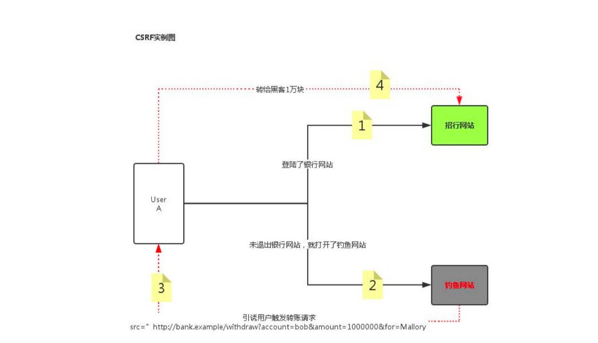
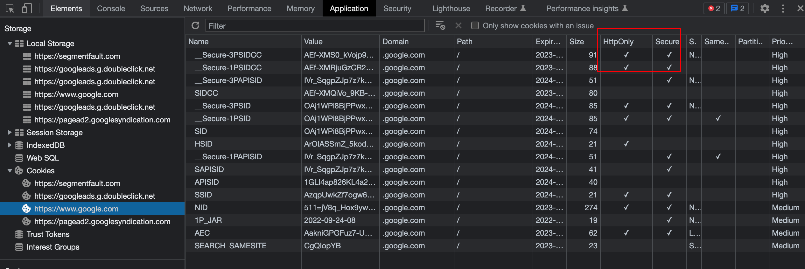
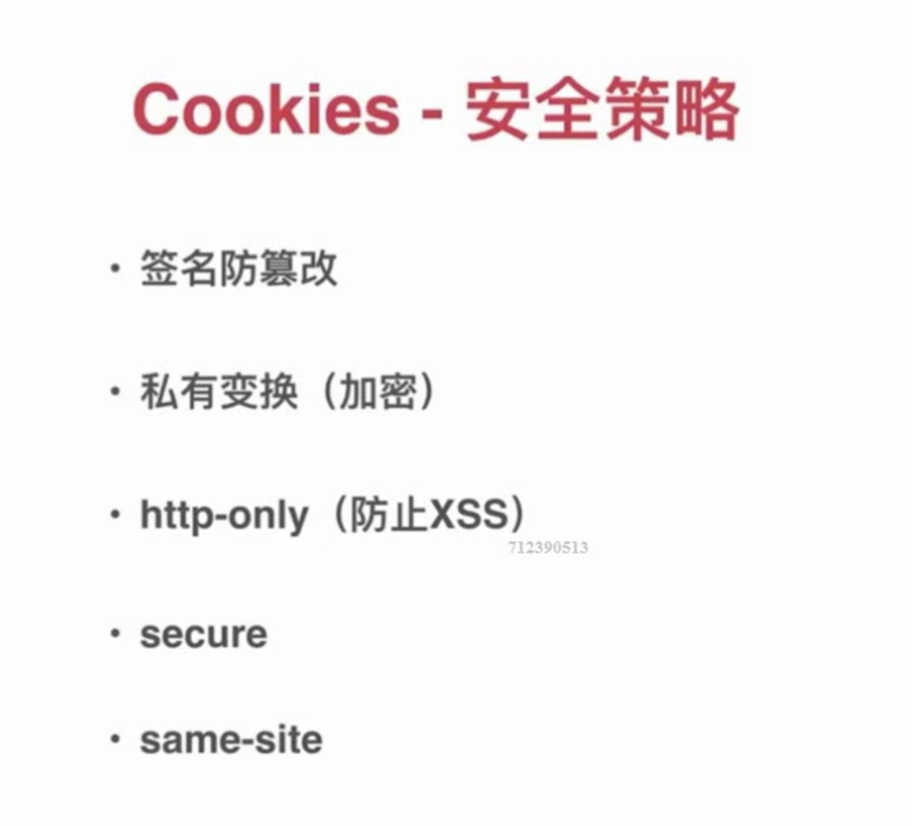
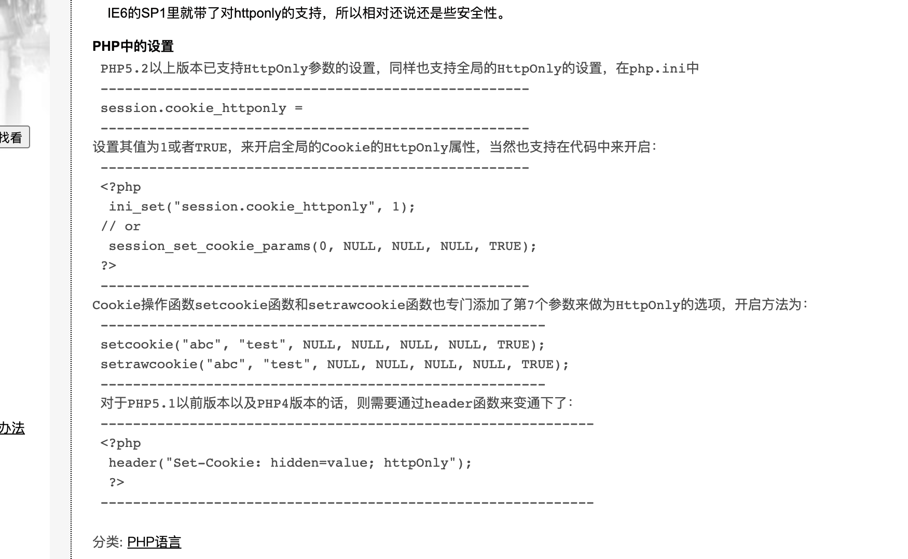
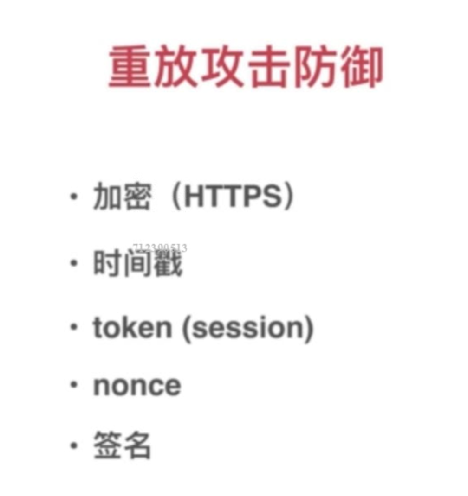
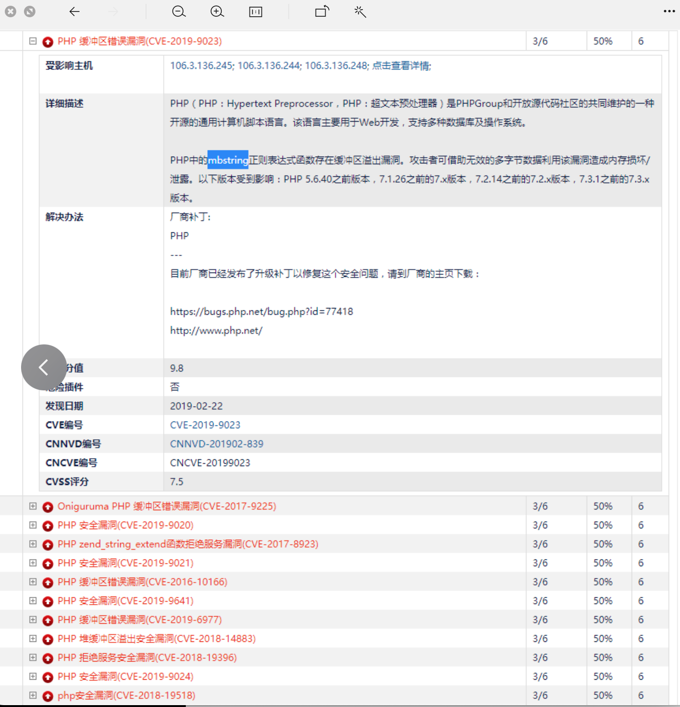

## 1.防止cc攻击

1.用redis封禁ip.

```php
public function handle($request, \Closure $next)
    {
        $ip = get_client_ip();
        $ip_arr = explode('.',$ip);
        $ip = $ip_arr[0].'.'.$ip_arr[1].'.'.$ip_arr[2];
        //查询ip是否被封禁
        $lock_ip = redis()->get(CacheKey::LOCK_REQUEST_IP.$ip);
        if($lock_ip){
            return returnJson(Status::IS_CC,lang('is_cc'));
        }
        //设置监控变量
        $cur_time = time();
        $refresh = '300'; //刷新次数
        $ip_data = redis()->get(CacheKey::REQUEST_IP.$ip);
        if($ip_data){
            $ip_data = json_decode($ip_data,true);
            if($ip_data['refresh_times'] > $refresh){
                //封禁
                redis()->set(CacheKey::LOCK_REQUEST_IP . $ip, $ip);
                redis()->expire(CacheKey::LOCK_REQUEST_IP . $ip, 3600);
                return returnJson(Status::IS_CC,lang('is_cc'));
            }else {
                $ip_data['refresh_times'] += 1;
                redis()->set(CacheKey::REQUEST_IP . $ip, json_encode($ip_data));
                redis()->expire(CacheKey::REQUEST_IP . $ip, 60 - (time()-$ip_data['last_time']));
            }
        }else{
            $data = [];
            $data['refresh_times'] = 1;
            $data['last_time'] = $cur_time;
            redis()->set(CacheKey::REQUEST_IP.$ip,json_encode($data));
            redis()->expire(CacheKey::REQUEST_IP.$ip,60);
        }
        return $next($request);
    }
```

2.接口做签名验证

```php
class Sign
{
    // 不校验签名接口
    protected $not_check = [
        '/api/checkExchange',
        '/api/rechargeCheck',
        '/api/examineExchange',
        '/api/authAudit',
        '/api/revoke',
        '/api/adjustMuToMcRate',
        '/api/task/updatePerformance',
        '/api/task/updateNodeLevel',
        '/api/task/setNode',
        '/api/task/setAddr',
        '/api/task/getEthAddress',
        '/api/task/getTrxAddress',
        '/api/task/recommend',
        '/api/task/readOrderCvs',
        '/api/task/releaseDynamicBonus',
        '/api/task/reissueExceptionBonus',
        '/api/task/autoCreateTable',
        '/api/task/getOrderFile',
        '/api/task/updateUserStatus',
        '/api/task/findExBonus',
        '/api/rechargeCallback',
        '/api/withdrawCallback',
        '/api/uploadImg',
        '/api/getImgCode',
        '/api/uploadImages',
        '/api/lockUser',
    ];
    protected $secret = "jvyaK9SRmGZRLFiY";

    /**
     * 处理请求
     * @param \think\Request $request
     * @param \Closure $next
     */
    public function handle($request, \Closure $next)
    {
        $param = $request->param();
        $route = $request->url();

        $module = $request->module();
        // 获取图形验证码
        if (strstr($route, 'getImgCode')) {
            return $next($request);
        }
        if (!in_array($route, $this->not_check) && $module != 'admin') {
            if (!isset($param['timestamp']) || empty($param['timestamp'])) {
                return returnJson(Status::PARAM_ERR, lang('sign_param_err'));
            }
            if (!isset($param['sign']) || empty($param['sign'])) {
                return returnJson(Status::PARAM_ERR, lang('sign_param_err'));
            }
            // 验证请求,1分钟有效
            if (time() - $param['timestamp'] > 60) {
                return returnJson(Status::SIGN_OVERDUE, lang('Signature expired'));
            }
            // 兼容TP不同版本
            if (isset($param['s'])) {
                unset($param['s']);
            }
            $sign = $param['sign'];
            unset($param['sign']);
            ksort($param);
            $params = urlencode(urldecode(http_build_query($param)));
            // $secret是通过key在api的数据库中查询得到
            $sign2 = md5($params . $this->secret);
            if ($sign != $sign2) {
                return returnJson(Status::SIGN_FAIL, lang('Signature error'));
            }
        }
        return $next($request);
    }
}
```

## 2.防止ddoc攻击,买防御

Dos （deny of service ）拒绝访问服务攻击

ddos是分布式拒绝访问服务攻击。

防御措施
1.接入防火墙，过滤到一部分恶意的请求。
2.接入高防ip。
3.静态资源走cdn。
4.封禁掉恶意ip。

cdn第一层，阿里云的防火墙第二层，第三层才是业务服务器。不能暴露业务服务器。

## 3.sql注入

1.用框架封装好的方法查询。不要自己写原生语句查询。框架底层会自动过滤参数，可以防止sql注入。如果有些场景要自己写原生语句时，自己一定要过滤好参数。

2.用mysql的预处理机制也可以避免

```php
//没有进行预处理的版本，会被sql注入
header('content-type:text/html;charset=utf-8');
$username=$_POST['username'];
$psw=$_POST['psw'];
try {
	$pdo=new PDO('mysql:host=localhost;dbname=test','root','root');
	$sql="select * from user where username='{$username}' and password='{$psw}'";
	$stmt=$pdo->query($sql);//返回结果集中的行数echo 
	$stmt->rowCount();
} catch (Exception $e) {
	echo $e->getMessage();
}


//进行了预处理，可以防止sql注入
header('content-type:text/html;charset=utf-8');
$username=$_POST['username'];
$psw=$_POST['psw']; 
try {  
	$pdo=new PDO('mysql:host=localhost;dbname=test','root','root');  
	$sql="select * from user where username=? and password=?";  
	$stmt=$pdo->prepare($sql);  
	$stmt->execute(array($username,$psw));  
	echo $stmt->rowCount(); 
} catch (Exception $e) {  
	echo $e->getMessage(); 
}

mysql预处理机制，可以把一条有问题的sql，拆分成两条单独执行。
比如:SELECT `id`,`name` FROM `uf_member` WHERE  `id` = 12052 or 1 = 1
 
  
  //拆成第一条：
  SELECT `id`,`name` FROM `uf_member` WHERE  `id` = :ThinkBind_1_454319113_ 
    //第二条：
    array(1) {
  ["ThinkBind_1_454319113_"]=>
  array(2) {
    [0]=>
    string(14) "12052 or 1 = 1"
    [1]=>
    int(1)
  }
    
    其实sql注入，根本问题时mysql执行语句时，是执行一条sql后直接返回数据的。这样子，只有sql有问题，就会出现sql注入。如果拆开两条的话。
      1.而且一条有sql注入的sql语句，通过预处理后就会被拆成两条没有sql注入的语句。
      2.还可以有一次机会给mysql校验和转义。
      比如执行了第一句预处理的sql后（`id` = :ThinkBind_1_454319113_ ），mysql就知道，你查的话是id字段，所以你第二条sql的数据，必须是数字。如果不是数字mysql就报错了。
      
      这样子有问题的sql，被拆成两条sql单独执行，就不会出现sql注入的问题。
}
  
  

```

3.对用户提交的参数，进行严格的过滤。比如$id = '11130 or 1=1'，如果过滤的不清楚的话，会查出所有的用户资料。此是可以将$id进行类型转化。$id = (int) $id;即可


## 4.csrf攻击

什么是csrf攻击？




比如上图中的招行网站收到一个来自（非本网站的请求）钓鱼网站的表单请求。

laravel中按照如下操作，即可防止

```
Laravel提供了一个全局帮助函数csrf_token来获取该Token值，因此只需在视图提交表单中添加如下HTML代码即可在请求中带上Token：
<input type="hidden" name="_token" value="<?php echo csrf_token(); ?>">
<input type="hidden" name="_token" value="{{csrf_token()}}">

```

表单，带一个token即可。

在ThinkPHP中称之为表单令牌。


如何是http链接，是可以被抓包拿到对应的token的。加上https可以防止此情况。


## 5.xss


```
类似于sql注入，相当于html注入。在提交给服务器的html中，注入一段脚本。
XSS 即（Cross Site Scripting）中文名称为：跨站脚本攻击。XSS的重点不在于跨站点，而在于脚本的执行。那么XSS的原理是：
恶意攻击者在web页面中会插入一些恶意的script代码。当用户浏览该页面的时候，那么嵌入到web页面中script代码会执行，因此会达到恶意攻击用户的目的。那么XSS攻击最主要有如下分类：反射型、存储型、及 DOM-based型。 反射性和DOM-baseed型可以归类为非持久性XSS攻击。存储型可以归类为持久性XSS攻击。
```

如果没有富文本编辑器，可以使用转化的思想，用户htmlspecialchars函数，对数据进行转化。可以防止大部分xss攻击。但其实这个函数不能完全防住xss。


如果用户提交的数据是有富文本编辑器的话，含有html标签是正常的，此时不能用转化的思想了。应该使用过滤的思想。此时我们用htmlpurifier（第三方包）的remove_xss函数即可。

```
composer require ezyang/htmlpurifier
```

富文本编辑器内容，使用过滤的思想进行处理。

比如商品描述字段，处理如下：

//商品添加或修改功能中
$params = input();
//单独处理商品描述字段 goods_introduce
$params['goods_desc'] = input('goods_desc', '', 'remove_xss');


## 6.cookies安全





```
cookie
1.设置http-only属性 ，只有http能读写cookie。其他方式是不能读写的。比如js方式直接读取cookies

2.设置secure属性，则代表只能在https下的请求中，才可以读写cookie。
```




## 7.前端点击劫持

前端点击劫持攻击。听过内嵌网站引导用户点击对应的按钮。达到用户在不知情的情况下点击了网站的某些按钮。比如第三方网站内嵌了网站A，并且把网址A的透明度设置为0。第三方网站是一个美女聊天的页面。诱导用户点很多地方。如果用户被诱惑点了就会出问题。

以后一些敏感操作时一定要增加邮箱验证码或者图形验证码的验证。


防御方法是设置X—FRAMEO—PTIONS属性，为DENY（还有其他属性）。表示禁止被任何网站的内嵌。

PHP也可以设置x—frame—options的请求头。


## 8.传输层数据被窃听和篡改的危险

http协议默认是明文传输的。数据，在传输时可以被经过的设备，代理等中间节点看到，甚至修改。

使用https协议，对数据进行加密即可。


## 9.密码安全问题

一定要用单向加密的哈希算法，即使数据库被盗，也不会泄露用户密码。

哈希算法具有雪崩效应。原文修改一个字母，加密后的密文字符串区别很大。


## 10.文件上传攻击

1.类型检查 文件的mime类型。
2.文件后缀检查。
3.文件内容检查。如果包含php等字样，那就是恶意攻击。
4不要给上传的文件赋予执行权限。可写和可执行权限要互斥。（不能给上传的文件，赋予执行权限。只能可以读和可写。防止文件被执行）


```
本文为夜雨闻铃原创文章,转载无需和我联系,但必须注明文章出处！！！
文章出处：夜雨闻铃的思否文章(https://segmentfault.com/a/1190000040995044)

https://segmentfault.com/a/1190000040995044
```


## 11.用户资料泄露

使用oauth授权机制。经过用户的同意后返回一个access_token给第三方。第三方拿着access_token去拿用户的某些数据。


## 12.重放攻击

某一个请求被抓取了，然后被黑客恶意的多次发送，造成用户重复下单的操作。需要使用https加密，并且加入时间戳参数和签名参数。相同时间戳的请求就不处理了。签名是防止数据被篡改。

在一些支付，抽奖 投票等重要操作时一定要加。防止多次下单，购买等操作




## 13.php安全问题


